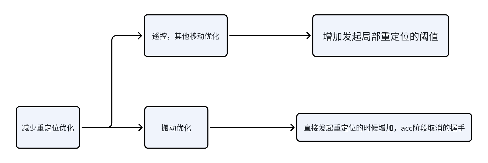

# versa 重定位优化

目前考虑，搬起对lidar无感；**关闭lidar比较严重**；基于这个前提下；

## 1. 结论：

闫冬流程图&测试结果

[ 取消重定位算法流程及测试结果](https://roborock.feishu.cn/wiki/FQ2hwK73YizmxIkNIepc802DnNd?from=from_copylink)

## 2. 定位模式：

### 2.1 设计思想：

1. 导航维持原来的发起逻辑不变；

2. 增加局部重定位的发起阈值；

3. 增加**acc 全局重定位**的开始时候，定位判断扛得住(定位内部设计逻辑)，反馈取消的逻辑，正向减少；

### 2.2 流程：

1. **定位收到暂停**信号：

   1. Slam的修改工作： 在定位模式下，不管暂停与否，有lidar，内部都计算下；这样搬动与否无关；&#x20;

2. **收到恢复，或者直接收到全局重定位acc(无暂停搬起等)**&#x4FE1;号：

   1. 如果导航发起**局部重定位**；slam 局部搜索，还是原来逻辑；（导航需要：**1弧度，70cm内**发起局部重定位；阈值升级下，改成单指令）&#x20;

   2. 如果后面导航发起**全局重定位**，定位和导航只需要增加**取消重定位的字段** 交互即可；我们看下当前匹配情况如何（会考虑Lidar关闭等） &#x20;

      1. 匹配度ok，就在acc阶段，返回一个新的**取消重定位的字段，说明我们扛得住**；不用转圈，继续走就行；

      2. 匹配不行，**继续重定位**

   **(目前使用重定位prepare字段信息，若重定位prepare字段返回false，导航取消本次重定位，否则继续进行重定位）**

   

   * 如果后面导航没有发起重定位，定位判断不太行，可以兜底，发起主动重定位；

## 3. 建图模式：(lidar统一不关闭了；只有断流有影响)

### 3.1 流程：

1. **新增加局部重定位：**&#x5BFC;航在断流恢复后，发下局部重定位；一个指令的set pose即可；（和定位这个一致，不过都改成单指令，现在是三个指令，有多余的，切换模式和加载地图）-->**扩展建图和建图模式**

2. 搬起已有建图失败，无需处理；

4\. 定位模式：主动重定位接口
可以设计好预留，目前定位无触发逻辑，后续可扩展；
------------------------

## 5. 对导航其他潜在需求：导航自行评估即可，一闪而过也是正常吧

1. 显示可能有点乱? 需要导航评估处理下；一闪而过这种问题；

   1. 需要，导航在局部重定位的时候，app不提醒；但是不能遥控？

   2. 需要，导航在acc 没有反馈之前，app显示不进入重定位状态；

   a应该之前丽娜提过，做过一部分；

   b导航给状态机发\*\*\*状态，下移动一下就行；

## 6. 好处：

1. **平滑 演进，引入问题少，可控**

2. **最大限度的减少重定位次数，能抗住就不重定位**；

3. 能兜底部分逻辑遗漏

4. 后面的优化空间更大；只需要slam自己算法升级即可;

