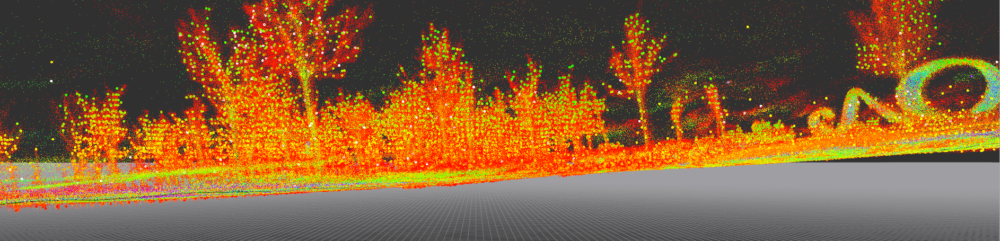
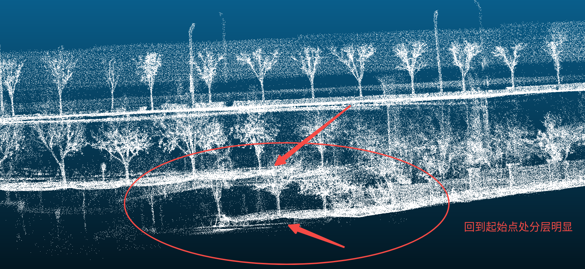

# 外场采集可用数据

### 总结：

1. 协定采集25组外场数据，当前已经获取到24组；（还差第21号场地，但是前五组我想进一步复核）。

2. 其中真正有问题的数据只有11号场地的数据，问题原因是该场地面积过大（严重超出产品定义面积）。

3. 有点儿轻微问题、需要在Versa上解决是的数据是7号场地，需要加上回环功能解决该问题。

4. 第21号场地，第二遍采集到的数据可以用于验证重力对齐：

|      场地号 | 文件名        | pcd文件                   | 是否正常                                                                                                                                                                                     | 面积（外包统计）                               |
| -------- | ---------- | ----------------------- | ---------------------------------------------------------------------------------------------------------------------------------------------------------------------------------------- | -------------------------------------- |
| 1        |            |                         |                                                                                                                                                                                          |                                        |
| 2        |            |                         |                                                                                                                                                                                          |                                        |
| 3        |            |                         |                                                                                                                                                                                          |                                        |
| 4        |            |                         |                                                                                                                                                                                          |                                        |
| 5        |            |                         |                                                                                                                                                                                          |                                        |
| 6        | 1组         |                         | 结果正常                                                                                                                                                                                     | 800平米左右                                |
| 7        | 2组         |                         | 第一组需要使用回环分支运行；可闭环&#xA;第二组数据有断流，但是使用dev分支代码就行，不需要回环&#xA;&#xA;（注：此数据可以用于检测回环算法）                                                                                                            | 2000平米左右                               |
| 8        | 1组         |                         | 结果正常                                                                                                                                                                                     | 2200平米左右                               |
| 9        | 2组         |                         | &#xA;结果正常                                                                                                                                                                                | 3000平米                                 |
| 10       | 2组         |                         | &#xA;结果正常                                                                                                                                                                                | 3200平米                                 |
| 11       | 2组         |                         | 这两组数据无论是使用dev分支还是回环分支都没能解决无法回环的问题，原因是面积过大，15000平米。&#xA;（注：累积误差积累过大，导致回环无法修正回来，此数据以后可用于验证极端场景测试以及回环验证） | 2600平米（个人存疑：在cloudcompare中评估大概15000平米） |
| &#xA;12  | 2组         |                         | 结果正常                                                                                                                                                                                     | 2400平米                                 |
| 13       | 2组         |                         | 结果正常                                                                                                                                                                                     | 2000平米左右                               |
| 14       | 2组         |                         | 结果正常                                                                                                                                                                                     | 2500平米左右                               |
| 15       | 2组         |                         | 结果正常                                                                                                                                                                                     | 2000平米                                 |
| 16       | 2组         |                         | 结果正常                                                                                                                                                                                     | 2400平米                                 |
| 17       | 2组（其中一组被拒  |                         | 结果正常                                                                                                                                                                                     | 1800平米（含房子300平米）                       |
| 18       | 2组（其中一组被拒） |                         | 结果正常                                                                                                                                                                                     | 2700平米                                 |
| 19       | 2组         |                         | 结果正常                                                                                                                                                                                     | 1800平米                                 |
| 20       | 2组（其中一组被拒） |                         | 结果正常                                                                                                                                                                                     | 2300平米（通过接收的数据面积）                      |
| 21       | 2组（其中一组被拒） | 另一组重新采集的21场地数据12.17下午采集 | 被拒这组数据加结果没问题，但场景过于简单                                                                                                                                                                     | 等待重新采集数据到来                             |
| 22       | 2组         |                         | 结果正常                                                                                                                                                                                     | 1800平米                                 |
| 23       | 2组         |                         | 结果正常，地面有些许倾斜，可以用于验证重力对齐效果                                                                                                                                                                | 1600～1800平米                            |
| 24       | 2组         |                         | 结果正常，地面有些许倾斜，可以用于验证重力对齐效果                                                                                                                                                                | 2200平米                                 |
| 25       | 2组         |                         | 结果正常                                                                                                                                                                                     | 2700平米                                 |
|          |            |                         |                                                                                                                                                                                          |                                        |
|          |            |                         |                                                                                                                                                                                          |                                        |
