# 激光 (flollow rtk)旧的，遗弃

# 1. 机器选择：

两个较为极限的机器：

5m准度绝对值 47MCN8N0034715 对应整机:  7011023X154219020（完成）

~~5m精度极限：ARMCNA80033166  对应整机: 7011023X154230001（待采集）~~

# 2. 简介：

1. 形式：统一导轨测试

2. 要求：需要采集到激光和激光的Imu的数据；和正常数据采集是一样的；

   1. 需要在导轨上开始，机器在导轨上不要动，固定ok;

   2. 结束也要在导轨上；

   3. 每组数据20个来回，或20圈；

# 3. 测试结果：

## 3.1 精度计算方法说明

精度计算流程如下：

1. 对SLAM轨迹进行**直线或圆形拟合**；

2. 计算各点到拟合轨迹的距离误差；

3. 对误差进行**3σ（3倍标准差）范围统计**；

4. 取该区间的**均值除以2**作为最终精度指标。

## 3.2 整机:  7011023X154219020测试结果：

#### 3.2.1 **总体精度水平**

* 所有场景的3σ精度均在**0.014～0.036 m**之间，整体表现优良，满足高精度定位需求

#### 3.2.2 **速度对精度的影响**

* 在**直线轨迹**下，从 0.4 m/s → 0.8 m/s，平均精度从 0.0236 m 提升至 0.0222 m，差异很小，可认为速度对直线场景的影响**不显著**。

* 在**圆形轨迹**下，速度从 0.4 m/s → 0.8 m/s 时，平均精度从 0.0187 m 降至 0.0311 m，说明**高速转弯运动对SLAM精度有一定影响**。

#### 3.2.3 **轨迹形状对精度的影响**

* 同速对比（0.4 m/s）：圆形轨道平均精度和直线轨道（0.0187 m vs 0.0236 m）差异较小，可认为两者精度**基本一致**。

* 同速对比（0.8 m/s）：直线轨道优于圆形轨道（0.0222 m vs 0.0311 m），表明高速曲线运动定位精度会略下降。

  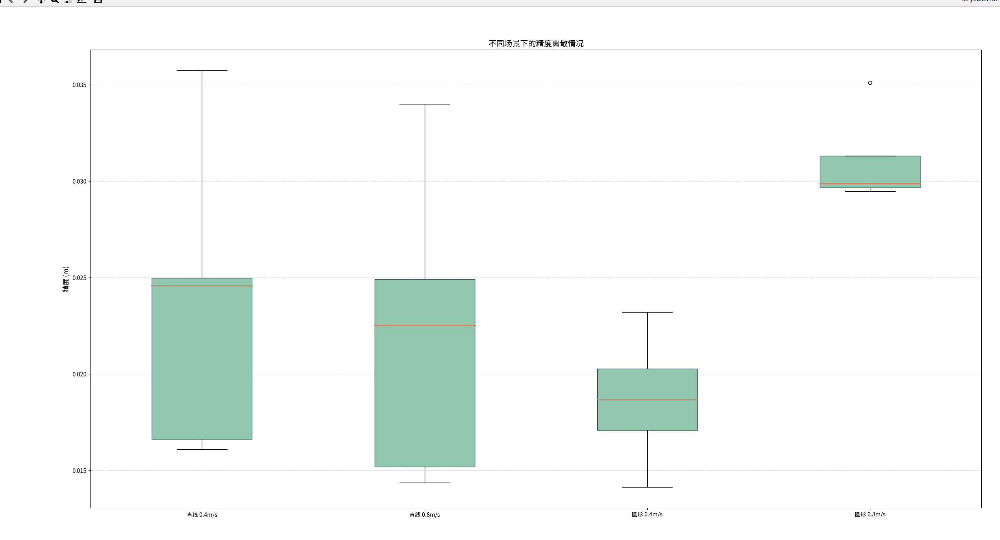

&#x20;                                                                               精度离散情况图  （红线为平均精度）  &#x20;

## 3.3 整机: 7011023X154230001测试结果

**机器数据待采集**

# 4. 数据采集需求

**每一台机器都按照下面直线和圆形轨道数据采集，总共36组数据**

## 4.1 直线轨道：

分别在下面每个场景以0.4及0.8 m/s的速度进行采集，每组数据20个来回，并给出轨道长度；&#x20;

| 场景id | 场景图                                                                                  | 说明               | 轨道长度 | 数据地址   |        |   |
| ---- | ------------------------------------------------------------------------------------ | ---------------- | ---- | ------ | ------ | - |
|      |                                                                                      |                  |      | 0.4m/s | 0.8m/s |   |
| 点位1  |  | 理想环境             |      |        |        |   |
| 点位2  |  | 双面墙              |      |        |        |   |
| 点位3  |   | 湖边（沿着湖边方向部署直线轨道） |      |        |        |   |
| 点位4  | 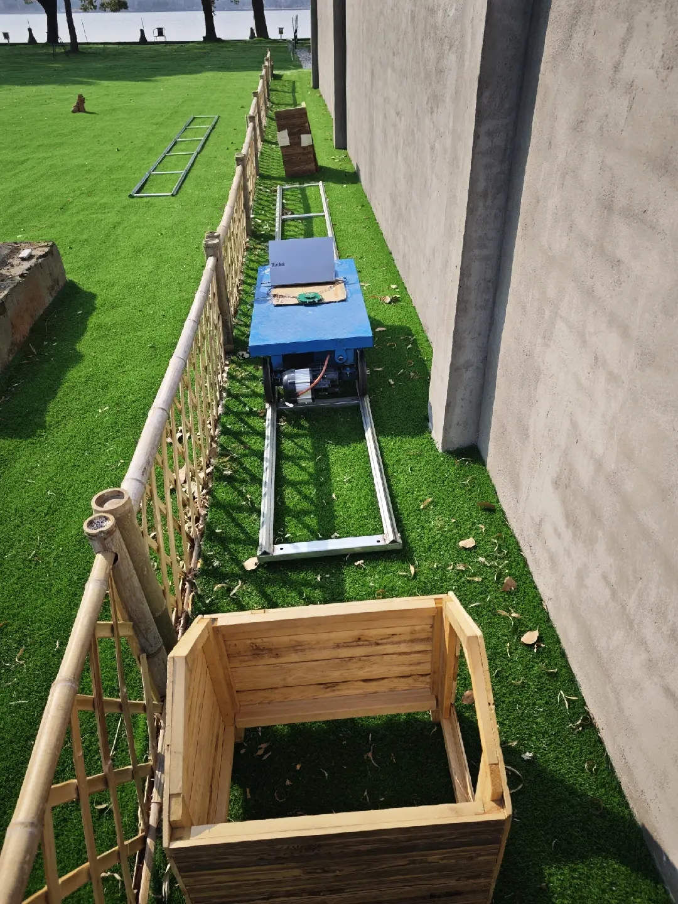 | 单面墙+篱笆           |      |        |        |   |
| 点位5  |  | 建筑物 车库铁门边        |      |        |        |   |

## 4.2 圆形轨道：

分别在下面每个场景以**0.4&#x20;**&#x53CA; **0.8m/s**的速度进行采集，每组数据采集**20**圈，并给出轨道的半径

| 场景id | 场景图                                                                                  | 说明        | 轨道半径 | 数据地址   |        |   |
| ---- | ------------------------------------------------------------------------------------ | --------- | ---- | ------ | ------ | - |
|      |                                                                                      |           |      | 0.4m/s | 0.8m/s |   |
| 点位1  |  |  L l角落    |      |        |        |   |
| 点位2  |  | 一面墙，另一面竹林 |      |        |        |   |
| 点位3  |  | 理想环境      |      |        |        |   |
| 点位4  |  | 湖边及树下     |      |        |        |   |

# 5. 整机:  7011023X154219020 测试结果

## 5.1 圆形轨道：

分别在下面每个场景以**0.4&#x20;**&#x53CA; **0.8m/s**的速度进行采集，测试结果如下表：

| 场景id | 场景图/点云图                                                                                                                                                                 | 说明        | 轨道半径                | 评估结果                                                                                                                                                                                                                                   |                                                                                                                                                                                                                                        | 日志     |        |
| ---- | ----------------------------------------------------------------------------------------------------------------------------------------------------------------------- | --------- | ------------------- | -------------------------------------------------------------------------------------------------------------------------------------------------------------------------------------------------------------------------------------- | -------------------------------------------------------------------------------------------------------------------------------------------------------------------------------------------------------------------------------------- | ------ | ------ |
|      |                                                                                                                                                                         |           |                     | 0.4m/s                                                                                                                                                                                                                                 | 0.8m/s                                                                                                                                                                                                                                 | 0.4m/s | 0.8m/s |
| 点位1  | 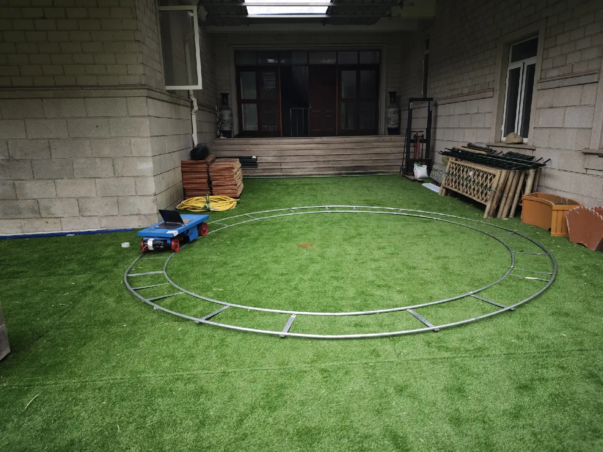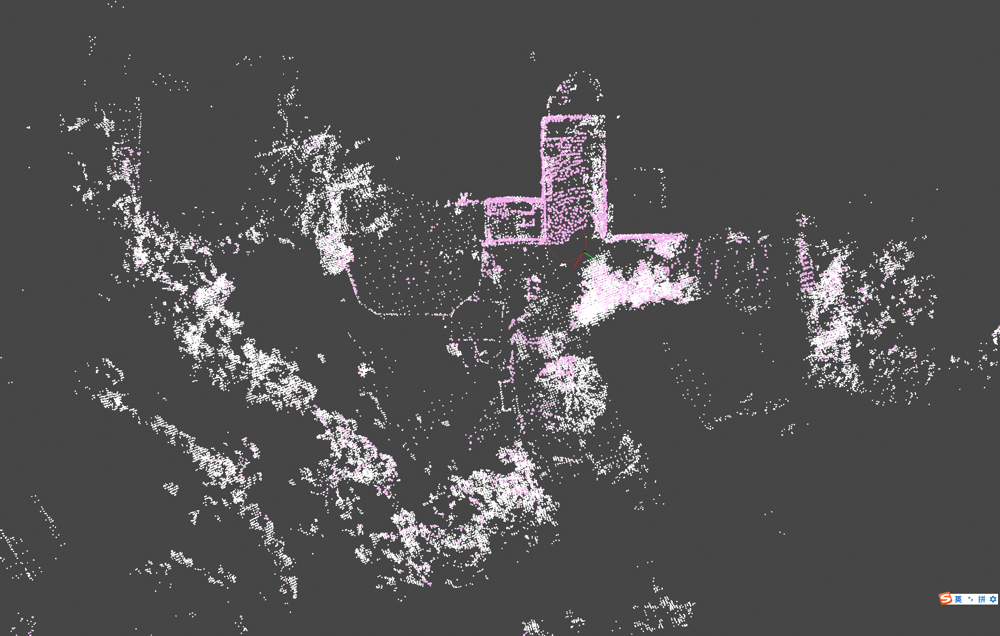 |  L l角落    | 圆轨外圆直径4.4m，内圆直径3.6m | 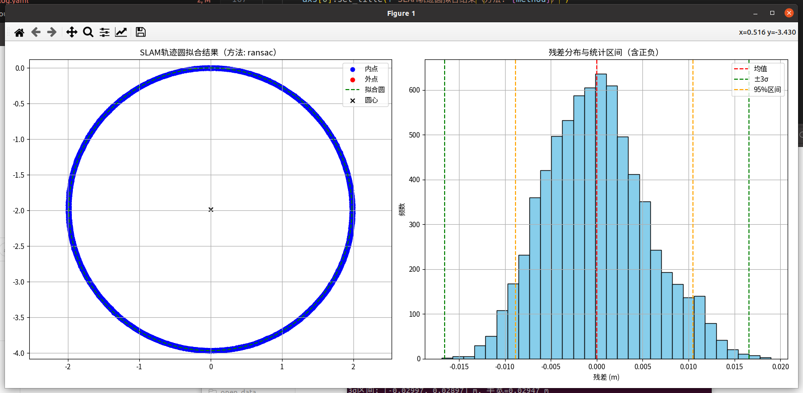                                                                                                                                                    | 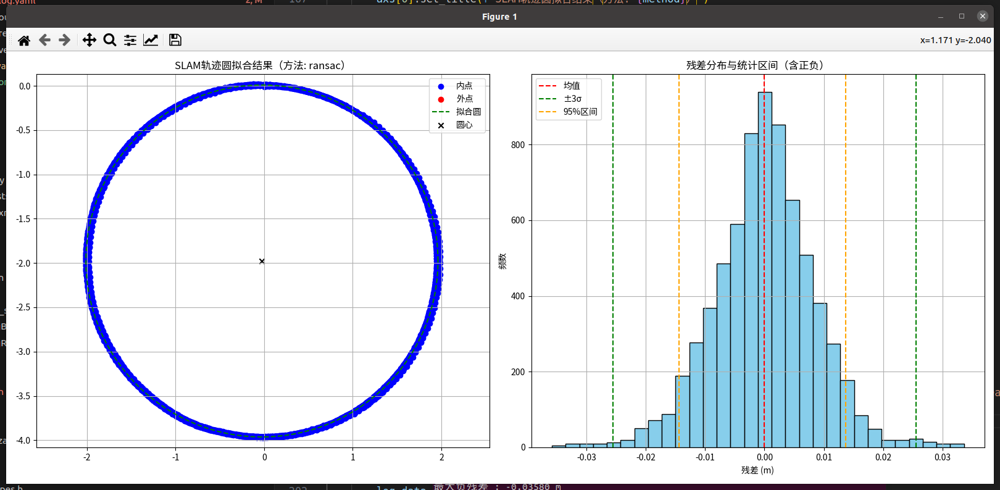                                                                                                                                                    |        |        |
|      |                                                                                                                                                                         |           |                     | 【拟合方法】：ransac拟合圆心   : (-0.002, -1.984)拟合半径   : 1.984 m平均残差   : 0.00000 m标准差(σ)  : 0.00552 m最大正残差 : 0.01898 m最大负残差 : -0.01691 m2σ区间: \[-0.00885, 0.01049] m, 半宽=0.00967 m3σ区间: \[-0.01282, 0.01549] m, 半宽=0.01415 m内点数量   : 7153 / 7153 | 【拟合方法】：ransac拟合圆心   : (-0.024, -1.977)拟合半径   : 1.986 m平均残差   : 0.00000 m标准差(σ)  : 0.00851 m最大正残差 : 0.03360 m最大负残差 : -0.03580 m2σ区间: \[-0.01441, 0.01369] m, 半宽=0.01405 m3σ区间: \[-0.02997, 0.02897] m, 半宽=0.02947 m内点数量   : 7027 / 7027 |        |        |
| 点位2  |  | 一面墙，另一面竹林 | 圆轨外圆直径4.4m，内圆直径3.6m | 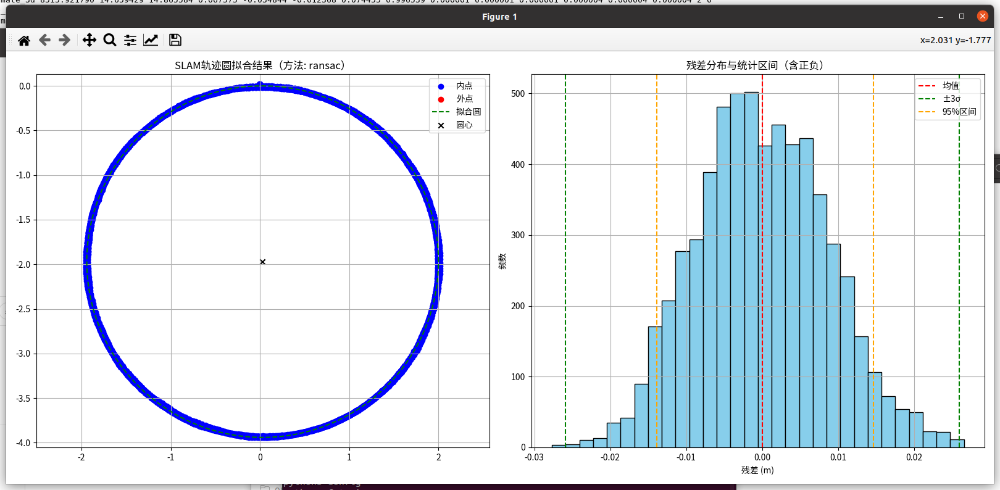                                                                                                                                                    | 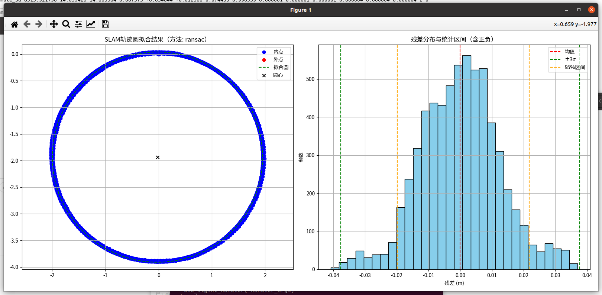                                                                                                                                                    |        |        |
|      |                                                                                                                                                                         |           |                     | 【拟合方法】：ransac拟合圆心   : (0.028, -1.971)拟合半径   : 1.970 m平均残差   : 0.00000 m标准差(σ)  : 0.00863 m最大正残差 : 0.02653 m最大负残差 : -0.02768 m2σ区间: \[-0.01387, 0.01464] m, 半宽=0.01426 m3σ区间: \[-0.02232, 0.02410] m, 半宽=0.02321 m内点数量   : 6146 / 6146  | 【拟合方法】：ransac拟合圆心   : (-0.020, -1.934)拟合半径   : 1.975 m平均残差   : 0.00000 m标准差(σ)  : 0.01257 m最大正残差 : 0.03702 m最大负残差 : -0.04081 m2σ区间: \[-0.01988, 0.02176] m, 半宽=0.02082 m3σ区间: \[-0.03601, 0.03420] m, 半宽=0.03511 m内点数量   : 6398 / 6398 |        |        |
| 点位3  | 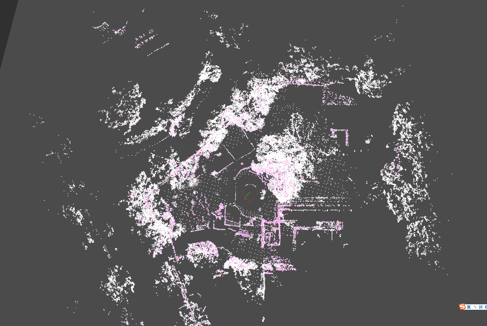 | 理想环境      | 圆轨外圆直径4.4m，内圆直径3.6m | 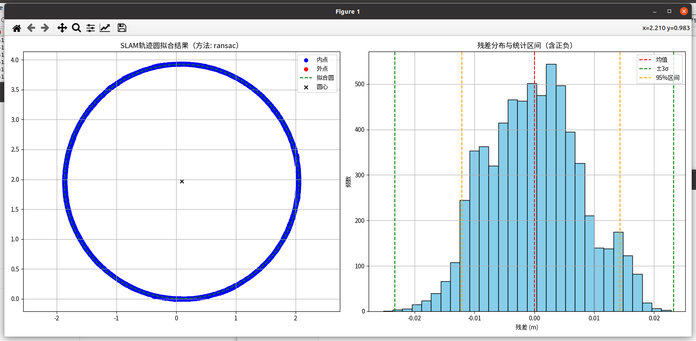                                                                                                                                                    |                                                                                                                                                     |        |        |
|      |                                                                                                                                                                         |           |                     | 【拟合方法】：ransac拟合圆心   : (0.094, 1.965)拟合半径   : 1.961 m平均残差   : 0.00000 m标准差(σ)  : 0.00775 m最大正残差 : 0.02280 m最大负残差 : -0.02522 m2σ区间: \[-0.01208, 0.01428] m, 半宽=0.01318 m3σ区间: \[-0.01963, 0.01897] m, 半宽=0.01930 m内点数量   : 6526 / 6526   | 【拟合方法】：ransac拟合圆心   : (0.122, 1.977)拟合半径   : 1.960 m平均残差   : 0.00000 m标准差(σ)  : 0.01036 m最大正残差 : 0.05976 m最大负残差 : -0.05788 m2σ区间: \[-0.01697, 0.01691] m, 半宽=0.01694 m3σ区间: \[-0.03427, 0.02583] m, 半宽=0.03005 m内点数量   : 6674 / 6674   |        |        |
| 点位4  | 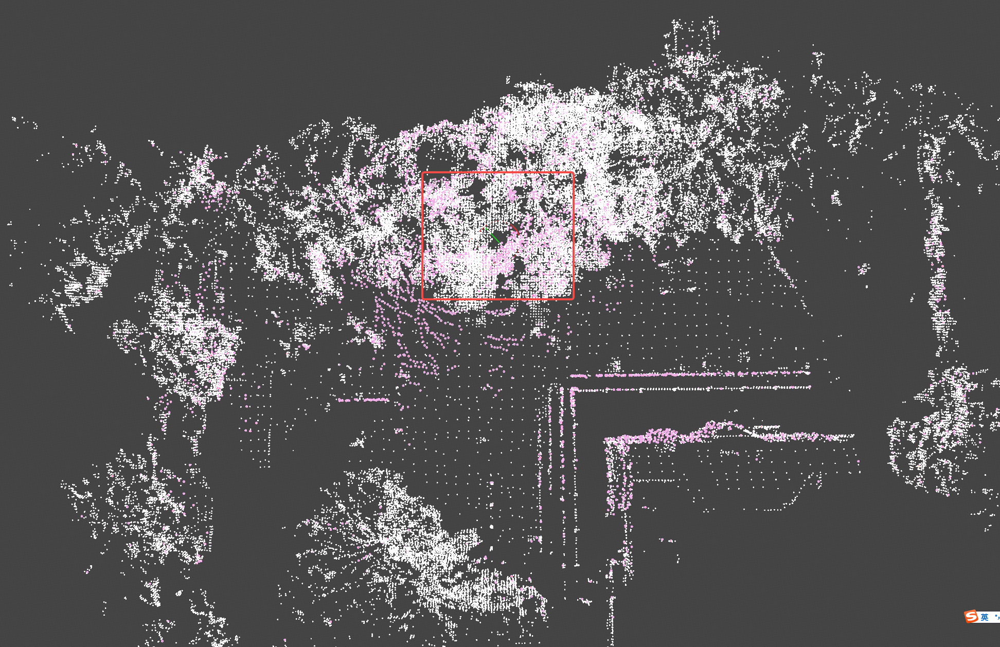 | 湖边及树下     | 圆轨外圆直径4.4m，内圆直径3.6m | 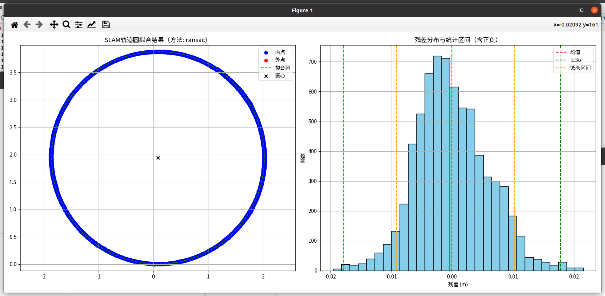                                                                                                                                                    | 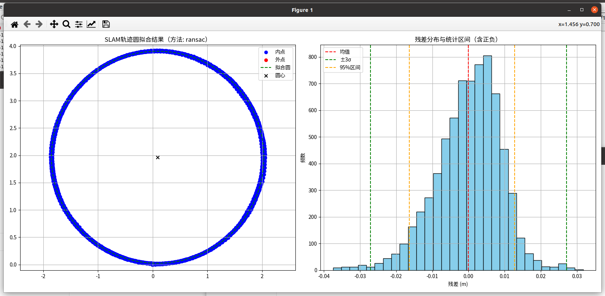                                                                                                                                                    |        |        |
|      |                                                                                                                                                                         |           |                     | 【拟合方法】：ransac拟合圆心   : (0.084, 1.944)拟合半径   : 1.939 m平均残差   : 0.00000 m标准差(σ)  : 0.00594 m最大正残差 : 0.02153 m最大负残差 : -0.01952 m2σ区间: \[-0.00911, 0.01031] m, 半宽=0.00971 m3σ区间: \[-0.01711, 0.01903] m, 半宽=0.01807 m内点数量   : 7119 / 7119   | 【拟合方法】：ransac拟合圆心   : (0.091, 1.965)拟合半径   : 1.941 m平均残差   : 0.00000 m标准差(σ)  : 0.00903 m最大正残差 : 0.03175 m最大负残差 : -0.03746 m2σ区间: \[-0.01632, 0.01283] m, 半宽=0.01457 m3σ区间: \[-0.03300, 0.02644] m, 半宽=0.02972 m内点数量   : 7070 / 7070   |        |        |

## 5.2 直线导轨：

直轨总长度10m，实际确保安全不足10m

| 场景id | 场景图                                                                                                                                                                     | 说明               | 评估结果                                                                                                                                                                                                                |                                                                                                                                                                                                                    | 日志     |        |
| ---- | ----------------------------------------------------------------------------------------------------------------------------------------------------------------------- | ---------------- | ------------------------------------------------------------------------------------------------------------------------------------------------------------------------------------------------------------------- | ------------------------------------------------------------------------------------------------------------------------------------------------------------------------------------------------------------------ | ------ | ------ |
|      |                                                                                                                                                                         |                  | 0.4m/s                                                                                                                                                                                                              | 0.8m/s                                                                                                                                                                                                             | 0.4m/s | 0.8m/s |
| 点位1  | 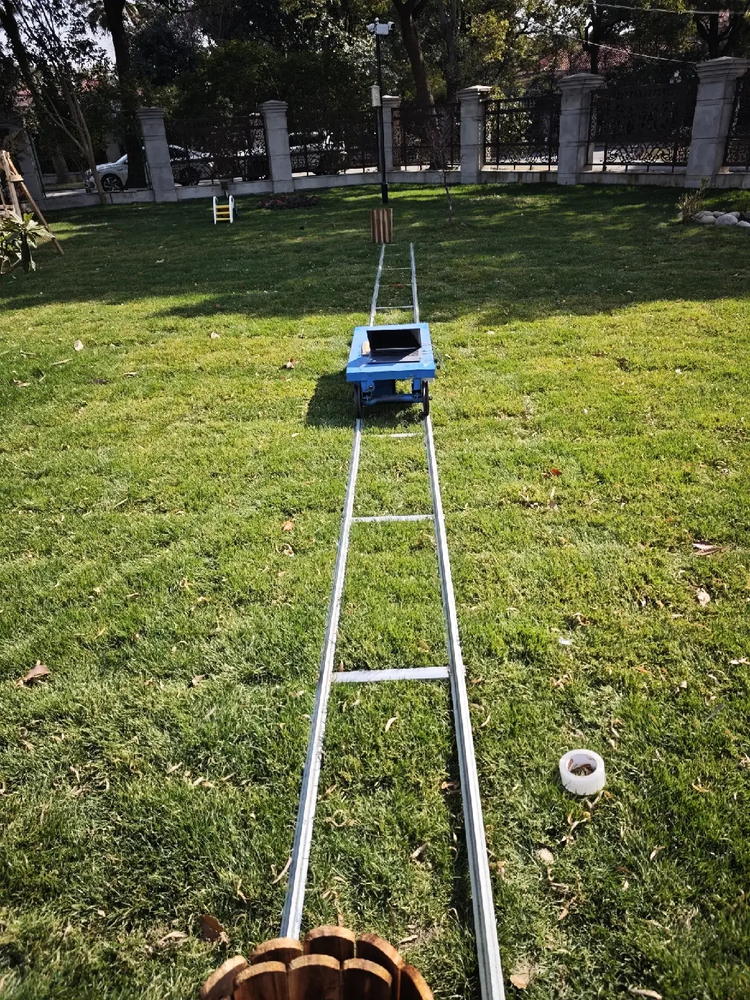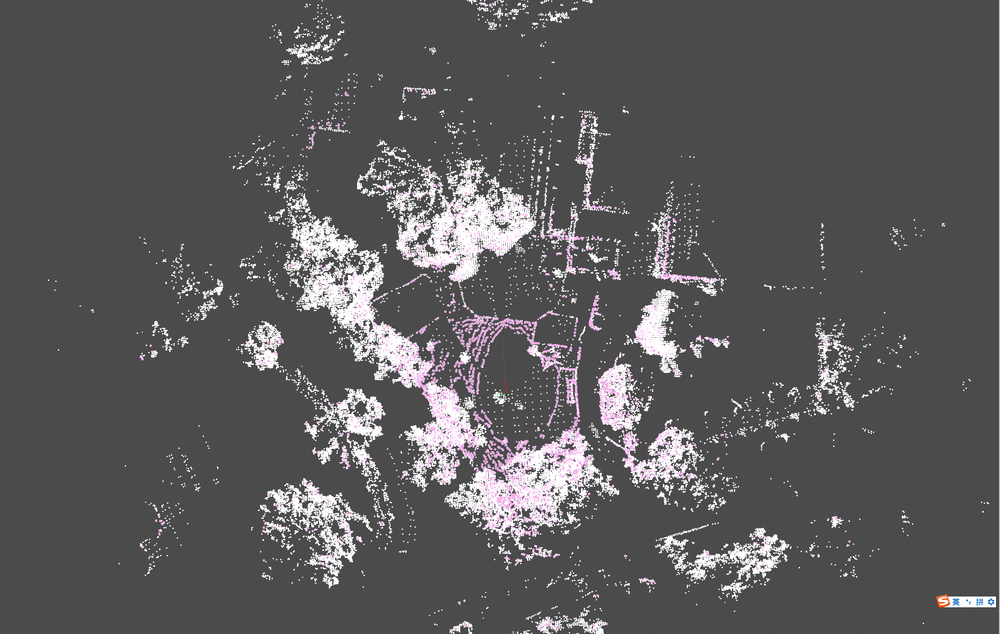 | 理想环境             | 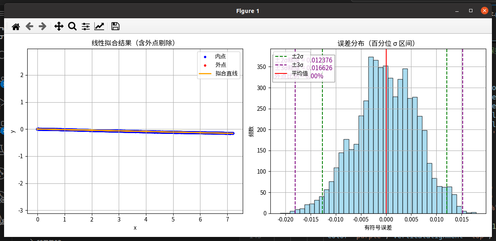                                                                                                                                 | 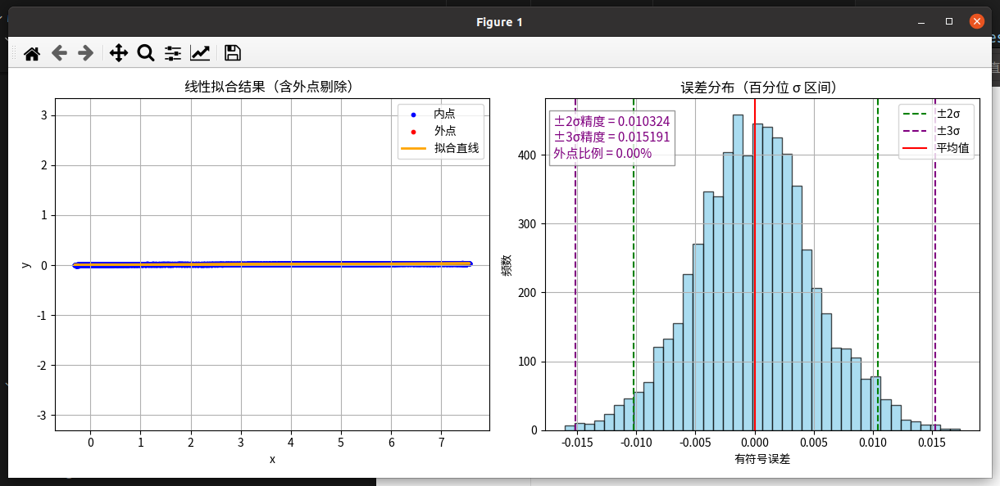                                                                                                                                |        |        |
|      |                                                                                                                                                                         |                  | 拟合结果：y = -0.0221 \* x + 0.0023RANSAC 内点比例: 100.00%剔除外点数量: 0 / 5688平均误差: -0.000000最大误差: 0.017864最小误差: -0.021047标准差 : 0.006118±2σ 区间: \[-0.012665, 0.012088] 精度为 0.012376±3σ 区间: \[-0.018026, 0.015226] 精度为 0.016626  | 拟合结果：y = 0.0033 \* x + 0.0093RANSAC 内点比例: 100.00%剔除外点数量: 0 / 6464平均误差: 0.000000最大误差: 0.017346最小误差: -0.016059标准差 : 0.005002±2σ 区间: \[-0.010198, 0.010450] 精度为 0.010324±3σ 区间: \[-0.015107, 0.015274] 精度为 0.015191   |        |        |
| 点位2  | 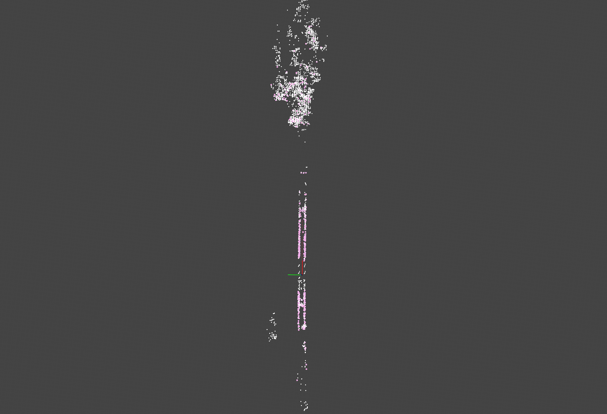 | 双面墙              | 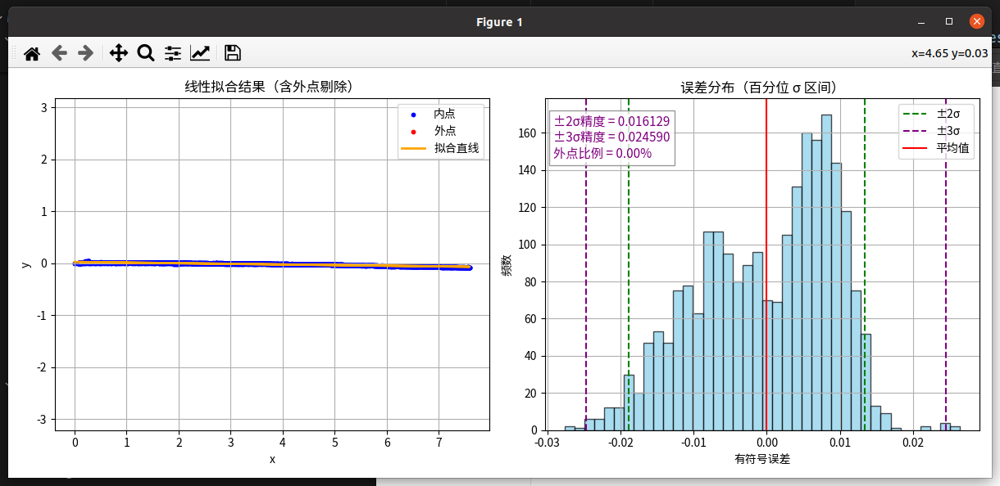                                                                                                                                 | 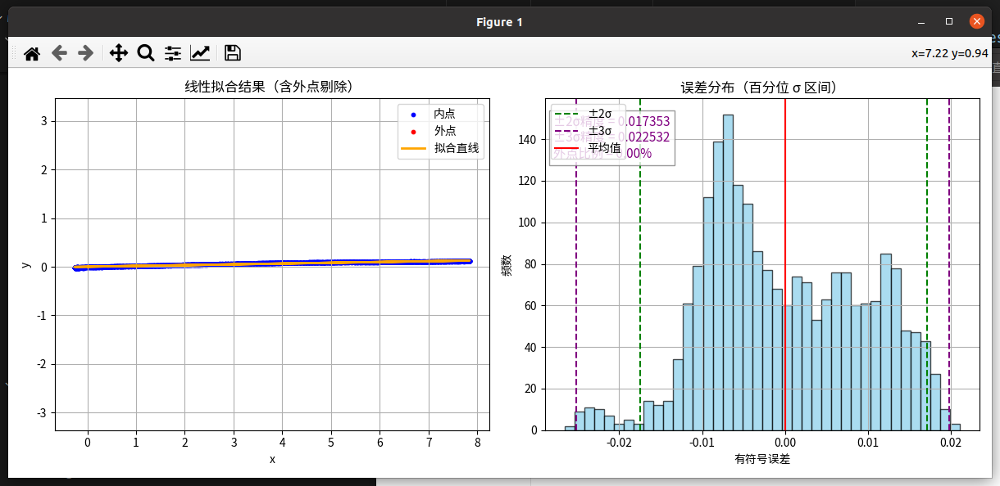                                                                                                                                |        |        |
|      |                                                                                                                                                                         |                  | 拟合结果：y = -0.0122 \* x + 0.0269RANSAC 内点比例: 100.00%剔除外点数量: 0 / 2307平均误差: 0.000000最大误差: 0.026383最小误差: -0.027636标准差 : 0.009169±2σ 区间: \[-0.018824, 0.013434] 精度为 0.016129±3σ 区间: \[-0.024663, 0.024516] 精度为 0.024590   | 拟合结果：y = 0.0161 \* x + 0.0013RANSAC 内点比例: 100.00%剔除外点数量: 0 / 2122平均误差: 0.000000最大误差: 0.021115最小误差: -0.026601标准差 : 0.009537±2σ 区间: \[-0.017494, 0.017212] 精度为 0.017353±3σ 区间: \[-0.025192, 0.019872] 精度为 0.022532   |        |        |
| 点位3  |   | 湖边（沿着湖边方向部署直线轨道） | 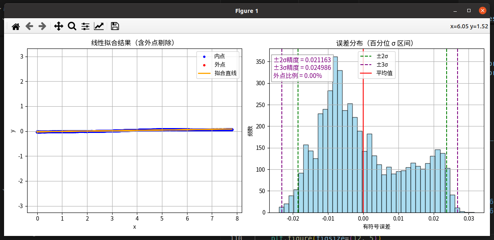                                                                                                                                 | 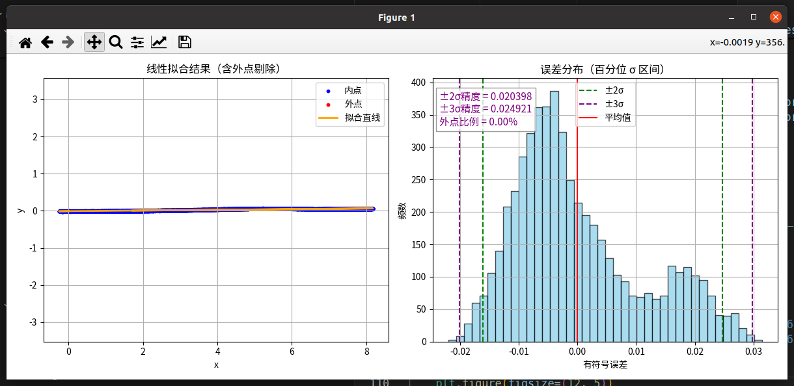                                                                                                                                |        |        |
|      |                                                                                                                                                                         |                  | 拟合结果：y = 0.0141 \* x + -0.0258RANSAC 内点比例: 100.00%剔除外点数量: 0 / 5148平均误差: 0.000000最大误差: 0.031546最小误差: -0.023940标准差 : 0.012255±2σ 区间: \[-0.018550, 0.023776] 精度为 0.021163±3σ 区间: \[-0.023083, 0.026890] 精度为 0.024986   | 拟合结果：y = 0.0091 \* x + -0.0079RANSAC 内点比例: 100.00%剔除外点数量: 0 / 5337平均误差: -0.000000最大误差: 0.031444最小误差: -0.022009标准差 : 0.010944±2σ 区间: \[-0.016153, 0.024644] 精度为 0.020398±3σ 区间: \[-0.020075, 0.029766] 精度为 0.024921 |        |        |
| 点位4  |  | 单面墙+篱笆           | 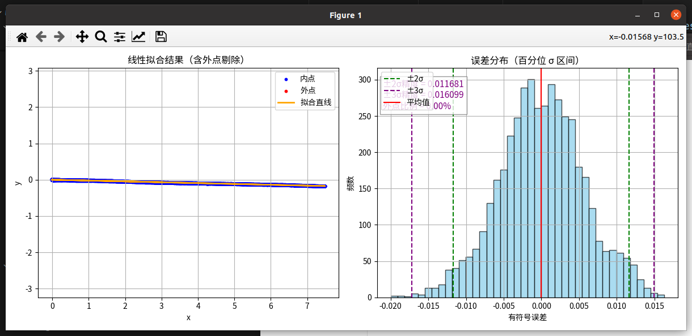                                                                                                                                 | 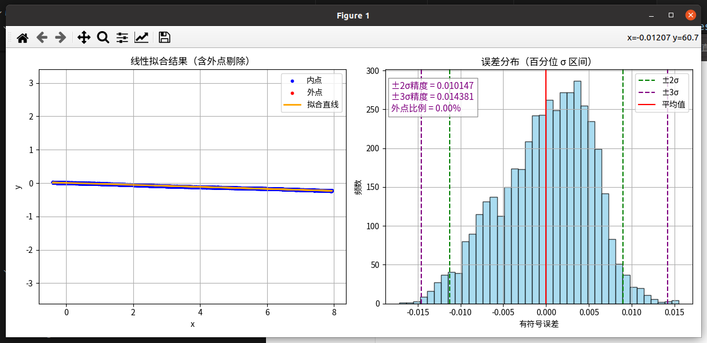                                                                                                                                |        |        |
|      |                                                                                                                                                                         |                  | 拟合结果：y = -0.0230 \* x + -0.0009RANSAC 内点比例: 100.00%剔除外点数量: 0 / 4400平均误差: -0.000000最大误差: 0.016304最小误差: -0.019993标准差 : 0.005607±2σ 区间: \[-0.011720, 0.011643] 精度为 0.011681±3σ 区间: \[-0.017213, 0.014985] 精度为 0.016099 | 拟合结果：y = -0.0298 \* x + 0.0055RANSAC 内点比例: 100.00%剔除外点数量: 0 / 4442平均误差: 0.000000最大误差: 0.015474最小误差: -0.017169标准差 : 0.005248±2σ 区间: \[-0.011284, 0.009010] 精度为 0.010147±3σ 区间: \[-0.014554, 0.014208] 精度为 0.014381  |        |        |
| 点位5  |  | 建筑物 车库铁门边        | 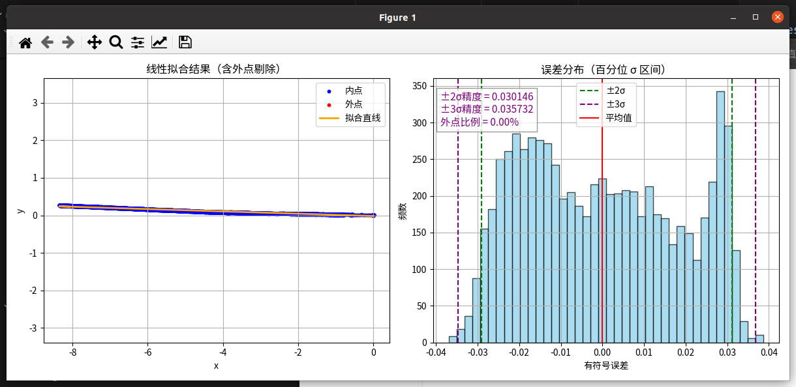                                                                                                                                 | 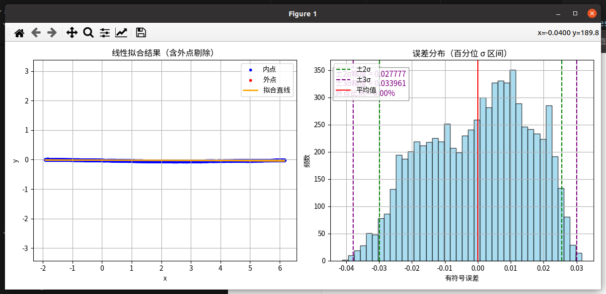                                                                                                                                |        |        |
|      |                                                                                                                                                                         |                  | 拟合结果：y = -0.0308 \* x + -0.0168RANSAC 内点比例: 100.00%剔除外点数量: 0 / 7119平均误差: -0.000000最大误差: 0.038679最小误差: -0.036862标准差 : 0.018732±2σ 区间: \[-0.029066, 0.031226] 精度为 0.030146±3σ 区间: \[-0.034658, 0.036806] 精度为 0.035732 | 拟合结果：y = -0.0037 \* x + -0.0200RANSAC 内点比例: 100.00%剔除外点数量: 0 / 7402平均误差: 0.000000最大误差: 0.031569最小误差: -0.041251标准差 : 0.015633±2σ 区间: \[-0.029960, 0.025594] 精度为 0.027777±3σ 区间: \[-0.037894, 0.030027] 精度为 0.033961 |        |        |

参考：[ p2动态rtk对比测试](https://roborock.feishu.cn/wiki/KTxkwlWTii0lqjknbmFcr8oMnwb?from=from_copylink)

