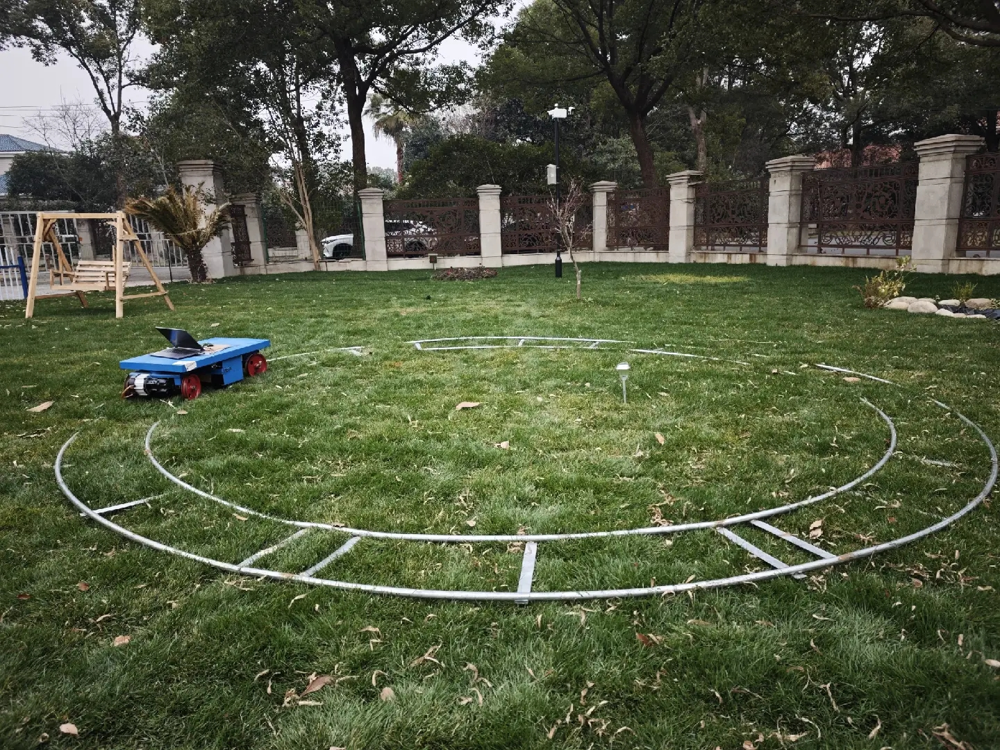
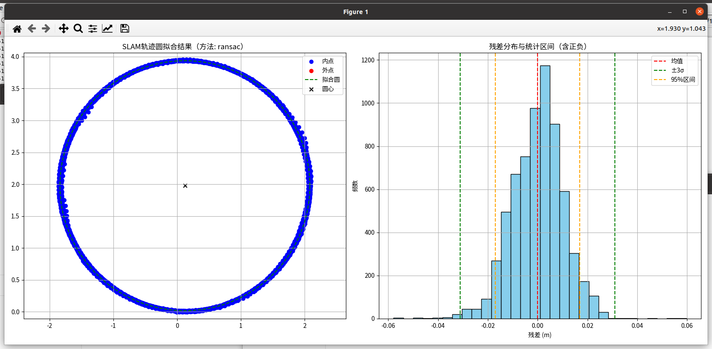

# 测试结果模版

# 1. 介绍

较为极限机器： 5m准度

机器编号： 7011023X154219020

雷达编号：47MCN8N0034715&#x20;

# 2. 标准说明：

标准差(σ)  : 0.00863 m---------------------------------------------------------按公式计算，无区间概率意义；

2σ区间: \[-0.01208, 0.01428] m, 半宽=0.01318 m------------------------按概率区间计算：覆盖约 95.45% 的数据

3σ区间: \[-0.01963, 0.01897] m, 半宽=0.01930 m------------------------按概率区间计算：覆盖约 99.73% 的数据

# 3. 测试结论：

## 3.1 **总体精度水平**

## 3.2 **速度对精度的影响**

## 3.3 **轨迹形状对精度的影响**

# 4. 测试结果

## 4.1 圆形轨道：

分别在下面每个场景以**0.4&#x20;**&#x53CA; **0.8m/s**的速度进行采集，测试结果如下表：

| 场景id    | 场景图/点云图                                                                                                                                                                 | **说明**             | 轨道半径                | 评估结果                                                                                                                                                                                                                                 |                                                                                                                                                                                                                                      | 日志     |        |
| ------- | ----------------------------------------------------------------------------------------------------------------------------------------------------------------------- | ------------------ | ------------------- | ------------------------------------------------------------------------------------------------------------------------------------------------------------------------------------------------------------------------------------ | ------------------------------------------------------------------------------------------------------------------------------------------------------------------------------------------------------------------------------------ | ------ | ------ |
|         |                                                                                                                                                                         |                    |                     | 0.4m/s                                                                                                                                                                                                                               | 0.8m/s                                                                                                                                                                                                                               | 0.4m/s | 0.8m/s |
| **场景1** |  | **建筑物 + 树木（理想环境）** | 圆轨外圆直径4.4m，内圆直径3.6m |                                                                                                                                                   |                                                                                                                                                   |        |        |
|         |                                                                                                                                                                         |                    |                     | 【拟合方法】：ransac拟合圆心   : (0.094, 1.965)拟合半径   : 1.961 m平均残差   : 0.00000 m标准差(σ)  : 0.00775 m最大正残差 : 0.02280 m最大负残差 : -0.02522 m2σ区间: \[-0.01208, 0.01428] m, 半宽=0.01318 m3σ区间: \[-0.01963, 0.01897] m, 半宽=0.01930 m内点数量   : 6526 / 6526 | 【拟合方法】：ransac拟合圆心   : (0.122, 1.977)拟合半径   : 1.960 m平均残差   : 0.00000 m标准差(σ)  : 0.01036 m最大正残差 : 0.05976 m最大负残差 : -0.05788 m2σ区间: \[-0.01697, 0.01691] m, 半宽=0.01694 m3σ区间: \[-0.03427, 0.02583] m, 半宽=0.03005 m内点数量   : 6674 / 6674 |        |        |
| **场景2** |                                                                                     | **一面墙+另一面竹林**      | 圆轨外圆直径4.4m，内圆直径3.6m |                                                                                                                                                                                                                                      |                                                                                                                                                                                                                                      |        |        |
|         |                                                                                                                                                                         |                    |                     |                                                                                                                                                                                                                                      |                                                                                                                                                                                                                                      |        |        |
| **场景3** |                                                                                     | **湖边+树下**          | 圆轨外圆直径4.4m，内圆直径3.6m |                                                                                                                                                                                                                                      |                                                                                                                                                                                                                                      |        |        |
|         |                                                                                                                                                                         |                    |                     |                                                                                                                                                                                                                                      |                                                                                                                                                                                                                                      |        |        |
| **场景4** |                                                                                     | **&#x20;L l角落**    | 圆轨外圆直径4.4m，内圆直径3.6m |                                                                                                                                                                                                                                      |                                                                                                                                                                                                                                      |        |        |
|         |                                                                                                                                                                         |                    |                     |                                                                                                                                                                                                                                      |                                                                                                                                                                                                                                      |        |        |

## 4.2 直线导轨：

直轨总长度10m，实际确保安全不足10m

| **场景id** | 场景图                                                                                  | **说明**             | 评估结果                                                                                                                                                                                                               |                                                                                                                                                                                                                  | 日志     |        |
| -------- | ------------------------------------------------------------------------------------ | ------------------ | ------------------------------------------------------------------------------------------------------------------------------------------------------------------------------------------------------------------ | ---------------------------------------------------------------------------------------------------------------------------------------------------------------------------------------------------------------- | ------ | ------ |
|          |                                                                                      |                    | 0.4m/s                                                                                                                                                                                                             | 0.8m/s                                                                                                                                                                                                           | 0.4m/s | 0.8m/s |
| **场景1**  |  | **建筑物 + 树木（理想环境）** |                                                                                                                                 |                                                                                                                               |        |        |
|          |                                                                                      |                    | 拟合结果：y = -0.0221 \* x + 0.0023RANSAC 内点比例: 100.00%剔除外点数量: 0 / 5688平均误差: -0.000000最大误差: 0.017864最小误差: -0.021047标准差 : 0.006118±2σ 区间: \[-0.012665, 0.012088] 精度为 0.012376±3σ 区间: \[-0.018026, 0.015226] 精度为 0.016626 | 拟合结果：y = 0.0033 \* x + 0.0093RANSAC 内点比例: 100.00%剔除外点数量: 0 / 6464平均误差: 0.000000最大误差: 0.017346最小误差: -0.016059标准差 : 0.005002±2σ 区间: \[-0.010198, 0.010450] 精度为 0.010324±3σ 区间: \[-0.015107, 0.015274] 精度为 0.015191 |        |        |
| **场景2**  |  | **一面墙 + 一片竹林**     |                                                                                                                                                                                                                    |                                                                                                                                                                                                                  |        |        |
|          |                                                                                      |                    |                                                                                                                                                                                                                    |                                                                                                                                                                                                                  |        |        |
| **场景3**  |   | **湖边 + 树下**        |                                                                                                                                                                                                                    |                                                                                                                                                                                                                  |        |        |
|          |                                                                                      |                    |                                                                                                                                                                                                                    |                                                                                                                                                                                                                  |        |        |
| **场景5**  |  | **双面墙**            |                                                                                                                                                                                                                    |                                                                                                                                                                                                                  |        |        |
|          |                                                                                      |                    |                                                                                                                                                                                                                    |                                                                                                                                                                                                                  |        |        |
| **场景6**  |  | **单面墙+篱笆**         |                                                                                                                                                                                                                    |                                                                                                                                                                                                                  |        |        |
|          |                                                                                      |                    |                                                                                                                                                                                                                    |                                                                                                                                                                                                                  |        |        |

