# mid360及mid360s测试结果

# 1. 标准说明：

标准差(σ)  : 0.00863 m----------------------------------------------------------按公式计算，无区间概率意义；

2σ区间: \[-0.01208, 0.01428] m, 半宽=0.01318 m------------------------按概率区间计算：覆盖约 95.45% 的数据

3σ区间: \[-0.01963, 0.01897] m, 半宽=0.01930 m------------------------按概率区间计算：覆盖约 99.73% 的数据

# 2. 测试分析及结论：

## 2.1 数据汇总与差异分析

| 测试类型 | 测试场景 | MID360 精度(cm) | MID360S 精度(cm) | 精度差异(MID360S - MID360) | 优劣对比      |
| ---- | ---- | ------------- | -------------- | ---------------------- | --------- |
| 圆轨   | 场景1  | 3.5           | 1.8            | -1.7                   | MID360S更优 |
|      | 场景2  | 2.6           | 1.9            | -0.7                   | MID360S更优 |
|      | 场景3  | 2.3           | 1.8            | -0.5                   | MID360S更优 |
| 直轨   | 场景1  | 1.4           | 1.3            | -0.1                   | 基本一致      |
|      | 场景2  | 2.4           | 2.2            | -0.2                   | 基本一致      |
|      | 场景5  | 2.7           | 4.3            | 1.6                    | MID360更优  |

## 2.2 结论

综合测试显示，MID360S与MID360在总体性能上相当，虽在部分场景各有优势，但整体差异有限。
&#x20;

# 3. 测试结果

## 3.1 点云地图对比结果：

| 场地： | 点云建图结果（绿色：mid360；白色：mid360s）                                                        |   |
| --- | ----------------------------------------------------------------------------------- | - |
| 105 | 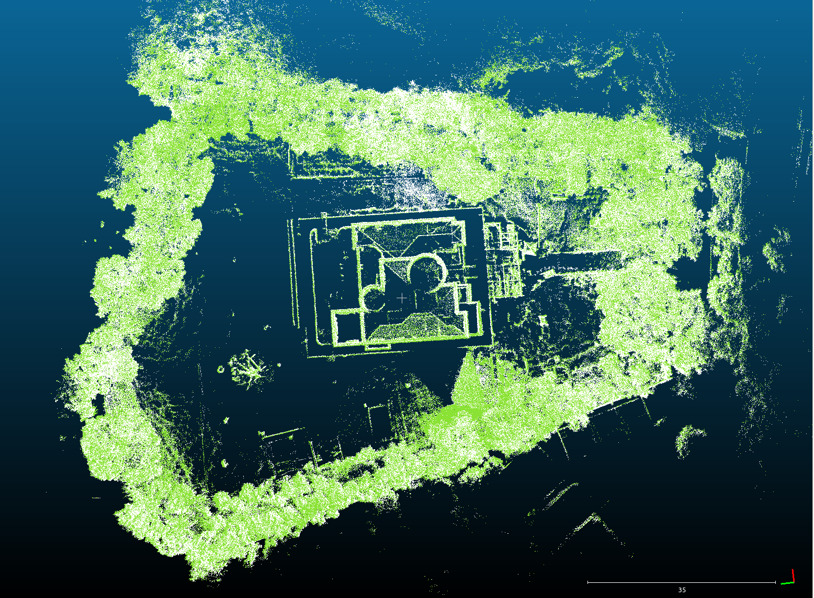 |   |
| 78  | 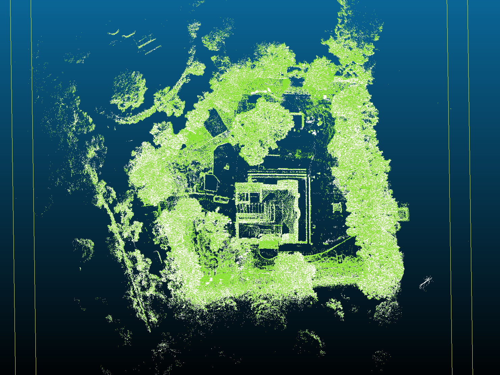 |   |
| 60  | 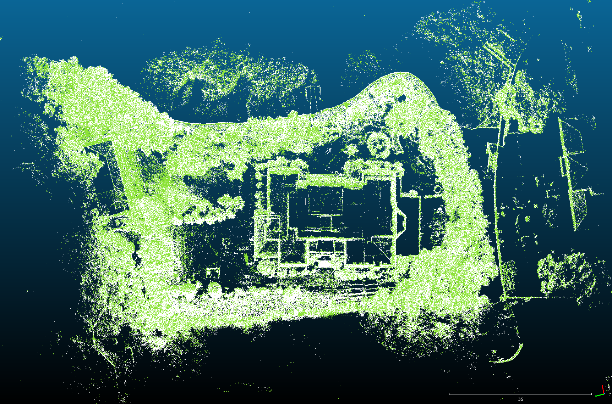 |   |

## 3.2 圆形轨道：

分别在下面每个场景以**0.8m/s**的速度进行采集，测试结果如下表：

| 场景id                                                                                                                                                                                       | 轨道半径                | 评估结果                                                                                                                                                                                                                                 |                                                                                                                                                                                                                                      | 日志     |         |
| ------------------------------------------------------------------------------------------------------------------------------------------------------------------------------------------ | ------------------- | ------------------------------------------------------------------------------------------------------------------------------------------------------------------------------------------------------------------------------------ | ------------------------------------------------------------------------------------------------------------------------------------------------------------------------------------------------------------------------------------ | ------ | ------- |
|                                                                                                                                                                                            |                     | mid360                                                                                                                                                                                                                               | mid360s                                                                                                                                                                                                                              | mid360 | mid360s |
| **场景1**：**建筑物 + 树木**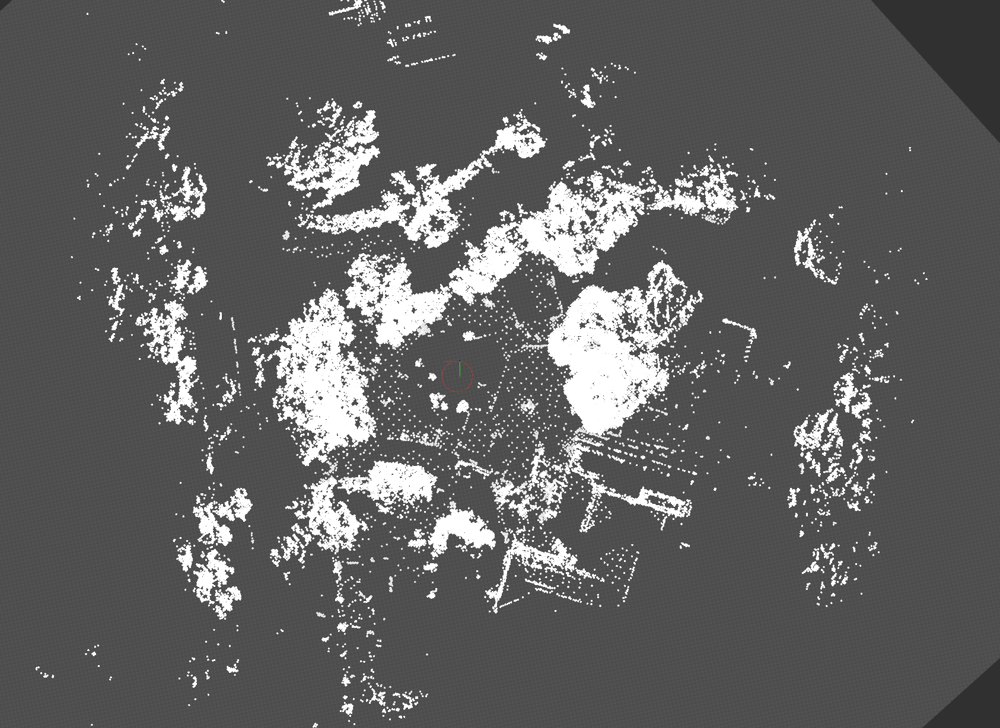 | 圆轨外圆直径4.4m，内圆直径3.6m | 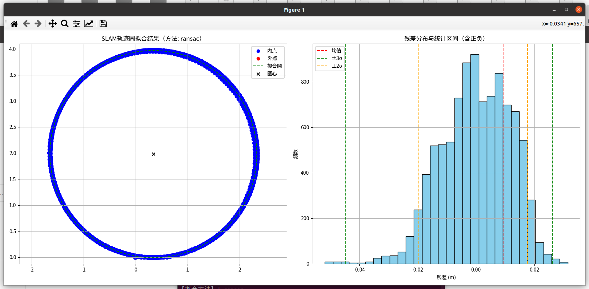                                                                                                                                                  |                                                                                                                                                   |        |         |
|                                                                                                                                                                                            |                     | 【拟合方法】：ransac拟合圆心   : (0.342, 1.980)拟合半径   : 1.989 m平均残差   : 0.00955 m标准差(σ)  : 0.01178 m最大正残差 : 0.03143 m最大负残差 : -0.05177 m2σ区间: \[-0.01955, 0.01761] m, 半宽=0.01858 m3σ区间: \[-0.04455, 0.02614] m, 半宽=0.03534 m内点数量   : 9715 / 9715 | 【拟合方法】：ransac拟合圆心   : (0.372, 1.974)拟合半径   : 2.016 m平均残差   : 0.00540 m标准差(σ)  : 0.00675 m最大正残差 : 0.02019 m最大负残差 : -0.02586 m2σ区间: \[-0.01182, 0.01120] m, 半宽=0.01151 m3σ区间: \[-0.02017, 0.01630] m, 半宽=0.01824 m内点数量   : 9085 / 9085 |        |         |
| **场景2：一面墙 + 一面竹林**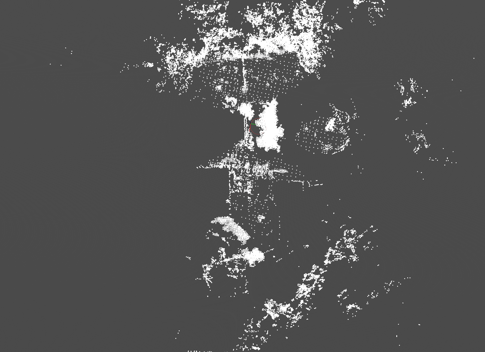  | 圆轨外圆直径4.4m，内圆直径3.6m | 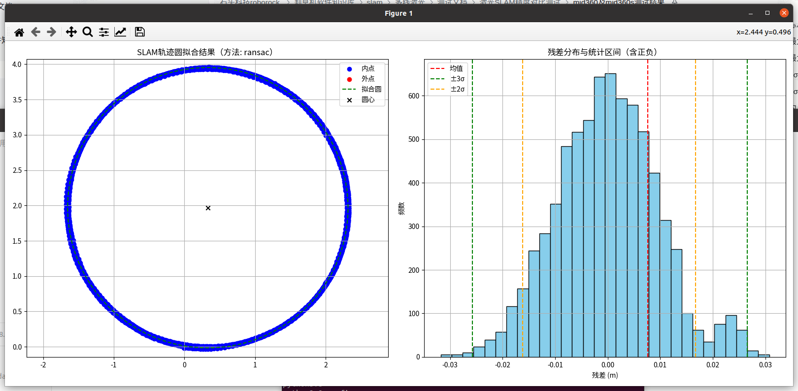                                                                                                                                                  |                                                                                                                                                   |        |         |
|                                                                                                                                                                                            |                     | 【拟合方法】：ransac拟合圆心   : (0.331, 1.969)拟合半径   : 1.984 m平均残差   : 0.00766 m标准差(σ)  : 0.00970 m最大正残差 : 0.03076 m最大负残差 : -0.03176 m2σ区间: \[-0.01620, 0.01672] m, 半宽=0.01646 m3σ区间: \[-0.02573, 0.02660] m, 半宽=0.02616 m内点数量   : 7260 / 7260 | 【拟合方法】：ransac拟合圆心   : (0.288, 1.965)拟合半径   : 1.995 m平均残差   : 0.00678 m标准差(σ)  : 0.00821 m最大正残差 : 0.02523 m最大负残差 : -0.02180 m2σ区间: \[-0.01504, 0.01199] m, 半宽=0.01352 m3σ区间: \[-0.01966, 0.01837] m, 半宽=0.01901 m内点数量   : 7830 / 7830 |        |         |
| **场景3：LI角落**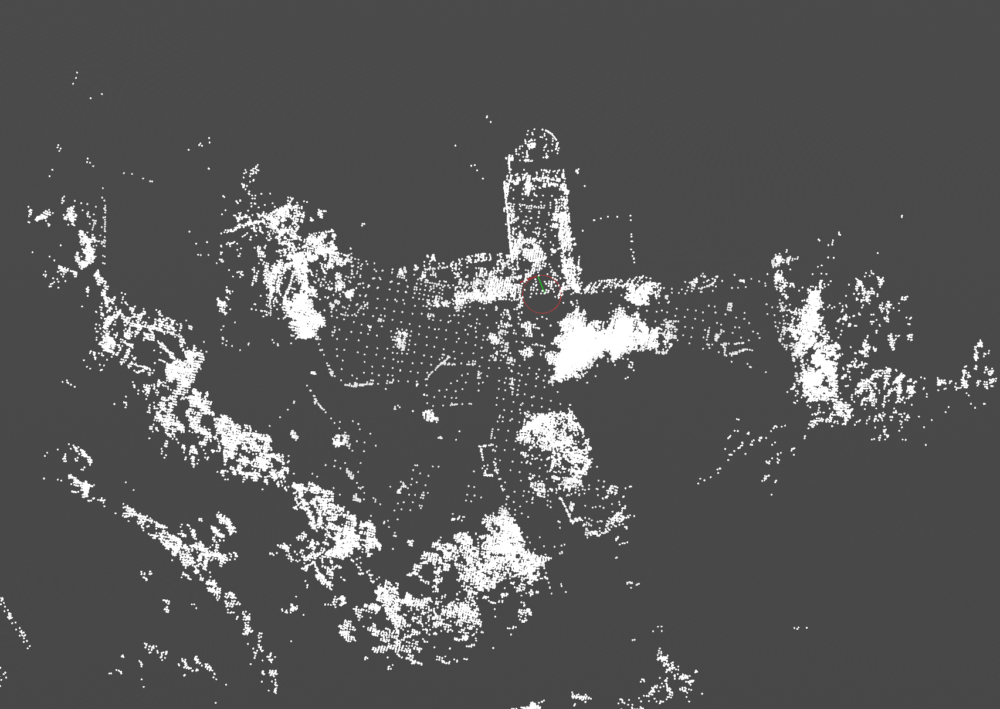        | 圆轨外圆直径4.4m，内圆直径3.6m | 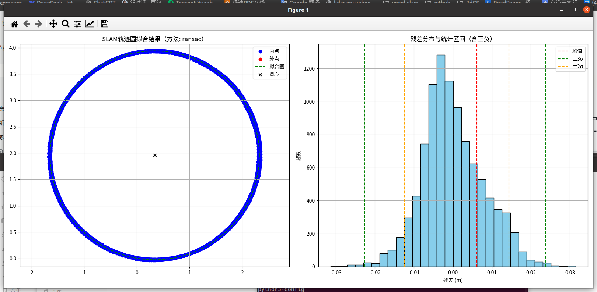                                                                                                                                                  |                                                                                                                                                   |        |         |
|                                                                                                                                                                                            |                     | 【拟合方法】：ransac拟合圆心   : (0.341, 1.956)拟合半径   : 1.981 m平均残差   : 0.00617 m标准差(σ)  : 0.00785 m最大正残差 : 0.03146 m最大负残差 : -0.03130 m2σ区间: \[-0.01231, 0.01438] m, 半宽=0.01335 m3σ区间: \[-0.02265, 0.02376] m, 半宽=0.02320 m内点数量   : 9769 / 9769 | 【拟合方法】：ransac拟合圆心   : (0.346, 1.961)拟合半径   : 1.993 m平均残差   : 0.00589 m标准差(σ)  : 0.00729 m最大正残差 : 0.02529 m最大负残差 : -0.01929 m2σ区间: \[-0.01068, 0.01406] m, 半宽=0.01237 m3σ区间: \[-0.01539, 0.02102] m, 半宽=0.01821 m内点数量   : 9132 / 9132 |        |         |

## 3.3 直线导轨：

直轨总长度10m，实际确保安全不足10m

| **场景id**                                                                                                                                                                                   | 评估结果                                                                                                                                                                                                              |                                                                                                                                                                                                                    | 日志     |         |
| ------------------------------------------------------------------------------------------------------------------------------------------------------------------------------------------ | ----------------------------------------------------------------------------------------------------------------------------------------------------------------------------------------------------------------- | ------------------------------------------------------------------------------------------------------------------------------------------------------------------------------------------------------------------ | ------ | ------- |
|                                                                                                                                                                                            | mid360                                                                                                                                                                                                            | mid360s                                                                                                                                                                                                            | mid360 | mid360s |
| **场景1**：**建筑物 + 树木**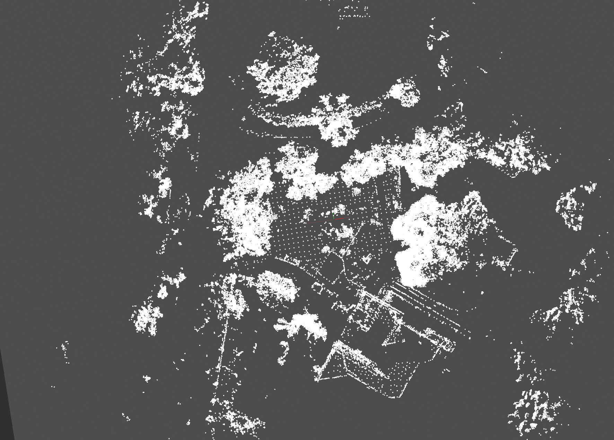 | 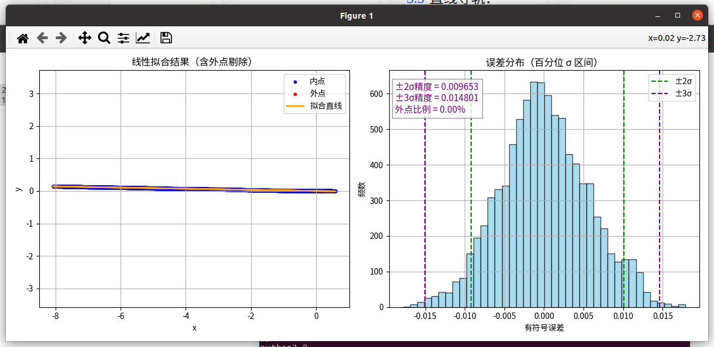                                                                                                                               | 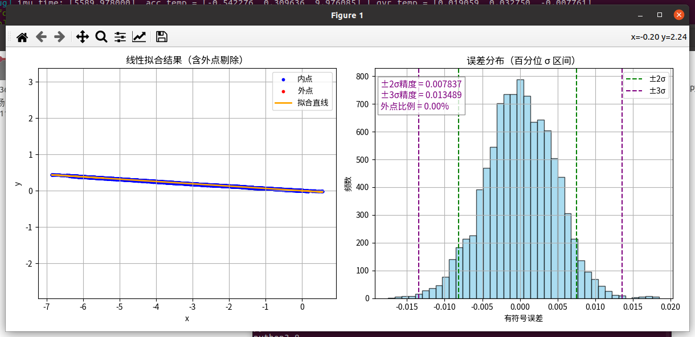                                                                                                                                |        |         |
|                                                                                                                                                                                            | 拟合结果：y = -0.0173 \* x + 0.0010RANSAC 内点比例: 100.00%剔除外点数量: 0 / 9113平均误差: 0.004412最大误差: 0.017848最小误差: -0.017797标准差 : 0.005558±2σ 区间: \[-0.009186, 0.010119] 精度为 0.009653±3σ 区间: \[-0.015019, 0.014583] 精度为 0.014801 | 拟合结果：y = -0.0638 \* x + -0.0013RANSAC 内点比例: 100.00%剔除外点数量: 0 / 9849平均误差: 0.003688最大误差: 0.018504最小误差: -0.017501标准差 : 0.004645±2σ 区间: \[-0.008129, 0.007544] 精度为 0.007837±3σ 区间: \[-0.013402, 0.013576] 精度为 0.013489 |        |         |
| **场景2：一面墙 + 一片竹林**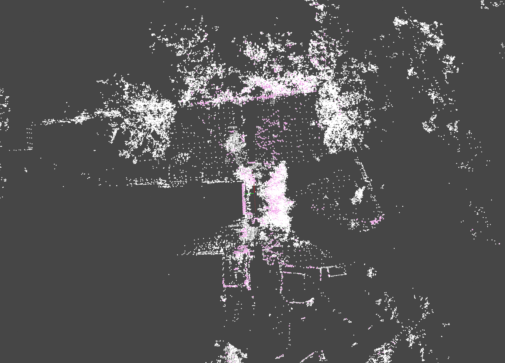  | 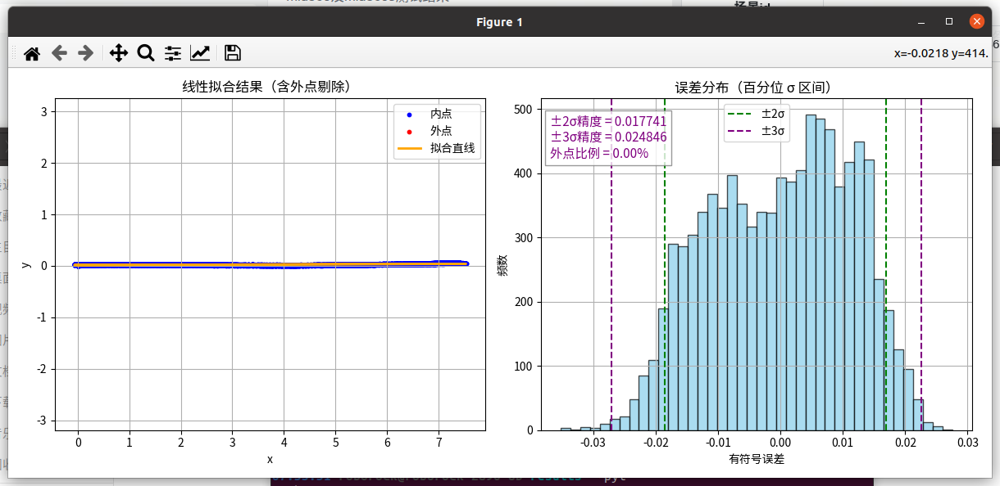                                                                                                                               |                                                                                                                                 |        |         |
|                                                                                                                                                                                            | 拟合结果：y = 0.0030 \* x + 0.0175RANSAC 内点比例: 100.00%剔除外点数量: 0 / 9181平均误差: 0.009566最大误差: 0.027548最小误差: -0.035231标准差 : 0.011223±2σ 区间: \[-0.018536, 0.016946] 精度为 0.017741±3σ 区间: \[-0.027074, 0.022618] 精度为 0.024846  | 拟合结果：y = 0.0152 \* x + 0.0073RANSAC 内点比例: 100.00%剔除外点数量: 0 / 9264平均误差: 0.008791最大误差: 0.024354最小误差: -0.032152标准差 : 0.010349±2σ 区间: \[-0.017166, 0.015672] 精度为 0.016419±3σ 区间: \[-0.023551, 0.020623] 精度为 0.022087   |        |         |
| **场景5：双面墙**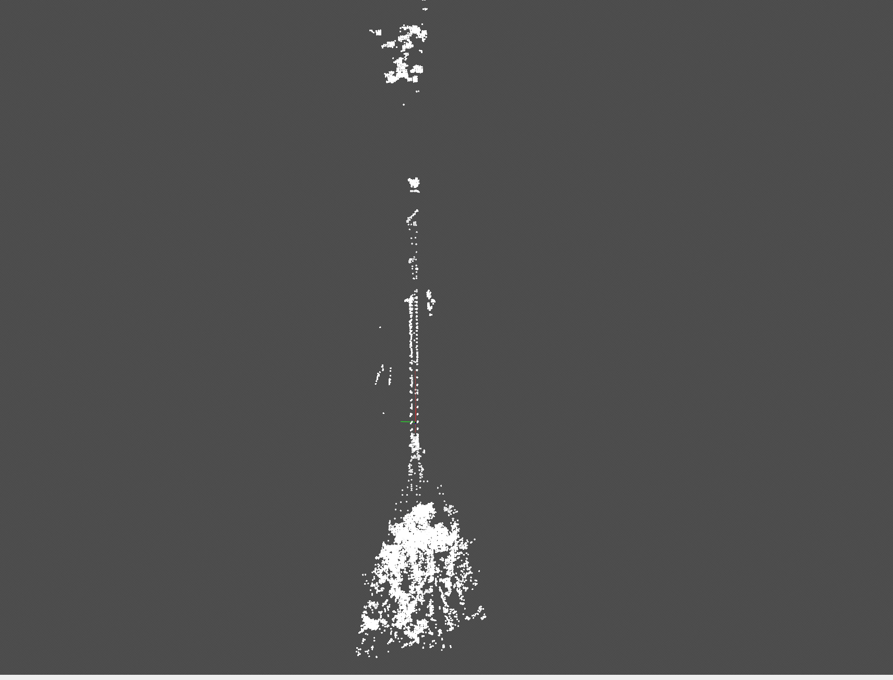          | 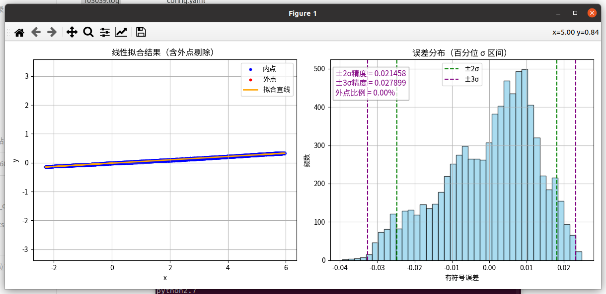                                                                                                                               |                                                                                                                                 |        |         |
|                                                                                                                                                                                            | 拟合结果：y = 0.0578 \* x + -0.0149RANSAC 内点比例: 100.00%剔除外点数量: 0 / 7926平均误差: 0.010308最大误差: 0.024764最小误差: -0.039407标准差 : 0.012526±2σ 区间: \[-0.024780, 0.018136] 精度为 0.021458±3σ 区间: \[-0.032612, 0.023185] 精度为 0.027899 | 拟合结果：y = -0.0445 \* x + 0.0105RANSAC 内点比例: 99.99%剔除外点数量: 1 / 7521平均误差: 0.015422最大误差: 0.043145最小误差: -0.054001标准差 : 0.018881±2σ 区间: \[-0.034197, 0.030026] 精度为 0.032111±3σ 区间: \[-0.046257, 0.039915] 精度为 0.043086   |        |         |

