# 单发mid360s测试结果

# 1. 标准说明：

标准差(σ)  : 0.00863 m----------------------------------------------------------按公式计算，无区间概率意义；

2σ区间: \[-0.01208, 0.01428] m, 半宽=0.01318 m------------------------按概率区间计算：覆盖约 95.45% 的数据

3σ区间: \[-0.01963, 0.01897] m, 半宽=0.01930 m------------------------按概率区间计算：覆盖约 99.73% 的数据

# 2. 测试分析及结论：

## 2.1 数据汇总与差异分析

| 测试类型 | 测试场景 | 单发版MID360s 精度(cm) | MID360S 精度(cm) | 精度差异(MID360S - 单发MID360s) | 优劣对比       |
| ---- | ---- | ----------------- | -------------- | ------------------------- | ---------- |
| 圆轨   | 场景1  | 3.08              | 1.8            | -1.28                     | MID360S更优  |
|      | 场景2  | 3.9               | 1.9            | -2                        | MID360S更优  |
|      | 场景3  | 2.4               | 1.8            | -0.6                      | MID360S更优  |
| 直轨   |      |                   |                |                           |            |
|      | 场景2  | 2.3               | 2.2            | -0.1                      | 基本一致       |
|      | 场景5  | 2.9               | 4.3            | 1.4                       | 单MID360s更优 |

## 2.2 结论

综合测试显示，单发版MID360S相较于MID360s精度略差1\~2cm。

建图上部分场景会存在一定的分层现象，整体建图效果接近。
&#x20;

# 3. 测试结果

## 3.1 点云地图对比结果：

| 场地： | 点云建图结果（绿色：mid360s；白色：单发mid360s）                                                     |   | 对比结果                                                                                                 |
| --- | ----------------------------------------------------------------------------------- | - | ---------------------------------------------------------------------------------------------------- |
| 105 | 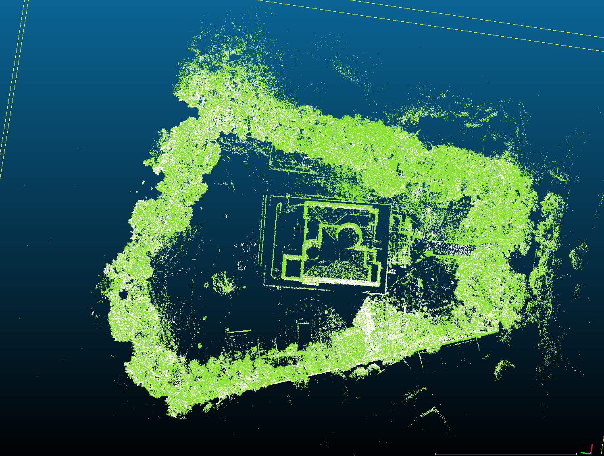 |   | 回环处单发版有一定分层（随机性）：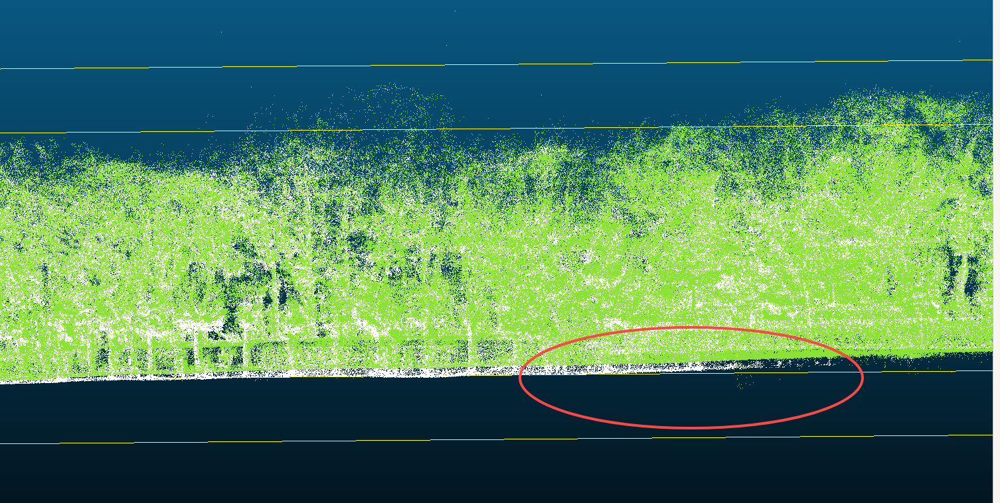 |
| 78  | 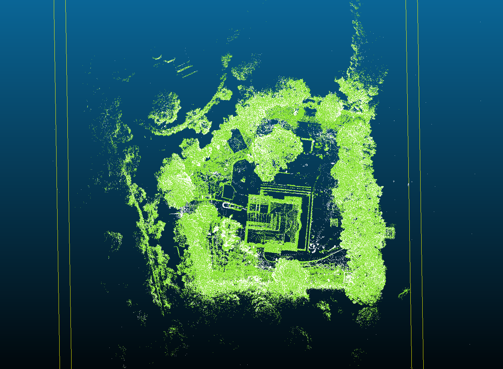 |   | 无明显差异                                                                                                |
| 60  | 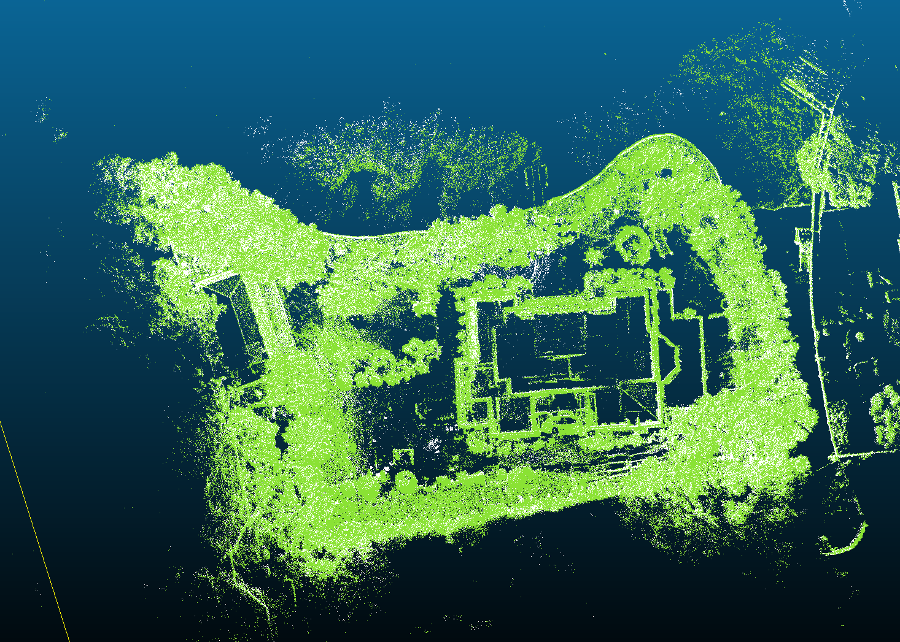 |   | 无明显差异                                                                                                |

## 3.2 圆形轨道：

分别在下面每个场景以**0.8m/s**的速度进行采集，测试结果如下表：

| 场景id                                                                                                                                                                                       | 轨道半径                | 评估结果                                                                                                                                                                                                                                  |                                                                                                                                                                                                                                      | 日志         |         |
| ------------------------------------------------------------------------------------------------------------------------------------------------------------------------------------------ | ------------------- | ------------------------------------------------------------------------------------------------------------------------------------------------------------------------------------------------------------------------------------- | ------------------------------------------------------------------------------------------------------------------------------------------------------------------------------------------------------------------------------------ | ---------- | ------- |
|                                                                                                                                                                                            |                     | 单发版mid360s                                                                                                                                                                                                                            | mid360s                                                                                                                                                                                                                              | 单发版mid360s | mid360s |
| **场景1**：**建筑物 + 树木**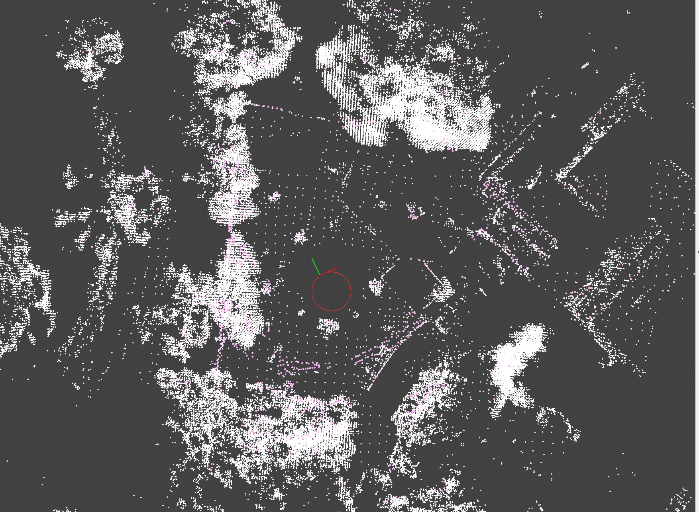 | 圆轨外圆直径4.4m，内圆直径3.6m | 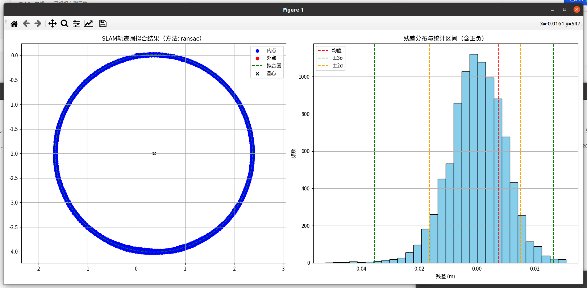                                                                                                                                                   | 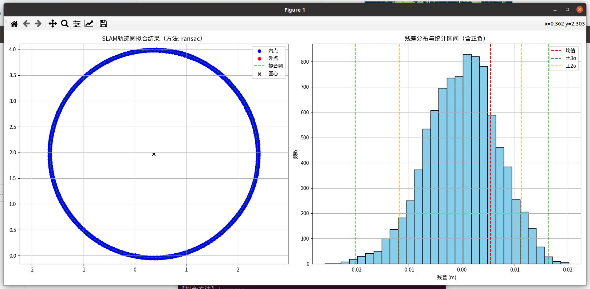                                                                                                                                                  |            |         |
|                                                                                                                                                                                            |                     | 【拟合方法】：ransac拟合圆心   : (0.364, -1.995)拟合半径   : 2.015 m平均残差   : 0.00745 m标准差(σ)  : 0.00957 m最大正残差 : 0.03071 m最大负残差 : -0.05221 m2σ区间: \[-0.01637, 0.01503] m, 半宽=0.01570 m3σ区间: \[-0.03525, 0.02643] m, 半宽=0.03084 m内点数量   : 9289 / 9289 | 【拟合方法】：ransac拟合圆心   : (0.372, 1.974)拟合半径   : 2.016 m平均残差   : 0.00540 m标准差(σ)  : 0.00675 m最大正残差 : 0.02019 m最大负残差 : -0.02586 m2σ区间: \[-0.01182, 0.01120] m, 半宽=0.01151 m3σ区间: \[-0.02017, 0.01630] m, 半宽=0.01824 m内点数量   : 9085 / 9085 |            |         |
| **场景2：一面墙 + 一面竹林**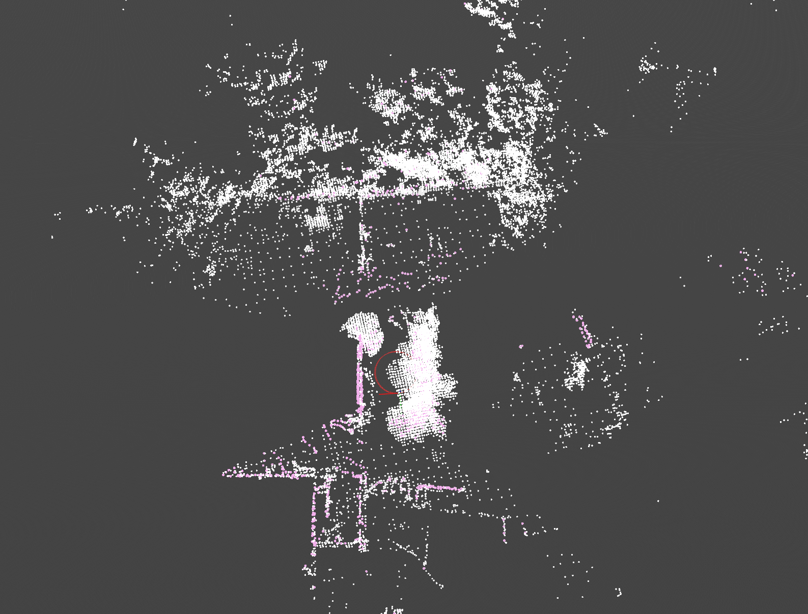  | 圆轨外圆直径4.4m，内圆直径3.6m | 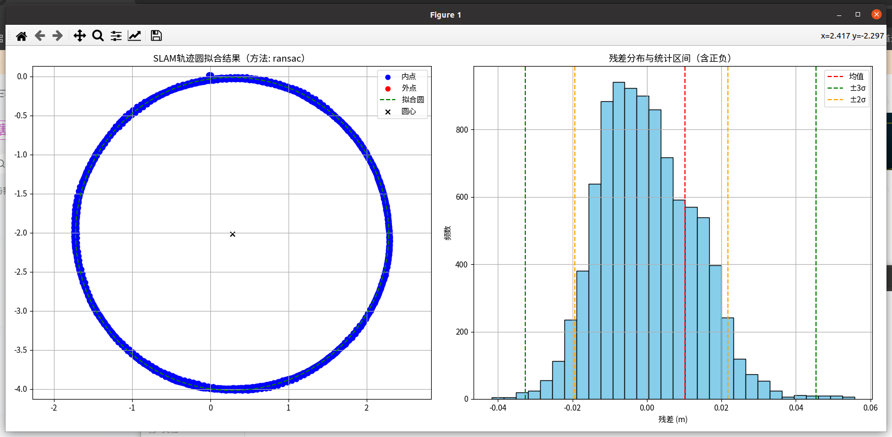                                                                                                                                                   | 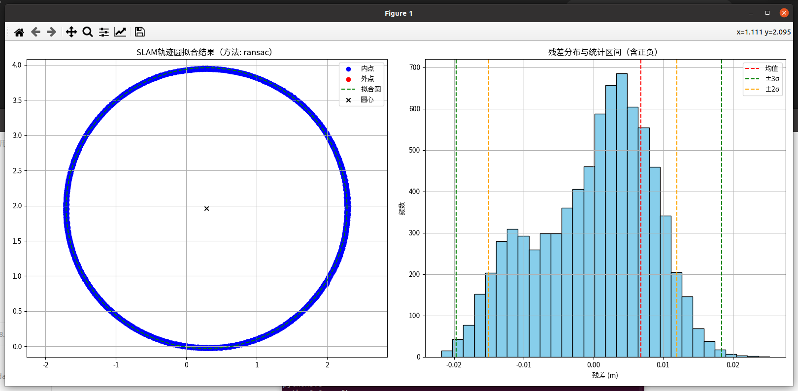                                                                                                                                                  |            |         |
|                                                                                                                                                                                            |                     | 【拟合方法】：ransac拟合圆心   : (0.280, -2.015)拟合半径   : 2.003 m平均残差   : 0.01025 m标准差(σ)  : 0.01273 m最大正残差 : 0.05571 m最大负残差 : -0.04169 m2σ区间: \[-0.01936, 0.02172] m, 半宽=0.02054 m3σ区间: \[-0.03260, 0.04549] m, 半宽=0.03905 m内点数量   : 9365 / 9365 | 【拟合方法】：ransac拟合圆心   : (0.288, 1.965)拟合半径   : 1.995 m平均残差   : 0.00678 m标准差(σ)  : 0.00821 m最大正残差 : 0.02523 m最大负残差 : -0.02180 m2σ区间: \[-0.01504, 0.01199] m, 半宽=0.01352 m3σ区间: \[-0.01966, 0.01837] m, 半宽=0.01901 m内点数量   : 7830 / 7830 |            |         |
| **场景3：LI角落**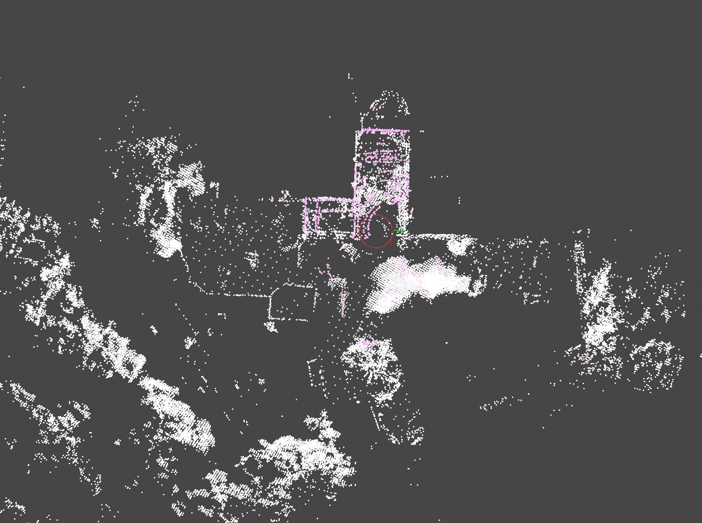        | 圆轨外圆直径4.4m，内圆直径3.6m | 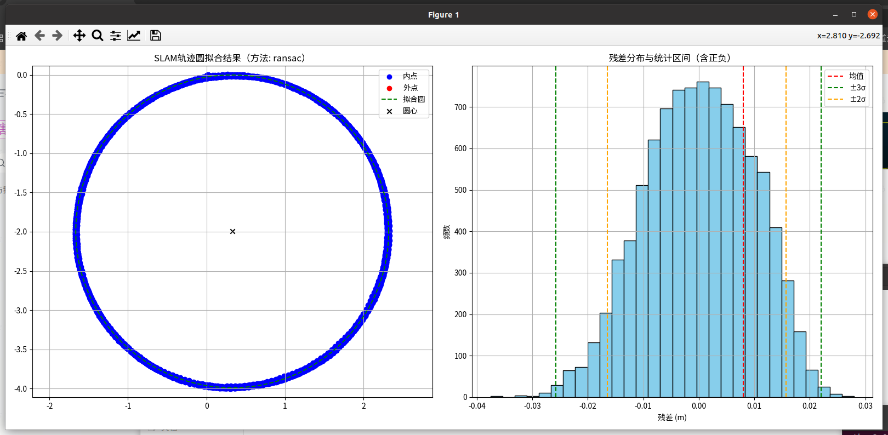                                                                                                                                                   | 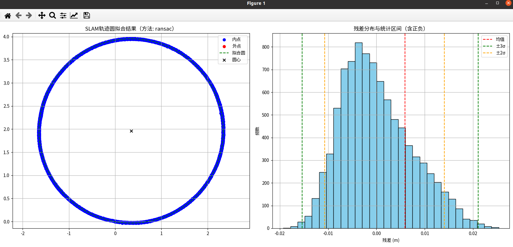                                                                                                                                                  |            |         |
|                                                                                                                                                                                            |                     | 【拟合方法】：ransac拟合圆心   : (0.329, -1.995)拟合半径   : 1.994 m平均残差   : 0.00799 m标准差(σ)  : 0.00974 m最大正残差 : 0.02802 m最大负残差 : -0.03755 m2σ区间: \[-0.01652, 0.01569] m, 半宽=0.01610 m3σ区间: \[-0.02577, 0.02201] m, 半宽=0.02389 m内点数量   : 9489 / 9489 | 【拟合方法】：ransac拟合圆心   : (0.346, 1.961)拟合半径   : 1.993 m平均残差   : 0.00589 m标准差(σ)  : 0.00729 m最大正残差 : 0.02529 m最大负残差 : -0.01929 m2σ区间: \[-0.01068, 0.01406] m, 半宽=0.01237 m3σ区间: \[-0.01539, 0.02102] m, 半宽=0.01821 m内点数量   : 9132 / 9132 |            |         |

## 3.3 直线导轨：

直轨总长度10m，实际确保安全不足10m

| **场景id**                                                                                                                                                                          | 评估结果                                                                                                                                                                                                               |                                                                                                                                                                                                                  | 日志         |         |
| --------------------------------------------------------------------------------------------------------------------------------------------------------------------------------- | ------------------------------------------------------------------------------------------------------------------------------------------------------------------------------------------------------------------ | ---------------------------------------------------------------------------------------------------------------------------------------------------------------------------------------------------------------- | ---------- | ------- |
|                                                                                                                                                                                   | 单发版mid360s                                                                                                                                                                                                         | mid360s                                                                                                                                                                                                          | 单发版mid360s | mid360s |
| **场景2：一面墙 + 一片竹林**                                                                            | 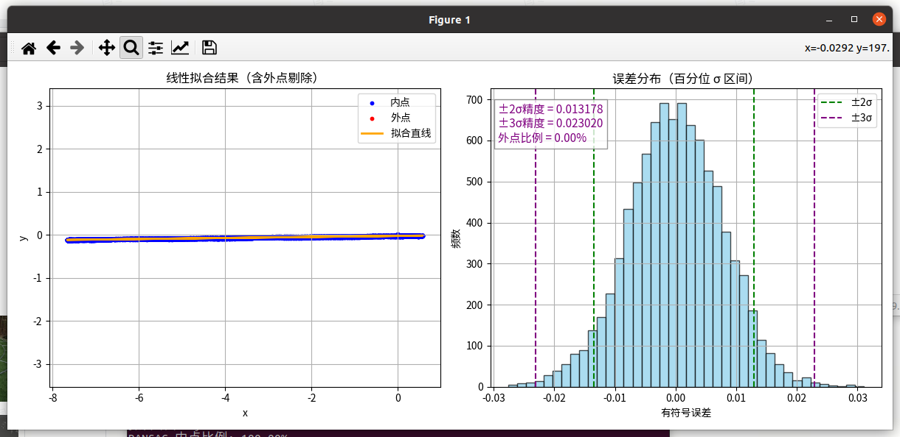                                                                                                                                | 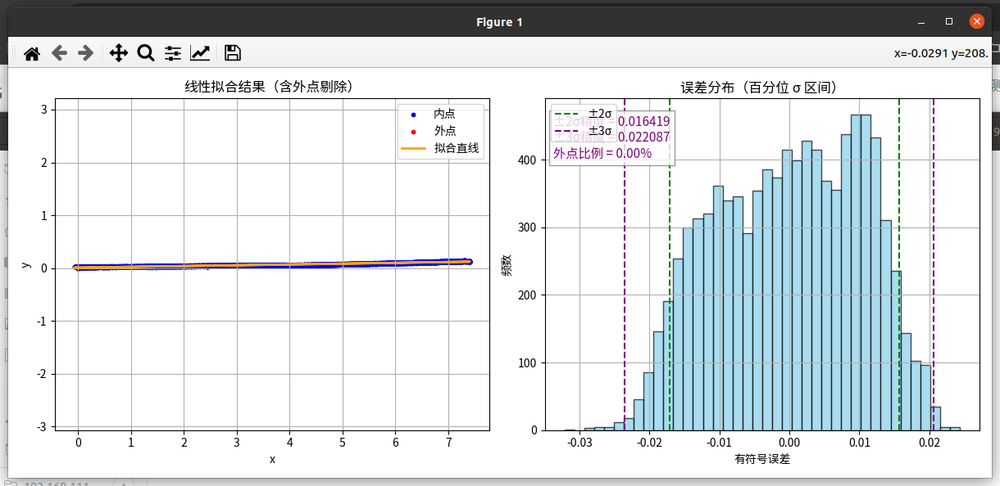                                                                                                                              |            |         |
|                                                                                                                                                                                   | 拟合结果：y = 0.0121 \* x + -0.0239RANSAC 内点比例: 100.00%剔除外点数量: 0 / 9108平均误差: 0.006223最大误差: 0.031048最小误差: -0.027615标准差 : 0.007857±2σ 区间: \[-0.013432, 0.012924] 精度为 0.013178±3σ 区间: \[-0.023123, 0.022918] 精度为 0.023020  | 拟合结果：y = 0.0152 \* x + 0.0073RANSAC 内点比例: 100.00%剔除外点数量: 0 / 9264平均误差: 0.008791最大误差: 0.024354最小误差: -0.032152标准差 : 0.010349±2σ 区间: \[-0.017166, 0.015672] 精度为 0.016419±3σ 区间: \[-0.023551, 0.020623] 精度为 0.022087 |            |         |
| **场景4：双面墙**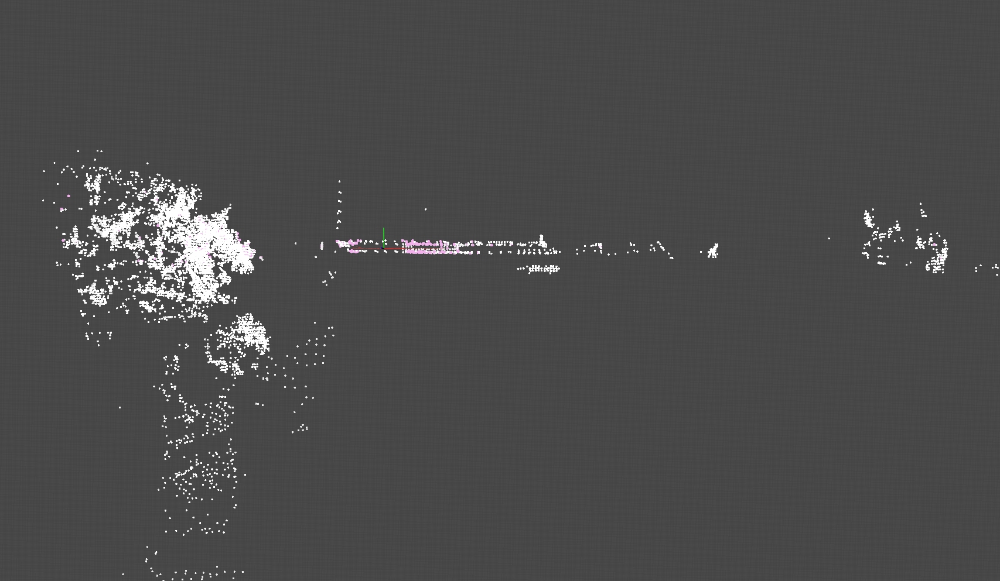 | 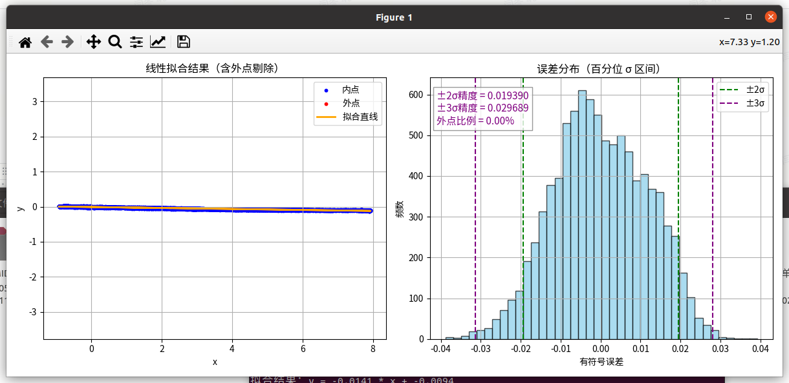                                                                                                                                | 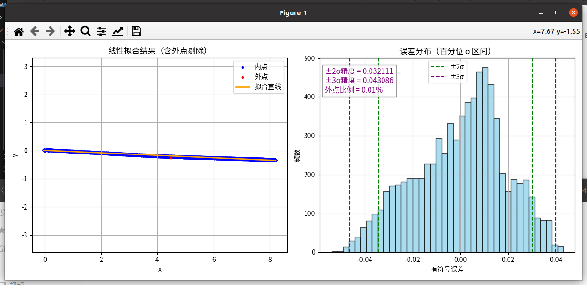                                                                                                                              |            |         |
|                                                                                                                                                                                   | 拟合结果：y = -0.0141 \* x + -0.0094RANSAC 内点比例: 100.00%剔除外点数量: 0 / 9125平均误差: 0.009614最大误差: 0.039217最小误差: -0.038842标准差 : 0.011727±2σ 区间: \[-0.019316, 0.019465] 精度为 0.019390±3σ 区间: \[-0.031374, 0.028004] 精度为 0.029689 | 拟合结果：y = -0.0445 \* x + 0.0105RANSAC 内点比例: 99.99%剔除外点数量: 1 / 7521平均误差: 0.015422最大误差: 0.043145最小误差: -0.054001标准差 : 0.018881±2σ 区间: \[-0.034197, 0.030026] 精度为 0.032111±3σ 区间: \[-0.046257, 0.039915] 精度为 0.043086 |            |         |

