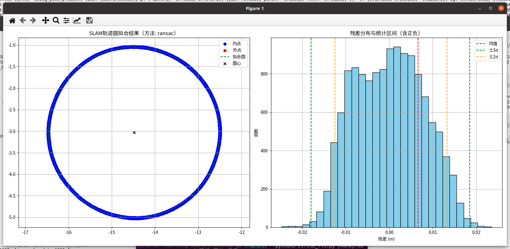
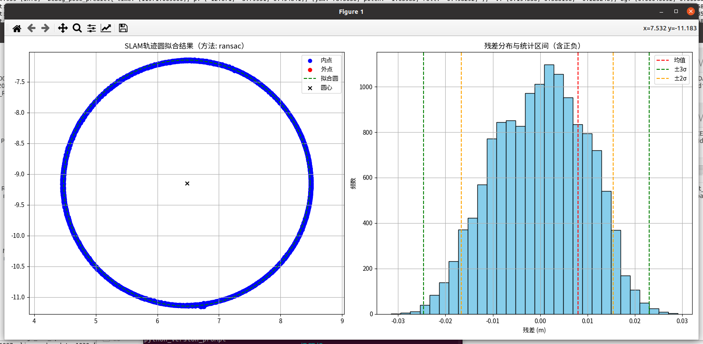
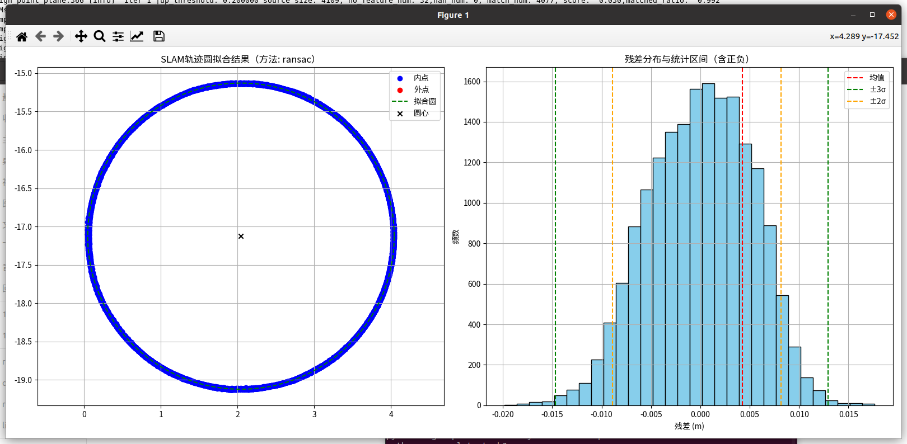
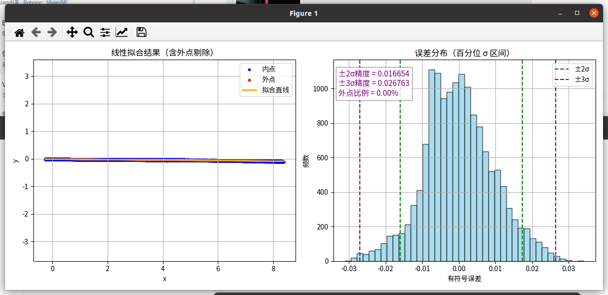
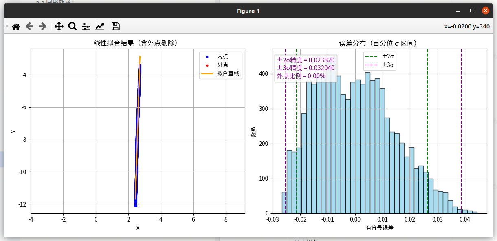

# B2-5M极限机导轨测试结果

# 1. 标准说明：

标准差(σ)  : 0.00863 m----------------------------------------------------------按公式计算，无区间概率意义；

2σ区间: \[-0.01208, 0.01428] m, 半宽=0.01318 m------------------------按概率区间计算：覆盖约 95.45% 的数据

3σ区间: \[-0.01963, 0.01897] m, 半宽=0.01930 m------------------------按概率区间计算：覆盖约 99.73% 的数据

# 2. 测试结论：

## 2.1 结论

综合测试显示，B2-5M极限机导轨测试精度(3σ)在1.3\~3.2cm。
&#x20;

# 3. 测试结果

## 3.1 圆形轨道：

分别在下面每个场景以**0.8m/s**的速度进行采集，测试结果如下表：

| 场景id                                                                                                    | 轨道半径                | 评估结果                                                                                                                                                                                                                                      |                                          日志 |
| ------------------------------------------------------------------------------------------------------- | ------------------- | ----------------------------------------------------------------------------------------------------------------------------------------------------------------------------------------------------------------------------------------- | ------------------------------------------- |
|                                                                                                         |                     | B2-5M极限机                                                                                                                                                                                                                                  | B2-5M极限机                                    |
| **场景1**：**建筑物 + 树木** | 圆轨外圆直径4.4m，内圆直径3.6m |                                                                                                                                                        |                                             |
|                                                                                                         |                     | 【拟合方法】：ransac拟合圆心   : (-14.485, -3.027)拟合半径   : 1.982 m平均残差   : 0.00663 m标准差(σ)  : 0.00791 m最大正残差 : 0.02355 m最大负残差 : -0.02478 m2σ区间: \[-0.01248, 0.01331] m, 半宽=0.01289 m3σ区间: \[-0.01799, 0.01850] m, 半宽=0.01824 m内点数量   : 13268 / 13268 |                                             |
| **场景2：一面墙 + 一面竹林**  | 圆轨外圆直径4.4m，内圆直径3.6m |                                                                                                                                                        |                                             |
|                                                                                                         |                     | 【拟合方法】：ransac拟合圆心   : (6.479, -9.145)拟合半径   : 2.000 m平均残差   : 0.00799 m标准差(σ)  : 0.00969 m最大正残差 : 0.02910 m最大负残差 : -0.03146 m2σ区间: \[-0.01665, 0.01544] m, 半宽=0.01604 m3σ区间: \[-0.02460, 0.02304] m, 半宽=0.02382 m内点数量   : 13879 / 13879   |                                             |
| **场景3：LI角落**        | 圆轨外圆直径4.4m，内圆直径3.6m |                                                                                                                                                        |                                             |
|                                                                                                         |                     | 【拟合方法】：ransac拟合圆心   : (2.044, -17.126)拟合半径   : 1.997 m平均残差   : 0.00426 m标准差(σ)  : 0.00520 m最大正残差 : 0.01764 m最大负残差 : -0.01981 m2σ区间: \[-0.00887, 0.00819] m, 半宽=0.00853 m3σ区间: \[-0.01466, 0.01291] m, 半宽=0.01379 m内点数量   : 18072 / 18072  |                                             |

## 3.2 直线导轨：

直轨总长度10m，实际确保安全不足10m

| **场景id**                                                                                               | 评估结果                                                                                                                                                                                                                |
| ------------------------------------------------------------------------------------------------------ | ------------------------------------------------------------------------------------------------------------------------------------------------------------------------------------------------------------------- |
|                                                                                                        | B2-5M极限机                                                                                                                                                                                                            |
| **场景2：一面墙 + 一片竹林** |                                                                                                                                  |
|                                                                                                        | 拟合结果：y = -0.0090 \* x + -0.0113RANSAC 内点比例: 100.00%剔除外点数量: 0 / 14766平均误差: 0.007444最大误差: 0.034095最小误差: -0.031056标准差 : 0.009481±2σ 区间: \[-0.015986, 0.017321] 精度为 0.016654±3σ 区间: \[-0.027024, 0.026502] 精度为 0.026763 |
| **场景4：双面墙**         |                                                                                                                                  |
|                                                                                                        | 拟合结果：y = 32.1935 \* x + -90.0892RANSAC 内点比例: 100.00%剔除外点数量: 0 / 9101平均误差: 0.011757最大误差: 0.044491最小误差: -0.026597标准差 : 0.014182±2σ 区间: \[-0.021314, 0.026325] 精度为 0.023820±3σ 区间: \[-0.025366, 0.038714] 精度为 0.032040 |

