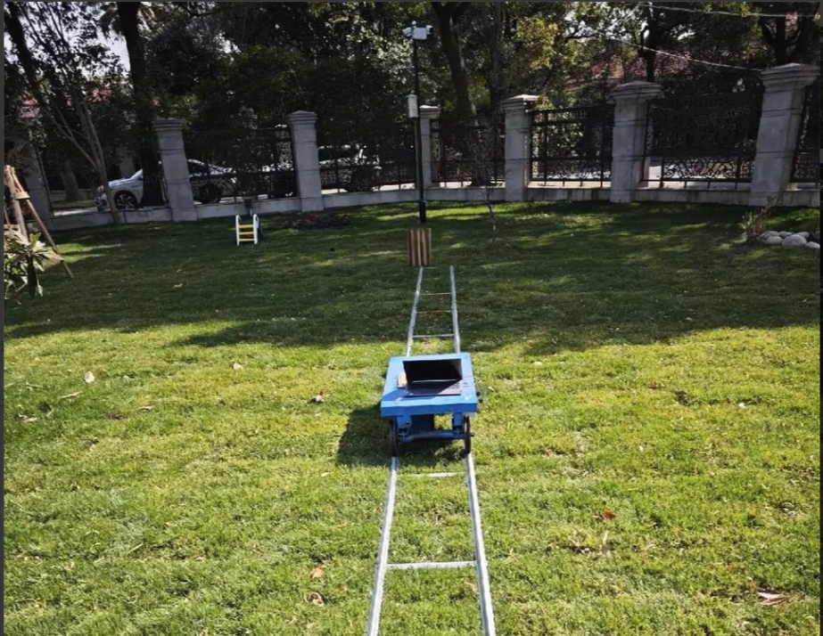
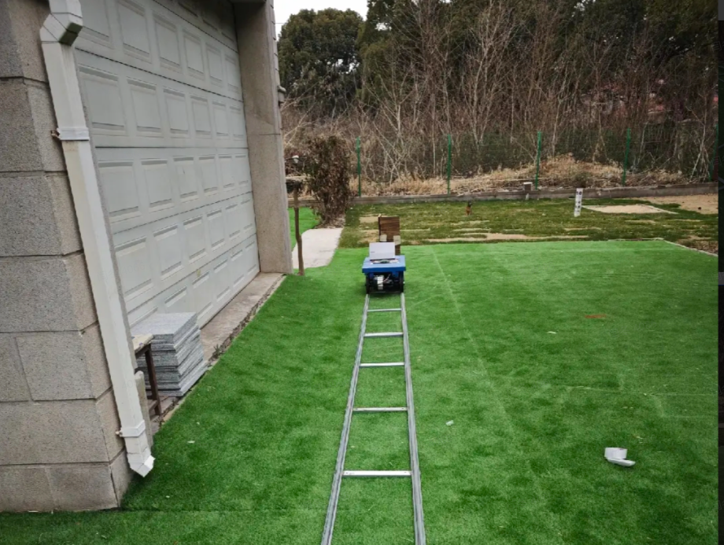
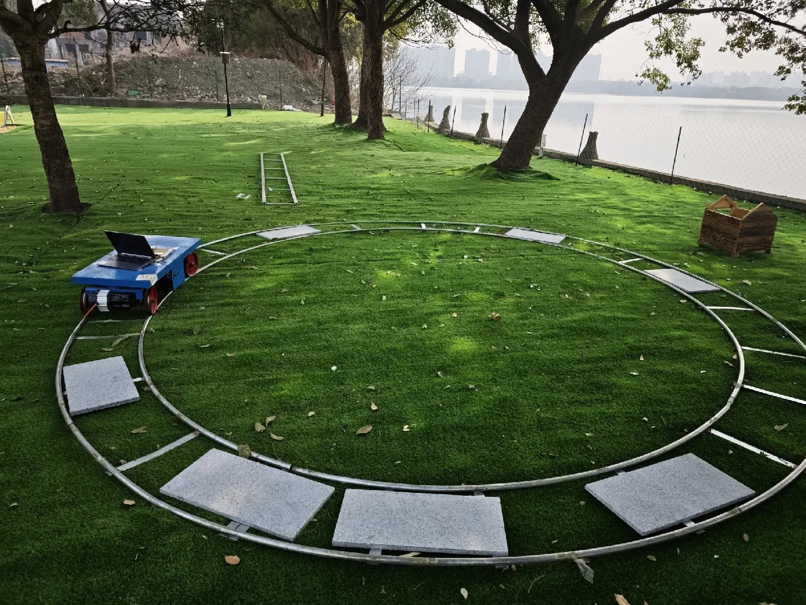
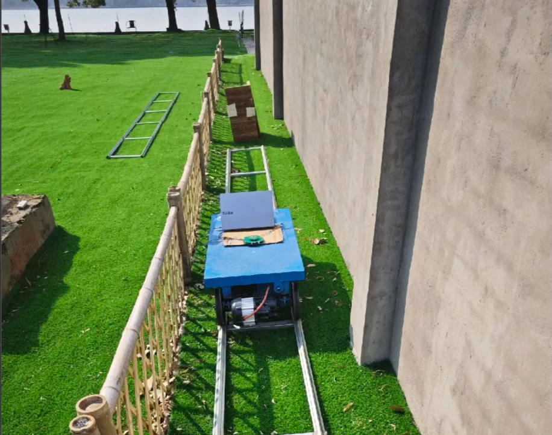

# 激光 SLAM 数据采集规范、场景与精度评估说明

# 1. 简介

本文件旨在说明激光 SLAM **数据采集要求、场景环境信息及精度评估方法**，确保测试过程的可重复性与公平性，为不同传感器的性能对比提供统一的标准。

# 2. 数据采集规范：

* 形式：统一导轨测试，分为直轨和圆轨

* 要求：需要采集到激光和激光的Imu的数据；和正常数据采集是一样的；

  1. 机器需要固定住 并在导轨上开始；

  2. 结束也要在导轨上；

  3. 每组数据30个来回，或30圈；

  4. **每个场景分别以0.4&#x20;**&#x53CA; **0.8m/s的速度进行采集**

  5. 直线导轨采集场景如下：

     1. **场景1：建筑物 + 树木（理想环境）**

     2. **场景2：一面墙 + 一片竹林**

     3. **场景3：湖边 + 树下**

     4. **场景5：双面墙**

     5. **场景6：单面墙 + 矮篱笆**

  6. 圆形导轨采集场景如下：

     1. **场景1：建筑物 + 树木（理想环境）**

     2. **场景2：一面墙 + 一片竹林**

     3. **场景3：湖边 + 树下**

     4. **场景4：LI角落（建筑物阴影区 / 激光不可达区域）**

1. **定位评估，数据采集；逐步简化；**

2. **建图，定性；**

# 3. 环境场景介绍：

### 3.1 **场景1：建筑物 + 树木（理想环境）**

#### 3.1.1 **描述：**

&#x20;      该场景包含建筑物与树木，构成一个结构与纹理特征都十分丰富的环境。建筑物表面平整、棱角分明，具备明显的几何特征；树木形态各异，树干、枝叶在不同高度层次上形成稠密的点云结构。激光雷达在该环境中能够获得充足的空间特征信息，点云匹配稳定、回环检测可靠，是激光SLAM算法运行的理想场景。

#### 3.1.2 **场景图片：**

### 3.2 **场景2：一面墙 + 一片竹林**

#### 3.2.1 **描述：**

&#x20;       该场景由一面平整墙体与一片密集竹林组成。墙面提供了强烈的平面约束，而竹林区域结构细长、重复性高，容易导致点云退化（尤其在纵向方向上）。在这种“单平面 + 重复纹理”的环境中，激光SLAM可能在某些维度上存在退化，该场景适合评估SLAM算法在退化环境下的鲁棒性测试。

#### 3.2.2 **场景图片：**

### 3.3 **场景3：湖边 + 树下**

#### 3.3.1 **描述：**

&#x20;       该场景位于湖泊边缘，湖面开阔、反射性强，树木生长在湖岸线附近，形成水体与林地交界的复杂环境。由于水面会导致激光信号部分反射或丢失，地面点云分布稀疏，而树下区域则存在丰富的结构特征。此场景适合评估SLAM系统在反射干扰与特征分布不均条件下的稳健性。

#### 3.3.2 **场景图片：**

### 3.4 **场景4：LI角落（建筑物阴影区 / 激光不可达区域）**

#### 3.4.1 **描述：**

&#x20;      该场景以建筑物的下方或转角处为主特征区域，形成激光雷达探测困难的“LI角落”（Laser Inaccessible Corner）。此类区域通常位于建筑立面与地面、或相互垂直的墙面交界处，由于遮挡、反射角度过大或阴影效应，激光信号难以有效回波，场景整体几何结构明显但局部特征缺失。该场景适合评估SLAM在**视野受限、遮挡严重**场景下的稳健性。

#### 3.4.2 **场景图片：**

### 3.5 **场景5：双面墙**

#### 3.5.1 **描述：**

&#x20;      该场景由两面相对的墙体构成，形成狭长空间。墙面平行时，激光雷达的扫描数据在横向维度上容易出现退化，点云特征重复度高，该场景适合用于评估SLAM在几何退化环境中的表现。

#### 3.5.2 **场景图片：**

### 3.6 **场景6：单面墙 + 篱笆**

#### 3.6.1 **描述：**

&#x20;       该场景由一面较为平整的垂直墙体与一排低矮的篱笆（高度约0.3～0.6米）组成。整体环境结构相对简单，墙面提供主要的平面几何约束，而篱笆在近地高度范围内形成稀疏的非连续特征。在激光SLAM中，该场景属于**部分退化环境**：适用于测试SLAM系统在退化场景与理想场景之间的**过渡场景下的表现。**

#### 3.6.2 **场景图片**：

# 4. **激光 SLAM 精度计算方法说明**

精度计算流程：

1. 对 SLAM 轨迹进行直线或圆弧拟合；

2. 计算各轨迹点到拟合曲线的距离误差；

3. 统计误差分布的 99.73% 区间（**等效3σ 标准范围**）；

4. 取该区间的半宽度作为最终精度指标。

**说明：**
&#x20;误差基本在该范围内波动，故取半宽度表示误差的正负波动幅度。

