# Mid360-5m准度测试结果

# 1. 介绍

较为极限机器： 5m准度

机器编号： 7011023X154219020

雷达编号：47MCN8N0034715&#x20;

# 2. 标准说明：

**标准差(σ)**  : 0.00863 m---------------------------------------------------------按公式计算，无区间概率意义；

2σ区间: \[-0.01208, 0.01428] m, 半宽=0.01318 m------------------------按概率区间计算：覆盖约 95.45% 的数据

3σ区间: \[-0.01963, 0.01897] m, 半宽=0.01930 m------------------------按概率区间计算：覆盖约 99.73% 的数据

# 3. 测试结论：

## 3.1 **总体精度水平**

所有场景的3σ精度均在**0.014～0.036 m**之间，整体表现优良，满足高精度定位需求

## 3.2 **速度对精度的影响**

* 在**直线轨迹**下，从 0.4 m/s → 0.8 m/s，平均精度从 0.0236 m 提升至 0.0222 m，差异很小，可认为速度对直线场景的影响**不显著**。

* 在**圆形轨迹**下，速度从 0.4 m/s → 0.8 m/s 时，平均精度从 0.0187 m 降至 0.0311 m，说明**高速转弯运动对SLAM精度有一定影响**。

## 3.3 **轨迹形状对精度的影响**

* 同速对比（0.4 m/s）：圆形轨道平均精度和直线轨道（0.0187 m vs 0.0236 m）差异较小，可认为两者精度**基本一致**。

* 同速对比（0.8 m/s）：直线轨道优于圆形轨道（0.0222 m vs 0.0311 m），表明高速曲线运动定位精度会略下降。

&#x20;                                                                               精度离散情况图  （红线为平均精度）  &#x20;

# 4. 测试结果

## 4.1 圆形轨道：

分别在下面每个场景以**0.4&#x20;**&#x53CA; **0.8m/s**的速度进行采集，测试结果如下表：

| 场景id    | 场景图/点云图                                                                                                                                                                 | **说明**             | 轨道半径                | 评估结果                                                                                                                                                                                                                                   |                                                                                                                                                                                                                                        | 日志     |        |
| ------- | ----------------------------------------------------------------------------------------------------------------------------------------------------------------------- | ------------------ | ------------------- | -------------------------------------------------------------------------------------------------------------------------------------------------------------------------------------------------------------------------------------- | -------------------------------------------------------------------------------------------------------------------------------------------------------------------------------------------------------------------------------------- | ------ | ------ |
|         |                                                                                                                                                                         |                    |                     | 0.4m/s                                                                                                                                                                                                                                 | 0.8m/s                                                                                                                                                                                                                                 | 0.4m/s | 0.8m/s |
| **场景1** |  | **建筑物 + 树木（理想环境）** | 圆轨外圆直径4.4m，内圆直径3.6m | 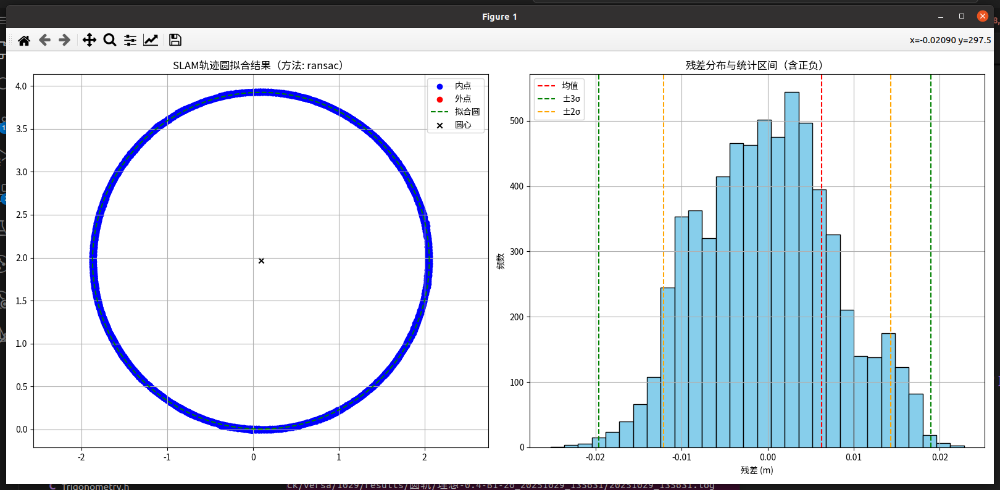                                                                                                                                                    | 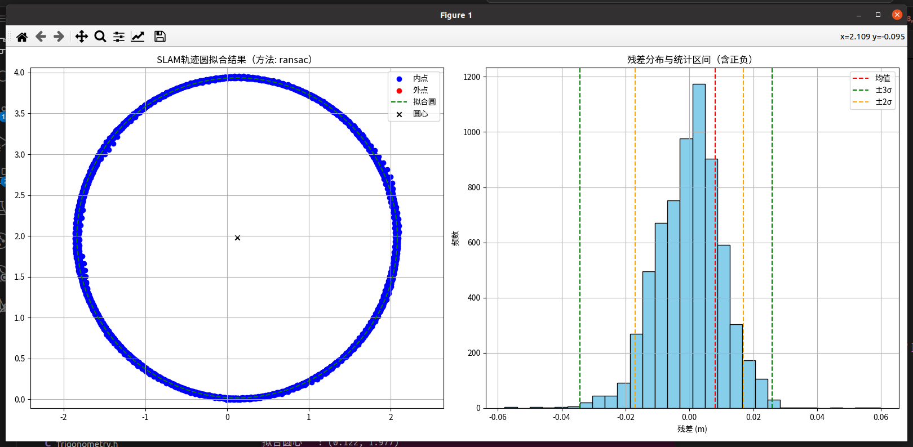                                                                                                                                                    |        |        |
|         |                                                                                                                                                                         |                    |                     | 【拟合方法】：ransac拟合圆心   : (0.094, 1.965)拟合半径   : 1.961 m平均残差   : 0.00631 m标准差(σ)  : 0.00775 m最大正残差 : 0.02280 m最大负残差 : -0.02522 m2σ区间: \[-0.01208, 0.01428] m, 半宽=0.01318 m3σ区间: \[-0.01963, 0.01897] m, 半宽=0.01930 m内点数量   : 6526 / 6526   | 【拟合方法】：ransac拟合圆心   : (0.122, 1.977)拟合半径   : 1.960 m平均残差   : 0.00807 m标准差(σ)  : 0.01036 m最大正残差 : 0.05976 m最大负残差 : -0.05788 m2σ区间: \[-0.01697, 0.01691] m, 半宽=0.01694 m3σ区间: \[-0.03427, 0.02583] m, 半宽=0.03005 m内点数量   : 6674 / 6674   |        |        |
| **场景2** | 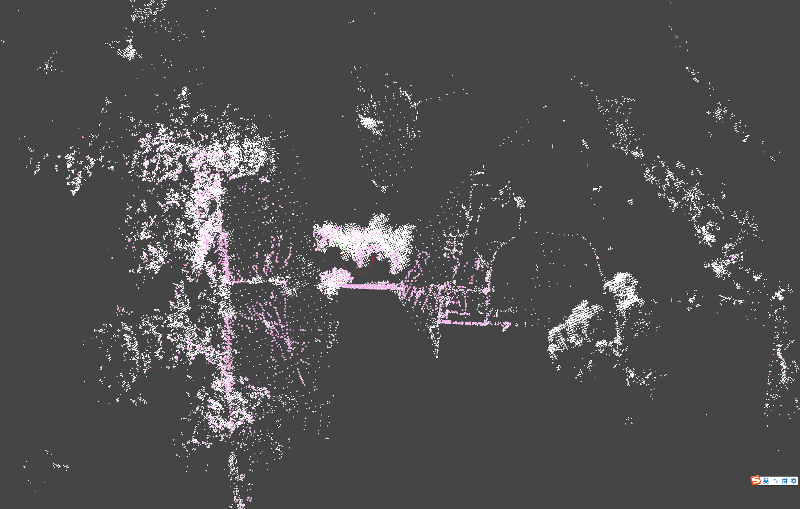 | **一面墙+另一面竹林**      | 圆轨外圆直径4.4m，内圆直径3.6m | 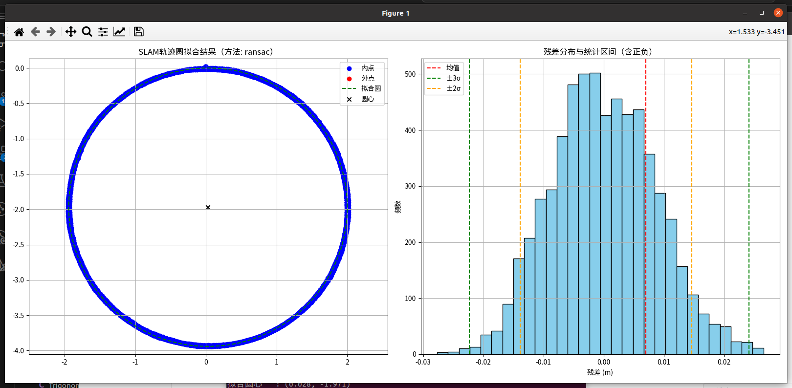                                                                                                                                                    | 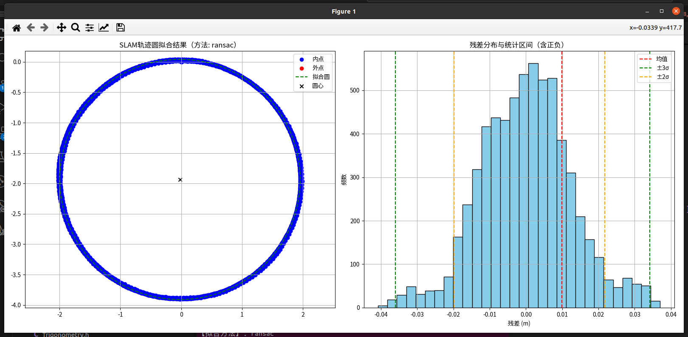                                                                                                                                                    |        |        |
|         |                                                                                                                                                                         |                    |                     | 【拟合方法】：ransac拟合圆心   : (0.028, -1.971)拟合半径   : 1.970 m平均残差   : 0.00699 m标准差(σ)  : 0.00863 m最大正残差 : 0.02653 m最大负残差 : -0.02768 m2σ区间: \[-0.01387, 0.01464] m, 半宽=0.01426 m3σ区间: \[-0.02232, 0.02410] m, 半宽=0.02321 m内点数量   : 6146 / 6146  | 【拟合方法】：ransac拟合圆心   : (-0.020, -1.934)拟合半径   : 1.975 m平均残差   : 0.00987 m标准差(σ)  : 0.01257 m最大正残差 : 0.03702 m最大负残差 : -0.04081 m2σ区间: \[-0.01988, 0.02176] m, 半宽=0.02082 m3σ区间: \[-0.03601, 0.03420] m, 半宽=0.03511 m内点数量   : 6398 / 6398 |        |        |
| **场景3** |  | **湖边+树下**          | 圆轨外圆直径4.4m，内圆直径3.6m | 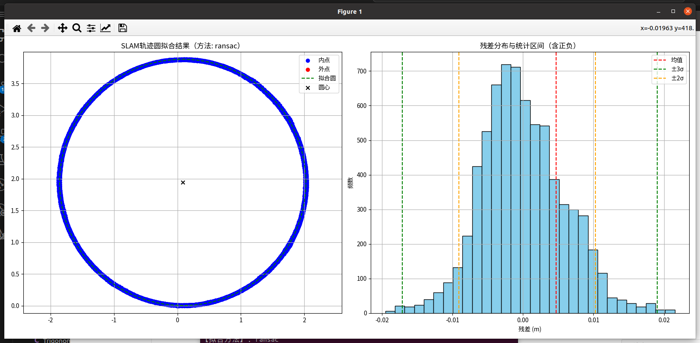                                                                                                                                                    | 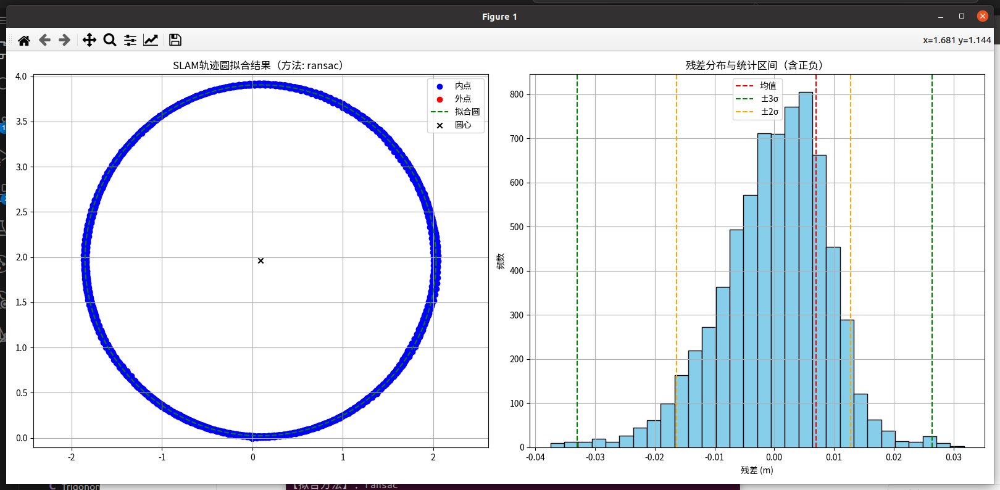                                                                                                                                                    |        |        |
|         |                                                                                                                                                                         |                    |                     | 【拟合方法】：ransac拟合圆心   : (0.084, 1.944)拟合半径   : 1.939 m平均残差   : 0.00469 m标准差(σ)  : 0.00594 m最大正残差 : 0.02153 m最大负残差 : -0.01952 m2σ区间: \[-0.00911, 0.01031] m, 半宽=0.00971 m3σ区间: \[-0.01711, 0.01903] m, 半宽=0.01807 m内点数量   : 7119 / 7119   | 【拟合方法】：ransac拟合圆心   : (0.091, 1.965)拟合半径   : 1.941 m平均残差   : 0.00703 m标准差(σ)  : 0.00903 m最大正残差 : 0.03175 m最大负残差 : -0.03746 m2σ区间: \[-0.01632, 0.01283] m, 半宽=0.01457 m3σ区间: \[-0.03300, 0.02644] m, 半宽=0.02972 m内点数量   : 7070 / 7070   |        |        |
| **场景4** |  | **&#x20;L l角落**    | 圆轨外圆直径4.4m，内圆直径3.6m | 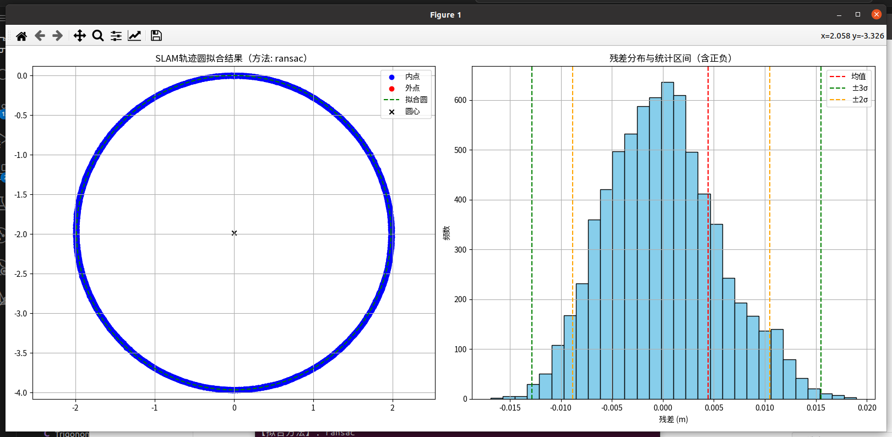                                                                                                                                                    | 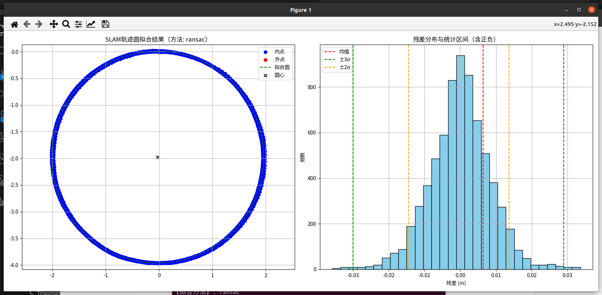                                                                                                                                                    |        |        |
|         |                                                                                                                                                                         |                    |                     | 【拟合方法】：ransac拟合圆心   : (-0.002, -1.984)拟合半径   : 1.984 m平均残差   : 0.00441 m标准差(σ)  : 0.00552 m最大正残差 : 0.01898 m最大负残差 : -0.01691 m2σ区间: \[-0.00885, 0.01049] m, 半宽=0.00967 m3σ区间: \[-0.01282, 0.01549] m, 半宽=0.01415 m内点数量   : 7153 / 7153 | 【拟合方法】：ransac拟合圆心   : (-0.024, -1.977)拟合半径   : 1.986 m平均残差   : 0.00645 m标准差(σ)  : 0.00851 m最大正残差 : 0.03360 m最大负残差 : -0.03580 m2σ区间: \[-0.01441, 0.01369] m, 半宽=0.01405 m3σ区间: \[-0.02997, 0.02897] m, 半宽=0.02947 m内点数量   : 7027 / 7027 |        |        |

## 4.2 直线导轨：

直轨总长度10m，实际确保安全不足10m

| **场景id** | 场景图                                                                                                                                                                     | **说明**             | 评估结果                                                                                                                                                                                                               |                                                                                                                                                                                                                    | 日志     |        |
| -------- | ----------------------------------------------------------------------------------------------------------------------------------------------------------------------- | ------------------ | ------------------------------------------------------------------------------------------------------------------------------------------------------------------------------------------------------------------ | ------------------------------------------------------------------------------------------------------------------------------------------------------------------------------------------------------------------ | ------ | ------ |
|          |                                                                                                                                                                         |                    | 0.4m/s                                                                                                                                                                                                             | 0.8m/s                                                                                                                                                                                                             | 0.4m/s | 0.8m/s |
| **场景1**  |  | **建筑物 + 树木（理想环境）** | 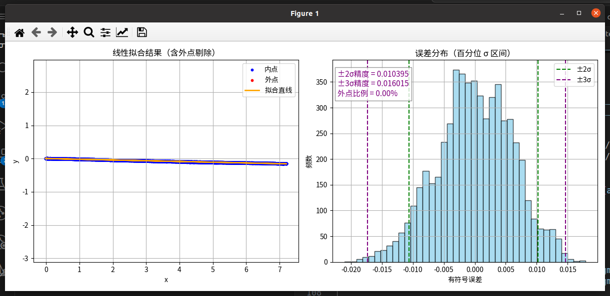                                                                                                                                | 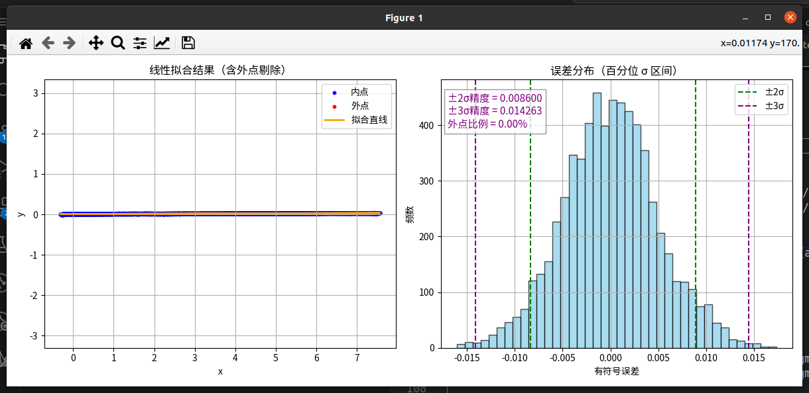                                                                                                                                |        |        |
|          |                                                                                                                                                                         |                    | 拟合结果：y = -0.0221 \* x + 0.0023RANSAC 内点比例: 100.00%剔除外点数量: 0 / 5688平均误差: 0.004925最大误差: 0.017864最小误差: -0.021047标准差 : 0.006118±2σ 区间: \[-0.010600, 0.010189] 精度为 0.010395±3σ 区间: \[-0.017350, 0.014681] 精度为 0.016015  | 拟合结果：y = 0.0033 \* x + 0.0093RANSAC 内点比例: 100.00%剔除外点数量: 0 / 6464平均误差: 0.003943最大误差: 0.017346最小误差: -0.016059标准差 : 0.005002±2σ 区间: \[-0.008319, 0.008881] 精度为 0.008600±3σ 区间: \[-0.014076, 0.014451] 精度为 0.014263   |        |        |
| **场景2**  | 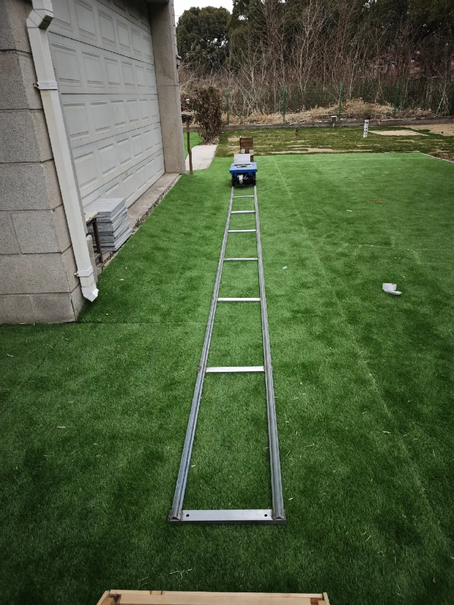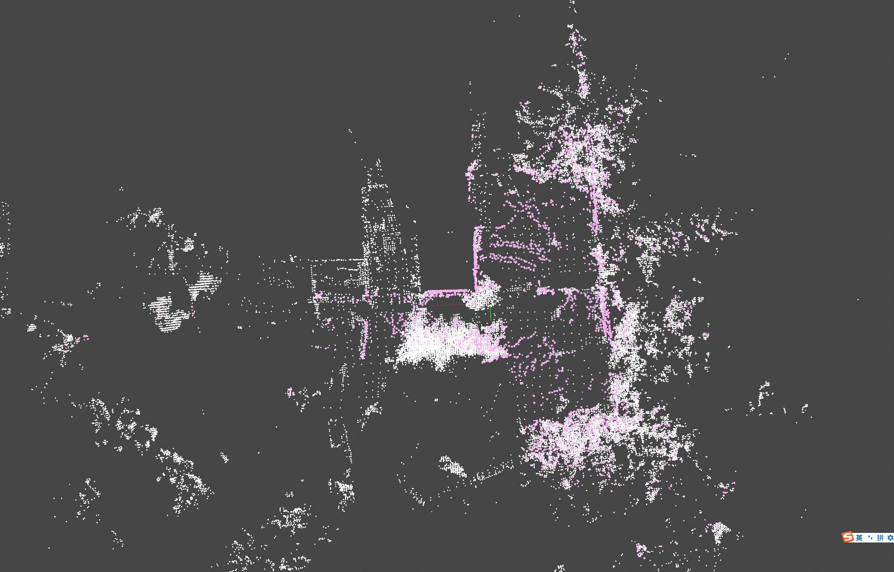 | **一面墙 + 一片竹林**     | 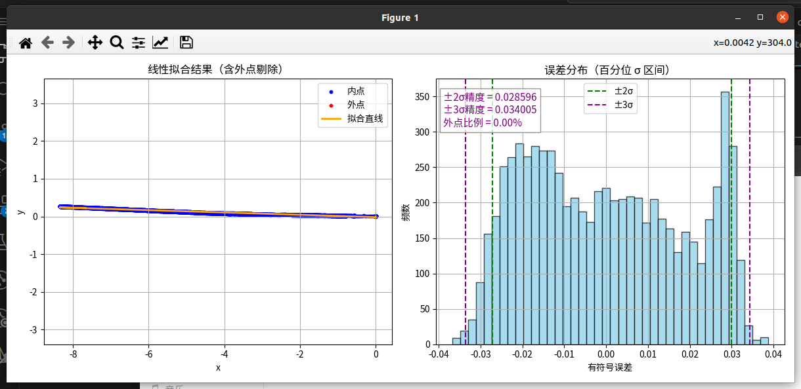                                                                                                                                | 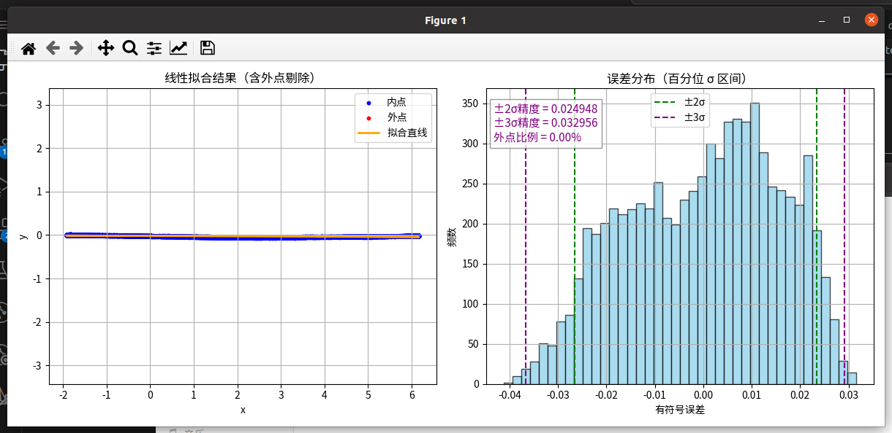                                                                                                                                |        |        |
|          |                                                                                                                                                                         |                    | 拟合结果：y = -0.0308 \* x + -0.0167RANSAC 内点比例: 100.00%剔除外点数量: 0 / 7106平均误差: 0.016245最大误差: 0.038779最小误差: -0.036826标准差 : 0.018736±2σ 区间: \[-0.027194, 0.029998] 精度为 0.028596±3σ 区间: \[-0.033669, 0.034342] 精度为 0.034005 | 拟合结果：y = -0.0037 \* x + -0.0200RANSAC 内点比例: 100.00%剔除外点数量: 0 / 7402平均误差: 0.013242最大误差: 0.031569最小误差: -0.041251标准差 : 0.015633±2σ 区间: \[-0.026499, 0.023397] 精度为 0.024948±3σ 区间: \[-0.036690, 0.029221] 精度为 0.032956 |        |        |
| **场景3**  | 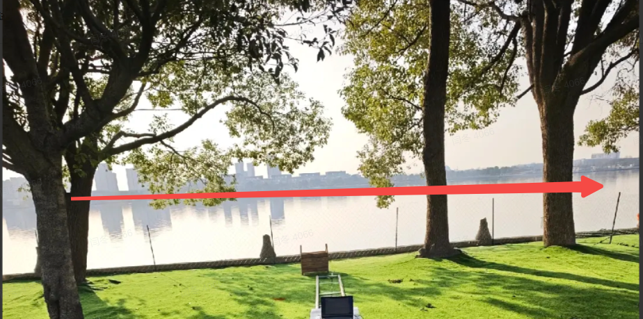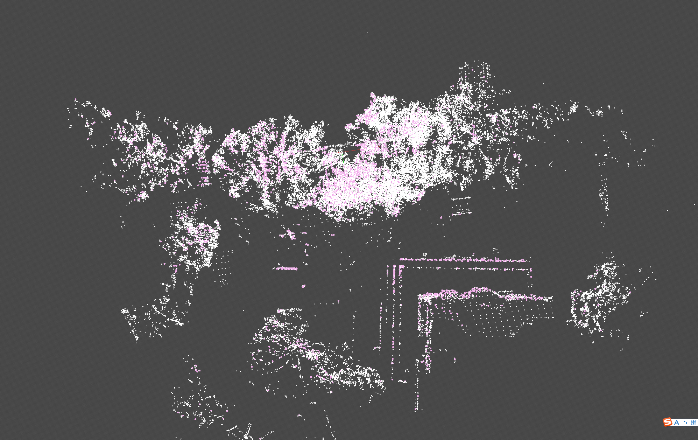  | **湖边 + 树下**        | 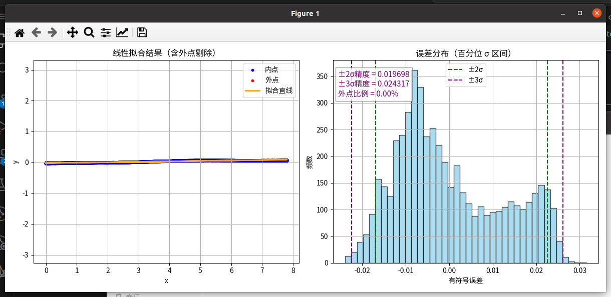                                                                                                                                | 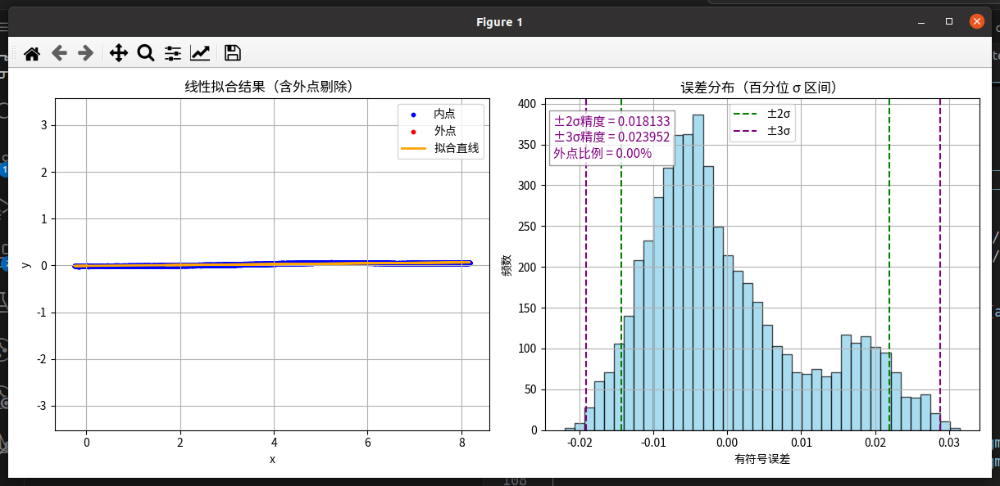                                                                                                                                |        |        |
|          |                                                                                                                                                                         |                    | 拟合结果：y = 0.0141 \* x + -0.0258RANSAC 内点比例: 100.00%剔除外点数量: 0 / 5148平均误差: 0.010335最大误差: 0.031546最小误差: -0.023940标准差 : 0.012255±2σ 区间: \[-0.016861, 0.022534] 精度为 0.019698±3σ 区间: \[-0.022436, 0.026199] 精度为 0.024317  | 拟合结果：y = 0.0091 \* x + -0.0079RANSAC 内点比例: 100.00%剔除外点数量: 0 / 5337平均误差: 0.008825最大误差: 0.031444最小误差: -0.022009标准差 : 0.010944±2σ 区间: \[-0.014371, 0.021896] 精度为 0.018133±3σ 区间: \[-0.019154, 0.028750] 精度为 0.023952  |        |        |
| **场景5**  |  | **双面墙**            | 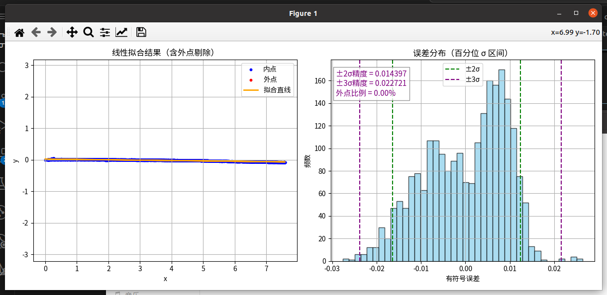                                                                                                                                | 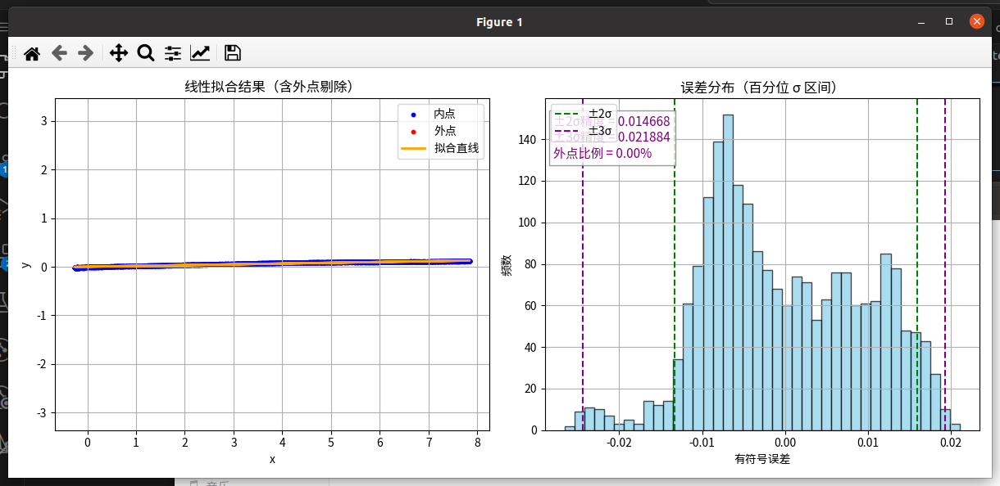                                                                                                                                |        |        |
|          |                                                                                                                                                                         |                    | 拟合结果：y = -0.0122 \* x + 0.0269RANSAC 内点比例: 100.00%剔除外点数量: 0 / 2307平均误差: 0.007846最大误差: 0.026383最小误差: -0.027636标准差 : 0.009169±2σ 区间: \[-0.016366, 0.012428] 精度为 0.014397±3σ 区间: \[-0.023813, 0.021628] 精度为 0.022721  | 拟合结果：y = 0.0161 \* x + 0.0013RANSAC 内点比例: 100.00%剔除外点数量: 0 / 2122平均误差: 0.008136最大误差: 0.021115最小误差: -0.026601标准差 : 0.009537±2σ 区间: \[-0.013324, 0.016012] 精度为 0.014668±3σ 区间: \[-0.024448, 0.019319] 精度为 0.021884   |        |        |
| **场景6**  | 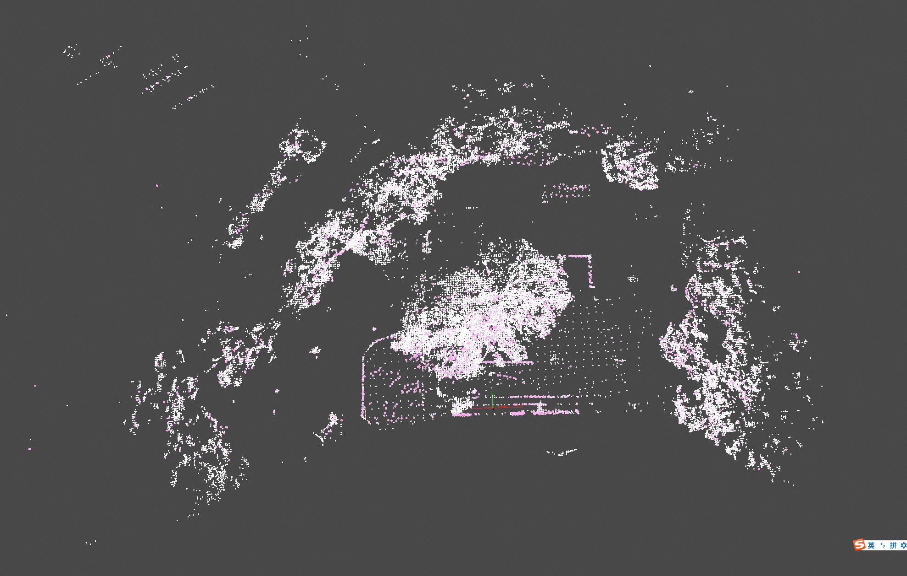 | **单面墙+篱笆**         | 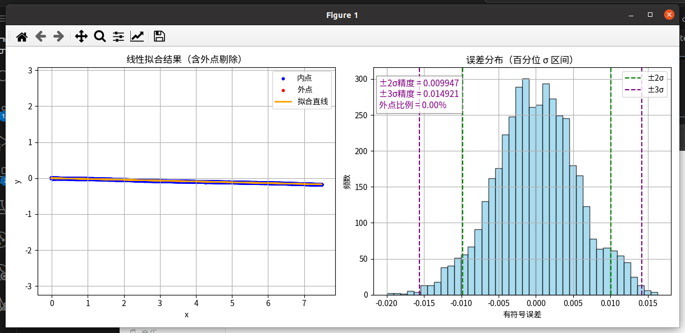                                                                                                                                | 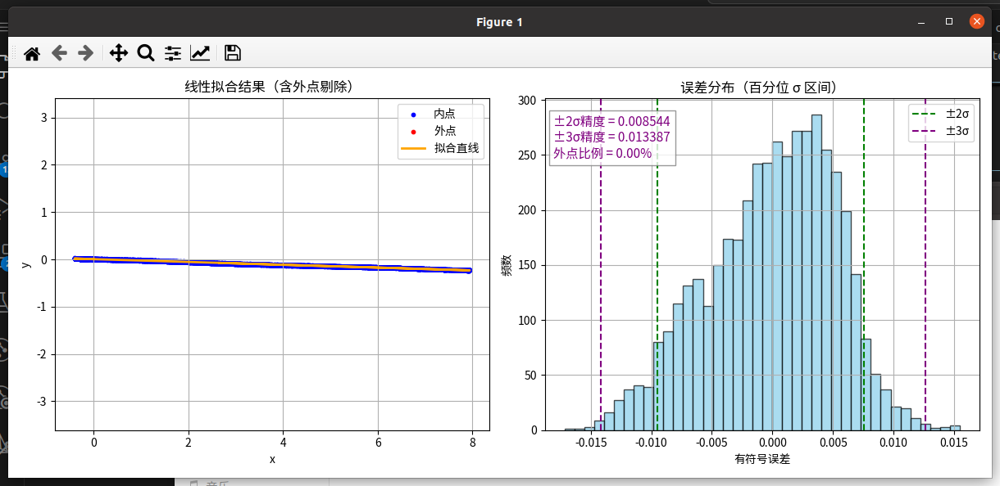                                                                                                                                |        |        |
|          |                                                                                                                                                                         |                    | 拟合结果：y = -0.0230 \* x + -0.0009RANSAC 内点比例: 100.00%剔除外点数量: 0 / 4400平均误差: 0.004444最大误差: 0.016304最小误差: -0.019993标准差 : 0.005607±2σ 区间: \[-0.009809, 0.010086] 精度为 0.009947±3σ 区间: \[-0.015609, 0.014232] 精度为 0.014921 | 拟合结果：y = -0.0298 \* x + 0.0055RANSAC 内点比例: 100.00%剔除外点数量: 0 / 4442平均误差: 0.004276最大误差: 0.015474最小误差: -0.017169标准差 : 0.005248±2σ 区间: \[-0.009501, 0.007586] 精度为 0.008544±3σ 区间: \[-0.014154, 0.012620] 精度为 0.013387  |        |        |

