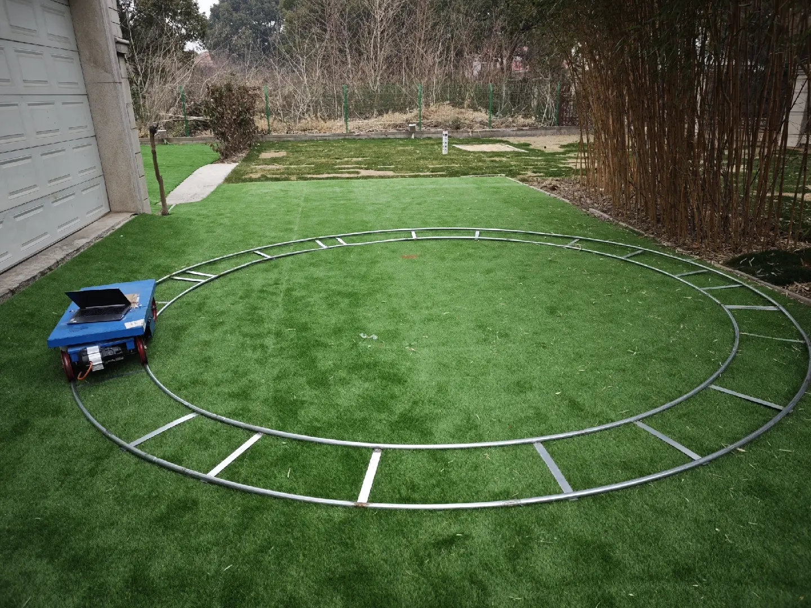
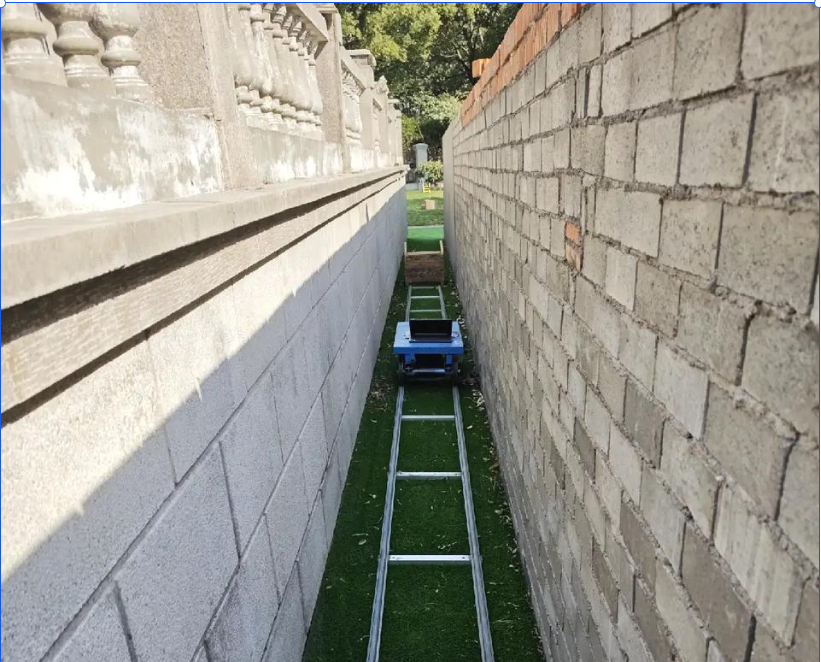

# mid360及mid360s数据采集说明

# 1. 机器

两台测试正常的设备，其中一台配备 MID360，另一台配备 MID360S。

软件版本：当天正式版本

# 2. 试采集要求：

每台机器需试采集一组数据，要求在地面行驶约10分钟，录制激光数据及对应的激光 IMU 数据。

&#x20;采集完成后，请将数据发送给  进行验证。验证通过后，可上导轨开始正式采集。

# 3. 采集需求1：

机器1：MID360

机器2：MID360S

**数据采集要求：**

* 每台机器分别围绕 60、78、105 三个场地外围，以建图方式行驶进行数据采集；

* 采集过程中需录制激光数据及激光 IMU 数据；

* **数据**和对应日志及地图文件，以 “MID360/MID360S-场地号” 形式命名文件夹进行保存发送给&#x20;

* 地图文件：

  * /mnt/data/rockrobo/last\_global\_map.pcd

  * /mnt/data/rockrobo/last\_global\_map\_keyframe.pcd

# 4. 采集需求2：

## 4.1 数据采集：

1. 形式：统一导轨测试，分为直轨和圆轨

2. 要求：需要采集到激光和激光的Imu的数据；和正常数据采集是一样的；

   1. 机器需要固定住 并在导轨上开始；

   2. 结束也要在导轨上；

   3. 每组数据20个来回，或20圈；

   4. **每组数据以0.8m/s的速度进行采集**

   * 采集过程中需录制激光数据及激光 IMU 数据

   - **数据**和对应日志，以 “圆轨/直轨-场景号-MID360/MID360S” 形式命名文件夹进行保存发送给 。

## 4.2 场景说明：

✅：需要采集

❌：不需要采集

| 场景                                                                                                      | 直轨     |         | 圆轨     |         |
| ------------------------------------------------------------------------------------------------------- | ------ | ------- | ------ | ------- |
|                                                                                                         | mid360 | mid360s | mid360 | mid360s |
| **场景1**：**建筑物 + 树木** | ✅      | ✅       | ✅      | ✅       |
| **场景2：一面墙 + 一片竹林**  | ✅      | ✅       | ✅      | ✅       |
| **场景3：LI角落**        | ❌      | ❌       | ✅      | ✅       |
| **场景5：双面墙**          | ✅      | ✅       | ❌      | ❌       |
