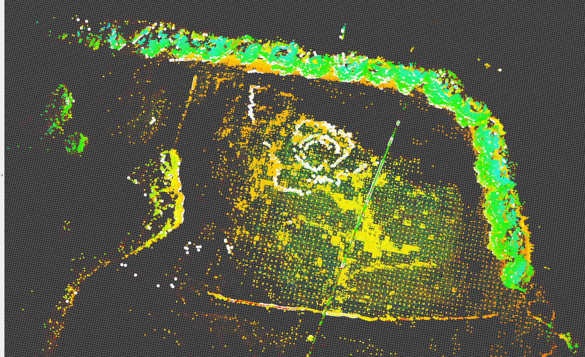
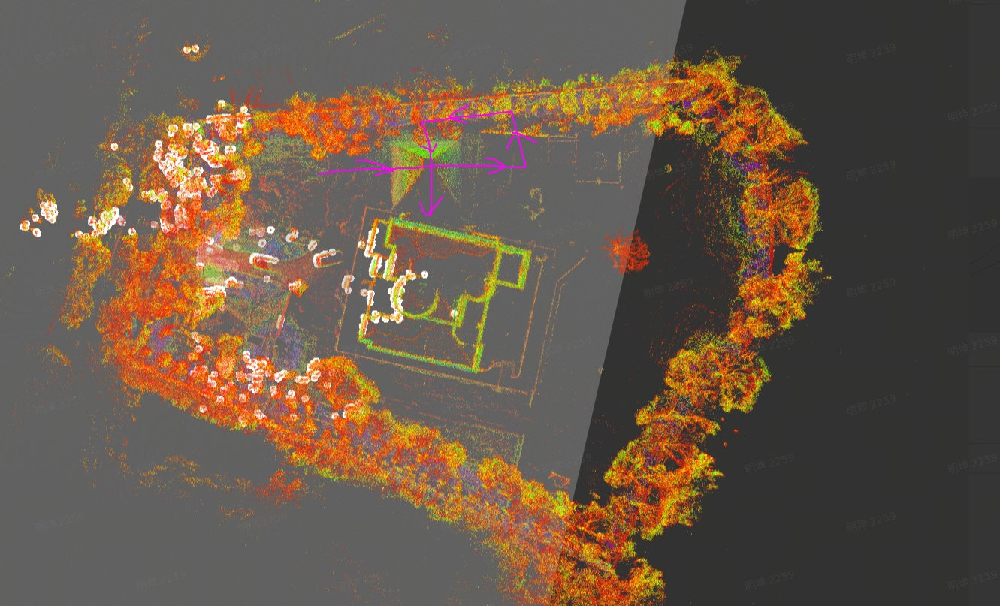
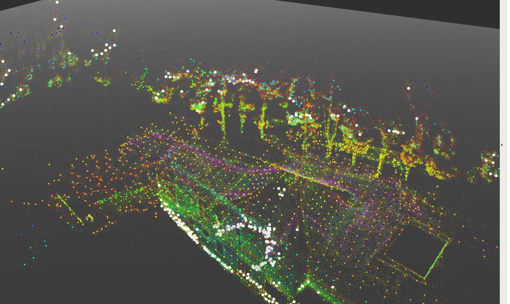
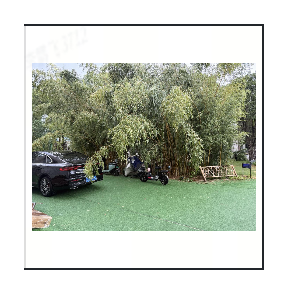
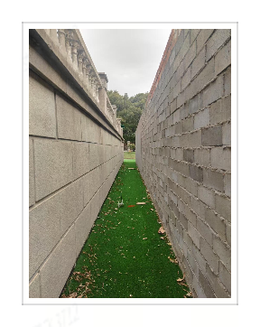
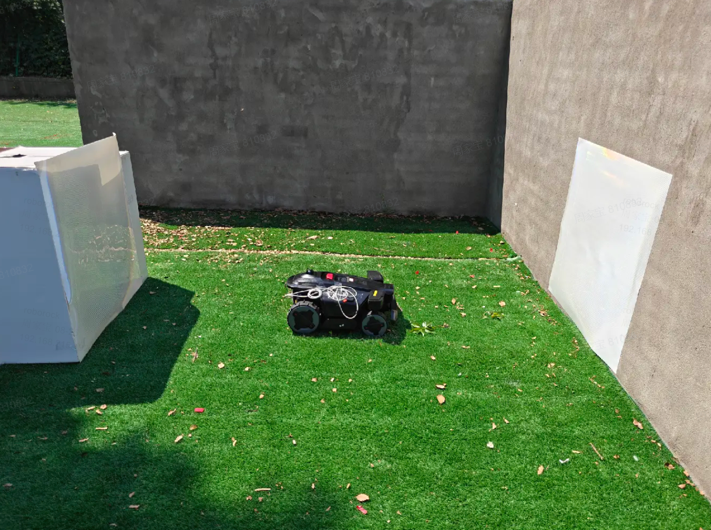
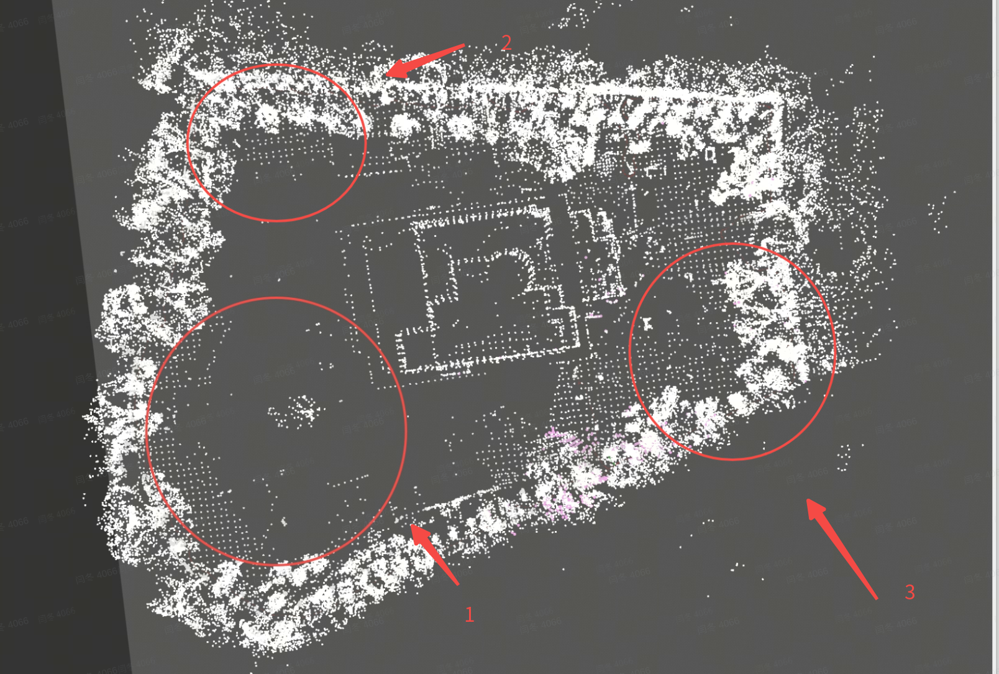
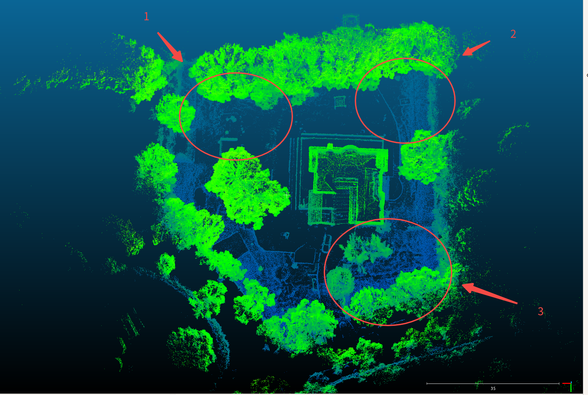
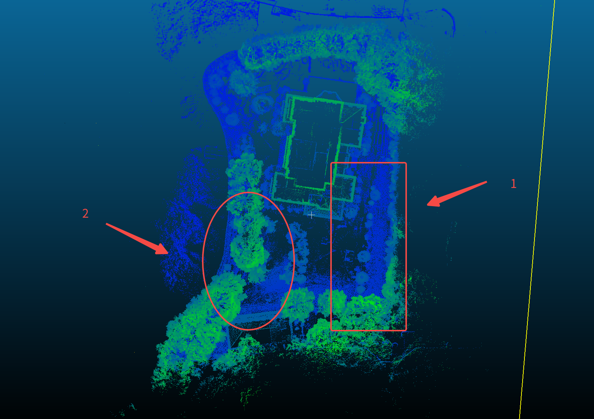

# 新器件slam采集需求

# 1. 机器

一种lidar可以认为是同一个机器；只对lidar有要求；不能走的话，遥控录制数据即可，机器无需自动走；

# 2. 试采集要求：

采集一组数据，要求在地面行驶约10分钟，轨迹任意环路，录制激光数据及对应的激光 IMU 数据。

&#x20;采集完成后，请将数据发送给  进验证。验证通过后，可上导轨开始正式采集。

# 3. 基础建图采集，需求1：

**数据采集要求：**

* 围绕 60、78、105 三个场地外围，遥控进行数据采集；

* 采集过程中需录制激光数据及激光 IMU 数据；

* **数据**和对应日志，以 “器件-场地号” 形式命名文件夹进行保存发送给&#x20;

# 4. 基础定位3000平空旷场地，建图定位需求：（新的禾赛jt16+万集和versa(360s版本)）

**数据采集要求：**

* 转弯的时候速度不要太快

* 采集过程中需录制激光数据及激光 IMU 数据；

* **数据**和对应日志，以 “器件-场地号” 形式命名文件夹进行保存发送给 &#x20;

|      |                                                            |   |   |
| ---- | ---------------------------------------------------------- | - | - |
| 建图需求 | 在场地边界进行一次遥控绕圈采集；                                           |   |   |
| 建图需求 | 在场地中间区域进行 10×10 米的小圈采集，并完成一次遥控绕圈；                          |   |   |
| 定位需求 | 在场地中间区域进行约 30×30 米范围的稀疏写字采集。&#xA;一组横纵都走下吧（井字），尽量多些就行；&#xA; |   |   |

# 5. 特殊场景的建图采集，需求2：

**数据采集要求：**

* 转弯的时候速度不要太快

* 采集过程中需录制激光数据及激光 IMU 数据；

* **数据**和对应日志，以 “器件-场地号” 形式命名文件夹进行保存发送给&#x20;

| 金字塔上下坡数据： | 105场地（一组数据即可，从远处3m走过来四个面都走下，可以推动） |  | 四个面，从3m外走过来，几个斜坡都走下上下；可以手推 |   |
| --------- | --------------------------------------------------------------------------------------------------------------------- | ------------------------------------------------------------------------------------ | -------------------------- | - |
| 任意室内数据    | 环路后，模拟稀疏弓子                                                                                                            |                                                                                      | 遥控                         |   |
| 窄通道（双面竹林） | 78别墅                                                                                                                  |   |                            |   |
| 窄通道（双面墙）  | 78别墅                                                                                                                  |   | 从通道外面2m开始，沿着窄通道行驶进行数据采集    |   |
| 高反        | 78栋别墅，贴上反光材料                                                                                                          |   | 静止3分钟，然后走一圈                |   |

# 6. 定位采集，弓子需求3

## 6.1 数据采集：

1. 形式：走弓子 （机器或手动模拟走弓子）

2. 要求：需要采集到激光和激光的Imu的数据；和正常数据采集是一样的；

   1. 在105场景 找三处20 \* 10m的区域走弓子, **数据**和对应日志，以 “105-弓子1 / 2 / 3” 形式命名文件夹进行保存发送给 。

   

   * 在78场景 找三处20 \* 10m的区域走弓子, **数据**和对应日志，以 “78-弓子1 / 2 / 3” 形式命名文件夹进行保存发送给&#x20;

   

   * 在60场景 找两处20 \* 10m的区域走弓子, **数据**和对应日志，以 “60-弓子1 / 2 ” 形式命名文件夹进行保存发送给&#x20;

   

