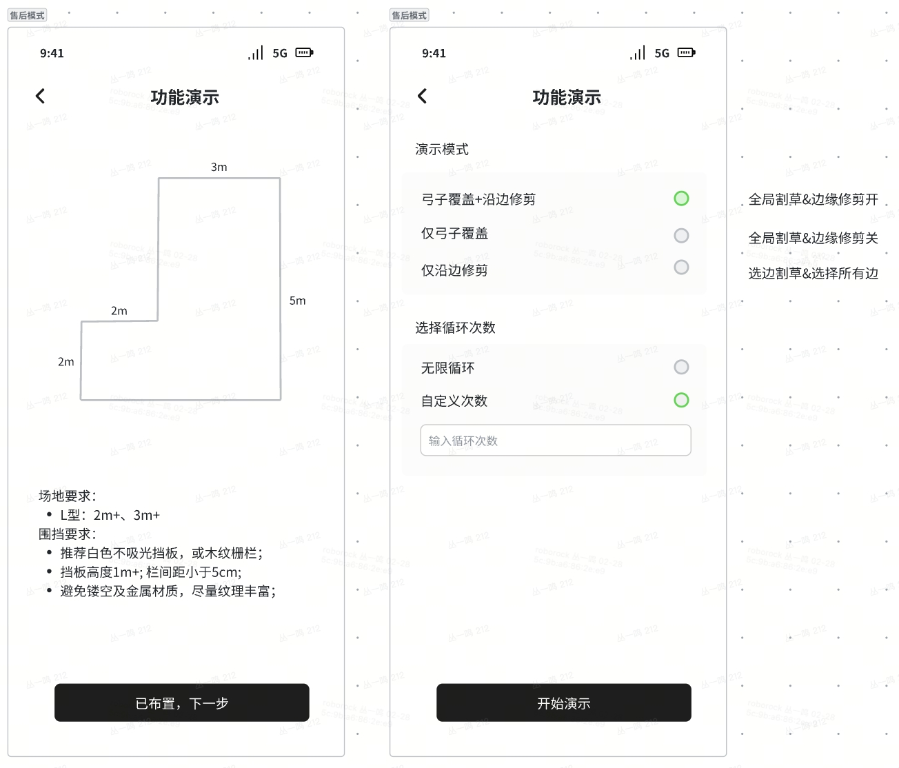
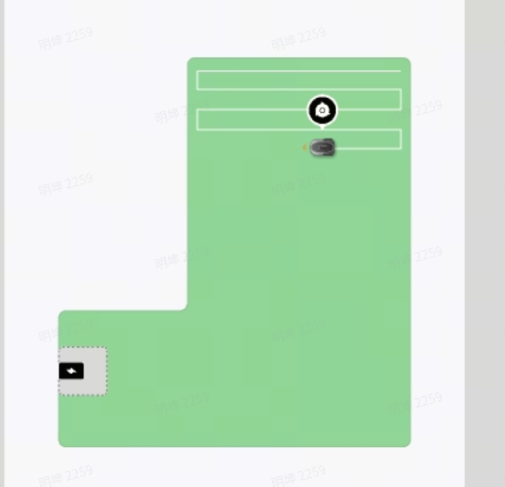

# 展会场地-激光slam采集需求 

# 1. 机器

一种lidar可以认为是同一个机器；只对lidar有要求；不能自动走的话，遥控录制数据即可；

# 2. 试采集要求：

围绕场地外围采集一组数据（1min即可），录制激光数据及对应的激光 IMU 数据。采集完成后，请将数据发送给  进验证。验证通过后，开始正式采集。

# 3. 采集总体要求：

\============================================

**建图-割草；建图割草；这样采集两遍**

# 4. 基础建图采集  &#x20;

**数据采集要求：**

* 围绕场地外围，遥控进行数据采集；

* 采集过程中需录制激光数据及激光 IMU 数据；

* **数据**和对应日志，以文件夹进行保存发送给&#x20;

# 5. 弓子割草需求：&#x20;

**数据采集要求：**

* 机器正常弓字割草，全部割草完；

* 采集过程中需录制激光数据及激光 IMU 数据；

* **数据**和对应日志，以文件夹进行保存发送给&#x20;

|   |   |   |   |
| - | - | - | - |
|   |   |   |   |

