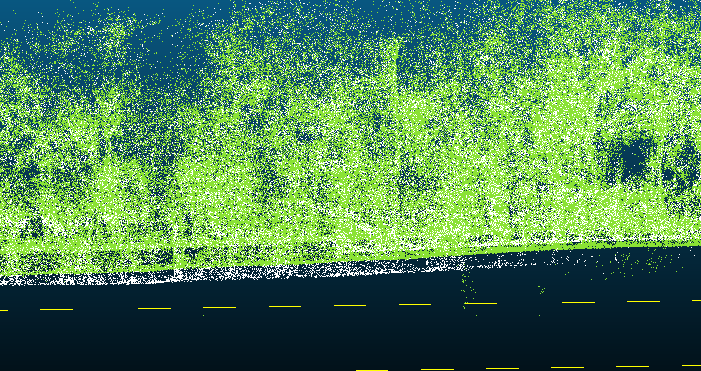
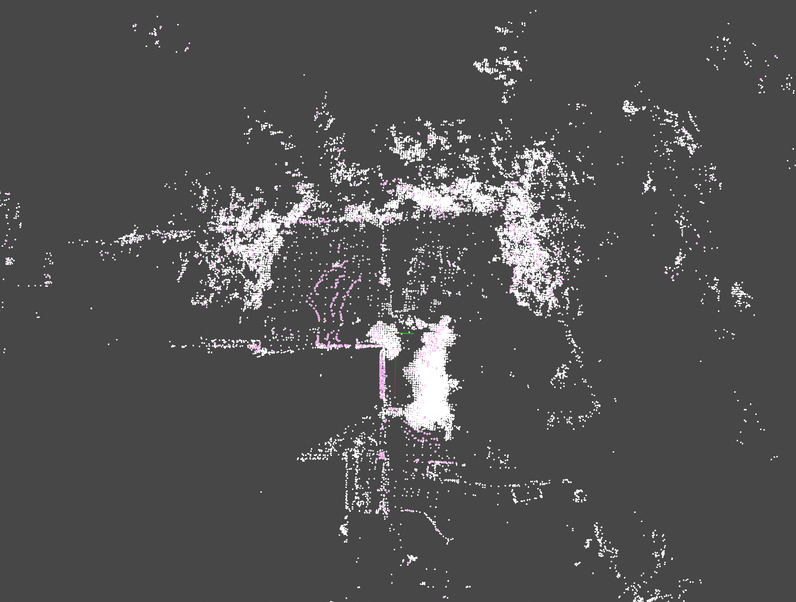

# 单发单收mid360s数据采集说明

# 1. 机器

配备单发单收(现在是四发四收)的mid360s，点数是原来的四分之一）

软件版本：当天正式版本

# 2. 试采集要求：

需试采集一组数据，要求在地面行驶约10分钟，录制激光数据及对应的激光 IMU 数据。

&#x20;采集完成后，请将数据发送给  进行验证。验证通过后，可上导轨开始正式采集。

# 3. 采集需求1：

**数据采集要求：**

* 围绕 60、78、105 三个场地外围，以建图方式行驶进行数据采集；

* 采集过程中需录制激光数据及激光 IMU 数据；

* **数据**和对应日志及地图文件，以 “MID360/MID360S-场地号” 形式命名文件夹进行保存发送给&#x20;

* 地图文件：

  * /mnt/data/rockrobo/last\_global\_map.pcd

  * /mnt/data/rockrobo/last\_global\_map\_keyframe.pcd

# 4. 采集需求2：

## 4.1 数据采集：

1. 形式：统一导轨测试，分为直轨和圆轨

2. 要求：需要采集到激光和激光的Imu的数据；和正常数据采集是一样的；

   1. 机器需要固定住 并在导轨上开始；

   2. 结束也要在导轨上；

   3. **每组数据时间为20分钟，其中静止1分钟 19分钟以0.8m/s速度运行**

   * 采集过程中需录制激光数据及激光 IMU 数据

   - **数据**和对应日志，以 “圆轨/直轨-场景号” 形式命名文件夹进行保存发送给 。

## 4.2 场景说明：

✅：需要采集

❌：不需要采集

| 场景                                                                                                                                                                                        | 直轨 | 圆轨 |
| ----------------------------------------------------------------------------------------------------------------------------------------------------------------------------------------- | -- | -- |
| **场景1**：**建筑物 + 树木**                                                                                   | ❌  | ✅  |
| **场景2：一面墙 + 一片竹林** | ✅  | ✅  |
| **场景3：LI角落**                                                                                          | ❌  | ✅  |
| **场景4：双面墙**                                                                                            | ✅  | ❌  |
