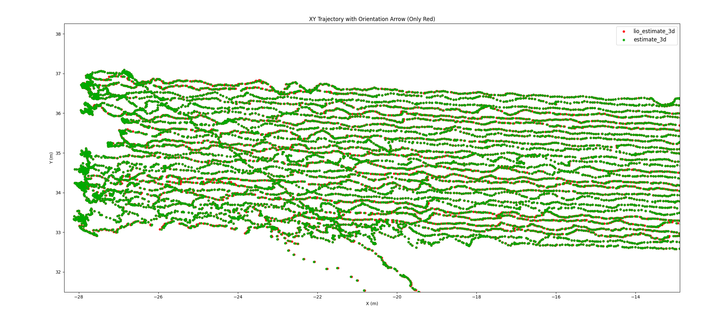
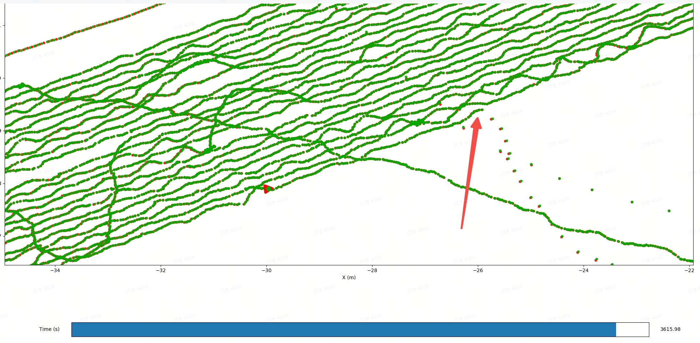
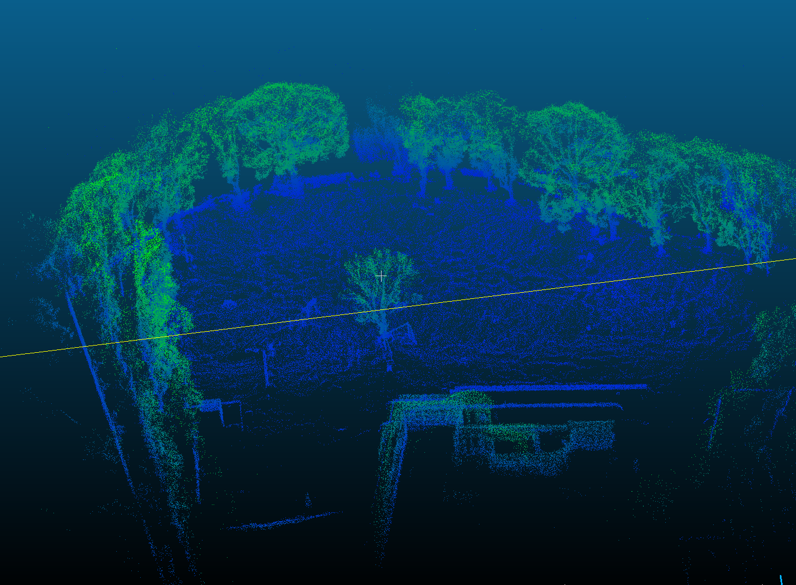
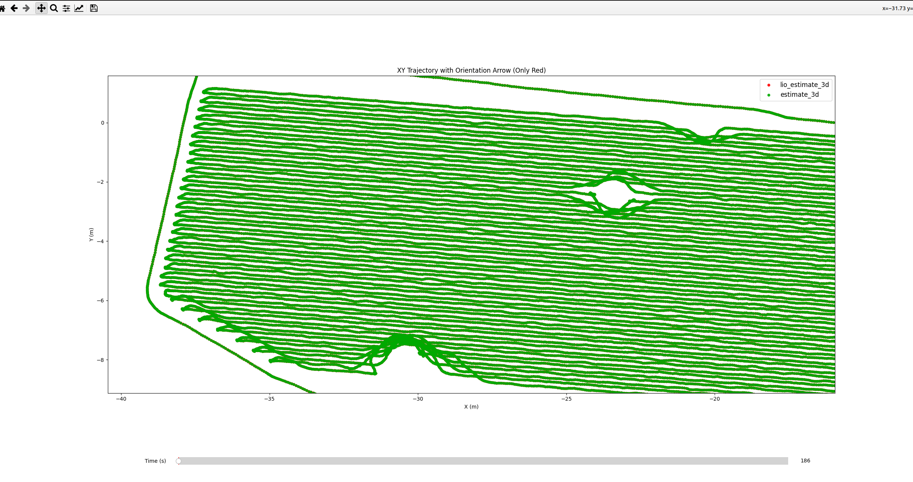
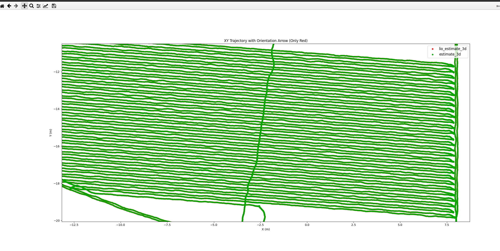

# 单发版MID360s性能对比评估报告

# 1. 测试目的

本次测试旨在评估 单发版**MID360S** 是否能够在建图效果和轨迹精度方面替代 **MID360s** 使用。测试内容涵盖两类典型轨迹场景：

* **圆轨场景**：用于验证设备在曲线路径下的建图与定位能力；

* **直轨场景**：用于验证设备在直线路径下的建图与定位能力。

通过对上述不同环境的综合测试，可全面对比 单发版MID360s 与 MID360S 在多种场景下的精度表现和稳定性。

# 2. 数据采集及场景说明：

可参考：[ 单发单收mid360s数据采集说明](https://roborock.feishu.cn/wiki/VQQAwigIPikvsFkJS2VcqWtEnBg?from=from_copylink)

# 3. 测试结论：

测试结论如下：

| 测试结论                                                                                                                                                                                                                                                                                                                                                                                                                         | 测试结果链接 （详细）                                                                                      |
| ---------------------------------------------------------------------------------------------------------------------------------------------------------------------------------------------------------------------------------------------------------------------------------------------------------------------------------------------------------------------------------------------------------------------------- | ------------------------------------------------------------------------------------------------ |
|      定位表现： 单发版MID360S相较于MID360s精度略差1\~2cm。     建图表现： 105场地建图会存在一定的分层现象                 78和60场地整体建图效果接近。      功能表现：                                                            单发版mid360s                                                       mid360s | [ 单发mid360s测试结果](https://roborock.feishu.cn/wiki/CZLNwl5vSihvb7k0dyecIucbnUg?from=from_copylink) |
| 补充： 400平点云图：400平的区域割草轨迹图如下：                                                                                                                                         |                                                                                                  |

