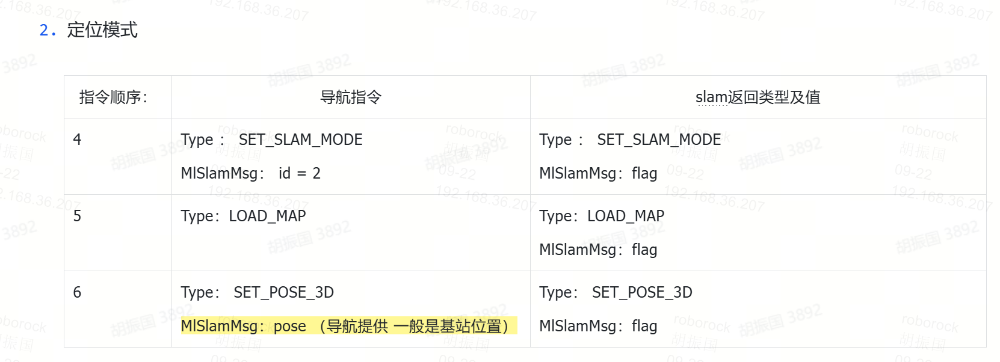
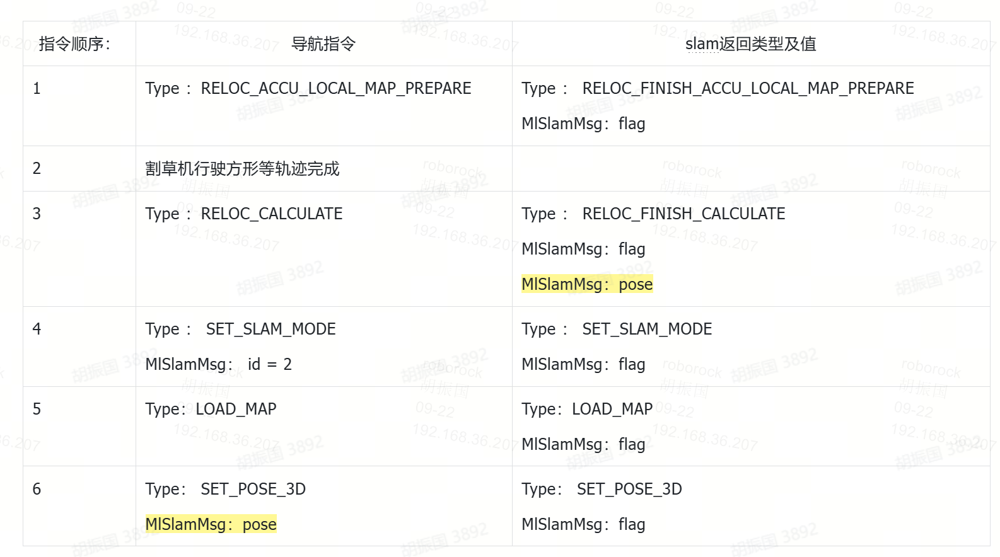

# VERSA导航-定位模块交互：建图&定位&重定位

# 1 概述

梳理一下versa项目的建图，定位和重定位的导航模块、定位模块的交互流程。

# 2 点击割草：(定位模式）

**点击割草，**&#x9700;要进入定位模式，定位模式已有地图，需要下发定位几个指令：

1. **建图后原地不动**，点击割草，切换定位模式，需要下发**定位模式3**个指令，SET\_SLAM\_MODE pose set pose（loadmap除外）模式(定位模块内部切换状态)；

2. **出桩**，先执行退桩+自旋（空转等待lidar启动），等待雷达开启标志位，确认雷达开启后，与定位模块进行定位交互：需要下发4，5，6指令(位置是桩的记录位置，加上递推后补偿的位置)；成功定位后，再发送退桩完成给状态机；退桩后的位姿如何获取？

3. **非桩出=任意位置启动**

   1. 有重定位的几种情况，按各种3节的逻辑，进入重定位逻辑，重定位成功后，切换定位模式，位置是重定位成功的位置

   2. 连续切换（比如a情况，以及定位切换定位等）

# 3  搬动、重启、桩异常：（重定位模式）

重定位模式一般是在**已有地图下**，非桩出时执行，有如下情况：

1. 非桩出

   1. 非桩出割草或建图，且之前出现过**搬动（跟Butchart一起做，Versa可以复用）**&#x884C;为，需要导航执行重定位动作，执行成功之后，搬动标志位清零；

   2. 非桩出割草或建图，且之前出现过**重启**操作，需要导航执行重定位动作，执行成功之后，重启标志位清零；

   3. 非桩出割草或建图，且之前出现过**传感器全关**操作，需要导航执行重定位动作，执行成功之后，该标志位清零；

   4. 非桩出，连续切换，参考2中a

      **需要下发：定位模式**2个指令，SET\_SLAM\_MODE pose set pose信号给当前定位的值触发就行 ，看下匹配度；

      1. 反馈false==》切换重定位

      2. 正常继续===>无需重定位

2. 其他桩异常情况，需要先触发重定位：

   1. 看桩坐标是否有变化

   导航记录下桩时候桩坐标和回桩时候桩坐标不同，下次出桩需要重定位，并更新桩坐标

   * 桩是否断电

   如果桩断电，那下次出桩一定做重定位

3. 其他情况可补充...（主动申请，slam模块以后预研后增加）

重定位操作如下：

判断雷达是否开启，若未开启，先自旋，等待雷达开启，雷达开启后执行如下流程：

# 4 建图模式

导航判断当前有图或无图，无图进行直接建图操作，有图则需在建图前判断是否执行定位或重定位操作；

## 4.1 无图建图（初次建图模式）

### 导航与状态机模块：

导航在退庄后发送定位是否可用给状态机（接口待定义），用于状态机判断定位是否可用（代替之前RTK项目的inited），暂定状态机在versa项目上不要这个标志位，先不发送。

其他任务交互（建图、通道、禁区）保持不变；

### ~~导航与定位模块：~~

~~直接进行建图交互：与之前相比，增加了一个mode：1为新建图；3为扩展建图；~~

| 指令顺序： | 导航指令                                                | slam返回类型及值                           |
| ----- | --------------------------------------------------- | ------------------------------------ |
| 1     | Type: SET\_SLAM\_MODEMlSlamMsg: id =1; ~~mode =1;~~ | Type: SET\_SLAM\_MODEMlSlamMsg: flag |
| 2     | 遥控机器行驶                                              |                                      |
| 3     | Type: SAVE\_MAP                                     | Type: SAVE\_MAPMlSlamMsg: flag       |

## 4.2 有图建图（扩展建图模式）

模式新增：1为新建图；3为扩展建图；

扩展模式触发：上面几个按钮按下，需要在原有地图下，然后进入**新建区域的状态（任务状态）**：

1. 首先，**校检定位是在原来地图上**

   3. **非桩出=任意位置启动**

      1. 符合重定位情况（非桩开始搬动，桩异常等等），先重定位：

         1. 重定位不正常退出；

         2. 重定位正常，先切换定位模式(**3个指令**)，继续===>

      2. 连续切换；&#x20;

         **定位模式**2个指令，SET\_SLAM\_MODE  set\_pose信号给当前定位的值触发就行 ，看下匹配度；&#x20;

         1. 反馈false==》切换重定位

         2. 正常继续===>

   4. 桩正常的情况出

      1. 需要完成触发定位(**3个指令**)

         1. 不正常，触发重定位？（**定位校检，set pose的匹配度，匹配度不高，会反馈false**  ）

         2. 如果定位模式正常;继续===>

2. 校检完成，确保正常后，需要**导航立刻给定位模块，发进入地图扩展模式的信号；(这个注意和导航的开始建图的位置不一样，后续app的开始建图无需信号)；**

* **保存(地图)按钮**按下，发送SAVE\_MAP接口；

**解耦定位模块和遥控的关联，不使用遥控作为信号；**

旧的内容备份

~~确保机器正常：在有图时，进行增加地图元素时~~

1. ~~桩出则与定位模块执行定位操作。~~

2. ~~非桩出则根据重定位逻辑判断是否需要进行重定位交互。~~

~~触发方式：~~

1. ~~遥控切换定位模式（SET\_SLAM\_MODE（1个指令）），然后导航根据，机器位置是在已有地图里还是外，遥控到已有地图边界外1m外时，发地图扩展模式（只发模式切换），然后又遥控到已有地图边界外1m内时，发定位模式（只发模式切换SET\_SLAM\_MODE（1个指令）），当用户点击保存地图时，发送SAVE\_MAP；~~

   1. ~~导航同学注意：该模式发送与建图子任务独立开，只要在MAP大任务，就可发送，不影响导航内部的建图逻辑，导航还是跟随子任务开始存位置点，跟随用户点击保存而保存地图；~~

2. ~~已有地图下，点击建图、或点击建禁区等元素，直接切换地图扩展模式，对应保存需要发保存信号给定位模块；~~

~~非桩出，非重定位，切换定位模式，只发 SET\_SLAM\_MODE（1个指令）即可，无需load\_map和set\_pose；~~

| 指令顺序： | 导航指令                                                                                                                 | slam返回类型及值                           |
| ----- | -------------------------------------------------------------------------------------------------------------------- | ------------------------------------ |
| 1     | 有图建图：Type: SET\_SLAM\_MODEMlSlamMsg: id =3; ~~mode = 3;~~或者，有图定位Type: SET\_SLAM\_MODEMlSlamMsg: id =2;~~ mode = 3;~~ | Type: SET\_SLAM\_MODEMlSlamMsg: flag |
| 2     | 遥控机器行驶                                                                                                               |                                      |
| 3     | Type: SAVE\_MAP                                                                                                      | Type: SAVE\_MAPMlSlamMsg: flag       |

## 4.3 主动重定位模式

当暂停恢复后，连续多帧的匹配率和得分都小于阈值时，定位向导航发送主动重定位请求，导航发起全局重定位流程：

# 5. 遥控模式说明，暂时无交互：

1. 割草时候，突然切换遥控割草？ ，这个时候定位应该是正常的，不用给定位发信号，定位也能正常工作，提供Pose;**一旦出界**，需要导航**控制机器停机**，app显示禁止出界的提醒；

2. 实时视频模式，雷达可能关闭，无需定位信号，到时候看着怎么关闭定位模块，你们直接忽略定位即可；

3. 不存在反复进出，逗你玩的情况；明确任务，无需理会；

# 6. 导航与定位交互逻辑图：

建图定位
