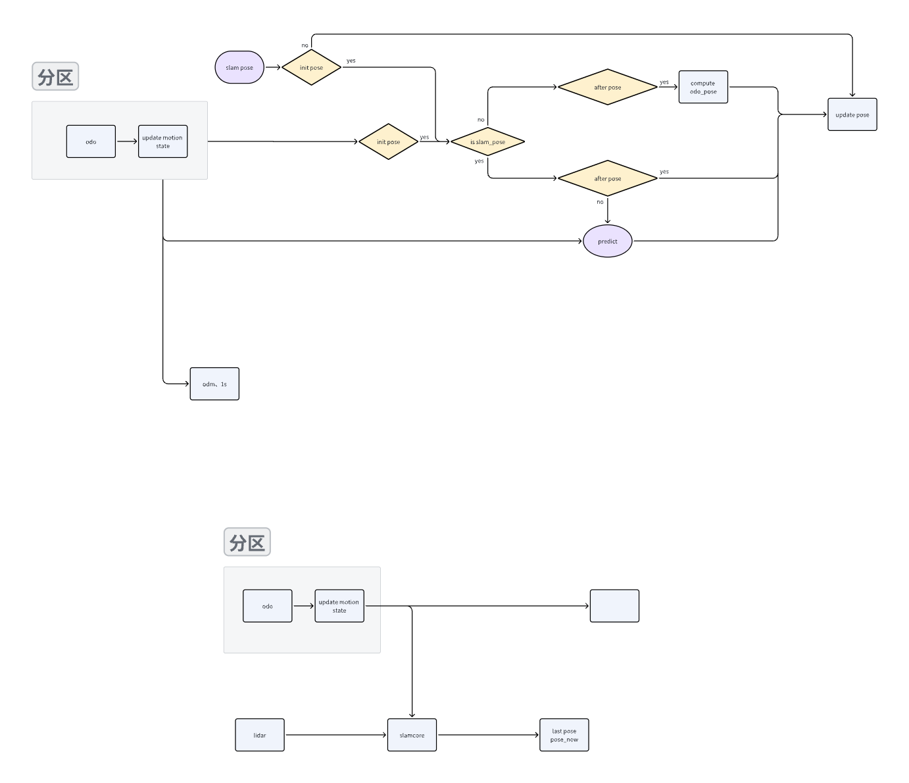
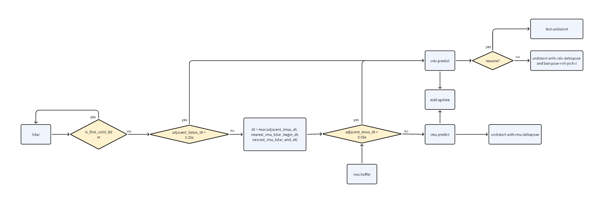
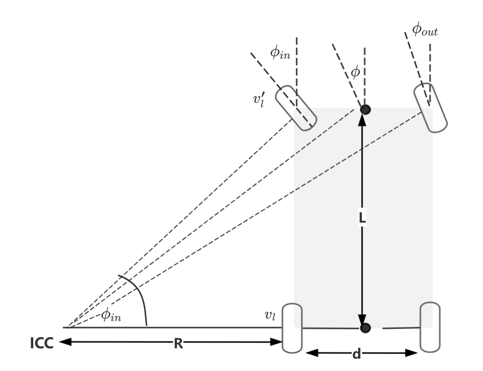
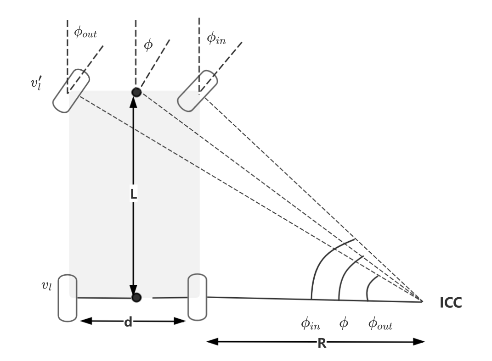
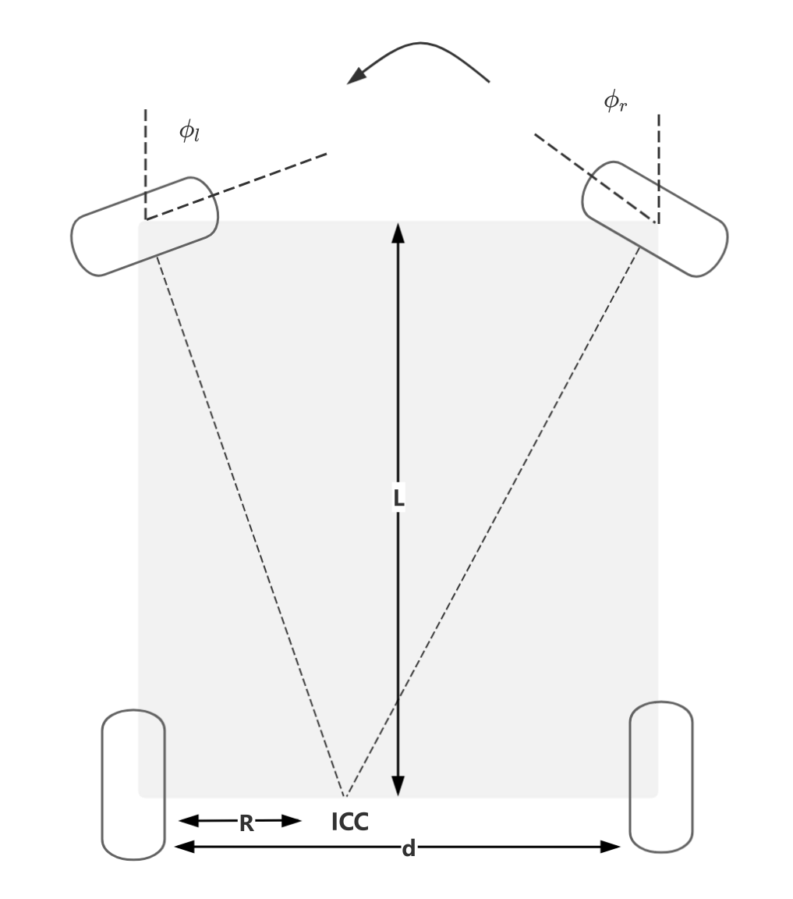
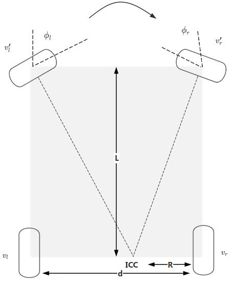

# odoparser设计文档

# 1. 代码主干流程图

# 2. 融合预测功能流程图

# 3. 多传感器时间同步流程图

# 4. 引入到slam的方案设计

需要引入的场景及应对方案：

1. 雷达断流：

   1. pause/resume：

      1. 使用last\_lidar\_end\_time和cur\_lidar\_end\_time对应时刻的delta\_odo\_pose补偿pose\_now\_，无需去畸变;

   2. 雷达丟帧：

      1. 使用last\_lidar\_end\_time和cur\_lidar\_end\_time对应时刻的delta\_odo\_pose补偿pose\_now\_;

      2. 使用cur\_lidar\_start\_time～cur\_lidar\_end\_time期间的odo\_pose进行去畸变;

2. imu断流:

   1. 首帧lidar之前的imu丟帧：

      1. 只cur\_lidar\_start\_time之前的imu丟帧：

         * 使用first\_imu\_time和cur\_lidar\_start\_time对应时刻的delta\_odo\_pose补偿pose\_now\_, update eskf pose，然后正常使用imu进行去畸变;

      2. 只cur\_lidar\_start\_time和cur\_lidar\_end\_time之间的imu丟帧：

         * cur\_lidar\_start\_time之前的使用imu预测pose;

         * 使用cur\_lidar\_start\_time～cur\_lidar\_end\_time期间的odo\_pose进行去畸变;

      3. 如果1和2都存在:

         * 使用last\_lidar\_end\_time和cur\_lidar\_end\_time对应时刻的delta\_odo\_pose补偿pose\_now\_;

         * 使用cur\_lidar\_start\_time～cur\_lidar\_end\_time期间的odo\_pose进行去畸变;

   2. 非首帧lidar之前的imu丟帧:

      1. 使用cur\_lidar\_start\_time～cur\_lidar\_end\_time期间的odo\_pose进行去畸变;

传感器数据断流和机器静止延迟解决方案流程图：

#

# 5. 运动模型解算

[ 四驱里程计正运动学模型推导](https://roborock.feishu.cn/wiki/AU8OwiBBriiN7dkOXEoc6dOZnEb?from=from_copylink)

## 2.1 后轮差速

&#x20;

