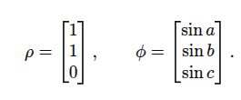
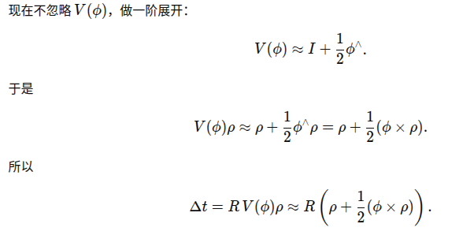
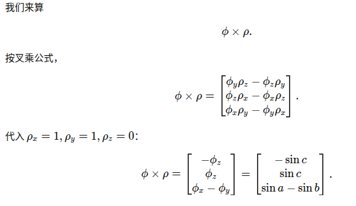
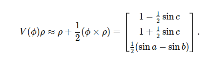
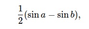
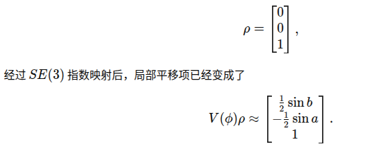
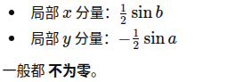
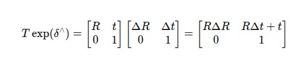
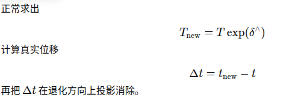

# 匹配中退化抑制分析和决策

退化场景pipeline：

# 1. predict：

1. 激光帧来

PCA分析，判断退化、获得退化方向，**退化方向为体坐标系下的最小特征值方向。**

* all-odom处理。

  将state重置为刚开始的状态，进行odom的递推（从上一次激光结束到这一帧激光结束），reset掉协方差。**并更新ieskf**。

# 2. 进入update:

1. **进入LM配准align\_point\_plane：**

   1. 首先接收退化方向degen\_dir，体坐标系下，二维。

   2. 用icp点面残差迭代求解delta：

      1. 因为是右扰动，所以delta是在体坐标系下。

         1. Z退化

            1. 把delta<2> = 0，假设是：delta \[1，1，**0** ，sina，sinb，sinc]

            2. delta从se3映射成SE3李群后乘入pose:

               之前假设的delta对应的李代数：

               

               &#x20;new\_T = POSE \* EXP（delta）

         $$T_{new} = T * \exp(\delta^\wedge)=T =
         \left[
         \begin{array}{cc}
         R & t \\
         0 & 1
         \end{array}
         \right]* 
         \left[
         \begin{array}{cc}
         \exp(\phi^\wedge) & V(\phi)\rho \\
         0 & 1
         \end{array}
         \right]$$

         只看p部分:

         $$\left[
         \begin{array}{cc} * & RV(\phi)\rho + t \\
         0 & 1
         \end{array}
         \right]$$

         现在关注

         $$\Delta{t} = RV(\phi)\rho$$

         

         

         整理得到：

         

         所以在我的假设下（只有delta的z分量为0），最终世界系下更新的z分量：

         

         **很难为0。**

         * xy退化

           1. 把delta<1> = 0 以及 delta<0> = 0，假设是：delta \[**0**，**0**，1，sina，sinb，sinc]

         按照上述的推导，最后得到的李群上的平移分量为：

         

         

   3. 用这个李群化的delta累加到pose上。

      之前认为的右乘里的delta t，其实已经耦合了角度了，只是我们以为是delta的平移部分，而左乘和右乘都有这项，所以都会耦合：

      

      **按上述，总是会出现各种各样的耦合，则直接在最终转到世界系下的deltapose上做抑制**：

      

