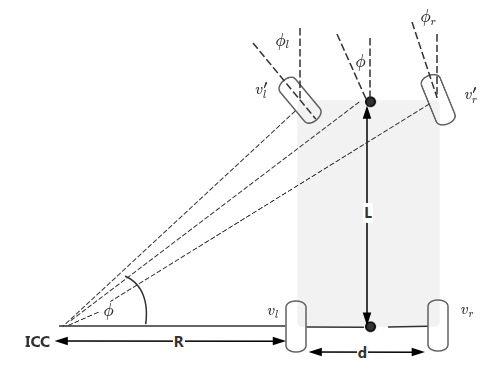
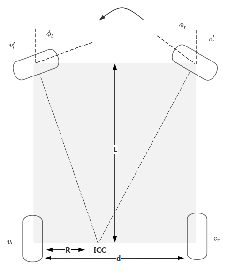

# 四驱里程计正运动学模型推导

机器结构示意图如下：已知轴距L，胎距d（模型推导过程中默认前后轮胎距相同），所有模型的推导都是基于阿克曼几何假设为前提。机器逆时针转为正方向，所有模型推导的都是后轴中心的线速度和角速度。

&#x20;                                  图1                                                                                图2

&#x20;                                    图3

&#x20;                                     图4

说明：以下公式的推导分左转和右转：左转时ICC在后轴中心的左侧，右转时ICC在后轴中心右侧，右转推导时假设顺时针为正，实际上定义的逆时针为正，因此右转推导完后$$w$$和$$\phi$$都需要反号

1. “**左后轮线速度+右后轮线速度**”模型（REAR\_DIFFERENTIAL）

图1：左转：

$$v_r=w（R+d）$$

$$v_l = wR$$

$$\Rightarrow R=dv_l / (v_r - v_l)$$

$$\Rightarrow w = (v_r - v_l)/d$$

$$\Rightarrow v = w(R + d/2 )=(v_l + v_r)/2$$

图2：右转：

$$v_l=w（R+d）$$

$$v_r = wR$$

$$\Rightarrow R=dv_r / (v_l - v_r)$$

$$\Rightarrow w = (v_l - v_r)/d$$

$$\Rightarrow v = w(R + d/2 )=(v_l + v_r)/2$$

图3：左转

$$v_l = -wR$$

$$v_r=w（d-R）$$

$$\Rightarrow R=dv_l / (v_l - v_r)$$

$$\Rightarrow w = (v_r - v_l)/d$$

$$\Rightarrow v = w(d/2-R )=(v_l + v_r)/2$$

图4：右转

$$v_r = -wR$$

$$v_l=w（d-R）$$

$$\Rightarrow R=dv_r / (v_r - v_l)$$

$$\Rightarrow w = (v_l - v_r)/d$$

$$\Rightarrow v = w(d/2-R )=(v_l + v_r)/2$$

考虑角速度逆时针转为正，那么向右转的角速度$$w$$需要加负号，综上4种情况：

$$ w = (v_r - v_l)/d$$

$$v =(v_l + v_r)/2$$

* “**左前轮线速度+左前轮转角**”模型

图1：左转

$$v_l^{\prime} = wr_l= wL/\sin\phi_l$$

$$R=L/\tan\phi_l=L\cos\phi_l/\sin\phi_l$$

$$\Rightarrow w = v_l^{\prime}\sin\phi_l/L$$

$$\Rightarrow  v = w(R+d/2)=v_l^{\prime}(\cos\phi_l+d\sin\phi_l/(2L))$$

图2：右转

$$v_l^{\prime} = wr_l= wL/\sin\phi_l$$

$$R=L/\tan\phi_l-d=L\cos\phi_l/\sin\phi_l-d$$

$$\Rightarrow w = v_l^{\prime}\sin\phi_l/L$$

$$\Rightarrow  v = w(R+d/2)=v_l^{\prime}(\cos\phi_l-d\sin\phi_l/(2L))$$

图3：左转

$$v_l^{\prime} = wr_l= wL/\sin\phi_l$$

$$R=-L/\tan\phi_l=-L\cos\phi_l/\sin\phi_l$$

$$\Rightarrow w = v_l^{\prime}\sin\phi_l/L$$

$$\Rightarrow  v = w(d/2-R)=v_l^{\prime}(\cos\phi_l+d\sin\phi_l/(2L))$$

图4：右转

$$v_l^{\prime} = wr_l= wL/\sin\phi_l$$

$$R=d-L/\tan\phi_l=d-L\cos\phi_l/\sin\phi_l$$

$$\Rightarrow w = v_l^{\prime}\sin\phi_l/L$$

$$\Rightarrow  v = w(d/2-R)=v_l^{\prime}(\cos\phi_l-d\sin\phi_l/(2L))$$

考虑角速度逆时针转为正，那么向右转的角速度$$w$$和转角$$\phi_l$$需要加负号，综上4种情况：

$$w = v_l^{\prime}\sin\phi_l/L$$

$$v =v_l^{\prime}(\cos\phi_l+d\sin\phi_l/(2L))$$

* “**右前轮线速度+右前轮转角**”模型

图1：左转

$$v_r^{\prime} = wr_r= wL/\sin\phi_r$$

$$R=L/\tan\phi_r-d=L\cos\phi_r/\sin\phi_r-d$$

$$\Rightarrow w = v_r^{\prime}\sin\phi_r/L$$

$$\Rightarrow  v = w(R+d/2)=v_r^{\prime}(\cos\phi_r-d\sin\phi_r/(2L))$$

图2：右转

$$v_r^{\prime} = wr_r= wL/\sin\phi_r$$

$$R=L/\tan\phi_r=L\cos\phi_r/\sin\phi_r$$

$$\Rightarrow w = v_r^{\prime}\sin\phi_r/L$$

$$\Rightarrow  v = w(R+d/2)=v_r^{\prime}(\cos\phi_r+d\sin\phi_r/(2L))$$

图3：左转

$$v_r^{\prime} = wr_r= wL/\sin\phi_r$$

$$R=d-L/\tan\phi_r=d-L\cos\phi_r/\sin\phi_r$$

$$\Rightarrow w = v_r^{\prime}\sin\phi_r/L$$

$$\Rightarrow  v = w(d/2-R)=v_l^{\prime}(\cos\phi_l-d\sin\phi_l/(2L))$$

图4：右转

$$v_r^{\prime} = wr_r= wL/\sin\phi_r$$

$$R=-L/\tan\phi_r=-L\cos\phi_r/\sin\phi_r$$

$$\Rightarrow w = v_r^{\prime}\sin\phi_r/L$$

$$\Rightarrow  v = w(d/2-R)=v_r^{\prime}(\cos\phi_r+d\sin\phi_r/(2L))$$

考虑角速度逆时针转为正，那么向右转的角速度$$w$$和转角$$\phi_r$$需要加负号，综上4种情况：

$$w = v_r^{\prime}\sin\phi_r/L$$

$$v = v_r^{\prime}(\cos\phi_r-d\sin\phi_r/(2L))$$

* “**左后轮线速度+左前轮转角**”模型

图1：左转

$$R=L/\tan\phi_l$$

$$v_l = wR= wL/\tan\phi_l$$

$$\Rightarrow w = v_l\tan\phi_l/L$$

$$\Rightarrow  v = w(R+d/2)=v_l(1+d\tan\phi_l/(2L))$$

图2：右转

$$R=L/\tan\phi_l-d$$

$$v_l = w(R+d)= wL/\tan\phi_l$$

$$\Rightarrow w = v_l\tan\phi_l/L$$

$$\Rightarrow  v = w(R+d/2)=v_l(1-d\tan\phi_l/(2L))$$

图3：左转

$$R=-L/\tan\phi_l$$

$$v_l = -wR= wL/\tan\phi_l$$

$$\Rightarrow w = v_l\tan\phi_l/L$$

$$\Rightarrow  v = w(d/2-R)=v_l(1+d\tan\phi_l/(2L))$$

图4：右转

$$R=d-L/\tan\phi_l$$

$$v_l = w(d-R)= wL/\tan\phi_l$$

$$\Rightarrow w = v_l\tan\phi_l/L$$

$$\Rightarrow  v = w(d/2-R)=v_l(1-d\tan\phi_l/(2L))$$

考虑角速度逆时针转为正，那么向右转的角速度$$w$$和转角$$\phi_l$$需要加负号，综上4种情况：

$$w = v_l\tan\phi_l/L$$

$$v =v_l(1+d\tan\phi_l/(2L))$$

* “**右后轮线速度+右前轮转角**”模型

图1：左转

$$R=L/\tan\phi_r-d$$

$$v_r = w(R+d)= wL/\tan\phi_r$$

$$\Rightarrow w = v_r\tan\phi_r/L$$

$$\Rightarrow  v = w(R+d/2)=v_r(1-d\tan\phi_r/(2L))$$

图2：右转

&#x20;$$R=L/\tan\phi_r$$

$$v_r = wR= wL/\tan\phi_r$$

$$\Rightarrow w = v_r\tan\phi_r/L$$

$$\Rightarrow  v = w(R+d/2)=v_r(1+d\tan\phi_r/(2L))$$

图3：左转

$$R=d-L/\tan\phi_r$$

$$v_r = w(d-R)= wL/\tan\phi_r$$

$$\Rightarrow w = v_r\tan\phi_r/L$$

$$\Rightarrow  v = w(d/2-R)=v_r(1-d\tan\phi_r/(2L))$$

图4：右转

$$R=-L/\tan\phi_r$$

$$v_r = -wR= wL/\tan\phi_r$$

$$\Rightarrow w = v_r\tan\phi_r/L$$

$$\Rightarrow  v = w(d/2-R)=v_r(1+d\tan\phi_r/(2L))$$

考虑角速度逆时针转为正，那么向右转的角速度$$w$$和转角$$\phi_r$$需要加负号，综上4种情况：

$$ w = v_r\tan\phi_r/L$$

$$ v =v_r(1-d\tan\phi_r/(2L))$$

* “**左后轮线速度+左前轮线速度**”模型

图1：左转

$$v_l^\prime=wr_l=w\sqrt{R^2+L^2}$$

$$v_l = wR$$

$$\Rightarrow R={v_lL /\sqrt{{{v_l^\prime}^2}- {v_l}^2}}$$

$$\Rightarrow w={v_l /R}=\sqrt{{v_l^\prime}^2-{v_l}^2}/L$$

$$\Rightarrow v=w(R+d/2)=v_l+d\sqrt{{v_l^\prime}^2-{v_l}^2}/(2L)$$

图2：右转

$$v_l^\prime=wr_l=w\sqrt{(R+d)^2+L^2}$$

$$v_l = w(R+d)$$

$$\Rightarrow R={v_lL /\sqrt{{{v_l^\prime}^2}- {v_l}^2}}-d$$

$$\Rightarrow w={v_l /(R+d)}=\sqrt{{v_l^\prime}^2-{v_l}^2}/L$$

$$\Rightarrow v=w(R+d/2)=v_l-d\sqrt{{v_l^\prime}^2-{v_l}^2}/(2L)$$

图3：左转

$$v_l^\prime=-wr_l=w\sqrt{R^2+L^2}$$

$$v_l = -wR$$

$$\Rightarrow R=-{v_lL /\sqrt{{{v_l^\prime}^2}- {v_l}^2}}$$

$$\Rightarrow w=-{v_l /R}=\sqrt{{v_l^\prime}^2-{v_l}^2}/L$$

$$\Rightarrow v=w(d/2-R)=v_l+d\sqrt{{v_l^\prime}^2-{v_l}^2}/(2L)$$

图4：右转

$$v_l^\prime=wr_l=w\sqrt{(d-R)^2+L^2}$$

$$v_l = w(d-R)$$

$$\Rightarrow R=d-{v_lL /\sqrt{{{v_l^\prime}^2}- {v_l}^2}}$$

$$\Rightarrow w={v_l /(d-R)}=\sqrt{{v_l^\prime}^2-{v_l}^2}/L$$

$$\Rightarrow v=w(d/2-R)=v_l-d\sqrt{{v_l^\prime}^2-{v_l}^2}/(2L)$$

综上：

$$w=\begin{cases}\sqrt{{v_l^\prime}^2-{v_l}^2}/L&if&v_l^\prime\times\phi_l>=0\\-\sqrt{{v_l^\prime}^2-{v_l}^2}/L&if&v_l^\prime\times\phi_l<0\end{cases}$$&#x20;

$$v=\begin{cases}v_l+d\sqrt{{v_l^\prime}^2-{v_l}^2}/(2L)&if&v_l^\prime\times\phi_l>=0\\v_l-d\sqrt{{v_l^\prime}^2-{v_l}^2}/(2L)&if&v_l^\prime\times\phi_l<0\end{cases}$$

* “**右后轮线速度+右前轮线速度**”模型

图1：左转

$$v_r^\prime=wr_r=w\sqrt{(R+d)^2+L^2}$$

$$v_r = w(R+d)$$

$$\Rightarrow R={v_rL /\sqrt{{{v_r^\prime}^2}- {v_r}^2}}-d$$

$$\Rightarrow w={v_r /(R+d)}=\sqrt{{v_r^\prime}^2-{v_r}^2}/L$$

$$\Rightarrow v=w(R+d/2)=v_r-d\sqrt{{v_r^\prime}^2-{v_r}^2}/(2L)$$

图2：右转

$$v_r^\prime=wr_r=w\sqrt{R^2+L^2}$$

$$v_r = wR$$

$$\Rightarrow R={v_rL /\sqrt{{{v_r^\prime}^2}- {v_r}^2}}$$

$$\Rightarrow w={v_r /R}=\sqrt{{v_r^\prime}^2-{v_r}^2}/L$$

$$\Rightarrow v=w(R+d/2)=v_r+d\sqrt{{v_r^\prime}^2-{v_r}^2}/(2L)$$

图3：左转

$$v_r^\prime=wr_r=w\sqrt{(d-R)^2+L^2}$$

$$v_r = w(d-R)$$

$$\Rightarrow R=d-{v_rL /\sqrt{{{v_r^\prime}^2}- {v_r}^2}}$$

$$\Rightarrow w={v_r /(d-R)}=\sqrt{{v_r^\prime}^2-{v_r}^2}/L$$

$$\Rightarrow v=w(d/2-R)=v_r-d\sqrt{{v_r^\prime}^2-{v_r}^2}/(2L)$$

图4：右转

$$v_r^\prime=-wr_r=w\sqrt{R^2+L^2}$$

$$v_r = -wR$$

$$\Rightarrow R=-{v_rL /\sqrt{{{v_r^\prime}^2}- {v_r}^2}}$$

$$\Rightarrow w=-{v_r /R}=\sqrt{{v_r^\prime}^2-{v_r}^2}/L$$

$$\Rightarrow v=w(d/2-R)=v_r+d\sqrt{{v_r^\prime}^2-{v_r}^2}/(2L)$$

综上：

$$w=\begin{cases}\sqrt{{v_r^\prime}^2-{v_r}^2}/L&if&v_r^\prime\times\phi_r>=0\\-\sqrt{{v_r^\prime}^2-{v_r}^2}/L&if&v_r^\prime\times\phi_r<0\end{cases}$$&#x20;

$$v=\begin{cases}v_r-d\sqrt{{v_r^\prime}^2-{v_r}^2}/(2L)&if&v_r^\prime\times\phi_r>=0\\v_r+d\sqrt{{v_r^\prime}^2-{v_r}^2}/(2L)&if&v_r^\prime\times\phi_r<0\end{cases}$$

> 思考
>
> 1. 这个模型的w和v该怎么统一？（当前能想到的是左前轮转角与左前轮速度相乘的取值符号）
>
> 2. 是否能像差速模型一样，仅通过左前轮速度和左后轮速度确定运动方向？是否一定需要借助外界量？

