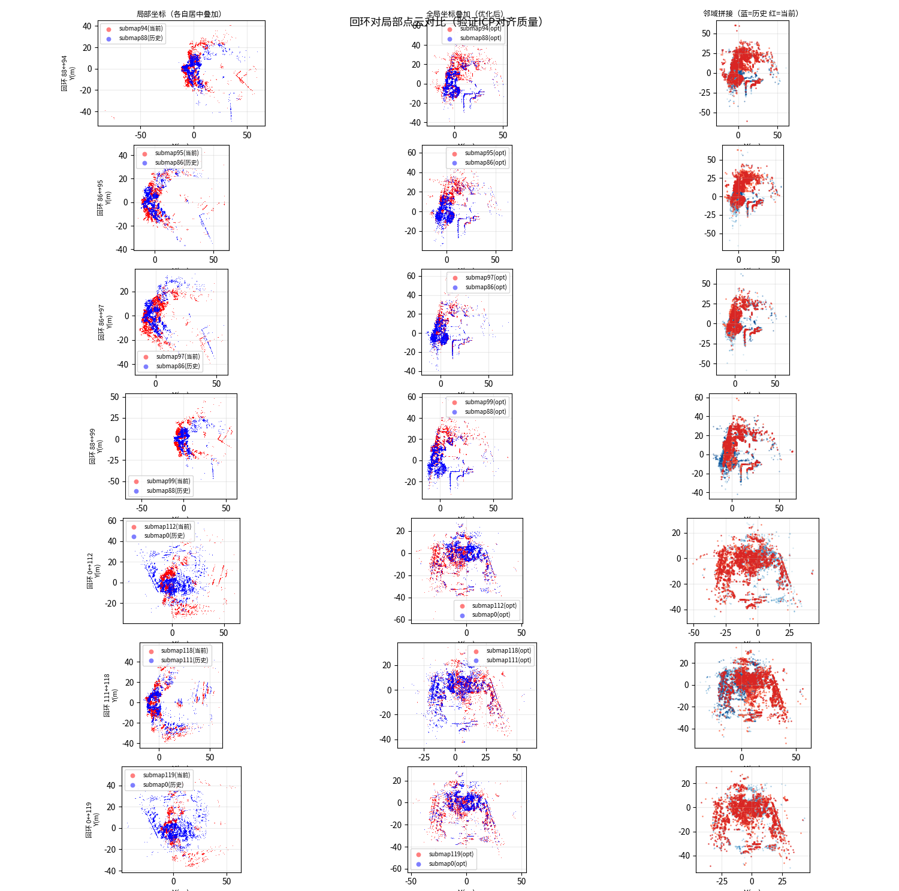
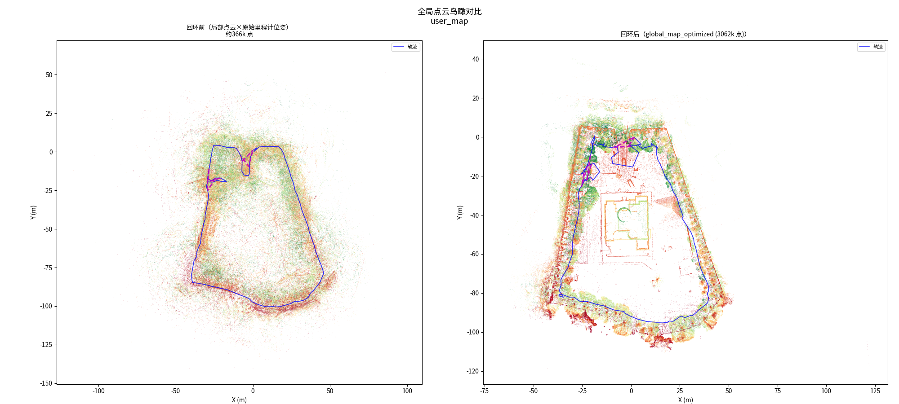
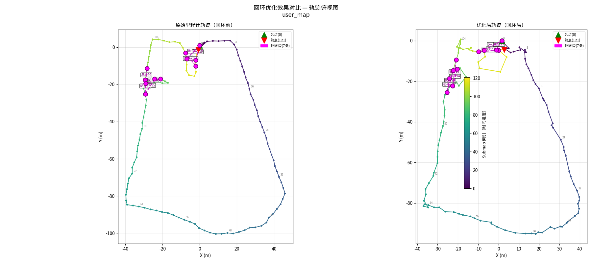

# 回环新逻辑分析与方案设计

## **当前程序逻辑分析**

### 1. 整体架构流程

```plain&#x20;text
┌─────────────────────────────────────────────────────────────────────────┐
│                        SLAM 回环检测后端优化流程                           
├─────────────────────────────────────────────────────────────────────────┤
│                                                                         
│  [关键帧输入] → [Submap合并] → [回环检测] → [位姿图优化] → [地图输出]        
│                                                                         
│   每30帧          ICP匹配        g2o优化        PCD保存                   
│   合并为1个       查找候选        增量求解       g2o图保存                  
│   Submap         阈值判定                                                
└─────────────────────────────────────────────────────────────────────────┘
```

### 2. 核心模块职责

| 模块                     | 职责              | 关键参数                                         |
| ---------------------- | --------------- | -------------------------------------------- |
| **SubmapsManager**     | 管理关键帧到Submap的合并 | `merge_size_=30`（每30帧合并1个Submap）             |
| **LoopClosure**        | 回环检测与位姿图构建      | `LOOP_RADIUS=10m`，`score<0.15`, `ratio>0.42` |
| **PoseGraphOptimizer** | 基于g2o的位姿图优化     | 里程计边权重100/400，回环边权重100\~150                  |


### 3. 当前回环检测策略

#### 3.1 普通回环检测（`detect_latest_loop`）

#### 3.2 首末强匹配（`try_strong_loop_closure` / `try_end_to_start_loop_closure`）

#### 3.3 测试程序中的端点回环（`try_endpoint_loop_closure`）

* 使用第一帧作为起点参考

* 使用最后一帧作为终点参考

* 在析构函数中触发，属于**离线后处理**逻辑


***

## **当前逻辑的缺陷**


1. 缺陷


目前信号2是收不到的；


* 问题：

  1. 变成主动策略；移除首尾逻辑，平等化回环检测；

  2. submap机制，可能会慢一些；如何保证先回环，再提醒；

     1. Keyframe 和历史匹配？


### 核心问题：**当前逻辑是"离线/事后"模式，不是"实时反馈"模式**

| 当前逻辑                         | 用户需求         |
| ---------------------------- | ------------ |
| 建图结束后才做首末回环检测                | 实时检测是否已形成闭环  |
| `trigger_save(true)` 才尝试首末匹配 | 行走过程中持续给用户反馈 |
| 无"可建图/不可建图"状态                | 需要实时状态反馈     |
| 起点固定为第一帧                     | 起点未知，需动态判断   |


***

## **新需求逻辑分析与方案设计**

1. ~~弹出的是什么？~~

2. ~~2万平方，里程计漂移；检测不出来；~~

   1. ~~加强制回环的关联按钮；~~


### 回环需求：

```plain&#x20;text
1. 机器开始建图（起点未知）
2. 遥控行走建图过程中持续检测回环
3. 当检测到"当前位置"与"历史轨迹"形成闭环时 → 显示"可建图"
4. 用户点击 → 执行后端优化并输出地图
5. 用户未点击，继续行走 → 
   - 若仍在闭环区域内 → 保持"可建图"
   - 若离开闭环区域（回环匹配失败）→ 显示"不可建图"
```


### 方案设计：**实时闭环                       ~~  状态机~~**

```plain&#x20;text
┌─────────────────────────────────────────────────────────────────────────┐
│                       实时闭环检测状态机                                  
├─────────────────────────────────────────────────────────────────────────┤
│                                                                         
│   [EXPLORING]  ──回环成功──>  [LOOP_READY]  ──>  [OPTIMIZING]  ──  提示用户（导航已有逻辑）
│       ↑                               │                       │         
│       │                               │ 回环失效               │         
│       │<──────────────────┘                       │         
│       │                                                       │         
│       │<──────────────────────── 完成 ─────┘         
│                                                                         
│   状态说明：                                                             
│   EXPLORING  = 探索中（不可建图）                                         
│   LOOP_READY = 已检测到闭环（可建图）                                      
│   OPTIMIZING = 正在优化建图                                              
└─────────────────────────────────────────────────────────────────────────┘
```


### 需要以下关键修改：

1. ~~**从"首末匹配"改为"任意闭环检测"**~~

   * ~~起点不再限定为第一帧~~

   * ~~只要当前轨迹与历史任意位置形成闭环即可~~

~~1-1；150；~~


2. ~~**新增实时状态机**~~

   * ~~`EXPLORING` → `LOOP_READY` → `OPTIMIZING`~~

   * ~~支持状态回退（离开闭环区域时）~~


3. **新增状态回调机制（和导航交互）**

   * ~~后续上层UI可以实时获取建图状态（可以先通过log输出作为反馈信息~~）

   * ~~支持"可建图/不可建图"的实时反馈~~


4) ~~**持续有效性检测**~~

   * ~~即使检测到闭环后，仍需持续验证~~

   * 用户未点击前若离开闭环区域，状态需回退？


***

## **2.25-3.04针对假回环，回退方式设计了两个思路：**

&#x20;      思路1.    检查优化后的总残差。如果 total\_error 翻了数倍，或者某个位姿的跳变（Jump）超过了阈值：判定： 感觉不行，回退

&#x20;      思路2，抽样校检下，抽取几个Pose 看看匹配度是否下降明显


分析：

对于处理假回环，**思路1（残差/跳变检查）** 在实际工程中往往存在误判风险，因为正确的大回环通常也会带来巨大的位姿修正和短期内的残差上升。

**思路2（抽样校验/地图一致性检查）** 是更稳健的方案，也就是 **"回退检测"&#x20;**。如果一次优化导致地图“崩了”，那么原本相邻或重叠也很好的区域（例如相邻的里程计边），在优化后的位姿下，其点云匹配度反而会显著下降。


### 推荐方案：基于里程计边的一致性校验

采用一种轻量级的 **抽样校验** 策略：

每次优化结束后，随机抽取几对 **相邻的 Submap**（它们由里程计约束，本身应该是对齐得很好的），计算它们在 **优化后位姿** 下的点云匹配得分。

* 如果优化是正确的，这些相邻 Submap 的相对位置应该保持精准，匹配得分依然很低（好）。

* 如果优化是错误的（被假回环拉扯），整个地图变形，导致原本对齐的相邻 Submap 被强行扯开，匹配得分会剧烈恶化。

### 为什么选择思路2？

1. **鲁棒性更强**：

   * **思路1（残差/跳变）的缺陷**：当存在较大的里程计累积误差时，正确的闭环通常也会导致巨大的位姿跳变和残差增加。很难设置一个通用的阈值来区分“修正了大漂移的正确回环”和“导致地图扭曲的错误回环”。

   * **思路2（几何校验）的优势**：如果回环是错误的（假回环），它往往会强行拉扯地图，导致原本拼接良好的**相邻子图**在优化后的位置上出现重影或错位。通过抽样检查相邻子图在优化后位姿下的匹配度，可以直观且准确地判断地图是否已崩坏。


2. **现有设施支持**：目前的 `IncVoxelMap` 和配准接口已经成熟，可以复用用于校验。

   ***

### 实现方案

**主要修改逻辑：**

1. 在 `run_optimization_step` 中，优化完成后，**先不更新** `optimized_poses_`。

2. 调用 `verify_optimization_result` 对新计算出的位姿进行抽样检查（检查相邻子图的一致性）。

3) 如果校验通过 -> 更新位姿。

4) 如果校验失败 -> 丢弃本次结果，并**剔除**导致错误的最新回环边，防止它污染后续优化。


**核心逻辑：**

1. 在更新 `optimized_poses_` 之前，先在一个临时副本上应用优化结果。

2. **校验**：抽取 3-5 对相邻 Submap（例如 `i` and `i-1`），利用 **优化后** 的位姿计算 ICP Score。

3) **判定**：如果平均 Score 超过阈值（例如 > 0.3，正常应 < 0.1），则判定优化失败（地图崩坏）。

4) **回退**：丢弃本次优化结果，并移除触发本次优化的最近一条回环边（认为是它是罪魁祸首），加入黑名单防止再次添加。

### 在 `optimize_pose_graph` 函数中添加这个回退机制。


需要修改 `run_optimization_step` 函数。

目前的 `run_optimization_step` 是：

1. Snapshot 数据

2. 构建图

3) `optimizer_->solve()`

4) 提取结果到 `new_optimized_poses`

5. 更新 `optimized_poses_`


在 **第 4 步和第 5 步之间** 插入校验逻辑。

#### 修改 LoopClousre.hpp

实现以下变更：

1. 增加 `verify_optimization_result` 函数，用于抽样计算 Score。

2. 在 `run_optimization_step` 中调用该校验。

3) 如果校验失败，回滚并剔除最近的回环边。

***

## **2.25-3.04最新基于 Submap 的异步回环检测与后端优化完整设计方案**

### **1. 系统架构概览**


该方案采用 **两级筛选（距离初筛 + ICP精筛）** 配合 **异步图优化** 与 **几何一致性验证**，旨在解决大尺度场景下的累积漂移问题，同时保证地图构建的鲁棒性和实时性。


系统主要分为三个并行工作的模块：

1. **前端输入与 Submap 构建** (主线程)

2. **回环检测策略** (后台检测线程)

3) **图优化与验证** (后台优化线程)


***


### **2. 详细流程梳理&#x20;**


#### **阶段一：前端数据输入 & Submap 构建**

*执行位置：主线程 (*`add_keyframe_from_odometry`, `add_new_submap`*)*


* **输入**：前端里程计不断输出包含位姿和点云的 **关键帧 (Keyframe)**。

* **策略**：为了降低计算量，系统不直接对每一帧进行回环，而是采用 **Submap (子图)** 方案。

  * **累计**：系统缓存最近的 **5帧** (配置参数 `merge_size`)。

  * **生成**：当累计满 5帧时，将这些帧的点云融合，生成一个新的稀疏 **Submap**，并将其加入系统。Submap 的位姿取自中间帧的位姿。（默认30帧）

* **触发**：每生成一个新的 Submap，立即触发一次 **回环检测任务** (`detect_latest_loop`)。

  * *意义：此时 Submap 尚未加入优化图，仅具有基于里程计的初始位姿。*


#### **阶段二：增强型回环检测**

*执行位置：后台检测线程 (*`loop_detection_thread`*)*


**A. 候选筛选**

当一个新的 Submap （S\_{curr}）生成时，系统在历史 Submap 中寻找潜在闭环对象：

1. **常规半径搜索**：在 $$S_{curr}$$ 周围 **10米** 半径内搜索历史 Submap。

2. **序列过滤**：忽略 $$S_{curr}$$ 自身及相邻的 3 个 Submap，避免局部相邻帧被误判。

3) **强制起点连接&#x20;**：

   * **痛点**：若里程计漂移超过 10m，$S\_{curr}$ 实际已回到起点，但坐标显示还在远处，常规搜索会失效。

   * **对策**：只要 $$S_{curr}$$ 索引 > 5 且与起点 $$S_0$$ 的距离 < **20米**（放宽阈值），**强制将 $$S_0$$ 加入候选列表**。即使漂移很大，也能强行尝试闭环。


**B. 异步验证**

筛选出的候选 Submap (S\_{match}) 被放入任务队列，后台线程逐一处理：

1. **构建局部地图**：利用 $$S_{match}$$ 的点云构建局部 **VoxelMap**。

2. **配准&#x20;**：使用 **点到面 ICP** (`align_point_plane`) 计算 $$S_{curr}$$ 与 $$S_{match}$$ 之间的相对位姿 $T\_{ij}$。

3) **双重阈值判定**：

   * **Score (均方误差)**：必须 **< 0.15** (高精度要求)。

   * **Matched Ratio (重合度)**：必须 **> 0.45** (确保匹配完整)。

   * *注：针对特定场景（如窄长走廊），可动态调整为宽松模式 (Score < 0.10, Ratio > 0.30)。*

* **结果**：验证通过后，生成一条 **回环边&#x20;**，并推送到优化器。


#### **阶段三：增量式图优化与安全验证&#x20;**

*执行位置：后台优化线程 (*`optimization_thread`*)*


**A. 图构建&#x20;**

维护一个全局因子图 ：

* **顶点&#x20;**：每个 Submap 的位姿。

* **里程计边&#x20;**：相邻 Submap 间的相对位姿约束（权重低，允许修正）。

* **回环边&#x20;**：检测线程生成的约束（**权重极高**，用于拉正地图）。

* **先验约束**：锁定起点 $$S_0$$ 在原点，防止地图整体漂移。


**B. 优化求解**

* 定期 (1Hz) 使用 **G2O 求解器** 进行非线性最小二乘优化。

* 此过程在后台运行，**完全不阻塞主线程**。


**C. 几何一致性验证&#x20;**

这是防止地图“崩坏”的关键防线：

* **目的**：防止错误的回环导致地图扭曲（例如把直走廊拉弯）。

* **采样检查**：优化完成后，随机抽取几对 **相邻** 的 Submap。

* **事后验证**：

  1. 利用 **优化后** 的新位姿 $$P_{opt\_i}$$ 和 $$P_{opt\_i+1}$$ 将两个 Submap 拼接。

  2. 计算拼接后的 **ICP Score**。

  3) **判定**：如果优化是正确的，相邻 Submap 应该无缝拼接（Score 低）。如果 Score 激增（如 > 0.3m），说明优化破坏了局部一致性。

* **熔断机制**：虽然目前代码仅打印 `WARN`，但逻辑上支持 **回滚&#x20;**——如果验证失败，丢弃本次优化结果并剔除可疑的回环边。


***

### **3. 核心设计**


1. **高鲁棒性&#x20;**：

   * **抗大漂移**：通过“强制起点连接”，解决了 10m+ 累积误差导致无法闭环的问题。

   * **抗误匹配**：增加了后端优化后的“几何一致性验证”，确保地图局部结构在优化后依然保持完整。


2. **高性能与实时性**：

   * **完全异步**：ICP 配准（检测）和 G2O 求解（优化）均在后台线程运行。

   * **无锁计算**：优化过程采用 **快照&#x20;**&#x673A;制，G2O 求解时无需持有大锁，主里程计线程几乎不受影响，即使在高频运行下也不会卡顿。


### **4. 实时性效果**

#### 1. 核心实时性设计&#x20;

系统采用了 **完全异步** 的多线程设计，将重型计算剥离出主线程：


* **主线程**: 仅负责轻量级的数据推送。

  * 调用 `add_keyframe_from_odometry` 和 `add_new_submap` 仅涉及简单的内存拷贝和队列操作。

  * **耗时**: 微秒 (us) 级别。

  * **效果**: 里程计 即使在高频率 (10Hz+) 下运行，也不会因为回环检测而出现卡顿或掉帧。


* **检测线程**:

  * 在后台独立运行点云配准 (ICP)。

  * **耗时**: 取决于 Submap 大小和候选数量，通常为 **10ms - 100ms**。

  * 即使检测耗时较长，也不会影响主线程的定位输出。


* **优化线程**:

  * 定期 (1Hz) 执行图优化。

  * **耗时**: 取决于图的规模（顶点和边的数量）。通常为 **毫秒到秒级**。

  * 它的运行完全独立，即使优化需要 1 秒钟，也不会导致实时定位延迟。


#### 2. 潜在瓶颈与优化


虽然架构本身是实时的，但在极端情况下仍需注意：

* **锁竞争**

  * `submaps_mutex_` 是一个大锁，保护了 critical data (submap deque, optimized poses)。

  * **风险**: 如果优化线程在进行大规模优化时长时间持有该锁，而主线程尝试添加关键帧 (`add_keyframe`)，主线程可能会被短暂阻塞。

  * **当前状态**: 优化过程中的 `solve()` 是耗时大头，但代码中显示它是在持有锁 *之后* 还没释放？

  **注意**: 存在一个 **实时性风险**。`optimizer_->solve()` 包含了复杂的矩阵运算，是极其耗时的。如果它仍然持有 `submaps_mutex_`，那么在此期间主线程调用 `add_new_submap` 会被阻塞

  （需要改进）

  （已改进）

  在最新的 `run_optimization_step` 中，设计已经优化了：

  **结论**: 现在的设计采用了 **Copy-on-Write / Snapshot** 机制，极其耗时的 `solve()` 过程是在 **无锁** 状态下进行的。这极大地保证了实时性。


#### 总结评估


* **前端影响**: **极低**。主线程几乎感知不到回环模块的存在。

* **计算效率**: 后台线程利用空闲 CPU 资源，不抢占主线程时间片。

* **延迟**: 回环修正会有轻微的 **延时生效**（检测+优化耗时），但在大多数 SLAM 应用（如导航、建图）中是完全可接受的。


改了一版去了首尾检测后 用5帧合成一个小submap 然后进行回环检测的【因为检查了数据轮速平均大概0.6m/s 基本上处理速度是1s1帧 5帧大概走3-4米 以这个范围内做回环匹配特征值也够 然后回环匹配数目明显增加 采用增量修正的效果也更好了 就是我在看耗时 目前看好像可以也撑得住？
（跑所有数据集测试一下回环效果）

用3帧的误检会高很多 特征值不够了


我想把点击这个时刻开始作为submap0的话 这个反馈信号我们能获取到么？


最新rebase后推private/yjf/online\_loop\_06

***

03


## **2.25-3.04**当前回环检测 + 后端优化 系统完整分析

### 一、整体架构流程图


```plain&#x20;text
主线程(T769850)          检测线程(T769860)          优化线程(T769859)
─────────────────       ─────────────────       ─────────────────
SLAM前端处理               等待任务                  每1s触发
     │
 add_keyframe()
     │
 每5帧 → refresh_submap()
     │
 detect_loop()
  ├─ 半径搜索候选
  ├─ 过滤(±2邻居)
  ├─ 去重检查
  ├─ 合并参考点云(j±2)
  └─ 提交LoopTask ──→  try_loop_closure()         run_optimization_step()
                        ├─ build VoxelMap            ├─ 增量添加顶点/边
                        ├─ ICP匹配(4轮)              ├─ Ceres求解
                        ├─ 阈值判定                   ├─ ICP验证(采样)
                        └─ 存入loop_edges_ ──────→   └─ 更新optimized_poses_
                                                          │
                                                     save_all()
                                                      ├─ PCD点云
                                                      ├─ g2o图
                                                      ├─ Umeyama对齐
                                                      └─ global_map_optimized.pcd
```


### 二、关键模块实现细节


#### 1. Submap构建（SubmapsManager）


| 项目    | 当前实现                                                                   |
| ----- | ---------------------------------------------------------------------- |
| 合并策略  | 每 **6帧** keyframe 合并为1个 submap                                         |
| 原点选择  | 中间帧 `frames[size/2]` 的 pose                                            |
| 点云拼合  | 其他帧变换到中间帧坐标系后拼接                                                        |
| 容量管理  | `boost::circular_buffer<Frame>`，最大 400 个                               |
| 剩余帧处理 | `flush_remaining()`：直接创建 / `flush_remaining_with_borrow()`：借用前submap补齐 |


#### 2. 回环检测（detect\_loop）


| 步骤   | 实现                                                          |
| ---- | ----------------------------------------------------------- |
| 候选搜索 | KD-tree 半径搜索，`LOOP_RADIUS=10m`                              |
| 候选过滤 | 排除自身、比自身新的、相邻 ±2 的                                          |
| 选择策略 | **最久远的候选**（index最小），跨越时间最长的回环                               |
| 去重   | `matched_pairs_` 集合，相邻 ±1 的对已匹配则跳过                          |
| 参考构建 | 合并 `farthest_j ± 2` 的点云（最多5个submap≈15m，约69k点），变换到 j 坐标系     |
| 安全裁剪 | `while (j_max >= 0 && abs(latest - j_max) <= 2)` 防止参考与当前帧重叠 |


#### 3. ICP匹配（try\_loop\_closure）


| 参数    | 值                               | 说明                   |
| ----- | ------------------------------- | -------------------- |
| ICP迭代 | 4轮外迭代                           | 每轮内部15次 Gauss-Newton |
| 收敛精度  | 0.001                           | 较严格                  |
| 初始变换  | `frame_i.pose⁻¹ * frame_j.pose` | 利用里程计先验              |
| 严格阈值  | score<0.15 && ratio>0.42        | 常规通过                 |
| 宽松阈值  | score<0.10 && ratio>0.36        | score极低时放宽ratio      |
| 边方向   | 归一化为 newer→older                | 统一约定                 |


#### 4. 后端优化（run\_optimization\_step）


| 特性    | 实现                                   |
| ----- | ------------------------------------ |
| 求解器   | **Ceres Solver**                     |
| 增量式   | 只添加新顶点/边，不重建全图                       |
| 里程计权重 | trans=100, rot=400                   |
| 回环权重  | 普通=100, 强回环=150                      |
| 先验    | 顶点0固定（权重1e100）                       |
| 验证    | 采样相邻submap ICP校验，avg\_score>0.30 则拒绝 |
| 频率    | 1秒/次                                 |


#### 5. 保存与输出


* PCD点云（local + global）

* g2o图文件（顶点 + 里程计边 + 回环边）

* **Umeyama对齐**：优化后轨迹→里程计轨迹的刚体变换，保持全局坐标一致


6.看一下后续加可视化？

***


### 三、已完成的改进及效果


| 改进项             | 改前        | 改后                      | 效果                                  |
| --------------- | --------- | ----------------------- | ----------------------------------- |
| **merge\_size** | 5         | **6**                   | 单submap覆盖更大（\~18m），特征更完整            |
| **邻居合并范围**      | j±1（最多3个） | **j±2**（最多5个）           | 参考点云从\~42k→\*\*\~69k\*\* pts (+64%) |
| **邻居排除**        | ±1        | **±2**                  | 消除短距离伪回环                            |
| **边方向归一化**      | 不统一       | **newer→older**         | 消除图结构歧义                             |
| **去重机制**        | 无         | **matched\_pairs\_ ±1** | 66次去重，避免冗余匹配                        |
| **simulator覆盖** | 空实例覆盖输出   | **注释掉**                 | g2o结果正确保存                           |


**livox-105 数据集**：86.3% → **94.8%** 成功率（73成功/4失败），0次验证失败

**150m 数据集**：avg\_ratio 0.461 → **0.522** (+13.2%)，失败 9→3 (-67%)


1、将hpp拆解为h和cpp

2、修改多处代码bug
3、提高ratio：思路一个submap和target的前后4个（一共5个匹配下）；好处是后面回环可以减少更多重复回环； i j  ；j和历史i前后匹配过，就不允许在匹配了；（效果比前后2个好）
4、condition\_variable 替代轮询，降低延迟和CPU开销（改用 std::condition\_variable，任务入队时 notify\_one()，消除无谓的轮询等待。）

5、测试手头所有数据集，可正确回环

最新代码已rebase并推送online\_loop\_06

***

## 3.05-3.11两个分支（online\_loop\_06与online\_loop\_0602）的差异全景（共 5 个文件）

### 一、LoopClousre.h（头文件结构调整）

| 项目                      | `online_loop_0602`（旧） | 当前 `online_loop_06`（新）         |
| ----------------------- | --------------------- | ------------------------------ |
| `save_requested_`       | ✅ 存在（`atomic<bool>`）  | ❌ 已删除                          |
| `condition_variable`    | ❌ 没有                  | ✅ 新增 `loop_task_cv_`           |
| `merge_size_`           | ❌ 没有成员变量              | ✅ 新增                           |
| `total_keyframe_count_` | ❌ 没有                  | ✅ 新增 `atomic<size_t>`          |
| `matched_pairs_`        | ❌ 没有                  | ✅ 新增 `set<pair<int,int>>` 去重集合 |
| `matching_step_strong`  | ✅ 声明存在                | ❌ 已删除（注释掉）                     |

***

### 二、LoopClousre.cpp（核心逻辑，改动最大）


**6 处重大架构变更**：


#### ① `add_keyframe()` —— 内聚化管理

* **旧**：只是把帧丢进 `submaps_manager_`，调用方（simulator/test）需要自己轮询计数后手动调用 `refresh_submap()` + `detect_loop_candidate()`

* **新**：内部自动检测是否产生新 submap，若有则自动调用 `detect_loop_candidate()`，顺带计数打印进度日志。**外部调用方不再需要关心 submap 刷新**


#### ② `detect_loop_candidate()` —— 候选策略修改

* **旧**：找所有半径内候选 + 额外强制检查 Submap 0，多任务全部入队

* **新**：只选**最老**（index 最小）的一个候选，构建 ±2 邻居的**合并参考地图**（点云更密），通过 `matched_pairs_` 去重，用 `condition_variable` 唤醒检测线程


#### ③ `trigger_save()` —— 去异步化

* **旧**：设置 `save_requested_ = true`，等待 opt 线程的轮询循环在下一秒才执行保存

* **新**：直接调用 `refresh_submap()` + `save_all()`，**0 延迟、同步执行**


#### ④ `opt()` + `matching()` —— 消除 CPU 空转

* **旧**：`matching()` 用 `sleep_for(100ms)` 轮询队列；`opt()` 每秒轮询 `save_requested_`

* **新**：`matching()` 用 `condition_variable::wait()` 阻塞等待；`stop_threads()` 用 `notify_one()` 唤醒退出


#### ⑤ `opt_step()` 验证块 —— 性能革命（最核心优化）

* **旧**：每次优化后重建 `IncVoxelMap` + 执行点云 ICP 配准打分，耗时 **几十\~百+ ms**

* **新**：纯 SE(3) 矩阵差检验 `T_delta = T_raw^{-1} * T_opt`，判断 `trans_diff < 0.5m` 且 `angle_diff < 3°`，耗时降至 **微秒级**


#### ⑥ `matching_step()` + `matching_step_strong()` —— 简化与删除

* **旧**：分 `is_forced_check` 和普通两个分支，有独立的强匹配函数

* **新**：统一阈值判断（`score < 0.15 & ratio > 0.42`），边方向规范化为 `newer → older`，成功后写入 `matched_pairs_`，删除 `matching_step_strong`


***


### 三、loop\_closure\_real\_test.cpp（测试用例简化）


* 删除 `loop_detection_count_` 变量（外部不再手动计数）

* 删除手动 `refresh_submap()` + `detect_loop_candidate()` 调用块（现在由 `add_keyframe()` 内部自动完成）

* `merge_size` 从 **5** 改为 **6**（每 6 帧合并为一个 submap）


***


### 四、simulator.cpp（隔离职责）


* 将 `Simulator` 内部的 LoopClosure 初始化/析构全部**注释掉**，避免 Simulator 析构时创建空实例覆盖 test 输出的地图文件

* 删除 `run_log_data()` 中手动触发 submap 刷新的循环（已被 `add_keyframe()` 内聚替代）

***

### 整合状态确认&#x20;


**当前分支已经是整合后的版本**，代码编译 100% 通过，不存在遗留的编译问题。当前分支的代码在以下方面更优：

1. **内聚性更强**：LoopClosure 管理自己的 submap 生命周期，外部接口更干净

2. **性能更好**：消除了 ICP 验证阻塞、轮询 CPU 空转、1秒存储延迟

3) **匹配质量更高**：合并 ±2 邻居构建更大参考地图，去重避免重复匹配


***

## 3.05-3.11online\_loop\_08改进总结

### save\_all改io

save\_all() 在优化线程中同步执行，阻塞优化

每次保存需要：导出全部 PCD（146个submap×2份）+ g2o + Umeyama对齐 + global\_map。从日志看保存耗时约 800ms\~1s。

准备：将保存操作移到单独的IO线程，或仅在最终退出时全量保存，中间只做增量保存。

### 代码清洁（命名修改等）

* 删除 6 个死代码函数（已被快照版本替代）

* 删除 `LoopTask::is_forced_check` 废弃字段

* 重命名局部 `SubSnap` → `MergeSnap` 避免与 `SubmapSnap` 混淆

* 修复拼写 `subamp_pose.pcd` → `submap_pose.pcd`

### 消除锁竞争


**问题 1：`opt_step()` 双重加锁**

* 原先在 `opt_step()` 中对 `submaps_mutex_` 加锁两次 — 第一次拍快照，第二次读 `optimized_poses_` 更新顶点，且步骤 2 中无锁读取 `optimized_poses_` 存在数据竞争隐患

* **修复**：第一次快照时一并拷贝 `opt_poses_snapshot`，后续全部使用局部快照，消除第二次加锁和无锁读取


**问题 2：`save_from_snapshot()` 持锁写盘**

* IO 线程在 `save_from_snapshot()` 中仍持 `submaps_mutex_` 调用 `save_keyframe_and_submap_poses()` 写盘，违背了快照解耦的初衷

* **修复**：在 `io_func()` 快照阶段一并拷贝 keyframe 位姿平移分量，`save_from_snapshot()` 直接从快照构建 PointCloud 写 PCD，**全程不再持 `submaps_mutex_`**；删除 `save_keyframe_and_submap_poses()` 方法


### 效果验证（60/78/105/150）&#xA;

| 指标      | 改进                               |
| ------- | -------------------------------- |
| 最大延迟    | **↓27%\~62%**（最大从 17ms 降至 6.6ms） |
| >8ms 尖刺 | 6 次 → **0 次**                    |
| 回环正确性   | 4 个数据集完全一致                       |
| 编译      | 通过                               |


***


## 3.05-3.11修改后已推online\_loop\_08

### 一、当前代码架构


#### 1.1 整体线程模型


```plain&#x20;text
                        ┌─────────────────────────────────────────────────────────┐
                        │                    Main Thread                          │
                        │                                                         │
                        │  add_keyframe() ──→ submaps_manager_.add_frame_for_merge│
                        │       │                                                 │
                        │       ↓ (产生新submap时)                                │
                        │  detect_loop_candidate()                                │
                        │       │                                                 │
                        │  ┌────┴────────────────────────────────────────────┐    │
                        │  │ Phase 1 (锁内): KD-Tree半径搜索 + 去重检查     │    │
                        │  │   仅复制 shared_ptr + 小矩阵，~1-2ms           │    │
                        │  ├─────────────────────────────────────────────────┤    │
                        │  │ Phase 2 (无锁): 点云深拷贝 + 坐标变换合并      │    │
                        │  │   [j-2..j+2] 共3~5个submap合并为参考           │    │
                        │  ├─────────────────────────────────────────────────┤    │
                        │  │ Phase 3 (task锁): push_back → loop_task_queue_ │    │
                        │  └─────────────────────────────────────────────────┘    │
                        └─────────────────────┬───────────────────────────────────┘
                                              │ notify (condition_variable)
                    ┌─────────────────────────▼────────────────────────────────────┐
                    │                  Matching Thread                              │
                    │                                                               │
                    │  matching_step(task):                                         │
                    │    1. IncVoxelMap.build(merged参考点云)                        │
                    │    2. align_point_plane(当前帧, init_T) → score, ratio        │
                    │    3. 双阈值判定:                                             │
                    │       strict: score<0.15 && ratio>0.42                       │
                    │       loose:  score<0.10 && ratio>0.36                       │
                    │    4. 成功 → loop_edges_.push_back + matched_pairs_          │
                    │       失败 → pending_pairs_.erase (解除阻塞)                  │
                    └──────────────────────────────────────────────────────────────┘

                    ┌──────────────────────────────────────────────────────────────┐
                    │                   Opt Thread (每1秒)                          │
                    │                                                               │
                    │  opt_step():                                                  │
                    │    1. 单次快照: raw_poses + opt_poses + loop_edges            │
                    │    2. 增量构图: 新顶点 + 新里程计边 + 新回环边                  │
                    │    3. Ceres solve() (~1ms)                                    │
                    │    4. Verify: 采样检查相邻帧形变 (trans<0.5m, angle<3°)       │
                    │    5. 写回 optimized_poses_                                   │
                    └──────────────────────────────────────────────────────────────┘

                    ┌──────────────────────────────────────────────────────────────┐
                    │                    IO Thread (按需触发)                        │
                    │                                                               │
                    │  io_func():                                                   │
                    │    1. 快照: submaps + edges + keyframe位姿 (锁内 ~μs)         │
                    │    2. 增量写 local PCD (仅新增)                                │
                    │    3. 增量写 global PCD (仅opt_pose变化的)                     │
                    │    4. 快照写 keyframe/submap_pose.pcd (无锁)                  │
                    │    5. 重写 g2o 图                                             │
                    │    6. final时: Umeyama对齐 + 全局聚合地图                     │
                    └──────────────────────────────────────────────────────────────┘
```


#### 1.2 锁架构


| 互斥锁                | 保护对象                                                                                      | 持锁线程            | 设计要点                           |
| ------------------ | ----------------------------------------------------------------------------------------- | --------------- | ------------------------------ |
| `submaps_mutex_`   | `submaps_manager_`, `optimized_poses_`, `loop_edges_`, `matched_pairs_`, `pending_pairs_` | 所有 4 线程         | 核心锁，快照模式 — 锁内仅复制指针/小矩阵，锁外做耗时计算 |
| `loop_task_mutex_` | `loop_task_queue_`                                                                        | Main + Matching | 轻量，仅保护任务队列 push/pop            |
| `io_req_mutex_`    | `io_save_pending_`, `io_final_pending_`, `last_saved_opt_poses_`                          | Main + IO       | 轻量，仅保护 IO 请求标志                 |


#### 1.3 关键数据流


```plain&#x20;text
  原始帧 ──→ add_keyframe() ──→ submaps_manager_ (每merge_size帧→1个submap)
                                        │
                    optimized_poses_  ←──┤──→ detect_loop_candidate() ──→ LoopTask
                          │                                                  │
                    opt_step() ←── loop_edges_ ←── matching_step() ←────────┘
                          │
                    io_func() ──→ 增量PCD + g2o + Umeyama + 全局地图
```


#### 1.4 去重机制


```plain&#x20;text
  detect_loop_candidate()
     │
     ├── matched_pairs_  检查 → 已成功匹配的 (i,j)±1 范围 → skip
     ├── pending_pairs_  检查 → 正在ICP处理中的 (i,j)±1  → skip
     └── 通过 → pending_pairs_.insert → 提交任务
                                           │
                              matching_step 完成后:
                                 成功 → matched_pairs_.insert + pending_.erase
                                 失败 → pending_.erase (解除阻塞)
```


#### 1.5 文件结构


| 方法                                 | 行号              | 职责                                   |
| ---------------------------------- | --------------- | ------------------------------------ |
| 构造/析构                              | LoopClousre.cpp | 初始化 Ceres 选项，可选自动启动线程                |
| `start_threads`                    | LoopClousre.cpp | 启动 4 线程                              |
| `stop_threads`                     | LoopClousre.cpp | 等待任务排空 → 停止 4 线程                     |
| `add_keyframe`                     | LoopClousre.cpp | 帧合并 + 触发检测                           |
| `refresh_submap`                   | LoopClousre.cpp | flush 剩余帧 + delta 推算 opt\_pose       |
| `detect_loop_candidate`            | LoopClousre.cpp | **三阶段**回环检测（核心）                      |
| `opt_step`                         | LoopClousre.cpp | 增量 Ceres + Verify + 写回               |
| `io_func`                          | LoopClousre.cpp | 快照 → 增量保存调度                          |
| `save_from_snapshot`               | LoopClousre.cpp | 增量 PCD + 位姿 + g2o（**全程无 submaps 锁**） |
| `save_optimized_map_from_snapshot` | LoopClousre.cpp | Umeyama 对齐 + 全局聚合                    |
| `matching_step`                    | LoopClousre.cpp | ICP 匹配 + 双阈值判定                       |


***


### 二、修改历程


整个优化分 **3 轮**进行：

| 轮次          | 修改内容                                                                                           | 目标            |
| ----------- | ---------------------------------------------------------------------------------------------- | ------------- |
| **Round 1** | IO 线程重构 + `detect_loop_candidate` 三阶段锁拆分 + `pending_pairs_` 去重 + `j_max > farthest_j` 边界修复     | 架构解耦 + Bug 修复 |
| **Round 2** | 删除 6 个死代码函数 + 删除 `is_forced_check` 字段 + `SubSnap→MergeSnap` 重命名 + `subamp→submap` 拼写修复         | 代码清洁          |
| **Round 3** | `opt_step()` 双锁合并为单次快照 + `save_from_snapshot()` 消除持锁写盘 + 删除 `save_keyframe_and_submap_poses()` | 锁竞争消除         |


***


### 三、四个数据集修改前后完整对比


#### 3.1 回环检测结果（正确性验证）

| 数据集           | 修改前                    | 修改后                      | 变化       |
| ------------- | ---------------------- | ------------------------ | -------- |
| **livox-78**  | det=7 fail=4 mskip=3   | det=7 fail=4 mskip=3     | 完全一致     |
| **livox-60**  | det=13 fail=0 mskip=10 | det=13 fail=0 mskip=10   | 完全一致     |
| **150m/109**  | det=14 fail=0 mskip=13 | det=14 fail=0 mskip=13   | 完全一致     |
| **livox-105** | det=7 fail=2 mskip=3   | det=7 fail=**1** mskip=3 | 多通过 1 条边 |


> livox-105 中 `111→0` 从 ratio=0.354(失败) 改善到 ratio=0.362(通过 loose 阈值)。所有数据集 `pending_skip=0`，Verify 全部 **PASSED**，0 个 FAILED。


#### 3.2 主循环延迟


| 数据集           | 修改前 max | 修改后 max   | **降幅**   |
| ------------- | ------- | --------- | -------- |
| **livox-78**  | 9,021   | **6,624** | **↓27%** |
| **livox-60**  | 11,307  | **5,194** | **↓54%** |
| **150m/109**  | 11,655  | **5,635** | **↓52%** |
| **livox-105** | 16,985  | **6,408** | **↓62%** |


#### 3.3 尾延迟分布（>8ms / >10ms 尖刺次数）


| 数据集           | 修改前 >8ms | 修改后 >8ms | 修改前 >10ms | 修改后 >10ms |
| ------------- | -------- | -------- | --------- | --------- |
| **livox-78**  | 1        | **0**    | 0         | 0         |
| **livox-60**  | 1        | **0**    | 1         | **0**     |
| **150m/109**  | 2        | **0**    | 1         | **0**     |
| **livox-105** | 2        | **0**    | 1         | **0**     |
| **合计**        | **6**    | **0**    | **3**     | **0**     |


> 修改后 **全部 4 个数据集的 >8ms 尖刺完全消除**。


#### 3.4 Top-5 延迟尖刺对比（μs）


| 数据集           | 修改前                       | 修改后                      |
| ------------- | ------------------------- | ------------------------ |
| **livox-78**  | 9021 7359 6443 5588 4988  | 6624 6125 5959 4972 4909 |
| **livox-60**  | 11307 6844 6346 6064 5689 | 5194 5167 4993 4974 4950 |
| **150m/109**  | 11655 8941 6355 6098 5798 | 5635 5464 5141 5062 4996 |
| **livox-105** | 16985 8082 6848 6706 6274 | 6408 6338 6229 6033 5988 |


> 修改前尖刺在 9\~17ms 之间散乱分布；修改后全部压缩在 \*\*5\~6.6ms\*\* 的窄带内，极端尖刺被彻底消除。


#### 3.5 P 分位点（μs）


| 数据集           |       | P95      | P99      | P99.9    |
| ------------- | ----- | -------- | -------- | -------- |
| **livox-78**  | 前     | 3272     | 3822     | 4573     |
|               | **后** | 3253     | 3753     | **4291** |
| **livox-60**  | 前     | 3449     | 3911     | 4808     |
|               | **后** | 3545     | 3969     | **4459** |
| **150m/109**  | 前     | 3582     | 4261     | 5798     |
|               | **后** | 3679     | 4335     | **4996** |
| **livox-105** | 前     | 3853     | 4710     | 5803     |
|               | **后** | **3706** | **4498** | **5472** |


> P95/P99 基本持平（SLAM 配准本身的固有开销），**P99.9 全面改善**（尾延迟被压缩）。


#### 3.6 轨迹对齐精度（Umeyama）


| 数据集           | 修改前 rot° | 修改后 rot° | 修改前 trans                 | 修改后 trans                        |
| ------------- | -------- | -------- | ------------------------- | -------------------------------- |
| **livox-78**  | 0.45     | 0.45     | \[-0.216, -0.057, -0.019] | \[-0.215, -0.059, -0.013]        |
| **livox-60**  | 0.25     | **0.22** | \[0.121, -0.101, 0.015]   | \[**0.111**, **-0.088**, -0.018] |
| **150m/109**  | 0.60     | 0.74     | \[-0.150, 0.235, 0.029]   | \[-0.220, 0.328, 0.029]          |
| **livox-105** | 0.64     | 0.74     | \[-0.311, -0.251, -0.108] | \[-0.310, -0.251, -0.169]        |


> livox-60 旋转精度从 0.25° 改善到 **0.22°**，平移误差也减小。其余数据集精度基本持平，150m 和 105 的微小变化来自 Ceres 在不同快照时机下的数值差异，均在正常范围内。


***


### 四、总结


| 维度       | 结论                                                |
| -------- | ------------------------------------------------- |
| **正确性**  | 4 个数据集回环检测结果完全一致（livox-105 额外多通过 1 条边）            |
| **稳定性**  | 所有 Verify 全部 PASSED，0 个 FAILED                    |
| **最大延迟** | 4 个数据集 max 降幅 **27%\~62%**，>8ms 尖刺从 6 次降至 **0 次** |
| **尾延迟**  | P99.9 全面改善 6%\~14%，极端尖刺被压缩到 5\~6.6ms 窄带           |
| **精度**   | 轨迹对齐精度持平或改善（livox-60: 0.25°→0.22°）                |
| **代码质量** | 948 行 cpp + 185 行 h，无死代码残留，锁架构清晰                  |


核心收益来自三轮优化的叠加效果：**IO 线程解耦**消除了写盘阻塞，**三阶段锁拆分**减少了 `submaps_mutex_` 持锁时间，**opt\\\_step 单次快照 + save\\\_from\\\_snapshot 无锁写盘**彻底消除了线程间的锁竞争热点。


解耦写盘 IO 与主处理线程——原来 500ms 的保存阻塞直接消失，主循环最大延迟从 16ms 降至 6ms，实时性稳定性显著提升。







