  [多线预研方案：](https://roborock.feishu.cn/wiki/AxJZwSQbgij3W2kUvt9cVkN9nje?from=from_copylink)  [历史周任务](https://roborock.feishu.cn/wiki/WXFowtQT2ihROQkVt8UchcTDnhb?from=from_copylink)  [代码review](https://roborock.feishu.cn/wiki/FxGrwjqDIiT08fk998jc9mnIn6c)               ||        [多线TodoList](https://roborock.feishu.cn/wiki/L5rQwWqi8iwo32kJzBVcHmT2nVh?from=from_copylink)

 [VERSA导航-定位模块交互：建图&定位&重定位](https://roborock.feishu.cn/wiki/AqOGwVOuWimt7ykP2oTcSHpYnag?from=from_copylink)  [信号流总结](https://roborock.feishu.cn/wiki/LPBEwYvQ3iw8mlk9KaIc0hJdnhc?from=from_copylink)

Bug分析:  [bug分析步骤-多线slam项目](https://roborock.feishu.cn/wiki/ZrXmwnmyGiFYKKkY9BUcanvrnbd?from=from_copylink)


1.  [暂停恢复-定位优化](https://roborock.feishu.cn/wiki/SVSVwhOTziKSyekR1X1cOR70n2d)
2.  [断流2.0](https://roborock.feishu.cn/wiki/JaCtwQThGiyt6ik0u9wccoGlnne?from=from_copylink)
3.  [展会模式slam改动](https://roborock.feishu.cn/wiki/ZJZBwv8zmiWuRDkZwlOc4hXVnLd)
4.  [重定位优化](https://roborock.feishu.cn/wiki/Ij8fw319Ii8CKkkI0DvcHHWWnzh?from=from_copylink) 减少重定位核心设计


---

## 在研文档：

 [割草机lidar脏污follow视觉-遮挡检测](https://roborock.feishu.cn/wiki/K6JUweIzAiDez2kw5W1cqZe3nae?from=from_copylink)

 [localmap开发](https://roborock.feishu.cn/wiki/RXOnw2dZqiSUMoketqKclVrlnzh?from=from_copylink)   [地图缺失下小地图方案对比结果](https://roborock.feishu.cn/wiki/T2QZwXFmDiDBdAkby7Vc4ktvn8g?from=from_copylink)

 [激光SLAM精度对比测试结论](https://roborock.feishu.cn/wiki/NOZywcVXjif8XUkrNtDcapcanNd?from=from_copylink)

 [激光 SLAM 数据采集规范、场景与精度评估说明](https://roborock.feishu.cn/wiki/FOzYwfsuIixF2bkvSLkc8zgNnFc?from=from_copylink)

 [mid360及mid360s数据采集说明](https://roborock.feishu.cn/wiki/VXm1wnFCxiEg5HkTAfocda0snGd?from=from_copylink)

          [使用Perf对slam算法进行性能优化](https://roborock.feishu.cn/wiki/TRFKwFRj6in3PokHBnQcGIXOnVd?renamingWikiNode=false)

 [roll pitch 约束slam](https://roborock.feishu.cn/docx/CzLId70SCoQNkuxmwQcc1H2gnCf)

 [斜坡定位可接受垂直FOV上限](https://roborock.feishu.cn/docx/S53rdRKcKoi2F4xK4y6ctVpZnPh)

 [国外五组数据分析](https://roborock.feishu.cn/wiki/VGn0woXXIiuuJ5kkmxjc8StJn9U)

 [自驾常用激光雷达性能统计](https://roborock.feishu.cn/wiki/ScQfwho11ieNtlkH3vjcpfARngg)

 [odoparser存在的问题](https://roborock.feishu.cn/wiki/YZJGwVcZai8jJDkWVv5cJ8ZmnVJ?from=from_copylink)

---


**                                                                               任务汇总图**


```
                                        初步分工
```

==================================================================

## 周会整体说明：

1. 工作内容：
  1. 算法工程支持：
    1. 能独立完成在手工作，实现一定程度创新；
    2. 任务落地支持和算法落地的支持
  2. 项目实践支持：bug和现场
    1. 能独立完成在手工作，实现一定程度创新；
2. 重点:
  1. 激活工作自主、主动性
    1. 调整：
      1. 给大家++独立、自主、主动++完成工作的空间和习惯
        1. 不着急的事情，适度保持克制，给大家成长空间
          1. 成长
        2. 不重要的事情，无需反复check
        3. **重点**步骤主动反馈结论和进展
        4. 希望大家，能独立地把交代的任务独立推进下去

 [bug跟踪](https://roborock.feishu.cn/wiki/Il2TwrRDeieEJ7kLgW3cWSyNnbf)


=======================================================

（doing）(done)

## 2026年4月8日

1. 在研重点问题：
  1. 新sdk适配：
    1. intensity过滤+count字段引入；logparse`@李鹏飞`
    2. Airy lite的脏污新策略`@周士伟`
      1. 数据看过
      2. 黑胶带和空旷；识别不了；
        1. 后续测试改为泥土树叶等；
      3. 待鹏飞和姚远

- 新项目&雷达数据结构：`@李鹏飞`
  1. logparse合并
  2. Airy lite 上下、xy **抖动**`@李鹏飞`
    1. 厂家sdk验证 ：基础验证一组，等待新的sdk，统一内容；
    2. ~~特征优化的代码合入（doing）~~
  3. **airy lite 回环 `@李鹏飞` `@明坤`**
    1. **增加xyz的搜索（0.3）**，可以解决，分辨率不变 1.0 2；
    2. 2.0 1；室内数据验证；室内狭小空间，兼容性很差
    3. 验证后合入
    4. **退化希望2.0；匹配稳定？？？？`@廖炳鑫`**
- **断流2.0+主动重定位**  [重定位-多线优化](https://roborock.feishu.cn/wiki/YnMowj2EdinNB3k6VA8cUpcXnEF?from=from_copylink)`@王亚萌` [局部重定位减少对导航静止依赖优化](https://roborock.feishu.cn/wiki/LxeJwCAuViu62tkruz1cDRHBn4d)
  1.  [断流2.0](https://roborock.feishu.cn/wiki/JaCtwQThGiyt6ik0u9wccoGlnne?from=from_copylink)
  2. **兼容local map acc 过程（预留）；兼容原有轮速 （初版Doing）**
  3. 线程主动管理delt pose的补偿
  4. 线程内部状态合并
  5. ~~proto等内容：状态机+**导航**（主动重定位）~~
  6. 4.13导航能联调
  7. **严重的退化的时候当成断流，兼容现有策略；**
  8. 初步验证：仿真
- 局部重定位阈值`@闫冬`
  1. ~~之前失败的点也算；---只有成功才算平均；---小；Score优化后，放开匹配度；~~
  2. 动态策略
- 局部重定位优化 bbs：+-15m；360度bbs版本局部重定位 1s也行；`@周士伟`
  1. 单帧：待验证
  2. 也是卡在阈值
- 持续跟踪的工程问题
  1. `**@廖炳鑫`  辅助`@王亚萌`**
    1. **退化判断逻辑 **： [退化检测算法文档](https://roborock.feishu.cn/wiki/MYPJwwPE3iGH5NkLyLRchMo9nUg)
      - Airy lite兼容性
      1. Flora 往上走不稳定；提前退出退化检测；刚走出走廊的时候，匹配不稳定；
      2. 针对点云质量差造成退化方向不准确的的问题：
        1. z轴退化检测优化：加入**平面度评分**，防止树冠判定为地面点。
          1. xyz阈值可能不一样；
        2. 待合入： [匹配中退化抑制分析和决策](https://roborock.feishu.cn/wiki/FXQnwgNpai27rEkix97cxFB7n8f?from=from_copylink)
    2. 回环工作2.0  [回环整理优化2.0](https://roborock.feishu.cn/wiki/IEDXwUbfki210qkB2RdcbBh0nWf)
      1. 写测试模块
        1. 重构了一下原算法流程，和mlslam解耦，离线运行，输入keyframe数据，优化keyframe的pose。
        2. bbs3d引入：和里程计前端的pose共同作为icp的初值。
        3. **flora数据验证**和测试模块的使用说明： [回环测试模组文档](https://roborock.feishu.cn/wiki/R8HQwynmOizAgSkKfM4cxP0knde)
      2. 核心问题：
        1. 架构混乱
        2. **误匹配[回环优化](https://roborock.feishu.cn/wiki/C2Z8w8sYzij0BXkaVtbcQop7n8b)**
          1. 已知问题：40%得分不足，无法区分
          2. 误匹配判断测试模块：
            1. 回环一致性，后面再考虑补充逻辑
            2. 原理：在低ratio的时候，用匹配点的占比检测是误匹配还是是共视小验证：
          3. 误回环数据：
        3. 回环不够强 bbs3d
        4. 和旧的代码的兼容性
    3. 其他核心功能
      1. **导航轨迹地图；我们轨迹会变化；边界同步**
        1. `@吴泽沛`机器跑一遍？充电桩原点；机器的轨迹点信息；
          1. 在线版本初版
          2. 效果不佳，后续优化
        2. 匹配度不足：submap匹配的是否，现有匹配不佳；
          1. submap两个 `@周士伟`小场景，`@周士伟`两个类似的大小的subamap的局部匹配（yaw+-20）
          2. Submap
            1. diff(大)
            2. 小；先验，小；
      2. 参考： [回环在线计算方案](https://roborock.feishu.cn/wiki/IE81wrYIHiNw60kyM8dcMbrdn0b) [** 回环新逻辑分析与方案设计**](https://roborock.feishu.cn/wiki/Q6YTwz70UiN2y8kgl9BcfjPtnxf?from=from_copylink) [** 回环现阶段情况 > 画板](https://roborock.feishu.cn/docx/YpFHdkC29oggsPxntLVctg4mn6d?openbrd=1&doc_app_id=501&blockId=QzmKdtriwoav4OxOWYccbijMnGg&blockType=whiteboard&blockToken=Hfefw4kYph7TQQbzirLcN0uOn1c#QzmKdtriwoav4OxOWYccbijMnGg)**
  - `@孙昂熙` [2026年4月2日 ～ 2026年4月8日](https://roborock.feishu.cn/wiki/FmNZwXkZOiHfrMksbOCc6KTmn4b?from=from_copylink)
    1. bbs优化：
      1. 现有问题：
        1. 长期希望能替换之前的框架
        2. xyz都有精度不足影响后续匹配的现象；
      2. 原本想法，**bbs替代精搜索**，后发现体素1.0；无法更细匹配
      3. 精搜索后续：
        1. 尝试；~~步长0.5；+-1.5；66 ~~
        2. 1.5m 匹配:knn 解析解
        3. ~~匹配，输入是地面点？，只找z;~~
    - 开发BBS3D重定位的模块测试，并进行兜底性能验证
      1. 失败原因：
        1. 因为**庭院外的地面高度低于庭院的地面高度**，再加上考虑到耗时将BBS的min res定为1.5m，则BBS结果给出的pose初值除了会在 x y yaw 上的偏差外，还在z轴方向上出现的偏差（在正确的pose地面以下）——导致ICP的结果表现为 **不拉**、**拉一半**或者得到错误的roll pitch进而**歪斜**
        2. alignpointplane()的**ICP搜索能力不足**——在z正确的时候，只矫正了一半（即，xy结果仍存在偏差）
      2. 修正工作（先后在z和xy两个维度，对BBS的结果进行优化，再送给扩大搜索范围的ICP）：
        1. 使用**地面点**在BBS的结果中进行地面点矫正高度（至此**解决z轴被拉入地下**导致最终结果歪斜的问题）
        2. 单独增加xysearch的search—— 后期会努力将⬆️上点和本点**共同完成对xyz的进一步优化**
          1. 这一步可降低对ICP搜索的要求
          2. 增加z的搜索导致耗时暴增
        3. 单独增大ICP过程中对最近邻的搜索范围（**修正了ICP矫正能力不足的问题**）——*但是可以移除，只是性能有所衰减，但成功率不变*
    - 缓存历史缓存激光扫描帧进行expand local map（模块测试）
      1. 优化模块测试的使用细节
      2. 问题：
        1. 当前采用**连续或者隔帧保存**历史缓存帧，则在队列尺度过小的时候，无法形成有效的扩展——导致灌木丛重定位（BUG#493228） 在扩展local map后仍然失败
        2. Check pose失败后不会走保存历史缓存帧的这个步骤
        3. predict前面有一个  check pose（评估一下内存 ）
    - BUG相关：
      1. gyro堵塞：controller通过原子操作，在relocate accumulate阶段进行了阻塞，并且在load global map 耗时较大的时候，导致acc阶段无法在0.1s内完成，导致重力对齐失败
  - `@闫冬`
    1. bug：
      1. 卡困，重定位假成功；
      2. Flora
    2. **定位取消重定位判断： **
      - ~~和融合，set fusion pose~~
        - 2.0 消息
      - ~~**类似取消set pose:  Set pose应对**，导航给错误值，是否能用历史定位作为初值，或者加入咱们的候选pose里面 ~~
      ~~           用历史定位作为初值可行，后续还需要多测试几组 **（待合入） 已提交代码~~**
      -  [取消重定位算法流程及测试结果](https://roborock.feishu.cn/wiki/FQ2hwK73YizmxIkNIepc802DnNd)~~ 整理算法流程及协助专项测试，相关问题分析及代码合入~~
      - ~~Check pose 给融合初始化，验证合入~~
      - ~~初始化问题，随机值；~~
    3. ~~**尝试下，双目-imu**：`@王亚萌` `@明坤`脚本; [相机imu可行性分析](https://roborock.feishu.cn/wiki/QRQzwJRuLiDmudkSNwOcogEUnhg?from=from_copylink)~~
      1. ~~双目imu私包：run sync改一下  性能问题，后面考虑；~~
      2. ~~适配双目外参接入，imu数据接入及代码适配； 并出私包验证； 验证通过~~
      3. ~~分支提交~~
    4. Tag 没有过滤，杂点；flag过滤： （优先级调低）
      1. tag 过滤后无效果； 测试发现解析的每帧点云结尾处数据有些异常；
      2. 待合入
      3. 非有效点过滤`@廖炳鑫`
        ](images/多线组会-img_v3_02va_edf32f2c-2a17-4ce1-9a71-0073bd365c6g-2.jpg)
        ](images/多线组会-img_v3_02va_7f6044ba-7fbd-422c-a134-4cdf528cfdag-2.jpg)
        件影响： ---看下是否刮花；`@闫冬` `@石星星`
        廖炳鑫`
    5. **优化继续小地图方案 **
      1. **框架在调整下，尝试兼容现有方案；**
        1. 比如eskf里面给个initpose? 正常模式是0；
    6. 低优先级
      1. **合入代码的自动化脚本，服务器**：
        1. 验证数据；
          1. 建图 + 定位 +重定位
  - `@李鹏飞`    [本周工作概览](https://roborock.feishu.cn/wiki/EXnpwXdUei16a3kTdHUcs7N7nun)
    1. logparse展会模式 `@闫冬`
    2. 字段缺失：
      1. **ring**，sensor ---节后，待合入下   (与展会模式代码一起合入)
      2. **Lidar  status;  先合入打印也行 **9个状态？
    3. bug分析系统（定位建图）
      1.  [bug分析系统（定位建图）](https://roborock.feishu.cn/wiki/HfV6wYZG9iJTi5kYMWjcnGwdnbe?from=from_copylink)
    4. 轮速imu的角度引入建图？Roll pitch直接用ap这个效果怎么样，slam改进？
       [roll pitch 约束slam](https://roborock.feishu.cn/docx/CzLId70SCoQNkuxmwQcc1H2gnCf)
    5. t736 slam 仿真和x86对比下，看下差距
  - **轮速引入`@王亚萌**`
    1. 熟悉下回环代码，后面介入进来
    2. 机器和协作相关 MK1
      1. 机器邮寄过去了，改装后验证下
      2. lumos放苏州mk1
    3. ++lumos仿真外参适配；yaml++
    4. **地图扩展，前几帧匹配**什么情况？不刷新？
      1. Ekf 抖动；
    5. **静止检测，锁上静止pose，刷地图；有预测， Update 原来的pose;（Doing）**
    6. ~~bug分析会议-----~~
      1. ~~建图定位 `@明坤~~`
      2. ~~重定位`@周士伟~~`
  - 重定位`**@周士伟`**[** 03.25-04.01](https://roborock.feishu.cn/wiki/HXHuwX7NWivE45k7dFxcedTZnZf)**
    1. ~~Odo 在acc的时候block住了~~`@孙昂熙` `@周士伟`
    2. 线程竞争；特征计算和bbs分线程；
      1. 尝试并行计算特征和bbs：------留意：内存oom；雷达断流；
    3. 轮速作为重定位的初值，搬动可能有问题：时间限制搜索范围；（done,待合入）
    4. flora机器跑不起来：
      1. 拆机器，钥匙，加密，桩坏了，电机反向操控？
    5. 移动重定位，待导航开发
    6. 拼接事宜 `@孙昂熙`
    7. 现有bug处理：
      1. 空旷场地，误触发脏污误检测问题；后续优化：
      2. flora机器，局部重定位阈值
    8. 优化问题：
      1. 全局重定位尝试，bbs3d是否可行 `@孙昂熙`
      2. 全局重定位补充逻辑：重定位优化到最后，单帧匹配

=======================================================

## 2026年4月1日

1. 新项目：`@李鹏飞`
  1. Lumos   外参发单位矩阵  `@李鹏飞`（done）
  2. 736 prebuild 文档
  3. Airy lite 上下、xy **抖动**`@李鹏飞`
    1. 厂家sdk验证 ：基础验证一组，等待新的sdk，统一内容；
      1. 78 采集数据，效果较好
    2. 特征优化的代码
  4. **airy lite 回环 `@李鹏飞` `@明坤`**
    1. 增加xyz的搜索，可以解决，分辨率不变
    2. 2.0 1；室内数据验证；室内狭小空间，兼容性很差

- 厂家sdk事宜：
  1. `@王亚萌`
    1. 设计遮挡+拖点；`@周士伟` `@李鹏飞`
    2. 内容：
      1. 雷达原始数据（串口原始数据）
        a. 距离>0,  tag = 0,1,2,3（分别对应正常测距,轻度脏污,重度脏污,盲区外遮挡）
          b. 距离=0,  tag = 0（空旷，盲区内低反测不到, 盲区外低反测不到）
        ```
         距离=0,  tag = 1,2,3 (盲区内遮挡能测到，绝大部分为3，极少部分为1,2)
        ```
      2. 驱动处理（域控前端）
        对于距离<10cm（包括零点），将此点置000，TAG则不做处理
      3. "空旷"和"黑胶带遮挡"这两种情况无法区分，由于"黑胶带遮挡"为非实际使用场景，
        周二提供"树叶遮挡"和"黄、黑泥巴遮挡"场景测试报告
      4. 拖点标记：基于反射率
        距离>0，反射率=0 为拖点；  距离>0，反射率>0，为非拖点； 距离=0则不关注反射率
- **断流2.0+主动重定位**  [重定位-多线优化](https://roborock.feishu.cn/wiki/YnMowj2EdinNB3k6VA8cUpcXnEF?from=from_copylink)`@王亚萌` `@周士伟` [局部重定位减少对导航静止依赖优化](https://roborock.feishu.cn/wiki/LxeJwCAuViu62tkruz1cDRHBn4d)
  1.  [断流2.0](https://roborock.feishu.cn/wiki/JaCtwQThGiyt6ik0u9wccoGlnne?from=from_copylink)
  2. proto等内容：状态机+导航（主动重定位） 4.13导航能联调
  3. 初步验证：仿真（逻辑不完善，没有触发局部重定位）、在线
- 局部重定位阈值`@闫冬`
  1. 之前失败的点也算；---只有成功才算平均；---小；Score优化后，放开匹配度；
  2. 动态策略
- 局部重定位优化：+-15m；360度bbs版本局部重定位 1s也行；`@周士伟`
  1. 单帧
- 脏污 airylite ，待采集 `@周士伟`
  1. 姚远处读取count值
  2. 外场：-------；补丁，拆分上下部分
- 工程问题
  1. `**@廖炳鑫`**
    1. 看了两个bug
    2. **退化判断逻辑 **： [退化检测算法文档](https://roborock.feishu.cn/wiki/MYPJwwPE3iGH5NkLyLRchMo9nUg)
      - Airy lite兼容性
      1. 针对点云质量差造成退化方向不准确的的问题：
        1. 针对旋转不稳定，在退化处理的时候加了roll和pitch角度的锁定。
        2. 发现z锁不住：
          1. 原因1（最主要）：在predict阶段轮速会一直累积z方向上的增量。
            ](images/多线组会-image-5.png)
            ](images/多线组会-img_v3_0210a_4650268e-3b7f-41de-94da-11469343e36g.jpg)
            原因2（造成轻微抖动）：匹配抑制的是增量delta，会和其他状态耦合，比如在deltaz = 0，但是实际上世界系下的pose的z不为0。解决办法就是统一转到世界系下的pose，对世界系下的pose进行抑制。分析文档见： [匹配中退化抑制分析和决策](https://roborock.feishu.cn/wiki/FXQnwgNpai27rEkix97cxFB7n8f?from=from_copylink)
    3. 版本的文档适配（done）
    4. 回环工作的继续
      1. 写测试模块
        1. 目的：验证回环是否work、查看匹配耗时、优化匹配算法
          1. 验证回环是否work：
            1. 往输入的轨迹加噪声，模拟累积漂移。
          2. bbs3d vs icp
            1. 耗时方面
            2. 精度方面：
      2. 回环遗留问题：
        1. 针对误匹配的处理
        2. 更强的回环匹配（done）；
        3. Pose 乱了 ;
        4. 结构，代码比较乱 ；
        5. 其他优化： [回环匹配度不足问题优化](https://roborock.feishu.cn/docx/E7kpdG5bDoSJbmxDTlPckJ2RnLc)
          1. 回环的匹配率低的问题追查：
            1. 原因：树木遮挡，回环子图共视小。
            2. 由对target子图优化成三帧匹配。
          2. 回环的可视化开发
            1. 子图节点在轨迹上可视化，回环线可视化。
    5. 更强的局部重定位预研；面向回环、主动局部重定位等；
    6. 其他核心功能
      1. **导航轨迹地图；我们轨迹会变化；边界同步**
        1. `@吴泽沛`机器跑一遍？充电桩原点；机器的轨迹点信息；
          1. 在线版本初版
          2. 效果不佳，后续优化
        2. 匹配度不足：submap匹配的是否，现有匹配不佳；
          1. submap两个 `@周士伟`小场景，`@周士伟`两个类似的大小的subamap的局部匹配（yaw+-20）
          2. Submap
            1. diff(大)
            2. 小；先验，小；
      2. 参考： [回环在线计算方案](https://roborock.feishu.cn/wiki/IE81wrYIHiNw60kyM8dcMbrdn0b) [** 回环新逻辑分析与方案设计**](https://roborock.feishu.cn/wiki/Q6YTwz70UiN2y8kgl9BcfjPtnxf?from=from_copylink) [** 回环现阶段情况 > 画板](https://roborock.feishu.cn/docx/YpFHdkC29oggsPxntLVctg4mn6d?openbrd=1&doc_app_id=501&blockId=QzmKdtriwoav4OxOWYccbijMnGg&blockType=whiteboard&blockToken=Hfefw4kYph7TQQbzirLcN0uOn1c#QzmKdtriwoav4OxOWYccbijMnGg)**
  - `@孙昂熙` [2026年3月26日 ～ 2026年4月1日](https://roborock.feishu.cn/wiki/EMUFwkhcAiQdcZkSuQ8c3QdCncf?from=from_copylink)
    1. Bug：
    2. 开发BBS3D重定位的模块测试，并进行兜底性能验证（42+2+4+8 + 1，55/56）
      1. 失败原因：
        1. ~~BBS calculate score的时候由于过于粗糙，会**导致过多相同的score去进行更新**（可能差的会替换掉好的作为认为的最优解，从而导致BBS给出错误的pose初值）~~
        2. 因为**庭院外的地面高度低于庭院的地面高度**，再加上考虑到耗时将BBS的min res定为1.5m，则BBS结果给出的pose初值除了会在 x y yaw 上的偏差外，还在z轴方向上出现的偏差（在正确的pose地面以下）——导致ICP的结果表现为 不拉、拉一半或者得到错误的roll pitch进而歪斜
          z方向不拉、z方向拉一半、因为z偏差的原因直接拉斜
          1. xy方向上有误差（偏差可能在3.0m之内）
          2. z方向上误差为（1.5m之内）
        3. alignpointplane()的**ICP搜索能力不足**——在z正确的时候，只矫正了一半（即，xy结果仍存在偏差）——*后期优化可降低对ICP搜索能力的要求*
      2. 修正工作：
        1. ~~在BBS构建taret point时候，构建更精细分辨率的体素地图，在最后一层候选pose比较的时候参与更精细的分数计算，从而**防止更差的pose覆盖原来较好的pose  （但仍有极个别的score问题）~~**
        2. 使用地面点在BBS的结果中进行地面点矫正高度（至此**解决z轴被拉入地下**导致最终结果歪斜的问题）
        3. 单独增大ICP过程中对最近邻的搜索范围（**修正了ICP矫正能力不足的问题**）
    3. 缓存历史缓存激光扫描帧进行expand local map（模块测试）
      1. 扩展拼接local map功能已经实现，仍有具体的使用细节需要优化
      2. 但发现问题：雷达帧保存不完备
    4. BUG相关：
      1. gyro堵塞：odo和gyro的数据流均正常，但是slamcore收到gyro数据的时候没有打印日志
      2. 回桩但是显示在桩外：
  - `@闫冬`
    1. ~~Bug: 融合，下桩抖动，修复导航set pose异常 局部重定位成功情况下app位置显示与实际不符问题~~
      1. ~~欧区重定位失败 ~~
      2. ~~排查导航说的定位丢失问题 实际是重定位中~~
      3. ~~导航一直重复的发重定位累积地图指令  上周导航已解决~~
    2. ~~Flora airy lite 体素阈值测试 2.0 1/2~~
    3. **定位取消重定位判断： **
      - ~~和融合，set fusion pose~~
        - 2.0 消息
      - **类似取消set pose:  Set pose应对**，导航给错误值，是否能用历史定位作为初值，或者加入咱们的候选pose里面 
             用历史定位作为初值可行，后续还需要多测试几组 **（待合入）**
      -  [取消重定位算法流程及测试结果](https://roborock.feishu.cn/wiki/FQ2hwK73YizmxIkNIepc802DnNd) 整理算法流程及协助专项测试，相关问题分析及代码合入
    - **尝试下，双目-imu**：`@王亚萌` `@明坤`脚本; [相机imu可行性分析](https://roborock.feishu.cn/wiki/QRQzwJRuLiDmudkSNwOcogEUnhg?from=from_copylink)
      1. 双目imu私包：run sync改一下  性能问题，后面考虑；
    - Tag 没有过滤，杂点；flag过滤： （优先级调低）
      1. tag 过滤后无效果； 测试发现解析的每帧点云结尾处数据有些异常；
      2. 待合入
      3. 非有效点过滤`@廖炳鑫`
      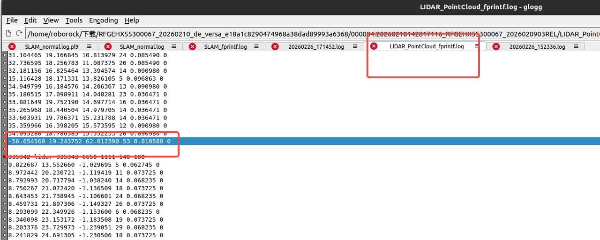
      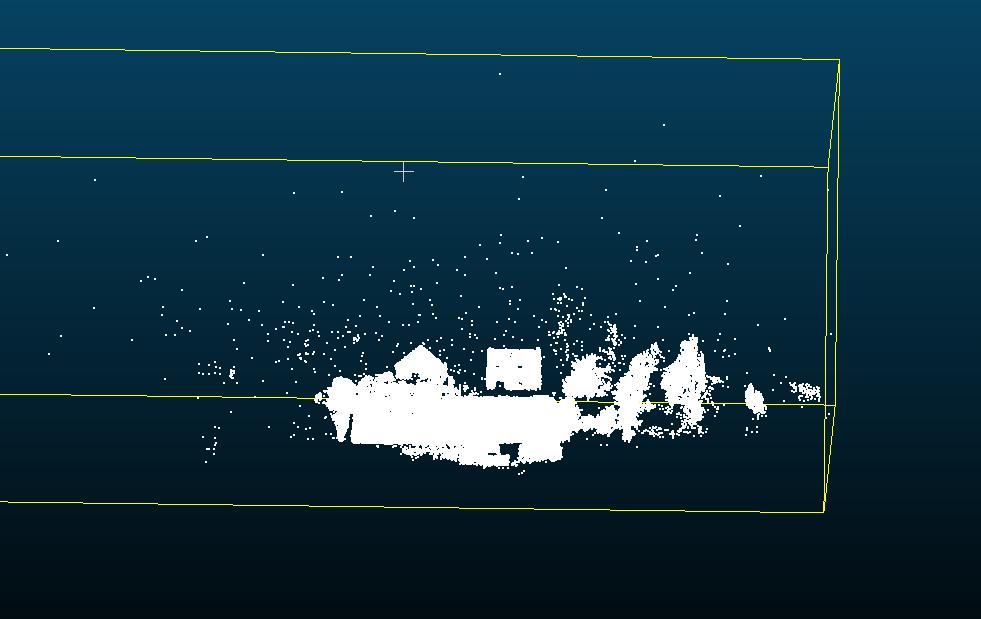
       器件影响： ---看下是否刮花；`@闫冬` `@石星星`
      `@廖炳鑫`
    - 优化继续**小地图**方案 
      1. 框架在调整下，尝试兼容现有方案；
        1. 比如eskf里面给个initpose? 正常模式是0；
    - 低优先级
      1. **合入代码的自动化脚本，服务器**：
        1. 验证数据；
          1. 建图 + 定位 +重定位
  - `@李鹏飞`    [本周工作概览](https://roborock.feishu.cn/wiki/EXnpwXdUei16a3kTdHUcs7N7nun)
    1. logparse展会模式 `@闫冬`
    2. 字段缺失：
      1. **ring**，sensor ---节后，待合入下   (与展会模式代码一起合入)
      2. **Lidar  status;  先合入打印也行 **9个状态？
    3. Logparse合并解析支持多器件；（切了一个临时分支）
    4. bug分析系统（定位建图）
      1.  [bug分析系统（定位建图）](https://roborock.feishu.cn/wiki/HfV6wYZG9iJTi5kYMWjcnGwdnbe?from=from_copylink)
    5. 轮速imu的角度引入建图？Roll pitch直接用ap这个效果怎么样，slam改进？
       [roll pitch 约束slam](https://roborock.feishu.cn/docx/CzLId70SCoQNkuxmwQcc1H2gnCf)
    6. t736 slam 仿真和x86对比下，看下差距
  - **轮速引入`@王亚萌`**
    1. 新imu验证：323；
      1. bug；
        1. bg 优化，会算一部分移动
        2. bg 估计，125 平均，delta变化，特殊公式
    2. 机器和协助相关
    3. ++lumos仿真外参适配；yaml++
    4. **地图扩展，前几帧匹配**什么情况？不刷新？
      1. Ekf 抖动；
    5. **静止检测，锁上静止pose，刷地图；有预测， Update 原来的pose;（Doing）**
    6. bug分析会议-----
      1. 建图定位 `@明坤`
      2. 重定位`@周士伟`
  - 重定位**`@周士伟`**[** 03.25-04.01](https://roborock.feishu.cn/wiki/HXHuwX7NWivE45k7dFxcedTZnZf)**
    1. 尝试并行计算特征和bbs：------留意：内存oom；雷达断流；
    2. 轮速作为重定位的初值，搬动可能有问题：时间限制搜索范围；（done,待合入）
    3. flora机器跑不起来：
      1. 拆机器，钥匙，加密，桩坏了，电机反向操控？
    4. 移动重定位，待导航开发
    5. 拼接事宜 `@孙昂熙`
    6. 现有bug处理：
      1. 空旷场地，误触发脏污误检测问题；后续优化：
      2. flora机器，局部重定位阈值
    7. 优化问题：
      1. 全局重定位尝试，bbs3d是否可行 `@孙昂熙`
      2. 全局重定位补充逻辑：重定位优化到最后，单帧匹配

===========================================================

## 2026年3月25日

1. 在研核心问题：
  1. 新项目：`@李鹏飞`
    1. ~~外参文件分开； `@廖炳鑫~~`
      1. ~~机器~~
        1. ~~完成，待编译测试 versa `@李鹏飞` 带一下;~~
        2. ~~待验证~~
        3. ~~Mr ~~
      2. Lumos   `@李鹏飞`（done）
    2. ~~736 prebuild ~~
      Airy lite 上下**抖动**`@李鹏飞`
      - ++**特征++ ++处理：**++
      1. ++**射线方向筛查 : Doing**++
        1. 直线特征----- 夹角 过滤掉；====》篡改 假象平面；
        2. 面特征；====》和圆锥法向量平行的平面，过滤掉===》
      2. Sdk 后面验证，过滤掉了 `@李鹏飞`
      3. Loam 调点剔除，看下匹配稳定性优化；(待定)
      4. nhc  限制建图；z 更强约束；
        1. 金字塔，晴天
          y lite 回环 **
      5. 0.5m  0 1
      6. 1.0 m  2层
2. **断流2.0+主动重定位**  [重定位-多线优化](https://roborock.feishu.cn/wiki/YnMowj2EdinNB3k6VA8cUpcXnEF?from=from_copylink)`@王亚萌` `@周士伟` [局部重定位减少对导航静止依赖优化](https://roborock.feishu.cn/wiki/LxeJwCAuViu62tkruz1cDRHBn4d)
  1.  [断流2.0](https://roborock.feishu.cn/wiki/JaCtwQThGiyt6ik0u9wccoGlnne?from=from_copylink)
  2. 昨晚调整 done
  3. 局部重定位失败的case：`@闫冬`
    1. 失败的点也算；---只有成功才算平均；---小；
    2. Score优化后，放开匹配度；
    3. 动态策略 `@闫冬`
  4. 初步版本提交，callback函数指针引入；
3. `@周士伟`局部重定位优化：+-15m；360度bbs版本局部重定位 1s也行；
  1. 时间 :    1.5 +60 ;
4. `@周士伟` 脏污 airylite ; 4月1日，如果其他不block
  1. 验证case
  2. 待处理：tag 标记看情况；空旷
5. ~~减少重定位合入：融合coredump `@闫冬` `@周士伟~~`
  1. ~~导航一直重复发指令  ~~
  2. 融合coredump

- 工程问题
  1. `**@廖炳鑫`**
    1. **退化判断逻辑 （knn）**已完成： [退化检测算法文档](https://roborock.feishu.cn/wiki/MYPJwwPE3iGH5NkLyLRchMo9nUg)
      - 遗留：
      1. ~~看看是否引入问题：建图数据，看下误检测；~~
        1. ~~回归完成，没有引入问题。无误检~~
      2. Airy lite兼容性
        1. 其他数据：能正常运行;    78 双面墙多跑跑
        2. **双面墙数据**：失败。怀疑是匹配比较差；
        3. 回环问题`@廖炳鑫`
    2. 回环可视化，完成；
      1. 遗留问题：
        1. 针对误匹配的处理
        2. 更强的回环匹配（done）；
        3. Pose 乱了 ;
        4. 结构，代码比较乱 ；
      2. 其他优化： [回环匹配度不足问题优化](https://roborock.feishu.cn/docx/E7kpdG5bDoSJbmxDTlPckJ2RnLc)
        1. 回环的匹配率低的问题追查：
          1. 原因：树木遮挡，回环子图共视小。
          2. 由对target子图优化成三帧匹配。
        2. 回环的可视化开发
          1. 子图节点在轨迹上可视化，回环线可视化。
    3. 更强的局部重定位预研；面向回环、主动局部重定位等；
    4. 其他核心功能
      1. **导航轨迹地图；我们轨迹会变化；边界同步**
        1. `@吴泽沛`机器跑一遍？充电桩原点；机器的轨迹点信息；
          1. 在线版本初版
          2. 效果不佳，后续优化
        2. 匹配度不足：submap匹配的是否，现有匹配不佳；
          1. submap两个 `@周士伟`小场景，`@周士伟`两个类似的大小的subamap的局部匹配（yaw+-20）
          2. Submap
            1. diff(大)
            2. 小；先验，小；
      2. 参考： [回环在线计算方案](https://roborock.feishu.cn/wiki/IE81wrYIHiNw60kyM8dcMbrdn0b) [** 回环新逻辑分析与方案设计**](https://roborock.feishu.cn/wiki/Q6YTwz70UiN2y8kgl9BcfjPtnxf?from=from_copylink) [** 回环现阶段情况 > 画板](https://roborock.feishu.cn/docx/YpFHdkC29oggsPxntLVctg4mn6d?openbrd=1&doc_app_id=501&blockId=QzmKdtriwoav4OxOWYccbijMnGg&blockType=whiteboard&blockToken=Hfefw4kYph7TQQbzirLcN0uOn1c#QzmKdtriwoav4OxOWYccbijMnGg)**
  - `@孙昂熙` [2026年3月19日 ～ 2026年3月25日](https://roborock.feishu.cn/wiki/GUqiwuxBni2vZjkb8gJcwlxBnkg?from=from_copylink)
    1. 开发BBS3D重定位的模块测试，并进行兜底性能验证
      1. 成功率 **31/60**
      2. 失败**直接原因**：BBS假成功，给出错误的、有偏差的init pose
      3. 对于成功的31个，只有临界的有点歪，**location和yaw是对的**
    2. 缓存历史缓存激光扫描帧进行expand local map（模块测试）
      1. 在开阔区域是可以实现的，但是**在狭小空间后无法匹配上**
    3. BUG相关：odo 或者 gyro**阻塞**导致，不进行重定位重力加速度对齐（Doing）
    4. 失败case 找原因
  - `@闫冬`
    1. Bug:~~ **dts**; 保存地图--~~
    2. **定位取消重定位判断： **
      - 和融合，set fusion pose
        - 2.0 消息
      - 类似取消**set pose**:  Set pose应对，导航给错误值，是否能用历史定位作为初值，或者加入咱们的候选pose里面 
             用历史定位作为初值可行，后续还需要多测试几组
      -  [取消重定位算法流程及测试结果](https://roborock.feishu.cn/wiki/FQ2hwK73YizmxIkNIepc802DnNd) 整理算法流程及协助专项测试，相关问题分析及代码合入
    3. **尝试下，双目-imu**：`@王亚萌` `@明坤`脚本;
      1. 基本可行；初步验证ok
        1. 看下时间同延时；
        2. 试下`@刘宏伟`的方法
      2. 观察到lidar和双目的imu 角速度信息接近 加速度略微有差异；最终在定位结果上的差异小于1cm;后续还需要多测试几组数据
        ](images/多线组会-image.png)
        ](images/多线组会-image-1.png)
        ](images/多线组会-image-2.png)
    4. Tag 没有过滤，杂点；flag过滤： （优先级调低）
      1. tag 过滤后无效果； 测试发现解析的每帧点云结尾处数据有些异常；
      2. 待合入
      3. 非有效点过滤`@廖炳鑫`
        ](images/多线组会-img_v3_02va_edf32f2c-2a17-4ce1-9a71-0073bd365c6g-1.jpg)
        ](images/多线组会-img_v3_02va_7f6044ba-7fbd-422c-a134-4cdf528cfdag-1.jpg)
        件影响： ---看下是否刮花；`@闫冬` `@石星星`
        廖炳鑫`
    5. 优化继续小地图方案
      1. 框架在调整下，尝试兼容现有方案；
        1. 比如eskf里面给个initpose? 正常模式是0；
    6. 低优先级
      1. **合入代码的自动化脚本，服务器**：
        1. 验证数据；
          1. 建图 + 定位 +重定位
  - `@李鹏飞`
    本周工作：
    1. 展会模式接口对接;    （已与状态机联调过，并提各部分相关mr）
      1. 全流程测试-
      2. ~~Pf writer ~~
      3. logparse展会模式 `@闫冬`
    2. 字段缺失：
      1. **ring**，sensor ---节后，待合入下   (与展会模式代码一起合入)
      2. **Lidar  status;  先合入打印也行 **9个状态？
    3. Logparse合并解析支持多器件；（切了一个临时分支）
    4. bug分析系统（定位建图）
      1.  [bug分析系统（定位建图）](https://roborock.feishu.cn/wiki/HfV6wYZG9iJTi5kYMWjcnGwdnbe?from=from_copylink)
    5. 轮速imu的角度引入建图？Roll pitch直接用ap这个效果怎么样，slam改进？
       [roll pitch 约束slam](https://roborock.feishu.cn/docx/CzLId70SCoQNkuxmwQcc1H2gnCf)
    6. t736 slam 仿真和x86对比下，看下差距
  - **轮速引入`@王亚萌**`
    1. 机器和协助相关
    2. ++lumos仿真外参适配++
    3. 轮速使用：**[断流情况和逻辑调整1.21讨论](https://roborock.feishu.cn/wiki/ShOmwIkCLiB6bik4blscmuxcn5e?from=from_copylink)**
    4. 遗留问题：**匹配度下降的研究**
    5. **地图扩展，前几帧匹配**什么情况？不刷新？
      1. Ekf 抖动；
    6. **静止检测，锁上静止pose，刷地图；有预测， Update 原来的pose;（Doing）**
  - 重定位`**@周士伟`**
    1. 轮速作为重定位的初值，搬动可能有问题：时间限制搜索范围；（done,待合入）
    2. 重定位，降采样改成0.1；
    3. 新西兰重定位失败case，新的策略（体素地图作为输入），观察没有复现。
    4. 导航重定位误报，全局失败重定位
    5. HF1.0 进入，减少重定位优化
    6. flora机器跑不起来：
      1. 拆机器，钥匙，加密，桩坏了，电机反向操控？
    7. 误报脏污；点太少；===》姚远
    8. **建图局部重定位**：断流后恢复需要局部重定位一次，失败立即报告建图失败，需要重新再建图----block导航
      1. 移动重定位，待导航开发
      2. **断流2.0 `@明坤`，spm 给导航排期**
    9. ~~线程分离 check pose `@王亚萌`局部重定位后面，转亚萌协助维护~~
    10. ~~**重定位减少优化(重定位取消预研) 联调**~~
    - ++~~旋转重定位，预研：视角不足优化，增加**缓存++**    `@孙昂熙~~`
      1. ~~6/20 ~~
      2. ~~增加滑动窗口的关键帧，作为全局重定位类的成员，按轮速移动距离，缓存一定lidar;~~
      3. ~~acc接受到信号的阶段进行拼接；acc取消数据剔除；~~
      4. ~~反馈acc成功；（判断是否可用，并生成初始地图）~~
      5. ~~在初始地图上继续刷新地图；不足视角不足  ~~
    - ~~引入全局重定位的初值（Doing）~~
      - ~~时间限制下~~
    - 现有bug处理：
      1. 空旷场地，误触发脏污误检测问题；后续优化：
        1. 后续预研，缓存关键帧，自己来做判断
      2. 3分钟断流8次，导航扛不住了，循环重定位；
      3. flora机器，局部重定位阈值
        1. Todo 引入硬件宏；
      4. ~~螺丝刀`@周士伟` `@明坤` ~~
      5. ~~`@曹雪东`邮寄，一个充电桩 ~~
    - 优化问题：
      1. 局部重定位主动化：bb3d；完全搜索，加了早退出逻辑+2m；3层；耗时评估还行；
      2. 全局重定位尝试，bbs3d是否可行
      3. 全局重定位补充逻辑：重定位优化到最后，单帧匹配

===========================================================

## 2026年3月18日

1. 在研核心问题：
  1. 新项目：`@李鹏飞`
    1. 外参文件分开； `@廖炳鑫`
      1. 机器
        1. 完成，待编译测试 versa `@李鹏飞` 带一下;
        2. 待验证
        3. Mr
    2. 736 prebuild
    3. Airy lite 上下抖动`@李鹏飞`
      - ++**特征++ ++处理：**++
      1. ++**射线方向筛查 : Doing**++
      2. Loam 调点剔除，看下匹配稳定性优化；(待定)
        airy lite 回环 **

-  [暂停恢复-定位优化](https://roborock.feishu.cn/wiki/SVSVwhOTziKSyekR1X1cOR70n2d) `@王亚萌`
  1. Odom: start to end    (done)
    1. Eskf update遗漏** cov** ；优先级后放，待定；`@廖炳鑫`
    2. Bug odo的这块逻辑是错误的，to end 无法预测`@廖炳鑫`
      pan style="color: inherit; background-color: rgba(255,246,122,0.8)">断流 -------------- lidar start ---0.1- end
      seDiff1Diff2

Start 

- **断流2.0+主动重定位**  [重定位-多线优化](https://roborock.feishu.cn/wiki/YnMowj2EdinNB3k6VA8cUpcXnEF?from=from_copylink)`@王亚萌` `@周士伟` [局部重定位减少对导航静止依赖优化](https://roborock.feishu.cn/wiki/LxeJwCAuViu62tkruz1cDRHBn4d)
  1.  [断流2.0](https://roborock.feishu.cn/wiki/JaCtwQThGiyt6ik0u9wccoGlnne?from=from_copylink)
  2. 初步版本提交，callback函数指针引入；
- 工程问题
  1. `**@廖炳鑫`**
    1. **退化**
      1. **退化判断逻辑 （knn） **
        1. 已完成： [退化检测算法文档](https://roborock.feishu.cn/wiki/MYPJwwPE3iGH5NkLyLRchMo9nUg)
      2. 处理：匹配的时候把这约束加进来；
        1. 两个bug
      3. 整理下文档和推导，和大家简单分享下，低优先级 [退化检测算法文档](https://roborock.feishu.cn/wiki/MYPJwwPE3iGH5NkLyLRchMo9nUg)
      4. 遗留：
        1. 看看是否引入问题：建图数据，看下误检测；
        2. Airy lite兼容性
          1. 双面墙数据
  2. 回环问题`@廖炳鑫`
    1. 雷达罩
      1. 投影球面，`@廖炳鑫`看缺点情况；
        ](images/多线组会-img_v3_02vm_d8804fbd-f4ec-41dd-a05f-59dee74cdd3g.jpg)
    2. slam+**回环**熟悉代码： [MLslam学习](https://roborock.feishu.cn/wiki/SrRVwwLGYi8sNMkCsQjcblDfnjh)
      1. 更强的局部重定位预研；面向回环、主动局部重定位等；
    3. 回环中匹配验证和优化： [回环匹配度不足问题优化](https://roborock.feishu.cn/docx/E7kpdG5bDoSJbmxDTlPckJ2RnLc)
      1. 回环的匹配率低的问题追查：
        1. 原因：树木遮挡，回环子图共视小。
        2. 由对target子图优化成三帧匹配。
      2. 回环的可视化开发
    4. 其他核心功能
      1. 导航轨迹地图；我们轨迹会变化；边界同步
        1. `@吴泽沛`机器跑一遍？充电桩原点；机器的轨迹点信息；
          1. 在线版本初版
          2. 效果不佳，后续优化
        2. 匹配度不足：submap匹配的是否，现有匹配不佳；
          1. submap两个 `@周士伟`小场景，`@周士伟`两个类似的大小的subamap的局部匹配（yaw+-20）
          2. Submap
            1. diff(大)
            2. 小；先验，小；
      2. 参考： [回环在线计算方案](https://roborock.feishu.cn/wiki/IE81wrYIHiNw60kyM8dcMbrdn0b) [** 回环新逻辑分析与方案设计**](https://roborock.feishu.cn/wiki/Q6YTwz70UiN2y8kgl9BcfjPtnxf?from=from_copylink) [** 回环现阶段情况 > 画板](https://roborock.feishu.cn/docx/YpFHdkC29oggsPxntLVctg4mn6d?openbrd=1&doc_app_id=501&blockId=QzmKdtriwoav4OxOWYccbijMnGg&blockType=whiteboard&blockToken=Hfefw4kYph7TQQbzirLcN0uOn1c#QzmKdtriwoav4OxOWYccbijMnGg)**
  - `@孙昂熙` [2026年3月19日 ～ 2026年3月25日](https://roborock.feishu.cn/wiki/GUqiwuxBni2vZjkb8gJcwlxBnkg?from=from_copylink)
    1. 开发BBS3D重定位的批量模块测试，验证兜底性能
      1. **失败直接原因**：BBS假成功
      2. 典型原因：
        1. 原始点云**未进行重力对齐**，导致BBS初值错误或者有偏差
        2. 原始localmap正常但是，BBS给的初值有偏差（但不是错误）
    2. **基于激光扫描缓存进行拼接扩展local map**（开发模块测试）（Done）
      1. 在开阔区域是可以实现的，但在狭小空间后无法匹配上
    3. BUG相关：odo或者gyro阻塞导致，不进行重定位重力加速度对齐（Doing）
  - `@闫冬`
    1. Bug: dts; 保存地图；
    2. **定位取消重定位判断： **
      1. 被动重定位取消；`@闫冬` `@周士伟`
        1. Mr `@茹毅超` 看下日志；确认没有问题；
      2. 和融合，set fusion pose
        1. ~~1.0~~
        2. 2.0 消息
      3. 类似取消**set pose**:  Set pose应对，导航给错误值，是否能用历史定位作为初值，或者加入咱们的候选pose里面
    3. ~~禅道日志加入关键词；~~
    4. ~~展会模式~~
      1. ~~定位建图，暂定只用 围栏内部的点否能够稳定？ ~~
        1. [~~ 展会模式slam改动](https://roborock.feishu.cn/wiki/ZJZBwv8zmiWuRDkZwlOc4hXVnLd)~~
      2. ~~flora数据 ~~
    5. 新增的导轨数据待分析：差异较大 [新器件slam采集需求数据分析](https://roborock.feishu.cn/wiki/LWxjwwpCsiaVYxkWumDcI9Lvnbf)
    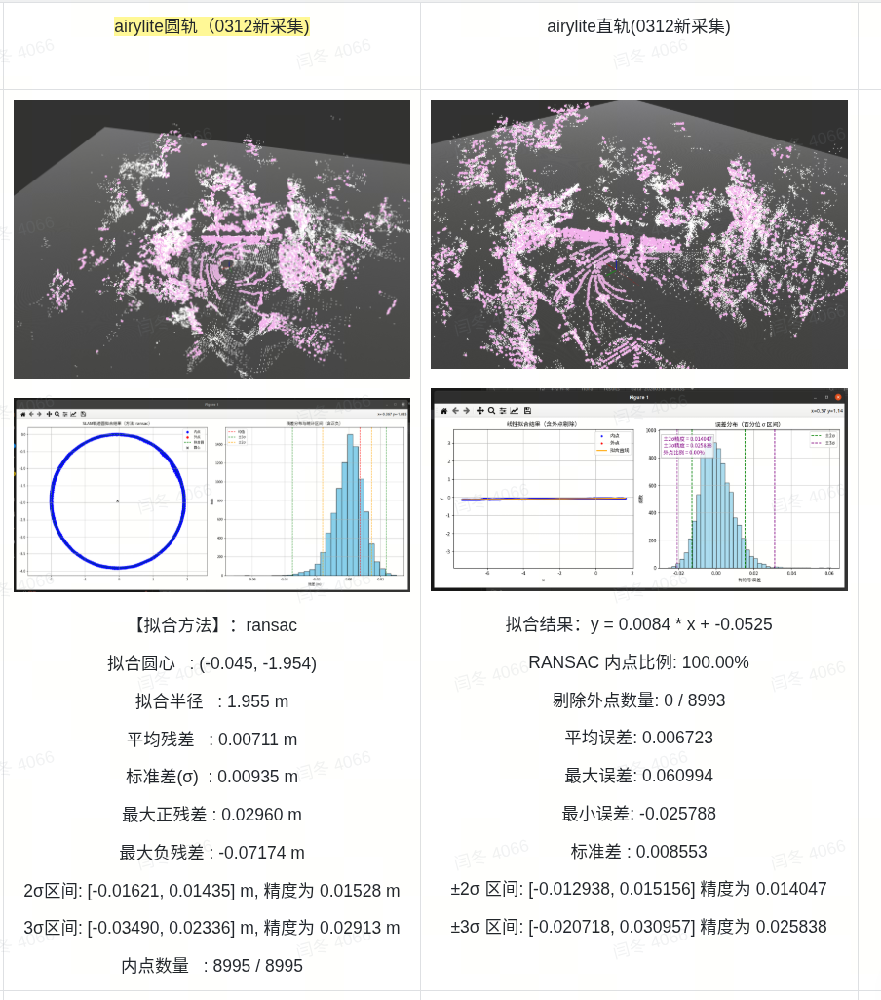
    - 尝试下双目imu：`@王亚萌` `@明坤`脚本;
    - Tag 没有过滤，杂点；flag过滤： （优先级调低）
      1. tag 过滤后无效果； 测试发现解析的每帧点云结尾处数据有些异常；
      2. 待合入
      3. 非有效点过滤`@廖炳鑫`
      
      
       器件影响： ---看下是否刮花；`@闫冬` `@石星星`
      `@廖炳鑫`
    - 优化继续小地图方案 
      1. 框架在调整下，尝试兼容现有方案；
        1. 比如eskf里面给个initpose? 正常模式是0；
    - 低优先级
      1. **合入代码的自动化脚本，服务器**：
        1. 验证数据；
          1. 建图 + 定位 +重定位
  - `@李鹏飞`
    本周工作：
    1. 展会模式接口对接;    （已与状态机联调过，并提各部分相关mr）
      1. 全流程测试；
      2. Pf writer ;
    2. 字段缺失：
      1. **ring**，sensor ---节后，待合入下   (与展会模式代码一起合入)
      2. **Lidar  status;  先合入打印也行 **9个状态？
    3. Logparse合并解析支持多器件；（切了一个临时分支）
    4. bug分析系统（定位建图）
      1.  [bug分析系统（定位建图）](https://roborock.feishu.cn/wiki/HfV6wYZG9iJTi5kYMWjcnGwdnbe?from=from_copylink)
    5. 轮速imu的角度引入建图？Roll pitch直接用ap这个效果怎么样，slam改进？
       [roll pitch 约束slam](https://roborock.feishu.cn/docx/CzLId70SCoQNkuxmwQcc1H2gnCf)
    6. t736 slam 仿真和x86对比下，看下差距
  - **轮速引入`@王亚萌`**
    1. 轮速使用：**[断流情况和逻辑调整1.21讨论](https://roborock.feishu.cn/wiki/ShOmwIkCLiB6bik4blscmuxcn5e?from=from_copylink)**
    2. 遗留问题：**匹配度下降的研究**
    3. **地图扩展，前几帧匹配**什么情况？不刷新？
      1. Ekf 抖动；
    4. ++机器类型引入后处理++：Mmt 参数不同？优先级较低；
    5. ~~仿真，适配flora轮速；  ~~
    6. **静止检测，锁上静止pose，刷地图；有预测， Update 原来的pose;（Doing）**
  - 重定位逻辑补充**`@周士伟`**
    1. ~~建图局部重定位 ~~
      1. ~~难以触发；模拟断流；~~
      2. ~~`@姚远`模拟错误；改代码，计时类似方法~~
    2. **建图局部重定位**：断流后恢复需要局部重定位一次，失败立即报告建图失败，需要重新再建图----block导航
      1. 移动重定位，待导航开发
      2. 断流2.0 `@明坤` spm 给导航排期
    3. 线程分离 check pose `@王亚萌`局部重定位后面，转亚萌协助维护
    4. ~~展会重定位: 是否需要用新的方法bbs2d?~~
    5. **重定位减少优化(重定位取消预研) 联调**
    6. ++旋转重定位，预研：视角不足优化，增加**缓存++**    `@孙昂熙`
      1. 6/20
      2. 增加滑动窗口的关键帧，作为全局重定位类的成员，按轮速移动距离，缓存一定lidar;
      3. acc接受到信号的阶段进行拼接；acc取消数据剔除；
      4. 反馈acc成功；（判断是否可用，并生成初始地图）
      5. 在初始地图上继续刷新地图；不足视角不足
    7. 引入全局重定位的初值（Doing）
      1. 时间限制下
    8. ~~优化随机性~~
    9. 现有bug处理：
      1. 空旷场地，误触发脏污误检测问题；后续优化：
        1. 后续预研，缓存关键帧，自己来做判断
      2. 3分钟断流8次，导航扛不住了，循环重定位；
      3. flora机器，局部重定位阈值
        1. Todo 引入硬件宏；
      4. 螺丝刀 `@明坤`
      5. `@曹雪东`邮寄，一个充电桩
    10. 优化问题：
      1. 局部重定位主动化：bb3d；完全搜索，加了早退出逻辑+2m；3层；耗时评估还行；
      2. 全局重定位尝试，bbs3d是否可行
      3. 全局重定位补充逻辑：重定位优化到最后，单帧匹配

===========================================================

## 2026年3月11日

1. 交互方案  [VERSA导航-定位模块交互：建图&定位&重定位](https://roborock.feishu.cn/wiki/AqOGwVOuWimt7ykP2oTcSHpYnag?from=from_copylink)
2. Bug: [ bug分析步骤-多线slam项目
  ]([https://roborock.feishu.cn/wiki/ZrXmwnmyGiFYKKkY9BUcanvrnbd?from=from_copylink](https://roborock.feishu.cn/wiki/ZrXmwnmyGiFYKKkY9BUcanvrnbd?from=from_copylink))
3. 在研核心问题：
  1. 新项目：`@廖炳鑫`
    1. 外参文件分开；
      1. ~~仿真~~
        1. ~~完成，且合入~~
      2. 机器
        1. 完成，待编译测试 versa `@李鹏飞` 带一下
        2. Mr
    2. 上下抖动

- 历史核心
  1.  [暂停恢复-定位优化](https://roborock.feishu.cn/wiki/SVSVwhOTziKSyekR1X1cOR70n2d) `@王亚萌` `@周士伟`
    1. Eskf update遗漏 cov ；优先级后放，待定；
  - 退化：
    1. 分类`@廖炳鑫`
      1. 6 se3；a6
      2. 分两种：
      3. Xy 平面退化；2d ||
      4. Z 退化 ，没有地面点
    2. 方法
      1. ++搜索和地图接近的点：过滤后++
        1. 先发现可能退化；
        2. 耦合
        3. 环境
      2. Demo  : points  面片
        1. 人在移动误识别；
      3. 信息不独立
    3. 处理：匹配的时候把这约束加进来；
      1. 两个bug
  - 出界问题兜底，主动重定位优化  [重定位-多线优化](https://roborock.feishu.cn/wiki/YnMowj2EdinNB3k6VA8cUpcXnEF?from=from_copylink)
    1. 断流2.0
  - 局部重定位在线计算 [局部重定位减少对导航静止依赖优化](https://roborock.feishu.cn/wiki/LxeJwCAuViu62tkruz1cDRHBn4d)`@周士伟`
    1. 局部重定位优化
    2. 在线版本
  - bug分析相关 
  - 性能优化跟踪
  - 出界问题兜底
    1. 主动重定位优化 接口线预留下，容易引入问题，逐步预研下`@闫冬` `@周士伟`
- 工程问题
  1. `@廖炳鑫`
    1. slam+**回环**熟悉代码： [MLslam学习](https://roborock.feishu.cn/wiki/SrRVwwLGYi8sNMkCsQjcblDfnjh)
    2. 回环中匹配验证和优化： [回环匹配度不足问题优化](https://roborock.feishu.cn/docx/E7kpdG5bDoSJbmxDTlPckJ2RnLc)
      1. 回环的匹配率低的问题追查：
        1. 原因：树木遮挡，回环子图共视小。
        2. 由`@应竞帆`对target子图优化成三帧匹配。
      2. 回环的可视化开发
    3. **点云预处理**：
      1. **退化判断逻辑 （knn） **
        1. 已完成： [退化检测算法文档](https://roborock.feishu.cn/wiki/MYPJwwPE3iGH5NkLyLRchMo9nUg)
      2. 非有效点过滤 （knn)
        1. 3000平方问题； 带雷达罩(4mm)flora新雷达罩定位部分数据采集/有围栏/10x10/devtest/000198convertedlog0001982026031007531060600000000000002026030500DEV
          mages/多线组会-image-7.png)
      3. 360雷达 ：孤立点过滤；
    4. 更强的局部重定位预研；面向回环、主动局部重定位等；
  2. `@孙昂熙` [割草机重定位工作记录](https://roborock.feishu.cn/wiki/NOzkwmsgDiUcYdkWpcNc3qdunzh)
    1. SLAM + 重定位代码熟悉 [MultiLine SLAM Learning](https://roborock.feishu.cn/wiki/YRWswk0WBinI0xkO5fmcb0RVnxh?from=from_copylink)
      1. Core  ieskf
    2. 尝试使用BBS3D（阅读中），优化效果和耗时
      1. 参数`@明坤`
    3. 工作记录整理 [割草机重定位工作记录](https://roborock.feishu.cn/wiki/NOzkwmsgDiUcYdkWpcNc3qdunzh)
    4. 先学习BBS3D重定位，同时也在调研是否有新的重定位方法（文档待整理）——准 + **快**
      1. Kiss mather 3d  ;fpfh fast
    5. BUG相关：
    6. 针对BBS3D重定位的优化方案整理
  - `@闫冬`
    1. Bug
    2. **定位需要重定位判断： **
      1. 被动重定位取消；`@闫冬` `@周士伟`
        1. Mr
      2. 和融合，set fusion pose
        1. 1.0
        2. 2.0 消息
      3. 类似取消set pose:  Set pose应对，导航给错误值，是否能用历史定位作为初值，或者加入咱们的候选pose里面;
      4. 展会模式
        1. 下周：
          1. 定位建图，暂定只用 围栏内部的点；
          2. Bbs 这块也有专门优化；待合入，看下验证结果`@周士伟`
      5. **主动重定位，预留 `@明坤`文档**
      6. 导轨数据待分析；
    - Tag 没有过滤，杂点；flag过滤： （优先级调低）
      1. tag 过滤后无效果； 测试发现解析的每帧点云结尾处数据有些异常；
      2. 待合入
      3. 非有效点过滤`@廖炳鑫`
      
      
       器件影响： ---看下是否刮花；`@闫冬` `@石星星`
      `@廖炳鑫`
    - 展会数据验证：80cm以下点是否能够稳定？ 
      1. 近端点需要使用 定位基本能够稳定； 后续还需对采集的场地数据进行分析
      2. `@汪浩然` 采集数据
    - Bug 海外bug 
    - 低优先级
      1. 后面:   优化继续小地图方案
      2. **合入代码的自动化脚本，服务器**：
        1. 验证数据；
          1. 建图 + 定位 +重定位
  - `@李鹏飞`
    1. Flora
      1. Flora 中间层外参搞错了；
      2. 数据类型错误，无法仿真；
    2. 雷达罩
      1. 投影球面，`@廖炳鑫`看缺点情况；
    3. 展会模式接口对接;    （已与状态机联调过，并提各部分相关mr）
      1. 全流程测试；
      2. Pf writer ;
    雷达罩数据第一波分析：
       （1） 树冠处仍有较重的点云的“拖影” (等导入)：
    - 新增加，新项目切换t736
      1. ~~toolchain修改        (已更新toolchain包，并在相应的jenkins上编译t736验证versapro)~~
      2. ~~新的archive  test  ~~
      3. test试下板子，看下cpu算力情况；
        1. slam 仿真看下效果；耗时等情况，可以和x86对比下，看下定性差距；
        2. 2大核
      4. ~~出个新的archive到，736仓库 versa位置，检查下，cmkelist的指向是否正确，检查下是否修改下，可以咨询下闫冬~~
    - 新项目，线激光优化 **Airy lite适配**
      1. 字段缺失：
        1. **ring**，sensor ---节后，待合入下   (与展会模式代码一起合入)
        2. 私包验证：
        3. **Lidar  status;  先合入打印也行**
          1. 9个状态？
          2. bug日志相关；
          3. **Versa  pro 3500；**
      1. **数据回测、分析，原因：**
        1. **airy lite 回环 **
        2. **上下抖动 ---- **
      2. 开发
        1. Loam 调点剔除，看下匹配稳定性优化；
          1. 模块测试；
    - Logparse合并解析支持多器件；（切了一个临时分支）
    - 旧项目Bug相关：~~（修改以往传感器外参打印日志）~~
      1. Bug 分析，日志优化
      2. 匹配抖动性分析+++++熟悉代码++讨论
      3. bug分析系统（定位建图）
        1.  [bug分析系统（定位建图）](https://roborock.feishu.cn/wiki/HfV6wYZG9iJTi5kYMWjcnGwdnbe?from=from_copylink)
    - 轮速imu的角度引入建图？Roll pitch直接用ap这个效果怎么样，slam改进？
      [ roll pitch 约束slam](https://roborock.feishu.cn/docx/CzLId70SCoQNkuxmwQcc1H2gnCf)
    - 待定：
      1. 定位抖动优化
        1. 滤波器相关；
        2. Pose 串起来，划窗；B样条
      2. **性能优化：（Waiting）**
        1. 算子；arm  -02 ；NEON
        2. Cpu 架构；缓存多少；
        3. 算法；
        4. 内核占用, 问题跟踪和优化；
          1. 优化内核占用+耗时
          2. downsample 改单线程
          3. Layer; 1.0 2;  0.7,1.0
            1. 性能和精度的平衡
          4. 低优先级，内存评估
      3. ~~3d转2d，转图功能~~
        1. 后面看下，先熟悉已有设计
      4. 双目Imu跑slam  （下半年）
        1. simulate 仿真验证；试过有一组跑飞了？
        2. ++后面有切换切换双目imu的计划，这块的使用双目跑下slam的，双目imu数据也评估下吧；后轴听说容易堵住；++ ++lidar imu确定要砍掉++
  - **轮速引入`@王亚萌`**
    1. 轮速使用：**[断流情况和逻辑调整1.21讨论](https://roborock.feishu.cn/wiki/ShOmwIkCLiB6bik4blscmuxcn5e?from=from_copylink)**
      1. 遗留问题
        1. ~~odo抓不到异常处理，年后(上周已经合入)~~
        2. 遗留问题：**匹配度下降的研究**
          1. ~~预留都不行的逻辑；后面可以加逻辑主动管理下~~
          2. Eskf 轮速for循环处理？待处理；待定
        3. ~~imu打印；~~
        4. ~~静止初始化 bg  （机器、验证，阈值评价；合入）~~
          1. ~~Bg xy       -0.8 rad/s tpm  ~~
          2. ~~Set pose 等；静止都会算一遍；~~
            1. ~~Bg ~~
            2. ~~轮速静止，100个imu算均值；500ms；**加了cov的判断~~**
              1. ~~潜在风险，后面处理；~~
      2. 轮速的角度 直接应用于slam
      3. 标定方案
      4. 重力对齐bug
      5. 仿真适配flora轮速；
    2. **待定：**
      1. **地图扩展，前几帧匹配**什么情况？不刷新？
        1. Ekf 抖动；
      2. Mmt 参数不同？优先级较低；
      3. **静止检测，锁上静止pose，刷地图；有预测， Update 原来的pose;（Doing）**
  - 重定位逻辑补充**`@周士伟`**
    1. 拼接后续问题跟踪和优化`@孙昂熙`
      1. 20个只有5个可以匹配
    2. 建图局部重定位
      1. 难以触发；模拟断流；
      2. `@姚远`模拟错误；改代码，计时类似方法
    3. 13000平，重定位oom；done
      1. 做了内存压缩
    4. **建图局部重定位**：断流后恢复需要局部重定位一次，失败立即报告建图失败，需要重新再建图
      1. 导航联调
    5. 线程分离 check pose
    6. eskf分离？slam reset 耦合太多？解耦；mr `@王亚萌`
    7. 展会重定位: 是否需要用新的方法bbs2d?
    8. v1 2600平方；建图；
    9. **重定位减少优化(重定位取消预研)**：截止到  3月中
      1. 增加取消重定位的交互动作，在acc阶段进行取消；
      2. acc 放进来激光 `@闫冬`
    10. ++旋转重定位，预研：视角不足优化，增加**缓存++**    `@孙昂熙`
      1. 6/20
      2. 增加滑动窗口的关键帧，作为全局重定位类的成员，按轮速移动距离，缓存一定lidar;
      3. acc接受到信号的阶段进行拼接；acc取消数据剔除；
      4. 反馈acc成功；（判断是否可用，并生成初始地图）
      5. 在初始地图上继续刷新地图；不足视角不足
    11. 移动重定位，安规`@明坤`
    - 现有bug处理：
      1. ~~倾斜问题跟踪；~~
      2. ~~全局重定位，**转向体素地图**；鲁棒性更好；~~
      3. 空旷场地，误触发脏污误检测问题；后续优化：
        1. 后续预研，缓存关键帧，自己来做判断
      4. 导航误报
        1. 中间断流 v5；v1几乎不断流
          1. acc超时--取消限时；
          2. acc抓取后主动局部算下？`@闫冬` 减少取消这个；（看时间，是否后续优化合入）
      5. 补充逻辑：重定位后的pose，和导航set的不一致的时候，也要check pose算下；
    - 优化问题：
      1. 增加主动重定位交互`@闫冬` `@周士伟`
        1. 暂停恢复后匹配不佳，然后，维持失败状态和pose（接续亚萌的优化后，补足逻辑（**优先级调低）**）
          1. 发起**主动重定位**消息私包验证+导航联调；
      2. 局部重定位主动化：bb3d；完全搜索，加了早退出逻辑+2m；3层；耗时评估还行；
      3. 全局重定位尝试，bbs3d是否可行
      4. 全局重定位补充逻辑：重定位优化到最后，单帧匹配
-  **[回环调试记录](https://roborock.feishu.cn/wiki/UxO1wtyWXiNFXCkKOsrc8o5YnJg)`@应竞帆` [回环新逻辑分析与方案设计**](https://roborock.feishu.cn/wiki/Q6YTwz70UiN2y8kgl9BcfjPtnxf?from=from_copylink)
  1. 实时回环方案
    1. Hpp 命名
    2. 匹配：更快更强的思路？
    3. 框架：submp i (fix)--submp(j key frame(每个3个) 0位置)
      1. Submp 还没构建完；
  2.  [回环现阶段情况](https://roborock.feishu.cn/docx/YpFHdkC29oggsPxntLVctg4mn6d?from=from_copylink)
    1. 回环功能基本ok
    2. 外场，庄园 回环不行
      1. 11数据集
      2.  [回环现阶段情况 > 画板](https://roborock.feishu.cn/docx/YpFHdkC29oggsPxntLVctg4mn6d?openbrd=1&doc_app_id=501&blockId=QzmKdtriwoav4OxOWYccbijMnGg&blockType=whiteboard&blockToken=Hfefw4kYph7TQQbzirLcN0uOn1c#QzmKdtriwoav4OxOWYccbijMnGg)
  3. 之前讨论：
    1. 回环遗留功能优化：（Doing）
      1. 导航轨迹地图；我们轨迹会变化；边界同步
        1. `@吴泽沛`机器跑一遍？充电桩原点；机器的轨迹点信息；
          1. 在线版本初版
          2. 效果不佳，后续优化
        2. 匹配度不足：submap匹配的是否，现有匹配不佳；
          1. submap两个 `@周士伟`小场景，`@周士伟`两个类似的大小的subamap的局部匹配（yaw+-20）
          2. Submap
            1. diff(大)
            2. 小；先验，小；
      2.  [回环在线计算方案](https://roborock.feishu.cn/wiki/IE81wrYIHiNw60kyM8dcMbrdn0b)
        1. ~~异步回环检测~~
          - ~~新增loop_detection_thread_；后台线程处理ICP匹配~~
          - ~~Icp true - opt ~~
          - ~~detectlatestloop()仅候选筛选，任务提交至队列~~
          - ~~消除主线程3-10秒阻塞问题~~
        2. 增量式图优化
          - optimizeposegraph()改为增量添加顶点和边
          - 跟踪lastvertexcount和lastloopedgecount
           ~~线程生命周期管理~~
          - ~~新增startthreads()/stopthreads()/restartthreads()~~
          - ~~构造函数支持autostart参数控制初始化行为~~
          - ~~提供isthreadsrunning()等状态查询API~~
           补充逻辑
    2. bug支持

灵码 

===========================================================

## 2026年3月04日

1. 交互方案  [VERSA导航-定位模块交互：建图&定位&重定位](https://roborock.feishu.cn/wiki/AqOGwVOuWimt7ykP2oTcSHpYnag?from=from_copylink)
2. Bug: [ 多线项目bug分析步骤
  ]([https://roborock.feishu.cn/wiki/ZrXmwnmyGiFYKKkY9BUcanvrnbd?from=from_copylink](https://roborock.feishu.cn/wiki/ZrXmwnmyGiFYKKkY9BUcanvrnbd?from=from_copylink))
3. 在研核心问题：
  1.  [暂停恢复-定位优化](https://roborock.feishu.cn/wiki/SVSVwhOTziKSyekR1X1cOR70n2d) `@王亚萌` `@周士伟`
  2. Eskf update遗漏 cov
  3. 退化：
    1. 分类
      1. 6 se3；a6
      2. 分两种：
      3. Xy 平面退化；2d ||
      4. Z 退化 ，没有地面点
    2. 方法
      1. ++搜索和地图接近的点：过滤后++
        1. 先发现可能退化；
        2. 耦合
        3. 环境
      2. Demo  : points  面片
        1. 人在移动误识别；
      3. 信息不独立
  4. 出界问题兜底，主动重定位优化  [重定位-多线优化](https://roborock.feishu.cn/wiki/YnMowj2EdinNB3k6VA8cUpcXnEF?from=from_copylink)
  5. 局部重定位在线计算 [局部重定位减少对导航静止依赖优化](https://roborock.feishu.cn/wiki/LxeJwCAuViu62tkruz1cDRHBn4d)`@周士伟`
    1. 局部重定位优化
    2. 在线版本
  6. bug分析相关
  7. 性能优化跟踪
  8. 出界问题兜底
    1. 主动重定位优化 接口线预留下，容易引入问题，逐步预研下`@闫冬` `@周士伟`

- 工程问题
  1. `@廖炳鑫`
    1. slam+**回环**熟悉代码： [MLslam学习](https://roborock.feishu.cn/wiki/SrRVwwLGYi8sNMkCsQjcblDfnjh)
    2. 回环中匹配验证和优化： [回环匹配度不足问题优化](https://roborock.feishu.cn/docx/E7kpdG5bDoSJbmxDTlPckJ2RnLc)
      1. 回环的匹配率低的问题追查：
        1. 原因：树木遮挡，回环子图共视小。
        2. 由`@应竞帆`对target子图优化成三帧匹配。
      2. 回环的可视化开发
    3. **点云预处理**：
      1. **退化判断逻辑 （knn） **
        1. Xy .....
        2. z .....
        3. Xy +z
      2. 非有效点过滤 （knn)
        1. 360雷达 ：孤立点过滤；
    4. 更强的局部重定位预研；面向回环、主动局部重定位等；
  2. `@孙昂熙`
    1. SLAM + 重定位代码学习 [MultiLaser SLAM Learning](https://roborock.feishu.cn/wiki/YRWswk0WBinI0xkO5fmcb0RVnxh?from=from_copylink)
      1. Core  ieskf
    2. **分析和熟悉bug流程**，熟悉功能逻辑还有尝试使用BBS3D（阅读中），优化效果和耗时
      1. 参数`@明坤`
    3. 工作目标整理 [工作目标整理（重定位模块）](https://roborock.feishu.cn/wiki/LsA7wx97liDNbMkRTF7cyLYmnch?from=from_copylink)
    4. 先学习BBS3D重定位，同时也在调研是否有新的重定位方法（文档待整理）——准 + **快**
      1. Kiss mather 3d  ;fpfh fast
  - `@闫冬`
    1. Bug
    2. **定位需要重定位判断： **
      1. 被动重定位取消；`@闫冬` `@周士伟`
      2. **主动重定位，预留 `@明坤`文档**
      3. Case
    3. Tag 没有过滤，杂点；flag过滤：
      1. tag 过滤后无效果； 测试发现解析的每帧点云结尾处数据有些异常；
      2. 待合入
      3. 非有效点过滤`@廖炳鑫`
        ](images/多线组会-img_v3_02va_edf32f2c-2a17-4ce1-9a71-0073bd365c6g-5.jpg)
        ](images/多线组会-img_v3_02va_7f6044ba-7fbd-422c-a134-4cdf528cfdag-5.jpg)
        件影响： ---看下是否刮花；`@闫冬` `@石星星`
        廖炳鑫`
    - 展会数据验证：80cm以下点是否能够稳定？ 
      1. 近端点需要使用 定位基本能够稳定； 后续还需对采集的场地数据进行分析
      2. `@汪浩然` 采集数据
    - Bug 
    - 低优先级
      1. 后面:   优化继续小地图方案
      2. **合入代码的自动化脚本，服务器**：
        1. 验证数据；
          1. 建图 + 定位 +重定位
  - `@李鹏飞`
    1. 展会模式接口对接;    （已写完代码提交私版分支，状态机验证中）
      1. 全流程测试；
      2. Pf writer ;
    2. 新增加，新项目切换t736
      1. ~~toolchain修改        (已更新toolchain包，并在相应的jenkins上编译t736验证versapro)~~
      2. ~~新的archive  test  ~~
      3. test试下板子，看下cpu算力情况；
        1. slam 仿真看下效果；耗时等情况，可以和x86对比下，看下定性差距；
        2. 2大核
      4. ~~出个新的archive到，736仓库 versa位置，检查下，cmkelist的指向是否正确，检查下是否修改下，可以咨询下闫冬~~
    3. 新项目，线激光优化 **Airy lite适配**
      1. 字段缺失：
        1. **ring**，sensor ---节后，待合入下   (与展会模式代码一起合入)
        2. 私包验证：
        3. **Lidar  status;  先合入打印也行**
          1. 9个状态？
          2. bug日志相关；
          3. **Versa  pro 3500；**
            测、分析，原因：**
        4. **airy lite 回环 **
        5. **上下抖动 ---- **
        6. Loam 调点剔除，看下匹配稳定性优化；
          1. 模块测试；
    4. Logparse合并解析支持多器件；
    5. 旧项目Bug相关：~~（修改以往传感器外参打印日志）~~
      1. Bug 分析，日志优化
      2. 匹配抖动性分析+++++熟悉代码++讨论
      3. bug分析系统（定位建图）
        1.  [bug分析系统（定位建图）](https://roborock.feishu.cn/wiki/HfV6wYZG9iJTi5kYMWjcnGwdnbe?from=from_copylink)
    6. 轮速imu的角度引入建图？Roll pitch直接用ap这个效果怎么样，slam改进？
       [roll pitch 约束slam](https://roborock.feishu.cn/docx/CzLId70SCoQNkuxmwQcc1H2gnCf)
    7. 待定：
      1. 定位抖动优化
        1. 滤波器相关；
        2. Pose 串起来，划窗；B样条
      2. **性能优化：（Waiting）**
        1. 算子；arm  -02 ；NEON
        2. Cpu 架构；缓存多少；
        3. 算法；
        4. 内核占用, 问题跟踪和优化；
          1. 优化内核占用+耗时
          2. downsample 改单线程
          3. Layer; 1.0 2;  0.7,1.0
            1. 性能和精度的平衡
          4. 低优先级，内存评估
      3. ~~3d转2d，转图功能~~
        1. 后面看下，先熟悉已有设计
      4. 双目Imu跑slam  （下半年）
        1. simulate 仿真验证；试过有一组跑飞了？
        2. ++后面有切换切换双目imu的计划，这块的使用双目跑下slam的，双目imu数据也评估下吧；后轴听说容易堵住；++ ++lidar imu确定要砍掉++
  - **轮速引入`@王亚萌**`
    1. 轮速使用：**[断流情况和逻辑调整1.21讨论](https://roborock.feishu.cn/wiki/ShOmwIkCLiB6bik4blscmuxcn5e?from=from_copylink)**
      1. 遗留问题
        1. odo抓不到异常处理，年后
        2. 遗留问题：**匹配度下降的研究**
          1. ~~预留都不行的逻辑；后面可以加逻辑主动管理下~~
          2. Eskf 轮速for循环处理？待处理；待定
        3. ~~imu打印；~~
        4. 静止初始化 bg
          1. Bg xy       -0.8 rad/s tpm
          2. Set pose 等；静止都会算一遍；
            1. Bg
            2. 轮速静止，100个imu算均值；500ms；**加了cov的判断**
              1. 潜在风险，后面处理；
      2. 轮速的角度 直接引用于slam
    2. 激光**退化**：
      1. 现有demo版本
      2. H矩阵退化（后续再说）
    3. **待定：**
      1. **地图扩展，前几帧匹配**什么情况？不刷新？
        1. Ekf 抖动；
      2. Mmt 参数不同？优先级较低；
      3. **静止检测，锁上静止pose，刷地图；有预测， Update 原来的pose;（Doing）**
  - 重定位逻辑补充`**@周士伟`**
    1. **建图局部重定位**：断流后恢复需要局部重定位一次，失败立即报告建图失败，需要重新再建图
      1. 导航联调
    2. 展会重定位: 是否需要用新的方法bbs2d?
    3. **重定位减少优化(重定位取消预研)**：截止到  3月中
      1. 增加取消重定位的交互动作，在acc阶段进行取消；
      2. acc 放进来激光 `@闫冬`
    4. ++旋转重定位，预研：视角不足优化，++ ++增加**缓存++**    `@孙昂熙`
      1. 6/20
      2. 增加滑动窗口的关键帧，作为全局重定位类的成员，按轮速移动距离，缓存一定lidar;
      3. acc接受到信号的阶段进行拼接；acc取消数据剔除；
      4. 反馈acc成功；（判断是否可用，并生成初始地图）
      5. 在初始地图上继续刷新地图；不足视角不足；
    5. 移动重定位，安规`@明坤`
    - 现有bug处理：
      1. ~~倾斜问题跟踪；~~
      2. ~~全局重定位，**转向体素地图**；鲁棒性更好；~~
      3. 空旷场地，误触发脏污误检测问题；后续优化：
        1. 后续预研，缓存关键帧，自己来做判断
      4. 导航误报
        1. 中间断流 v5；v1几乎不断流
          1. acc超时--取消限时；
          2. acc抓取后主动局部算下？`@闫冬` 减少取消这个；（看时间，是否后续优化合入）
      5. 补充逻辑：重定位后的pose，和导航set的不一致的时候，也要check pose算下；
    - 优化问题：
      1. 增加主动重定位交互`@闫冬` `@周士伟`
        1. 暂停恢复后匹配不佳，然后，维持失败状态和pose（接续亚萌的优化后，补足逻辑（**优先级调低）**）
          1. 发起**主动重定位**消息私包验证+导航联调；
      2. 局部重定位主动化：bb3d；完全搜索，加了早退出逻辑+2m；3层；耗时评估还行；
      3. 全局重定位尝试，bbs3d是否可行
      4. 全局重定位补充逻辑：重定位优化到最后，单帧匹配
- [** 回环调试记录](https://roborock.feishu.cn/wiki/UxO1wtyWXiNFXCkKOsrc8o5YnJg)**`**@应竞帆`**
  1. 实时回环方案
    1. Hpp 命名
    2. 匹配：更快更强的思路？
    3. 框架：submp i (fix)--submp(j key frame(每个3个) 0位置)
      1. Submp 还没构建完；
  2.  [回环现阶段情况](https://roborock.feishu.cn/docx/YpFHdkC29oggsPxntLVctg4mn6d?from=from_copylink)
    1. 回环功能基本ok
    2. 外场，庄园 回环不行
      1. 11数据集
      2.  [回环现阶段情况 > 画板](https://roborock.feishu.cn/docx/YpFHdkC29oggsPxntLVctg4mn6d?openbrd=1&doc_app_id=501&blockId=QzmKdtriwoav4OxOWYccbijMnGg&blockType=whiteboard&blockToken=Hfefw4kYph7TQQbzirLcN0uOn1c#QzmKdtriwoav4OxOWYccbijMnGg)
  3. 之前讨论：
    1. 回环遗留功能优化：（Doing）
      1. 导航轨迹地图；我们轨迹会变化；边界同步
        1. `@吴泽沛`机器跑一遍？充电桩原点；机器的轨迹点信息；
          1. 在线版本初版
          2. 效果不佳，后续优化
        2. 匹配度不足：submap匹配的是否，现有匹配不佳；
          1. submap两个 `@周士伟`小场景，`@周士伟`两个类似的大小的subamap的局部匹配（yaw+-20）
          2. Submap
            1. diff(大)
            2. 小；先验，小；
      2.  [回环在线计算方案](https://roborock.feishu.cn/wiki/IE81wrYIHiNw60kyM8dcMbrdn0b)
        1. ~~异步回环检测~~
          - ~~新增loop_detection_thread_；后台线程处理ICP匹配~~
          - ~~Icp true - opt ~~
          - ~~detectlatestloop()仅候选筛选，任务提交至队列~~
          - ~~消除主线程3-10秒阻塞问题~~
        2. 增量式图优化
          - optimizeposegraph()改为增量添加顶点和边
          - 跟踪lastvertexcount和lastloopedgecount
           ~~线程生命周期管理~~
          - ~~新增startthreads()/stopthreads()/restartthreads()~~
          - ~~构造函数支持autostart参数控制初始化行为~~
          - ~~提供isthreadsrunning()等状态查询API~~
           补充逻辑
    2. bug支持

灵码 

===========================================================

## 2026年2月11日

1. 交互方案  [VERSA导航-定位模块交互：建图&定位&重定位](https://roborock.feishu.cn/wiki/AqOGwVOuWimt7ykP2oTcSHpYnag?from=from_copylink)
2. Bug: [ 多线项目bug分析原则
  ]([https://roborock.feishu.cn/wiki/ZrXmwnmyGiFYKKkY9BUcanvrnbd?from=from_copylink](https://roborock.feishu.cn/wiki/ZrXmwnmyGiFYKKkY9BUcanvrnbd?from=from_copylink))
3. 在研核心问题：
  1.  [暂停恢复-定位优化](https://roborock.feishu.cn/wiki/SVSVwhOTziKSyekR1X1cOR70n2d) `@王亚萌` `@周士伟`
  2. 定位抖动性优化 `@闫冬`
  3. 出界问题兜底，主动重定位优化  [重定位-多线优化](https://roborock.feishu.cn/wiki/YnMowj2EdinNB3k6VA8cUpcXnEF?from=from_copylink)
  4. 局部重定位在线计算 [局部重定位减少对导航静止依赖优化](https://roborock.feishu.cn/wiki/LxeJwCAuViu62tkruz1cDRHBn4d)`@周士伟`
    1. 局部重定位优化
    2. 在线版本
  5. bug分析相关
  6. 性能优化跟踪
  7. 出界问题兜底
    1. 主动重定位优化 `@周士伟`
4. 工程相关较紧急任务
  1. 日志优化 `@明坤` `@周士伟` `@王亚萌`
    2.6 完成
    `@李鹏飞`
    1. 建图暂停，继续计算：
      1. 定位模式计算
    2. flag过滤：00；合入；
      1. 融合模块不发pose；muc
      2. 李波 develop 回退，他提一个；
        目Bug相关：
      3. Bug 分析，日志优化
      4. 匹配抖动性分析+++++熟悉代码++讨论
      5. 薄弱点：逻辑切换 ，问我
      6. bug分析系统（定位建图）
        1. imugui+implot
          1. Python 卡死 --Slam print
        2.  [bug分析系统（定位建图）](https://roborock.feishu.cn/wiki/HfV6wYZG9iJTi5kYMWjcnGwdnbe?from=from_copylink)
          span style="color: rgb(216,57,49); background-color: rgba(255,246,122,0.8)">线激光优化 **Airy lite适配**
      7. 字段缺失：
        1. ring sensor ---节后合入下
        2. 私包验证：
        3. **Lidar  status;  先合入打印也行**
          1. 9个状态？
          2. bug日志相关；
      8. **Versa  pro 3500；**
        1. **数据回测、分析，原因：**
          1. **airy lite 回环**
          2. **上下抖动**
        2. 开发
          1. Loam 调点剔除，看下匹配稳定性优化；
            1. 模块测试；
              图？Roll pitch直接用ap这个效果怎么样，slam改进？
              h 约束slam]([https://roborock.feishu.cn/docx/CzLId70SCoQNkuxmwQcc1H2gnCf](https://roborock.feishu.cn/docx/CzLId70SCoQNkuxmwQcc1H2gnCf))
      9. 定位抖动优化
        1. 滤波器相关；
        2. Pose 串起来，划窗；B样条
      10. **性能优化：（Waiting）**
        1. 算子；arm  -02 ；NEON
        2. Cpu 架构；缓存多少；
        3. 算法；
        4. 内核占用, 问题跟踪和优化；
          1. 优化内核占用+耗时
          2. downsample 改单线程
          3. Layer; 1.0 2;  0.7,1.0
            1. 性能和精度的平衡
          4. 低优先级，内存评估
      11. ~~3d转2d，转图功能~~
        1. 后面看下，先熟悉已有设计
      12. 双目Imu跑slam  （下半年）
        1. simulate 仿真验证；试过有一组跑飞了？
        2. ++后面有切换切换双目imu的计划，这块的使用双目跑下slam的，双目imu数据也评估下吧；后轴听说容易堵住；++ ++lidar imu确定要砍掉++
          style="color: inherit; background-color: rgba(255,246,122,0.8)">轮速引入 `@王亚萌`[断流情况和逻辑调整1.21讨论](https://roborock.feishu.cn/wiki/ShOmwIkCLiB6bik4blscmuxcn5e?from=from_copylink)**
    3. 轮速使用：这周会出个版本试下`@王亚萌`1.19 下周尽量合入；
      1. 已经合入；
        1. 解决的是：
          1. ++非set pose断流，非重定位切换时候（仿真），轮速正常的断流；++
          2. 解算问题；使用muc时间；
          3. Odo dt 异常处理；
          4. Odo 日志优化；
          5. Set pose中补偿运动；
          6. odo补偿计算有问题；修复；之前加法，破坏移动方向，改为乘法补偿；
          7. 遗漏逻辑：
            1. odo抓不到异常处理，年后
      2. 遗留问题：**匹配度下降的研究**
        1. 测试，中主动看下数据；
        2. odo不好的时候，没有处理；预留都不行的逻辑；后面可以加逻辑主动管理下
        3. Eskf 轮速for循环处理？
    4. 日志增加
      1. 暂停器件，位移打印；INFO;
        1. 静止切换，堵住；移动中2个打印一次；
      2. 减少轮速打印；==》**改成每个激光打印一次**==》改成匹配度差的时候打印下？
    5. 剩余的核心问题：
      1. **（暂停（建图模式）减速，会走一下），长远看`@李鹏飞**`
      2. 激光退化：H矩阵退化（后续再说）
        逻辑补充**`@周士伟`**
    6. ~~oom core的问题；~~
      1. ~~重定位内存爆炸：17维度点云==》4维度~~
    7. ~~国外重定位失败 case 在棚子下面；~~
      1. ~~体素图效果好？现有方案多次降采样导致；~~
    8. 重定位减少优化：节后两周
      1. 1m；
      2. 局部重定位  100-300
        重定位-多线优化]([https://roborock.feishu.cn/wiki/YnMowj2EdinNB3k6VA8cUpcXnEF?from=from_copylink](https://roborock.feishu.cn/wiki/YnMowj2EdinNB3k6VA8cUpcXnEF?from=from_copylink))
      3. 验证: 搬起数据建图、定位
      4. 搬起处理仿真
      5. 等融合模块验证，下周复制方案；
        地图降采样优化；**
      6. 0.9 刷新地图；
      7. **得分高不加入--关键帧add，可能优化；**
        m load优化；
        重定位预研；
        场地，误触发脏污误检测问题；后续优化：
      8. 旋转能达到180度？？改为第一个割草自己触发；
        1. 和导航、产品协调中，加入下桩后转弯；`@李欢`
          1. 自己做下？预研下
      9. 或，看下能否获取近点，是否满足要求；
        1. 初步看，不太行：一堆000；待上色点云pcd；`@李鹏飞`
          1. **Tag 过滤**；上色看下近点
            sume -odo delt  流程图`@明坤`
            佳，然后，维持失败状态和pose（接续亚萌的优化后，补足逻辑（**优先级调低）**）
      10. 发起**主动重定位**消息私包验证+导航联调；
      11. 进代码 `@李欢` `@刘博` hotfix;
        `
    9. ~~定位匹配抖动分析和优化尝试 [定位抖动](https://roborock.feishu.cn/wiki/BaTsw7mzOiucQ6kB1ufcKxcZn8s?from=from_copylink)~~
      1. `~~@闫冬`本周合入一轮，线特征；~~
        1. ~~`@闫冬`截个图；~~
        2. 线特征
      2. Tag 没有过滤，杂点；
        1. Mid 360 ---  kdtree
        2. 线激光 ---`@周士伟`
      3. ~~点云：定位抖动 ==》 100-500-800；==》bin11~~
    10. Bug 较多
    11. 后面:   优化继续小地图方案
    12. 低优先级
      1. **合入代码的自动化脚本，服务器**：
        1. 验证数据；
          1. 建图 + 定位 +重定位

- [** 回环调试记录](https://roborock.feishu.cn/wiki/UxO1wtyWXiNFXCkKOsrc8o5YnJg)**`**@应竞帆**`
  1. 实时回环方案
    1. 匹配：
      1. bbs
    2. 框架：submp i (fix)--submp(j key frame(每个3个) 0位置)
      1. Submp 还没构建完；
    3. ~~框架：计算量大~~
      1. ~~Keyframe 500 -1000；~~
        1. ~~Keyframe ------------ liosam ~~
        2. ~~Keyframe 一圈 ==伪 i i+1~~
        3. ~~j-1 j~~
  -  [回环现阶段情况](https://roborock.feishu.cn/docx/YpFHdkC29oggsPxntLVctg4mn6d?from=from_copylink)
    1. 回环功能基本ok
    2. 鹏飞，外场，庄园 回环不行
      1. 正在看
      2. 11数据集
        1. 匹配
          1. **首位漂移： icp（xyz）  xyz  `@明坤**`
          2. Cloudcopare
    3. ~~**opt每次都要构建下全部的图~~，比较多余**；`@明坤`
      1. Opt 初值 ？改下；搜索更接近
        1. 5000-6000；
        2. 调大一些：回环一致性，校验（剔除一部分）
      2.  [回环现阶段情况 > 画板](https://roborock.feishu.cn/docx/YpFHdkC29oggsPxntLVctg4mn6d?openbrd=1&doc_app_id=501&blockId=QzmKdtriwoav4OxOWYccbijMnGg&blockType=whiteboard&blockToken=Hfefw4kYph7TQQbzirLcN0uOn1c#QzmKdtriwoav4OxOWYccbijMnGg)
  - 之前讨论：
    1. 第一个的起点和最后一个sumap末尾作为搜索：还没合入；
    2. 回环遗留功能优化：（Doing）
      1. 导航轨迹地图；我们轨迹会变化；边界同步
        1. `@吴泽沛`机器跑一遍？充电桩原点；机器的轨迹点信息；
          1. 在线版本初版
          2. 效果不佳，后续优化
        2. 匹配度不足：submap匹配的是否，现有匹配不佳；
          1. submap两个 `@周士伟`小场景，`@周士伟`两个类似的大小的subamap的局部匹配（yaw+-20）
          2. Submap
            1. diff(大)
            2. 小；先验，小；
      2.  [回环在线计算方案](https://roborock.feishu.cn/wiki/IE81wrYIHiNw60kyM8dcMbrdn0b)
        1. ~~异步回环检测~~
          - ~~新增loop_detection_thread_；后台线程处理ICP匹配~~
          - ~~Icp true - opt ~~
          - ~~detectlatestloop()仅候选筛选，任务提交至队列~~
          - ~~消除主线程3-10秒阻塞问题~~
        2. 增量式图优化
          - optimizeposegraph()改为增量添加顶点和边
          - 跟踪lastvertexcount和lastloopedgecount
           ~~线程生命周期管理~~
          - ~~新增startthreads()/stopthreads()/restartthreads()~~
          - ~~构造函数支持autostart参数控制初始化行为~~
          - ~~提供isthreadsrunning()等状态查询API~~
           补充逻辑
    3. bug支持
- `@王亚萌`
  1. **退化 跑飞**  +  纯轮子，替代Imu预测（待定）
  2. **地图扩展，前几帧匹配**什么情况？不刷新？
    1. Ekf 抖动；
  3. Mmt 参数不同？优先级较低；
  4. **历史问题：**
    1. 功能：**（Doing）**
      1. **静止检测，锁上静止pose，刷地图；有预测， Update 原来的pose;（Doing）**
      2. 退化 跑飞  +  纯轮子，替代Imu预测，仿真；**（Waiting）**
      3. 注意：原子锁的问题；
    2. roll pitch角度 `@王亚萌`**（Waiting）**

1. 重定位`@周士伟`
  1. **局部重定位扩展优化：**
     [局部重定位测试结果](https://roborock.feishu.cn/wiki/DH9RwuTxxiqi7LkYlcqcA4G6n3b?from=from_copylink)
     **流程前移动；**
     
    1. Resume 跑local map 1m（亚萌递推的pose为起点）；然后同步计算重定位；
      1. 算力；增加主动重定位接
      2. 安全风险较大；掉坑，水池，撞人等；流畅
      3. 目前先把主动全局重定位加上，补充暂停恢复hold不住的case；
  2. 深拷贝，unique防止；-->重定位中：建图时候重定位，建图断流扛不住二次兜底；
    1. 建图重定位 后续优化方向；
  3. 全局重定位补充逻辑：重定位优化到最后，单帧匹配
  4. 全局重定位，转向体素地图；
  5. 低优先级：
    1. 特殊场景耗时优化：bbs的time out，++增加时间：目前设计如此（后续优化++
      1. 和产品讨论，超时是否其他逻辑？++语音提醒，持续定位中？请稍后；++
      2. 重定位失败，提示，抱回去，检查lidar等？
      3. 换成转圈，重定位失败;  gps试下？走一段大致5m？(优先级不高，试下)
        1. gps质量？
    2. 代码重构和耗时提升（长期跟踪）
    3. **imu颠簸重力变化大问题，初始化风险**

============================================================

===========================================================

## 2026年2月4日

1. 交互方案  [VERSA导航-定位模块交互：建图&定位&重定位](https://roborock.feishu.cn/wiki/AqOGwVOuWimt7ykP2oTcSHpYnag?from=from_copylink)
2. 待定在研功能：
  - 搬起，取消任务**（Waiting）兼容**

- 工程相关较紧急任务
  1. 日志优化 `@明坤` `@周士伟` `@王亚萌`
    2.6 完成
  - **轮速引入`@王亚萌`[断流情况和逻辑调整](https://roborock.feishu.cn/wiki/ShOmwIkCLiB6bik4blscmuxcn5e?from=from_copylink)**
    1. ~~[http://192.168.111.52/index.php?m=bug&f=view&bugID=464936](http://192.168.111.52/index.php?m=bug&f=view&bugID=464936) `@王亚萌` 出现断流扛不住的case，加入咱们验证    ~~70数据
    2. 轮速使用：这周会出个版本试下`@王亚萌`1.19 下周尽量合入；
      1. 已经合入；
        1. 解决的是：++非set pose断流，非重定位切换时候（仿真），轮速正常的断流；++
      2. 遗留问题：**匹配度下降的研究**
        1. 测试，中主动看下数据；
        2. odo不好的时候，没有处理；预留都不行的逻辑；后面可以加逻辑主动管理下
        3. Eskf 轮速for循环处理？
    3. 日志增加
      1. 暂停器件，位移打印；INFO;
        1. 静止切换，堵住；移动中2个打印一次；
      2. 减少轮速打印；==》**改成每个激光打印一次**==》改成匹配度差的时候打印下？
    4. 剩余的核心问题：
      1. **（暂停（建图模式）减速，会走一下），长远看`@李鹏飞**`
      2. 激光退化：H矩阵退化（后续再说）
  - 局部重定位逻辑补充**`@周士伟`**
    1.  [重定位-多线优化](https://roborock.feishu.cn/wiki/YnMowj2EdinNB3k6VA8cUpcXnEF?from=from_copylink)
      1. 验证: 搬起数据建图、定位
      2. 搬起处理仿真
      3. 等融合模块验证，下周复制方案；
    2. ~~Lidar  check 篡改线程名字~~
    3. **地图降采样优化；**
      1. 0.9 刷新地图；
      2. **得分高不加入--关键帧add，可能优化；**
    4. 空旷场地，误触发脏污误检测问题；后续优化：
      1. 旋转能达到180度？？改为第一个割草自己触发；
        1. 和导航、产品协调中，加入下桩后转弯；`@李欢`
      2. 或，看下能否获取近点，是否满足要求；
        1. 初步看，不太行：一堆000；待上色点云pcd；`@李鹏飞`
          1. **Tag 过滤**；上色看下近点
    5. Pause Resume -odo delt  流程图`@明坤`
    6. 暂停恢复后匹配不佳，然后，维持失败状态和pose（接续亚萌的优化后，补足逻辑（**优先级调低）**）
      1. 发起**主动重定位**消息私包验证+导航联调；
      2. 进代码
    `@李欢` `@刘博` hotfix;
  - `@闫冬`
    1. 定位匹配抖动分析和优化尝试 [定位抖动](https://roborock.feishu.cn/wiki/BaTsw7mzOiucQ6kB1ufcKxcZn8s?from=from_copylink)
      1. `@闫冬`本周合入一轮，线特征；
        1. `@闫冬`截个图；
      2. Tag 没有过滤，杂点；
        1. Mid 360 ---  kdtree
        2. 线激光 ---`@周士伟`
      3. 点云：定位抖动 ==》 100-500-800；==》bin11
      4. ~~gicp配准？看看抖动性如何~~
      5. ~~之前讨论过的，过滤部分点，看看抖动如何~~
        1. ~~排序更少地面点？杂点不要？~~
      6. ~~或者其他思路也行，不一定是去解决空旷场地，看看对咱们普通场地的抖动优化是否有帮助；~~
    2. 后面:   优化继续小地图方案
    3. 低优先级
      1. **合入代码的自动化脚本，服务器**：
        1. 验证数据；
          1. 建图 + 定位 +重定位
  - 新器件选型`@李鹏飞`
    1. **Airy lite适配**
      1. ring sensor
      2. 私包验证：
    2. **Lidar  status;  先合入打印也行**
      1. 9个状态？
    3. 脚本，直接拷贝过去
    4. ~~新项目外参发出来~~
    5. ~~topH分析对比  ~~
    6. **待定：**
      1. **性能优化：（Waiting）**
        1. 内核占用, 问题跟踪和优化；
          1. 优化内核占用+耗时
          2. downsample 改单线程
          3. Layer; 1.0 2;  0.7,1.0
            1. 性能和精度的平衡
          4. 低优先级，内存评估
      2. 3d转2d，转图功能
        1. 后面看下，先熟悉已有设计
- [** 回环调试记录](https://roborock.feishu.cn/wiki/UxO1wtyWXiNFXCkKOsrc8o5YnJg)**`**@应竞帆**`
  1.  [回环现阶段情况](https://roborock.feishu.cn/docx/YpFHdkC29oggsPxntLVctg4mn6d?from=from_copylink)
    1. 回环功能基本ok
    2. 鹏飞，外场，庄园 回环不行
      1. 正在看
      2. 11数据集；
        1. 匹配
          1. **首位漂移： icp（xyz）  xyz  `@明坤**`
          2. Cloudcopare
      3. 1500
    3. ~~**opt每次都要构建下全部的图~~，比较多余**；`@明坤`
      1. Opt 初值 ？改下；搜索更接近
        1. 5000-6000；
        2. 调大一些：回环一致性，校验（剔除一部分）
      2.  [回环现阶段情况 > 画板](https://roborock.feishu.cn/docx/YpFHdkC29oggsPxntLVctg4mn6d?openbrd=1&doc_app_id=501&blockId=QzmKdtriwoav4OxOWYccbijMnGg&blockType=whiteboard&blockToken=Hfefw4kYph7TQQbzirLcN0uOn1c#QzmKdtriwoav4OxOWYccbijMnGg)
  - 之前讨论：
    1. 第一个的起点和最后一个sumap末尾作为搜索：还没合入；
    2. ~~在线 liosam一样 显示~~
      1. ~~simulate.cpp改吧~~
    3. 回环遗留功能优化：（Doing）
      1. 导航轨迹地图；我们轨迹会变化；边界同步
        1. `@吴泽沛`机器跑一遍？充电桩原点；机器的轨迹点信息；
          1. 在线版本初版
          2. 效果不佳，后续优化
        2. 匹配度不足：submap匹配的是否，现有匹配不佳；
          1. submap两个 `@周士伟`小场景，`@周士伟`两个类似的大小的subamap的局部匹配（yaw+-20）
          2. Submap
            1. diff(大)
            2. 小；先验，小；
      2.  [回环在线计算方案](https://roborock.feishu.cn/wiki/IE81wrYIHiNw60kyM8dcMbrdn0b)
        1. ~~异步回环检测~~
          - ~~新增loop_detection_thread_；后台线程处理ICP匹配~~
          - ~~Icp true - opt ~~
          - ~~detectlatestloop()仅候选筛选，任务提交至队列~~
          - ~~消除主线程3-10秒阻塞问题~~
        2. 增量式图优化
          - optimizeposegraph()改为增量添加顶点和边
          - 跟踪lastvertexcount和lastloopedgecount
           ~~线程生命周期管理~~
          - ~~新增startthreads()/stopthreads()/restartthreads()~~
          - ~~构造函数支持autostart参数控制初始化行为~~
          - ~~提供isthreadsrunning()等状态查询API~~
           补充逻辑
    4. bug支持
- `@王亚萌`
  1. **退化 跑飞**  +  纯轮子，替代Imu预测（待定）
  2. **地图扩展，前几帧匹配**什么情况？不刷新？
    1. Ekf 抖动；
  3. Mmt 参数不同？优先级较低；
  4. **历史问题：**
    1. 功能：**（Doing）**
      1. **静止检测，锁上静止pose，刷地图；有预测， Update 原来的pose;（Doing）**
      2. 双目Imu跑slam `@王亚萌` （27年用这个）
        1. simulate 仿真验证；试过有一组跑飞了？
        2. ++后面有切换切换双目imu的计划，这块的使用双目跑下slam的，双目imu数据也评估下吧；后轴听说容易堵住；++ ++lidar imu确定要砍掉++
      3. 退化 跑飞  +  纯轮子，替代Imu预测，仿真；**（Waiting）**
      4. 注意：原子锁的问题；
    2. roll pitch角度 `@王亚萌`**（Waiting）**
      1. Roll pitch直接用ap这个效果怎么样，slam改进？
         [roll pitch 约束slam](https://roborock.feishu.cn/docx/CzLId70SCoQNkuxmwQcc1H2gnCf)

1. 重定位`@周士伟`
  1. **局部重定位扩展优化：**
     [局部重定位测试结果](https://roborock.feishu.cn/wiki/DH9RwuTxxiqi7LkYlcqcA4G6n3b?from=from_copylink)
     **流程前移动；**
     
    1. Resume 跑local map 1m（亚萌递推的pose为起点）；然后同步计算重定位；
      1. 算力；增加主动重定位接
      2. 安全风险较大；掉坑，水池，撞人等；流畅
      3. 目前先把主动全局重定位加上，补充暂停恢复hold不住的case；
  2. ~~**海外 重定位失败case : **  bbs优化，剪枝；   ~~
    1. ~~   狭小地方，靠近树叶；~~
    2. ~~   在未建图区域重定位；~~
    3. 待合入
  3. 深拷贝，unique防止；-->重定位中：建图时候重定位，建图断流扛不住二次兜底；
  4. 全局重定位补充逻辑：重定位优化到最后，单帧匹配
  5. 全局重定位，转向体素地图；
  6. 低优先级：
    1. 特殊场景耗时优化：bbs的time out，++增加时间：目前设计如此（后续优化++
      1. 和产品讨论，超时是否其他逻辑？++语音提醒，持续定位中？请稍后；++
      2. 重定位失败，提示，抱回去，检查lidar等？
      3. 换成转圈，重定位失败;  gps试下？走一段大致5m？(优先级不高，试下)
        1. gps质量？
    2. 代码重构和耗时提升（长期跟踪）
    3. **imu颠簸重力变化大问题，初始化风险**

============================================================

## 2026年1月28日

1. 交互方案  [VERSA导航-定位模块交互：建图&定位&重定位](https://roborock.feishu.cn/wiki/AqOGwVOuWimt7ykP2oTcSHpYnag?from=from_copylink)
2. 待定在研功能：
  - 搬起，取消任务**（Waiting）兼容**

- 工程相关较紧急任务
  1. **轮速引入`@王亚萌**`
    定位模式？70；
    1. Mode 2 load set pose；====
    2. preimu:
    3. 8350 s
      [http://192.168.111.52/index.php?m=bug&f=view&bugID=464936](http://192.168.111.52/index.php?m=bug&f=view&bugID=464936) `@王亚萌` 出现断流扛不住的case，加入咱们验证
       轮速使用：这周会出个版本试下`@王亚萌`1.19 下周尽量合入；
      1. ~~通过 {lidar odo  alignpose} ，每次update都抓取下~~
      2. predict_to_start_by_odom；设计这个函数的设计；
        1. To start: deltpose;
        2. ~~eskf 稳定性，值和方差；~~
      3. ~~补充逻辑：~~
        1. **轮速in scan预测**和**去畸变（不是特别重要）**
          To end : for 
           style="color: inherit; background-color: rgba(255,246,122,0.8)">逻辑判断： 断流判断，之前的太乱了已经无法维护了；需要重新设计
      4. private/newsyncpredict
      5. 已经合入逻辑
      6.  [断流情况和逻辑调整](https://roborock.feishu.cn/wiki/ShOmwIkCLiB6bik4blscmuxcn5e?from=from_copylink)
        增加：（逐步补充，非重点bug分析）
      7. 暂停的时候，odom里面打印下轮速值；第一次静止的时间，打印下轮速的,增量，标记下滑动距离；
      8. 恢复的时候，odom里面打印也打印下轮速值；打印下滑动距（相对，暂停开始的时候；）
        问题：
      9. **（暂停（建图模式）减速，会走一下） 长远看`@李鹏飞**`
      10. **lidar断流时间长**
      11. **Imu断流；**
      12. 激光退化：H矩阵退化（后续再说）
  - 局部重定位逻辑补充**`@周士伟`**
    1. 暂停恢复后匹配不佳，然后，维持失败状态和pose
      1. 发起**主动重定位**case验证；
      2. 发起**主动重定位**消息私包验证+导航联调；
      3. 进代码
    0.1 & 0.9
    -  [减少重定位-多线优化](https://roborock.feishu.cn/wiki/YnMowj2EdinNB3k6VA8cUpcXnEF?from=from_copylink)
      1. 搬起数据建图、定位验证
      2. 搬起处理仿真
    - 空旷场地，误触发脏污误检测问题；后续优化：
      1. 旋转能达到180度？？改为第一个割草自己触发；
      2. 或，看下能否获取近点，是否满足要求；`@李鹏飞`
        两个思路   Tpm 1.5cm ；
  - `@闫冬`
    1. 定位匹配抖动分析和优化尝试 [定位抖动](https://roborock.feishu.cn/wiki/BaTsw7mzOiucQ6kB1ufcKxcZn8s?from=from_copylink)
      1. 导出Pcd和初值；
      2. demo系统，gicp配准？看看抖动性如何
      3. 之前讨论过的，过滤部分点，看看抖动如何
        1. 排序更少地面点？杂点不要？
      4. 或者其他思路也行，不一定是去解决空旷场地，看看对咱们普通场地的抖动优化是否有帮助；
    2. 后面:   优化继续小地图方案
  - 新器件选型`@李鹏飞`
    1. **Airy lite适配**
      1. Ring sensor
      2. 私包验证：
    2. Lidar  status;
      1. 9个状态？
    3.  [新器件slam采集需求数据分析](https://roborock.feishu.cn/wiki/LWxjwwpCsiaVYxkWumDcI9Lvnbf?from=from_copylink)
      1. airylte
- [** 回环调试记录**](https://roborock.feishu.cn/wiki/UxO1wtyWXiNFXCkKOsrc8o5YnJg)`**@应竞帆**`
  1.  [回环现阶段情况](https://roborock.feishu.cn/docx/YpFHdkC29oggsPxntLVctg4mn6d?from=from_copylink)
    1. 回环功能基本ok
    2. 鹏飞，外场，庄园 回环不行
    3. **opt每次都要构建下全部的图，比较多余**；
      1. Opt 初值 ？改下；搜索更接近
        1. 5000-6000；
        2. 调大一些：回环一致性，校验（剔除一部分）
      2.  [回环现阶段情况 > 画板](https://roborock.feishu.cn/docx/YpFHdkC29oggsPxntLVctg4mn6d?openbrd=1&doc_app_id=501&blockId=QzmKdtriwoav4OxOWYccbijMnGg&blockType=whiteboard&blockToken=Hfefw4kYph7TQQbzirLcN0uOn1c#QzmKdtriwoav4OxOWYccbijMnGg)
  - 之前讨论：
    1. 在线 liosam一样 显示
      1. simulate.cpp改吧
    2. 回环遗留功能优化：（Doing）
      1. 导航轨迹地图；我们轨迹会变化；边界同步
        1. `@吴泽沛`机器跑一遍？充电桩原点；机器的轨迹点信息；
          1. 在线版本初版
          2. 效果不佳，后续优化
        2. 匹配度不足：submap匹配的是否，现有匹配不佳；
          1. submap两个 `@周士伟`小场景，`@周士伟`两个类似的大小的subamap的局部匹配（yaw+-20）
          2. Submap
            1. diff(大)
            2. 小；先验，小；
      2.  [回环在线计算方案](https://roborock.feishu.cn/wiki/IE81wrYIHiNw60kyM8dcMbrdn0b)
        1. ~~异步回环检测~~
          - ~~新增loop_detection_thread_；后台线程处理ICP匹配~~
          - ~~Icp true - opt ~~
          - ~~detectlatestloop()仅候选筛选，任务提交至队列~~
          - ~~消除主线程3-10秒阻塞问题~~
        2. 增量式图优化
          - optimizeposegraph()改为增量添加顶点和边
          - 跟踪lastvertexcount和lastloopedgecount
           ~~线程生命周期管理~~
          - ~~新增startthreads()/stopthreads()/restartthreads()~~
          - ~~构造函数支持autostart参数控制初始化行为~~
          - ~~提供isthreadsrunning()等状态查询API~~
           补充逻辑
      3. 小场景，daily 测试
      4. ~~**150m*3m场景（小场景，看下效果）==》140s**~~
        1. ~~过滤 走起来算？~~
        2. ~~中间没有成功    (接近，搜索调大半径  submp key 30*0.5 ) ？`@应竞帆`++叠影？没有成功的原因~~++
        3. ~~submap改为中心点；15m==7.5m(匹配前后两个)~~
    3. bug支持
- `@王亚萌`
  1. 轮速
    1. 引入问题
    2. 解决： 070 user map 定位
  2. **退化 跑飞**  +  纯轮子，替代Imu预测（待定）
  3. ~~**导航地图，转换点云 butchart convert; pcd ;user map；**~~
  4. 地图扩展前几帧匹配什么情况？不刷新？
  5. **历史问题：**
    1. 功能：**（Doing）**
      1. **静止检测，锁上静止pose，刷地图；有预测， Update 原来的pose;（Doing）**
      2. 双目Imu跑slam `@王亚萌` （27年用这个）
        1. simulate 仿真验证；试过有一组跑飞了？
        2. ++后面有切换切换双目imu的计划，这块的使用双目跑下slam的，双目imu数据也评估下吧；后轴听说容易堵住；++ ++lidar imu确定要砍掉++
      3. 退化 跑飞  +  纯轮子，替代Imu预测，仿真；**（Waiting）**
      4. 注意：原子锁的问题；
    2. roll pitch角度 `@王亚萌`**（Waiting）**
      1. Roll pitch直接用ap这个效果怎么样，slam改进？
         [roll pitch 约束slam](https://roborock.feishu.cn/docx/CzLId70SCoQNkuxmwQcc1H2gnCf)
    3. ~~原地转圈（**待定**，bug）~~
- 建图及基础功能：`@李鹏飞`
  - Bug
  - 脚本，直接拷贝过去
  - **待定：**
    1. **性能优化：（Waiting）**
      1. 内核占用, 问题跟踪和优化；
        1. 优化内核占用+耗时
        2. downsample 改单线程
        3. Layer; 1.0 2;  0.7,1.0
          1. 性能和精度的平衡
        4. 低优先级，内存评估
    2. 3d转2d，转图功能
      1. 后面看下，先熟悉已有设计
- 定位`@闫冬`
  1. bug
  2. 低优先级
    1. **360s单发版本**对比**（Doing） [单发版MID360s性能对比评估报告](https://roborock.feishu.cn/wiki/ISGcwlWTVizetbkbxknc4C0Ynx6?from=from_copylink)**
      1. 重复实验，++连续100次保持pcd，看是否有错位情况++；采集模式  （连续运行100次的脚本已完成）++bash ； （++ ++分层必现++ ++）++
        1. ++jt16在手数据，105++；`@闫冬`jt16
          1. 代码适配并对比建图结果
        2. ++写了一个点云可视化分析脚本 x y方向的分层能看出来 z方向的还没想好方++法
      2. ++是否能复现，待确认？必现++
    2. **自动化脚本，服务器**：建图+定位
      1. 数据一致；
      2. ~~在服务器跑，**待定~~**

1. 重定位`@周士伟`
  1. **局部重定位扩展优化：**
     [局部重定位测试结果](https://roborock.feishu.cn/wiki/DH9RwuTxxiqi7LkYlcqcA4G6n3b?from=from_copylink)
     
    1. Resume 跑local map 1m（亚萌递推的pose为起点）；然后同步计算重定位；
      1. 算力；增加主动重定位接
      2. 安全风险较大；掉坑，水池，撞人等；流畅
      3. 目前先把主动全局重定位加上，补充暂停恢复hold不住的case；
  2. Mnt 自动删除，还没进入代码；
  3. 海外 重定位失败case :
    1. 狭小地方，靠近树叶（）；
    2. 在未建图区域重定位；
  4. 深拷贝，unique防止；-->重定位中
  5. 全局重定位补充逻辑：
    1. 重定位优化到最后，单帧匹配
  6. 全局重定位，转向体素地图
    1. 性能评估
  7. 低优先级：
    1. 特殊场景耗时优化：bbs的time out，++增加时间：目前设计如此（后续优化++
      1. 和产品讨论，超时是否其他逻辑？++语音提醒，持续定位中？请稍后；++
      2. 重定位失败，提示，抱回去，检查lidar等？
      3. 换成转圈，重定位失败;  gps试下？走一段大致5m？(优先级不高，试下)
        1. gps质量？
    2. 代码重构和耗时提升（长期跟踪）
    3. **imu颠簸重力变化大问题，初始化风险**

=====================================================================================

## 2026年1月21日

1. 交互方案  [VERSA导航-定位模块交互：建图&定位&重定位](https://roborock.feishu.cn/wiki/AqOGwVOuWimt7ykP2oTcSHpYnag?from=from_copylink)
2. 待定在研功能：
  - 搬起，取消任务**（Waiting）兼容**

- 工程相关较紧急任务
  1. **轮速引入`@王亚萌**`
    1. [http://192.168.111.52/index.php?m=bug&f=view&bugID=464936](http://192.168.111.52/index.php?m=bug&f=view&bugID=464936) `@王亚萌` 出现断流扛不住的case，加入咱们验证
    2. 轮速使用：这周会出个版本试下`@王亚萌`1.19 下周尽量合入；
      1. 通过 {lidar odo  alignpose} ，每次update都抓取下
      2. predict_to_start_by_odom；设计这个函数的设计；
        ~~计算odo增量距离，补上原来的匹配结果，作为匹配初值；(有些问题)~~
        1. eskf 稳定性，值和方差；
      3. 补充逻辑：
        1. **轮速in scan预测**和**去畸变（不是特别重要）**
      4. 日志增加：（逐步补充，非重点bug分析）
        1. 暂停的时候，odom里面打印下轮速值；第一次静止的时间，打印下轮速的,增量，标记下滑动距离；
        2. 恢复的时候，odom里面打印也打印下轮速值；打印下滑动距（相对，暂停开始的时候；）
    3. 逻辑判断： 断流判断，之前的太乱了已经无法维护了；需要重新设计
      1. private/newsyncpredict
      2.  [断流情况和逻辑调整](https://roborock.feishu.cn/wiki/ShOmwIkCLiB6bik4blscmuxcn5e?from=from_copylink)
    4. 最新代码，仿真时序问题修复了`@李鹏飞`
      1. 等 Odo ？等不到跳过？？？
      2. Lidar 来早100ms ; end time
    5. 核心问题：
      1. **lidar断流时间长（暂停减速，会走一下）**
      2. **Imu断流；**
      3. 激光退化：H矩阵退化（后续再说）
  - 局部重定位逻辑补充**`@周士伟`**
    1. Pause resume  lidar断流+退桩; set pose ; 增加**局部重定位失败状态；**这个状态不计算（set pose失败之后的Pose，均是set的Pose）,直到切换重定位，其他setpose才能改；
      1. 被动等待
    2. 频繁断流
      1. Sdk
    3. 暂停恢复后匹配不佳，然后，维持失败状态和pose
      1. 发起主动重定位；
    4. 局部重定位使用，**历史激光**
      1. 主动抓取
    5. 空旷场地，误触发脏污误检测问题
  - `@闫冬`
    1. 直行、拐弯横着走抖动严重，滤波优化(nhc)
      1. Nhc
      2. Predic 20个 nhc 1e-8
    2. 后面:   优化继续小地图方案
  - 新器件选型`@李鹏飞`
    1. **禾赛效果不佳**，fastlio试下:也会翘起来，
      1. 建图容易翘 60
      2. 建图轨迹抖动大 5-10cm
    
    - 数据采集分析`@李鹏飞`
    - 万集数据`@李鹏飞` `@闫冬` [新器件slam采集需求数据分析](https://roborock.feishu.cn/wiki/LWxjwwpCsiaVYxkWumDcI9Lvnbf?from=from_copylink)
- [** 回环调试记录**](https://roborock.feishu.cn/wiki/UxO1wtyWXiNFXCkKOsrc8o5YnJg)`**@应竞帆**`
  1. 回环遗留功能优化：（Doing）
    1. 导航轨迹地图；我们轨迹会变化；边界同步
      1. `@吴泽沛`机器跑一遍？充电桩原点；机器的轨迹点信息；
        1. 在线版本初版
        2. 效果不佳，后续优化
      2. 匹配度不足：submap匹配的是否，现有匹配不佳；
        1. submap两个 `@周士伟`小场景，`@周士伟`两个类似的大小的subamap的局部匹配（yaw+-20）
        2. Submap
          1. diff(大)
          2. 小；先验，小；
    2.  [回环在线计算方案](https://roborock.feishu.cn/wiki/IE81wrYIHiNw60kyM8dcMbrdn0b)
      1. 异步回环检测
        - 新增loop_detection_thread_；后台线程处理ICP匹配
        - Icp true - opt 
        - detectlatestloop()仅候选筛选，任务提交至队列
        - 消除主线程3-10秒阻塞问题
      2. 增量式图优化
        - optimizeposegraph()改为增量添加顶点和边
        - 跟踪lastvertexcount和lastloopedgecount
         线程生命周期管理
        - 新增startthreads()/stopthreads()/restartthreads()
        - 构造函数支持autostart参数控制初始化行为
        - 提供isthreadsrunning()等状态查询API
         补充逻辑
    3. 小场景，daily 测试
    4. **150m*3m场景（小场景，看下效果）==》140s**
      1. 过滤 走起来算？
      2. 中间没有成功    (接近，搜索调大半径  submp key 30*0.5 ) ？`@应竞帆`++叠影？没有成功的原因++
      3. submap改为中心点；15m==7.5m(匹配前后两个)
    5. 一些场景回环不上？
    6. bug支持
- `@王亚萌`
  1. 轮速
    1. 引入问题
    2. 解决： 070 user map 定位
  2. **退化 跑飞**  +  纯轮子，替代Imu预测（待定）
  3. ~~**导航地图，转换点云 butchart convert; pcd ;user map；**~~
  4. 地图扩展前几帧匹配什么情况？不刷新？
  5. **历史问题：**
    1. 功能：**（Doing）**
      1. **静止检测，锁上静止pose，刷地图；有预测， Update 原来的pose;（Doing）**
      2. 双目Imu跑slam `@王亚萌` （27年用这个）
        1. simulate 仿真验证；试过有一组跑飞了？
        2. ++后面有切换切换双目imu的计划，这块的使用双目跑下slam的，双目imu数据也评估下吧；后轴听说容易堵住；++ ++lidar imu确定要砍掉++
      3. 退化 跑飞  +  纯轮子，替代Imu预测，仿真；**（Waiting）**
      4. 注意：原子锁的问题；
    2. roll pitch角度 `@王亚萌`**（Waiting）**
      1. Roll pitch直接用ap这个效果怎么样，slam改进？
         [roll pitch 约束slam](https://roborock.feishu.cn/docx/CzLId70SCoQNkuxmwQcc1H2gnCf)
    3. ~~原地转圈（**待定**，bug）~~
- 建图及基础功能：`@李鹏飞`
  - bug
  - 数据集：
    1. 云盘上传：园林数据`@李鹏飞`1.21 精简数据 （已完毕）
      上传完毕：
  - 禾赛效果不佳
    1. 转bag需求
  - **待定：**
    1. **性能优化：（Waiting）**
      1. 内核占用, 问题跟踪和优化；
        1. 优化内核占用+耗时
        2. downsample 改单线程
        3. Layer; 1.0 2;  0.7,1.0
          1. 性能和精度的平衡
        4. 低优先级，内存评估
    2. 3d转2d，转图功能
      1. 后面看下，先熟悉已有设计
- 定位`@闫冬`
  1. bug
  2. 转弯抖动：调一下；
    1. 航向角度和（dx dy 向量） 夹角角度；运动学；
    2. 定位抖动bug：合入一版调参，不容易带偏 [定位抖动问题整理](https://roborock.feishu.cn/wiki/U5e2wI7ehitjPEkX8hucWy4dnzy?from=from_copylink)
      1. nhc优化: case 验证下数据；
      2. Predict
  3. 新器件：jt16  **万集**
  4. **小地图方案nhc ：定位平滑性**；地图缺失和环境变`@闫冬`
    1. 兼容地图扩展，可能有切换问题？有逻辑风险（Doing）
      1. 出包验证下
  5. 低优先级
    1. **360s单发版本**对比**（Doing） [单发版MID360s性能对比评估报告](https://roborock.feishu.cn/wiki/ISGcwlWTVizetbkbxknc4C0Ynx6?from=from_copylink)**
      1. 重复实验，++连续100次保持pcd，看是否有错位情况++；采集模式  （连续运行100次的脚本已完成）++bash ； （++ ++分层必现++ ++）++
        1. ++jt16在手数据，105++；`@闫冬`jt16
          1. 代码适配并对比建图结果
        2. ++写了一个点云可视化分析脚本 x y方向的分层能看出来 z方向的还没想好方++法
      2. ++是否能复现，待确认？必现++
    2. **自动化脚本，服务器**：建图+定位
      1. 数据一致；
      2. ~~在服务器跑，**待定~~**

1. 重定位`@周士伟`
  1. **局部重定位扩展优化：**
     [局部重定位测试结果](https://roborock.feishu.cn/wiki/DH9RwuTxxiqi7LkYlcqcA4G6n3b?from=from_copylink)
     
    1. Resume 跑local map 1m（亚萌递推的pose为起点）；然后同步计算重定位；
      1. 算力；增加主动重定位接
      2. 安全风险较大；掉坑，水池，撞人等；流畅
      3. 目前先把主动全局重定位加上，补充暂停恢复hold不住的case；
      4. 主动局部重定位？
  2. 全局重定位补充逻辑：
    1.  [遮挡检测2.0](https://roborock.feishu.cn/wiki/NnCEwg58SiekdVkynBVc3TNznfb?from=from_copylink)
    2. 误报：大公园空旷场地；
    3. lidar类型传入`@李鹏飞`其他项目关闭lidar遮挡检测
    4. WI 项目宏，传入？
    5. 切换广播模式；
      重定位，转向体素地图
    6. 性能评估；
      先级：
    7. 特殊场景耗时优化：bbs的time out，++增加时间：目前设计如此（后续优化++
      1. 和产品讨论，超时是否其他逻辑？++语音提醒，持续定位中？请稍后；++
      2. 重定位失败，提示，抱回去，检查lidar等？
      3. 换成转圈，重定位失败;  gps试下？走一段大致5m？(优先级不高，试下)
        1. gps质量？
    8. 代码重构和耗时提升（长期跟踪）
    9. **imu颠簸重力变化大问题，初始化风险**

=====================================================================================

## 2026年1月14日

1. 交互方案  [VERSA导航-定位模块交互：建图&定位&重定位](https://roborock.feishu.cn/wiki/AqOGwVOuWimt7ykP2oTcSHpYnag?from=from_copylink)
2. 待定在研功能：
  - 搬起，取消任务**（Waiting）兼容**

- 工程相关较紧急任务
  1. **轮速引入`@王亚萌**`
    1. 技术路径：这周会出个版本试下`@王亚萌`1.19 下周尽量合入；
      1. 通过 {lidar odo  alignpose} 的关系
      2. 计算增量距离，补上原来的匹配结果，作为匹配初值；
      3. 仿真看下这个时候update eskf 是否稳定，匹配是否ok；有问题，可以++增加些set eskf 稳定的代码，0速度之类的++？；无较大问题（逐步补充）
      4. 日志增加：（逐步补充，非重点bug分析）
        1. 暂停的时候，odom里面打印下轮速值；第一次静止的时间，打印下轮速的,增量，标记下滑动距离；
        2. 恢复的时候，odom里面打印也打印下轮速值；打印下滑动距（相对，暂停开始的时候；）
    2. 核心问题：
      1. **lidar断流时间长**；
      2. 暂停减速，会走一下
      3. **Imu断流；**
      4. 激光退化：H矩阵退化
  2. 局部重定位逻辑补充**`@周士伟`**
    1. 增加**局部重定位失败状态**，这个状态不计算（set pose失败之后的Pose，均是set的Pose）,直到切换重定位，其他setpose才能改；
    2. Bug 看下失败原因；是否是因为用了,  load map ~~**历史激光**~~，这段机器移动了？是否补充逻辑
      0.88 0.114 500ms 提升通过率，在保证准确性下；
  - `@闫冬`
    1. 直行、拐弯横着走抖动严重，滤波优化(nhc)
      1. Nhc
      2. Predic 20个 nhc 1e-8
    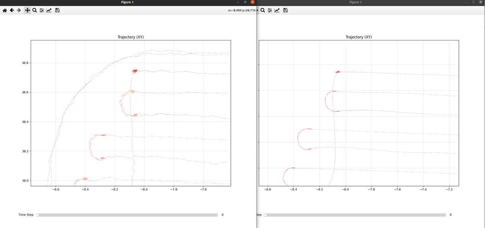
    - 后面:   优化继续小地图方案
  - 新器件选型`@李鹏飞`
    1. **禾赛效果不佳**，fastlio试下:也会翘起来，
      1. 建图容易翘 60
      2. 建图轨迹抖动大 5-10cm；
    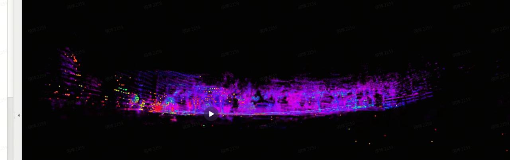
    - 数据采集分析`@李鹏飞`
- [** 回环调试记录**](https://roborock.feishu.cn/wiki/UxO1wtyWXiNFXCkKOsrc8o5YnJg)`**@应竞帆**`
  1. 回环遗留功能优化：（Doing）
    1. 导航轨迹地图；我们轨迹会变化；边界同步
      1. `@吴泽沛`机器跑一遍？充电桩原点；机器的轨迹点信息；
        1. 在线版本初版
        2. 效果不佳，后续优化
      2. 匹配度不足：submap匹配的是否，现有匹配不佳；
        1. submap两个 `@周士伟`小场景，`@周士伟`两个类似的大小的subamap的局部匹配（yaw+-20）
        2. Submap
          1. diff(大)
          2. 小；先验，小；
    2.  [回环在线计算方案](https://roborock.feishu.cn/wiki/IE81wrYIHiNw60kyM8dcMbrdn0b)
      1. ~~没有Rebase，反而带入了主线新代码 slamcore.cpp ，代码混了；解决问题改动 11~~
      2. 旧的分没有新的改动；09
      3. 多了 刷新环节+最后的匹配；
    3. 小场景，daily 测试
    4. **150m*3m场景（小场景，看下效果）==》140s**
      1. 过滤 走起来算？
      2. 中间没有成功    (接近，搜索调大半径  submp key 30*0.5 ) ？`@应竞帆`++叠影？没有成功的原因++
    5. 一些场景回环不上？
    6. bug支持
- `@王亚萌`
  1. bug
  2. 轮速
  3. **退化 跑飞**  +  纯轮子，替代Imu预测（待定）
  4. **导航地图，转换点云 butchart convert; pcd ;user map；**
  5. **历史问题：**
    1. 功能：**（Doing）**
      1. **静止检测，锁上静止pose，刷地图；有预测， Update 原来的pose;（Doing）**
      2. 双目Imu跑slam `@王亚萌` （27年用这个）
        1. simulate 仿真验证；试过有一组跑飞了？
        2. ++后面有切换切换双目imu的计划，这块的使用双目跑下slam的，双目imu数据也评估下吧；后轴听说容易堵住；++ ++lidar imu确定要砍掉++
      3. 退化 跑飞  +  纯轮子，替代Imu预测，仿真；**（Waiting）**
      4. 注意：原子锁的问题；
    2. roll pitch角度 `@王亚萌`**（Waiting）**
      1. Roll pitch直接用ap这个效果怎么样，slam改进？
         [roll pitch 约束slam](https://roborock.feishu.cn/docx/CzLId70SCoQNkuxmwQcc1H2gnCf)
    3. ~~原地转圈（**待定**，bug）~~
- 建图及基础功能：`@李鹏飞`
  - bug
  - 新器件：   [新器件airy lite/er1表现](https://roborock.feishu.cn/wiki/PvVwwAM2fijGbzkfOrxcDltCn2e)
  - 数据集：
    1. 云盘上传：园林数据`@李鹏飞`1.21 精简数据
  - 禾赛效果不佳
    1. Fast lio 弓字+我们弓字：ba bg
  - 万集数据 dt_s
  - **待定：**
    1. **性能优化：（Waiting）**
      1. 内核占用, 问题跟踪和优化；
        1. 优化内核占用+耗时
        2. downsample 改单线程
        3. Layer; 1.0 2;  0.7,1.0
          1. 性能和精度的平衡
        4. 低优先级，内存评估
    2. 3d转2d，转图功能
      1. 后面看下，先熟悉已有设计
- 定位`@闫冬`
  1. bug
    1. 国外抖动；空旷：产品？目前还在手里；
  2. 转弯抖动：nhc  调一下；
    1. 航向角度和（dx dy 向量） 夹角角度；运动学；
    2. 定位抖动bug：合入一版调参，不容易带偏 [定位抖动问题整理](https://roborock.feishu.cn/wiki/U5e2wI7ehitjPEkX8hucWy4dnzy?from=from_copylink)
      1. nhc优化: case 验证下数据；
      2. Predict
  3. 新器件：jt16  **万集**
  4. **小地图方案：定位平滑性**；地图缺失和环境变`@闫冬`
    1. 兼容地图扩展，可能有切换问题？有逻辑风险（Doing）
      1. 出包验证下
  5. 低优先级
    1. **360s单发版本**对比**（Doing） [单发版MID360s性能对比评估报告](https://roborock.feishu.cn/wiki/ISGcwlWTVizetbkbxknc4C0Ynx6?from=from_copylink)**
      1. 重复实验，++连续100次保持pcd，看是否有错位情况++；采集模式  （连续运行100次的脚本已完成）++bash ； （++ ++分层必现++ ++）++
        1. ++jt16在手数据，105++；`@闫冬`jt16
          1. 代码适配并对比建图结果
        2. ++写了一个点云可视化分析脚本 x y方向的分层能看出来 z方向的还没想好方++法
      2. ++是否能复现，待确认？必现++
    2. **自动化脚本，服务器**：建图+定位
      1. 数据一致；
      2. ~~在服务器跑，**待定~~**

1. 重定位`@周士伟`
  1. **局部重定位：合入一个版本了**
     [局部重定位测试结果](https://roborock.feishu.cn/wiki/DH9RwuTxxiqi7LkYlcqcA4G6n3b?from=from_copylink)
    1. 重定位优化到最后，单帧匹配
  2. Set pose `@周士伟`
    Resume 跑local map 1m（亚萌递推的pose为起点）；然后同步计算重定位；
    1. 算力；增加主动重定位接口（子越已有？复用）（广播）
  3. **遮挡问题** ++[割草机lidar脏污follow视觉-遮挡检测](https://roborock.feishu.cn/wiki/K6JUweIzAiDez2kw5W1cqZe3nae?from=from_copylink)++，12.19号进入代码
    1.  [遮挡检测2.0](https://roborock.feishu.cn/wiki/NnCEwg58SiekdVkynBVc3TNznfb?from=from_copylink)
    2. 误报：大公园空旷场地；35度fov?
    3. 硬件宏 ？
    4. ~~Case ：++中途突然**完全遮挡**，逻辑补充下++`@周士伟`~~
      1. ~~点数小于300点，报遮挡异常？~~
    5. WI 项目宏，传入？
    6. 切换广播模式；
  4. 全局重定位，转向体素地图
    1. 性能评估；
  5. ~~选项兼容性：jt16 等; 100%~~
  6. 低优先级：
    1. 特殊场景耗时优化：bbs的time out，++增加时间：目前设计如此（后续优化++
      1. 和产品讨论，超时是否其他逻辑？++语音提醒，持续定位中？请稍后；++
      2. 重定位失败，提示，抱回去，检查lidar等？
      3. 换成转圈，重定位失败;  gps试下？走一段大致5m？(优先级不高，试下)
        1. gps质量？
    2. 代码重构和耗时提升（长期跟踪）
    3. **imu颠簸重力变化大问题，初始化风险**

=====================================================================================

## 2026年1月8日

1. 交互方案  [VERSA导航-定位模块交互：建图&定位&重定位](https://roborock.feishu.cn/wiki/AqOGwVOuWimt7ykP2oTcSHpYnag?from=from_copylink)
2. 待定在研功能：
  - 搬起，取消任务**（Waiting）兼容**

- 紧急任务
  1. ~~**地图保存时间: **16KB `@应竞帆`~~
    1. ~~1503 整体耗时过多，看下8s原因        vetcor 5倍~~
  2. **轮速引入`@王亚萌**`
    1. 后轴解算代码引入
    2. 暂停+恢复：
      1. 减速位移
      2. 部分暂停推动；优化  ==》重定位
    3. {lidar odo} 过几秒后 lidar  odom
      1. if
        1. **Imu断流；**
        2. **lidar断流时间长**；camera
        3. 激光退化
          t odom补偿到上次；匹配的pose上面，作为匹配初值；
  3. ~~**局部重定位`@周士伟**`~~
  4. 新项目`@闫冬`
    1. **Lidar 宏 ; 双目宏**； 特殊lidar: 360
  5. 新器件选型验证：`@李鹏飞` `@闫冬`
    1. 1.8  4组定位采集完；导轨后面，简化弓字；
    2. 2 建图
- [** 回环调试记录](https://roborock.feishu.cn/wiki/UxO1wtyWXiNFXCkKOsrc8o5YnJg)**
  1. **优先支持项目问题；**
    1. ~~**16KB**:  正在逻辑补充~~
  2. 回环遗留功能优化：（Doing）
    1. 导航轨迹地图；我们轨迹会变化；边界同步`@应竞帆`
      1. `@吴泽沛`机器跑一遍？充电桩原点；机器的轨迹点信息；
        1. 保存的时候，
        2. keyframe点位发给他们？
          1. 开始和结束；这个拿到；
          2. **20cm**;导航容忍度？（优先看下这个方案）；我们发给他们(参考点云数据结构)
        3. **大圈，回到原地，点击保存；**没有中途拉回来；人为；
        4. 先弄第一建图的回环；
        5. 20m key +提高数量   ====》统一刷新**体素特别小**
      2. 匹配度不足：submap匹配的是否，现有匹配不佳；
        1. submap两个 `@周士伟`小场景，`@周士伟`两个类似的大小的subamap的局部匹配（yaw+-20）
        2. Submap
          1. diff(大)
          2. 小；先验，小；
    2.  [回环在线计算方案](https://roborock.feishu.cn/wiki/IE81wrYIHiNw60kyM8dcMbrdn0b)
      1. 多了 刷新环节+最后的匹配；
    3. 小场景，daily 测试
    4. **150m*3m场景（小场景，看下效果）==》140s**
      1. 过滤 走起来算？
      2. 中间没有成功 ？`@应竞帆`++叠影？没有成功的原因；++
    5. 一些场景回环不上？
    6. 板端验证`@应竞帆`
    7. 导航odom
- `@王亚萌`
  1. bug
  2. 轮速累计，slam可以抓取轮速的累计值(合入阶段)
    1. Slam 雷达、lidarimu断流的时候累计下，看看作为初值是否可靠；
    2. 局部重定位`@周士伟`
    3. Jekins @linlin dongdandan
    4. Core   -->
  3. ++**双目imu跑下slam**：仿真不好用？跑飞++
    1. 双目Imu零偏
  4. **退化 跑飞**  +  纯轮子，替代Imu预测（待定）
  5. Bug:
    1. 姚远给个工具，解析**导航地图显示**；
  6. **历史问题：**
    1. **轮速功能性 + 引入定位优化（Doing）**
    2. 仿真：**slam轨迹做对比**；动态，重置起点；**o \ span；（待合入）**
    3. 功能：**（Doing）**
      1. **静止检测，锁上静止pose，刷地图；有预测， Update 原来的pose;（Doing）**
      2. 双目Imu跑slam `@王亚萌` （严重）
        1. simulate 仿真验证；试过有一组跑飞了？
        2. ++后面有切换切换双目imu的计划，这块的使用双目跑下slam的，双目imu数据也评估下吧；后轴听说容易堵住；++ ++lidar imu确定要砍掉++
      3. 退化 跑飞  +  纯轮子，替代Imu预测，仿真；**（Waiting）**
      4. 注意：原子锁的问题；
    4. roll pitch角度 `@王亚萌`**（Waiting）**
      1. Roll pitch直接用ap这个效果怎么样，slam改进？
         [roll pitch 约束slam](https://roborock.feishu.cn/docx/CzLId70SCoQNkuxmwQcc1H2gnCf)
    5. ~~原地转圈（**待定**，bug）~~
      1. ~~**激光抖动；**~~切换轮速？
    6. **暂停（恢复， 空闲模式)；`@王亚萌`（TODO）**
      1. **说明：**
        1. **Lidar，pause--空闲 30s关闭；**
        2. **Pause 侧滑？搬动；遥控走直接重定位？**
          1. **复杂；轮子不动，机器动了？角度；**
        3. **暂停触发条件：报错暂停，用按暂停，空闲：在桩上，任务切换；**
      2. **功能设计：**
        1. **引入打印下deltpose；pause中间; 累积，暂停时候，累积下，看下delt打印；（Doing）**
        2. **打印下状态切换；**
- 建图及基础功能：`@李鹏飞`
  - bug
    1. ~~gps出界；     跟踪是否解决`@刘博`挂个号？（已同步刘博）~~
    
    - Lidar check 0;  误认为： save map ;（最近一周没有复现这类bug）
    - lidar断流导致定位丢失 （已反馈中间层）
  - ~~新器件：jt16   [新器件airy lite/er1表现](https://roborock.feishu.cn/wiki/PvVwwAM2fijGbzkfOrxcDltCn2e)~~
    1. ~~logparse合入 3个场地建图~~
  - 数据集：
    1. ~~国内数据：上传到我们的网盘中：[* 外场采集可用数据*](https://roborock.feishu.cn/wiki/AZ4EwI7psiUa84k4QNDcpM4mn4g)还剩2个~~
    2. ~~国外测试日志数据~~
  - ~~cpu占用增加，放羊case~~
    1. ~~top看下前后对应时间，是否功能一致：~~
  - ~~bug地图叠影：地图扩展，中间断流，机器移动，又save了一次；~~
    1. ~~国外，save  断流了     save ~~
  - 
  - **待定：**
    1. **性能优化：（Waiting）**
      1. 内核占用, 问题跟踪和优化；
        1. 优化内核占用+耗时
        2. downsample 改单线程
        3. Layer; 1.0 2;  0.7,1.0
          1. 性能和精度的平衡
        4. 低优先级，内存评估
    2. 3d转2d，转图功能
      1. 后面看下，先熟悉已有设计
- 定位`@闫冬`
  1. bug
    1. 转弯抖动：nhc  调一下；
      1. 航向角度和（dx dy 向量） 夹角角度；运动学；
        1. 90度；
    2. 定位抖动bug：合入一版调参，不容易带偏 [定位抖动问题整理](https://roborock.feishu.cn/wiki/U5e2wI7ehitjPEkX8hucWy4dnzy?from=from_copylink)
      1. nhc优化: case 验证下数据；
  2. ~~新项目、器件，定位性能~~
    1. ~~项目宏 lidar选项 ; ~~
    2. ~~lidar宏，lidar 360（1 2供 oms chaofeng读了一次消息；在线处理？），替换绝大部分项目宏~~
    3. ~~逐步验证，ok后合入：build prebuild plugin~~
    4. 轮速外参留意下`@林子越`config文件
  3. 低优先级
    1. **360s单发版本**对比**（Doing） [单发版MID360s性能对比评估报告](https://roborock.feishu.cn/wiki/ISGcwlWTVizetbkbxknc4C0Ynx6?from=from_copylink)**
      1. 重复实验，++连续100次保持pcd，看是否有错位情况++；采集模式  （连续运行100次的脚本已完成）++bash ； （++ ++分层必现++ ++）++
        1. ++jt16在手数据，105++；`@闫冬`jt16
          1. 代码适配并对比建图结果
        2. ++写了一个点云可视化分析脚本 x y方向的分层能看出来 z方向的还没想好方++法
      2. ++是否能复现，待确认？必现++
    2. **自动化脚本，服务器**：建图+定位
      1. 数据一致；
      2. ~~在服务器跑，**待定~~**
    3. 小地图方案：地图缺失和环境变`@闫冬`
      1. 兼容地图扩展，可能有切换问题？有逻辑风险（Doing）
        1. 出包验证下
- 重定位`@周士伟`
  1. **遮挡问题** ++[割草机lidar脏污follow视觉-遮挡检测](https://roborock.feishu.cn/wiki/K6JUweIzAiDez2kw5W1cqZe3nae?from=from_copylink)++，12.19号进入代码
    1.  [遮挡检测2.0](https://roborock.feishu.cn/wiki/NnCEwg58SiekdVkynBVc3TNznfb?from=from_copylink) block姚远；
    2. 暂停对遮挡干扰；
    3. 错误码生效，转姚远；
    4. 重定位不响应；重定位耗时过多，特征无限制导致；
    5. Case ：++中途突然**完全遮挡**，逻辑补充下++`@周士伟`
      1. 点数小于300点，报遮挡异常？
    6. WI 硬件宏 lidar check
  2. **局部重定位：合入一个版本了**
     [局部重定位测试结果](https://roborock.feishu.cn/wiki/DH9RwuTxxiqi7LkYlcqcA4G6n3b?from=from_copylink)
    1. 重定位优化到最后，单帧匹配
  3. 主动重定位
  4. 全局重定位，转向体素地图
    1. 性能评估；
  5. 选项兼容性：jt16 等
  6. 低优先级：
    1. 特殊场景耗时优化：bbs的time out，++增加时间：目前设计如此（后续优化++
      1. 和产品讨论，超时是否其他逻辑？++语音提醒，持续定位中？请稍后；++
      2. 重定位失败，提示，抱回去，检查lidar等？
      3. 换成转圈，重定位失败;  gps试下？走一段大致5m？(优先级不高，试下)
        1. gps质量？
    2. 代码重构和耗时提升（长期跟踪）
    3. **imu颠簸重力变化大问题，初始化风险**

=======================================================

## 2025年12月31日

1. 交互方案  [VERSA导航-定位模块交互：建图&定位&重定位](https://roborock.feishu.cn/wiki/AqOGwVOuWimt7ykP2oTcSHpYnag?from=from_copylink)
2. 待定在研功能：
  - 搬起，取消任务**（Waiting）兼容**

- 紧急任务
  1. **地图保存时间: **16KB `@应竞帆`
    1. 1503 整体耗时过多，看下8s原因
  2. **轮速引入`@王亚萌`**
    1. 后轴解算代码引入
    2. {lidar odo} 过几秒后 lidar  odom
      1. if
        1. **Imu断流；**
        2. **lidar断流时间长**；camera
        3. 激光退化
          t odom补偿到上次；匹配的pose上面，作为匹配初值；
  - **局部重定位`@周士伟`**
  - 新项目`@闫冬`
  - 新器件选型验证：`@李鹏飞` `@闫冬`
- [** 回环调试记录](https://roborock.feishu.cn/wiki/UxO1wtyWXiNFXCkKOsrc8o5YnJg)**
  1. **优先支持项目问题；**
    1. ~~**16KB**:  正在逻辑补充~~
  2. 回环遗留功能优化：（Doing）
    1. 导航轨迹地图；我们轨迹会变化；边界同步`@应竞帆`
      1. `@吴泽沛`机器跑一遍？充电桩原点；机器的轨迹点信息；
        1. 保存的时候，
        2. keyframe点位发给他们？
          1. 开始和结束；这个拿到；
          2. **20cm**;导航容忍度？（优先看下这个方案）；我们发给他们(参考点云数据结构)
        3. **大圈，回到原地，点击保存；**没有中途拉回来；人为；
        4. 先弄第一建图的回环；
        5. 20m key +提高数量   ====》统一刷新**体素特别小**
      2. 匹配度不足：submap匹配的是否，现有匹配不佳；
        1. submap两个 `@周士伟`小场景，`@周士伟`两个类似的大小的subamap的局部匹配（yaw+-20）
        2. Submap
          1. diff(大)
          2. 小；先验，小；
    2.  [回环在线计算方案](https://roborock.feishu.cn/wiki/IE81wrYIHiNw60kyM8dcMbrdn0b)
    3. 小场景，daily 测试
    4. **150m*3m场景（小场景，看下效果）==》140s**
      1. 过滤 走起来算？
    5. 一些场景回环不上？
    6. 板端验证`@应竞帆`
    7. 退化
    8. 导航odom
- `@王亚萌`
  1. bug
  2. 轮速累计，slam可以抓取轮速的累计值(合入阶段)
    1. Slam 雷达、lidarimu断流的时候累计下，看看作为初值是否可靠；
    2. 局部重定位`@周士伟`
    3. Jekins @linlin dongdandan
    4. Core   -->
  3. ++**双目imu跑下slam**：仿真不好用？跑飞++
    1. 双目Imu零偏
  4. **退化 跑飞**  +  纯轮子，替代Imu预测（待定）
  5. Bug:
    1. 姚远给个工具，解析导航地图显示；
  6. **历史问题：**
    1. **轮速功能性 + 引入定位优化（Doing）**
    2. 仿真：**slam轨迹做对比**；动态，重置起点；**o \ span；（待合入）**
    3. 功能：**（Doing）**
      1. **静止检测，锁上静止pose，刷地图；有预测， Update 原来的pose;（Doing）**
      2. 双目Imu跑slam `@王亚萌` （严重）
        1. simulate 仿真验证；试过有一组跑飞了？
        2. ++后面有切换切换双目imu的计划，这块的使用双目跑下slam的，双目imu数据也评估下吧；后轴听说容易堵住；++ ++lidar imu确定要砍掉++
      3. 退化 跑飞  +  纯轮子，替代Imu预测，仿真；**（Waiting）**
      4. 注意：原子锁的问题；
    4. roll pitch角度 `@王亚萌`**（Waiting）**
      1. Roll pitch直接用ap这个效果怎么样，slam改进？
         [roll pitch 约束slam](https://roborock.feishu.cn/docx/CzLId70SCoQNkuxmwQcc1H2gnCf)
    5. ~~原地转圈（**待定**，bug）~~
      1. ~~**激光抖动；**~~切换轮速？
    6. **暂停（恢复， 空闲模式)；`@王亚萌`（TODO）**
      1. **说明：**
        1. **Lidar，pause--空闲 30s关闭；**
        2. **Pause 侧滑？搬动；遥控走直接重定位？**
          1. **复杂；轮子不动，机器动了？角度；**
        3. **暂停触发条件：报错暂停，用按暂停，空闲：在桩上，任务切换；**
      2. **功能设计：**
        1. **引入打印下deltpose；pause中间; 累积，暂停时候，累积下，看下delt打印；（Doing）**
        2. **打印下状态切换；**
- 建图及基础功能：`@李鹏飞`
  - bug
  - 新器件：jt16   [新器件airy lite/er1表现](https://roborock.feishu.cn/wiki/PvVwwAM2fijGbzkfOrxcDltCn2e)
    1. logparse合入 3个场地建图
  - 数据集：
    1. 国内数据：上传到我们的网盘中： [外场采集可用数据](https://roborock.feishu.cn/wiki/AZ4EwI7psiUa84k4QNDcpM4mn4g)还剩2个
    2. 国外测试日志数据
  - ~~cpu占用增加，放羊case~~
    1. ~~top看下前后对应时间，是否功能一致：~~
  - bug地图叠影：地图扩展，中间断流，机器移动，又save了一次；
  - **待定：**
    1. **性能优化：（Waiting）**
      1. 内核占用, 问题跟踪和优化；
        1. 优化内核占用+耗时
        2. downsample 改单线程
        3. Layer; 1.0 2;  0.7,1.0
          1. 性能和精度的平衡
        4. 低优先级，内存评估
    2. 3d转2d，转图功能
      1. 后面看下，先熟悉已有设计
- 定位`@闫冬`
  1. bug
    1. 定位抖动bug：合入一版调参，不容易带偏 [定位抖动问题整理](https://roborock.feishu.cn/wiki/U5e2wI7ehitjPEkX8hucWy4dnzy?from=from_copylink)
      1. nhc优化: case 验证下数据；
  2. 新项目、器件，定位性能
    1. 项目宏 lidar选项
    2. lidar宏，lidar 360（1 2供 oms chaofeng读了一次消息；在线处理？），替换绝大部分项目宏
    3. 逐步验证，ok后合入：build prebuild plugin
    4. 轮速外参留意下`@林子越`config文件
  3. 抖动，能看dy 1cm
  4. 和Lidar断流无关，Pause -- set pose中间移动了？
  5. 低优先级
    1. **360s单发版本**对比**（Doing） [单发版MID360s性能对比评估报告](https://roborock.feishu.cn/wiki/ISGcwlWTVizetbkbxknc4C0Ynx6?from=from_copylink)**
      1. 重复实验，++连续100次保持pcd，看是否有错位情况++；采集模式  （连续运行100次的脚本已完成）++bash ； （++ ++分层必现++ ++）++
        1. ++jt16在手数据，105++；`@闫冬`jt16
          1. 代码适配并对比建图结果
        2. ++写了一个点云可视化分析脚本 x y方向的分层能看出来 z方向的还没想好方++法
      2. ++是否能复现，待确认？必现++
    2. **自动化脚本，服务器**：建图+定位
      1. 数据一致；
      2. ~~在服务器跑，**待定~~**
    3. 小地图方案：地图缺失和环境变`@闫冬`
      1. 兼容地图扩展，可能有切换问题？有逻辑风险（Doing）
        1. 出包验证下
- 重定位`@周士伟`
  1. **遮挡问题** ++[割草机lidar脏污follow视觉-遮挡检测](https://roborock.feishu.cn/wiki/K6JUweIzAiDez2kw5W1cqZe3nae?from=from_copylink)++，12.19号进入代码
    1.  [遮挡检测2.0](https://roborock.feishu.cn/wiki/NnCEwg58SiekdVkynBVc3TNznfb?from=from_copylink) block姚远；
    2. Case ：中途突然完全遮挡，逻辑补充下`@周士伟`
      1. 点数小于300点，报遮挡异常？
  2. **局部重定位：合入一个版本了**
     [局部重定位测试结果](https://roborock.feishu.cn/wiki/DH9RwuTxxiqi7LkYlcqcA4G6n3b?from=from_copylink)
     90% 0.1
  3. 重定位专项测试 改360 key增加；
  4. 全局重定位，转向体素地图
    1. Oom
  5. 优化：
    1. 局部地图降低点数，耗时优化；
      1. 建图改成5000点max;重定位未动
      2. Keyframe 0.2?
        1. **看看能否扛得住，重定位**Keyframe 0.3
    2. 重定位优化到最后，单帧匹配
    3. 重定位引入重力对齐
  6. 低优先级：
    1. 特殊场景耗时优化：bbs的time out，++增加时间：目前设计如此（后续优化++
      1. 和产品讨论，超时是否其他逻辑？++语音提醒，持续定位中？请稍后；++
      2. 重定位失败，提示，抱回去，检查lidar等？
      3. 换成转圈，重定位失败;  gps试下？走一段大致5m？(优先级不高，试下)
        1. gps质量？
    2. 代码重构和耗时提升（长期跟踪）
    3. **imu颠簸重力变化大问题，初始化风险**

=======================================================

## 2025年12月24日

1. 交互方案  [VERSA导航-定位模块交互：建图&定位&重定位](https://roborock.feishu.cn/wiki/AqOGwVOuWimt7ykP2oTcSHpYnag?from=from_copylink)
2. 待定在研功能：
  - 搬起，取消任务**（Waiting）兼容**

- 紧急任务
  3:1 
  8:1 
  1. **地图保存时间过长`@周士伟` `@王亚萌`**
    1. Io trace：4B---》16KB
  2. **轮速引入`@王亚萌`**
    1. 逻辑；
    2. If {}else return
      If  return
       (){
       ----
       }
  3. **局部重定位`@周士伟`**
    1. 1层；1m --》
  4. JT16和新项目`@李鹏飞` `@闫冬`
    1. ~~时间和sdk ;厂家 （已查明，就是厂家提供SDK问题导致）~~
- [** 回环调试记录](https://roborock.feishu.cn/wiki/UxO1wtyWXiNFXCkKOsrc8o5YnJg)**
  1. **优先支持项目问题；**
    1. bug
    2. **16KB**:  正在逻辑补充
      1. Pcd 异常，error
      2. Load save
  2. 回环遗留功能优化：（Doing）
    1. 导航轨迹地图；我们轨迹会变化；边界同步`@应竞帆`
      1. `@吴泽沛`机器跑一遍？充电桩原点；机器的轨迹点信息；
        1. 保存的时候，
        2. keyframe点位发给他们？
          1. 开始和结束；这个拿到；
          2. **20cm**;导航容忍度？（优先看下这个方案）；我们发给他们(参考点云数据结构)
        3. **大圈，回到原地，点击保存；**没有中途拉回来；人为；
        4. 先弄第一建图的回环；
        5. 20m key +提高数量   ====》统一刷新**体素特别小**
      2. 匹配度不足：submap匹配的是否，现有匹配不佳；
        1. submap两个 `@周士伟`小场景，`@周士伟`两个类似的大小的subamap的局部匹配（yaw+-20）
        2. Submap
          1. diff(大)
          2. 小；先验，小；
    2. 小场景，daily 测试
      1. 自测 daily 测试
      2. 排队+加些日志，看耗时；
    3. **150m*3m场景（小场景，看下效果）**
      1. 过滤 走起来算？
    4. 板端验证`@应竞帆`
    5. 退化
- `@王亚萌`
  1. bug
  2. 轮速累计，slam可以抓取轮速的累计值(合入阶段)
    1. Slam 雷达、lidarimu断流的时候累计下，看看作为初值是否可靠；
    2. 局部重定位`@周士伟`
    3. Jekins @linlin dongdandan
    4. Core   -->
  3. ++**双目imu跑下slam**：仿真不好用？跑飞++
    1. 双目Imu零偏
  4. **退化 跑飞**  +  纯轮子，替代Imu预测（待定）
  5. **历史问题：**
    1. **轮速功能性 + 引入定位优化（Doing）**
    2. 仿真：**slam轨迹做对比**；动态，重置起点；**o \ span；（待合入）**
    3. 功能：**（Doing）**
      1. **静止检测，锁上静止pose，刷地图；有预测， Update 原来的pose;（Doing）**
      2. 双目Imu跑slam `@王亚萌` （严重）
        1. simulate 仿真验证；试过有一组跑飞了？
        2. ++后面有切换切换双目imu的计划，这块的使用双目跑下slam的，双目imu数据也评估下吧；后轴听说容易堵住；++ ++lidar imu确定要砍掉++
      3. 退化 跑飞  +  纯轮子，替代Imu预测，仿真；**（Waiting）**
      4. 注意：原子锁的问题；
    4. roll pitch角度 `@王亚萌`**（Waiting）**
      1. Roll pitch直接用ap这个效果怎么样，slam改进？
         [roll pitch 约束slam](https://roborock.feishu.cn/docx/CzLId70SCoQNkuxmwQcc1H2gnCf)
    5. ~~原地转圈（**待定**，bug）~~
      1. ~~**激光抖动；**~~切换轮速？
    6. **暂停（恢复， 空闲模式)；`@王亚萌`（TODO）**
      1. **说明：**
        1. **Lidar，pause--空闲 30s关闭；**
        2. **Pause 侧滑？搬动；遥控走直接重定位？**
          1. **复杂；轮子不动，机器动了？角度；**
        3. **暂停触发条件：报错暂停，用按暂停，空闲：在桩上，任务切换；**
      2. **功能设计：**
        1. **引入打印下deltpose；pause中间; 累积，暂停时候，累积下，看下delt打印；（Doing）**
        2. **打印下状态切换；**
- 建图及基础功能：`@李鹏飞`
  - bug
  - 新器件：jt16   [新器件airy lite/er1表现](https://roborock.feishu.cn/wiki/PvVwwAM2fijGbzkfOrxcDltCn2e)
    1. ~~适配新款JT16解析与仿真（现在可以正常运行）（等厂家给出正确的点云时间戳）~~
    2. ~~测试mid360观测白色栅栏的极限距离~~
  - 数据集：
    1. ~~国内数据~~：上传到我们的网盘中： [外场采集可用数据](https://roborock.feishu.cn/wiki/AZ4EwI7psiUa84k4QNDcpM4mn4g)
    2. ~~五组国外测试日志数据~~
      1. ~~第1、2、5组有数据（其中第一组数据意义不大）~~
  - ~~cpu占用增加，放羊case~~
    1. ~~top看下前后对应时间，是否功能一致：~~
  - ~~白色栅栏 43m；~~
  - **待定：**
    1. **性能优化：（Waiting）**
      1. 内核占用, 问题跟踪和优化；
        1. 优化内核占用+耗时
        2. downsample 改单线程
        3. Layer; 1.0 2;  0.7,1.0
          1. 性能和精度的平衡
        4. 低优先级，内存评估
    2. 3d转2d，转图功能
      1. 后面看下，先熟悉已有设计
- 定位`@闫冬`
  1. bug
    1. 定位抖动bug
    2. **定位会与实际位置有偏差 在桩外附近可以进行建图？？？**
      1、启动建图
       2、中间走暂停恢复指令
       3、在桩外又启动建图指令（算法在0 0 0而实际机器在桩外）
       4、所以看起来相对桩的位置对不上
  2. 新项目、器件，定位性能
    1. 新项目适配3个；只适配了编译；plugin待定
    2. jt16数据查看
  3. Check pose阈值逻辑微调，对应bug
    1. `@闫冬`3度，~~临时方案，10度`@明坤`~~
    2. checkpose计算中机器在动；
  4. 和Lidar断流无关，Pause -- set pose中间移动了？
  5. 定位**走直线，抖动**；&imu拉跑偏一点，优先级低
  6. Ekf/ekf
  7.  [定位抖动问题整理](https://roborock.feishu.cn/wiki/U5e2wI7ehitjPEkX8hucWy4dnzy?from=from_copylink)
  8. 低优先级：
    1. **360s单发版本**对比**（Doing） [单发版MID360s性能对比评估报告](https://roborock.feishu.cn/wiki/ISGcwlWTVizetbkbxknc4C0Ynx6?from=from_copylink)**
      1. 重复实验，++连续100次保持pcd，看是否有错位情况++；采集模式  （连续运行100次的脚本已完成）++bash ； （++ ++分层必现++ ++）++
        1. ++jt16在手数据，105++；`@闫冬`jt16
          1. 代码适配并对比建图结果
        2. ++写了一个点云可视化分析脚本 x y方向的分层能看出来 z方向的还没想好方++法
      2. ++是否能复现，待确认？必现++
    2. **自动化脚本，服务器**：建图+定位
      1. 数据一致；
      2. ~~在服务器跑，**待定~~**
    3. 小地图方案：地图缺失和环境变`@闫冬`
      1. 兼容地图扩展，可能有切换问题？有逻辑风险（Doing）
        1. 出包验证下
- 重定位`@周士伟`
  1. **遮挡问题** ++[割草机lidar脏污follow视觉-遮挡检测](https://roborock.feishu.cn/wiki/K6JUweIzAiDez2kw5W1cqZe3nae?from=from_copylink)++，12.19号进入代码
    1.  [遮挡检测2.0](https://roborock.feishu.cn/wiki/NnCEwg58SiekdVkynBVc3TNznfb?from=from_copylink) block姚远；
    2. **遮挡统一**导航报告？
      度+50度
      清楚，姚远
      ](images/多线组会-image-12.png)
  感知，提供数据；
  - 局部重定位：
    [ 局部重定位测试结果](https://roborock.feishu.cn/wiki/DH9RwuTxxiqi7LkYlcqcA4G6n3b?from=from_copylink)
    +-60度，距离1.5；
    步长 2度；
    **（添加扰动）yaw：20度， X，Y：0.3**
    **成功率（阈值：match\_ratio >= 0.85 &&  score <= 0.12）**
    总测试次数：7311
    满足阈值：7299
    失败：12
    重定位没有动；
    **score:**
    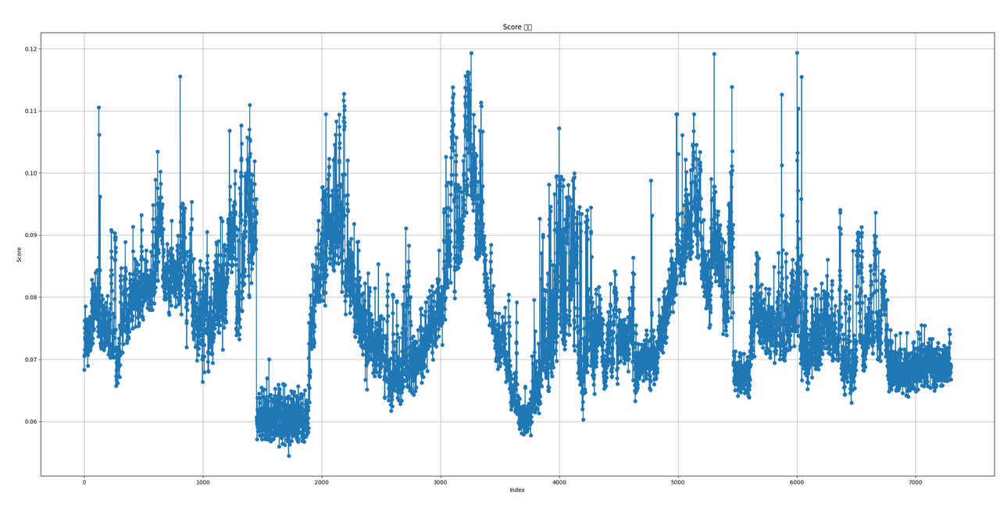
    **match\_ratio:**
    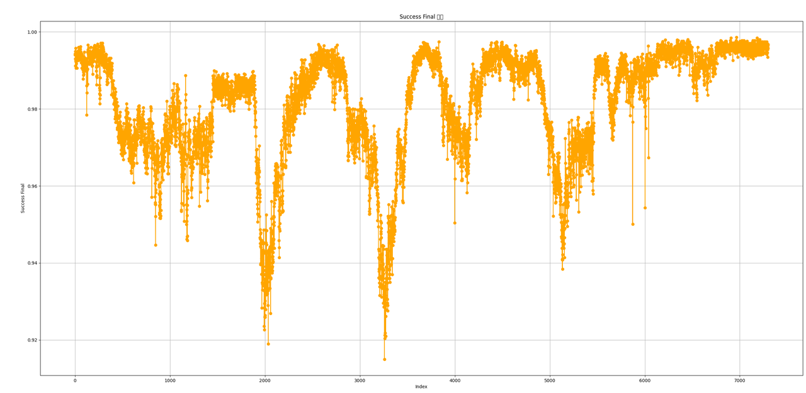
    **cost\_time:**
    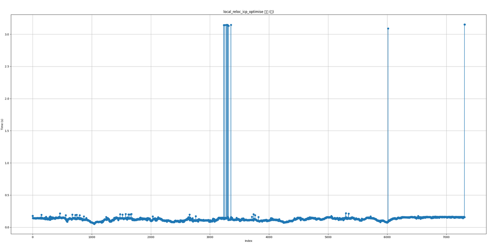
    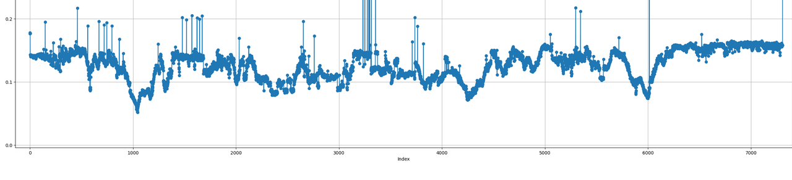
  - 重定位专项测试 改360 key增加；
  - 优化：
    1. 局部地图降低点数，耗时优化；
      1. 建图改成5000点max;重定位未动
      2. Keyframe 0.2?
        1. **看看能否扛得住，重定位**Keyframe 0.3
    2. 重定位优化到最后，单帧匹配
    3. 重定位引入重力对齐
  - 低优先级：
    1. 特殊场景耗时优化：bbs的time out，++增加时间：目前设计如此（后续优化++
      1. 和产品讨论，超时是否其他逻辑？++语音提醒，持续定位中？请稍后；++
      2. 重定位失败，提示，抱回去，检查lidar等？
      3. 换成转圈，重定位失败;  gps试下？走一段大致5m？(优先级不高，试下)
        1. gps质量？
    2. 代码重构和耗时提升（长期跟踪）
    3. **imu颠簸重力变化大问题，初始化风险**

=======================================================

## 2025年12月17日

1. 交互方案  [VERSA导航-定位模块交互：建图&定位&重定位](https://roborock.feishu.cn/wiki/AqOGwVOuWimt7ykP2oTcSHpYnag?from=from_copylink)
2. 待定在研功能：
  - 搬起，取消任务**（Waiting）兼容**
3. 紧急任务
  1. **轮速引入`@王亚萌`**
  2. **局部重定位`@周士伟`**
  3. JT16和新项目`@李鹏飞` `@闫冬`

- [** 回环调试记录](https://roborock.feishu.cn/wiki/UxO1wtyWXiNFXCkKOsrc8o5YnJg)**
  1. **优先支持项目问题；**
    1. 16KB:  正在逻辑补充
    2. **150m*3m场景**
  2. 回环遗留功能优化：（Doing）
    1. 导航轨迹地图；我们轨迹会变化；边界同步`@应竞帆`
      1. `@吴泽沛`机器跑一遍？充电桩原点；机器的轨迹点信息；
        1. 保存的时候，
        2. keyframe点位发给他们？
          1. 开始和结束；这个拿到；
          2. **20cm**;导航容忍度？（优先看下这个方案）；我们发给他们(参考点云数据结构)
        3. **大圈，回到原地，点击保存；**没有中途拉回来；人为；
        4. 先弄第一建图的回环；
        5. 20m key +提高数量   ====》统一刷新**体素特别小**
      2. 匹配度不足：submap匹配的是否，现有匹配不佳；
        1. submap两个 `@周士伟`小场景，`@周士伟`两个类似的大小的subamap的局部匹配（yaw+-20）
        2. Submap
          1. diff(大)
          2. 小；先验，小；
    2. **150m*3m场景（case 和产品定义冲突？），耗时过多；（小场景，看下效果，这个先不纠结）**
      1. 过滤
      2. 走起来算？
    3. **上机验证,回环`@应竞帆`（Doing）**
      1. ++机器验证，**排队（++ ++Doing++ ++）**++
        **耗时；触发不了？**
      2. 板端验证`@应竞帆`
    4. 退化
- `@王亚萌`
  1. bug
  2. 轮速累计，slam可以抓取轮速的累计值(合入阶段)
    1. Slam 雷达、lidarimu断流的时候累计下，看看作为初值是否可靠；
    2. 局部重定位`@周士伟`
  3. ++**双目imu跑下slam**：仿真不好用？跑飞++
    1. 双目Imu零偏
  4. **退化 跑飞**  +  纯轮子，替代Imu预测（待定）
  5. **历史问题：**
    1. **轮速功能性 + 引入定位优化（Doing）**
    2. 仿真：**slam轨迹做对比**；动态，重置起点；**o \ span；（待合入）**
    3. 功能：**（Doing）**
      1. **静止检测，锁上静止pose，刷地图；有预测， Update 原来的pose;（Doing）**
      2. 双目Imu跑slam `@王亚萌` （严重）
        1. simulate 仿真验证；试过有一组跑飞了？
        2. ++后面有切换切换双目imu的计划，这块的使用双目跑下slam的，双目imu数据也评估下吧；后轴听说容易堵住；++ ++lidar imu确定要砍掉++
      3. 退化 跑飞  +  纯轮子，替代Imu预测，仿真；**（Waiting）**
      4. 注意：原子锁的问题；
    4. roll pitch角度 `@王亚萌`**（Waiting）**
      1. Roll pitch直接用ap这个效果怎么样，slam改进？
         [roll pitch 约束slam](https://roborock.feishu.cn/docx/CzLId70SCoQNkuxmwQcc1H2gnCf)
    5. ~~原地转圈（**待定**，bug）~~
      1. ~~**激光抖动；**~~切换轮速？
    6. **暂停（恢复， 空闲模式)；`@王亚萌`（TODO）**
      1. **说明：**
        1. **Lidar，pause--空闲 30s关闭；**
        2. **Pause 侧滑？搬动；遥控走直接重定位？**
          1. **复杂；轮子不动，机器动了？角度；**
        3. **暂停触发条件：报错暂停，用按暂停，空闲：在桩上，任务切换；**
      2. **功能设计：**
        1. **引入打印下deltpose；pause中间; 累积，暂停时候，累积下，看下delt打印；（Doing）**
        2. **打印下状态切换；**
  6. 协助北京验证
  7. Python  轮速：轨迹点；增加暂停的标记，红色方块括起来？**（待定TODO）**
- 建图及基础功能：`@李鹏飞`
  1. 对AiryLite（12组数据）和E1R（16组数据）采集到的所有数据进行仿真，将仿真结果总结到文档 [新器件airy lite/er1表现](https://roborock.feishu.cn/wiki/PvVwwAM2fijGbzkfOrxcDltCn2e)
  2. 将AiryLite频率降为5Hz进行仿真，与不降频情况下的结果进行对比：算法能hold住，没有明显差别。
  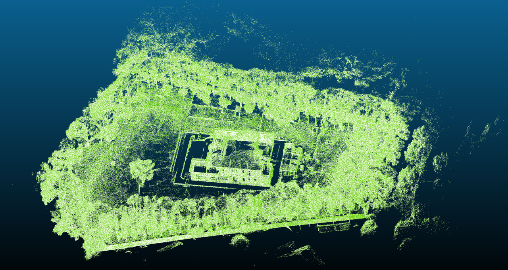
  - 适配新款JT16解析与仿真（现在可以正常运行）
  - 外场数据初步总结：25组数据已经获取到24组，总结成文档（后续还要补充且上传到我们的网盘中）： [外场采集可用数据](https://roborock.feishu.cn/wiki/AZ4EwI7psiUa84k4QNDcpM4mn4g)
  - 提了三个mr，代码主要是增加原子变量解决
    1. controller init问题、
    2. 打印receive lidar data相关log日志； 上锁 load map
  - 解决若干个测试提的bug；分析asan版本bug相关问题；帮亚萌验证几组数据
  - 在五组国外测试日志中寻找可用的数据（用于以后仿真，观测算法表现等）  （目前还没有找到有价值的信息）binI11
- bug
- **slam数据：**
  1. **庄园数据采集**；
    1. ~~已经采集18组；（20号场地、21号场地刚收到，还没验收）总25组~~
    2. ~~数据7 ？回环回不上；~~
    3. ~~极限机两组数据~~
- 新器件，建图性能：jt16
- 新器件，定位性能
- 新器件： [新器件表现](https://roborock.feishu.cn/wiki/PvVwwAM2fijGbzkfOrxcDltCn2e?from=from_copylink)
  1. ~~  5hz看下~~
- 自研fov 动态验证；hold下
  1. sensor 边界，动态分辨率；`@杨凌濛`
    1. **32线lidar情况：密度分布建议（Doing）； 有机会做到0.4°左右**
      1. 15-20
- **待定：**
  1. **性能优化：（Waiting）**
    1. 内核占用, 问题跟踪和优化；
      1. 优化内核占用+耗时
      2. downsample 改单线程
      3. Layer; 1.0 2;  0.7,1.0
        1. 性能和精度的平衡
      4. 低优先级，内存评估
  2. 3d转2d，转图功能
    1. 后面看下，先熟悉已有设计
- 定位`@闫冬`
  1. bug
    1. e20
  2. 新器件，定位性能
  3. Check pose阈值逻辑微调，对应bug
    1. `@闫冬`3度，~~临时方案，10度`@明坤~~`
  4. 和Lidar断流无关，Pause -- set pose中间移动了？
  5. imu预测丢掉，时序问题
    1. 传感器数据统一排序，关闭这个功能；`@刘宏伟`
  6. imu拉跑偏一点，优先级低
  7. 定位**走直线，抖动**；
  8. 低优先级：
    1. **360s单发版本**对比**（Doing） [单发版MID360s性能对比评估报告](https://roborock.feishu.cn/wiki/ISGcwlWTVizetbkbxknc4C0Ynx6?from=from_copylink)**
      1. 重复实验，++连续100次保持pcd，看是否有错位情况++；采集模式  （连续运行100次的脚本已完成）++bash ； （++ ++分层必现++ ++）++
        1. ++jt16在手数据，105++；`@闫冬`jt16
          1. 代码适配并对比建图结果
        2. ++写了一个点云可视化分析脚本 x y方向的分层能看出来 z方向的还没想好方++法
      2. ++是否能复现，待确认？必现++
    2. **自动化脚本，服务器**：建图+定位
      1. 数据一致；
      2. ~~在服务器跑，**待定~~**
    3. 小地图方案：地图缺失和环境变`@闫冬`
      1. 兼容地图扩展，可能有切换问题？有逻辑风险（Doing）
        1. 出包验证下
- 重定位`@周士伟`
  1. **遮挡问题** ++[割草机lidar脏污follow视觉-遮挡检测](https://roborock.feishu.cn/wiki/K6JUweIzAiDez2kw5W1cqZe3nae?from=from_copylink)++，12.19号进入代码
    1.  [遮挡检测2.0](https://roborock.feishu.cn/wiki/NnCEwg58SiekdVkynBVc3TNznfb?from=from_copylink) block姚远；
    2. **遮挡统一**导航报告？
  2. 局部重定位：
     [局部重定位测试结果](https://roborock.feishu.cn/wiki/DH9RwuTxxiqi7LkYlcqcA4G6n3b?from=from_copylink)
     **（添加扰动）yaw：20度， X，Y：0.3**
     **成功率（阈值：matchratio >= 0.85 &&  score <= 0.12）**
     总测试次数：7311
     满足阈值：7299
     失败：12
     **score:**
     
  **match\_ratio:**
  
  **cost\_time:**
  
  
  - 地图无限累积；oom
  - 重定位专项测试 改360 key增加；
  - 重定位优化到最后，单帧匹配
    Bbs  ===》结果在起点；
    **acc累计**的Pose的误差，补偿到终点；
    **改为用最近几个Keyframe验证；**
    **Keyi  posei ===>   I**
    **Key i-1    pose i-1       ===>       posei ^（-1）\*pose i-1**
  - 重定位引入重力对齐
  - 低优先级：
    1. 特殊场景耗时优化：bbs的time out，++增加时间：目前设计如此（后续优化++
      1. 和产品讨论，超时是否其他逻辑？++语音提醒，持续定位中？请稍后；++
      2. 重定位失败，提示，抱回去，检查lidar等？
      3. 换成转圈，重定位失败;  gps试下？走一段大致5m？(优先级不高，试下)
        1. gps质量？
    2. 代码重构和耗时提升（长期跟踪）
    3. **imu颠簸重力变化大问题，初始化风险**

=======================================================

## 2025年12月10日

1. 项目整体进展+未开展功能
  1. 代码review `@明坤`
    1. **轮速引入**
    2. **小地图定位方案**
    3. **重定位代码review 重构**
    4. 回环代码review最新改动
  2. 定位稳定性提升
    1. 转弯：
      1. **原地；**
      2. 非原地；
    2. **静止稳定性**
    3. nhc约束 vy;vy vz;
  3. 计算性能优化
    1. 耗时优化
    2. 内存
  4. 建图性能提升：
    1. 回环
  5. 交互方案
     [VERSA导航-定位模块交互：建图&定位&重定位](https://roborock.feishu.cn/wiki/AqOGwVOuWimt7ykP2oTcSHpYnag?from=from_copylink)
  6. 成砖；**张勇拆机**
  7. 退化检测
  8. gicp待合入：耗时增加过多，待定；
2. 在研功能：
  - 搬起，取消任务**（Waiting）兼容**
  - 回环遗留功能优化：**（Doing） [回环调试记录](https://roborock.feishu.cn/wiki/UxO1wtyWXiNFXCkKOsrc8o5YnJg)**
  1. **主题逻辑：导航轨迹地图；我们轨迹会变化；边界同步`@应竞帆`10-15；1-1.5s x86**
    1. `@吴泽沛`机器跑一遍？充电桩原点；机器的轨迹点信息；
      1. 保存的时候，
      2. keyframe点位发给他们？
        1. 开始和结束；这个拿到；
        2. **20cm**;导航容忍度？（优先看下这个方案）；我们发给他们(参考点云数据结构)
      3. **大圈，回到原地，点击保存；**没有中途拉回来；人为；
      4. 先弄第一建图的回环；
      5. 20m key +提高数量   ====》统一刷新**体素特别小**
      6. 50cm； 虚拟1个pose
    2. 匹配度不足：submap匹配的是否，现有匹配不佳；
      1. submap两个 `@周士伟`小场景，`@周士伟`两个类似的大小的subamap的局部匹配（yaw+-20）
      2. Submap
        1. diff(大)
        2. 小；先验，小；
    3. **上机验证,回环`@应竞帆`（Doing）**
      1. ++机器验证，**排队（++ ++Doing++ ++）**++
        1. ++保存不了地图？（Done）；++
          1. ++slam norm? log丢失；++ ++网上传++ ++；++`@黄亮`++printf save指令++
        2. **耗时；触发不了？**
      2. 板端验证`@应竞帆`
    4. 现场支持airy lite ；e1r
      `
  2. 轮速引入
    1. **重力初始化，从轮速的imu引入需要外参roll pitch？（Doing）**
      1. **fprintf加个打印（TODO）**
    2. **轮速功能性 + 引入定位优化：（Doing）**
      1. 仿真：**slam轨迹做对比**；动态，重置起点；**o \ span；（待合入）**
      2. 功能：**（Doing）**
        1. **静止检测，锁上静止pose，刷地图；有预测， Update 原来的pose;（Doing）**
        2. 双目Imu跑slam `@王亚萌` （严重）
          1. simulate 仿真验证；试过有一组跑飞了？
          2. ++后面有切换切换双目imu的计划，这块的使用双目跑下slam的，双目imu数据也评估下吧；后轴听说容易堵住；++ ++lidar imu确定要砍掉++
        3. 退化 跑飞  +  纯轮子，替代Imu预测，仿真；**（Waiting）**
        4. 注意：原子锁的问题；
      3. roll pitch角度 `@王亚萌`**（Waiting）**
        1. Roll pitch直接用ap这个效果怎么样，slam改进？
           [roll pitch 约束slam](https://roborock.feishu.cn/docx/CzLId70SCoQNkuxmwQcc1H2gnCf)
      4. ~~原地转圈（**待定**，bug）~~
        1. ~~**激光抖动；**~~切换轮速？
  3. **暂停（恢复， 空闲模式)；`@王亚萌`（TODO）**
    1. **引入打印下deltpose；pause中间; 累积，暂停时候，累积下，看下delt打印；（Doing）**
    2. **打印下状态切换；**
      扩展，点不保存，定位 定不上；bug 设计如此-》我们，只给spm ->产品；**
      北京验证
      thon  轮速：轨迹点；增加暂停的标记，红色方块括起来？**（待定TODO）**
      础功能：`@李鹏飞`
  4. bug
  5. **园林**；刘博采集国内数据
    1. 已经采集1 8 组；（20号场地、21号场地刚收到，还没验收）总25组
    2. 数据7 ？回环回不上；激光测距看着比较小；（已经发给竞帆）
    3. ~~数据10 ？`@李鹏飞`回环回不上；1.5w~~
    4. 极限机两组数据
  6. 数据分析和跟踪：P1
    1. 自研器件相关验证的仿真**（Doing）**
      1. 禾赛：后续数据，姚远需要改动+（刘博）机器要调整5度, 进入测试排队**（Waiting）**
    2. 新器件： [新器件表现](https://roborock.feishu.cn/wiki/PvVwwAM2fijGbzkfOrxcDltCn2e?from=from_copylink)
      1. e1r
      2. airylite
        mages/多线组会-图片-4.png)
  7. P0 **时间同步用的时间戳修正`**@李鹏飞`
    1. **待合入**
  8. 自研fov 动态验证；
    1. sensor 边界，动态分辨率；`@杨凌濛`
      1. **32线lidar情况：密度分布建议（Doing）**
        1. 15, -20
  9. **待定：**
    1. **性能优化：（Waiting）**
      1. 内核占用, 问题跟踪和优化；
        1. 优化内核占用+耗时
        2. downsample 改单线程
        3. Layer; 1.0 2;  0.7,1.0
          1. 性能和精度的平衡
        4. 低优先级，内存评估
    2. 3d转2d，转图功能
      1. 后面看下，先熟悉已有设计
  10. 定位`@闫冬`
    1. bug
    2. **360s单发版本**对比**（Doing） [单发版MID360s性能对比评估报告](https://roborock.feishu.cn/wiki/ISGcwlWTVizetbkbxknc4C0Ynx6?from=from_copylink)**
      1. 重复实验，++连续100次保持pcd，看是否有错位情况++；采集模式  （连续运行100次的脚本已完成）++bash ；++ ++（++ ++分层必现++ ++）++
        1. ++jt16在手数据，105++；`@闫冬`jt16
          1. 代码适配并对比建图结果
        2. ++写了一个点云可视化分析脚本 x y方向的分层能看出来 z方向的还没想好方++法
      2. ++是否能复现，待确认？必现++
    3. **自动化脚本，服务器**：建图+定位
      1. 数据一致；
      2. ~~在服务器跑，**待定~~**
    4. B2极限机器
    5. 小地图方案：地图缺失和环境变`@闫冬`
      1. 兼容地图扩展，可能有切换问题？有逻辑风险（Doing）
        1. 出包验证下
    6. Check pose阈值逻辑微调，对应bug
    7. 预测不稳定，对应Bug;影响有限，正常排队处理
  11. 重定位`@周士伟`
    1. **遮挡问题** ++[割草机lidar脏污follow视觉-遮挡检测](https://roborock.feishu.cn/wiki/K6JUweIzAiDez2kw5W1cqZe3nae?from=from_copylink)++，12.19号进入代码
      1.  [遮挡检测2.0](https://roborock.feishu.cn/wiki/NnCEwg58SiekdVkynBVc3TNznfb?from=from_copylink)
      2. 下雨场景，看flag
      3. 避障lidar需求；`@郭文举`
    2. 重定位专项测试 改360
    3. 地图无限累积；oom
    4. 局部重定位：
       [局部重定位测试结果](https://roborock.feishu.cn/wiki/DH9RwuTxxiqi7LkYlcqcA4G6n3b?from=from_copylink)
    5. 重定位优化到最后，单帧匹配
      Bbs  ===》结果在起点；
       **acc累计**的Pose的误差，补偿到终点；
       **改为用最近几个Keyframe验证；**
       **Keyi  posei ===>   I**
       **Key i-1    pose i-1       ===>       posei ^（-1）pose i-1**
    6. 特殊场景，bbs的time out，++增加时间：目前设计如此（后续优化++
      1. 和产品讨论，超时是否其他逻辑？++语音提醒，持续定位中？请稍后；++
      2. 重定位失败，提示，抱回去，检查lidar等？
      3. 换成转圈，重定位失败;  gps试下？走一段大致5m？(优先级不高，试下)
        1. gps质量？
    7. ++空图，导航++ ++没有图++，给到导航确认？savemap增加空图，返回false;（Done）
    8. 低优先级：
      1. 代码重构和耗时提升（长期跟踪）
      2. **imu颠簸重力变化大问题，初始化风险**

=======================================================

## 2025年12月03日

1. 项目整体进展+未开展功能
  1. 代码review `@明坤`
    1. **轮速引入**
    2. **小地图定位方案**
    3. **重定位代码review 重构**
    4. 回环代码review最新改动
  2. 定位稳定性提升
    1. 转弯：
      1. **原地；**
      2. 非原地；
    2. **静止稳定性**
    3. nhc约束 vy;vy vz;
  3. 计算性能优化
    1. 耗时优化
    2. 内存
  4. 建图性能提升：
    1. 回环
  5. 交互方案
     [VERSA导航-定位模块交互：建图&定位&重定位](https://roborock.feishu.cn/wiki/AqOGwVOuWimt7ykP2oTcSHpYnag?from=from_copylink)
  6. 成砖；**张勇拆机**
  7. 退化检测
  8. gicp待合入：耗时增加过多，待定；
2. 在手问题：
  1. bug汇总

    | 类型      | 汇总                                                          | 处理  | 结论     | 补充  |
    | ------- | ----------------------------------------------------------- | --- | ------ | --- |
    | 其他模块Bug | lidar未启动，移动                                                 |     |        |     |
    |         | lidar断流移动                                                   |     | 普遍没有解决 |     |
    |         | Set mode 和pose之间移动                                          |     |        |     |
    |         | 逻辑错乱：没有保存地图                                                 |     |        |     |
    |         | 桩上下-- ++**z roll pitch:(0,) set pose数据预测不完整；**++            |     | 普遍没有解决 |     |
    |         |                                                             |     |        |     |
    |         | 重定位中显示                                                      |     |        |     |
    |         | 其他显示问题： 进入推出app界面，跳动；                                       |     |        |     |
    |         |                                                             |     |        |     |
    |         | `@闫冬`- 导航一直**重复发set pose** 无限循环- 导航**checkpose失败后**不走重定位逻辑 |     |        |     |
    |         |                                                             |     |        |     |
    |         |                                                             |     |        |     |
    |         |                                                             |     |        |     |


    | 定位潜在问题 | 汇总                                                                                                             | 处理                               | 结论         | 补充  |
    | ------ | -------------------------------------------------------------------------------------------------------------- | -------------------------------- | ---------- | --- |
    |        | ++***下充电，会丢失一段，潜在跑飞；***++                                                                                      | `@王亚萌`++***（++ ++Care++ ++）***++ | 不严重，逻辑漏洞   |     |
    |        | **时间同步，用同步后的时间戳修正;**                                                                                           | `@李鹏飞`**（must fix）**             | 严重         |     |
    |        | 重定位,内存问题; **读取地图优化多次问题**：单例，mdk5                                                                               | `@周士伟`**（fixed）**                | 严重         |     |
    |        | **局部重定位**+setpose类型问题： 重定位优化到最后，单帧匹配                                                                           | `@周士伟`                           | 不严重，潜在diff |     |
    |        | **异步线程**`@周士伟`- 计算中 数据剔除：改为**剔除状态**- `@闫冬` 1. imu断流问题，没有匹配； 2. ++**set pose用的之前的lidar**++ 3. Setpose 协方差给的过低？ | `@周士伟` `@闫冬`                     |            |     |
    |        |                                                                                                                |                                  |            |     |
    |        | Checkpose 阈值+逻辑问题（Pose的该变量？）                                                                                   |                                  |            |     |
    |        |                                                                                                                |                                  |            |     |
    |        | 重定位，剔除不计算数据；                                                                                                   |                                  |            |     |
    |        |                                                                                                                |                                  |            |     |
    |        |                                                                                                                |                                  |            |     |
    |        |                                                                                                                |                                  |            |     |

3. 在研功能：
  - 搬起，取消任务**（Waiting）**
  - 回环遗留功能优化：**（Doing）**
  1. **主题逻辑：导航轨迹地图；我们轨迹会变化；边界同步`@应竞帆`**
    1. submap两个 `@周士伟`小场景，`@周士伟`两个类似的大小的subamap的局部匹配（yaw+-20）
    2. ~~0 :coredump ;++（Done） ;~~++
      上机验证,回环`@应竞帆`（Doing）**
    3. ++机器验证，**排队（++ ++Doing++ ++）**++
      1. ++保存不了地图？（Done）++
      2. **耗时；触发不了？**
    4. 板端验证`@应竞帆`
      萌`
  2. 轮速引入
    1. **轮速功能性 + 引入定位优化：（Doing）**
      1. 仿真：**slam轨迹做对比**；动态，重置起点；**o \ span；（待合入）**
      2. 功能：**（Doing）**
        1. **静止检测，锁上静止pose，刷地图；有预测，  Update 原来的pose;（Doing）**
        2. **重力初始化，从轮速的imu引入需要外参roll pitch？（Doing）**
          1. **fprintf加个打印（TODO）**
        3. 双目Imu跑slam `@王亚萌` （严重）
          1. simulate 仿真验证；试过有一组跑飞了？
          2. ++后面有切换切换双目imu的计划，这块的使用双目跑下slam的，双目imu数据也评估下吧；后轴听说容易堵住；++ ++lidar imu确定要砍掉++
        4. 纯轮子，替代Imu预测，仿真；**（Waiting）**
        5. 注意：原子锁的问题；
      3. roll pitch角度 `@王亚萌`**（Waiting）**
        1. Roll pitch直接用ap这个效果怎么样，slam改进？
           [roll pitch 约束slam](https://roborock.feishu.cn/docx/CzLId70SCoQNkuxmwQcc1H2gnCf)
      4. ~~原地转圈（**待定**，bug）~~
        1. ~~**激光抖动；**~~切换轮速？
  3. **暂停（恢复）；空闲模式；`@王亚萌`（TODO）**
    1. **说明：**
      1. **Lidar，pause--空闲 30s关闭；**
      2. **Pause 侧滑？搬动；遥控走直接重定位？**
        1. **复杂；轮子不动，机器动了？角度；**
      3. **暂停触发条件：报错暂停，用按暂停，空闲：在桩上，任务切换；**
    2. **功能设计：**
      1. **引入打印下deltpose；pause中间; 累积，暂停时候，累积下，看下delt打印；（Doing）**
      2. **打印下状态切换；**
  4. 协助北京验证
  5. Python  轮速：轨迹点；增加暂停的标记，红色方块括起来？**（待定TODO）**
    及基础功能：`@李鹏飞`
    工作   （1）仿真适配**迈尔微**视数据集，并与E1R效果做对比（E1R效果更好）；
    ```
             （2）验收外包场地数据（雨城那边比较急）；

             （3）解决测试提出的bug；（顺便帮嘉敏验证代码改动对多线编译影响）

             （4）出私分支，打印lidar时间和ap时间戳（上机测试的时候建图初始化遇到点儿问题，镜像太老）；

           最新的lidar\_normal.log中时间硬同步（lidar已经正常，imu有点儿小问题，已反馈超杰解决）
    ```
  6. bug
  7. **园林**；刘博采集国内数据
    1. 已经采集11组；
    2. 数据7 ？回环回不上；激光测距看着比较小；
    3. 数据10 ？`@李鹏飞`回环回不上；
  8. 数据分析和跟踪：P1
    1. 自研器件相关验证的仿真**（Doing）**
      1. 禾赛：后续数据，姚远需要改动+（刘博）机器要调整5度, 进入测试排队**（Waiting）**
      2. **32线lidar情况**：密度分布建议**（Doing）**
        1. 15, -20
  9. P0 **时间同步用的时间戳修正**`@李鹏飞`
    1. 跑不起来，++镜像++？卡住退装后的检测？rtk , app显示
    2. 修复时间
    3. 增加打印
  10. **待定：**
    1. **性能优化：（Waiting）**
      1. 内核占用, 问题跟踪和优化；
        1. 优化内核占用+耗时
        2. downsample 改单线程
        3. Layer; 1.0 2;  0.7,1.0
          1. 性能和精度的平衡
        4. 低优先级，内存评估
    2. 3d转2d，转图功能；
      1. 后面看下，先熟悉已有设计
  11. fov 动态验证；
    1. sensor 边界，动态分辨率；
  12. 定位`@闫冬`
    1. **遮挡问题** ++[割草机lidar脏污follow视觉-遮挡检测](https://roborock.feishu.cn/wiki/K6JUweIzAiDez2kw5W1cqZe3nae?from=from_copylink)++，**第二阶段待定，刘博通知11底**
      1. 下雨场景，看flag
      2. 这个 error code
      3. 动作，start end;
      4. 避障lidar需求；`@郭文举`
    2. **局部重定位：**
      局部重定位测试结果]([https://roborock.feishu.cn/wiki/DH9RwuTxxiqi7LkYlcqcA4G6n3b?from=from_copylink](https://roborock.feishu.cn/wiki/DH9RwuTxxiqi7LkYlcqcA4G6n3b?from=from_copylink))
      其他低优先级
      1. slam日志整理（待定）
      2. 代码重构和耗时提升（长期跟踪）
      3. **imu颠簸重力变化大问题，初始化风险**
        1. acc计算较差；
        2. 一部分优化
      4. 面阵雷达: 120 tpm
        1. ~~数据，厂商会采集；~~
        2. 其他开源数据
          到最后，单帧匹配
          ===》结果在起点；
          累计**的Pose的误差，补偿到终点；
          最近几个Keyframe验证；**
          i  posei ===>   I**
           i-1    pose i-1       ===>       posei ^（-1）pose i-1**

重定位专项测试：

1. 特殊场景，++~~move 重定位（安规问题）~~++，bbs的time out，++增加时间：++ ++目前设计如此++
  1. 和产品讨论，超时是否其他逻辑？++语音提醒，持续定位中？请稍后；++
  2. 重定位失败，提示，抱回去，检查lidar等？
  3. 换成转圈，重定位失败;  gps试下？走一段大致5m？(优先级不高，试下)
    1. gps质量？

2.坡度（**坡面不能去掉，放宽地面分割条件**）：


3.雷达没启动就开启建图，保存空地图，重定位coredump，点数过滤：


++空图，导航++ ++没有图++，给到导航确认？

savemap增加空图，返回false;

4.reloc局部地图准备阶段，没有加原子操作，导致处理旧数据：逻辑补充（待合入prebuild）


感知的z值避障？秋千悬空等；

=======================================================

## 2025年11月26日

1. 项目整体进展+未开展功能
  1. 代码review `@明坤`
    1. **轮速引入**
    2. **小地图定位方案**
    3. **重定位代码review 重构**
    4. 回环代码review最新改动
  2. 定位稳定性提升
    1. 转弯：
      1. **原地；**
      2. 非原地；
    2. **静止稳定性**
    3. nhc约束 vy;vy vz;
  3. 计算性能优化
    1. 耗时优化
    2. 内存
  4. 建图性能提升：
    1. 回环
  5. 交互方案
     [VERSA导航-定位模块交互：建图&定位&重定位](https://roborock.feishu.cn/wiki/AqOGwVOuWimt7ykP2oTcSHpYnag?from=from_copylink)
  6. 成砖；**张勇拆机**
  7. 退化检测
  8. gicp待合入：耗时增加过多，待定；
2. 在手问题：
  1. bug汇总

    | 类型      | 汇总                                               | 处理  | 结论     | 补充  |
    | ------- | ------------------------------------------------ | --- | ------ | --- |
    | 其他模块Bug | lidar未启动，移动                                      |     |        |     |
    |         | lidar断流移动                                        |     | 普遍没有解决 |     |
    |         | Set mode 和pose之间移动                               |     |        |     |
    |         | 逻辑错乱：没有保存地图                                      |     |        |     |
    |         | 桩上下-- ++**z roll pitch:(0,) set pose数据预测不完整；**++ |     | 普遍没有解决 |     |
    |         |                                                  |     |        |     |
    |         | 重定位中显示                                           |     |        |     |
    |         | 其他显示问题： 进入推出app界面，跳动；                            |     |        |     |
    |         |                                                  |     |        |     |
    |         |                                                  |     |        |     |
    |         |                                                  |     |        |     |
    |         |                                                  |     |        |     |
    |         |                                                  |     |        |     |


    | 定位潜在问题 | 汇总                                                                                                             | 处理                               | 结论         | 补充  |
    | ------ | -------------------------------------------------------------------------------------------------------------- | -------------------------------- | ---------- | --- |
    |        | ++***下充电，会丢失一段，潜在跑飞；***++                                                                                      | `@王亚萌`++***（++ ++Care++ ++）***++ | 不严重，逻辑漏洞   |     |
    |        | **时间同步，用同步后的时间戳修正;**                                                                                           | `@李鹏飞`**（must fix）**             | 严重         |     |
    |        | 重定位,内存问题; **读取地图优化多次问题**：单例，mdk5                                                                               | `@周士伟`**（fixed）**                | 严重         |     |
    |        | **局部重定位**+setpose类型问题： 重定位优化到最后，单帧匹配                                                                           | `@周士伟`                           | 不严重，潜在diff |     |
    |        | **异步线程**`@周士伟`- 计算中 数据剔除：改为**剔除状态**- `@闫冬` 1. imu断流问题，没有匹配； 2. ++**set pose用的之前的lidar**++ 3. Setpose 协方差给的过低？ | `@周士伟` `@闫冬`                     |            |     |
    |        |                                                                                                                |                                  |            |     |
    |        |                                                                                                                |                                  |            |     |

    其余功能：
    - 搬起，取消任务**（Waiting）**
    - 新器件性能：
    1. 360s单发版本对比: 垂直fov `@闫冬`
      ](images/多线组会-image-21.png)
      jt16
      v 动态验证；
    2. sensor 边界，动态分辨率；

1. `@应竞帆`
  1. 退化；Hessien矩阵
    1. h J ,
    2. **这一帧，前后两个；**补点？
  2. 回环遗留功能优化：**（Doing）**
    1. 已修改，未pick:
      1. ~~间距调整；~~
      2. ~~后面可以在最后修改一下，keyframe的pose；检测到ok的才拼接submap；这样会更省时间；回环后，统一修改submap pose，**内部keyframe pose按相对修改**即可；~~
    2. **导航轨迹地图；我们轨迹会变化；边界同步**
    3. 匹配度不足 ：submap匹配的是否，现有 匹配不佳 ；
      1. submap两个 `@周士伟`
      2. 0 :coredump; 小场景
        两个类似的大小的subamap的全局匹配（yaw+-20）；**
  3. **上机验证,回环`@应竞帆`（Ding）**
    1. ++机器验证，排队看++ ++耗时++ ++等**（++ ++Ding++ ++）**++
      1. 保存不了地图；
      2. 耗时
    2. 板端验证

- `@王亚萌`
  1. Python  轮速：轨迹点；增加暂停的标记，红色方块括起来？**（TODO）**
  2. 轮速引入
    1. **轮速功能性 + 引入定位优化：（Doing）**
      1. 仿真：**slam轨迹做对比**；动态，重置起点；**o \ span（待合入）**
      2. 功能：**（Doing）**
        1. **静止检测, slam，静止pose，刷地图；有预测，  Update 原来的pose;（ba bg）（Doing）**
        2. **重力初始化，从轮速的imu引入需要外参roll pitch？（Doing）**
          1. **fprintf加个打印（TODO）**
        3. 双目Imu跑slam`@王亚萌``
          1. simulate 仿真验证
        4. 纯轮子，替代Imu预测，仿真；**（Waiting）**
        5. 注意：原子锁的问题；
      3. roll pitch角度 `@王亚萌`**（Waiting）**
        1. Roll pitch直接用ap这个效果怎么样，slam改进？
           [roll pitch 约束slam](https://roborock.feishu.cn/docx/CzLId70SCoQNkuxmwQcc1H2gnCf)
      4. ~~原地转圈（**待定**，bug）~~
        1. ~~**激光抖动；**~~切换轮速？
  3. **暂停（恢复）；空闲模式；**
    1. **说明：**
      1. **Lidar，pause--空闲 30s关闭；**
      2. **Pause 侧滑？搬动；遥控走直接重定位？**
        1. **复杂；轮子不动，机器动了？角度；**
      3. **暂停触发条件：报错暂停，用按暂停，空闲：在桩上，任务切换；**
    2. **功能设计：**
      1. **引入打印下deltpose；pause中间; 累积，暂停时候，累积下，看下delt打印；（Doing）**
      2. **打印下状态切换；**
  4. ++后面有切换切换双目imu的计划，这块的使用双目跑下slam的，双目imu数据也评估下吧；后轴听说容易堵住；++ ++lidar imu确定要砍掉++
  5. 协助北京验证
- 建图及基础功能：`@李鹏飞`
  本周主要工作：
  上周四五：解决bug；熟悉3d-2d代码；跟踪时间戳硬同步问题
  本周一二三：外包数据验证；用其验证回环功能，借此逐步熟悉回环逻辑；
  ```
                         使用ouster32 bag探索垂直FOV线数密度分布
  ```
  1. bug
  2. 数据分析和跟踪：P1
    1. 自研器件相关验证的仿真**（Doing）**
      1. 禾赛：后续数据，姚远需要改动+（刘博）机器要调整5度, 进入测试排队**（Waiting）**
      2. **32线lidar情况**：密度分布建议**（Doing）**
        1. 15, -20
    2. 园林；刘博采集国内数据
  3. P0 **时间同步用的时间戳修正**`@李鹏飞`
    1. 修复时间
    2. 增加打印
  4. **待定：**
    1. **性能优化：（Waiting）**
      1. 内核占用, 问题跟踪和优化；
        1. 优化内核占用+耗时
        2. downsample 改单线程
        3. Layer; 1.0 2;  0.7,1.0
          1. 性能和精度的平衡
        4. 低优先级，内存评估
    2. 3d转2d，转图功能；
      1. 后面看下，先熟悉已有设计
- 定位`@闫冬`
  1. 很多bug分析
    1. 导航一直**重复发set pose** 无限循环
    2. 导航**checkpose 失败后**不走重定位逻辑
  2. 360s**单发**版本对比**（Doing） [单发版MID360s性能对比评估报告](https://roborock.feishu.cn/wiki/ISGcwlWTVizetbkbxknc4C0Ynx6?from=from_copylink)**
    1. 重复实验，++连续100次保持pcd，看是否有错位情况++；采集模式
      1. jt16在手数据，105；`@闫冬`
  3. **小地图方案**：地图缺失和环境变换`@闫冬`
    1. 兼容地图扩展，可能有切换问题？有逻辑风险（Doing）
      1. **出包验证下**
        新测试]([https://roborock.feishu.cn/wiki/FJgYwmtziiFI2Ak8nkCcDZQBn8b?from=from_copylink](https://roborock.feishu.cn/wiki/FJgYwmtziiFI2Ak8nkCcDZQBn8b?from=from_copylink))
  4. 定位稳定性
- 重定位`@周士伟`
  1. 遮挡问题 ++[割草机lidar脏污follow视觉-遮挡检测](https://roborock.feishu.cn/wiki/K6JUweIzAiDez2kw5W1cqZe3nae?from=from_copylink)++，**第二阶段待定，刘博通知11底**
    1. 下雨场景，看flag
    2. 这个 error code
    3. 动作，start end;
    4. 避障lidar需求；`@郭文举`
  2. 重定位内存泄漏（Done）
  3. 其他低优先级
    1. slam日志整理（待定）
    2. 代码重构和耗时提升（长期跟踪）
    3. **imu颠簸重力变化大问题，初始化风险**
      1. acc计算较差；
      2. 一部分优化
    4. 面阵雷达: 120 tpm
      1. ~~数据，厂商会采集；~~
      2. 其他开源数据
  4. 重定位优化到最后，单帧匹配
    Bbs  ===》结果在起点；
     **acc累计**的Pose的误差，补偿到终点；
     **改为用最近几个Keyframe验证；**
     **Keyi  posei ===>   I**
     **Key i-1    pose i-1       ===>       posei ^（-1）pose i-1**
  5. 局部重定位：
    定位z  bug关闭了？？？
  （1）3d  bbs


对于在初始位姿附近进行小范围的搜索，耗时还可以，但是大范围搜索（导航set的位姿若差别较大，或者setpose差距大），消耗时间会比较长，对于局部重定位来说，不划算；

（2）随机**候选位姿**

带有随机性，成功率太低

（3）候选位姿


在初始位姿附近生成多个候选位姿，一一匹配，上面截图的耗时是比较暴力的写法，得分，优化方向都没有匹配；

优化方向：

**(1) 生成候选位姿之后，使用icp计算一次得分（只遍历地图第一层的特征，加快速度，得到一个最好的匹配再细化），然后再进行进一步的匹配？？步长？？**

遮挡：


重定位：


扰动：


匹配度：

**等间隔，候选位姿**

**yaw 0.2 ; xy 0.5**

5/0.2，  +-5度；


耗时：


扰动：


匹配度：


耗时：


扰动：


匹配度：


耗时：


=======================================================

## 2025年11月19日

1. 项目整体进展+未开展功能
  1. 代码review `@明坤`
    1. **轮速引入**
    2. **小地图定位方案**
    3. **重定位代码review 重构**
    4. 回环代码review最新改动
  2. 定位稳定性提升
    1. 转弯：
      1. **原地；**
      2. 非原地；
    2. **静止稳定性**
    3. nhc约束 vy;vy vz;
  3. 计算性能优化
    1. 耗时优化
    2. 内存
  4. 建图性能提升：
    1. 回环
  5. 交互方案
     [VERSA导航-定位模块交互：建图&定位&重定位](https://roborock.feishu.cn/wiki/AqOGwVOuWimt7ykP2oTcSHpYnag?from=from_copylink)
  6. 成砖；**张勇拆机**
  7. 退化检测
  8. gicp待合入：耗时增加过多，待定；
2. 在手问题：
  1. 潜在的bug
    1. **局部重定位**+setpose等**（Doing）**
    2. ++setpose用的之前的lidar;++
    3. 搬起，取消任务
    4. Setpose 协方差给的过低？
  2. 新器件性能：
    1. 360s单发版本对比: 垂直fov @高原
      1. 1500；800；
        2500 - 6000
    2. jt16 @刘博问下
  3. fov对比验证
  4. 桩上下--  ++**z roll pitch:(0,)++`@刘博`**
    1. 桩倾斜程度接受程度？静止不了 6度；`@杨倩`桩倾斜
    2. 斜坡重定位
    3. Check pose；===》切换局部 重定位不好，反馈继续全局
  5. Bug
    1. 逻辑混乱:lidar未启动移动

1. `@应竞帆`
  1. 出包 ，异常？配网挂了；
  2. 回环遗留功能优化：
    1. 已修改，未pick:
      1. ~~间距调整；~~
      2. ~~后面可以在最后修改一下，keyframe的pose；检测到ok的才拼接submap；这样会更省时间；回环后，统一修改submap pose，**内部keyframe pose按相对修改**即可；~~
    2. 导航轨迹地图；我们轨迹会变化；**边界**同步
    3. 0 :coredump;小场景
  3. bug
  4. **上机验证,回环`@应竞帆`（Ding）**
    1. ++机器验证，排队看耗时等**（++ ++Ding++ ++）**++
      1. 保存不了地图；
      2. 耗时
    2. 随机性 ,包`@闫冬`
    3. 板端验证

- `@王亚萌`
  1. bug；
  2. posenow重构（Done）
  3. Python  轮速：轨迹点；
    1. 暂停读进来
  4. 轮速引入
    1. **轮速功能性+引入定位优化：（Ding）**
      1. 仿真：**slam轨迹做对比**；动态，重置起点；**o \span（待合入）**
      2. 功能：**（Ding）**
        1. **静止检测,**slam，静止pose，刷地图；**有预测，  Update 原来的pose;（ba bg）（Ding）**
        2. 重力初始化, 2s？**（TODO）**
          1. fprintf加个
        3. pause中间; 累积，暂停时候，累积下，看下delt打印；
        4. 存轮子预测，仿真；
        5. 注意：原子锁的问题；
      3. roll pitch角度 `@王亚萌`**（Waiting）**
        1. Roll pitch直接用ap这个效果怎么样，slam改进？
           [roll pitch 约束slam](https://roborock.feishu.cn/docx/CzLId70SCoQNkuxmwQcc1H2gnCf)
        2. `@欧阳宁`imu 角度；1-2度； 扫地机
      4. ~~原地转圈（**待定**，bug）~~
        1. ~~**激光抖动；**~~切换轮速？
  5. 卡困检测：**范超 10hz;**
  6. 暂停（恢复）；**空闲模式；**
    1. 说明：
      1. Lidar，pause--空闲 30s关闭；
      2. Pause**侧滑？搬动；遥控走直接重定位？**
        1. 复杂；轮子不动，机器动了？角度；
      3. 暂停触发条件：报错暂停，用按暂停，空闲：在桩上，任务切换；
    2. 功能设计：
      1. 引入打印下deltpose；
      2. 打印下状态切换；
  7. 后面有切换切换双目imu的计划，这块的使用双目跑下slam的，双目imu数据也评估下吧；后轴听说容易堵住；lidar imu确定要砍掉
  8. 协助北京验证
- 建图及基础功能：`@李鹏飞`
  1. bug较多
  2. 数据分析和跟踪：
    1.  ~~空旷场景数据分析；**产品定义?~~**
    2. 外包105场地测试数据分析；
    3. 自研器件相关验证的仿真**（Doing）**
      1. 禾赛：后续数据，姚远需要改动+（刘博）机器要调整5度, 进入测试排队**（Waiting）**
      2. 32线lidar情况：密度分布建议**（Doing）**
        1. 15, -20
    4. 园林；刘博采集国内数据；
      1. 38以下斜坡；
  3. **性能优化：（Doing）**
    1. 内核占用, 问题跟踪和优化；
      1. 优化内核占用+耗时
      2. downsample 改单线程；
      3. Layer; 1.0 2;  0.7,1.0;
        1. 性能和精度的平衡；
    2. 低优先级，内存评估
  4. 3d转2d转图功能；
    1. 后面看下，先熟悉已有设计；
- 定位`@闫冬`
  1. 其他：
    1. 丢帧逻辑，定位模式；
    2. 显示在地图外面；
  2. **小地图方案**：地图缺失和环境变换`@闫冬`
    1. 兼容地图扩展，可能有切换问题？有逻辑风险（Doing）
      1. **出包验证下**
    2. **localmap和地图匹配**，修正diff; 稳定性更好，环境变鲁棒性更好
      1. 尝试更新地图更新（地图缺失下） 定位表现有一定效果（待讨论）
        ](images/多线组会-image-27.png)
  3. 导轨评估定位稳定性+精度：
  4. 高翔新版本3dslam：（**效果不佳）[lightning-lm 内容整理](https://roborock.feishu.cn/wiki/RZktwRLvDidjd4kqfgvcrOnnn2m?from=from_copylink)**
  5. 匹配度和dts，python 脚本；时间异常`@邸志玲`
  6. bug分析：
    1. Lidar 断电恢复的第一帧数据 为缓存数据 ;
  7. 360s**单发**版本对比
    1. 地面点的圈数？
    2. 协助数据验证 及 本地数据回灌完成 结果待整理  初步看建图有分层
      ](images/多线组会-image-28.png)
      空旷
- 重定位`@周士伟`
  1. 重定位优化**（ Done ）**
  2. 地图上传**（ Done ）**
  3. 遮挡问题  [割草机lidar脏污follow视觉-遮挡检测](https://roborock.feishu.cn/wiki/K6JUweIzAiDez2kw5W1cqZe3nae?from=from_copylink)，**第二阶段待定，刘博通知11底**
    1. 下雨场景，看flag
    2. 这个 error code
    3. 动作，start end;
    4. 避障lidar需求；`@郭文举`
  4. 重定位内存泄漏（Done）
  5. 图内割草，正方形：不显示重定位
  6. 其他低优先级
    1. slam日志整理（待定）
    2. 代码重构和耗时提升（长期跟踪）
    3. **imu颠簸重力变化大问题，初始化风险**
  7. 重定位优化到最后，单帧匹配
    1. 说明
      Bbs  ===》结果在起点；
       **acc累计**的Pose的误差，补偿到终点；
       **改为用最近几个Keyframe验证；**
       **Keyi  posei ===>   I**
       **Key i-1    pose i-1       ===>       posei ^（-1）pose i-1**
  8. 投影2d：先这样
  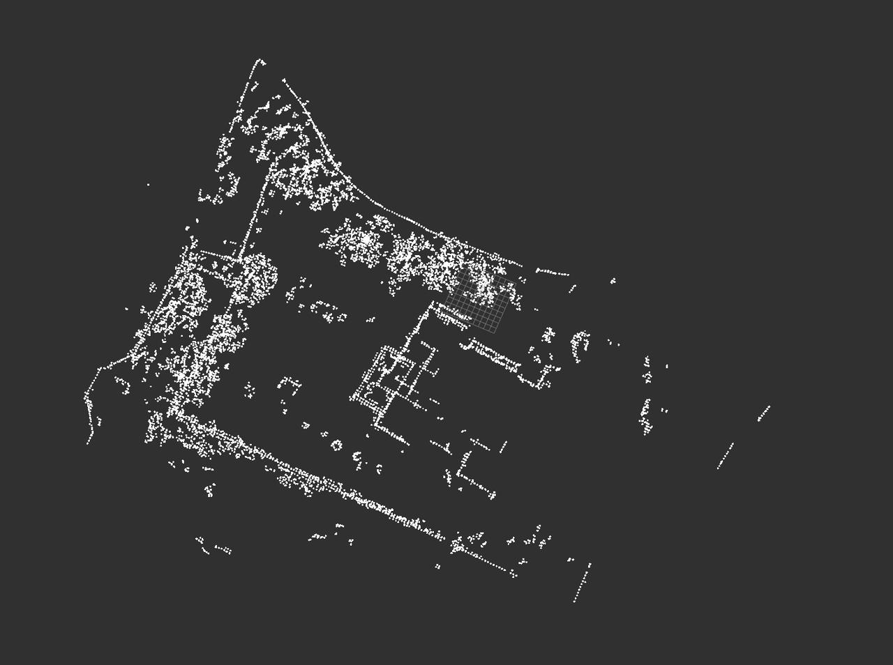
  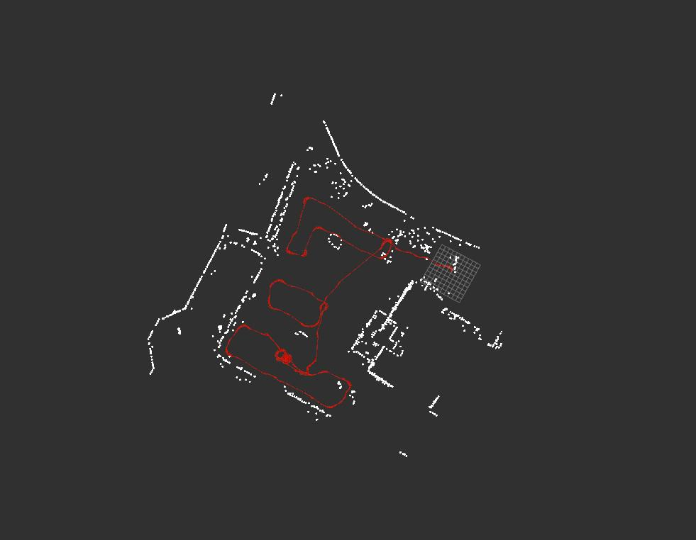
  - 局部重定位：
  （1）3dbbs


对于在初始位姿附近进行小范围的搜索，耗时还可以，但是大范围搜索（导航set的位姿若差别较大，或者setpose差距大），消耗时间会比较长，对于局部重定位来说，不划算；

（2）随机候选位姿

带有随机性，成功率太低

（3）候选位姿


在初始位姿附近生成多个候选位姿，一一匹配，上面截图的耗时是比较暴力的写法，得分，优化方向都没有匹配；

优化方向：

**(1) 生成候选位姿之后，使用icp计算一次得分（只遍历地图第一层的特征，加快速度，得到一个最好的匹配再细化），然后再进行进一步的匹配？？步长？？**

遮挡：


重定位：


扰动：


匹配度：


耗时：


扰动：


匹配度：


耗时：


扰动：


匹配度：


耗时：


=======================================================

## 2025年11月12日

1. 项目整体进展+未开展功能
  1. gicp待合入：耗时增加过多，待定；
  2. 代码review `@明坤`
    1. **轮速引入**
    2. **小地图定位方案**
    3. **重定位代码review 重构**
    4. 回环代码review最新改动
  3. 定位稳定性提升
    1. 转弯：
      1. **原地；**
      2. 非原地；
    2. **静止稳定性**
    3. nhc约束 vy;vy vz;
  4. 计算性能优化
    1. 耗时优化
    2. 内存
  5. Bug：**mcu；dt; sepose z; 扩展不保存（设计如此）；**
  6. 建图性能提升：
    1. 回环
  7. 交互方案
     [VERSA导航-定位模块交互：建图&定位&重定位](https://roborock.feishu.cn/wiki/AqOGwVOuWimt7ykP2oTcSHpYnag?from=from_copylink)
  8. 成砖；**张勇拆机**
  9. 退化检测
    1. 模块测试；
    2. 调优
    3. 封装；
  10. 国内数据？`@李鹏飞`刘博
2. 在手问题：
  1. lidar器件，bug review **提前看发出来；**
  2. 潜在的bug
    1. 局部重定位+setpose等
    2. setpose用的之前的lidar;
    3. 搬起，取消任务；
    4. Setpose 协方差给的过低；
  3. 卡困判断：范超rtk`@林子越`
  4. 暂停、恢复：`@王亚萌`
  5. 新器件性能：
    1. 360s对比
    2. 360s单发版本对比
    3. jt16 @刘博问下
  6. repaly模式
  7. fov对比验证
    1. 9m

- `@应竞帆`回环优先级不高 3000平方
  1. 出包 ，异常？配网挂了；
  2. 回环遗留功能优化：map存写，
    1. 已修改，未pick:
      1. ~~间距调整；~~
      2. ~~后面可以在最后修改一下，keyframe的pose；检测到ok的才拼接submap；这样会更省时间；回环后，统一修改submap pose，**内部keyframe pose按相对修改**即可；~~
    2. 导航轨迹地图；我们轨迹会变化；**边界**同步
    3. submp **key 10-30**
      1. 需要，50 **体素地图**更多；2/3d点连线?密集度；
      2. 间隔小+更多序号为一个submap
    4. **耗时问题**，飞书已经同步过了，翻记录，提交了应该分支打印了时间
    5. coredump;小场景
  3. bug
  4. **上机验证,回环`@应竞帆**`
    1. 机器验证，看耗时等
    2. 板端验证
    3. jekins ；
    4. **数据交换系统**
- `@王亚萌`
  1. 轮速引入
    1. [~~ 轮速事宜代码review](https://roborock.feishu.cn/wiki/C27Ew1XdCiGxFlkS54OcuSaJnqh?from=from_copylink)~~
    2. ~~**基础解算功能：**~~
      1. ~~后轴可用~~
      2. *前轴跟随**范超**进展...*
    3. **轮速功能性+引入定位优化：**
      1. **替代imu的+预测: 退化，降本；**
        1. 暂停==》搬动=》恢复=>重定位
      2. ~~仿真：**slam轨迹做对比**；~~
        1. ~~动态，重置起点；**o \span（待合入）~~**
      3. **静止检测**，slam稳定引入;开始阶段
        1. slam，静止pose，刷地图；mid 360
        2. Bool flag :
          1. **匹配，Update; bias递推很远？**
          2. **有预测，  Update 原来的pose;（ba bg）**
            mages/多线组会-img_v3_02ro_8745cc51-8b49-4417-8989-1d1965ec2deg-1.jpg)
      4. ~~原地转圈（**待定**，bug）~~
        1. ~~齿数，**激光抖动；~~**
        2. ~~滑下来~~
      5. 卡困检测   **范超**
      6. 暂停（恢复）；**空闲模式；**
        1. Lidar时间同步丢了  ++**500ms左右**++；pause--空闲 30s关闭；
        2. Pause **遥控走直接重定位？**
        3. 搬动；
        4. Pause **侧滑？**
        5. 报错暂停，用按暂停，空闲：在桩上，任务切换；
      7. 桩上下--  ++**z roll pitch:(0,)++`@刘博**`
        1. 桩倾斜程度接受程度？静止不了 6度；`@杨倩`桩倾斜
        2. 斜坡重定位？
        3. Check pose；===》切换局部 重定位不好，反馈继续全局
          `@王亚萌` ** （Done）后面有些零碎的续集**
          证
- 建图及基础功能：`@李鹏飞`
  1. ~~新日志；**（Done）~~**
  2. **性能优化：（Doing）**
    1. 内核占用, 问题跟踪和优化；
      1. 优化内核占用+耗时
      2. 均值和峰值统计：现状
      3. 后期，看下放羊报告`@刘博`
        1. 点数较多？6000；
    2. 低优先级，内存评估
  3. 自研器件相关的仿真验证**（Doing）**
    1. 斜坡验证：
      1. mid360金字塔数据
      2. 禾赛：后续数据，姚远需要改动+（刘博）机器要调整5度`@刘博`，进入测试排队
        1. 105斜坡；
        2. **导轨**
  4. **园林**；**刘博采集国内数据；**
    1. 两组，
  5. 低优先级，
    1. ~~** roll pitch**~~~~事宜~~
- 定位`@闫冬`
  1. 其他：
    1. 丢帧逻辑，定位模式；
    2. 显示在地图外面；
  2. **小地图方案**：地图缺失和环境变换`@闫冬`
    1. 兼容地图扩展，可能有切换问题？有逻辑风险；
      1. 还有些问题Doing
    2. **localmap和地图匹配**，修正diff; 稳定性更好，环境变换鲁棒性更好；
      1. ~~关键帧；diffpose ；~~
        1. ~~keyframe在地图中间，可能匹配度比较差的情况；如果缓存较少；~~
      2. ~~进展： 环境变化下加入小地图里程计 定位更准确且更平滑； localmap和地图匹配的效果还要在测试~~
      3. ~~挖了空的区域，验证ok;~~
        关键帧；cirubuffer ;
         最近几个帧；
  3. 导轨评估定位稳定性+精度：
  4. 高翔新版本3dslam
    1. Aaa-faslio;
    2. g2o
    3. **2.5d 地图**
  5. 匹配度和dts ;python 脚本；时间异常`@邸志玲`
  6. 360降成本 4 /1
- 重定位`@周士伟`
  1. 重定位优化**（ Done ）**
  2. 地图上传**（ Done ）**
  3. 遮挡问题  [割草机lidar脏污follow视觉-遮挡检测](https://roborock.feishu.cn/wiki/K6JUweIzAiDez2kw5W1cqZe3nae?from=from_copylink)，**第二阶段待定，刘博通知11底**
    1. 下雨场景，看flag
    2. 这个 error code ;
    3. 避障lidar需求；`@郭文举`
  4. 其他低优先级
    1. slam日志整理（待定）
    2. 代码重构和耗时提升（长期跟踪）
    3. **imu颠簸重力变化大问题，初始化风险**
      1. acc计算较差；
      2. 一部分优化
    4. 面阵雷达: 120 tpm
      1. ~~数据，厂商会采集；~~
      2. 其他开源数据
  5. roll pitch角度
    1. Roll pitch直接用ap这个效果怎么样，slam改进？
      roll pitch 约束slam]([https://roborock.feishu.cn/docx/CzLId70SCoQNkuxmwQcc1H2gnCf](https://roborock.feishu.cn/docx/CzLId70SCoQNkuxmwQcc1H2gnCf))
      `@欧阳宁`imu 角度；1-2度； 扫地机
  6. 重定位最后，单帧匹配
    Bbs  ===》结果在起点；
     **acc累计**的Pose的误差，补偿到终点；
     **改为用最近几个Keyframe验证；**
     **Keyi  posei ===>   I**
     **Key i-1    pose i-1       ===>       posei ^（-1）pose i-1**
  - replay 模式适配，
  - 投影2d
  局部重定位：
  （1）3dbbs


对于在初始位姿附近进行小范围的搜索，耗时还可以，但是大范围搜索（导航set的位姿若差别较大，或者setpose差距大），消耗时间会比较长，对于局部重定位来说，不划算；

（2）随机候选位姿

带有随机性，成功率太低

（3）候选位姿


在初始位姿附近生成多个候选位姿，一一匹配，上面截图的耗时是比较暴力的写法，得分，优化方向都没有匹配；

优化方向：

**(1) 生成候选位姿之后，使用icp计算一次得分（只遍历地图第一层的特征，加快速度，得到一个最好的匹配再细化），然后再进行进一步的匹配？？步长？？**

=======================================================


## 2025年10月29日

1. 项目整体进展+未开展功能
  1. gicp待合入：耗时增加过多，待定；
  2. 代码review `@明坤`
    1. **轮速引入**
    2. **小地图定位方案**
    3. **重定位代码review 重构**
    4. 回环代码review最新改动
    5. 定位稳定性提升`@王亚萌` `@闫冬` `@明坤`
      1. 转弯：
        1. **原地；**
        2. 非原地；
      2. **静止稳定性**
      3. nhc约束 vy;vy vz;
    6. 计算性能优化
      1. 耗时优化
      2. 内存
    7. Bug：**mcu；dt; sepose z; 扩展不保存（设计如此）；**
    8. 建图性能提升：
      1. 回环
  3. 方案
     [VERSA导航-定位模块交互：建图&定位&重定位](https://roborock.feishu.cn/wiki/AqOGwVOuWimt7ykP2oTcSHpYnag?from=from_copylink)
  4. 成砖；**张勇拆机**
  5. 退化检测
    1. 模块测试；
    2. 调优
    3. 封装；
  6. 国内数据？`@李鹏飞`刘博
  7. 局部重定位+setpose等
  8. setpose用的之前的lidar;
  9. 搬起取消任务；
  10. 暂停 空闲
  11. Setpose 协方差给的过低；
    .

- `@应竞帆`回环优先级不高 3000平方、++120度E1R; parselidar (+-60) 定性的看下是否需要调整++
  1. 出包 ，异常？配网挂了；
    1. Coredump;
    2. ls
  2. 回环遗留功能优化：
    1. 已修改，未pick:
      1. ~~间距调整；~~
      2. ~~后面可以在最后修改一下，keyframe的pose；检测到ok的才拼接submap；这样会更省时间；回环后，统一修改submap pose，**内部keyframe pose按相对修改**即可；~~
    2. 导航轨迹地图；我们轨迹会变化；**边界**同步
    3. submp **key 10-30**
      1. 需要，50 ，**体素地图**更多；2/3d点连线?密集度；
      2. 间隔小+更多序号为一个submap
    4. **耗时问题**，飞书已经同步过了，翻记录，提交了应该分支打印了时间
    5. coredump;小场景
  3. **上机验证,回环`@应竞帆**`
    1. 机器验证，看耗时等
    2. 板端验证
    3. jekins ；
    4. **数据交换系统**
- `@王亚萌`
  1. **Plugin.config  false: ++Socket 发信号++；机器自测**；足够自测；补齐plugin代码
  2. 轮速引入
    1. [~~ 轮速事宜代码review](https://roborock.feishu.cn/wiki/C27Ew1XdCiGxFlkS54OcuSaJnqh?from=from_copylink)~~
    2. **基础解算功能：**
      1. ~~后轴可用~~
      2. *前轴跟随**范超**进展...*
    3. **轮速功能性+定位优化：**
      1. ~~**首要，数据（60+105）`@李鹏飞` `@王亚萌**`~~
      2. **替代imu的+预测: 退化，降本；**
        1. 暂停==》搬动=》恢复=>重定位
      3. ~~仿真：**slam轨迹做对比**；~~
        1. ~~动态，重置起点；**o \span（待合入）~~**
        2. 5度
      4. **静止检测**，slam稳定引入;开始阶段
        1. ~~齿数，**激光抖动；~~**
        2. ~~滑下来~~
          检测，后续follow郭科**范超**方案，一比一复刻；
          （恢复）；===？**空闲模式；**
    4. mmt模式`@王亚萌` ** **
      1. ++需要导航，开始发4，结束就发**save_map 打印日志**，但是实际不会去加载；++
        1. ++~~暂定保存，分析bug用；~~++
        2. ~~**导航，卡在10.30联调（等待）下午；**~~
        3. 一徽在线没有验证，今天定位
      2. 优化调整（不用花较多时间）
    5. 协助北京验证
- 建图及基础功能：`@李鹏飞`
  1. 新日志；
    **表格`@李鹏飞`，310**;
    1. ~~日志兼容问题， 新旧格式 器件型号_251010~~
    2. ~~不能兼容禾赛，需要改动代码；待启动~~
  2. **性能优化：**
    1. 内核占用, 问题跟踪和优化；
      1. 优化内核占用+耗时
      2. 均值和峰值统计：现状
      3. 后期，看下放羊报告`@刘博`
    2. 低优先级，内存评估
  3. 仿真验证-自研器件
    1. 斜坡验证：
      1. mid360金字塔数据
      2. 禾赛：后续数据，姚远需要改动+（刘博）机器要调整5度`@刘博`，进入测试排队
        1. 105斜坡；
        2. **导轨**
  4. ~~**外参确认合入了；角度标定过；**~~
  5. 园林；**刘博采集国内数据；**
  6. 低优先级，
    1. ~~** roll pitch**~~~~事宜~~
- 定位`@闫冬`
  1. 其他：
    1. 丢帧逻辑，定位模式；
    2. 显示在地图外面；
  2. **小地图方案**：地图缺失和环境变换`@闫冬`
    1. 兼容地图扩展，可能有切换问题？有逻辑风险；
      1. 还有些问题Doing
    2. **localmap和地图匹配**，修正diff; 稳定性更好，环境变换鲁棒性更好；
      1. ~~关键帧；diffpose ；~~
        1. ~~keyframe在地图中间，可能匹配度比较差的情况；如果缓存较少；~~
      2. ~~进展： 环境变化下加入小地图里程计 定位更准确且更平滑； localmap和地图匹配的效果还要在测试~~
      3. ~~挖了空的区域，验证ok;~~
        关键帧；cirubuffer ;
         最近几个帧；
  3. 导轨评估定位稳定性+精度：
    1. 极限机器； [激光 (flollow rtk)定位精度对比测试](https://roborock.feishu.cn/wiki/U2eKwFiBZiCSy0krwnScAUz2nBd)
    2. 评估脚本，或方法
      1. ~~线和圆拟合脚本完成，点到线和圆的误差统计完成 待会看一下~~
      2. `@高原`激光1 sigma  `@明坤`
        ](images/多线组会-image-33.png)
    3. 弓字形：jt16采集数据，两个激光对比；
      1. 场地，路标，长方形；
      2. mid360/禾赛，定位跳变，直行，y改变；x超0.8m/s;(超阈值，数量)弓字形：
        1. 场地，路标，长方形；
        2. mid360/禾赛，定位跳变，直行，y改变；x超0.8m/s;(超阈值，数量)
- 重定位`@周士伟`
  1. 重定位优化：
    1. ++~~重定位，动态分辨率（小场景问题）；~~++
    2. ++~~地面点优化~~++
    3. ~~点位确认  ~~
      1. ~~成功率报告；~~
        ~ 重定位点位图~~]([https://roborock.feishu.cn/wiki/MbEOw7fE0iETHXkLIdFc1ejrng5](https://roborock.feishu.cn/wiki/MbEOw7fE0iETHXkLIdFc1ejrng5))
        ~~真成功假成功、播报；~~
  2. 地图上传
    1. ~~**黄亮遗留一点问题；待解决；**~~
    2. 软件宏；
  3. 遮挡问题  [割草机lidar脏污follow视觉-遮挡检测](https://roborock.feishu.cn/wiki/K6JUweIzAiDez2kw5W1cqZe3nae?from=from_copylink)，**第二阶段待定，刘博通知**
    1. 下雨场景，看flag
    2. 这个 error code ;
  4. 其他低优先级
    1. slam日志整理（待定）
    2. 代码重构和耗时提升（长期跟踪）
    3. **imu颠簸重力变化大问题，初始化风险**
      1. acc计算较差；
      2. 一部分优化
    4. 面阵雷达: 120 tpm
      1. ~~数据，厂商会采集；~~
      2. 其他开源数据
  5. roll pitch角度
    1. Roll pitch直接用ap这个效果怎么样，slam改进？
      roll pitch 约束slam]([https://roborock.feishu.cn/docx/CzLId70SCoQNkuxmwQcc1H2gnCf](https://roborock.feishu.cn/docx/CzLId70SCoQNkuxmwQcc1H2gnCf))
      `@欧阳宁`imu 角度；1-2度； 扫地机
  6. ~~重定位计算中，数据丢掉~~
  7. 重定位最后，单帧匹配
    Bbs  ===》结果在起点；
     **acc累计**的Pose的误差，补偿到终点；
     **改为用最近几个Keyframe验证；**
     **Keyi  posei ===>   I**
     **Key i-1    pose i-1       ===>       posei ^（-1）pose i-1**
  8. replay 模式适配，

=======================================================

## 2025年10月23日

1. 项目整体进展+未开展功能
  1. gicp待合入：耗时增加过多，待定；
  2. 代码review `@明坤`
    1. **轮速引入；**
    2. **小地图定位方案**
    3. **重定位代码review**
    4. 回环代码review最新改动；
    5. 遮挡检测
  3. 方案
     [VERSA导航-定位模块交互：建图&定位&重定位](https://roborock.feishu.cn/wiki/AqOGwVOuWimt7ykP2oTcSHpYnag?from=from_copylink)
  4. roll pitch角度 `@李鹏飞`
    1. 模块测试；
    2. 调优
    3. 封装；

- `@应竞帆`回环优先级不高 3000平方、++120度E1R; parselidar (+-60) 定性的看下是否需要调整++
  - 回环遗留功能优化：
    1. 已修改，未pick:
      1. ~~间距调整；~~
      2. ~~后面可以在最后修改一下，keyframe的pose；检测到ok的才拼接submap；这样会更省时间；回环后，统一修改submap pose，**内部keyframe pose按相对修改**即可；~~
    2. 导航轨迹地图；我们轨迹会变化；**边界**同步
    3. submp **key 10-30**
      1. 需要，50 ，**体素地图**更多；2/3d点连线?密集度；
      2. 间隔小+更多序号为一个submap
    4. **耗时问题**，飞书已经同步过了，翻记录，提交了应该分支打印了时间
    5. coredump;小场景
  - **上机验证,回环`@应竞帆`**
    1. 机器验证，看耗时等
    2. 板端验证
    3. jekins ；**数据交换系统**
  - --> debug版本 ;
- `@王亚萌`
  1. **Plugin.config  false: ++Socket 发信号++；机器自测**；足够自测；补齐plugin代码
  2. 轮速引入
    1. [~~ 轮速事宜代码review](https://roborock.feishu.cn/wiki/C27Ew1XdCiGxFlkS54OcuSaJnqh?from=from_copylink)~~
    2. **基础解算功能：**
      1. ~~**现有，问题总结，后续问题总结**~~
      2. ~~后轴可用；~~
      3. 前轴跟随**范超**进展...
    3. **轮速功能性+定位优化：**
      1. **首要，数据（60+105）`@李鹏飞` `@王亚萌`**
      2. **替代imu的+预测: 退化，降本**
      3. 仿真：**slam轨迹做对比**；
        1. 动态，重置起点；o \span（待合入）
      4. **静止检测**，slam稳定引入;开始阶段
        1. slam，静止pose，刷地图；mid 360
      5. 打滑检测，后续follow郭科方案，一比一复刻；
    4. mmt模式`@王亚萌` ** **
      1. ++需要导航，开始发4，结束就发save_map，但是实际不会去加载；++
        1. ++暂定保存，分析bug用；++
        2. **导航，卡在10.30联调（等待）**
      2. 优化调整（不用花较多时间）
    5. 协助北京验证
- 建图及基础功能：`@李鹏飞`
  1. ~~日志格式修改，跑下建图效果；**等待姚远这几天和驱动合入；~~**
    1. 日志兼容问题， 新旧格式
  2. 性能优化：
    1. 内核占用, 问题跟踪和优化；
      1. 优化内核占用+耗时
      2. 均值和峰值统计：现状
      3. 后期，看下放羊报告`@刘博`
    2. 低优先级，内存评估
  3. 仿真验证-自研器件
    1. 斜坡验证：
      1. mid360金字塔数据
      2. 禾赛：后续数据，姚远需要改动+（刘博）机器要调整5度，进入测试排队
        1. 105斜坡；
        2. 导轨；
  4. 低优先级，
    1. ** roll pitch**事宜
    2. 不能兼容禾赛，需要改动代码；待启动
- 定位`@闫冬`
  1. 其他：
    1. 丢帧逻辑，定位模式；
    2. 显示在地图外面；
  2. **小地图**方案：地图缺失和环境变换`@闫冬`
    1. **localmap和地图匹配**，修正diff; 稳定性更好，环境变换鲁棒性更好；
      1. 关键帧；diffpose ；
        1. 对diff pose 做加权滤波处理 结果更平滑稳定
          ](images/多线组会-image-30.png)
          ](images/多线组会-image-29.png)
    2. 轮速轨迹参考
  3. ~~Check pose   测试通过待合入~~
  4. 导轨评估定位稳定性+精度：
    1. 极限机器； [激光 (flollow rtk)定位精度对比测试](https://roborock.feishu.cn/wiki/U2eKwFiBZiCSy0krwnScAUz2nBd)
    2. 评估脚本，或方法
      1. 线和圆拟合脚本完成，点到线和圆的误差统计完成 待会看一下
    3. 弓字形：
      1. 场地，路标，长方形；
      2. mid360/禾赛，定位跳变，直行，y改变；x超0.8m/s;(超阈值，数量)弓字形：
        1. 场地，路标，长方形；
        2. mid360/禾赛，定位跳变，直行，y改变；x超0.8m/s;(超阈值，数量)
  1. **ack**事情:合入了吗？
    - 数据缓存较多，指令需要大量计算的时候；`@闫冬` `@周士伟`
      - 原子变量；这次联调，或者后，进行验证合入
        - 验证通过待合入

重定位计算中；`@周士伟`

- 重定位`@周士伟`
  1. 重定位优化：
    1. 重定位，动态分辨率（小场景问题）；
    2. 点位确认
      1. 成功率报告；
      2. 真成功假成功、播报；
  2. 地图上传
    1. **云端上传，和下载；待确认；**
    2. **黄亮对接**slam地图上传适配，功能描述：
      ~~    slam地图每次load会放一个硬链接到指定目录；~~
       ~~    重定位每次会在这个目录下创建对应时间的文件夹；~~
       ~~     检测到文件存在就打包上传，然后删除这个文件夹下面的文件，避免二次上传，且保证数据和日志相关；~~
  3. 遮挡问题  [割草机lidar脏污follow视觉-遮挡检测](https://roborock.feishu.cn/wiki/K6JUweIzAiDez2kw5W1cqZe3nae?from=from_copylink)
  4. 下雨场景，看flag
  5. 其他低优先级
    1. slam日志整理（待定）
    2. 代码重构和耗时提升（长期跟踪）
    3. **imu颠簸重力变化大问题，初始化风险**
      1. acc计算较差；
      2. 一部分优化
    4. 面阵雷达: 120 tpm
      1. ~~数据，厂商会采集；~~
      2. 其他开源数据

==================================================================

## 2025年9月24日

 [VERSA导航-定位模块交互：建图&定位&重定位](https://roborock.feishu.cn/wiki/AqOGwVOuWimt7ykP2oTcSHpYnag?from=from_copylink)

1. 项目整体进展
  1. gicp待合入
  2. 代码review `@明坤`
    1. 看下轮速引入的代码；
    2. 重定位代码review，框架
    3. **回环代码review最新改动**；
  3. 项目：
    1. 重定位动作；
      1. 原地选择还没有实现动作；
      2. 用两个动作累计的地图？
    2. 地图扩展：`@王亚萌`
      已有地图下，重定位情况，需要重定位完成后，切换**定位模式**（还是原来几个指令），然后发送地图扩展；
       已有地图下，处于**定位模式**（可能是桩出？），然后发送地图扩展模式
    3. 其他位置原有的；
  4. 扩频：蛇形；
    1. 等待融合模块自测
      1. 刷成砖；张勇；
      2. 时间同步；
        ](images/多线组会-image-31.png)
  5. **ack**事情:优先级较高 9/23完成
    - 数据缓存较多，指令需要大量计算的时候；`@闫冬` `@周士伟`
      - 原子变量；
    - ack残留，respose没有下移；`@闫冬`
      - 几个行动项，改动后，发给家保自测；合入；(测试中，主分支测试无法开启割草模式 需要修复后在进行个人分支测试）

代码优化：circlebuffer等限定长度？？？

移除time队列？

- 定位`@闫冬`
  1. 其他：
    1. 丢帧逻辑，定位模式；
    2. 显示在地图外面；
  2. 地图缺失和环境变换：**小地图里程计**+大地图匹配的方案`@闫冬`
    1. **localmap和地图匹配**，修正diff; 稳定性更好，环境变换鲁棒性更好；
      1. 进展： 环境变化下加入小地图里程计 定位更准确且更平滑； localmap和地图匹配的效果还要在测试 [local map + 全局修正定位方案及测试](https://roborock.feishu.cn/wiki/L059wzjdqiHe9GkQuCIc7VX2nTh?from=from_copylink)
    2. 轮速轨迹对-o
    3. [https://gitlab5.roborock.com/RockRobo/mlslam\_core/-/merge\_requests/37](https://gitlab5.roborock.com/RockRobo/mlslam\_core/-/merge\_requests/37)
      1. 记得改一下review
      2. ~~代码跑不起来，~~没有load接口，rebase可能要手动，传下新的；

鹏飞修正


```
                其他指令也要，提mr修复logparse时间不一致；移除除以1000；
```


`@周士伟`

- `@应竞帆`
  - 回环遗留问题：
    1. 回环后整体的**高度**起伏，rool pitch可能不太一样；
    2. 间距调整；
    3. 后面可以在最后修改一下，keyframe的pose；检测到ok的才拼接submap；这样会更省时间；回环后，统一修改submap pose，内部keyframe pose按相对修改即可；
    4. 导航轨迹地图；我们轨迹会变化；**边界**同步
      submp **key 10-30**;
    5. 需要，50 ，**体素地图**更多；2/3d点连线?密集度；
    6. 间隔小+更多序号为一个submap;
    7. **上机验证回环`@应竞帆`**
      1. 机器验证，看耗时等；
      2. 板端验证
    8. 退化检测
      1. 模块测试；
      2. 调优
      3. 封装；
- `@王亚萌`
  1. 轮速引入 [轮速事宜](https://roborock.feishu.cn/wiki/C27Ew1XdCiGxFlkS54OcuSaJnqh?from=from_copylink)
    1. 用下我们的**后轴imu做预测**，看下效果；105场地容易误回环，数据：**0624/livox-105-建图数据;**
    2. 仿真：和slam轨迹做对比；
      1. 动态，重置起点；o \span
      2. imu更换后双目的，**效果更好吗**？？排除一下转换bug?
        1. 等下时间同步后的数据？
        2. Gro z;
    3. 轮速作为预测，嵌入slam系统，看下预测轨迹，效果如何；
      1. 四轮；
      2. 后面考虑follow目前的打滑情况：检测打滑的需求：**失败率；受困打滑；9s**
      3. 退化---
  2. mmt模式`@王亚萌` ** 之前希望月底开发完，看下 一徽 的时间同步即可B2**
    1. 需要导航，开始发4，结束就发savemap，但是实际不会去加载；
      1. 暂定保存，分析bug用；
    2. 专门的设计：地图分辨率确认是否需要调整？
    3. bug **一人一个；**
  3. **地图扩展**+智能补图模式（补图）`@王亚萌`**下个月导航有时间**
     [地图扩展和补图模式](https://roborock.feishu.cn/wiki/K8DywoUlXiLCw1kvsTVcwCnxnBc?from=from_copylink)
  Socket 发信号；
  - 协助北京验证
- 建图及基础功能：`@李鹏飞`
  1. 日志格式修改，跑下建图效果；
    1. bin14;不排序的版本；
      不排序的版本；
       错乱：记录数据，在先数据乱；
    2. 实时数据；代码加上跳变报告error;一代机；Imu帧率；是否报告 增加lidar;`@姚远`
  2. 性能优化：
    1. 内核占用, 问题跟踪和优化；
      1. Test
      2. 内核占用+耗时；200%
      3. 均值和峰值统计；
      4. 放羊报告；
      5. **Perf `@司继播`**
    2. 低优先级，内存评估
  3. **静止初始化**；
    1. ~~静止状态；静止的传感器**初值估计~~**
    2. 效果；
  4. 低优先级，互补滤波开源跑起来： acc ** roll pitch**;
  5. ~~低优先级，不能兼容禾赛，需要改动代码；待启动~~
  6. 板子不能单独跑了；**张勇；**
- 重定位`@周士伟`
  1. **重定位和导航联调**
    1. 遗留问题，缓存较多；
    2. 出桩问题；
  2. 日志系统整理（长期跟踪）
  3. 代码重构和耗时提升（长期跟踪）
  4. 点位确认=成功率报告；
    1. 真成功假成功、播报；
  5. 地图上传
    1. **黄亮对接**slam地图上传适配，功能描述：
      slam地图每次load会放一个硬链接到指定目录；
        重定位每次会在这个目录下创建对应时间的文件夹；
         检测到文件存在就打包上传，然后删除这个文件夹下面的文件，避免二次上传，且保证数据和日志相关；
  6. 面阵雷达:
    1. 数据，厂商会采集；
    2. 其他开源数据
  7. 其他
    1. **imu颠簸重力变化大问题，初始化风险**
    2. bbs移除地面点，没有按高度过滤

---

## 2025年9月17日

1. 项目整体进展
  1. gicp待合入
  2. 看下轮速引入的代码；`@明坤`
  3. 重定位代码review，框架`@明坤`
  4. Coredump;`@周士伟` `@明坤`
  5. 扩频：蛇形；
    1. 等待融合模块自测
      1. 刷成砖；张勇；
      2. 时间同步；
        ](images/多线组会-image-43.png)
  6. 定位稳定性：
    1. 继续看
    2. **竹林**；匹配稳定性
      1. 其余场景`@应竞帆`
      2. 数据断；
      3. **解析不出来---- 采集不可以；**
    3. 熟悉场景；`@应竞帆`
      ack**事情:优先级较高 9/23完成
      [ ] 数据缓存较多，指令需要大量计算的时候；`@闫冬` `@周士伟`
      [ ] ack残留，respose没有下移；`@闫冬`
      - 几个行动项，改动后，发给家保自测；合入；
      扩展+地图补图`@王亚萌`**下个月导航有时间**
      地图扩展和补图模式]([https://roborock.feishu.cn/wiki/K8DywoUlXiLCw1kvsTVcwCnxnBc?from=from_copylink](https://roborock.feishu.cn/wiki/K8DywoUlXiLCw1kvsTVcwCnxnBc?from=from_copylink))
      t模式`@王亚萌` ** 之前希望月底开发完，看下一徽的时间同步即可**
    4. 需要导航，增加Start end逻辑；
    5. 专门的设计：地图分辨率确认是否需要调整？
    6. bug **一人一个；**
      引入`@王亚萌`
    7. 轮速引入
      1. 和slam轨迹做对比；
        1. 动态，重置起点；o \span
        2. imu更换后双目的，**效果更好吗**？？排除一下转换bug?
          1. 等下时间同步后的数据？
          2. Gro z;
      2. 轮速作为预测，嵌入slam系统，看下预测轨迹，效果如何；
        1. 四轮；
        2. 后面考虑：检测打滑的需求：**失败率；受困打滑；9s**
        3. 退化---
    8. 协助北京验证
      odo位姿解算适配使用双目中的imu，时间戳的使用切换mcu时间到AP板时间；
      轮速积分的轨迹与slam的轨迹对齐可视化的功能；
      雷达中的imu新标签log解析；
      oparser模块重构静态检测接口；
      slam/common中的使用数据类型适配轮速积分位姿输出数据类型；
      与确认扩展地图模式相关需求和versa产线MMT验证slam相关功能需求；

- 建图及基础功能：`@李鹏飞`
  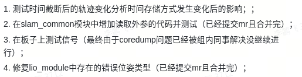
  - 性能优化：
    1. 内核占用,问题跟踪和优化；
      1. Test
      2. 内核占用+耗时；200%
      3. 均值和峰值统计；
      4. 放羊报告；
      5. **perf**
    2. 低优先级，内存评估
  - **静止初始化**；
    1. ~~静止状态；静止的传感器**初值估计~~**
    2. 静止时候的初始化；eskf;
      1. 均值；
      2. 扩展
    3. 转弯抖动(关注)；振动影响：去畸变等？
  - 低优先级，互补滤波开源跑起来： acc ** roll pitch** ;
    1. 效果不理想？导出画图
  - ~~低优先级，不能兼容禾赛，需要改动代码；待启动~~
  - 子越需求：common引入外参；
  - 板子不能单独跑了；**张勇；**
  - 日志格式修改：
    1. logparse对接口；
- 其余：
  1. `@应竞帆`
    1. 代码规范熟悉
    2. 其他更精细的小的任务
    3. 熟悉目前的工程代码 plugin
    4. **熟悉上机，跟**`@王亚萌`学习
- 定位
  1. 定位模式：关注转弯抖动
  2. 其他：
    1. 丢帧逻辑，定位模式；
    2. 显示在地图外面；
- 重定位
  1. 代码合入：plugin
  2. **重定位和导航联调**
    1. 初步完成；
    2. 遗留问题自测；
  3. 105斜坡重定位失败；
    1. 静止初始化
  4. 日志系统整理
  5. 代码重构，往后放一下；
  6. 非紧急任务协助
  7. 其他
    1. **imu颠簸重力变化大问题，初始化风险**
    2. bbs移除地面点，没有按高度过滤
- 定模式初始化建图要改；
- 点位确认=成功率报告；
  1. 真成功假成功、播报；

1. 地图保存；mnt/data/roborock
  1. **浩然，日志传上来；**
  2. 拷出来；导航指令-slam拷贝到**指定位置**-自动上传；
  3. 重定位地图；

===================================================================

## 2025年9月10日

1. 项目整体进展\同步重要信息`@明坤`
  1.  [mid360降频/降角度分辨率仿真](https://roborock.feishu.cn/wiki/Et0Uwjf45igViHkTt8Lc0zL5ntc)
  2. **gicp**没有合入，以后验证；
  3. 定位稳定性：
    1. 退化`@应竞帆`
      1. 检测:  **pca **
      2. 轮速融合
      3. Pcd
      4. 解析Imu;  拷出来，bin12 imu
    2. **地图缺失**和**环境变换：匹配不稳定；**
      1. 激光里程计5000==3ms==25ms;
    3. **竹林**；匹配稳定性
      1. 其余场景`@应竞帆`
      2. 数据断；--
      3. **解析不出来---- 采集不可以；**
  4. 回环模块测试
    - **图优化,模块测试**；
    - keyframemanager有个Bug半径搜索;L2
    - 导航轨迹地图；我们轨迹会变化；----边界同步；`@应竞帆`
    flollow数据`@应竞帆`
    1. 还要继续看
      分辨率和线数验证
    2. 禾赛`@李鹏飞`
      1. ouster看看有必要；
        定位；**定位和**融合联调**，定位和导航联调尾巴；**ack**事情；
    3. 讨论结束后，`@周士伟`
    4. app bug `@周士伟` 测试提Bug

- `@王亚萌`
  1. bin to bag  合入了[https://gitlab5.roborock.com/MSLAM/mlslam\_bin\_to\_bag/-/project\_members](https://gitlab5.roborock.com/MSLAM/mlslam\_bin\_to\_bag/-/project\_members)
    1. ~~识别当前目录，自动读取和导出到当前目录；~~
  2. 协助北京验证
    1. ~~帮忙协助推进机器标定的完成，邮寄完成~~
  3. 轮速引入
    - 日志确认
    - 和slam轨迹做对比；
      - 动态，重置起点；o \span
    - 和imu融合
    - 打滑下鲁棒性的评估；
    - 嵌入我们的slam系统
    - 然后嵌入slam系统；
  - 琐事
  1. 增加一个需求，地图可扩展；`@李哲`需求优先级，产品需求确认；
    1. 删除区域？？？成功率和耗时？待定；
- 回环+后端框架设计
  1. 代码规范

  2. 回环剩余问题沟通`@明坤` `@应竞帆`
    1. ~~导出pcd +文件slam_odom;~~
    2. ~~交互工具，加载看下效果Pcd odom; 效果欠佳，可能keyframe~~
    3. submapmanage :
      1. Add；submapmanage -vectorsubmap>（10）;拼接点云，维护内存；
      2. 引用；
    4. **重构回环类；回环匹配**
    5. **pose 残差(error) .g2o文件；**
    6. **一次改成，逐步优化；--**
    7. **submap---**
  3. ~~**开源算法**？~~
  4. <span style="color: inherit; background-color: rgba(255,246,122,0.8)">其他更精细的小的任务</span>
  5. 熟悉目前的工程代码
  6. **<span style="color: rgb(216,57,49); background-color: inherit">熟悉上机</span>，跟**`@王亚萌`学习
- 建图及基础功能：
  1.  [JT16在105场地不同线数的表现效果](https://roborock.feishu.cn/wiki/HqmlwrhdHioJUekTvtEcZal7nhe)
  2. 性能优化：
    1. 内核占用,问题跟踪和优化；
      1. Test
      2. 内核占用+耗时；200%
      3. 均值和峰值统计；
      4. 放羊报告；
      5. **perf **
    2. 低优先级，内存评估
  3. **静止初始化**；
    1. 静止状态；等待轮速----静止开始的数据替代；
      1. **均值，重力初始化**--验证；
      2. **代码不规范；**
      3. 基于亚萌分支；
      4. bias均值，其他
    2. 静止时候的初始化；eskf;
      1. 均值；
      2. 扩展
    3. 转弯抖动(关注)；振动影响：去畸变等？
  4. 低优先级，互补滤波开源跑起来： acc  roll pitch ;
    1. 效果不理想？导出画图
  5. 低优先级，不能兼容禾赛，需要改动代码；
- 定位
  1. 扩频：蛇形；
    1. 等待融合模块自测
      1. 刷成砖；张勇；
        ](images/多线组会-image-41.png)
  2. 定位稳定性提升：
    1. 轮速
    2. imu
  - 定位模式：小地图里程计+大地图匹配的方案
    1. 和地图间歇匹配；
    2. 调整，单帧，整体？频率？看下效果；
    3. **地图缺失**和**环境变换**
      1. 激光里程计5000==3ms==25ms;
        ](images/多线组会-image-34.png)
    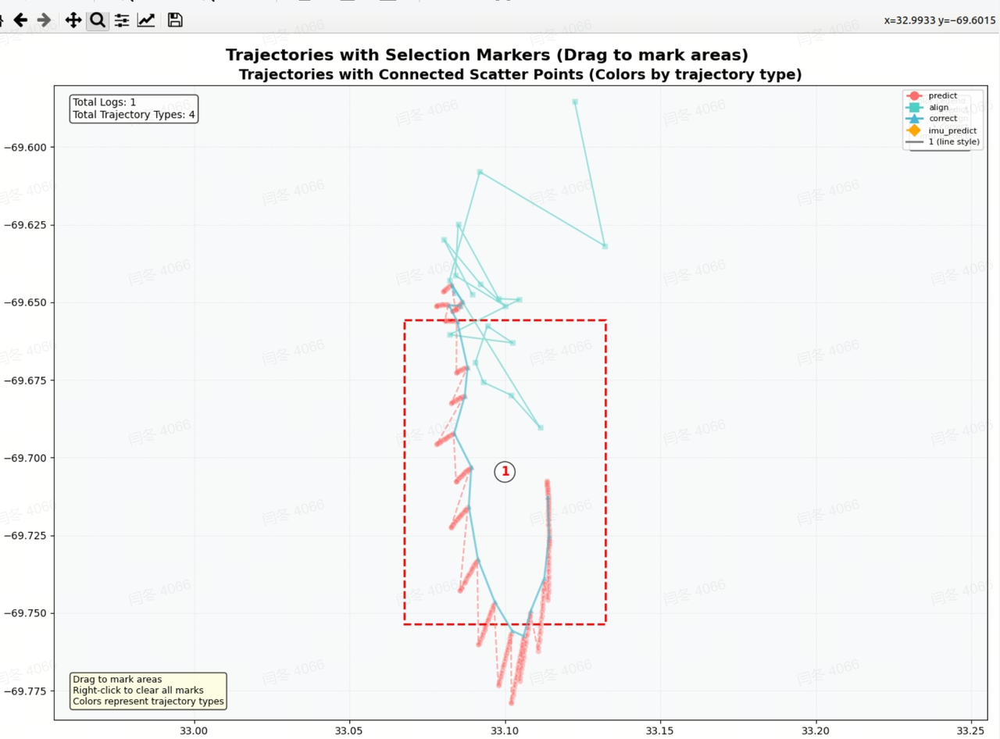
  - 关注转弯抖动
  - 其他：
    1. 丢帧逻辑，定位模式；
    2. 显示在地图外面；
- 重定位
  1. 代码合入：plugin
  2. **重定位和导航联调**工作
    1. 未响应；
    2. ack  + ~~100ms; ~~500ms
  3. 105斜坡重定位失败；
    1. 静止初始化
  4. 非紧急任务协助
  5. follow数据
  6. 其他
    1. **imu颠簸重力变化大问题，初始化风险~~：解决重定位算法包重定位成功率低问题；**~~
    2. bbs移除地面点，没有按高度过滤
- 定模式初始化建图要改；
- 点位确认=成功率报告；
  1. 真成功假成功、播报；

===================================================================

## 2025年9月03日

1. 项目整体进展\同步重要信息`@明坤`
  1. 留有**重定位；定位和融合联调**，定位和导航联调尾巴；
  2.  [mid360降频/降角度分辨率仿真](https://roborock.feishu.cn/wiki/Et0Uwjf45igViHkTt8Lc0zL5ntc)
  3. **gicp**没有合入，以后验证；
  4. ~~看场地~~
  5. ~~出差~~
  6. 定位稳定性：
    1. 退化
      1. 检测:  **pca **
      2. 轮速融合
    2. **地图缺失**和**环境变换**
      1. 激光里程计5000==3ms==25ms;
    3. **竹林**；匹配稳定性
      1. 垂直线特征；
  7. 回环模块测试
    1. 还要继续看
      分辨率和线数验证
    2. 禾赛`@李鹏飞`
      1. 2.67度以下的垂直分辨率可以接受，以上不太行；垂直分辨率低一些更好，在同样线数，fov取决于前两个参数；
    3. 闫冬，看下已有数据：
    4. 已知问题：
      ](images/多线组会-image-50.png)
      ，无法模拟线激光，本身就足够强；
      邮寄；~~

- `@王亚萌`
  1. bin to bag  合入了[https://gitlab5.roborock.com/MSLAM/mlslam\_bin\_to\_bag/-/project\_members](https://gitlab5.roborock.com/MSLAM/mlslam\_bin\_to\_bag/-/project\_members)
    1. ~~识别当前目录，自动读取和导出到当前目录；~~
  2. 协助北京验证
    1. ~~帮忙协助推进机器标定的完成，邮寄完成~~
  3. 轮速引入
    - 日志确认
    - 和slam轨迹做对比；
      - 动态，重置起点；o \span
    - 和imu融合
    - 打滑下鲁棒性的评估；
    - 嵌入我们的slam系统
    - 然后嵌入slam系统；
  - 琐事
  1、编写四驱odo轮速、车速和角速度解算代码，编写完成一版；
  2、编写多组合编码器解算对比选最优的代码， 编写完成一版；
  3、迁移并适配支持解析四驱odo log的logparser代码，手抄在了个人本地分支里了，测试ok；
  4、编写四驱odo时间同步及插值计算代码， 插值预计今晚编写完成一版；
  5、编写odo位姿解算及轨迹ros可视化代码， 编写完成一版；
  6、外出参观熟悉外场3个测试场地。
- 回环+后端框架设计
  1. 代码规范

  2. 回环剩余问题沟通`@明坤` `@应竞帆`
    1. ~~导出pcd +文件slam_odom;~~
    2. ~~交互工具，加载看下效果Pcd odom; 效果欠佳，可能keyframe~~
    3. submapmanage :
      1. Add；submapmanage -vectorsubmap>（10）;拼接点云，维护内存；
      2. 引用；
    4. **重构回环类；回环匹配**
    5. **pose 残差(error) .g2o文件；**
    6. 锁
    7. **一次改成，逐步优化；--**
    8. **submap---**
  3. 跑一下开源算法？
  4. <span style="color: inherit; background-color: rgba(255,246,122,0.8)">其他更精细的小的任务</span>
  5. 熟悉目前的工程代码
  6. **<span style="color: rgb(216,57,49); background-color: inherit">熟悉上机</span>，跟**`@王亚萌`学习
  7. logparse引入bug;
    1. ~~文件夹~~
- 建图及基础功能：
  1.  [JT16在105场地不同线数的表现效果](https://roborock.feishu.cn/wiki/HqmlwrhdHioJUekTvtEcZal7nhe)
  2. ~~Logparse: 新的宏~~
  3. 性能优化：
    1. 内核占用,问题跟踪和优化；
      1. Test
      2. 内核占用+耗时；200%
      3. 均值和峰值统计；
      4. 放养报告；
      5. **perf **
    2. 低优先级，内存评估
  4. **静止初始化**；
    1. 静止状态；等待轮速----静止开始的数据替代；
      1. 均值，重力初始化--
      2. bias均值，其他
    2. 静止时候的初始化；eskf;
      1. 均值；
      2. 扩展
    3. 转弯抖动(关注)；振动影响：去畸变等？
  5. 低优先级，互补滤波开源跑起来： acc  roll pitch ;
    1. 效果不理想？导出画图
  6. ~~仿真柱子；15度4~~
  7. follow数据，
  8. 低优先级，不能兼容禾赛，需要改动代码；
- 定位
  1. 扩频：蛇形；
    1. 等待融合模块自测
  2. 定位稳定性提升：
    1. 轮速
    2. imu
  3. ~~单组数据，多日志调整绘图脚本；~~
    1. ~~**调参**也自动？~~
  4. 定位模式：**激光里程计融合模式**；
    1. 设计一个解耦的独立模块LidarOdom，小地图,匹配
      1. 模块设计
    2. 和地图间歇匹配；
    3. 调整，单帧，整体？频率？看下效果；
    4. **地图缺失**和**环境变换**
      1. 激光里程计5000==3ms==25ms;
  5. 关注转弯抖动
  6. follow:
    1. 退化
  7. 其他：
    1. 丢帧逻辑，定位模式；
    2. 显示在地图外面；
- 重定位
  1. 代码合入：plugin
  2. **重定位和导航联调**工作
    1. 未响应；
  3. 105斜坡重定位失败；
    1. 静止初始化
  4. ~~重定位随机性~~
  5. ~~**cppcheck**~~
  6. 非紧急任务协助
    1. ~~苏州机器跑起来~~
  7. follow数据
  8. 其他
    1. **imu颠簸重力变化大问题，初始化风险~~：解决重定位算法包重定位成功率低问题；**~~
    2. bbs移除地面点，没有按高度过滤
- 定模式初始化建图要改；

===================================================================

## 2025年8月27日

1. 项目整体进展\同步重要信息`@明坤`
  1. 留有重定位，定位和融合联调，定位和导航联调尾巴；
    1. 旋转不足--？风险
    2. 22
  2. 日志解析方法，更新方法；
    1. imu
  3.  [mid360降频/降角度分辨率仿真](https://roborock.feishu.cn/wiki/Et0Uwjf45igViHkTt8Lc0zL5ntc)
  4. gicp没有合入，以后验证；
  5. 看场地
  6. ~~标定车~~
  7. ~~组装、邮寄；~~

- `@王亚萌`
  1. bin to bag  合入了[https://gitlab5.roborock.com/MSLAM/mlslam\_bin\_to\_bag/-/project\_members](https://gitlab5.roborock.com/MSLAM/mlslam\_bin\_to\_bag/-/project\_members)
    1. ~~识别当前目录，自动读取和导出到当前目录；~~
  2. 协助北京验证
    1. ~~帮忙协助推进机器标定的完成，邮寄完成~~
  3. 轮速引入
    - 日志确认
    - 和slam轨迹做对比；
    - 和imu融合
    - 打滑下鲁棒性的评估；
    - 嵌入我们的slam系统
    - 然后嵌入slam系统；
  - 琐事
- 回环+后端框架设计
  1. 代码规范

  2. 回环剩余问题沟通`@明坤` `@应竞帆`
    1. ~~代码梳理;~~
    2. ~~结论；上下分层~~
    3. 导出pcd +文件slam_odom;
    4. 交互工具，加载看下效果Pcd odom;
    5. **回环匹配**
    6. **pose 残差(error) .g2o文件；**
    7. 锁
    8. **一次改成，逐步优化；--**
    9. **submap---**
  3. 跑一下开源算法？
  4. <span style="color: inherit; background-color: rgba(255,246,122,0.8)">其他更精细的小的任务</span>
  5. 熟悉目前的工程代码
  6. **<span style="color: rgb(216,57,49); background-color: inherit">熟悉上机</span>，跟**`@王亚萌`学习
- 建图及基础功能：
  1. ~~Logparse: 新的宏~~
  2. 性能优化：
    1. 内核占用,问题跟踪和优化；
      1. Test
      2. 内核占用+耗时；200%
      3. 均值和峰值统计；
      4. 放养报告；
      5. perf
    2. 低优先级，内存评估
  3. 静止初始化；
    1. 静止状态；等待轮速----静止开始的数据替代；
    2. 静止时候的初始化；eskf;
      1. 均值；
      2. 扩展
    3. 转弯抖动(关注)；振动影响：去畸变等？
  4. 低优先级，互补滤波开源跑起来： acc  roll pitch ;
    1. 效果不理想？导出画图
  5. ~~仿真柱子；15度4~~
  6. follow数据，
  7. 低优先级，不能兼容禾赛，需要改动代码；
- 定位
  1. 扩频：蛇形；
    1. 等待融合模块自测
      1. 轮速
  2. 定位稳定性提升：
    1. 轮速
    2. imu
  3. ~~单组数据，多日志调整绘图脚本；~~
    1. ~~**调参**也自动？~~
  4. 定位模式：激光里程计融合模式；
    1. 设计一个解耦的独立模块LidarOdom，小地图,匹配
    2. 和地图间歇匹配；
    3. 调整，单帧，整体？频率？看下效果；
  5. 关注转弯抖动
  6. follow:
    1. 退化+轮式；
    2. 退化检测；
      1. pca一堆特征；===》pca；
  7. 其他：
    1. 丢帧逻辑，定位模式；
    2. 显示在地图外面；
- 重定位
  1. 代码合入：plugin
  2. **重定位和导航联调**工作
    1. 未响应；
  3. ~~重定位随机性~~
    1. ~~提取特征导致，kdtree随机性；~~
  4. 移除树叶点，slam;  效果不佳，匹配点太少；
  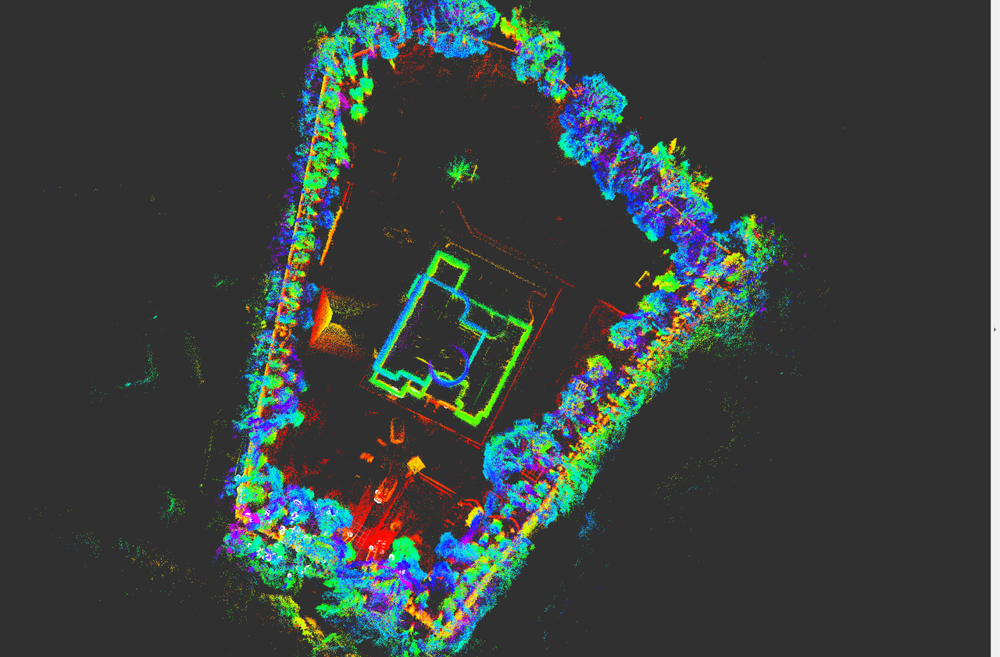
  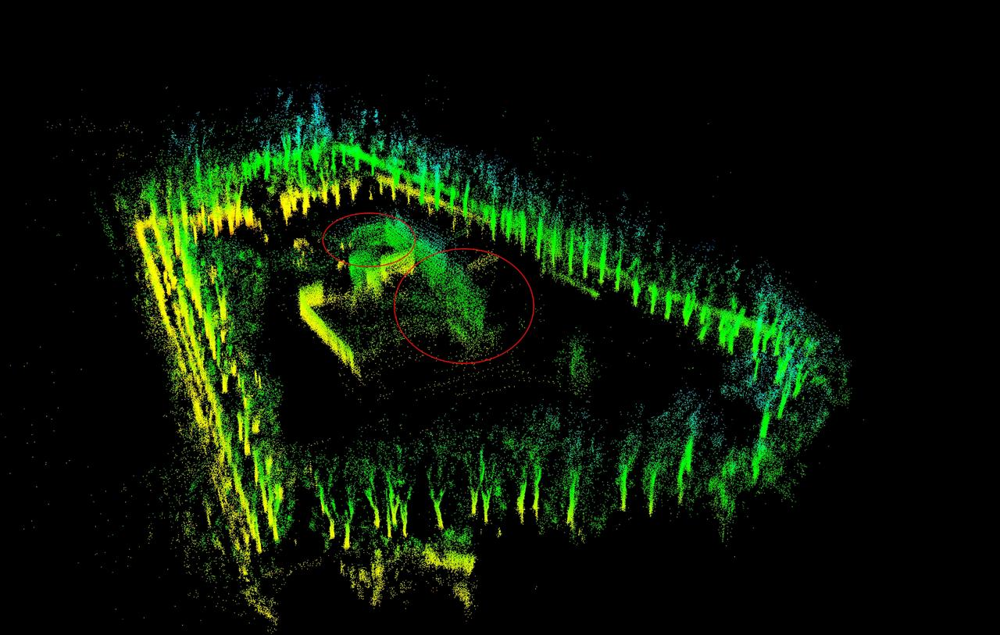
  - 非紧急任务协助
    1. 苏州机器跑起来
  - follow数据
  - 其他
    1. **imu颠簸重力变化大问题，初始化风险~~：解决重定位算法包重定位成功率低问题；**~~
    2. bbs移除地面点，没有按高度过滤
- 定模式初始化建图要改；

===============================end=================================

==================

## 2025年8月20日

1. 项目整体进展同步重要信息`@明坤`
  1. tr4，建图定位代码合入了，留有重定位，定位和融合联调，定位和导航联调尾巴；
    1. Config 路径等build问题
  2. todo任务  [多线TodoList](https://roborock.feishu.cn/wiki/L5rQwWqi8iwo32kJzBVcHmT2nVh?from=from_copylink)，优先级没有周会高
  3. 日志解析方法，更新方法；
  4.  [mid360降频/降采样仿真](https://roborock.feishu.cn/wiki/Et0Uwjf45igViHkTt8Lc0zL5ntc)
  5. gicp没有合入，以后验证；
  6. 代码合入的流程`@李鹏飞` `@周士伟`
    1. 以后合代码不会的，可以问下几位同事；
    2. 第三个不明白的同事，文档记录一下；反馈给我，看看是否有gap
2. 下周苏州
3. `@王亚萌`
  1. bin to bag  合入了[https://gitlab5.roborock.com/MSLAM/mlslam\_bin\_to\_bag/-/project\_members](https://gitlab5.roborock.com/MSLAM/mlslam\_bin\_to\_bag/-/project\_members)
    1. 识别当前目录，自动读取和导出到当前目录；
      mages/多线组会-image-47.png)
      京验证
      入
      x] 日志确认
       ] 和slam轨迹做对比；
       ] 和imu融合
       ] 打滑下鲁棒性的评估；
       ] 嵌入我们的slam系统
       ] 然后嵌入slam系统；
       琐事
4. 回环+后端框架设计
  1. 代码规范；检查文件目录是否有必要分散？、函数书写；函数命名；类命名； 格式化 ；拷贝是否有必要？
  2. 回环剩余问题沟通`@明坤` `@应竞帆`9.1
    1. 代码梳理;
    2. 结论；gicp\bbs/参数
  3. 其他更精细的小的任务
  4. 熟悉目前的工程代码
  5. **熟悉上机，跟**`@王亚萌`学习

- 建图及基础功能：
  - ~~建图代码合入~~
  - 代码目前不能兼容禾赛，需要改动，兼容方法；
    1. 加速度计，中间层没有适配好。这一个目前改参数；其余能否自动兼容？
    2. sensor?====gap;
  - 静止初始化；
    1. 静止状态；等待轮速----静止开始的数据替代；
    2. 静止时候的初始化；eskf  ；bias 000
      1. 均值；
      2. 扩展
    3. 转弯时点云发生抖动(关注)
      1. 振动影响：去畸变等？
        roll pitch ;
  - 内存占用评估定位模式bug？
    1. Socket test
- 定位
  1. 扩频：
    1. ~~和子越、王颖联调，评估合理性；~~
      1. ~~后续融合自测验证ok后，再展开~~
    2. 自己扩频：
      1. 轮速
      2. 转弯时点云发生抖动
  2. ~~机器p1现有成砖，在抢救`@闫冬`之后，机器mk1会有几台，引出线来~~；
  3. ~~定位线程分离；**待合入~~**
  4. 导航与slam交互联调
    1. 原地切定位；====产品经理；
  5. 其他：
    1. 丢帧逻辑，定位模式；
    2. 显示在地图外面；
- 重定位
  1. 代码合入：plugin
  2. **重定位和导航联调**工作
    1. 等两天
  3. 重定位**随机性**
    1. 提取特征导致
    2. 未初始化变量；eigen;
  4. 移除树叶点，slam;
  - 非紧急任务协助
    1. ~~config路径等build问题~~
  - 其他
    1. **imu颠簸重力变化大问题，初始化风险~~：解决重定位算法包重定位成功率低问题；**~~
    2. bbs移除地面点，没有按高度过滤
- 定模式初始化建图要改；

===============================end================================================

目前按b1减少时间，压力给到测试同事；

项目经理，考虑帮忙争取一周。

工程问题现有：**速度、精度，及其稳定性；鲁棒性策略**

1. 机器，初步跑通slam [第一阶段时间安排](https://roborock.feishu.cn/wiki/YIblwU46kiRHuQkCrnTcaGiIn2d?from=from_copylink)
2. 外场360数据 [速腾airy和mid360对比分析](https://roborock.feishu.cn/wiki/GI8uwkO2ViDRm2k9akLcQk00nUc)
3.  [信号流总结](https://roborock.feishu.cn/wiki/LPBEwYvQ3iw8mlk9KaIc0hJdnhc)：
4. 定位优化：`@闫冬`
  1. bug引起的；
  2. 没有更新地图的时候，抖动？过多更新会引起问题；
    1. 验证是否是没有更新导致的？是否有较好策略；

- 回环问题
  1. **地图遮挡较多，激光测距较小**，回环是个问题
  2. **场景可能扩大，回环也是问题；3k**
  3. 多录数据 文档，测试同事；
- 耗时drop?
  1. 运行过长乱序，等足够数据；
  2. 运行超时，处理？建图不用处理，非过分实时性；
- eskf 逻辑和调试
  1. 速度限制？
  2. 静止初始化
  3. ~~方差修正；~~
- pose分:匹配pose和eskf pose
  1. ~~更新地图尝试匹配pose?  效果不好；相当于给很小方差；~~
- TODO list 剩余低优先级： [多线TodoList](https://roborock.feishu.cn/wiki/L5rQwWqi8iwo32kJzBVcHmT2nVh?from=from_copylink)
- `@明坤`已初步处理的问题：
  1. ~~**score问题跟踪**？~~
    1. ~~计算有问题；**改abs累加；~~**
    2. ~~最少迭代次数；~~
    3. ~~阈值先提高0.2~~
  2. ~~**合并log分支；冲突较多**；~~
  3. ~~**add mappathmanager and status.**~~
  4. ~~耗时最后一段，上升：**调参数1.0 2层；且更新地图，改为不固定间隔；~~**
    1. map.update减少数量
      1. 步长控制
    2. 是否有控制方法？
      1. 是不是体素分割的太多了？？
    3. 八叉树直接的最近点搜索方法？
  5. ~~时间潜在乱序问题:~~
    1. ~~**有相当多激光，没有预测问题**；现有问题，log和在线时间不一样，log时间没有同步，标志位清楚bug；~~
- 上机事宜：
  1. 功能性检查：定位；
  2. 代码
    1. 建图基础适配；plugin+controller+slam module
    2. 重定位
      1. core
    3. 定位
  3. 消息类型：缺少定位不好的状态，或者启动重定位的状态；
  4. 禾赛
    1. 适配
      1. bug:时间不定；
    2. 结果； [速腾airy和mid360对比分析](https://roborock.feishu.cn/wiki/GI8uwkO2ViDRm2k9akLcQk00nUc?from=from_copylink)

====================================end===========================================

## 2025年6月25日

1. `@明坤`
  1. **SlamCore 剩余功能开发：**
    1. ~~结论确认比较困难，确认是点云质量问题；~~
    2. ~~速腾airy数据集，我们的Slam 适配调整。积累一些经验，40-90度移除；栅格调大，整体变好，细节变差；~~
    3. ~~开源算法跑不了`@闫冬~~`
      **Plugin Controller 、 ++Module_lio/SlamModule++ /core **`@李鹏飞` SlamCore`@明坤`框架  |||| `@周士伟`等弄好，再研究；交叉编译  ；@all~~
    4. ~~熟悉module fusion 框架, 相关的**Plugin Controller 、 ++Module_lio/SlamModule++ /core设计`@李鹏飞` `@周士伟` `@明坤`**~~
      ：
    5. 板子；**这次回板后我多要几块；按计划MK1要8月份，现在还没开始统计数量。p1/p2?四驱该一下？**
      性；应竟帆；**MK1；**
      ，人动态干扰；拿到数据后，看看情况，是否有移除的机制？
      征；

- 定位验证和优化`@闫冬`**定位的验证方案，评估工作和优化**；*（**Doing**）*
  1. ~~自动化脚本，验证报告；*（**Done**）~~选型相关*
  2. ++120度，240度++ 批量自动脚本；***Doing***
    1. shell脚本在开发中，相关算法代码需要修改
  3. **板子仿真验证**
    1. **熟悉调试流程；**
    2. **分享调试流程**
    3. 写调试cpp；问下子越；
    4. 板子速度slam耗时验证；
  4. ** **算法评价：和faster lio初步对比*（DONE） [算法精度评估对比](https://roborock.feishu.cn/wiki/OvoQwABxni7m7zkdOJJcHuyxn7d?from=from_copylink)  [开源数据集整理](https://roborock.feishu.cn/wiki/IBzGwlIiiitUogkrnsScnaWgnff?from=from_copylink)*
    1. 开源初步
  5. eskf效果评估*（ToDo）*
  6. ~~去除地面点对slam的影响 [地面点对slam影响实验](https://roborock.feishu.cn/wiki/N1gswy2LsiNNLtkaufNcg6Gonmb?from=from_copylink)~~
    1. ~~等待外场数据，进一步评估；产品经理希望平放~~
- 数据流`@李鹏飞`
  1. 适配logparser和中间层联调
    1. 新器件mid60适配和旧的格式改动的维护；
    2. 测试速腾ariy在内外场的效果：适配vslam的改动，看看如何最大程度兼容，最
      1  JT16在内场的运行效果（平装）
      ](images/多线组会-图片-6.png)
        2 速腾Ariy在内场运行效果（平装）
      ](images/多线组会-图片-7.png)
        3 速腾Ariy在内场运行效果（倾斜5度）
      ](images/多线组会-img_v3_02nc_f8b7fedf-81a2-4232-ab31-06972f9451dg.jpg)
      代码整理：
      1. ~~移除多于的savepcd和其他加的多余东西；无需保留中间调试的；~~
      2. 数据流通过fs读取（暂时保持现有处理逻辑，后续添加）；
      3. 移动到，最新代码改动；移除原有的Logparse;改成一个吧：等视觉统一；
      4. yaml写的很乱，读取一个文件即可，最好不破坏原有的格式；
  2. **Plugin Controller 、SlamModule逻辑实现和整理`@李鹏飞`*（Doing**）*
    1. 把controlller 提出来了，欣宇；
    2. 核心逻辑实现*（ToDo）*
      1. **Plugin 外参imu lidar消息收发；咨询子越 ；姚远-》 王浩然 （初步完成plugin）**
      2. **Controller （进行中）**
      3. **ModlueLio/SlamModuleLIO、slamcore**
      4. 板子测试（刘博今天刚申请）;
      5. 传感器数据流;
      6. 其他：一代机基础消息；
      7. ~~**分享 暂定6月26日；最好连带Logparse这块~~；**
- `@应竞帆`
  1. 跑通slam算法；*（**Doing**）*
    1. 熟悉slam代码结构
  2. Lida odom 标定调研
    1. 现有开源方案总结和分享
    2. 开源数据验证；
    3. 轮速没有`@姚远` 复用一代机的格式；王浩然之前做过；
      二代也没有存？
       二代机`@万超杰`ap(lida 我们用时间)和mcu(odom)  时间同步；
  3. 回环`@应竞帆` `@明坤`
    1. submap构建；
    2. 回环
      1. 检测：尝试teaser submap?keyframe?匹配；或bbs
      2. 优化:
- `@周士伟`
  1. ~~jenkins仿真导出到外网`@周士伟`暂时网页配置*（ToDo ，待激活）*~~
    1. ~~适配~~
      1. ~~**等一下李鹏飞，算法框架（*Doing）*~~
  2. 3D重定位方案`@周士伟` `@明坤`
    1. 数据流和控制信号梳理
    2. **数据验证**；*（Doing）*
      1. 脚本批量测试？
    3. **错误解的时候，处理**？*（ToDo）*
      1. 首先，要**提高准确度**；*（ToDo）*
      2. 其次，出错处理：能区分错误了，然后，继续累计：*（ToDo）*
        1. 思路1，**teaser无法给出多解**，在这个框架下：结果评价很重要，如果阈值较低，可以继续跑；理论上3d场景的重复度不高，且足够多的点，可匹配点的百分比阈值可以提高，这个问题可以弱化；
        2. 思路2，**较难mac哪种**；耗时不确定；后续爬坡？
        3. 思路3，借鉴++2d重定位代码？已经移植了一个版本++？
      3. 环境变化，没有考虑；
        Controller    tio 逻辑；
         分享；
  3. ~~2d地图适配`@周士伟`*（ToDo 待定，先暂停，待激活）可能不需要了~~*
    1. ~~熟悉TIO方案（目前一层）*（**Doing**） [2D-mapping模块代码~~](https://roborock.feishu.cn/wiki/UmC0wTpb2iHIm0kIpJOc0p7ancO)*
    2. ~~修改代码，适配*（**Doing**）*~~

**本周工作：**

1.尝试把曲率作为描述子添加到匹配过程中，这部分代码写完，但是效果不明显，甚至还不如原始版本；


2.将BBS3d加入重定位的策略中，当匹配率小于60%时，开启BBS，经测试，匹配成功率有很大提升；


3.重定位自动化测试脚本完成，可以任意设置局部地图数目，输出匹配成功率相关数据；

4.重定位相关代码优化，将头文件内部耦合的源代码部分拆开；

5.重定位框架整理；

1. 其他问题：
  1. **双目：子越，融合 : vio odom ; 融合，定位；**

====================================end===========================================

## 2025年6月18日

1. `@明坤`
  1. **SlamCore 剩余功能开发：**
    1. 结论确认比较困难，确认是点云质量问题；
    2. 速腾airy数据集，我们的Slam 适配调整。积累一些经验，40-90度移除；栅格调大，整体变好，细节变差；
    3. 开源算法跑不了`@闫冬`
      Plugin Controller 、 ++Module_lio/SlamModule++ /core **`@李鹏飞` SlamCore`@明坤`框架  |||| `@周士伟`等弄好，再研究；交叉编译  ；@all
    4. 熟悉module fusion 框架, 相关的**Plugin Controller 、 ++Module_lio/SlamModule++ /core设计`@李鹏飞` `@周士伟` `@明坤`**
      ：
    5. 板子；**这次回板后我多要几块；按计划MK1要8月份，现在还没开始统计数量。p1/p2?四驱该一下？**
      性；应竟帆；**MK1；**
      ，人动态干扰；拿到数据后，看看情况，是否有移除的机制？
      征；

- 定位验证和优化`@闫冬`**定位的验证方案，评估工作和优化**；*（**Doing**）*
  1. ~~自动化脚本，验证报告；*（**Done**）~~选型相关*
  2. ++120度，240度++ 批量自动脚本；***Doing***
    1. shell脚本在开发中，相关算法代码需要修改
  3. **板子仿真验证**
    1. **熟悉调试流程；**
    2. **分享调试流程**
    3. 写调试cpp；问下子越；
    4. 板子速度slam耗时验证；
  4. ** **算法评价：和faster lio初步对比*（DONE） [算法精度评估对比](https://roborock.feishu.cn/wiki/OvoQwABxni7m7zkdOJJcHuyxn7d?from=from_copylink)  [开源数据集整理](https://roborock.feishu.cn/wiki/IBzGwlIiiitUogkrnsScnaWgnff?from=from_copylink)*
    1. 开源初步
  5. eskf效果评估*（ToDo）*
  6. 去除地面点对slam的影响 [地面点对slam影响实验](https://roborock.feishu.cn/wiki/N1gswy2LsiNNLtkaufNcg6Gonmb?from=from_copylink)
    1. 等待外场数据，进一步评估；产品经理希望平放

本周工作：

- 完成Slamtest faster-lio自动化测试脚本
- 基于角度过滤地面点的开源数据分析
  - 从对比结果可以看出，随着地面点数量减少，定位高度、Roll和Pitch角均发生显著变化。当地面点经过过滤（剔除Pitch角小于-13°的数据）后，定位结果趋于稳定。测试数据集中，机器高度为0.7m；按比例换算至0.35m高度时，机器人理论倾斜角度应约为-7°。
- log格式数据转成rosbag格式用于算法回灌
- 对外场采集的速腾数据进行算法回灌，观察效果
  - 查看点云质量差问题
  - 尝试回灌开源算法，运行到400s处左右，算法跑飞
- 数据流`@李鹏飞`
  1. 适配logparser和中间层联调
    1. 新器件mid60适配和旧的格式改动的维护；
    2. 测试速腾ariy在内外场的效果：适配vslam的改动，看看如何最大程度兼容，最
      1  JT16在内场的运行效果（平装）
      ](images/多线组会-图片-9.png)
        2 速腾Ariy在内场运行效果（平装）
      ](images/多线组会-图片-8.png)
        3 速腾Ariy在内场运行效果（倾斜5度）
      ](images/多线组会-img_v3_02nc_f8b7fedf-81a2-4232-ab31-06972f9451dg-1.jpg)
      代码整理：
      1. ~~移除多于的savepcd和其他加的多余东西；无需保留中间调试的；~~
      2. 数据流通过fs读取（暂时保持现有处理逻辑，后续添加）；
      3. 移动到，最新代码改动；移除原有的Logparse;改成一个吧：等视觉统一；
      4. yaml写的很乱，读取一个文件即可，最好不破坏原有的格式；
  2. **Plugin Controller 、SlamModule逻辑实现和整理`@李鹏飞`*（Doing**）*
    1. 把controlller 提出来了，欣宇；
    2. 核心逻辑实现*（ToDo）*
      1. **Plugin 外参imu lidar消息收发；咨询子越 ；姚远-》 王浩然 （初步完成plugin）**
      2. **Controller （进行中）**
      3. **ModlueLio/SlamModuleLIO、slamcore**
      4. 板子测试（刘博今天刚申请）;
      5. 传感器数据流;
      6. 其他：一代机基础消息；
      7. ~~**分享 暂定6月26日；最好连带Logparse这块~~；**
- `@应竞帆`
  1. 跑通slam算法；*（**Doing**）*
    1. 熟悉slam代码结构
  2. Lida odom 标定调研
    1. 现有开源方案总结和分享
    2. 开源数据验证；
    3. 轮速没有`@姚远` 复用一代机的格式；王浩然之前做过；
      二代也没有存？
       二代机`@万超杰`ap(lida 我们用时间)和mcu(odom)  时间同步；
  3. 回环`@应竞帆` `@明坤`
    1. submap构建；
    2. 回环
      1. 检测：尝试teaser submap?keyframe?匹配；或bbs
      2. 优化:
- `@周士伟`
  1. ~~jenkins仿真导出到外网`@周士伟`暂时网页配置*（ToDo ，待激活）*~~
    1. ~~适配~~
      1. ~~**等一下李鹏飞，算法框架（*Doing）*~~
  2. 3D重定位方案`@周士伟` `@明坤`
    1. 数据流和控制信号梳理
    2. **数据验证**；*（Doing）*
      1. 脚本批量测试？
    3. **错误解的时候，处理**？*（ToDo）*
      1. 首先，要**提高准确度**；*（ToDo）*
      2. 其次，出错处理：能区分错误了，然后，继续累计：*（ToDo）*
        1. 思路1，**teaser无法给出多解**，在这个框架下：结果评价很重要，如果阈值较低，可以继续跑；理论上3d场景的重复度不高，且足够多的点，可匹配点的百分比阈值可以提高，这个问题可以弱化；
        2. 思路2，**较难mac哪种**；耗时不确定；后续爬坡？
        3. 思路3，借鉴++2d重定位代码？已经移植了一个版本++？
      3. 环境变化，没有考虑；
        Controller    tio 逻辑；
         分享；
  3. ~~2d地图适配`@周士伟`*（ToDo 待定，先暂停，待激活）可能不需要了~~*
    1. ~~熟悉TIO方案（目前一层）*（**Doing**） [2D-mapping模块代码~~](https://roborock.feishu.cn/wiki/UmC0wTpb2iHIm0kIpJOc0p7ancO)*
    2. ~~修改代码，适配*（**Doing**）*~~

**本周工作：**

1.尝试把曲率作为描述子添加到匹配过程中，这部分代码写完，但是效果不明显，甚至还不如原始版本；


2.将BBS3d加入重定位的策略中，当匹配率小于60%时，开启BBS，经测试，匹配成功率有很大提升；


3.重定位自动化测试脚本完成，可以任意设置局部地图数目，输出匹配成功率相关数据；

4.重定位相关代码优化，将头文件内部耦合的源代码部分拆开；

5.重定位框架整理；

1. 其他问题：
  1. **双目：子越，融合 : vio odom ; 融合，定位；**

====================================end===========================================

## 2025年6月11日

1. 仿真验证支持：6.23 选
  1. 这周五驱动


- 上机器，初步跑通slam;

1. `@明坤`
  1. **SlamCore 剩余功能开发：**
    1. 外参引入：Imu旋转和lidar，lidar和机身？（ToDo）~~初步定为：imu转换到lidar坐标系；lidar系下配准结果，~~**转换机器坐标系获取**；
    2. x86宏
    3. 日志用的较为乱，整理：遗留DEBUG移除
    4. 修了一些bug: ring返回...
    5. 命名空间整理一部分
    6. Slam Bug: **有效激光来的晚,且有很多无效激光，清除以前缓存的Imu;**
    7. **适配vslam的改动**，看看如何最大程度兼容，最小的改动自己；
      1. 头文件冲突:日志系统不兼容；LOG.h 不兼容
    8. ** 状态机 **
    9. **   地图存储和管理**
    10. 初步闭环
  2. 数据采集slam部分要求；105、78、内场  [苏州场地](https://roborock.feishu.cn/wiki/Vs2Fw5Fnmi4rVakd88LcxtsEnGb?from=from_copylink)
     [slam采集需求](https://roborock.feishu.cn/wiki/A1YewlrXVikKI1kbzGSc6guXnfe?from=from_copylink) 定下四驱+贵点的雷达；
     矩阵计算和含义，还是薄弱；
  3. 多线slam框架分享`@明坤``
  4. **Plugin Controller 、 ++Module_lio/SlamModule++ /core `**@李鹏飞` SlamCore`@明坤`框架  |||| `@周士伟`等弄好，再研究；交叉编译  ；@all
  5. 去畸变：
    1. 板子；**目前没有预留，后期帮我们申请；**
    2. 改装机；每一台试制，p1 p2 mk1 要有板子 mk2 b1 b2 b3~~生产~~。。申请一台，方便验证；**没有问题  和感知可复用**
      ，人动态干扰；拿到数据后，看看情况，是否有移除的机制？
      images/多线组会-image-63.png)
      征；

- 定位验证`@闫冬`@**slam、定位的验证方案，评估工作**；*（**Doing**）*
  1. ~~脚本绘图；自动化脚本*（**Done**）选型相关*~~
  2. ~~输出相关验证报告；*（**Done**）选型相关~~*
  3. 验证目前数据集的情况
  4. 120度，240度 批量自动脚本；***Doing***
    1. shell脚本在开发中，相关算法代码需要修改
  5. **板子仿真验证**
    1. **熟悉调试流程；**
    2. **分享调试流程**
    3. 写调试cpp；问下子越；
    4. 板子速度slam耗时验证；
  6. ** **算法评价：和faster lio初步对比*（Done） [算法精度评估对比](https://roborock.feishu.cn/wiki/OvoQwABxni7m7zkdOJJcHuyxn7d?from=from_copylink)  [开源数据集整理](https://roborock.feishu.cn/wiki/IBzGwlIiiitUogkrnsScnaWgnff?from=from_copylink)*
    1. 算法对比结论：
      1. 三种算法均能达到厘米级相对定位精度
      2. 小范围场景下，回环（如Voxel-slam）对定位精度提升有限，甚至可能因优化噪声导致局部建图质量下降
        mages/多线组会-image-64.png)
  SLAMTEST测试遇到的问题：
  由于得分阈值不合适，导致eskf未更新，在高度上进行漂移；
  - eskf效果评估*（ToDo）*
  - 去除地面点对slam的影响 [地面点对slam影响实验](https://roborock.feishu.cn/wiki/N1gswy2LsiNNLtkaufNcg6Gonmb?from=from_copylink)


- 数据流`@李鹏飞`
  1. 适配logparser和中间层联调
    1. 外参跟踪；已经解决；符号移除，矩阵变换；
      时间同步； 大致看着没问题，slam也能跑20s;  硬件时间同步还在搞
      1. 时间相关性；`@李鹏飞`目前看还能跑；100ms的误差是非常大的；
        1分钟数据：现在15分钟以上**
        images/多线组会-内场仿真.jpg)
        整理：
      2. ~~移除多于的savepcd和其他加的多余东西；无需保留中间调试的；~~
      3. 数据流通过fs读取；
      4. 移动到，最新代码改动； 移除原有的Logparse;改成一个吧 ：等视觉统一；
      5. yaml写的很乱，读取一个文件即可，最好不破坏原有的格式；
  2. **Plugin Controller 、SlamModule逻辑实现和整理`@李鹏飞`*（Doing**）*
    1. 把controlller 提出来了，欣宇；
    2. 核心逻辑实现*（ToDo）*
      1. **Plugin 外参imu lidar消息收发；咨询子越 ；姚远-》王浩然**
      2. **Controller**
      3. **ModlueLio/SlamModuleLIO、slamcore**
      4. 板子测试;
      5. 传感器数据流;
      6. 其他：一代机基础消息；
      7. 分享
- `@应竞帆`
  1. 跑通slam算法；*（**Doing**）*
  2. Lida odom 标定调研
    1. 现有开源方案总结和分享
    2. 开源数据验证；
    3. 轮速没有`@姚远` 复用一代机的格式；王浩然之前做过；
      二代也没有存？
       二代机`@万超杰`ap(lida 我们用时间)和mcu(odom)  时间同步；
  3. 回环
    1. submap构建；
    2. 回环
      1. 检测：尝试teaser submap?keyframe?匹配；或bbs
      2. 优化:
- `@周士伟`
  1. jenkins仿真导出到外网`@周士伟`暂时网页配置；（done）
    1. 适配我们这部分slamtest
      1. 适配，**等一下**算法框架*（**Doing**）*
      2. 移除v分支?最终带v分支**（将mslam的log_parse作为一个单独的三方库放入到仿真的代码里，可以编译通过并跑通，前提是mslam的log_parse相关cmakelist配置需要更改，当前已经适配一个版本）**
        开通视觉的外围代码权限，可以带上；
        调试，可以加宏移除掉，避免干扰；
  2. 3D重定位方案`@周士伟`
    1. **方案梳理**：*（**Doing**）*
    2. **数据验证**；*（Doing）*
    3. **错误解的时候，处理**？*（ToDo）*
      1. 首先，要**提高准确度**；*（ToDo）*
      2. 其次，出错处理：能区分错误了，然后，继续累计：*（ToDo）*
        1. 思路1，**teaser无法给出多解**，在这个框架下：结果评价很重要，如果阈值较低，可以继续跑；理论上3d场景的重复度不高，且足够多的点，可匹配点的百分比阈值可以提高，这个问题可以弱化；
        2. 思路2，**较难mac哪种**；耗时不确定；后续爬坡？
        3. 思路3，借鉴++2d重定位代码？已经移植了一个版本++？
      3. 环境变化，没有考虑；
        Controller    tio 逻辑；
         分享；
  3. ~~2d地图适配`@周士伟`*（ToDo 待定，先暂停，待激活）可能不需要了~~*
    1. ~~熟悉TIO方案（目前一层）*（**Doing**） [2D-mapping模块代码~~](https://roborock.feishu.cn/wiki/UmC0wTpb2iHIm0kIpJOc0p7ancO)*
    2. ~~修改代码，适配*（**Doing**）*~~

1. 其他问题：
  1. **双目：子越，融合 : vio odom ; 融合，定位；**

====================================end===========================================

## 2025年6月04日

1. `@明坤`
2. **slam剩余功能开发：**
  1. 外参引入：Imu旋转和lidar，lidar和机身？*（ToDo）初步定为：imu转换到lidar坐标系；lidar系下配准结果，转换机器坐标系；*
  2. *确认外参标定？*
    1. *茹毅超，苏州那边；lidar和机器外参；*
    2. ***imu和lidar，厂家给出：***后期给出检测方案就行；
  3. 状态机
3. **代码迁移：**
  1. *整理补充slam代码和原有TIO框架合并（done）***
    1. 封装仿真类Simulator***（Doing）***
    2. 继续整理....***（Doing）***
      1. 日志用的较为乱，整理
      2. 功能按模块分类文件夹，移入tio可用部分
      3. **命名空间整理**一部分
4. 数据采集slam部分要求：

 [slam采集需求](https://roborock.feishu.cn/wiki/A1YewlrXVikKI1kbzGSc6guXnfe?from=from_copylink)

时间相关性；

- 定位验证`@闫冬`
  - **slam、定位的验证方案，评估工作**；*（**Doing**）*
    1. 方案思考5.23     [建图及定位评估方案](https://roborock.feishu.cn/wiki/RdBDwIPKKiqPz1kCOFscWZ9cnrd?from=from_copylink) *（**Done**）*
    2. 确认要评估的数据：地图质量*（**Done**）*、定位波动性*（**Done**）*，evo轨迹等需要导出的信息；*（**Done**）*
    3. 导出初步比较5.30*（**Done**）*
    4. 脚本绘图；自动化脚本*（**Done**）*
  - 输出相关验证报告；*（ToDo）*
  - 等`@李鹏飞`Log仿真成功；
    1. 学习调试流程；
    2. 写调试cpp；问下子越；
    3. 板子速度slam耗时验证；
  - ** *算法评价：和faster lio初步对比（ToDo） [精度评估](https://roborock.feishu.cn/wiki/OvoQwABxni7m7zkdOJJcHuyxn7d?from=from_copylink)*
  - eskf效果评估*（ToDo）*
  - x86;
- 数据流`@李鹏飞`
  1. ~~数据验证：待定*（ToDo 待定，先暂停，待激活）*~~
    1. ~~确认开源数据集和当前开源算法对垂直FOV、垂直分辨率的容忍程度`@李鹏飞`~~
    2. ~~水平FOV+-60容忍程度...`@李鹏飞`*（ToDo）~~*
  2. 时间同步；方案，机制；
  3. logparser部分`@李鹏飞`
    1. 和中间层对接数据，lidar数据及其解析方法；*（**Done**）*
    2. imu数据中间层 卡了；
      1. imu只是定义格式的问题，问题不大；
    3. 适配logparser:目前已有点云，中间件提供的转换字符串的工程；5.19***Done***
      1. 和少坤版本统一，优先级不高
    4. 适配我们的slamtest框架：替换原有，或增加Logpaser部分； 5.28 （Done）
      mulator流程熟悉，适配logparser
      redump;（solve）
      在仿真中运行slam的效果：
      ](images/多线组会-simulator.jpg)
      ```
      测试需求的文档：场景确认；轨迹确认；起点一致；
      ```
      ） 现在只需要等姚远那边注意保存数据的格式和向量的方向问题，以及大场景测试数据的到来。
      ）优化logparser模块的代码，后续尽可能只维护一套代码
  4. controller plugin 逻辑实现和整理`@李鹏飞`*（**Doing**）*
    1. 把controlller 提出来了，欣宇；
    2. 熟悉一代机逻辑*（Doing）参考Tio逻辑*
    3. 梳理，重点一代机的这部分流程图或代码逻辑*（ToDo）*
    4. 核心逻辑实现*（ToDo）*
- `@应竞帆`
  1. 入职熟悉，跑通slam算法；*（**Doing**）*
  2. Lida odom 标定调研
    1. 现有开源方案总结和分享
    2. 开源数据验证；
    3. 回环submap构建；
    4. 回环检测和优化
- 其他问题：
  1. 框架分享`@明坤``
  2. 轮速：检测退化，切换融合，轮速；
  3. **双目：子越，融合 : vio odom ; 融合，定位；**
  4. 96线作为真值，rtk效果不太好？屏蔽角度
  5. 定位精度：`@杭思羽`和RTK持平 ±2cm3cm以内也能接受
- Plugin controller system; 
- 板子；改装机；每一台试制，p1 p2 mk1 mk2 。。申请一台，方便验证；
- `@周士伟`
  1. jenkins仿真导出到外网`@周士伟`暂时网页配置；（done）
    1. 适配我们这部分slamtest 5.28
      1. 适配，**等一下**算法框架*（**Doing**）*
      2. 移除v?最终带v**（将mslam的log_parse作为一个单独的三方库放入到仿真的代码里，可以编译通过并跑通，前提是mslam的log_parse相关cmakelist配置需要更改，当前已经适配一个版本）**
  2. 3D重定位方案`@周士伟`
    1. **方案设计**：*（**Doing**）*
      1. **描述子提取: 聚类关键点**
        1. 足够多；也不能过于过多；
        2. 重复性强
    2. 描述符 :     (删除描述子的最近点以及扩大描述子生成的最远点，增加全局性，同时将分类之后的栏杆点、建筑物立面点都添加到非地面点集中，经过Teaser之后，内点的数目得到了很大的提升，基本上可以做到特征一对一的匹配；在之前的100*60的地图上，时间消耗在1s左右，但是在与我们产品差不多范围的地图上20*20或30*30的地图上，时间可以减小到100ms左右)
      1. FPFH、link3d最近点方向版本、link3d 法向量版本
        ](images/多线组会-image-65.png)
        ；扇形网格；直方图
        ed
        ](images/多线组会-image-58.png)
      2. 和粗匹配：一对多，多对； kdtree; 暴力方法；
        1. 修改，一对多问题？距离阈值；
    3. 特征点提取
      的特征点提取算法在大平面上的效果比较好，但是在上坡的时候，会出现将坡上的平面点也提取成非平面点的情况，地面的提取方案从栅格高度差对比更换为拟合地面线的方案：
      ](images/多线组会-image-60.png)
      25度的坡面提取情况如下：
      ](images/多线组会-image-61.png)
      ](images/多线组会-image-66.png)
      ](images/多线组会-image-70.png)
      ](images/多线组会-image-67.png)
      ](images/多线组会-image-69.png)
      ](images/多线组会-image-68.png)
      数据集上的结果：
      ](images/多线组会-image-76.png)
      ](images/多线组会-image-74.png)
      的问题，对于平面点来说，因为为了适配坡度，会将地面线的斜率容忍度拉的比较高，这样会把一些非地面点拉到地面点的点集中，为了改善这个问题，可以利用高度突变去解决，将高度突变的点算入到非地面点中（调试中）；还有就是本身地面点对我这套算法本就无用，提取的不干净也没太大的影响。
      生长
      法相
      z
      2d/3d
      后端部分：teaser、mac等基于一致性图的；其他求解器也行
      **数据验证**；*（Doing）*
      错误解的时候，处理？*（ToDo）*
      1. 首先，要**提高准确度**；*（ToDo）*
      2. 其次，出错处理：能区分错误了，然后，继续累计：*（ToDo）*
        1. 思路1，**teaser无法给出多解**，在这个框架下：结果评价很重要，如果阈值较低，可以继续跑；理论上3d场景的重复度不高，且足够多的点，可匹配点的百分比阈值可以提高，这个问题可以弱化；
        2. 思路2，**较难mac哪种**；耗时不确定；后续爬坡？
        3. 思路3，借鉴++2d重定位代码？已经移植了一个版本++？
  3. ~~2d地图适配`@周士伟`*（ToDo 待定，先暂停，待激活）~~*
    1. ~~熟悉TIO方案（目前一层）*（**Doing**） [2D-mapping模块代码~~](https://roborock.feishu.cn/wiki/UmC0wTpb2iHIm0kIpJOc0p7ancO)*
    2. ~~修改代码，适配*（**Doing**）*~~

## 2025年5月28日

1. `@明坤`
2. **slam剩余功能开发：**
  1. 外参引入：Imu旋转和lidar，lidar和机身？*（ToDo）*
  2. *确认外参标定？*
    1. *茹毅超，苏州那边；lidar和机器外参；*
    2. ***imu和lidar，厂家给出：***后期给出检测方案就行；
3. **代码迁移：**
  1. *整理补充slam代码和原有TIO框架合并（done）***
    1. 封装仿真类Simulator***（Doing）***
    2. 继续整理....***（Doing）***
      1. 日志用的较为乱，整理
      2. 功能按模块分类文件夹，移入tio可用部分
      3. **命名空间整理**一部分

重定位：

3dbbs：3m一个格子，500-700ms; 8s翘起来的数据

降维2dbbs;加速hash to vector;0.5m一个格子； 


- 定位验证`@闫冬`
  1. ~~ 跑通96线激光的slam系统，并熟悉slam算法流程；~~*（**Doing**）待激活*
  2. 定位基础方案跑通和调整；*（**done**）5.21   [基于点云地图定位（初版）](https://roborock.feishu.cn/wiki/VbS7wh689iBJF0kaVrdc1K0KnXZ?from=from_copylink)*
  3. **重点：设计slam、定位的验证方案，评估工作**；*（**Doing**）*
    1. 方案思考5.23     [建图及定位评估方案](https://roborock.feishu.cn/wiki/RdBDwIPKKiqPz1kCOFscWZ9cnrd?from=from_copylink)
    2. 确认要评估的数据：地图质量、定位波动性，evo轨迹等需要导出的信息；
    3. 导出初步比较5.30
    4. 脚本绘图；自动化脚本
  4. 输出相关验证报告；*（ToDo）*
  等Log ,板子速度slam;验证；
  - ** *算法评价：和faster lio初步对比（ToDo）*
  - eskf效果评估*（ToDo）*
- 数据流`@李鹏飞`
  1. ~~数据验证：待定*（ToDo 待定，先暂停，待激活）*~~
    1. ~~确认开源数据集和当前开源算法对垂直FOV、垂直分辨率的容忍程度`@李鹏飞`~~
    2. ~~水平FOV+-60容忍程度...`@李鹏飞`*（ToDo）~~*
  2. logparser部分`@李鹏飞`
    1. 和中间层对接数据，lidar数据及其解析方法；*（**Done**）*
    2. imu数据中间层 卡了；
      1. imu只是定义格式的问题，问题不大；
    3. 适配logparser:目前已有点云，中间件提供的转换字符串的工程；5.19***Done***
      1. 和少坤版本统一，优先级不高
    4. 适配我们的slamtest框架：替换原有，或增加Logpaser部分； 5.28
      mulator流程熟悉，适配logparser
      redump;
      ```
      测试需求的文档：场景确认；轨迹确认；起点一致；
      ```
  3. controller plugin 逻辑实现和整理`@李鹏飞`*（**Doing**）*
    1. 把controlller 提出来了，欣宇；
    2. 熟悉一代机逻辑*（Doing）参考Tio逻辑*
    3. 梳理，重点一代机的这部分流程图或代码逻辑*（ToDo）*
    4. 核心逻辑实现*（ToDo）*
- `@应竞帆`
  1. 入职熟悉，跑通slam算法；*（**Doing**）*
    1. ros1不能安装；-----
    2. 调研了voxelmap-slam ；
    3. 四足fastlio gtsam后端；
    4. Std ；旋转平移不变性，是否满足？调研一下；
    5. 定位精度5CM；超过边界半个机身10cm
      1mm 李笑柔
- 其他问题：
  1. 沟通试用期计划`@明坤`5.22晚上
  2. 框架`@明坤``
  3. 轮速：检测退化，切换融合，轮速；
  4. **双目：子越，融合 : vio odom ; 融合，定位；**
  5. 96线作为真值，rtk效果不太好？屏蔽角度
  6. 定位精度：`@杭思羽`和RTK持平 ±2cm3cm以内也能接受
  7. imu和lidar标定
- `@周士伟`
  1. jenkins仿真导出到外网`@周士伟`暂时网页配置；（done）
    1. 适配我们这部分slamtest 5.28
      1. 适配，**等一下**算法框架*（**Doing**）*
      2. 移除v?最终带v
  2. 3D重定位方案`@周士伟`
    1. **方案设计**：*（**Doing**）*
      1. FPFH、link3d最近点方向版本、link3d 法向量版本
        ](images/多线组会-image-71.png)
        ；扇形网格；直方图
        ed
        ](images/多线组会-image-88.png)
      2. 和粗匹配：一对多，多对； kdtree; 暴力方法；
        1. 修改，一对多问题？距离阈值；
          teaser、mac等基于一致性图的；其他求解器也行
          证**；*（Doing）*
          候，处理？*（ToDo）*
      3. 首先，要**提高准确度**；*（ToDo）*
      4. 其次，出错处理：能区分错误了，然后，继续累计：*（ToDo）*
        1. 思路1，**teaser无法给出多解**，在这个框架下：结果评价很重要，如果阈值较低，可以继续跑；理论上3d场景的重复度不高，且足够多的点，可匹配点的百分比阈值可以提高，这个问题可以弱化；
        2. 思路2，**较难mac哪种**；耗时不确定；后续爬坡？
        3. 思路3，借鉴++2d重定位代码？已经移植了一个版本++？
  3. ~~2d地图适配`@周士伟`*（ToDo 待定，先暂停，待激活）~~*
    1. ~~熟悉TIO方案（目前一层）*（**Doing**） [2D-mapping模块代码~~](https://roborock.feishu.cn/wiki/UmC0wTpb2iHIm0kIpJOc0p7ancO)*
    2. ~~修改代码，适配*（**Doing**）*~~

## 2025年5月21日

1. `@明坤`
2. **slam剩余功能开发：**
  1. 外参引入：Imu旋转和lidar，lidar和机身？*（ToDo）*
  2. *确认外参标定？*
    1. *茹毅超，苏州那边；lidar和机器外参；*
    2. ***imu和lidar，厂家给出：***后期给出检测方案就行；
3. **代码迁移：**
  1. *整理补充slam代码和原有TIO框架合并（done）***
    1. 封装仿真类Simulator***（Doing）***
    2. 继续整理....***（Doing）***
      1. 日志用的较为乱，整理
      2. 功能按模块分类文件夹，移入tio可用部分
      3. **命名空间整理**一部分

- 定位验证`@闫冬`
  1. ~~ 跑通96线激光的slam系统，并熟悉slam算法流程；~~*（**Doing**）待激活*
  2. 定位基础方案跑通和调整；*（**Doing**）5.21   [基于点云地图定位（初版）](https://roborock.feishu.cn/wiki/VbS7wh689iBJF0kaVrdc1K0KnXZ?from=from_copylink)*
  3. **重点：设计slam、定位的验证方案，评估工作**；*（**Doing**）*
    1. 方案思考5.23
    2. 确认要评估的数据：地图质量、定位波动性，evo轨迹等需要导出的信息；
    3. 导出初步比较5.30
    4. 脚本绘图；自动化脚本
  4. 输出相关验证报告；*（ToDo）*
  5. ** *算法评价：和faster lio初步对比（ToDo）*
  6. eskf效果评估*（ToDo）*
- 数据流`@李鹏飞`
  1. ~~数据验证：待定*（ToDo 待定，先暂停，待激活）*~~
    1. ~~确认开源数据集和当前开源算法对垂直FOV、垂直分辨率的容忍程度`@李鹏飞`~~
    2. ~~水平FOV+-60容忍程度...`@李鹏飞`*（ToDo）~~*
  2. logparser部分`@李鹏飞`
    1. 和中间层对接数据，lidar数据及其解析方法；*（**D one**）*
    2. imu数据中间层 卡了；
      1. imu只是定义格式的问题，问题不大；
    3. 适配logparser:目前已有点云，中间件提供的转换字符串的工程；5.1 9
      1. 和少坤版本统一，优先级不高
    4. 适配我们的slamtest框架：替换原有，或增加Logpaser部分； 5.28
      mulator流程熟悉，适配logparser
  3. controller plugin 逻辑实现和整理`@李鹏飞`*（**Doing**）*
    1. 熟悉一代机逻辑*（Doing）参考Tio逻辑*
    2. 梳理，重点一代机的这部分流程图或代码逻辑*（ToDo）*
    3. 核心逻辑实现*（ToDo）*
- `@应竞帆`
  1. 入职熟悉，跑通slam算法；*（**Doing**）*
    1. ros1不能安装；-----
    2. 调研了voxelmap-slam ；
    3. 四足fastlio gtsam后端；
    4. Std ；旋转平移不变形是否满足？调研一下；
    5. 1500平方；200m；500m;
    6. 5-10倍;
    7. 定位精度5CM；超过边界半个机身10cm
      1mm 李笑柔
  - 沟通试用期计划`@明坤`5.22晚上
    1. 框架`@明坤`
    2. 轮速：检测退化，切换融合，轮速；
    3. **双目：子越，融合**
    4. 96线作为真值，rtk效果不太好？屏蔽角度
    5. imu和lidar标定
- `@周士伟`
  1. jenkins仿真导出到外网`@周士伟`暂时网页配置；（done）
    1. 适配我们这部分slamtest 5.28
      1. 适配，**等一下**算法框架*（**Doing**）*
  2. 3D重定位方案`@周士伟`
    1. **方案设计**：*（**Doing**）*
      1. **描述子提取: 均匀提取；~~orb等视觉~~;~~iss等激光~~；聚类关键点**
        **手工设计特征方法**（如 PFH、FPFH、SHOT）通常使用直方图形式描述特征，依赖局部或全局统计信息表示点云的几何属性。然而，在 LiDAR 这样的大规模场景中，由于局部结构常常相似（如平面、树干、电线杆等），这种统计特征容易导致错误匹配。
         **全局特征方法**虽然可描述整个点云，但直观上很难实现精确的点到点匹配。
         **基于学习的方法**（如 3DFeatNet、FCGF、D3Feat 等）取得了显著进展，但在效率与泛化能力方面仍有待提升。
        1. **方案：**
          1. 使用簇的方式剔除掉提取的关键点
          2. 可供支援方案验证的版本确认；6s台式机；
          3. 代码迁移到slamtest
        2. **要求：**
          1. 足够多；也不能过于过多；
          2. 重复性强
            mages/多线组会-image-89.png)
            ```
                                                iss+fpfh
            ```
            es/多线组会-image-87.png)
            ```
                                                   dbscan参数敏感


            <span style="color: inherit; background-color: rgba(255,246,122,0.8)">FPFH、link3d最近点方向版本、link3d 法向量版本</span>
            ```
            es/多线组会-image-85.png)
            直方图
            es/多线组会-image-86.png)
      2. 和粗匹配：一对多，多对； kdtree; 暴力方法；
        1. 修改，一对多问题？距离阈值；
      3. 后端部分：teaser、mac等基于一致性图的；其他求解器也行
    2. **多个数据验证**；*（Doing）*
    3. 错误解的时候，处理？*（ToDo）*
      1. 首先，要**提高准确度**；*（ToDo）*
      2. 其次，出错处理：能区分错误了，然后，继续累计：*（ToDo）*
        1. 思路1，**teaser无法给出多解**，在这个框架下：结果评价很重要，如果阈值较低，可以继续跑；理论上3d场景的重复度不高，且足够多的点，可匹配点的百分比阈值可以提高，这个问题可以弱化；
        2. 思路2，**较难mac哪种**；耗时不确定；后续爬坡？
        3. 思路3，借鉴++2d重定位代码？已经移植了一个版本++？
  3. ~~2d地图适配`@周士伟`*（ToDo 待定，先暂停，待激活）~~*
    1. ~~熟悉TIO方案（目前一层）*（**Doing**） [2D-mapping模块代码~~](https://roborock.feishu.cn/wiki/UmC0wTpb2iHIm0kIpJOc0p7ancO)*
    2. ~~修改代码，适配*（**Doing**）*~~

## 2025年5月14日

1. `@明坤`
2. **slam剩余功能开发：**
  1. 外参引入：Imu旋转和lidar，lidar和机身？*（ToDo）*
  2. *确认外参标定？*
    1. *茹毅超，苏州那边；lidar和机器外参；*
    2. ***imu和lidar，厂家给出：***后期给出检测方案就行；
3. **代码迁移：**
  1. *整理补充slam代码和原有TIO框架合并（done）***
    1. 封装仿真类Simulator***（Doing）***
    2. 继续整理....***（Doing）***
      1. 整理incvoxelmap的代码结构；部分代码移动到.cpp
      2. 日志用的较为乱，整理
      3. 功能按模块分类文件夹，移入tio可用部分
      4. 封装cloud类型及其点的类型；
      5. 降采样，用vector排序更快
      6. **命名空间整理**一部分

- `@闫冬`
  1. ~~ 跑通96线激光的slam系统，并熟悉slam算法流程；~~*（**Doing**）待激活*
  2. 定位基础方案跑通和调整；*（**Doing**）5.21*
  3. **重点：设计slam、定位的验证方案，评估工作**；*（**Doing**）*
    1. 方案思考5.23
    2. 确认要评估的数据：地图质量、定位波动性，evo轨迹等需要导出的信息；
    3. 导出初步比较5.30
    4. 脚本绘图；自动化脚本
  4. 输出相关验证报告；*（ToDo）*
  5. ** *算法评价：和faster lio初步对比（ToDo）*
  6. eskf效果评估*（ToDo）*
- `@李鹏飞`
  1. ~~数据验证：待定*（ToDo 待定，先暂停，待激活）*~~
    1. ~~确认开源数据集和当前开源算法对垂直FOV、垂直分辨率的容忍程度`@李鹏飞`~~
    2. ~~水平FOV+-60容忍程度...`@李鹏飞`*（ToDo）~~*
  2. logparser部分`@李鹏飞` `@明坤` `@周士伟`
    1. 尝试写，一代机logparser 模块测试，跑通正确读取日志和输出*（**Doing**）*
    2. 熟悉logparser代码逻辑；*（**Doing**）*
    3. 和中间层对接数据，lidar数据及其解析方法；*（ToDo）*
      1. float只有7 位有效数字，表达1970的时间是不足的；
    4. imu数据中间层 卡了；
  3. controller plugin 逻辑实现和整理`@李鹏飞`*（**Doing**）*
    1. 熟悉一代机逻辑*（Doing）参考Tio逻辑*
    2. 梳理，重点一代机的这部分流程图或代码逻辑*（ToDo）*
    3. 核心逻辑实现*（ToDo）*
- `@周士伟`
  1. jenkins仿真导出到外网`@周士伟`暂时网页配置；（done）
    1. 适配我们这部分
      1. 适配，**等一下**算法框架*（**Doing**）*
  2. 3D重定位方案`@周士伟`
    1. **从算法到数据===>逐步优化和梳理**：*（**Doing**）*
      1. 文档的条理性优化
      2. **描述子提取**
        1. **方案：**
          1. ~~网格均匀描述子，类似2d~~
          2. ~~协方差特征？提取的描述子~~
          3. ~~link3d等？。。其他orb.......fpfh.......~~
          4. 角点更有优势；点的重复性；簇的方式？
          5. 两个水平墙；误匹配验证；
          6. Tio icp反向优化=>改成我们自己的；
        2. **方法：**
          1. 逐步调试的思路
          2. 移除地面后的点的可靠性，和可视化pcd?；
          3. 描述子提取是否均匀和恰当，多数据验证和优化；
      3. 描述符和粗匹配
        1. 修改，一对多问题？距离阈值；
    2. **从数据到算法===>**适配现有多线数据集，分析已知问题；*（Doing）*
      1. 较多的数据验证，倒闭研发改进；
    3. 错误解的时候，处理？*（ToDo）*
      1. 首先，要**提高准确度**，应该有较多的数据验证；倒闭研发改进；*（ToDo）*
      2. 其次，出错的时候有办法确认这个现象：*（ToDo）*
        1. 思路1，**teaser无法给出多解**，在这个框架下：结果评价很重要，如果阈值较低，可以继续跑；理论上3d场景的重复度不高，且足够多的点，可匹配点的百分比阈值可以提高，这个问题可以弱化；
        2. 思路2，**较难mac哪种**；耗时不确定；后续爬坡？
        3. 思路3，借鉴++2d重定位代码？已经移植了一个版本++？
  3. ~~2d地图适配`@周士伟`*（ToDo 待定，先暂停，待激活）~~*
    1. ~~熟悉TIO方案（目前一层）*（**Doing**） [2D-mapping模块代码~~](https://roborock.feishu.cn/wiki/UmC0wTpb2iHIm0kIpJOc0p7ancO)*
    2. ~~修改代码，适配*（**Doing**）*~~

## 2025年4月29日

1. `@明坤`
  slam部分：*（**Doing**）*
2. **Lio部分开发**：
  1. 数据对齐等，适配velodyne(*Done*)
  2. 耗时优化；*（Done）基本7-8ms以内，去畸变后*
    参考fasterlio，增加去畸变；*（Done）目前转弯抖动较大*
    1. livox去畸变，及其验证；***（Done）***
    2. velodyne***（Done）几乎看不见抖动，有质的提升***
      引入：Imu旋转和lidar，lidar和机身？*（ToDo）外参标定？在做的团队？*
3. **代码迁移：**
  1. *整理补充slam代码（Doing）***
    1. 补充config单例类读取；yaml按器件机器拆分***（Done）***
    2. 拆分仿真和算法***（Done）***
    3. 整理仿真部分：封装仿真类Simulator***（Done）***
    4. 继续整理....***（Doing）***
  2. **移入TIO框架***（ToDo）*
4. 适配 evo？和faster lio初步对比*（ToDo）*
5. **eskf效果**评估
6. **定位方案**及其验证

- `@李鹏飞`
  1. ~~数据验证：待定*（ToDo 待定，先暂停，待激活）*~~
    1. ~~确认开源数据集和当前开源算法对垂直FOV、垂直分辨率的容忍程度`@李鹏飞`~~
    2. ~~水平FOV+-60容忍程度...`@李鹏飞`*（ToDo）~~*
  2. logparser部分`@李鹏飞` `@明坤` `@周士伟`
    1. 尝试写，一代机logparser 模块测试，跑通正确读取日志和输出*（**Doing**）*
    2. 熟悉logparser代码逻辑；*（**Doing**）*
    3. 和中间层对接数据，lidar数据解析方法；*（ToDo）*
  3. controller plugin 逻辑实现和整理`@李鹏飞`*（**Doing**）*
    1. 熟悉现有Tio逻辑*（Doing）*
    2. 熟悉一代机逻辑*（Doing）*
    3. 梳理，重点一代机的这部分流程图或代码逻辑*（ToDo）*
    4. 核心逻辑实现*（ToDo）*
- `@周士伟`
  1. jenkins仿真导出到外网`@周士伟`
    1. 熟悉现有方法workspace和感知的导出方法*（Done）*
    2. 适配我们这部分
      1. 适配*（**Doing**）*
      2. 导出文档*（Done）： [mslam-jenkins构建](https://roborock.feishu.cn/wiki/XnouwO3eFiOiYGkKiHIcYK5vnjd)*
  2. 3D重定位方案`@周士伟`*（**Doing**）*
    1. 熟悉原有tio重定位方案： [Tio重定位方案分析](https://roborock.feishu.cn/wiki/HeDIwDdz8iUU6qkZxp2cZWwmnId)*（Done）*
    2. 跑通原有方案*（Done）： [Tio重定位适配Minislam地图格式](https://roborock.feishu.cn/wiki/WxCWw1ZrMi90XJk5sOocYjZtngQ)  [三种特征点提取方式效果对比](https://roborock.feishu.cn/wiki/GUtxwtrrKiXn4HkLXIAcUXT9ntf)*
    3. 适配现有多线数据集，分析已知问题；*（Doing）*
    4. 错误解的时候，处理？
  3. ~~2d地图适配`@周士伟`*（ToDo 待定，先暂停，待激活）~~*
    1. ~~熟悉TIO方案（目前一层）*（**Doing**） [2D-mapping模块代码~~](https://roborock.feishu.cn/wiki/UmC0wTpb2iHIm0kIpJOc0p7ancO)*
    2. ~~修改代码，适配*（**Doing**）*~~

## 2025年5月14日

1. `@明坤`
2. **slam剩余功能开发：**
  1. 外参引入：Imu旋转和lidar，lidar和机身？*（ToDo）*
  2. *确认外参标定？*
    1. *茹毅超，苏州那边；lidar和机器外参；*
    2. ***imu和lidar，厂家给出：***后期给出检测方案就行；
3. **代码迁移：**
  1. *整理补充slam代码和原有TIO框架合并（done）***
    1. 封装仿真类Simulator***（Doing）***
    2. 继续整理....***（Doing）***
      1. 整理incvoxelmap的代码结构；部分代码移动到.cpp
      2. 日志用的较为乱，整理
      3. 功能按模块分类文件夹，移入tio可用部分
      4. 封装cloud类型及其点的类型；
      5. 降采样，用vector排序更快
      6. **命名空间整理**一部分
4. `@闫冬`
  1. ~~ 跑通96线激光的slam系统，并熟悉slam算法流程；~~*（**Doing**）待激活*
  2. 定位基础方案跑通和调整；*（**Doing**）5.21*
  3. **重点：设计slam、定位的验证方案，评估工作**；*（**Doing**）*
    1. 方案思考5.23
    2. 确认要评估的数据：地图质量、定位波动性，evo轨迹等需要导出的信息；
    3. 导出初步比较5.30
    4. 脚本绘图；自动化脚本
  4. 输出相关验证报告；*（ToDo）*
  5. ** *算法评价：和faster lio初步对比（ToDo）*
  6. eskf效果评估*（ToDo）*

- `@李鹏飞`
  1. ~~数据验证：待定*（ToDo 待定，先暂停，待激活）*~~
    1. ~~确认开源数据集和当前开源算法对垂直FOV、垂直分辨率的容忍程度`@李鹏飞`~~
    2. ~~水平FOV+-60容忍程度...`@李鹏飞`*（ToDo）~~*
  2. logparser部分`@李鹏飞` `@明坤` `@周士伟`
    1. 尝试写，一代机logparser 模块测试，跑通正确读取日志和输出*（**Doing**）*
    2. 熟悉logparser代码逻辑；*（**Doing**）*
    3. 和中间层对接数据，lidar数据及其解析方法；*（ToDo）*
      1. float只有7 位有效数字，表达1970的时间是不足的；
    4. imu数据中间层 卡了；
  3. controller plugin 逻辑实现和整理`@李鹏飞`*（**Doing**）*
    1. 熟悉一代机逻辑*（Doing）参考Tio逻辑*
    2. 梳理，重点一代机的这部分流程图或代码逻辑*（ToDo）*
    3. 核心逻辑实现*（ToDo）*
- `@周士伟`
  1. jenkins仿真导出到外网`@周士伟`暂时网页配置；（done）
    1. 适配我们这部分
      1. 适配，**等一下**算法框架*（**Doing**）*
  2. 3D重定位方案`@周士伟`
    1. **从算法到数据===>逐步优化和梳理**：*（**Doing**）*
      1. 文档的条理性优化
      2. **描述子提取**
        1. **方案：**
          1. ~~网格均匀描述子，类似2d~~
          2. ~~协方差特征？提取的描述子~~
          3. ~~link3d等？。。其他orb.......fpfh.......~~
          4. 角点更有优势；点的重复性；簇的方式？
          5. 两个水平墙；误匹配验证；
          6. Tio icp反向优化=>改成我们自己的；
        2. **方法：**
          1. 逐步调试的思路
          2. 移除地面后的点的可靠性，和可视化pcd?；
          3. 描述子提取是否均匀和恰当，多数据验证和优化；
      3. 描述符和粗匹配
        1. 修改，一对多问题？距离阈值；
    2. **从数据到算法===>**适配现有多线数据集，分析已知问题；*（Doing）*
      1. 较多的数据验证，倒闭研发改进；
    3. 错误解的时候，处理？*（ToDo）*
      1. 首先，要**提高准确度**，应该有较多的数据验证；倒闭研发改进；*（ToDo）*
      2. 其次，出错的时候有办法确认这个现象：*（ToDo）*
        1. 思路1，**teaser无法给出多解**，在这个框架下：结果评价很重要，如果阈值较低，可以继续跑；理论上3d场景的重复度不高，且足够多的点，可匹配点的百分比阈值可以提高，这个问题可以弱化；
        2. 思路2，**较难mac哪种**；耗时不确定；后续爬坡？
        3. 思路3，借鉴++2d重定位代码？已经移植了一个版本++？
  3. ~~2d地图适配`@周士伟`*（ToDo 待定，先暂停，待激活）~~*
    1. ~~熟悉TIO方案（目前一层）*（**Doing**） [2D-mapping模块代码~~](https://roborock.feishu.cn/wiki/UmC0wTpb2iHIm0kIpJOc0p7ancO)*
    2. ~~修改代码，适配*（**Doing**）*~~

## 2025年4月29日

1. `@明坤`
  slam部分：*（**Doing**）*
2. **Lio部分开发**：
  1. 数据对齐等，适配velodyne(*Done*)
  2. 耗时优化；*（Done）基本7-8ms以内，去畸变后*
    参考fasterlio，增加去畸变；*（Done）目前转弯抖动较大*
    1. livox去畸变，及其验证；***（Done）***
    2. velodyne***（Done）几乎看不见抖动，有质的提升***
      引入：Imu旋转和lidar，lidar和机身？*（ToDo）外参标定？在做的团队？*
3. **代码迁移：**
  1. *整理补充slam代码（Doing）***
    1. 补充config单例类读取；yaml按器件机器拆分***（Done）***
    2. 拆分仿真和算法***（Done）***
    3. 整理仿真部分：封装仿真类Simulator***（Done）***
    4. 继续整理....***（Doing）***
  2. **移入TIO框架***（ToDo）*
4. 适配 evo？和faster lio初步对比*（ToDo）*
5. **eskf效果**评估
6. **定位方案**及其验证

- `@李鹏飞`
  1. ~~数据验证：待定*（ToDo 待定，先暂停，待激活）*~~
    1. ~~确认开源数据集和当前开源算法对垂直FOV、垂直分辨率的容忍程度`@李鹏飞`~~
    2. ~~水平FOV+-60容忍程度...`@李鹏飞`*（ToDo）~~*
  2. logparser部分`@李鹏飞` `@明坤` `@周士伟`
    1. 尝试写，一代机logparser 模块测试，跑通正确读取日志和输出*（**Doing**）*
    2. 熟悉logparser代码逻辑；*（**Doing**）*
    3. 和中间层对接数据，lidar数据解析方法；*（ToDo）*
  3. controller plugin 逻辑实现和整理`@李鹏飞`*（**Doing**）*
    1. 熟悉现有Tio逻辑*（Doing）*
    2. 熟悉一代机逻辑*（Doing）*
    3. 梳理，重点一代机的这部分流程图或代码逻辑*（ToDo）*
    4. 核心逻辑实现*（ToDo）*
- `@周士伟`
  1. jenkins仿真导出到外网`@周士伟`
    1. 熟悉现有方法workspace和感知的导出方法*（Done）*
    2. 适配我们这部分
      1. 适配*（**Doing**）*
      2. 导出文档*（Done）： [mslam-jenkins构建](https://roborock.feishu.cn/wiki/XnouwO3eFiOiYGkKiHIcYK5vnjd)*
  2. 3D重定位方案`@周士伟`*（**Doing**）*
    1. 熟悉原有tio重定位方案： [Tio重定位方案分析](https://roborock.feishu.cn/wiki/HeDIwDdz8iUU6qkZxp2cZWwmnId)*（Done）*
    2. 跑通原有方案*（Done）： [Tio重定位适配Minislam地图格式](https://roborock.feishu.cn/wiki/WxCWw1ZrMi90XJk5sOocYjZtngQ)  [三种特征点提取方式效果对比](https://roborock.feishu.cn/wiki/GUtxwtrrKiXn4HkLXIAcUXT9ntf)*
    3. 适配现有多线数据集，分析已知问题；*（ Doing ）*
    4. 错误解的时候，处理？
  3. ~~2d地图适配`@周士伟`*（ToDo 待定，先暂停，待激活）~~*
    1. ~~熟悉TIO方案（目前一层）*（**Doing**） [2D-mapping模块代码~~](https://roborock.feishu.cn/wiki/UmC0wTpb2iHIm0kIpJOc0p7ancO)*
    2. ~~修改代码，适配*（**Doing**）*~~

## 2025年4月16日

1. slam部分：*（Done）*
  1. 配准：point to plane*配准*模型*/类gicp配准模型；（Done）*
    Bug: 配准中限制最近点搜索的逻辑；点云意外过滤过多的逻辑；
    slam调通，初步验证；*（Done）*
    ```
    velodyne\_M2DGR  08号数据，100m\*50m；无闭环下,基本无明显累计误差；
    ```
    *整理slam代码（Doing）***
    1. 开新仓库，移入TIO框架*（ToDo）*
      耗时优化；*（Doing）目前耗时不稳定,基本7-8ms，有时候超过15ms(4线程)，有越来越慢的趋势***
      er lio，单线程下，匹配环节耗时26ms
      参考fasterlio，增加去畸变；*（ToDo）目前转弯抖动较大***
      分组
      mid360? 适配 evo？和fasterlio初步对比*（ToDo）*
      验证
2. 数据集：4个（mid360，室外）
  1. 网盘内容待确认
3. 确认开源数据集和当前开源算法对垂直FOV、垂直分辨率的容忍程度`@李鹏飞`
4. 水平FOV+-60容忍程度`@李鹏飞`*（ToDo）*
5. controller plugin 逻辑实现和整理`@李鹏飞`*（ToDo）*
  1. 熟悉现有Tio逻辑
  2. 熟悉一代机逻辑
  3. 梳理这部分流程图或代码逻辑
6. 3D重定位方案`@明坤` `@周士伟`*（**Doing**）*
  1. 熟悉原有tio重定位方案： [Tio重定位方案分析](https://roborock.feishu.cn/wiki/HeDIwDdz8iUU6qkZxp2cZWwmnId)
  2. 跑通原有方案
  3. 适配现有多线数据集，分析已知问题；
7. 2d地图适配`@周士伟`*（ToDo）*
  1. 熟悉TIO方案（目前一层）
  2. 修改代码，适配

