# 展会模式slam改动

## 1. 背景资料：[ 展会场景建议](https://roborock.feishu.cn/wiki/T8ebwaqfciXInWk8Aagcx5renGc?from=from_copylink)

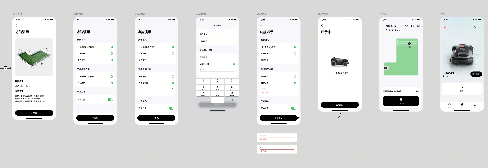

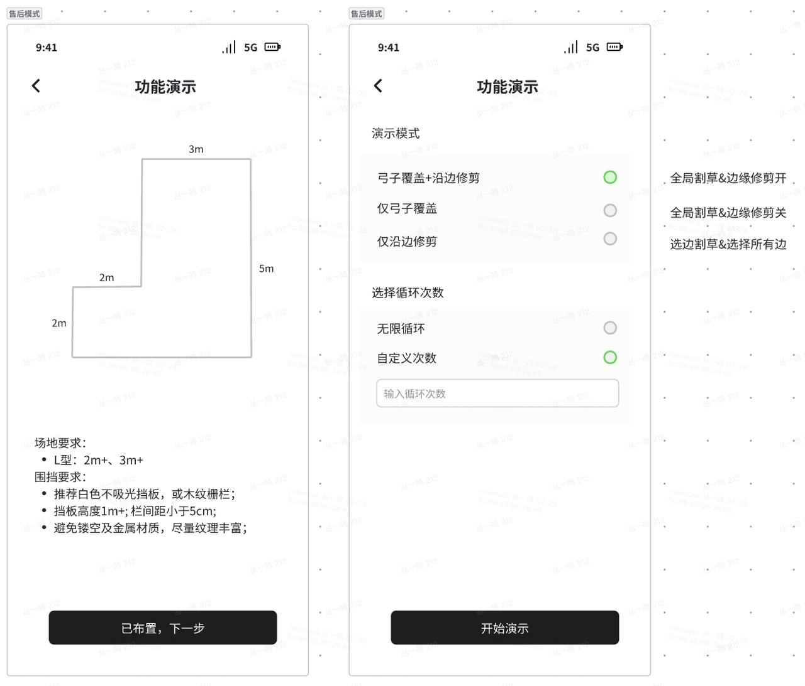

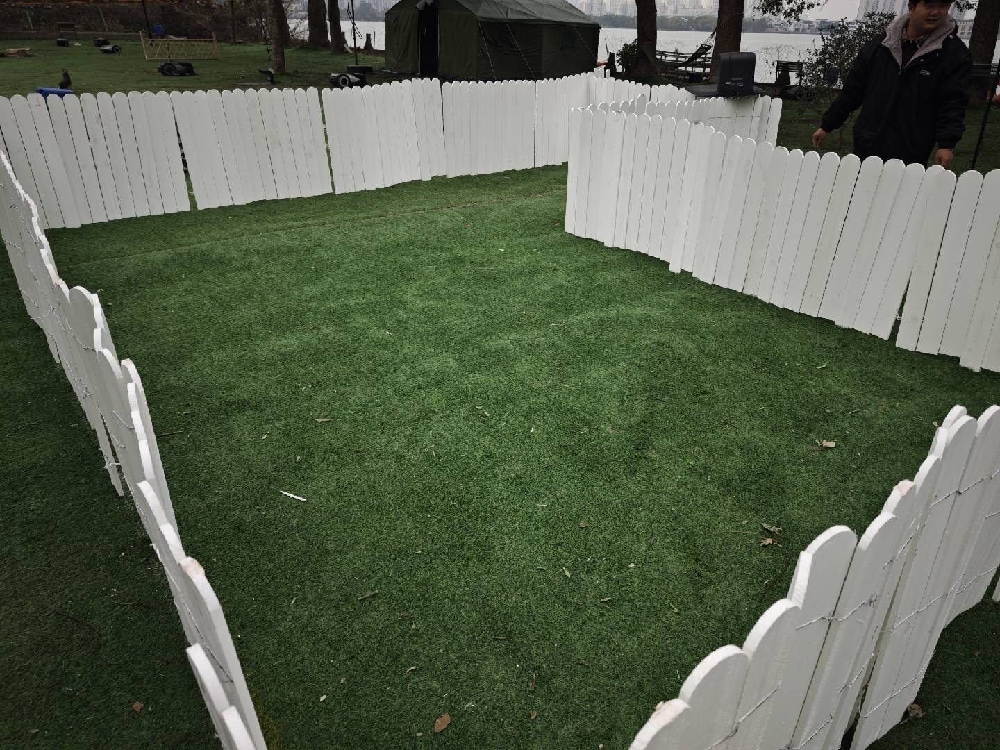

## 2. 方案

1. 接入进入、退出信号；

2. 建图定位模式，

   1. ~~**a方案：过滤0.9-2m的点**；（废弃）~~

   2. **b方案：只用围栏点；（目前推进这个方案）**

3. 重定位模式，**过滤+-5m；且高度大于0.8内的点（地图）**；设计bbs等专门的函数接口处理；

## 3. 建图定位仿真验证&#x20;

1. 建图情况，稳定性；

   1. 方案：&#x20;

      1. z固定在0附近， roll 和 pitch使用板端 并fix住;&#x20;

      2. 近端点需要使用（动态物体会引入产生一定的干扰） ；否则建图容易飞掉； &#x20;

      3. 只使用围栏相关的点云进行建图定位

      4. 体素降采样时需要降低体素大小，保留较多点 以维持匹配的稳定性

      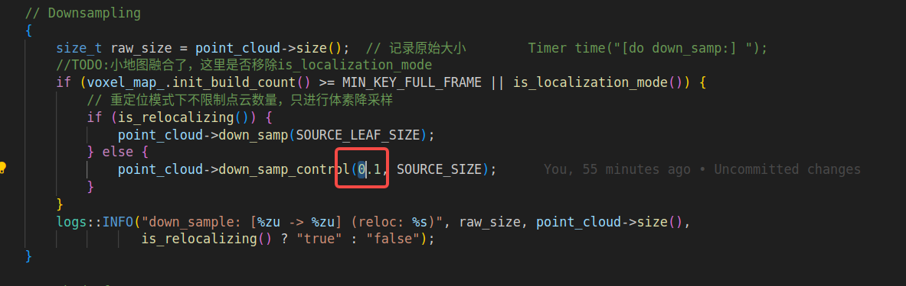

   2. 建图时加入nhc约束

2. 定位情况稳定性；

   1. 根据上述改动，需要实际测试观察效果

| 建图：fix： z roll pitch | 建图正常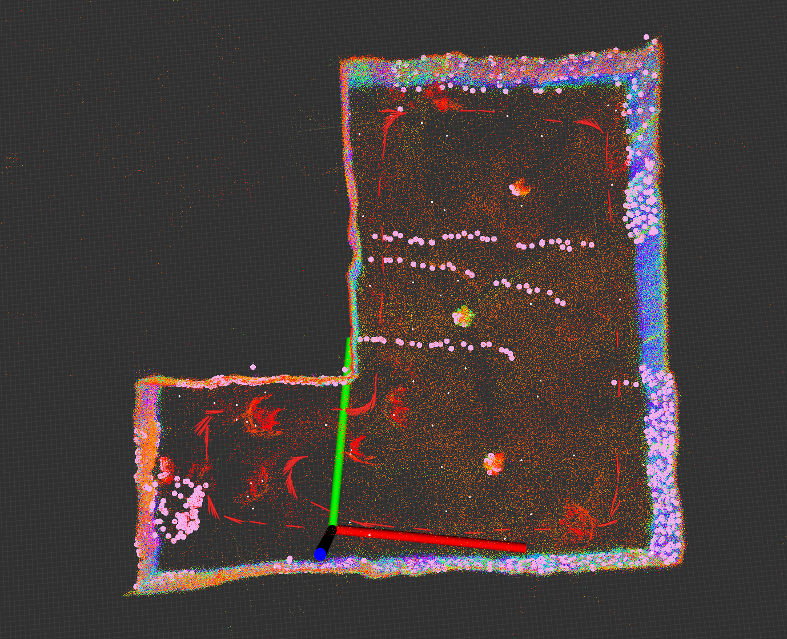   | 白色：使用所有点（包括周围的树）红色：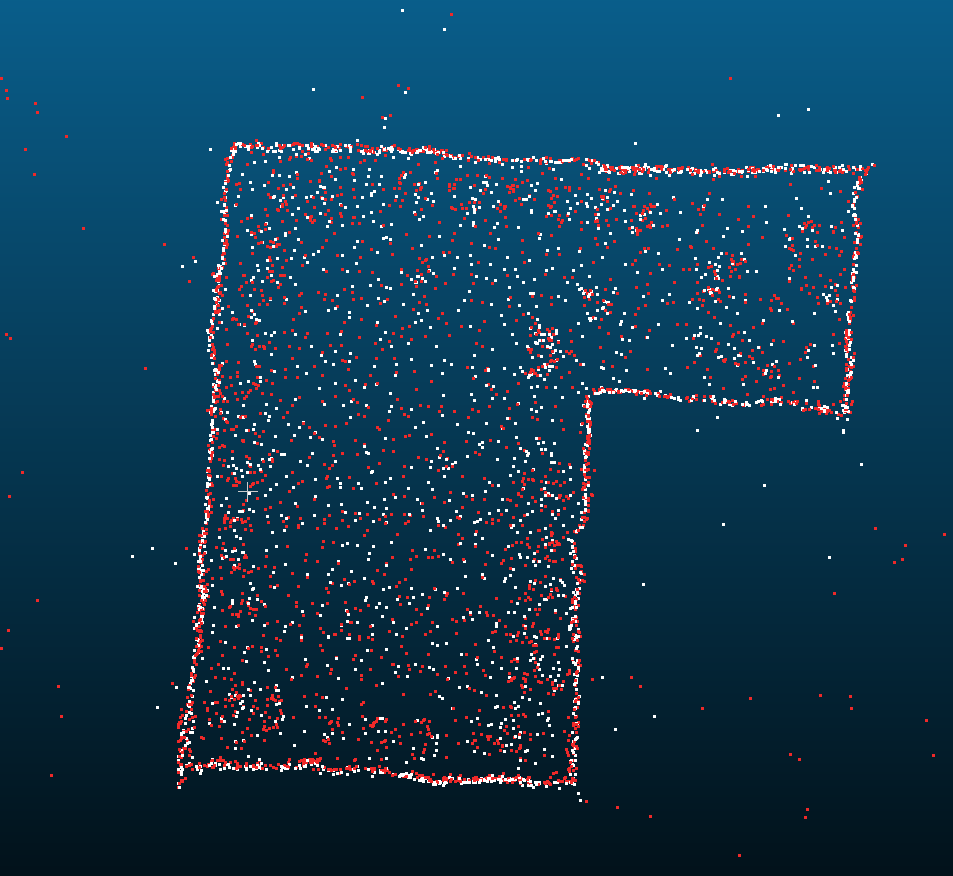 | 轨迹比较正常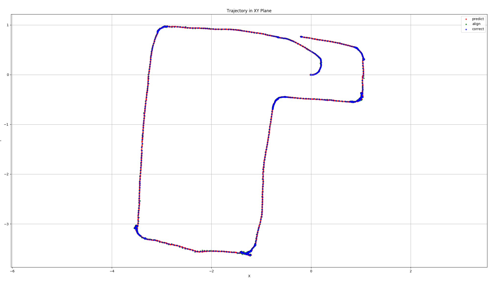 |   |
| -------------------- | ----------------------------------------------------------------------------------------- | ------------------------------------------------------------------------------------------------------ | ----------------------------------------------------------------------------------------- | - |
| 实车测试结果：              |                                                                                           |                                                                                                        |                                                                                           |   |
| 建图：                  | 建图正常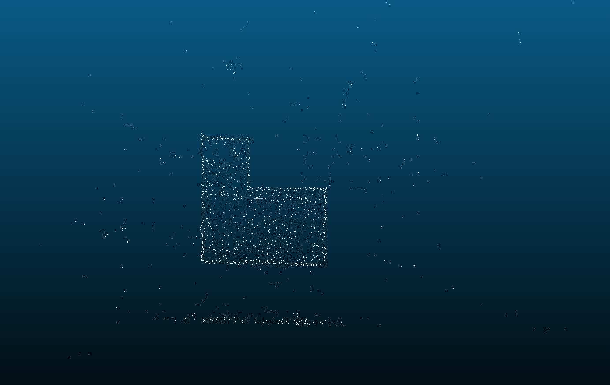   | 轨迹正常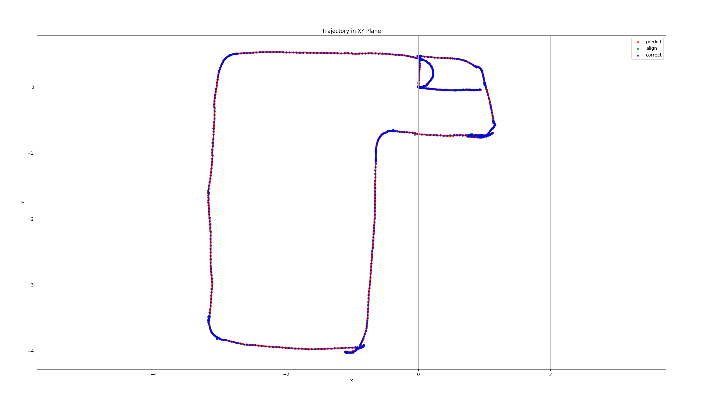                |                                                                                           |   |
| 定位：                  | 割草定位正常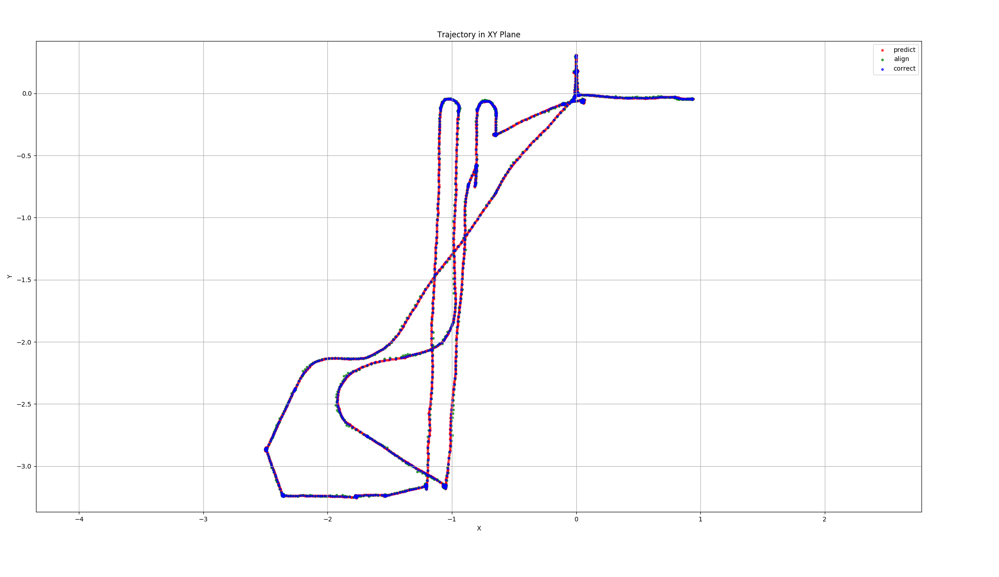 |                                                                                                        |                                                                                           |   |

## 4. 重定位验证&#x20;

1. 重定位地图是否过滤可行；

**重定位保留z值在0.1m-0.8m之间以及距离地图原点在7m之内的点，使用BBS3d进行重定位**

**结论：可行**

* 重定位稳定性

| 3.11 | 测试了无障碍物和有障碍物两种情况，共测试九次，均通过 | 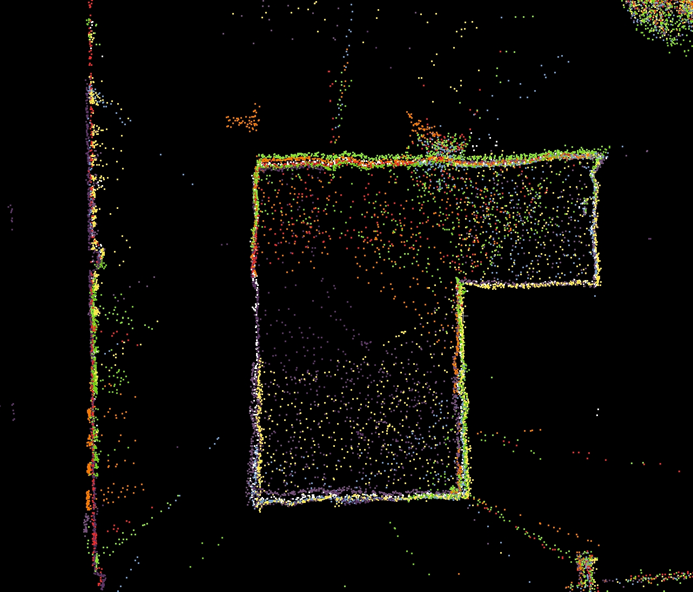 |   |   |
| ---- | -------------------------- | ------------------------------------------------------------------------------------ | - | - |
|      |                            |                                                                                      |   |   |
|      |                            |                                                                                      |   |   |
|      |                            |                                                                                      |   |   |
|      |                            |                                                                                      |   |   |

