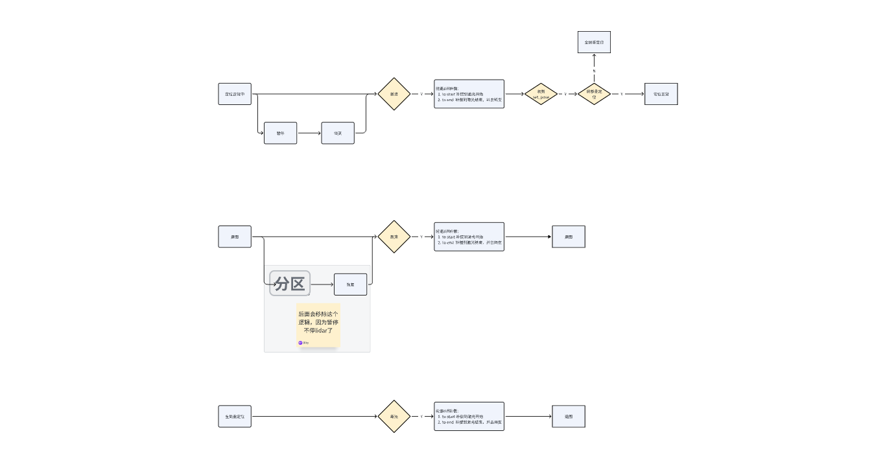

# 暂停恢复-定位优化

##

##

## 1. 参考导航文档：

[ 重定位条件与流程梳理](https://roborock.feishu.cn/wiki/X3A2wYD1sid9QokLm03cMNyBnmd?from=from_copylink)

[ 断流情况和逻辑调整1.21讨论](https://roborock.feishu.cn/wiki/ShOmwIkCLiB6bik4blscmuxcn5e?from=from_copylink)

[ 局部重定位减少对导航静止依赖优化](https://roborock.feishu.cn/wiki/LxeJwCAuViu62tkruz1cDRHBn4d)

## 2. slam模块，目前暂停恢复的支撑：

1. 建图

   1. 500ms以内，依赖轮速;

   2. 超过500ms停下pause，resume，依赖轮速

   3. Set pose（局部重定位） --两边都没开发；

   4. 用户点击Pause resume，依赖轮速

2. 定位

   1. pause，resume，无搬动、移动：轮速递推

   2. pause，resume，推动：局部重定位；导航发起，暂停减速后，位移在40cm?，0.1rad(后面调整1rad)? (60cm, 1rad?)

      1. 如果局部重定位check\_pose失败，slam有失败返回值，导航发起全局重定位

   3. pause，resume，搬动：

      1. 当前：导航发起，全局重定位

      2. ~~后续？：自己识别，发起。搬动中雷达观测良好才有可能有优化机会~~

   4. 断流导致的pause，resume：

      1. 暂停恢复之间没有完全停止：中间不发起局部重定位，此时靠轮速递推兜底，后续停止之后仍然会发起局部重定位

         1. 后续：轮速兜不住的时候（依赖匹配度评估），slam发起局部重定位（参考文档：中期方案[ 局部重定位减少对导航静止依赖优化](https://roborock.feishu.cn/wiki/LxeJwCAuViu62tkruz1cDRHBn4d)），如果不行，slam主动发起重定位

      2. 暂停恢复之间完全停止：导航发起局部重定位

3. 重定位过程中

   1. 断流

      1. 依赖IMU+轮速递推

* ~~局部重定位；导航发起，暂停减速后，位移在40cm?，0.1rad(后面调整1rad)? (60cm, 1rad?)~~

* ~~轮速补偿，主要解决导航没有发起局部重定位的场景， 增加鲁棒性：~~

  1. ~~定位割草期间，包括500ms内断流；~~

  2. ~~割草期间；500-800ms等（无set pose的断流，导航减速中，停止lidar已经恢复，会跑飞几帧）~~

  3. ~~割草期间；兼容大部分暂停恢复期间的少量运动，减速等（无set pose）；~~

  * ~~原地旋转重定位中的断流；~~

## 3. 备注：

1.
