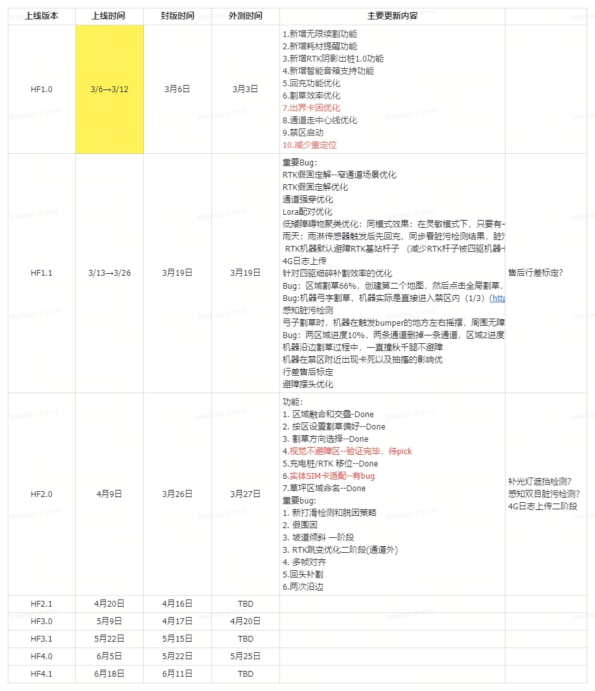

# 激光割草机slam重点合入问题跟踪

## 1. 合入内容

| 合入时间           | 模块      | 问题ID       | 问题描述                                                                                     | 涉及机型                            | 是否影响其他模块       | 需要合入HF             | 合入原因                    | 合入者 |   |
| -------------- | ------- | ---------- | ---------------------------------------------------------------------------------------- | ------------------------------- | -------------- | ------------------ | ----------------------- | --- | - |
| ~~2026-03-30~~ | ~~状态机~~ | ~~493332~~ | ~~建图过程中按下“停止（stop）”，机器人氛围灯未显示为红色慢呼吸~~                                                    | ~~ButchartPro / Monet / Versa~~ | ~~否~~标注耦合的bug  | ~~1.0~~~~0.1~~     | ~~灯效问题修复~~              |     |   |
| 2026-03-31     | 定位      | 482985     | 由于局部地图仅只有一面墙，特征匹配缺乏约束，导致匹反了，由于阈值设置的比较低，直接假成功了，该次提交提高成功阈值，确保进入BBS兜底逻辑，同时引入为BBS提供pose初值的逻辑 | Versa                           | 否              | Versa 1.0 / HF 2.0 | 一面墙情况下，重定位假成功问题修复       | 周士伟 |   |
| 2026-04-01     | 定位      | 492582     | 由于新西兰的场景比较空旷，在发起脏污检测的地方只有低矮的灌木丛，雷达扫到的纵向点比较有限，导致误报脏污                                      | Versa                           | 否              | Versa 1.0 / HF 2.0 | 雷达脏污误报修复                | 周士伟 |   |
| 2026-04-01     | 定位      | 490853     | 导航set pose 会同时给激光和融合；当传入一个错误位姿时，激光模块会做局部重定位，为保持一致 将激光结果传给融合进行重置                          | Versa                           | 否              | Versa 1.0 / HF 2.0 | 修复app位置显示与实际不符问题        | 闫冬  |   |
| 2026-04-08     | 定位      | 483380     | Reloc acc阶段阻塞了odo数据进入，导致重力对齐时间差超出阈值，无法重力对齐                                               | Versa                           | 否              | Versa 1.0 / HF 2.0 | 修复reloc acc阶段导致的odo数据阻塞 | 周士伟 |   |
| 2026-04-09     | 定位      | 481581     | 因为巷子狭窄，3D点云下的重定位找不到特征点，导致重定位失败                                                           | Versa                           | 否              | Versa 1.0 / HF 2.0 | 使用特征点轮廓进行BBS2D          | 周士伟 |   |
|                |         |            |                                                                                          |                                 |                |                    |                         |     |   |
|                |         |            |                                                                                          |                                 |                |                    |                         |     |   |
|                |         |            |                                                                                          |                                 |                |                    |                         |     |   |
|                |         |            |                                                                                          |                                 |                |                    |                         |     |   |
|                |         |            |                                                                                          |                                 |                |                    |                         |     |   |
|                |         |            |                                                                                          |                                 |                |                    |                         |     |   |
|                |         |            |                                                                                          |                                 |                |                    |                         |     |   |

## 2. 时间表参考：

[ 版本排期和管理](https://roborock.feishu.cn/sheets/QUQPskIyGhiuxLtPofNc8yAtnMh?from=from_copylink)

Butchart 等老项目：

