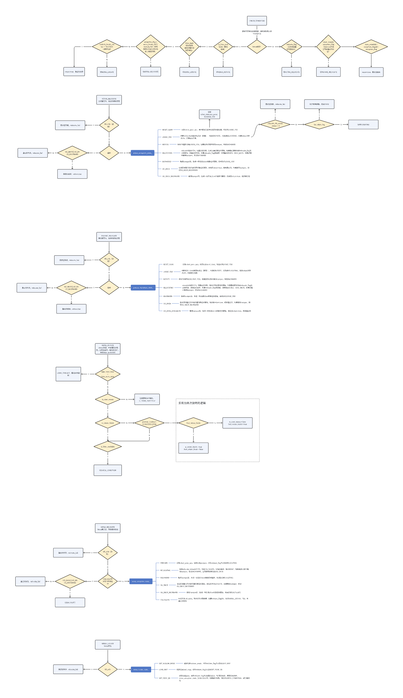
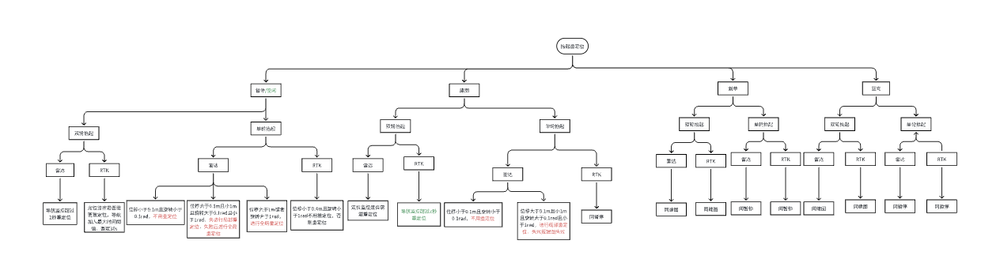

# 重定位条件与流程梳理

# 一、优化目标

1. 减少重定位频率

2. 建图减少失败概率

3. 重定位动作安全检测更加严格

# 二、导航触发状态&#x20;

## 驱动电子抬起触发条件

[ 智能割草机安规策略功能](https://roborock.feishu.cn/wiki/TGtZwXAMDiXGObkM3DTcmXXLnYb?from=from_copylink)

驱动检测抬起机制如下：

两驱：判断前轮受力，若一轮落空，则该侧抬起；判断条件过滤阈值为300ms。

四驱（monet versa）：判断后轮减震器受力，若一侧落空，则该侧抬起，判断条件大于20°  是3000ms ,  大于10°小于20°是1500ms， 小于10° 是300ms。

两驱机器常见抬起场景：一侧前轮压住树枝，则另一侧被检测到抬起；一侧前轮底下有坑，则该侧被检测到抬起；抬起机器前端或者整体搬起，则两侧同时被检测到抬起；

四驱机器常见抬起场景：一侧后轮压住树枝，则另一侧被检测到抬起；一侧后轮底下有坑，则该侧被检测到抬起；机器在斜坡上，一个后轮在上一个在下，则上侧的可能被检测到抬起；抬起机器后端或者整体搬起，则两侧同时被检测到抬起；

综上，若重定位用一侧抬起当触发条件，会产生一些误触发，建议用两侧同时抬起当触发条件。

## 2.1 触发条件

部分重定位条件是和任务无关的，是在任务层外面实时检测的，例如即使空闲状态发生了抬起，等到开始任务后也要进行重定位，目前有如下三个条件：

1. lift连续超过2s；

2. 移动重定位：versa机器：在暂停或雷达关闭状态下，位移超过0.4m，角位移超过0.1弧度；rtk机器：在暂停状态下，位移超过0.4m，角位移超过1弧度；

3. 重启；

## 2.2 割草

在割草任务下，如果当前不是重定位状态，检测到存在以下条件时，会进入重定位状态：

1. lift连续超过2s；

2. 移动重定位：versa机器：在暂停或雷达关闭状态下，位移超过0.4m，角位移超过0.1弧度；rtk机器：在暂停状态下，位移超过0.4m，角位移超过1弧度；

3. 重启；

4. relocate\_flag：定位发过来的需要重定位的flag；

5. versa机器局部重定位失败；

6. 退庄异常结束，此时定位未完成收敛，开始任务后，需要进重定位让定位收敛；

目前，较经常发生重定位的两个条件是lift重定位和versa机器局部重定位失败，搬动一般是测试员主动触发，局部重定位失败是versa机器专属的。

versa局部重定位失败的频率增多，是因为给雷达断流做了个兜底逻辑导致，雷达断流超过500ms机器会暂停，此时定位需求在恢复后给他们发起一次局部重定位，这个局部重定位存在一定失败的概率，失败后会进入重定位；

移动重定位条件，versa机型比rtk机型更容易触发，因为当用户临时想遥控的时候，一般会进遥控模式，versa机器在遥控割草模式下，雷达会停，雷达停了就会记位移，而rtk机器遥控割草时不会记位移。

重定位结束后，会重新进ReachRegion状态，开始断点续割，此时可能发生轻微的漏行或者涂色断点；

## 2.3 回充

在回充任务下，如果当前不是重定位状态，检测到存在以下条件时，会进入重定位状态：

1. lift连续超过2s；

2. 移动重定位：versa机器：在暂停或雷达关闭状态下，位移超过0.4m，角位移超过0.1弧度；rtk机器：在暂停状态下，位移超过0.4m，角位移超过1弧度；

3. 重启；

4. relocate\_flag：定位发过来的需要重定位的flag；

5. versa机器局部重定位失败；

回充任务触发条件除了退庄异常，与割草基本一致，不同的是，重定位结束后，断点回充，对体验没啥影响。

## 2.4 建图

建图任务重定位的条件与上述基本也是一致的：

1. lift连续超过2s；

2. 移动重定位：versa机器：在暂停或雷达关闭状态下，位移超过0.4m，角位移超过0.1弧度；rtk机器：在暂停状态下，位移超过0.4m，角位移超过1弧度；

3. 重启；

4. relocate\_flag：定位发过来的需要重定位的flag；

5. versa机器局部重定位失败；

建图任务与割草和回充不同，建图任务无法实时触发重定位，只可以在非首次建图开始的时候才可以进行重定位，这个阶段是prepare，当prepare结束，用户开始遥控后，再发生重定位标志，就无法再进行重定位了，此时会发生定位异常，可能会导致地图异常，所以一般会报错：

导航负责检测短时间抬起（2s-8s）的上报建图失败，stop后由状态机上报；

重启由插件检测并上报；

定位问题由定位模块检测并上报；

建图阶段因为故障时会存在插件上报的故障信息，无法切遥控模式，所以一般不会发生移动重定位；如果是在故障时，用户主动推动机器较远距离，此时可能发生定位异常，而且没有报错信息，存在建图异常的风险。

雷达机器在建图故障暂停时，一段时间之后，雷达会关闭，此时故障恢复后，定位却没有恢复，也没有报错信息，也存在建图异常的风险；

# 三、重定位流程

重定位状态代码内部状态为ExceptionState，具体代码逻辑如下流程图：

# 四、优化方向

1. 抬起监控采用单轮抬起和位姿变化相结合判断是否需要重定位（减少建图失败概率以及减少恢复工作重定位的可能概率）；（两轮抬起加入imu角/线加速度计判断）

2. 暂停状态下，雷达产品先采用局部重定位（停滞1s）；~~Rtk产品是否可以先用VIO局部重定位？~~（1.rtk抬起重定位检测可以尝试60s，具体联调时确定；2.可以考虑不加位姿判断；3.导航触发抬起后需要给定位发送信号；4.落地状态也需要发送信号给定位）

3. 两驱/四驱需要分开来做，四驱需要加入坡道检测结果

4. 重定位安全检测加入障碍物点云高度判断（增加安全性检测，防跌落）

# 五、导航实现方案设计

## 5.1 针对方向1和方向2

雷达暂停需要区分建图暂停和非建图暂停，建图暂停的监控同建图一致

## 5.2 针对方向3

## 5.3 针对方向4

