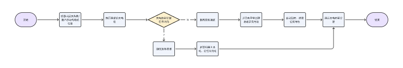

# 激光LiDAR充电站移位策略

| 版本   | 变更时间     | 变更记录 | 变更人 |
| ---- | -------- | ---- | --- |
| V0.1 | 2026/3/3 |      |     |
|      |          |      |     |

# 1. 需求概述

在割草机器人使用过程中，用户可能因庭院布局调整、草坪改造或环境遮挡等原因，需要对 **充电站**的位置进行移动。现有系统缺乏对移位场景的友好支持，用户移动充电站后将会导致如下问题：

* 割草机器人无法作业或者回充

因此，需要在产品中支持 **充电站移位功能**，提升用户操作的便捷性与系统的鲁棒性。

# 2. 功能关联

1. 通道管理

# 3. 流程图

# 4. 功能设计

| **模块描述** |                           |                                                                                     |
| -------- | ------------------------- | ----------------------------------------------------------------------------------- |
| **前置条件** |                           |                                                                                     |
| **操作路径** | 【地图管理】-【重定位充电站】           |                                                                                     |
| **需求说明** | **【功能点】激光LiDAR充电站移位判断逻辑** |                                                                                     |
|          | **【功能点】支持用户选择重定位充电站**     |  |
| **补充说明** |                           |                                                                                     |

