# 多线激光 SLAM — 决策记录

> 记录关键技术和方案决策：背景、考虑过的方案、最终选择、原因。
> 状态：`【已定案】` / `【讨论中】` / `【已推翻】`

---

## D-001 器件选型：mid360【已定案】

**背景**
割草机需要一颗满足室外大场景 SLAM 的 3D LiDAR，需覆盖 3000m²+ 场地，能提供地面点（支持 Z 轴约束），抗阳光干扰能力需可接受。

**考虑过的方案**

- **速腾 airy**：拖影严重（波动 0.5m~2m，远超 3cm 精度 spec），排除
- **禾赛**：全量程 3cm 精度，参数良好，但最终未选用（具体原因材料未记录）
- **mid360（Livox）**：满足 P0 规格，精度 3cm（1σ），40m 量程（10% 反射率），内置 IMU，秒脉冲时间同步，性价比高

**最终选择**：mid360

**P0 规格要求**

- 量程：40m（10% 反射率）/ 70m（80% 反射率）
- 精度（1σ）：< 3cm
- 地面点：负角度 > 5°
- 无 MPI（多路径干扰）
- 时间同步：必须支持秒脉冲
- 延时：雷达末点到 SLAM ≤ 160ms

**来源** | 割草机slam激光雷达需求；速腾airy和mid360+禾赛对比分析

---

## D-002 前端算法：IESKF（迭代误差状态卡尔曼滤波）【已定案】

**背景**
需要一个适合嵌入式平台的实时 3D LiDAR 里程计前端，要求低延时、低功耗。

**选择**
IESKF（Iterated Error State Kalman Filter），融合 LiDAR 点云 + IMU 进行实时位姿估计。

**原因（来自材料推断）**

- IESKF 相比 NDT/ICP 类前端，计算量更小，适合割草机嵌入式平台
- 与子图后端解耦，便于独立优化

**注意**
原始材料未记录前端选型的对比讨论，此处为基于架构文档的推断，状态【待确认】。

**来源** | 回环小场景新方案（架构图）

---

## D-003 后端架构：子图（Submap）+ Ceres 位姿图优化【已定案】

**背景**
需要支持大场景建图，单帧累积误差不可接受，需要后端优化机制消除漂移。

**选择**

- 每 30 帧点云合并为一个子图（Submap）
- 维护 KeyFramesManager 存储关键帧
- 子图间构建位姿图（Pose Graph），用 Ceres 优化
- 回环检测新增约束边后触发重新优化

**原因**

- 子图粒度控制内存，不需要保留所有帧的点云
- Ceres 位姿图优化成熟稳定，支持增量添加约束
- 子图级别的 ICP 匹配比帧级别更鲁棒

**来源** | 回环小场景新方案；回环现阶段情况

---

## D-004 回环检测策略：ICP 点云配准 + 距离门限（30m）【已定案】

**背景**
需要检测机器是否回到之前走过的位置，用于消除长轨迹累积误差。早期版本频繁触发 ICP，浪费算力。

**选择**

- 仅当当前子图与候选子图的 XY 距离 < 30m 时才触发 ICP
- 首末回环：离线阶段（finishslam）专门尝试，使用宽松阈值
- ICP 匹配率 > 阈值才接受回环约束

**原因**

- 距离门限过滤掉 90% 以上的无效匹配尝试
- 首末回环独立处理，避免在线阶段错误回环破坏地图

**优化历程**

- 早期：size >= 10 即触发强匹配，大量无效 ICP
- 改进后：距离 < 30m 才触发，Submap 10-18 期间无无效匹配

**来源** | 回环小场景新方案；回环现阶段情况

---

## D-005 回环优化改异步执行【已定案】

**背景**
早期回环优化在主线程同步执行，每次触发阻塞主线程约 1 秒，严重影响实时性（里程计和传感器处理中断）。

**选择**
将位姿图优化移至后台独立线程异步执行（`Starting Async`），主线程仅拷贝数据（< 1ms）。同时将 localoptimizer 改为类成员，增量添加顶点和边，避免每次全量重建。

**效果（2026-01-07 对比测试）**


| 指标         | 改前      | 改后    |
| ---------- | ------- | ----- |
| 主线程阻塞      | ~1000ms | < 1ms |
| 存图耗时（24子图） | ~400ms+ | ~27ms |
| 地图叠影       | 存在      | 已修复   |


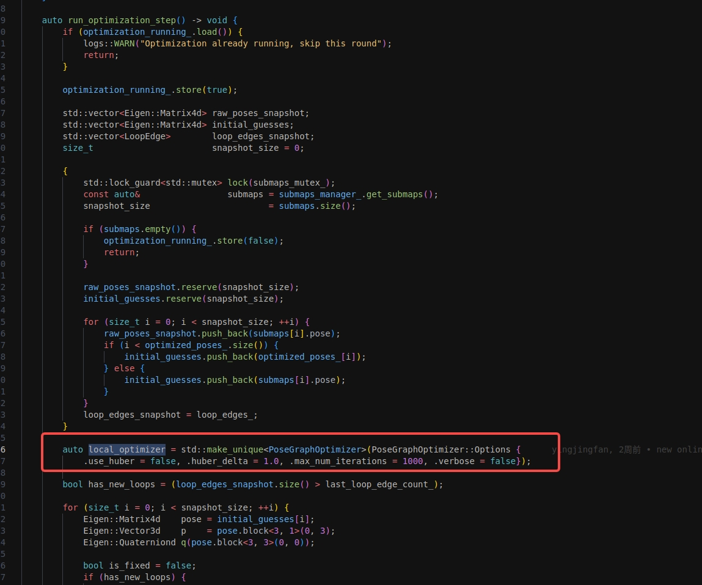

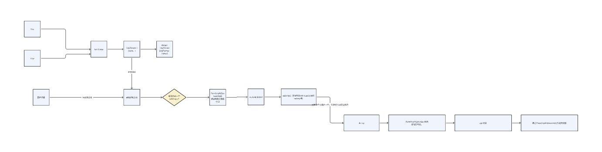

**来源** | 2026-01-07 回环小场景新方案

---

## D-006 大场景 Z 漂移处理：Z 先验约束 + 2D/3D 混合匹配【讨论中】

**背景**
长轨迹（>180m）运动中 Z 轴累积漂移，导致首末帧在 3D 空间中无法对齐，ICP 匹配失败（匹配率仅 ~10%）。

**当前方案（loop04）**

- **Z 轴先验约束**：为每个位姿图顶点添加 Z 轴位置先验（权重 500），约束垂直方向漂移
- **2D/3D 混合匹配**：
  - Z 漂移 < 2m → 标准 3D ICP
  - Z 漂移 ≥ 2m → 投影到 Z=0 平面做 2D 匹配，Z/roll/pitch 从里程计获取
- **XY 距离判断**：首末回环触发条件改为 XY 距离 < 15m（忽略 Z 漂移）

**当前状态**
材料截止 2026-01-07 显示大场景问题（数据集 11，约 2万平）仍未解决。最新进展【待确认，负责人待确认】。

## **来源** | 回环现阶段情况（loop04 描述）

## D-007 雷达断流处理1.0：轮速递推 + 导航 set pose【已推翻，由D-008替代】

**背景**
割草机作业过程中存在激光雷达时间同步断流现象（通常约 2s）。需要在断流期间维持定位，恢复后快速重新对齐。

**方案**

1. 断流后：导航记录当前 SLAM pose，用轮速递推补偿位移
2. 激光恢复后：set pose（含里程计补偿）→ 局部 ICP 匹配
3. 断流报告阈值：500ms

**遗留问题**

- 断流在 500ms 才报告，调整阈值的响应速度受限
- 更长远方向：恢复后做更多位姿搜索（尤其机器静止时）

**来源** | 雷达机器断流后slam动作

---

## D-008 雷达断流处理2.0：不停机策略 + 建图/定位分支【已定案】

**背景**
断流1.0 方案在断流后需要通过 set pose 交互才能恢复，导航侧感知明显。升级为2.0方案，目标：6s 内不停机，导航尽量无感。

**方案（建图 / 定位两条分支）**


| 模式       | 断流处理                                       | 恢复处理                            |
| -------- | ------------------------------------------ | ------------------------------- |
| **定位模式** | 断流 1s 后导航降速（0.2m/s；0.3rad/s）；断流 6s 以上中间层报停 | SLAM 内部：轮速补偿 → 局部重定位；失败则发起全局重定位 |
| **建图模式** | 断流 1s 直接停机（保建图成功率）                         | 恢复后同定位逻辑；全失败则报建图失败              |


**核心设计**

- 断流期间：多线 SLAM **不发布位姿**，仅做 ODO 内部递推；融合模块**继续正常发布位姿**
- 恢复后：用断流期间轮速递推的 pose 作为局部重定位初始值（不再用导航传入的 set pose）
- 如局部重定位失败 → 全局重定位；全局也失败 → 向导航报停

**风险点**

- 断流在斜坡上时补偿算法存在缺陷（见 problems.md P-007）
- 建图模式下断流恢复后若再次断流，重定位计时需与上次累加


**来源** | 断流2.0；雷达机器断流后slam动作

---

## D-009 ODO 解析模块架构（odoparser）【已定案】

**背景**
SLAM 前端需要对来自轮速计（ODO）的数据进行解析、时间对齐和融合预测，同时处理雷达断流、IMU 断流等异常场景下的位姿补偿。

**架构设计**

代码主干流程：

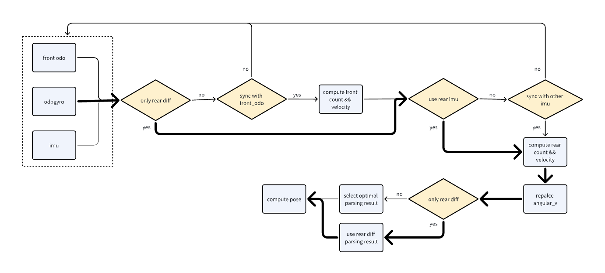

融合预测功能流程（用于里程计数据缺失时的位姿递推）：

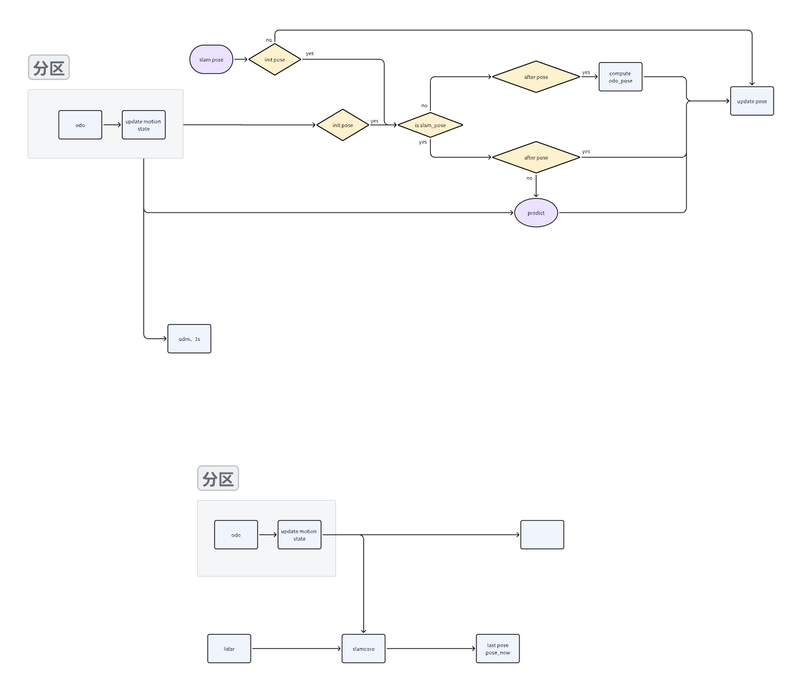

传感器断流 / 机器静止延迟处理方案：

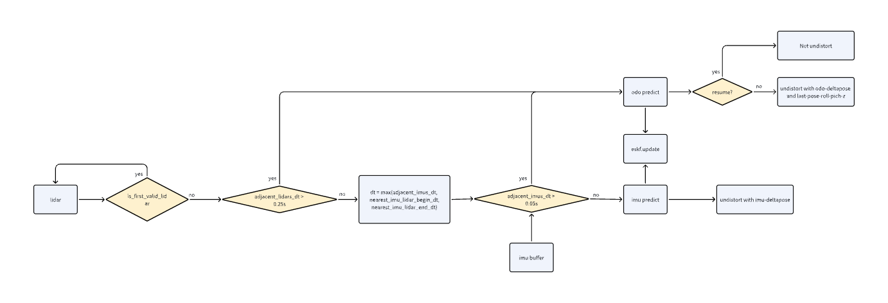

**核心处理逻辑**


| 场景                 | 处理方式                                                                               |
| ------------------ | ---------------------------------------------------------------------------------- |
| 雷达断流（pause/resume） | 用 `last_lidar_end_time` 至 `cur_lidar_end_time` 的 delta_odo_pose 补偿 pose_now_，无需去畸变 |
| 雷达丢帧               | 同上补偿 + 用当前帧时间段 ODO 去畸变                                                             |
| IMU 断流（首帧前）        | 分三个子情形，均以 ODO pose 补偿，再切换回 IMU 预测                                                  |
| IMU 断流（非首帧）        | 直接用 ODO pose 去畸变                                                                   |


**运动模型**
支持后轮差速（标准割草机底盘）和四驱模型，具体推导见飞书链接（`AU8OwiBBriiN7dkOXEoc6dOZnEb`）【本地未存档，见 gaps.md G-10】。

**来源** | odoparser设计文档

---

## D-010 重定位→导航交互接口设计【已定案】

**背景**
重定位模块（SLAM侧）完成后，需要通过明确的接口通知导航模块并移交控制权。

**接口设计**


**说明**
文档内容极简（仅一张流程图，无额外文字说明），具体接口协议见 `004_架构文档/信号流总结` 及代码实现。

**来源** | 重定位-导航交互

---

## D-011 取消重定位判断逻辑【已定案】

**背景**
原有 SLAM 流程中重定位触发频繁，导致不必要的停机和用户体验下降。设计"取消重定位"判断逻辑，在满足条件时跳过重定位流程。

**整体流程**


**取消重定位判断逻辑**


**配套测试**
测试需求文档见飞书（`XylFwvZ5QiMHWvkwFm4c55f0nkw`，本地未存档，见 gaps.md G-9）。

**来源** | 取消重定位算法流程及测试结果

---

## D-012 回环在线计算方案：增量异步优化【已定案】

**背景**
原有批处理回环（onlineloop01）在每次触发时同步执行 Ceres 优化，造成主线程阻塞约 1 秒，严重影响里程计和传感器处理。同时搜索半径过小（10m），导致大量有效回环漏检。

**两阶段设计**

第一阶段（只在第一次建图时做回环）：

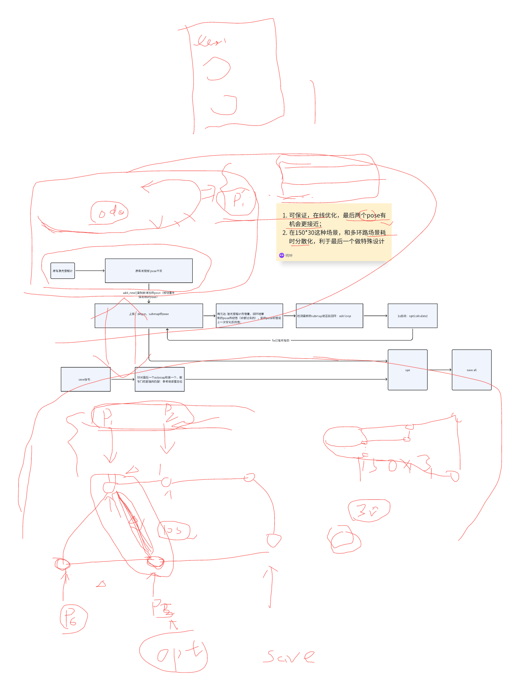

第二阶段：兼容地图扩展时继续回环（支持 add_new 增量补偿 pose）。

**核心改进（测试数据：105场地）**


| 指标         | 改进前（批处理）          | 改进后（增量异步）    | 改进幅度                 |
| ---------- | ----------------- | ------------ | -------------------- |
| 主线程阻塞时间    | ~1000ms           | <1ms（仅拷贝开销）  | 极大提升                 |
| 存图耗时（24子图） | ~400ms+           | ~27ms        | 提升约 15x              |
| 强回环触发条件    | Submap 数 ≥ 10 即触发 | 距离 < 30m 才触发 | 减少无效 ICP             |
| 最终回环边数量    | 3 条               | 8 条          | 搜索半径 10→30m          |
| 地图叠影       | 存在（使用旧 pose）      | 已修复          | 优先读 optimized_poses_ |


**叠影修复效果**

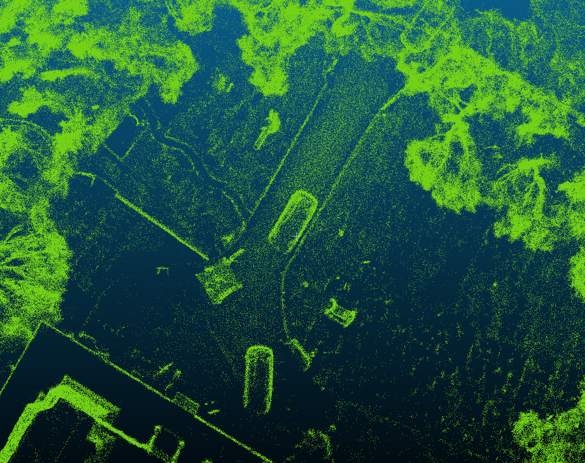

**关键设计**

- 异步线程 `private/yjf/loop_test09`，优化在后台运行，主线程仅做数据拷贝
- 存图增量逻辑：跳过已存在的本地 PCD 文件，避免全量重写
- 强回环（首尾匹配）使用专门的强匹配策略（参考局部重定位）

**来源** | 回环在线计算方案

---

## D-013 激光款充电桩移位重定位需求设计【已定案】

**背景**
充电桩被用户移位后，机器回桩失败（E39 报错），需要支持重新定位充电桩位置并重建上桩通道；需区分 RTK 款和激光款的不同建桩逻辑

**选定方案**
- 【IR-01】E39 回桩失败时 App 提示可选择「重新定位充电桩」引导
- 【SR-01】区分机型：RTK款和激光款执行不同重建桩逻辑
- 【SR-02-001】新桩在草坪内：退桩 + 自旋重定位获取充电桩位置
- 【SR-02-002】新桩在草坪外：按建通道逻辑执行局部定位，遥控距离不超过建通道距离限制
- 【SR-03】更新充电桩位置后删除原上桩通道，支持重新建立

**来源** | inbox/011_软件架构/017_激光LiDAR充电桩移位需求分解/激光LiDAR充电桩移位需求分解.md

---

## D-014 四驱里程计正运动学模型推导【已定案】

**背景**
odoparser 模块（D-009）支持四驱底盘运动学模型，需要从阿克曼几何假设出发，推导各种传感器组合下后轴中心的线速度 v 和角速度 w 解析公式

**模型参数约定**
- 轴距 L，胎距 d（前后轮胎距相同）
- 基于阿克曼几何假设；逆时针转为正方向
- 所有模型输出均为**后轴中心**的 v 和 w


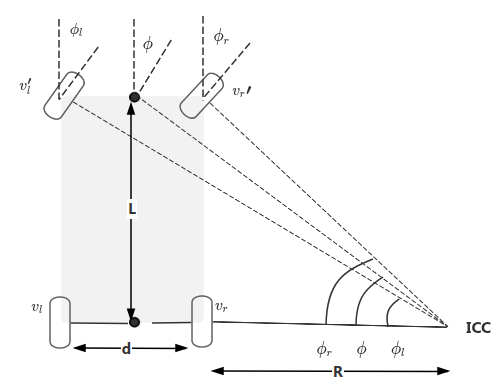


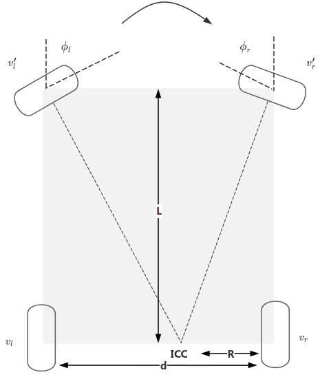

**6 种模型汇总**

| 模型名称 | 输入 | v 公式 | w 公式 |
|---------|------|--------|--------|
| REAR_DIFFERENTIAL（后轮差速） | 左后轮速 $v_l$，右后轮速 $v_r$ | $(v_l+v_r)/2$ | $(v_r-v_l)/d$ |
| 左前轮速度 + 左前轮转角 | $v_l'$，$\phi_l$ | $v_l'(\cos\phi_l + d\sin\phi_l/(2L))$ | $v_l'\sin\phi_l/L$ |
| 右前轮速度 + 右前轮转角 | $v_r'$，$\phi_r$ | $v_r'(\cos\phi_r - d\sin\phi_r/(2L))$ | $v_r'\sin\phi_r/L$ |
| 左后轮速度 + 左前轮转角 | $v_l$，$\phi_l$ | $v_l(1 + d\tan\phi_l/(2L))$ | $v_l\tan\phi_l/L$ |
| 右后轮速度 + 右前轮转角 | $v_r$，$\phi_r$ | $v_r(1 - d\tan\phi_r/(2L))$ | $v_r\tan\phi_r/L$ |
| 左后轮速度 + 左前轮速度 | $v_l$，$v_l'$ | 分正反转两段，见原文 | $\pm\sqrt{v_l'^2-v_l^2}/L$ |
| 右后轮速度 + 右前轮速度 | $v_r$，$v_r'$ | 分正反转两段，见原文 | $\pm\sqrt{v_r'^2-v_r^2}/L$ |

**来源** | teams/laser/inbox/0412新增/四驱里程计正运动学模型推导_2026-04-12-21-38-46/四驱里程计正运动学模型推导.md

---

## D-015 轮速引入断流场景位移补偿【已定案】

**背景**
断流 2.0 需要在激光断流期间维持定位不停机。原有方案依赖 set-pose 接口，需要导航侧介入。升级目标：SLAM 内部自治完成轮速递推补偿。

**方案**
在断流期间使用轮速累积 delta pose 补偿当前位姿，恢复后以该补偿位置作为局部重定位初值（不再使用导航传入的 set-pose）。

**处理范围**（仅适用）
非 set-pose 断流、非重定位切换时的正常断流场景（轮速可靠）。

**predict 阶段拆分设计**（2026-01-21 讨论稿）

核心思想：把预测拆为两个独立阶段，在 sync 中做逻辑判断，移除之前的补丁逻辑：

| 阶段 | 时间段 | IMU 可用 | 处理方式 |
|------|--------|----------|----------|
| predict-to-start | `last_lidar_end` → `cur_lidar_start` | 可用 | IMU 积分推算 |
| predict-to-start | `last_lidar_end` → `cur_lidar_start` | 断流 or 上帧 lidar 断流 >250ms | ODO 递推 |
| predict-to-end | lidar 帧内（start → end） | 连续 IMU（无断流 >25ms） | IMU predict + 去畸变 |
| predict-to-end | lidar 帧内（start → end） | IMU 断流 | ODO predict + 去畸变 |

备注：IMU 断流判断不限于中间断流，包括两端时间差过大（即第一个 IMU 与 last\_end 间距大）也算断流。

**遗留问题**
- odo 不佳时（轮速不可靠）无特殊处理，需后续补充逻辑
- 建图模式下暂停（减速）问题由 `@李鹏飞` 长期跟进
- 轮速引入后匹配度下降的研究尚未完结

**状态**：已合入（~2026-01-14 周次确认）

**负责人**：王亚萌

**来源** | 周报 2026-01-14 / 2026-02-04 @王亚萌；断流2.0（D-008）；teams/laser/inbox/0412新增/断流情况和逻辑调整1.21讨论.md

---

## D-016 暂停/恢复定位优化方案【进行中】

**背景**
机器暂停作业后重新恢复，SLAM 定位可能出现匹配不佳、维持失败状态的问题。需要在恢复时主动触发重定位兜底。

**方案设计**（飞书 wiki：暂停恢复-定位优化）
1. 暂停时记录当前 SLAM pose 和状态
2. 恢复后检查匹配质量；若匹配不佳，则主动发起重定位消息
3. 逻辑补全后，接续断流 2.0 的主动重定位机制

**场景分类及处理策略**

建图模式：

| 场景 | 当前处理 |
|------|----------|
| <500ms 断流 | 依赖轮速 |
| >500ms pause/resume | 依赖轮速 |
| set pose（局部重定位） | 两侧均未开发 |
| 用户点击 pause/resume | 依赖轮速 |

定位模式：

| 场景 | 当前处理 |
|------|----------|
| pause/resume，无搬动移动 | 轮速递推 |
| pause/resume，小位移推动（<60cm, 1rad） | 导航发起局部重定位；check\_pose 失败则导航发起全局重定位 |
| pause/resume，搬动 | 当前：导航发起全局重定位；后续：自识别发起 |
| 断流导致 pause/resume，中间未完全停止 | 不发起局部重定位，靠轮速递推；后续：轮速不足时 SLAM 自主发起 |
| 断流导致 pause/resume，中间完全停止 | 导航发起局部重定位 |

重定位过程中断流：依赖 IMU + 轮速递推。

主动重定位触发（4.3 节扩展）：暂停恢复后若连续多帧匹配率 + 得分均低于阈值，定位向导航发送主动重定位请求，导航发起全局重定位流程。

**当前状态**
- 私包验证完成；4.13 目标与导航联调
- ESKF update 遗漏 cov 问题（廖炳鑫跟进）优先级暂放

**负责人**：王亚萌 + 周士伟

**来源** | 周报 2026-02-11 / 2026-03-11 / 2026-04-08 @王亚萌 @周士伟；飞书 wiki SVSVwhOTziKSyekR1X1cOR70n2d；teams/laser/inbox/0412新增/暂停恢复-定位优化_2026-04-12-23-48-10/暂停恢复-定位优化.md

---

## D-017 局部重定位 BBS 搜索范围扩展【验证中】

**背景**
原有局部重定位 BBS 搜索范围受限（阈值策略导致不少 case 失败），针对搬动/回桩等场景成功率不足。

**方案**
- BBS 搜索范围扩展至 ±15m
- 支持 360° 全向搜索（360度 BBS 版本）
- 单帧匹配目标时间：1s 可接受
- 阈值策略：Score 优化后放开匹配度（解决粗粒度同分问题，见 P-010）

**当前状态**
单帧版本待验证（也卡在阈值）；2026-04-08 周会待验证。

**负责人**：周士伟（闫冬负责阈值部分）

**来源** | 周报 2026-03-25 / 2026-04-08 @周士伟；飞书 wiki LxeJwCAuViu62tkruz1cDRHBn4d（局部重定位减少对导航静止依赖优化）

---

## D-018 Airy lite 回环方案：增加 xyz 搜索空间【验证中】

**背景**
Airy lite 是竖向 FOV 较窄的新型号雷达（相比 mid360），现有回环方案在室内狭小空间兼容性差，需要扩大搜索以提升匹配成功率。

**方案**
- 回环匹配增加 xyz 三维搜索（搜索步长 0.3m），分辨率不变（1.0、2 层）
- 分辨率层次：0.5m（0、1 层）/ 1.0m（2 层）
- 室内狭小空间兼容性仍差，需要进一步调优

**当前状态**
2026-04-08：增加 xyz 搜索可以解决问题；但室内数据验证发现狭小空间兼容性很差，待调整后合入。还需要退化希望到 2.0（廖炳鑫跟进），匹配稳定性待确认。

**负责人**：李鹏飞 + 明坤（退化部分：廖炳鑫）

**来源** | 周报 2026-04-01 / 2026-04-08 @李鹏飞 @明坤

---

## D-019 退化检测 2.0【已定案】

**背景**
当前退化检测（H 矩阵退化）判断粒度粗，无法区分不同退化类型，需要升级为精细化判断以辅助断流 2.0 和匹配稳定性。

**退化分类**

| 退化类型 | 场景 | 判断依据 |
|----------|------|----------|
| XY 平面退化 | 长走廊 / 空旷场景 | 水平法向量分布单一（λ0/λ1 < τ） |
| Z 退化 | 斜坡 / 扫描上仰 | 地面点不足（< 30 个）|

**算法流程（集成在 predict 阶段）**

```
run() → predict()
  ├── 1. 点云排序 + IMU/ODO 去畸变
  ├── 2. 状态更新
  ├── 3. detect_degeneracy(measures_.lidar_)
  │       ├── Phase 1: build_kdtree()（max-range 分裂，O(N log N)）
  │       ├── Phase 2: 局部 PCA → normal / weight / reliable
  │       │       ├── KNN 搜索 → 拟合平面 → 最小特征值方向 = 法向量
  │       │       └── 邻域复用：可靠平面点的法向量辐射给邻居
  │       ├── Phase 3a: 地面点计数（|normal.z| > cos(30°)）→ z_degen
  │       └── Phase 3b: 2D 散布矩阵特征分解 → horiz_degen + horiz_dir
  └── degen_info_ {Kind, horiz_dir}  ← 写入私有成员
→ align_and_update()  ← 读 degen_info_ 调整匹配策略
```

散布矩阵（非去均值协方差矩阵）替代协方差矩阵，避免法向量符号模糊性（n 与 -n 等价）。

**法向量可靠性判断（局部 PCA）**


绿色 = 可靠平面点，红色 = 不可靠点（跨平面 KNN，法向量无效）；可靠点权重 w≈1，不可靠点 w=0。

**水平退化方向检测效果**

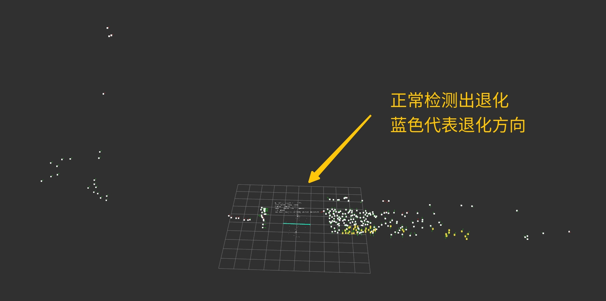


**实际 Bug 场景验证**

| 场景 | 效果 |
|------|------|
| 长走廊出桩（BUG1） | 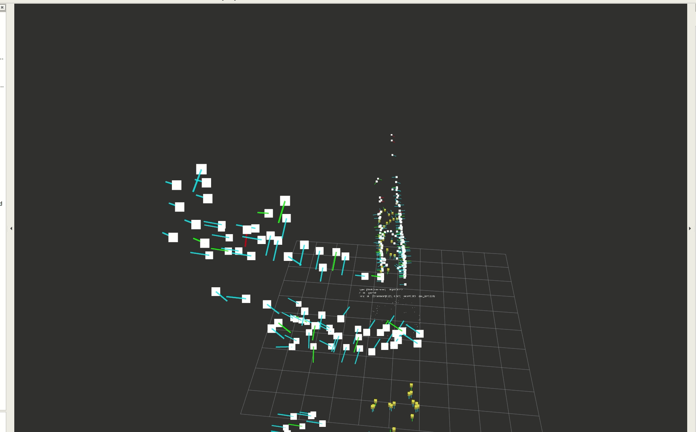 |
| 长走廊穿越（BUG2） |  |

**退化处理**

| 处理策略 | 细节 |
|----------|------|
| Predict 替换 | 退化帧回退到上一次 ICP 校准状态，全部用 odom 递推（predict\_to\_start/end\_by\_odom） |
| LM 优化 delta 置零 | 把 delta x 投影到退化方向，退化方向分量设为 0 |
| 更新模型改右乘 | 原左乘模型：清零 delta x 后旋转增量仍会耦合到平移；右乘后退化方向平移不受旋转影响 |
| iESKF 更新 | 退化方向 innov≈0，delta≈0，基本纯 odom 递推 |

**仿真验证结果**（MID360 / MID360S，60°/78°/105° 场景，共 6 组）
- 退化分支 vs dev 分支轨迹 + 地图几乎一致
- 大场景耗时 7-8ms，长走廊耗时接近 1ms

**当前状态**
- 算法文档已定稿；调试可视化分支：`mlslam_core/private/lbx/deneg_visualization`
- 待合入 DEV；与断流 2.0 联动设计中

**负责人**：廖炳鑫（辅助王亚萌）

**来源** | 周报 2026-03-11 / 2026-04-08 @廖炳鑫；teams/laser/inbox/0412新增/退化检测算法文档_2026-04-12-23-49-48/退化检测算法文档.md

---

## D-020 新 SDK 脏污字段：intensity 过滤 + count 字段引入【进行中】

**背景**
速腾新版 SDK 提供 count 字段（点命中次数）和 intensity 字段（反射率），可用于区分正常测距点、拖点和脏污点，支持更精准的脏污检测策略。

**字段约定**（速腾厂家 2026-04 提供）

| 场景 | 距离 | tag | 反射率 |
|------|------|-----|--------|
| 正常测距 | >0 | 0 | >0 |
| 轻度脏污 | >0 | 1 | - |
| 重度脏污 | >0 | 2 | - |
| 盲区外遮挡 | >0 | 3 | - |
| 空旷/低反 | =0 | 0 | - |
| 拖点 | >0 | - | =0（反射率为0为拖点）|

**方案**
- intensity 过滤：过滤反射率为 0 的拖点
- count 字段引入：作为脏污判断辅助信号
- logparse 工具同步更新以解析新字段

**当前状态**
2026-04-08：李鹏飞负责 logparse 合并；脏污新策略（黑胶带/空旷无法区分问题）待后续测试（泥土树叶场景）。

**负责人**：李鹏飞 + 周士伟（王亚萌厂家 SDK 协调）

**来源** | 周报 2026-04-01 / 2026-04-08 @李鹏飞 @周士伟 @王亚萌

---

## D-021 VERSA 导航-定位模块交互设计【已定案】

**背景**
梳理 VERSA 项目中建图、定位、重定位三种模式下，导航模块与定位（SLAM）模块之间的交互流程和接口约定。

**核心交互逻辑**

**1. 切换定位模式（点击割草）**

| 启动场景 | 交互指令数 | 说明 |
|----------|-----------|------|
| 建图后原地不动 | 3 条（SET\_SLAM\_MODE + pose + set\_pose） | 无需 load\_map |
| 出桩（桩正常） | 4~5 条 | 等待雷达开启后下发；包含桩坐标+递推补偿位置 |
| 非桩出（重定位情况） | 先执行重定位，成功后再切换定位模式 | 3 条指令 |


**2. 重定位触发条件**

| 条件 | 说明 |
|------|------|
| 搬动行为（与 Butchart 共用） | 搬动标志位清零 |
| 重启操作 | 重启标志位清零 |
| 传感器全关 | 该标志位清零 |
| 连续切换 | 先发 2 条指令检测匹配度；不通过则切换重定位 |
| 桩坐标变化 | 导航记录桩坐标，回桩时不同则下次出桩触发重定位并更新桩坐标 |
| 桩断电 | 下次出桩必做重定位 |

重定位操作流程：先判断雷达是否开启 → 未开启则自旋等待 → 雷达开启后执行重定位序列。


**3. 有图建图（扩展建图模式）**

扩展建图前须先校检定位：
1. 非桩出：符合重定位条件 → 先重定位；否则连续切换逻辑（2 条指令 + 匹配度判断）
2. 桩出：3 条定位指令；匹配度不高（set\_pose 返回 false）→ 触发重定位
3. 校检通过后：发进入地图扩展模式信号；保存按钮按下时发 SAVE\_MAP

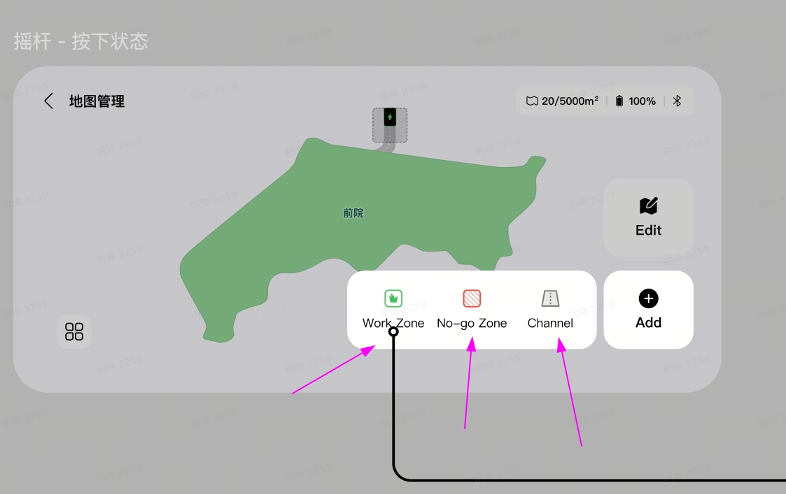

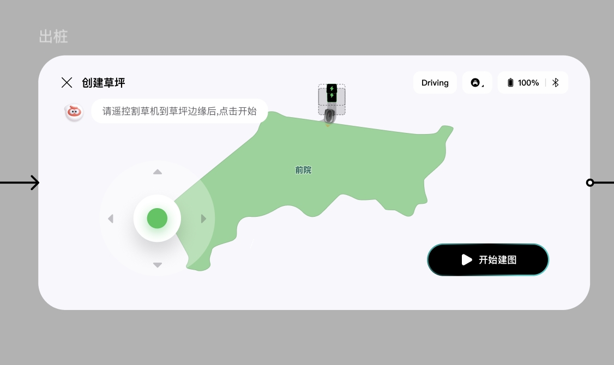

模式 id 约定：1 = 新建图，2 = 定位模式，3 = 扩展建图。

**4. 主动重定位（4.3 节）**
暂停恢复后连续多帧匹配率 + 得分低于阈值 → 定位主动通知导航 → 导航发起全局重定位。

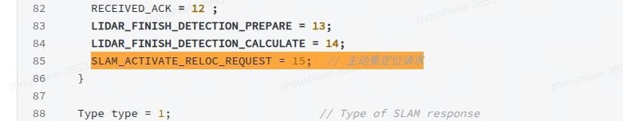

**遥控模式**：无定位交互；出界时导航控制停机。

**当前状态**：已定案，接口细节见飞书 wiki AqOGwVOuWimt7ykP2oTcSHpYnag（已本地化）

**负责人**：周士伟 + 王亚萌（导航侧对接）

**来源** | teams/laser/inbox/0412新增/VERSA导航-定位模块交互：建图&定位&重定位_2026-04-12-23-44-00/VERSA导航-定位模块交互：建图&定位&重定位.md

---

## D-022 局部重定位减少对导航静止依赖优化【方案设计中】

**背景**
当前局部重定位（set\_pose）依赖导航等待机器完全静止后再发起，存在：1）导航静止等待延迟；2）set\_pose 到结果返回期间主线程被阻塞或漂移的问题。

**三阶段方案**

**短期防护（已实现）**
set\_pose 前后加轮速补偿到 set\_pose 结果上，处理静止等待期间的少量运动。

**中期（无主动重定位，无感代码优化）**
1. set\_pose 触发后，开启独立线程计算局部重定位
2. 同时，主线程继续用当前 pose 进行 SLAM 递推、正常发布（不刷新地图）
3. 局部重定位完成后：
   - 成功 → 修正初始 pose；刷新地图
   - 失败 → 返回 false；导航发起全局重定位

**长期（有主动重定位，注意安全风险）**
1. set\_pose 立即返回 true，导航开始走；开启独立线程计算
2. 主线程继续 SLAM 递推和发布（不刷新地图）
3. 局部重定位完成后：
   - 成功 → 修正初始 pose；刷新地图
   - 失败 → **主动发起全局重定位**（安全风险：导航已开始行走）

**当前状态**：方案设计中；关联 D-016 暂停恢复场景；周士伟负责

**负责人**：周士伟

**来源** | teams/laser/inbox/0412新增/局部重定位减少对导航静止依赖优化.md；飞书 wiki LxeJwCAuViu62tkruz1cDRHBn4d（已本地化）