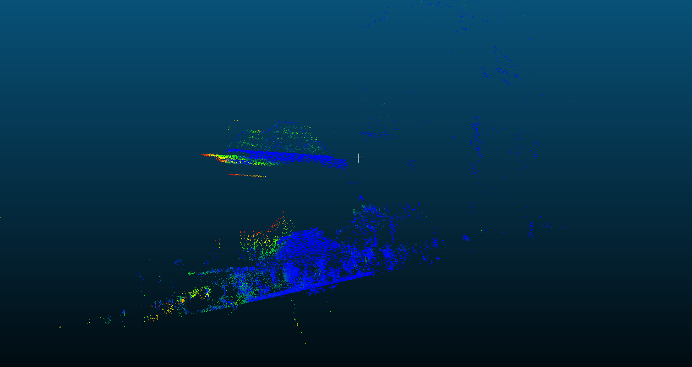

# 多线激光 SLAM — 问题记录

> 记录开发过程中遇到的具体问题：现象、根因、解决方案、当前状态。
> 状态：`【已解决】` / `【已知，规避中】` / `【攻坚中】` / `【待确认】`

---

## P-001 大场景（>2万平）首尾回环失败【攻坚中，最新进展待确认】

**现象**
长轨迹（数据集 11，约 180m×120m，面积约 2万平）建图完成后，首末帧 Z 轴漂移 > 5m，3D ICP 无法对齐，回环失败。轨迹首末点实际距离 > 7m，不满足回环条件。

**根因分析**
长距离运动中 Z 轴累积漂移，导致点云在 3D 空间无法对齐。具体触发原因：

- 子图融合后的 Z 轴自由度约束不足
- ICP 匹配在 Z 漂移大时直接失效

**已尝试方案（loop04）**

- Z 轴先验约束（权重 500）加入位姿图
- 2D/3D 混合匹配（Z 漂移 ≥ 2m 时投影到 Z=0 平面）
- 首末回环触发条件改为 XY 距离（忽略 Z）

**当前状态**
材料截止 2026-01-07 显示问题未解决。最新进展【待确认，负责人待确认】。

**来源** | 回环现阶段情况

---

## P-002 Submap 0 不在原点，ICP 匹配率仅 15%【已解决】

**现象**
数据集 07 中，Submap 0 位置在 (6.58, 1.42) 而非原点，首末两个子图中心距离 8.75m，点云重叠不足，ICP 匹配率仅约 15%，回环失败。

**根因**
子图位置基于其中间帧（第 15 帧）计算，导致 Submap 0 不在原点，且首末子图中心偏离实际闭合点。

**解决方案**

- 第一个子图改用头帧作为原点
- 最后一个子图：将剩余帧 + 借用前一个子图的帧补为完整子图，取最后一帧作原点
- 新增 `flush_remaining_with_borrow()` 方法处理末尾剩余帧

**来源** | 回环现阶段情况

---

## P-003 回环优化同步执行阻塞主线程 1 秒【已解决】

**现象**
早期版本每次触发回环优化，主线程阻塞约 1000ms，导致里程计和传感器处理中断，系统实时性严重下降。

**根因**
位姿图优化在主线程同步执行，且每次全量重建 optimizer（O(N) 复杂度随子图数增长）。

**解决方案**

1. 优化移至后台线程异步执行
2. localoptimizer 改为类成员，增量添加顶点和边（O(ΔN)）
3. 存图改为增量跳过已存文件

**效果**：主线程阻塞 1000ms → < 1ms；存图耗时 400ms+ → 27ms

**来源** | 2026-01-07 回环小场景新方案

---

## P-004 地图保存存在叠影【已解决】

**现象**
回环优化后保存全局地图，点云存在叠影（同一位置重复点云偏移）。

**根因**
保存逻辑读取的是原始 pose 而非优化后的 `optimized_poses_`。

**解决方案**
修改保存逻辑，优先读取 `optimized_poses_`，确保输出地图经过位姿图对齐。

**来源** | 2026-01-07 回环小场景新方案

---

## P-005 Versa 割草机平台 Core Dump 问题【待确认】

**现象**
Versa 平台在特定条件下触发 core dump，影响稳定性。

**当前状态**
材料中有专项分析文档（`Versa割草机 core dump问题的定位与查询`），具体根因和解决状态【待确认，需问负责人】。

**来源** | 005_工具文档/Versa割草机 core dump问题的定位与查询

---

## P-006 雷达断流恢复失败场景【已有方案，边界情况仍存在】

**现象**
雷达断流后，轮速补偿 + 局部重定位均失败，需要发起全局重定位，定位短暂中断。

**根因**
断流时间过长（>6s）或机器运动状态复杂（斜坡、大角度转弯），轮速递推误差积累，超出局部重定位的匹配范围。

**当前状态**
断流2.0 已定义完整的降级链路（局部重定位 → 全局重定位 → 停机报错），属于已知有方案的边界情况。
具体联调验证状态【待确认】。

**来源** | 雷达机器断流后slam动作；断流2.0；decisions.md D-007/D-008

---

## P-007 断流2.0 斜坡补偿缺陷【已知，待优化】

**现象**
机器在斜坡上工作时发生断流，断流2.0 将兜底时长从 500ms 延长到 6s，但补偿算法在斜坡场景下存在缺陷，导致定位失败概率上升。

**根因**
当前 ODO 轮速补偿算法未考虑斜坡的高度积分和重力对齐角度变化，在大倾斜角下递推误差较大。

**影响范围**
定位模式下斜坡断流场景；建图模式断流1s直接停机，影响较小。

**当前应对**
无，属于已知未解决优化项。

**优化方向**（来自文档）
从高度积分和重力对齐角度积分方向优化补偿算法。

**来源** | 断流2.0（断流定位风险点章节）

---

## P-008 Airy lite 点云 Z 轴/XY 抖动【攻坚中】

**现象**
Airy lite 新型号雷达在建图时出现 Z 轴上下明显抖动，同时 XY 平面也存在漂移/抖动，影响建图质量和回环匹配。

**已分析方向**

1. **特征处理问题**：射线方向筛查（直线特征夹角过大 → 过滤掉；面特征与圆锥法向量平行 → 过滤掉），但过滤可能产生"篡改假象平面"副作用
2. **厂家 SDK 问题**：Airy lite FOV 为竖向扇形，SDK 版本影响数据质量；待厂家新版 SDK 统一验证
3. **NHC 约束**：Z 方向更强约束（金字塔结构，晴天场景），待验证
4. **LOAM 点剔除**：看下匹配稳定性优化（待定）

**当前状态**
2026-04-08 仍在攻坚：厂家新 SDK 等待中；射线方向筛查 Doing；特征优化代码待合入。

**负责人**：李鹏飞

**来源** | 周报 2026-03-18 / 2026-03-25 / 2026-04-01 / 2026-04-08 @李鹏飞

---

## P-009 Odo acc 阶段 gyro 阻塞导致重力对齐失败【已解决】

**现象**
在 relocate accumulate（acc）阶段，系统出现阻塞，导致重力对齐失败，表现为定位异常或初始化卡死。

**根因**
controller 通过原子操作在 relocate accumulate 阶段进行了阻塞；当 load global map 耗时较大时（>0.1s），acc 阶段无法在 0.1s 内完成，导致重力对齐失败。

**解决方案**
修复 acc 阶段的原子操作阻塞逻辑，确保 gyro 不再卡住 acc 阶段。

**状态**：已解决（2026-04-08 合入，bug #483380）

**负责人**：孙昂熙 + 周士伟

**来源** | 周报 2026-04-08 @孙昂熙 @周士伟

---

## P-010 BBS 局部重定位 Score 粗粒度同分问题【已有方案，验证中】

**现象**
BBS（Branch and Bound Search）计算匹配 score 时，由于计算粒度过粗，出现大量相同 score 值，可能导致差的 pose 替换掉好的 pose 作为"最优解"，从而给出错误的重定位初值。

**根因**
BBS score 计算过于粗糙（分辨率不足），相同 score 的候选解过多，无法有效区分优劣。

**影响**
局部重定位在某些场景下阈值卡死，成功率下降。

**当前方案**
Score 优化后放开匹配度（动态阈值策略）；闫冬负责阈值动态策略优化；搜索范围同步扩展至 ±15m（见 D-017）。

**状态**：阈值策略调整中，也卡在阈值（2026-04-08 周次）

**负责人**：闫冬 + 周士伟

**来源** | 周报 2026-04-01 / 2026-04-08 @闫冬 @周士伟；飞书 wiki YnMowj2EdinNB3k6VA8cUpcXnEF（重定位-多线优化）

---

## P-011 取消/减少重定位代码合入导致融合 coredump【已解决】

**现象**
减少重定位（取消重定位逻辑）代码合入时，融合模块（fusion）出现 coredump，影响线上稳定性。

**根因**
代码合入接口变更导致融合模块异常崩溃（具体崩溃点在 fusion coredump）。

**解决方案**
2026-03-25 周次记录 `~~减少重定位合入：融合coredump @闫冬 @周士伟~~`（删除线），表明已处理。

**状态**：已解决（~2026-03-25）

**负责人**：闫冬 + 周士伟

**来源** | 周报 2026-03-25 @闫冬 @周士伟

---

## P-012 双目 IMU 回环在室内狭小空间兼容性差【已知，方向待定】

**现象**
双目 IMU 方案（相机 + IMU 融合 SLAM）在室内狭小空间（走廊、密集墙壁区域）回环效果很差，无法有效建立闭环约束。

**根因**
狭小空间中相机视野受限，特征点分布不均匀，导致 ICP/特征匹配失败率高。该问题属于视觉 SLAM 在结构单一环境中的通病。

**当前状态**
双目 IMU 预研阶段（可行性验证），私包已通过外场验证。室内狭小空间问题确认存在，性能问题后面考虑，暂不做专项优化。

**负责人**：明坤 + 王亚萌

**来源** | 周报 2026-04-01 / 2026-04-08 @明坤 @王亚萌；飞书 wiki 相机imu可行性分析

---

## P-013 局部地图单面墙情况下重定位假成功【已解决】

**现象**
局部地图中只有一面墙时，特征匹配缺乏足够约束，导致匹配翻转（match 反了），且由于阈值设置过低，直接判为重定位成功。

**根因**
局部重定位阈值过低（无法拒绝 ambiguous match）；BBS 兜底逻辑未被正确触发。

**解决方案**

1. 提高重定位成功阈值，确保 ambiguous case 进入 BBS 兜底逻辑
2. 引入为 BBS 提供 pose 初值的逻辑（改善 BBS 初始化质量）

**状态**：已解决（2026-03-31 合入，bug #482985）

**负责人**：周士伟

**来源** | teams/laser/inbox/0412新增/激光割草机slam重点合入问题跟踪_2026-04-12-23-11-43/激光割草机slam重点合入问题跟踪.md

---

## P-014 空旷场景脏污误报【已解决】

**现象**
新西兰场景（空旷，只有低矮灌木丛）触发脏污检测时，雷达扫到的纵向点有限，误判为脏污。

**根因**
脏污检测逻辑依赖纵向点数量，空旷低矮场景中纵向点天然稀少，与脏污场景特征重叠，无法区分。

**解决方案**
修复脏污误报逻辑，增加对空旷低纵向点场景的豁免判断。

**状态**：已解决（2026-04-01 合入，bug #492582）

**负责人**：周士伟

**来源** | teams/laser/inbox/0412新增/激光割草机slam重点合入问题跟踪_2026-04-12-23-11-43/激光割草机slam重点合入问题跟踪.md

---

## P-015 巷子狭窄场景 3D 点云重定位失败【已解决】

**现象**
巷子狭窄场景下，3D 点云找不到足够特征点，导致重定位失败（bug #481581）。

**根因**
3D 点云在狭窄走廊中特征稀疏，ICP 匹配失败率高；纯 3D BBS 无法提供有效候选。

**解决方案**
改用特征点轮廓（outline）进行 2D BBS 匹配，绕过 3D 点云特征不足的限制。

**状态**：已解决（2026-04-09 合入，bug #481581）

**负责人**：周士伟

**来源** | teams/laser/inbox/0412新增/激光割草机slam重点合入问题跟踪_2026-04-12-23-11-43/激光割草机slam重点合入问题跟踪.md

---

## P-016 导航 set pose 错误位姿导致融合被激光 reset，app 位置显示异常【已解决】

**现象**
导航调用 set pose 时，会同时将位姿写入激光模块和融合模块。当传入错误位姿时，激光模块进行局部重定位，并将结果传给融合做重置，导致 app 显示位置与实际不符。

**根因**
set pose 路径未区分"用户手动设定位置"与"激光模块修正结果"语义，激光局部重定位结果被无条件透传给融合模块，放大了错误位姿的影响。

**解决方案**
修复接口逻辑，激光重定位结果在满足一致性约束前不传给融合，切断错误位姿通过激光→融合的二次传播路径。

**状态**：已解决（2026-04-01 合入，bug #490853）

**涉及机型**：Versa 1.0 / HF 2.0

**负责人**：闫冬

**来源** | teams/laser/inbox/0412新增/激光割草机slam重点合入问题跟踪_2026-04-12-23-11-43/激光割草机slam重点合入问题跟踪.md

---

## P-017 窄通道累积局部地图花图——2.5m 内点云处理两难

- **症状**：窄通道内重定位时，局部地图无法稳定累积：关闭 2.5m 内点云则地图花图，开启则操作人员产生的杂点导致重定位失败或假成功
- **根因**：2.5m 近距离点云质量差（操作人员干扰），但同时是构建可用局部地图和保留 z 轴地面约束的必要输入，单一策略无法同时满足两个需求
- **修复**：双局部地图方案（见 D-028）——定位用图使用全点云，重定位用图 2.5m 内只使用地面点；地面点提取方案（高度滤波/法向量滤波）待验证（见 Q-001）
- **来源**：`inbox/0413新增/激光割草机窄通道.md`

---

## P-018 误回环检测——匹配评价机制缺失，方案选型中

- **症状**：submap 回环可大面积匹配局部区域，但存在空间共识不一致的假回环；当前缺乏有效机制判断回环是否正确
- **根因**：现有匹配评价维度单一，无法区分"大面积局部匹配"与"全局一致性正确匹配"
- **修复**：方案探索中，无明确结论——  
方向 1：连通域分析（网格划分，将能匹配/不能匹配的点放入二维网格，判断连通区域大小）  
方向 2：KNN 距离分布比值（30cm 内点 vs 5m 内点占比，适当考虑 5m 点的尺度分布）  
待选定（见 Q-002）
  
- **来源**：`inbox/0413新增/回环整理优化2.0_2026-04-13-10-57-26/回环整理优化2.0.md`

---

## P-020 弓字形转弯轨迹不平滑【已知问题，待修复】

- **症状**：割草机在弓字形路径执行转弯时，实际运动轨迹不平滑，存在明显抖动或折线感
- **根因**：未明确——可能涉及导航控制转弯指令生成、SLAM 位姿输出频率/噪声、或 Akerman 运动学模型参数标定偏差
- **修复**：暂无进展，为 2025-12-17 Versa TR4a 阶段遗留问题，待排查根因后制定修复方案
- **来源**：飞书群讨论 2025-12-17，TR4a 阶段遗留问题梳理

---

## P-019 强回环 ICP 初值依赖——远距离场景可靠性不足

- **症状**：强回环场景（距离/误差较大）使用 ICP 时，因对初值敏感，理论上无法可靠收敛
- **根因**：ICP 算法本质需要较好初值才能收敛，距离和误差较远时不满足条件
- **修复**：待定——BBS3D（已在 D-023 引入）是否能替代 ICP 处理强回环场景待验证（见 Q-003）
- **来源**：`inbox/0413新增/回环整理优化2.0_2026-04-13-10-57-26/回环整理优化2.0.md`

---

## P-021 雷达反复断流导致机器持续重定位卡死【已解决】

**现象**
机器在雷达反复断流场景下持续触发局部重定位，且每次重定位都失败，机器卡在重定位状态无法继续作业。

**根因**
局部重定位发起后**没有收到 load_map 的返回**，导致重定位流程无法收敛 / 退出，反复重试。

**解决方案**
修改 load_map 的返回逻辑，确保任何情况下都能正确返回（成功 / 失败 / 超时），不再卡死上层重定位状态机。

**状态**：已解决

**关联**
- 与 P-006（雷达断流恢复失败场景）属于同一类断流诱发的重定位失败链路
- 与断流 2.0（D-008）「套娃问题」处理思路一致：异常路径必须有明确出口

**来源** | 雷达断流相关工作汇总 2026-04-21；飞书群讨论「机器持续重定位卡死」

---

## P-022 重定位加载地图内存溢出【已解决】

**现象**
重定位流程加载地图阶段出现内存溢出（OOM）/ 内存占用过大，影响主流程稳定性。

**根因**
特征点云内存需求过大；原始数据格式维度过高，全量加载时内存占用超出嵌入式平台承载能力。

**解决方案**
**中间转一道**——加载时先做采样降维，最终给到匹配阶段的是 **17 维特征点云**，显著降低内存占用。

**状态**：已合入

**关联**
- 与 D-034「双地图模式」共同构成重定位主流程的内存 / 耗时优化套路
- 与 D-018（Airy lite 回环搜索空间扩展）思路互补——前者降耗时、本条降内存

**来源** | 雷达断流相关工作汇总 2026-04-21

---

## P-023 重定位粗匹配随机性 bug【已解决】

**现象**
重定位的粗匹配阶段存在随机性 / 不可复现，相同输入下可能给出不同的初匹配结果，影响后续 ICP 收敛稳定性。

**根因**
使用的 kdtree 算法存在 bug（具体：构建 / 查询路径上的非确定性行为，待原始材料补充）。

**解决方案**
修复 kdtree 算法的非确定性问题。

**状态**：已解决

**关联**
- 与 D-034「双地图模式」中的"关键帧地图特征匹配"相关——是该匹配链路的稳定性补丁

**来源** | 雷达断流相关工作汇总 2026-04-21

---

## P-024 reloc acc 计算阻塞期间静止 IMU 篡改零偏【已解决】

**现象**
reloc accumulate（acc）阶段的计算阻塞期间，机器若处于静止状态，**静止状态下的 IMU 数据被提前利用**进入零偏估计流程，导致 IMU 零偏被错误"篡改"，断流恢复后定位漂移。

**根因**
acc 计算阻塞 + 静止判定逻辑没有等待 acc 阶段结束，提前用了不应使用的 IMU 数据更新零偏。

**解决方案**
在 acc 阶段未结束前，不允许利用静止状态对零偏做更新；阻塞前不利用静止状态。

**状态**：已解决（2026-04-17 合入，bug #500957，Versa / Flora）

**关联**
- 与 P-009（acc 阶段阻塞导致重力对齐失败）属于**同一类「acc 阶段阻塞引发的下游污染」**问题，是 P-009 修复后清理出的伴生 bug
- 与断流 2.0 联调直接相关（断流场景容易触发该路径）

**来源** | 雷达断流相关工作汇总 2026-04-21；HF 跟踪表 W16；激光割草机 SLAM 重点合入问题跟踪