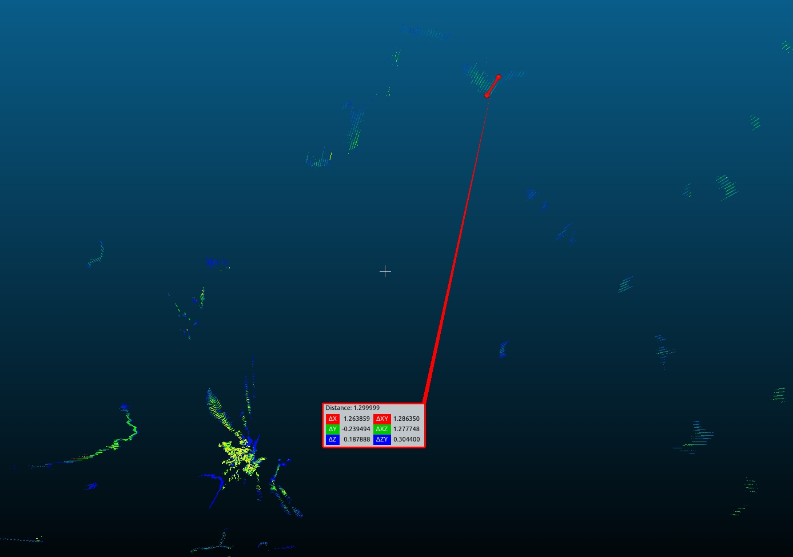
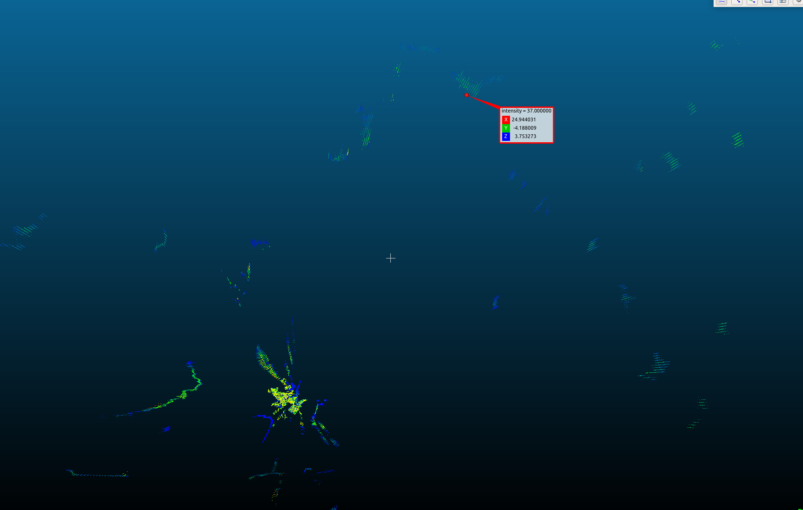
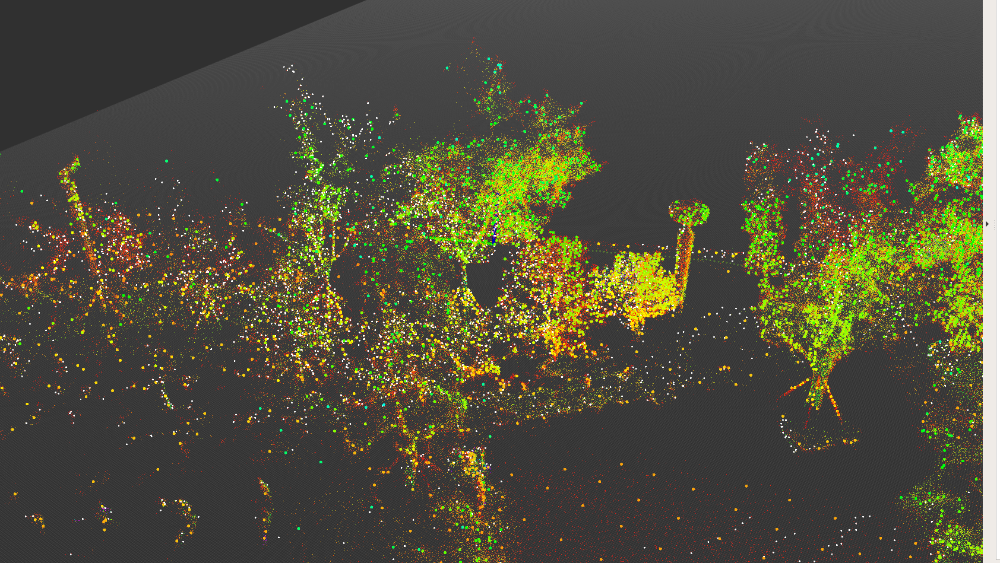
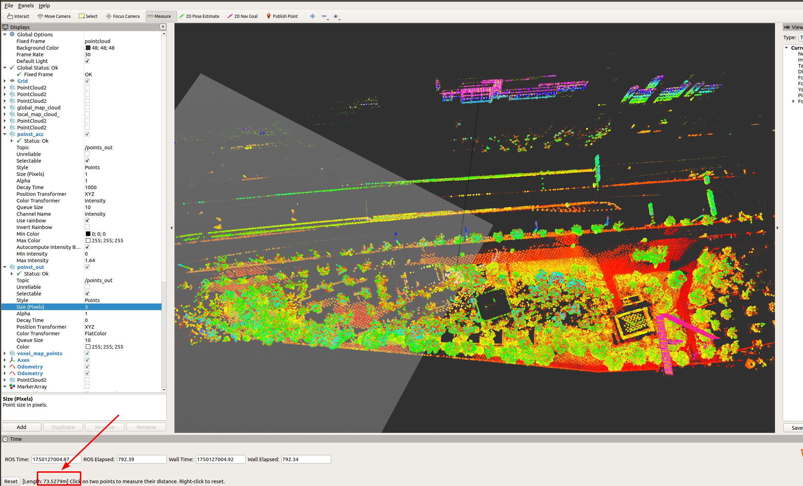
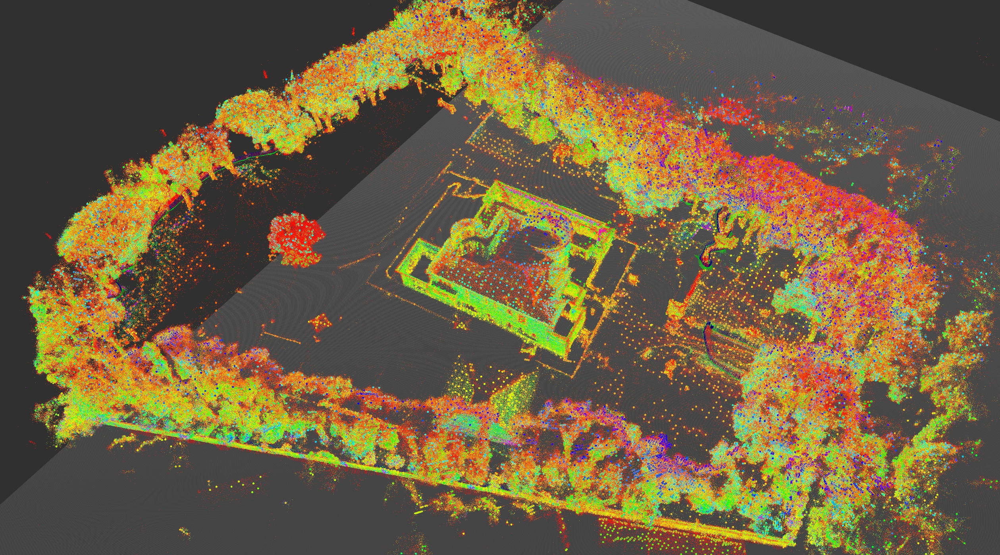
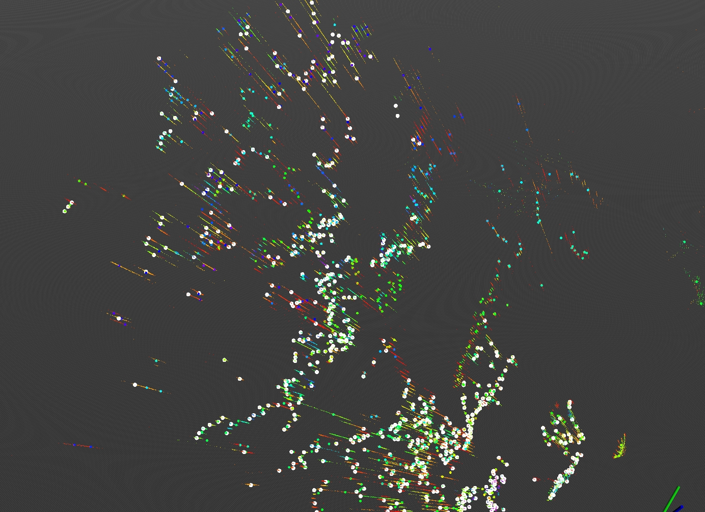
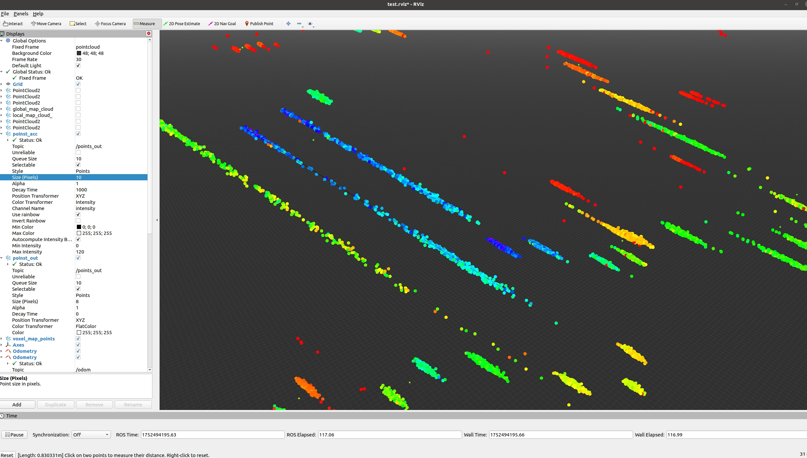
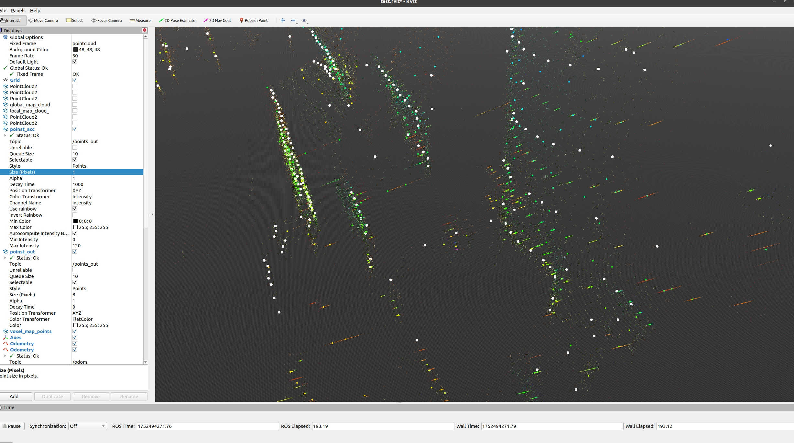

# 传感器选型 — 决策记录

> 记录割草机激光 SLAM 传感器选型的关键决策。
> 格式：每条决策独立一节。
> 状态：`【已定案】` / `【讨论中】` / `【已推翻】`

---

## SD-001 淘汰速腾 Airy：测距原理缺陷无法修复【已定案】

**背景**
第一轮评估时，速腾 Airy 是主要候选器件之一。内场联调后发现点云质量存在严重问题。

**问题现象**
- 拖影：25m 测距条件下，拖影长度约 1.3m，树叶/小间隙均会出现
- 鬼影：玻璃面出现镜面对称的虚像（lens 镜面鬼影）
- SLAM 建图：墙皮厚重、重影显著、Z 轴漂移

**厂商确认**

速腾回复：光斑在多帧叠加测距波动，属器件测距原理所致，暂时无法优化。

**25m 测距误差实测**

**调参尝试结论**
安装角度调整为 -5°（引入地面点）后，高度漂移有所缓解，但建图质量根本问题未解决。

**决策**
淘汰速腾 Airy，问题来自硬件原理，软件侧无法规避。

**来源** | 速腾airy和mid360；速腾airy和mid360+禾赛对比分析

---

## SD-002 选定 Mid360：外场验证通过，满足大场景需求【已定案】

**背景**
在速腾 Airy 确认淘汰后，Mid360 成为主要候选，并完成内外场全面验证。

**验证数据**

点云质量（Mid360 树轮廓清晰，几乎无拖影）：

外场 SLAM 性能（测距 70m+，SLAM 正常运行）：

场地规模验证（78号、105号场地建图稳定）：

**核心指标满足情况**
- 测距：70m+（目标场景 3000m²+ ≈ ~55m 半径，满足）
- 点云质量：树木等复杂轮廓还原度高，无明显拖影
- SLAM 建图：稳定，105场地颠簸数据（斜坡）表现正常
- 负角度支持：有（支持地面点采集）

**决策**
选定 Mid360 为割草机激光 SLAM 主传感器。

**单体硬件测试结论（2026-04-14，Versa四驱机型）**

| 测试项 | 结论 | 关键数据 |
|---|---|---|
| 量程（黑靶3%）| Pass（摸测）| 40m 仍有 16-18 点；**阳光下 40m 基本无点**，日照有效量程约 30m |
| 量程（白靶>80%）| Pass | 极限摸测：40~80m 均有点；**80m 仍有 19 点** |
| 测距精度（室内，白靶）| Pass | 20m: 1σ≈0.008m；40m: 1σ≈0.008m；80m 摸测有点，误差±3cm 以内 |
| 阳光场景测距精度（白靶）| Pass | 40m 内满足；黑靶阳光下 40m 基本无点云 |
| FOV（垂直）| Pass | +53.7° ~ -5.7°，总幅约 59.4° |
| 高反场景 | Pass | 2m/5m/7m 测距宽度误差±3cm 以内 |
| 噪点 | Pass | 所有场景 0 个噪点 |
| 噪音 | Pass | 20cm 处 28-36 dB |
| 环境测试 | 全 Pass | 高温存储(75°C)、低温存储(-40°C)、高温高湿寿命(75°C/93%)、高低温循环 均通过 |
| 寿命测试 | Pass | 高温加速运行寿命 402h 通过 |

**来源** | 速腾airy和mid360；割草机slam激光雷达需求；Mid360激光雷达单体测试报告_20260414

---

## SD-003 淘汰禾赛 JT16：树冠点云质量差 + 定位抖动不满足要求【已定案】

**背景**
在 Mid360 初步确定后，补充评估了禾赛 JT16 作为候选（使用 105 号场地）。后续进行第二轮更全面的定量测试。

**第一轮评估（定性）**

宏观建图与 Mid360 类似，但微观点云质量问题明显：
- 树冠处"发射状"点云，误差约 80cm（rviz 测量）
- 激光打到墙上留下放射线

**第二轮评估（定量，与 Airy Lite / 万集16线 横向对比）**

建图质量：点云"糊"，各场地（60/78/105）细节处轮廓显著劣于 Airy Lite

3000㎡ 验证：
- 边界遥控一圈：勉强通过，点云地图"糊"
- 10×10 小圈：**Failed**
- 30×30 稀疏弓字：**Failed**

定位稳定性（弓字测试，要求横向变化<2.5cm 达标率）：

| 区域 | JT16 达标率 | Airy Lite 达标率 |
|---|---|---|
| 105 弓字1 | 80.60% | 98.34% |
| 105 弓字2 | 73.69% | 98.33% |
| 105 弓字3 | 73.50% | 97.81% |

> 下游要求达标率满足 2.5cm 以内，JT16 三次均未达标（抖动 5-8cm 量级）

特殊场景：
- 高反场景：建图**完全失效**，建筑物墙面无法正常测距
- 窄通道（双面墙）：建图**Failed**，缝隙测距失真，无法跑通
- 鹅卵石颠簸：点云糊，轨迹抖动

**决策**
淘汰禾赛 JT16。第一轮质量问题（树冠散射）在第二轮定量验证中进一步确认：3000㎡多场景跑飞、定位抖动远超产品定义（2.5cm），无法满足需求。

**未记录的待确认项**
禾赛淘汰是否还有成本/供应链方面的考量？【待确认，见 mslam/gaps.md Q-5】

**来源** | 速腾airy和mid360+禾赛对比分析；015_新器件slam采集需求数据分析

---

## SD-004 Airy Lite：推荐，3000㎡主候选，定位最稳定【已定案】

**背景**
第三轮新器件横向对比中，Airy Lite（速腾新型固态线扫器件）作为主要候选，与禾赛 JT16、万集16线同场测试。

**建图质量**
- 60/78/105 场地建图均清晰，优于 JT16
- 细节处轮廓略逊于 Mid360（存在轻微拖影/后影现象），但不影响 SLAM

**3000㎡ 验证**：全场景通过

| 场景 | 结果 |
|---|---|
| 边界遥控一圈 | ✅ 清晰无问题 |
| 10×10 小圈 | ✅ 清晰无问题 |
| 30×30 稀疏弓字 | ✅ 清晰，轨迹较好 |

**定位稳定性（弓字，横向变化<2.5cm 达标率）**

| 区域 | 达标率 |
|---|---|
| 105 弓字1 | 98.34% |
| 105 弓字2 | 98.33% |
| 105 弓字3 | 97.81% |

三次测试均稳定在 ~98%，**满足下游导航要求**。

**导轨精度（直轨，±2σ）**
- 场景1（建筑+树木）：0.047m
- 场景2（墙+竹林）：0.014m

圆轨（±2σ）：约 0.015-0.021m

**特殊场景**
- 高反：有轻微类似现象，但比 JT16 少很多，**轨迹正常**
- 窄通道（双面墙）：**正常，与 Mid360 相当**
- 窄通道（双面竹林）：竹林测距模糊，但周围环境辅助，**能跑**
- 鹅卵石颠簸：存在拖影现象，影响轻微

**已知问题（飞书群讨论，2026-01）**
- 测距沿激光方向测不准，产生**假切面**（直墙点云初步看问题不大，但沿光方向精度存在系统偏差）
- 万集16线也有类似拖影现象

**决策**
Airy Lite 推荐。3000㎡和1200㎡均满足，定位稳定性三款新器件最优，特殊场景鲁棒性与 Mid360 相当。

**项目使用决策（2026-01-26）**
准备直接用于所有激光雷达机型项目（Flora / Lumos / Gaia 等）；RTK 机型暂不上 Airy Lite，由曹丽娜确认；激光雷达机型先统计重定位成功率作为上线评估依据。

**单体硬件测试结论（2026-04-14，预研机型）**

| 测试项 | 结论 | 关键数据 |
|---|---|---|
| 量程（黑靶3%）| 摸测/Fail | 30m 可用，**40m/50m/60m 无点云**（黑靶量程约 30m） |
| 量程（白靶>80%）| Pass | 60m 内有效，精度满足 |
| 量程（灰靶17%）| Pass | 60m 内有效 |
| 测距精度（室内，白靶）| Pass | 60m 误差约 -50mm；20m 以内误差 <±3cm |
| 测距精度（室内，黑靶）| Fail | 40m/50m/60m 无点云；30m 需复测 |
| 阳光场景测距精度（白靶）| Fail | 20m 以内满足；**30m 以远强日照下精度超标**（~80000 lux） |
| 阳光场景测距精度（灰靶）| Pass | 60m 内基本满足 |
| FOV（垂直）| Pass | +33.7° ~ -10.9°，总幅约 **44.3°**（小于 Mid360 的 59.4°） |
| 噪点 | Pass | 0 个噪点 |
| 噪音 | Pass | 20cm 处 **21-22.5 dB**（比 Mid360 低约 10 dB，更安静） |
| 特殊场景（雪天）| **Fail** | 雪天点云有明显杂点 |
| 环境测试 | 全 Pass | 高温/低温存储、高温高湿存储寿命(70°C/93%)、高低温循环(-20°C~75°C)、振动、盐雾 均通过 |
| 寿命测试 | Ongoing | 高温加速运行寿命(55°C) 进行中，已累计 **1700h+**，持续通过各阶段检查 |

**与 Mid360 单体指标对比**

| 指标 | Mid360 | Airy Lite |
|---|---|---|
| 有效量程（黑靶3%）| ~40m（阳光下 ~30m）| ~30m |
| 有效量程（白靶）| **~80m**（极限摸测） | ~60m |
| 垂直 FOV | ~59.4°（+53.7°~-5.7°）| ~44.3°（+33.7°~-10.9°）|
| 强日照远距精度 | 白靶 40m Pass | 白靶 **30m 以远 Fail** |
| 噪音 | 28-36 dB | **21-22.5 dB** |
| 雪天适应 | 未测 | **Fail** |
| 寿命 | 402h Pass | 1700h+ Ongoing |

**来源** | 015_新器件slam采集需求数据分析；飞书群讨论 2026-01-26；Airy Lite激光雷达单体测试报告_20260414

---

## SD-005 万集16线：1200㎡以下可用，3000㎡有风险，稳定性不足【已定案】

**背景**
第三轮新器件横向对比，万集16线作为低成本候选之一。

**建图质量**
- 60/78/105 场地建图清晰，与 Airy Lite 相当，优于 JT16

**3000㎡ 验证**

| 场景 | 结果 |
|---|---|
| 边界遥控一圈 | ✅ 清晰无问题 |
| 10×10 小圈 | ❌ **Failed** |

**定位稳定性（弓字，横向变化<2.5cm 达标率）**

| 场地 | 达标率 | 备注 |
|---|---|---|
| 105 弓字（3组） | 93.64% / 92.23% / 96.52% | 尚可 |
| 78 弓字（3组） | 91.68% / 93.40% / 86.90% | 存在下探风险 |
| 60 弓字（2组） | 86.07% / 92.96% | 不稳定 |
| 3000㎡空旷 30×30 | 80.79% | **不满足要求** |

跨场地一致性差，空旷大场地显著下降，**存在定位抖动风险**。

**特殊场景**
- 高反：**Failed**（与 JT16 类似，大面积失效）；**78号场地高反场景出现上下抖动**（飞书群补充，2026-01）
- 树叶拖影：存在，与速腾 Airy Lite 类似（飞书群补充，2026-01）
- 测距：某些场景下测距优于 Airy Lite（飞书群对比）
- 窄通道（双面墙）：数据缺失，未能测试

**决策**
万集16线：1200㎡以下场景（Flora）可用，定位表现与 Airy Lite 相近；但 3000㎡验证和高反场景均失败，稳定性不如 Airy Lite，**不推荐用于 Versa Pro（3000㎡）**。低成本机型（Lumos）若仅需 1200㎡以下可考虑，但需关注跨场地稳定性。

**来源** | 015_新器件slam采集需求数据分析；飞书群讨论 2026-01

---

## SD-006 固态激光雷达规格需求（300㎡小场景，TPM联合开发）【需求已定，器件选型中】

**背景**
针对 300㎡小面积场景（如小庭院、阳台），现有 Mid360 / Airy Lite 成本和体积偏大，规划采购或联合开发一颗固态激光雷达，TPM 协同推进。讨论时间：2026-03-17。

**参数规格**

| 参数 | 需求值 |
|------|--------|
| HFOV | 120° |
| VFOV | 60° |
| 水平角分辨率 | 0.5° |
| 垂直角分辨率 | 0.5°（靠下 30° 优先） |
| 量程 | 30m（10% 反射率） |
| 准度 | 全量程 5cm 以内 |
| 精度 | 3cm 1σ |
| 帧率 | 5～10Hz |

**其他需求**
- HDR 场景无问题
- 强光场景（光照在障碍物/lens）无问题
- 树木树叶成像清晰无拖影

**当前状态**：需求已定，器件选型/联合开发推进中【进展待确认】

**来源** | 飞书群讨论 2026-03-17

---

## SD-007 自研激光雷达垂直 FOV 设计方案【设计讨论，已明确方向】

**背景**
2025-11-03~11/13，团队针对中程自研低成本激光雷达的 FOV 设计展开讨论，背景是 Mid360 降本版（减线）及自研 16 线方案的成本与性能权衡。

**方案对比**

| 方案 | 描述 | 优缺点 |
|------|------|--------|
| Mid360 降本版：单线 | 垂直分辨率大幅降低，水平不变 | 成本低，但障碍物检测能力弱 |
| Mid360 降本版：4 线 | 垂直分辨率适度降低，水平不变 | 成本适中，点云密度折中 |
| 自研低成本 16 线 | 推荐重复扫描（前后两帧补点），等效提升点云密度 | 补点方案工程复杂度适中 |

**设计倾向（已明确）**

**不均匀线束设计**：
- 远距离（约 15m）：线束偏上，看高处障碍物
- 近距离（约 4m）：线束偏下，看低矮障碍物/地面特征
- 与 SD-006 固态雷达 "靠下 30° 优先" 设计思路一致，资源聚焦近距离鲁棒性

**来源** | 飞书群讨论 2025-11-03~11/13

---

## 图片归档记录

| 文件名 | 来源 | 引用位置 |
|--------|------|---------|
| `sensor_stt_vendor_reply.png` | 001_速腾airy和mid360/images/SrBxb5... | SD-001 |
| `sensor_stt_error_25m.jpeg` | 001_速腾airy和mid360/images/YBKwb... | SD-001 |
| `sensor_stt_error_comparison.png` | 001_速腾airy和mid360/images/RcCRb... | SD-001 |
| `sensor_mid360_tree_pointcloud.png` | 001_速腾airy和mid360/images/O8V7b... | SD-002 |
| `sensor_mid360_slam_70m.png` | 001_速腾airy和mid360/images/EFVSb... | SD-002 |
| `sensor_mid360_field78.jpeg` | 001_速腾airy和mid360/images/JenHb... | SD-002 |
| `sensor_mid360_field105.jpeg` | 001_速腾airy和mid360/images/Mu2xb... | SD-002 |
| `sensor_stt_vendor_reply_v2.png` | 002_速腾airy+禾赛/images/LaWib... | SD-001（第二份对比文档版本）|
| `sensor_hesai_jt16_map_overview.jpeg` | 002_速腾airy+禾赛/images/RRDzb... | SD-003 |
| `sensor_hesai_jt16_tree_scatter.jpeg` | 002_速腾airy+禾赛/images/PKd7b... | SD-003 |
| `sensor_hesai_jt16_error_80cm.jpeg` | 002_速腾airy+禾赛/images/BFq8b... | SD-003 |
| `sensor_hesai_jt16_wall_scatter.jpeg` | 002_速腾airy+禾赛/images/VHKob... | SD-003 |
| `sensor_mid360_vs_hesai_quality.jpeg` | 002_速腾airy+禾赛/images/UfPOb... | SD-003 |
