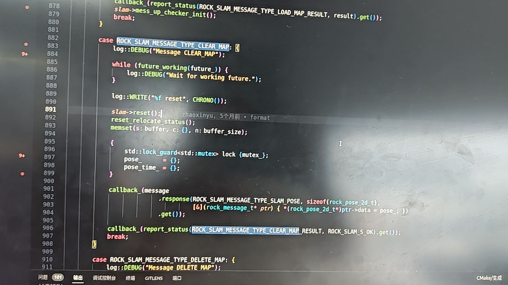

# 多线激光组 — 技术地图

> 回答：方案对不对；方向值不值得投；哪些是主问题。
> 来源标注格式：`（来源：YYYY-MM-DD 文档名）`

---

## 一、方案框架

| 维度 | 内容 | 来源 |
|------|------|------|
| 解决什么问题 | 割草机室外大场景（目标 3000m²+）的 3D LiDAR 建图与定位 | 割草机slam激光雷达需求 |
| 主要输入 | mid360 点云（10Hz）+ LiDAR 内置 IMU + ODO | 割草机slam激光雷达需求；信号流总结 |
| 核心链路 | IESKF 前端（实时位姿估计）→ 子图管理（KeyFramesManager，每 30 帧一个子图）→ 位姿图优化（Ceres，异步）→ 回环检测（ICP + 距离门限） | 回环小场景新方案；回环现阶段情况 |
| 输出给谁 | 优化后全局地图（PCD）+ 当前 3D 位姿（SLAM\_POSE\_3D）→ 导航模块 | 信号流总结 |
| 对整体定位系统的价值 | 提供室外大场景下无 GPS 依赖的建图与重定位能力 | — |

---

## 二、核心指标

| 指标名称 | 目标值 | 当前水平 | 差距 | 是否影响产品 | 来源 |
|---------|--------|---------|------|------------|------|
| 定位精度（3σ） | 【待填充】 | 0.014～0.036 m（Mid360-5m 极限机） | 【待填充】 | 是 | 2025-11-03 激光SLAM精度对比测试结论 |
| 支持最大场地规模 | 3000m²+ | 60～150m 场景已验证；2万平（>180m）失败 | 存在差距 | 是 | 回环现阶段情况；2026-04-12 口述【待确认】 |
| 回环后端优化耗时 | 不阻塞主线程 | < 1ms（异步后） | 已达标 | 是 | 2026-01-07 回环小场景新方案 |
| 子图构建单次最大耗时 | 【待填充】 | 402ms（105 场地） | 【待填充】 | 是 | 回环现阶段情况 |
| 存图耗时（24 子图） | 【待填充】 | ~27ms（优化后） | 【待填充】 | 否 | 2026-01-07 回环小场景新方案 |

---

## 三、当前瓶颈

> 以下来自材料，当前最新状态需与负责人确认（负责人【待确认】）。

1. **大场景（>2万平）Z 轴漂移导致首尾回环失败**：长轨迹运动中 Z 轴累积漂移，首末帧无法对齐，ICP 匹配超出阈值。材料截止 2026-01-07 显示未解决，当前状态【待确认】
2. 其他瓶颈【待填充，待组会文档或负责人确认】

---

## 四、优化方向

| 方向 | 当前进展 | 预期收益 | 成本/难度 | 风险 | 优先级 |
|------|---------|---------|---------|------|-------|
| 大场景回环 Z 漂移修复 | loop04 已有 Z 先验约束 + 2D/3D 混合匹配方案，效果待确认 | 支持 2万平+ 场景 | 高 | 2D 匹配精度损失 | 高 |
| 其他方向 | 【待填充】 | 【待填充】 | 【待填充】 | 【待填充】 | 【待填充】 |

---

## 五、技术依赖与外部接口

| 依赖项 | 来自哪里 | 当前状态 | 备注 |
|--------|---------|---------|------|
| 3D 点云数据 | mid360 雷达驱动层 | 稳定 | eRRMsgType\_LidarPointCloud，中间层已对接 |
| LiDAR 内置 IMU | mid360 驱动层 | 稳定 | eRRMsgType\_LidarImu |
| LiDAR 外参（BTL） | 驱动层 | 稳定 | eRRMsgType\_LidarParameters |
| ODO 数据 | 底盘驱动 | 稳定 | 复用扫地机已有消息 |
| SLAM 位姿输出 → 导航 | 导航模块 | 稳定 | ROCK\_SLAM\_MESSAGE\_TYPE\_SLAM\_POSE\_3D，IPC 广播 |
| 重定位接口 | 导航模块 | 【待确认】 | 部分接口材料标注"没有实现" |

来源：信号流总结

