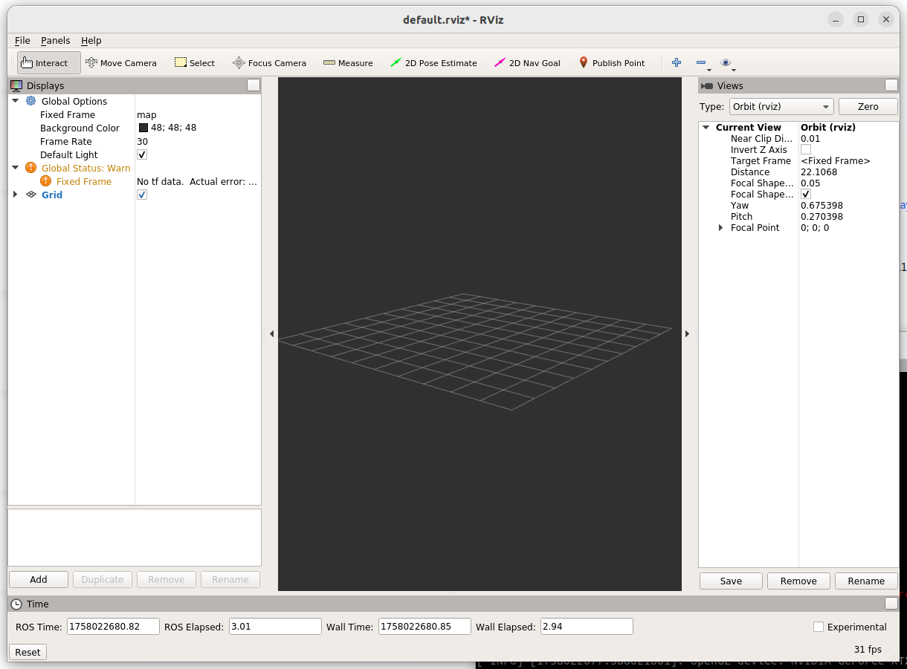

# Podman with ros melodic (ubuntu 22.04)

1. ubuntu 22.04

2. <https://docs.nvidia.com/datacenter/cloud-native/container-toolkit/latest/install-guide.html>

   1. 安装nvidia runtime环境

   2. 创建cdi配置

3. 更新podman到4.0.1以上

   1. podman new version <https://askubuntu.com/questions/1414446/whats-the-recommended-way-of-installing-podman-4-in-ubuntu-22-04>

4. podman pull docker.io/osrf/ros:melodic-desktop-full

5. podman run -it -e DISPLAY="$DISPLAY" --device [nvidia.com/gpu=all](http://nvidia.com/gpu=all) -v /tmp/.X11-unix:/tmp/.X11-unix:rw ros:melodic-desktop-full

6. vscode支持

   1. https://github.com/microsoft/vscode/issues/210033

