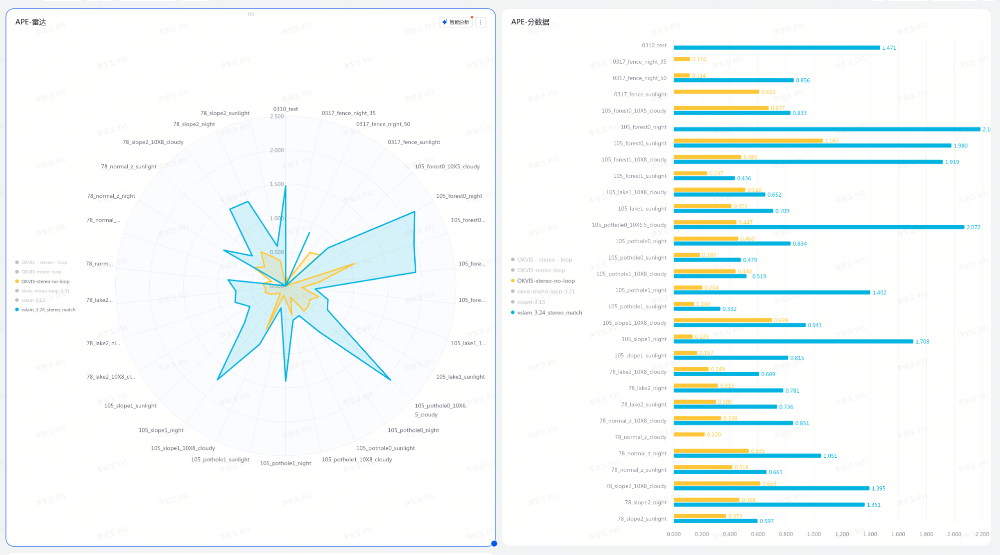
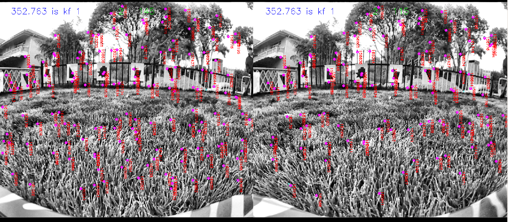
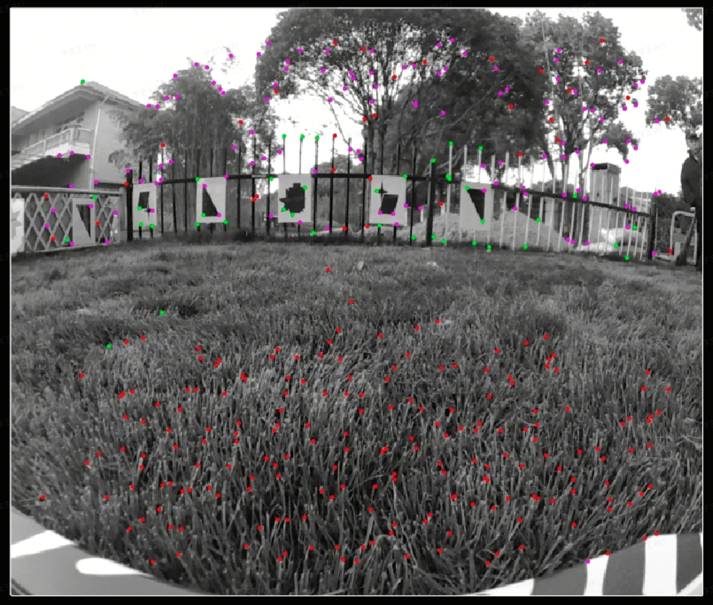

# 关于vslam向OKVIS方向转变的一些说明

# 一、当前现状

在割草机的双目vslam开发过程中，okvis2经过简单调试，在室内扫地机数据，室外割草机数据上的表现普遍地强于自研的vslam。

* 室内数据对比：[ 0122 数据分析](https://roborock.feishu.cn/wiki/Abi3wee5piKDaqkzO7kc12U6nBe)

* 割草机数据对比：[ Benchmark表格](https://roborock.feishu.cn/base/NkuabkuL5aD5EJsnQVZcd6AwnQh?table=blkXS8l9amkVoJiY)（okvis计算帧率7Hz，自研vslam计算帧率15Hz）

自研vslam在前端外点剔除、eskf调优、BA上还有很大的改进空间。

自研vslam上我们目前花费了比较多的时间，进行前端跟踪调优、eskf问题排查。

* 前端跟踪的提升比较明显。目前定性看是能看到光流在草地上也能够有一些比较稳定的跟踪结果。这在前视的vio中能够比远处特征点提供更好的几何约束。

* ESKF的部分也尝试分析了很久，针对这部分的优化总是没有特别好的效果。

* BA部分，我们想尝试加入边缘化项，但是耗时会很久，并且BA这里的逻辑，信息的使用方式需要再进行优化。

okvis2目前看起来，其运行的轨迹指标更准确，它的后端每一帧都做了BA，并且这个BA考虑了**IMU预积分项、边缘化项**、以及输出了每个landmark的质量，以供前端进行选择。它的后端是做的比较完善的，并且也与前端结合起来了，同时其本身有**回环检测、姿态图优化**相关的代码，研发起来会更快。未来即使在自研vslam上继续研发，基本上也是向着这个方向努力。

okvis2本身也有一些劣势，其基于特征点匹配的前端，**在草地上的有效匹配相较于光流法，非常少**。下图中，只有绿色点在okvis2中被认为是几何关系好的点。

运行时间效率上来说，自研vslam能够做到每帧平均计算时间：42.6ms，CPU平均占用率：test\_slam\_system: 107.6, vio\_ba: 24.8。

Okvis 能够做到每帧平均计算时间 300ms，目前在x5上运行，线程分的很散，没有做各线程CPU占用的统计。具体情况如下：

* Feature Detect & Descriptor ( 400 个 / frame) : 33ms

* Match : 84 ms （策略改变可以使match减少，42ms）

  * 2d - 3d match : 47 ms

  * 2d - 2d match : 24 ms

* Optimise : 147 ms （开启4线程，总耗时减少47ms）

* Marginalise : 35 ms（可与Feature Detect & Descriptor，Match并行，总耗时减少35ms）

注意能够在不改策略的情况下很快优化到300-35 - 47 = 218ms。目前okvis还有很多双目上的冗余计算，速度上也是有比较大的提升空间，预期不大改，精度损失不大的情况下能减少到218-42 = 176ms，并且由于残差减少，Optimize的时间会连锁下降。

# 二、想做出的改变以及计划

我们想将方案切换到okvis上来，基于okvis逐步引入vslam现有的成熟功能，基于以下理由：

1. okvis的精度是现成的有明显提升。目前在时间效率上预期能够比较快的提升，目前看x5平台，5～7Hz的运行比较有把握。精度上目前虽然还不够高，但是相对于vslam能有一个更高的起点。

2. 目前vslam在开源数据草地上的运行良好轨迹精度，在室内、割草机数据上无法复现。vslam的继续改进会需要在eskf+BA上做更多的策略级别的优化。耗时会比较持久，风险较大。

3. 目前往okvis上切，其后端技术目前能够弥补vslam后端的劣势，并且其代码前后端分离的比较好，目前看比较便于桥接自研vslam的前端。

基于此，在butchart上的开发我有以下计划：

1. okvis本身在割草机数据上面进一步适配（预计四月中旬完成）

   1. 问题排查（轨迹精度差的排查是数据问题还是算法问题）

   2. 双目策略的简化

2. okvis结合自研vslam光流前端，更多地运用地面点的信息（4月9日，得出结论这个方向是否要继续，如果继续预计4月20日左右完成）

3. 使能回环检测，以及回环检测的优化，构建全局图，先沿变建图，再弓字清扫。（4月9日开始，预计四月底能够基本运行起来）

4. okvis代码接入，上机部署（四月中旬开始）

5. 进一步提升速度，应用vslam的eskf以及BA的使用策略，以适应性能差的芯片（未来扫地机平台）

   1. 这相当于在目前OKVIS上降低BA的频率，以及引入vslam本身已有的eskf，都有技术基础，做起来相当于是在已有的功能上做拼接以及减法，风险更低，速度更快。

