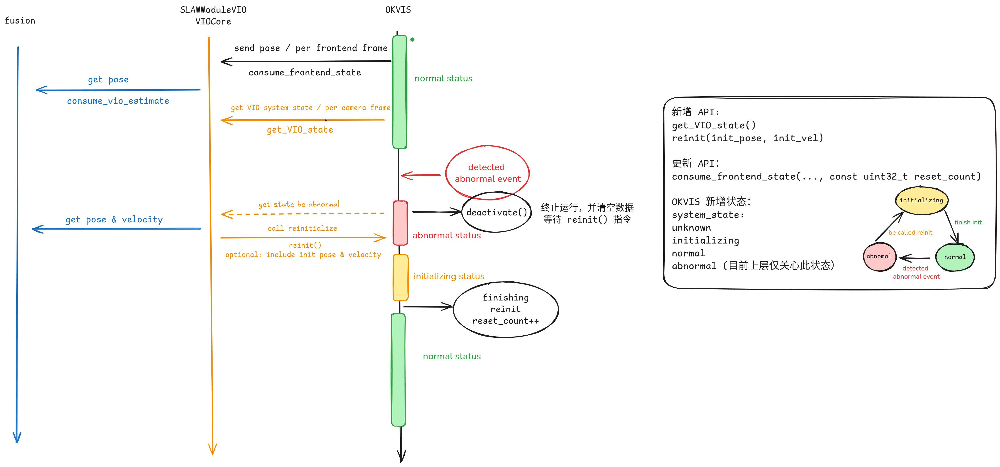
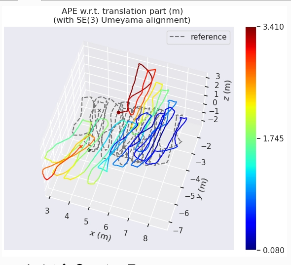
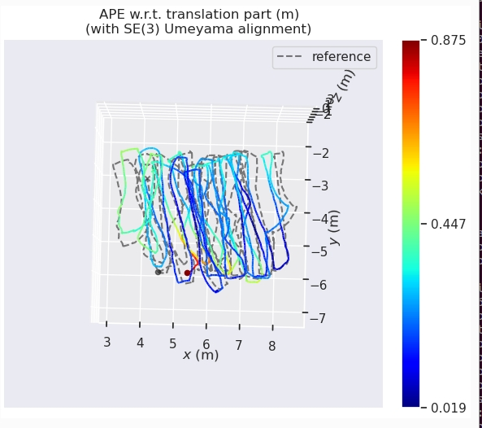

# OKVIS changelog

当前 PC 端仿真 **效果好&#x20;**&#x7684;参数版本；（上机耗时会过大）

```yaml
%YAML:1.0
---
# camera parameters
camera_parameters:
    timestamp_tolerance: 0.005
    sync_cameras: [ 0, 1 ]
    image_delay: 0.0 # [s] timestamp_camera_correct = timestamp_camera - image_delay
    online_calibration:
        do_extrinsics: True / False （部分数据无外参标定，精度更高）# whether to perform online extrinsics calibration
        do_extrinsics_final_ba: False
        sigma_r: 0.001
        sigma_alpha: 0.005
    image_frequency: 12.0
    start_time: 0.0

# imu parameters
imu_parameters:
    use: True
    a_max: 176.0
    g_max: 7.8
    sigma_g_c: 0.002
    sigma_a_c: 0.02
    sigma_bg: 0.01
    sigma_ba: 0.1
    sigma_gw_c: 2e-05
    sigma_aw_c: 0.002
    g: 9.81007
    g0: [ 0.001, 0.001, 0.002 ]
    a0: [ 0.1, -0.04, -0.12 ]
    # transform Body-Sensor (IMU)
    T_BS:
        [1.0000, 0.0000, 0.0000, 0.0000,
         0.0000, 1.0000, 0.0000, 0.0000,
         0.0000, 0.0000, 1.0000, 0.0000,
         0.0000, 0.0000, 0.0000, 1.0000]

# wheel encoder parameters
wheel_encoder_parameters:
    use: False / True (部分数据 无 wheel 约束，精度更高)
    wheel_delay: 0.0
    sigma_v: 0.01
    sigma_omega: 0.5
    perimeter: 0.7477
    halflength: 0.1775
    scale: 1194.0
    max_wheel_delta: 1.0
    unobs_info: 1.0
    # transform Body-Sensor (WheelEncoder)
    T_BS:
        [0.19442700, 0.00925700, 0.98087300, -0.14035200,
         -0.00566300, 0.99994900, -0.00831500, 0.00863600,
         -0.98090100, -0.00393800, 0.19446900, 0.34628500,
         0.00000000, 0.00000000, 0.00000000, 1.00000000]

# frontend parameters
frontend_parameters:
    detection_threshold: 50.0 / 42.0 / 38.0 # detection threshold. By default the uniformity radius in pixels
    absolute_threshold: 20.0 # absolute threshold for feature detection
    matching_threshold: 100.0 # BRISK descriptor matching threshold
    octaves: 0
    max_num_keypoints: 400 / 500 / 600 # restrict to a maximum of this many keypoints per image (strongest ones)
    keyframe_overlap: 0.58
    use_cnn: False
    parallelise_detection: True
    num_matching_threads: 4
    use_only_main_camera: false # if true, only camera0 is used for matchToMap and other operations (except matchStereo)
    max_frame_gap_seconds: 2.0 # maximum frame gap in seconds (trigger deactivation)
    use_detect_async_processing: False # enable asynchronous detection

# estimator parameters
estimator_parameters:
    num_keyframes: 4
    num_loop_closure_frames: 2
    num_imu_frames: 2
    do_loop_closures: False
    do_final_ba: False
    enforce_realtime: False
    realtime_min_iterations: 3
    realtime_max_iterations: 5
    realtime_time_limit: 0.03
    realtime_num_threads: 4
    full_graph_iterations: 15
    full_graph_num_threads: 2
    online_mode: True # whether to run in online mode
    use_async_processing: false # enable asynchronous frontend/backend processing
    max_batch_size: 2 # maximum number of frontend packages to batch for backend processing

# output parameters
output_parameters:
    display_matches: False
    display_overhead: False
    display_rerun: False # display rerun information
    enable_debug_recording: False # enable debug recording of frontend/backend packages
    debug_output_dir: /tmp/okvis_debug_output
```


# 7.21

**【detect async 逻辑】**

* feature detector & descriptor 抽取到单独的线程运行；

* Feature detect 功能需 重力方向做为输入，之前使用 last optimised pose 递推到当前帧，提取重力方向，现使用 last frontend package pose 作为近似；

**【参数变化】**

* use\_detect\_async\_processing: 控制 detect 线程异步模式开启 / 关闭；

注：在 PC 端仿真时，数据为 block 模式发送（非实时数据频率），use\_detect\_async\_processing 也需要置为 false；


# 7.11

**【OKVIS 系统重置逻辑】**

[ VSLAM初始化逻辑](https://roborock.feishu.cn/wiki/MkxlwBHfyiEHgHkEyzZcRl3SnLd)

* 目前暂未添加根据 wheel 积分初始化速度；（等此版本测试无 bug，再添加）

* 目前触发系统重置事件，仅为图像帧 time\_gap > 2s；（此阈值后续根据测试表现可调）

* 后续再添加其他触发事件，如速度异常（大于阈值的 n 倍）



**【参数变化】**

* max\_frame\_gap\_seconds 设置为 2.0，对应“触发系统重置事件，为图像帧 time\_gap > 2s”；


# 7.7&#x20;

**【okvis bug 修复】**[ Debug 工具记录](https://roborock.feishu.cn/wiki/F6XCwCElDioIpikLWOKcyOd4n5e)

1. debug 内存对齐问题：&#x20;

   * 含 Eigen 成员的类，不能在函数参数中按值传递；

   * new → aligned\_shared / aligned\_unique

   * vector → alignedVector

2. 关闭编译配置 “EIGEN\_USE\_BLAS”，此配置在 pc 端使用数值正常，x5 异常；（正在测试是否是因为 仅 OKVIS 有此编译配置，而 ceres & opengv 等其他使用 EIGEN 的库未开此配置，此处不一致，导致的异常）

3. debug 后端优化 ReprojectionError 残差 & jacobian 为 NAN 的问题；

   * 处理以下导致数值异常的情况：&#x20;

     * rad8 jacobian 存在未初始化 / 未定义运算；

     * landmark 无穷远 / 投影失败；

4. debug ransac 中的 nan / 未定义运算；&#x20;

   * 2d3d ransac 更换数值更稳定的 solver；

   * 2d2d ransac 前过滤观测视角过小的匹配，当连续帧相对旋转接近 I 时，solver 数值不稳定；

5. debug matchToMap 中未定义运算；


# 6.18

**【OKVIS 斜坡场景精度优化】**

1. 代码提交 PR-10 (in okvis)；

2. MK2-31\_105\_slope1\_10x8\_sunlight 运行对比：&#x20;

   1. develop 分支运行：

      

   2. wheel encoder jacobian 计算修复后：

      

**【功能变化】**

* wheel encoder error 约束由 3dof 残差推导为 6dof 残差，原因是：对 yaw 的误差求 jacobian，难以从 S 系链式递推到 B 系， 旧的实现有误，在斜坡上解析 jacobian 和数值 jacobian 差异较大，因此调整为 6dof 残差，使用四元数表示角度；

* wheel 的参数也重新调优；

**【参数变化】**

* sigma\_v: 0.01 -> 0.05 （为平衡打滑时的表现，增加了噪声，待打滑检测完成，还需要调整）

* sigma\_omega: 10.0 -> 0.5

* 新增：unobs\_info = 1.0

# 6.2

**【OKVIS 异步优化进展】**

1. 代码已完成，已提交 pr-8 (in okvis)；

2. 精度对比：在 MK2 的 10 组数据上，精度和同步版本接近；[Benchmark表格](https://roborock.feishu.cn/base/NkuabkuL5aD5EJsnQVZcd6AwnQh)

3. 耗时对比：在 x5 三组数据上，单帧处理耗时，分别为 142 / 150 / 180；[OKVIS-aarch64 耗时统计](https://roborock.feishu.cn/wiki/Hiq5wsKvzifW2dkEmqjcSt56nWg)

4. 内存消耗 <= 350 MB，CPU 占用 \~ 400%

**【新增功能 / 参数】**

1. online\_mode: 关闭回环逻辑，清理 dbow & old multiframe & old state 内存消耗；

2. use\_async\_processing: 切换同步 / 异步优化；

3. max\_batch\_size: 限制后端两次优化间，最多堆积 n 帧；

4. enable\_debug\_recording: 开启则逐帧保存前端 package & 后端 snapshot 中信息，方便在异步情况下，确认两个线程配合的细节；

5. 支持 DS 模型；

注1：max\_batch\_size 目前设置为 2，代表在前端 package 堆积 2 帧后，就要等待后端完成优化，更新 snapshot，再处理第 3 帧；增加这个限制的原因：

* 堆积更多的帧给后端处理，后端优化的窗口就会更大，下一轮需要花更多时间优化，恶性循环；

* 前端累积更多的帧，给后端一次性处理的策略，会导致系统精度下降；

注2：目前发现 match score 设置为阈值 140 ，outlier过多，参数版本回退：38，120，600；（或者想办法剔除 outlier？或者 2d - 3d 和 2d - 2d 用不同的 match score）

**【待优化的项】**

1. publish 时机调整：需修改为 frontend 轻量优化后；

2. ds 模型 debug：后端优化耗时还可下降 25 - 50 ms；

3. 斜坡场景调优：当前在斜坡场景上会大幅漂移；

4. 异步优化 loop closure 逻辑设计： 当前 loop closure 逻辑不 work；

**【文档记录】**

[ OKVIS2 前后端异步化改造](https://roborock.feishu.cn/wiki/EGKwwN5wsiKz0JktX7Jc2F2Ln2f)

# 5.7

**【功能调整】**

okvis 仓库 private/songs/dev 更新，已变基到 private/lzy/adapt\_okvis；

* 参数更新： 500 点 - 4 hz；

* frontend 仅做一次优化（iter = 3）

**【BUG 修复】**

* fix : wheel encoder error jacobian 计算；

* fix : okvis\_app\_synchronous 离线数据测试，数据流改回 block 模式；

# 4.11

**【新增功能 / 参数】**

* use\_only\_main\_camera：支持 light 模式， 2d - 3d / 2d - 2d 连续帧匹配仅在 cam0 上进行，仅关键帧做双目匹配生成新的 landmark；

# 4.1

**【新增功能】**

* 单目 + loop closure work；

**【BUG 修复】**

* Wheel Encoder Fix Bug :&#x20;

  1. 编码器溢出；

  2. body 系与 sensor 系混用；

  3. 欧拉角奇点；

  4. deque 时间戳时序问题；
