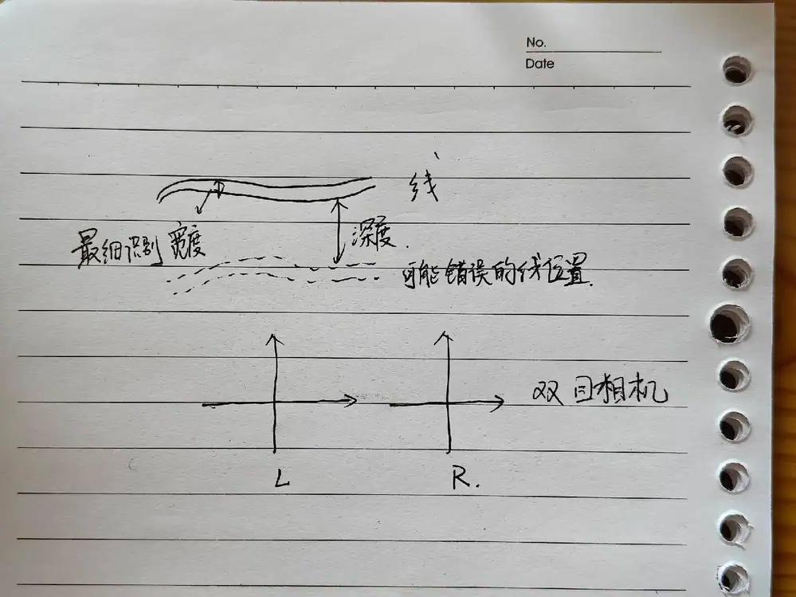
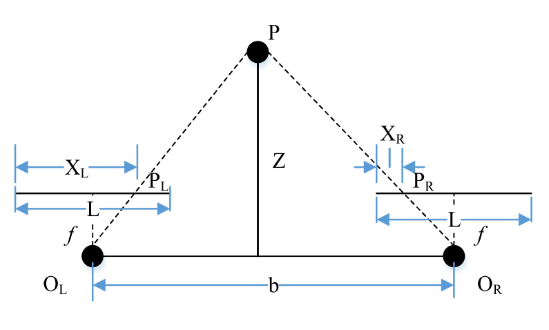
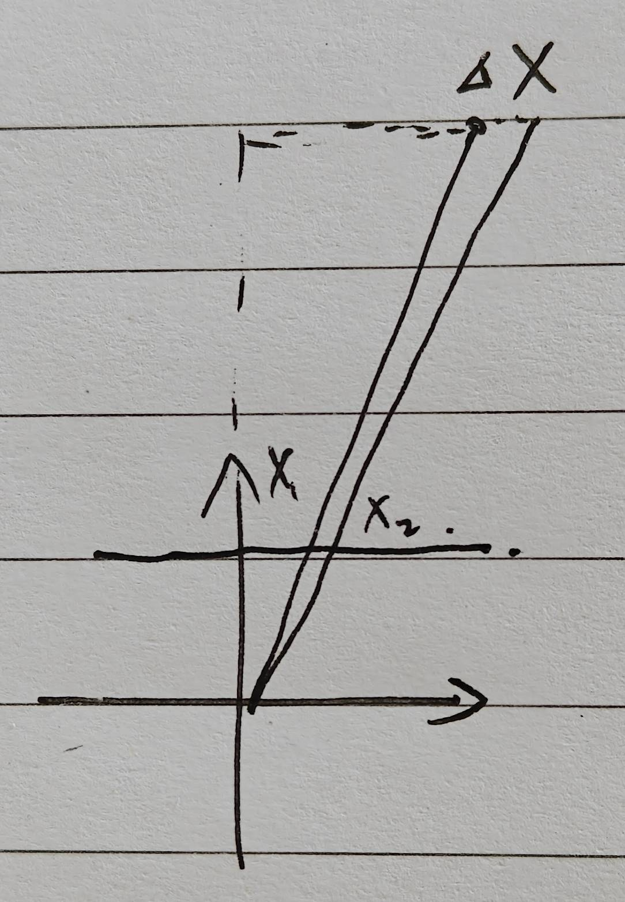

# 双目相机分辨率与障碍物分辨能力

# 1. 结论

1. 当前割草机双目相机：

   1. 深度方向分辨率（线与双目相机的距离偏差）

      1. 1m处4.9cm

      2. 0.3m处4.4mm

   2. 横向分辨率（可识别线的直径）（n为cv算法识别一条线需要的像素数）

      1. 1m处n/338米

      2. 0.3m处n/1227米

2. 若焦距、传感器的尺寸、双目基线长度不变，则

   1. 深度方向分辨率与sensor横向（或纵向）像素数成正比

   2. 宽度方向分辨率与sensor横向（或纵向）像素数成正比

3. 若焦距、像素宽度、双目基线长度不变，则

   1. 深度方向分辨率与像素数无关

   2. 宽度方向分辨率与像素数无关

# 2. 双目深度

## 2.1 基本关系

$$Z=\frac{f_x b}{d}=\frac{f b}{d s}$$

其中，Z为障碍物深度，fx为相机内参（一个焦距所包含的x方向像素数量，单位为像素），b为双目基线长度，d=XL-XR为双目视差（单位为像素），f为焦距（单位m），s为一个像素的宽度（忽略x和y方向的宽度差别，单位m/像素）

$$f_x=\frac{f}{s}$$

以割草机标定结果为例，fx=338，b=0.06m

## 2.2 最大可分辨深度

当视差为1个像素的时候，达到双目相机最大可分辨深度

$$Z_{max}=\frac{f_x b}{d}=\frac{f_x b}{1}=20.28m$$

## 2.3 深度方向分辨率

考虑一个物体与相机的距离处于两种情况：

$$d_1=\frac{f_x b}{Z_1}$$

$$d_2=\frac{f_x b}{Z_2}$$

当这两个相对位置产生的视差小于1的时候，我们无法区分这两个位置，此时位置的波动，就是我们计算深度的误差，以下称为深度方向分辨率

$$\Delta d=d_1=d_2=\frac{f_x b}{Z_1}-\frac{f_x b}{Z_2}=f_x b (\frac{1}{Z_1}-\frac{1}{Z_2})=f_x b\frac{Z_2-Z_1}{Z_1Z_2} \approx f_x b \frac{Z_2-Z_1}{Z_1^2}=f_x b \frac{\Delta Z}{Z^2}$$

上式约等于是在视差小的情况下，因为两次观测物体与相机的距离接近(统一记为Z)而成立。所以深度方向分辨率

$$\Delta Z=\frac{\Delta d Z^2}{f_x b}$$

在1m处是避障需要开始关注的位置：

$$\Delta Z=\frac{\Delta d Z^2}{f_x b}=\frac{1*1^2}{338*0.06}=0.049m=4.9cm$$

这个值代表了对1m处线材深度的不确定性。

如果在0.3m处，一定要开始减速，

$$\Delta Z=\frac{\Delta d Z^2}{f_x b}=\frac{1*0.3^2}{338*0.06}=0.0044m=4.4mm$$

这个值代表了对0.3m处线材深度的不确定性。

# 3. 线材识别

## 3.1 横向分辨率

一条线在图片上至少占有n(n取决于识别算法)个像素才能够被识别为线，假设最极限的情况，它的直径两侧刚好位于一个像素的左右两侧，即占满一个像素。

线的左侧：

$$\frac{x_1 s}{f}=\frac{X_1}{Z}$$

X1为线左侧在相机坐标系下的x坐标，Z为线与相机的距离，x1为线左侧像素值

同理，线的右侧：

$$\frac{x_2 s}{f}=\frac{X_2}{Z}$$

两式相减：

$$\frac{X_1-X_2}{Z}=\frac{\Delta X}{Z}=\frac{(x_1-x_2) s}{f}$$

$$\Delta X=\frac{\Delta x Z s}{f}=\frac{\Delta x Z}{f_x}$$

线材占满n像素，

n

1m处的可分辨线材直径：

$$\Delta X=\frac{\Delta x Z}{f_x}=\frac{n*1}{338}=\frac{n}{338}m$$

0.3m处的可分辨线材直径：

$$\Delta X=\frac{\Delta x Z}{f_x}=\frac{n* 0.3 }{338}=\frac{n}{1227} m$$

# 4. 像素数与深度分辨率、横向分辨率的关系

s的含义为像素宽度，假设sensor横向尺寸为lx，已知割草机横向像素数n=640，

$$f_x=\frac{f}{s}=\frac{f}{\frac{l_x}{n}}=\frac{f n}{l_x}$$

所以，如果传感器尺寸不变，单纯降低像素数，fx与像素数成正比，深度分辨率、横向分辨率与fx成反比，与像素数成反比（**像素数越多越好**）

如果一个像素宽度不变，焦距不变，则fx不变，深度分辨率、横向分辨率不变

# 5. 平铺纸

从上面的分析看，用传统CV方法，当前相机无法分辨平铺在地面的纸这种障碍物，因为它的厚度很难大于n/1227米。

只能通过深度学习的方式识别纸张。
