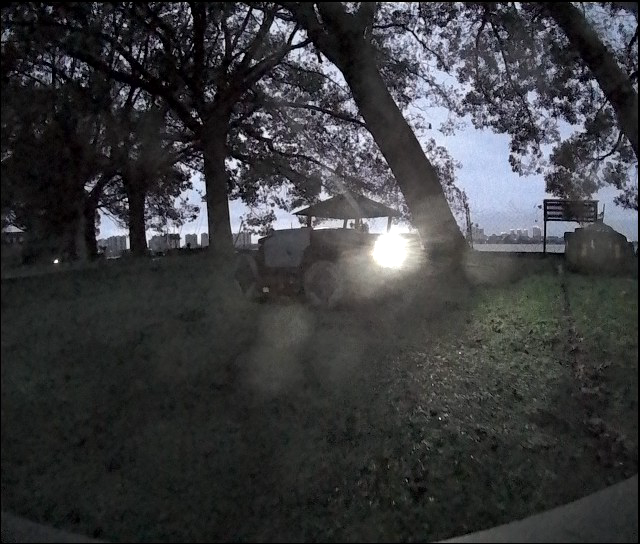
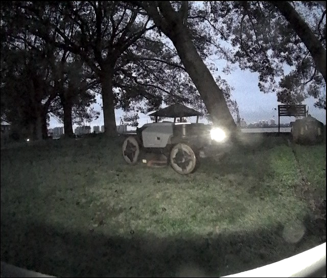
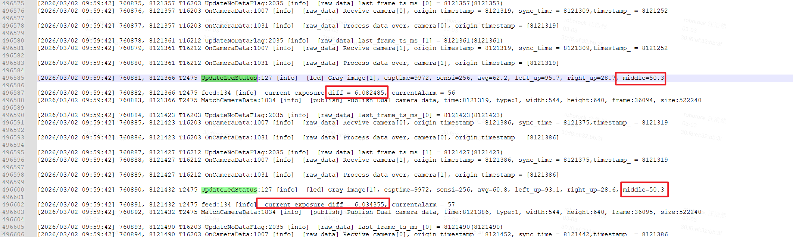
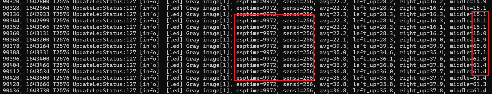
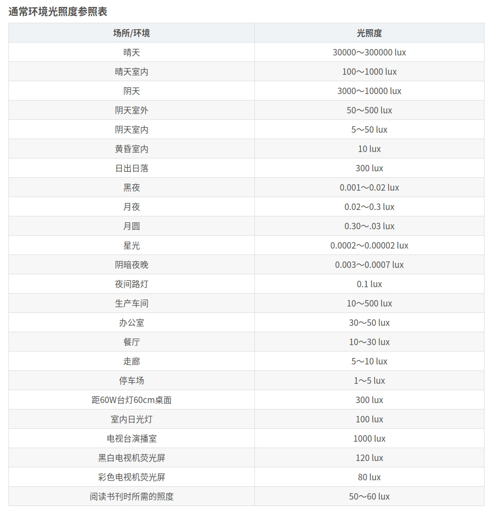

# 自动补光灯逻辑

# 1. 环境光亮度计算

$$L=\frac{f^2 \cdot I_{b}}{d^2 \cdot T \cdot S \cdot AG \cdot DG}$$

L为环境亮度，f为焦距，Ib为图片亮度，d为光圈直径，T为曝光时间，S为感光度，AG为模拟增益，DG为数字增益。

## 1.1 简化计算

由于光圈是定值，感光度几乎不变，焦距是定值，上面公式简化为

$$L=\frac{I_{b}}{T \cdot AG \cdot DG}k$$

K 一个待标定的系数。

考虑到对比度调节会引入一些非线性变化，考虑查表

| 光板亮度lux | 照度计值 | 图片名   | 曝光量=Ib/(T\*AG\*DG) |
| ------- | ---- | ----- | ------------------ |
| 1       |      | 图片名字1 |                    |
| 10      |      | 图片名字2 |                    |
| 100     |      | ...   |                    |
| 200     |      |       |                    |
| 500     |      |       |                    |

高于500lux一定不开补光灯，低于1lux一定开补光灯，因此不再需要标定

# 2. 自动补光灯

## 2.1 自动开关补光灯（简单方案）

### 2.1.1 ROI区域

自动开补光灯，只需要亮度低于选定的阈值，但自动关补光灯，环境亮度会收到补光灯的影响，所以选择补光灯最差的位置当成环境光进行评估。

选择图片左上角和右上角各100个像素（10\*10矩形范围）（暂定），计算平均图像亮度，作为1.1中Ib的计算结果。

### 2.1.2 开关逻辑

需要一个曝光量阈值EV1，一个帧数阈值f1，曝光量连续低于EV1的帧数达到f1,就开启补光灯，曝光量连续高于EV1的帧数达到f1,就开启补光灯。

## 2.2 自动补光灯升降档位（高级方案）

### 2.2.1 自动升降档曝光度阈值选择

目前对补光灯的需求为中间左侧3m白亚克力板可以识别角点，0.45m Aprilgrid识别率100%。将这个位置作为ROI区域，对应的照度作为夜晚良好观测照度阈值（L2），对应曝光量阈值EV2。

### 2.2.2 补光灯占空比档位

0%，10%，20%，30%，40%，50%

离散调节占空比的好处为，可以给自动曝光一些阈值，选择动态性能和噪声更优的曝光时间和增益。

### 2.2.3 自动升降档逻辑

当ROI区域曝光量小于EV2，则升一档，直到50%占空比；

当ROI区域曝光量大于EV2，且

$$T<(T_{max}-T_{min})*0.1+T_{min}$$

（其中，T为曝光时间，Tmax为最大曝光时间，Tmin为最小曝光时间。）

时，降一档。

### 2.2.4 潜在问题

1. 有可能震荡，需要调整阈值

2. 有可能曝光时间长，增益高，需要调整阈值

## 2.3  LED遮挡判断

当前能力只能判断当LED开启时，是否有遮挡

当前方案：对比打开和关闭LED前后，图像中下部ROI区域的图像亮度。如果小于某一阈值，则认为遮挡

问题：某些场景下，亮度值变化不够明显，导致误判

优化方案<可考虑>：增加曝光强度E的判断：

E的计算方式：T \* Senti，当E(off)/E(on) > 0.8，且同时满足亮度变化值时，认为遮挡

此处涉及到T与Senti的稳定性判断：初步可以这样判断：

delta(T)与delta(Senti) < 3%，持续5帧

实测结果如下：

1. 上述问题中，E基本不变

2. 本地测试，遮挡相机，E也基本不变，但middle变化不明显

# 3. 环境光照度参照表

# 4. 参考资料

https://blog.csdn.net/ymzhu385/article/details/140961944

https://blog.csdn.net/an\_ape\_fengfeng/article/details/129556112
