# 传感器问题汇总

其中标 <**TPM>** 为需要TPM向尝试沟通反馈的项

# 一、问题项

## 1.1 RTK问题

### 1.1.1 \<TPM> 普遍存在差分龄期比正常大很多，且呈现有规律的递增，甚至断连和串频。

猜测原因：lora的空中波特率和数据量大小不匹配。lora无线电的跳频做的还不够完美。

期望：差分龄期能和以前测试模组时候的水平相当 （平均3秒以下，且稳定在2左右）

现状1  bug387157 &#x20;

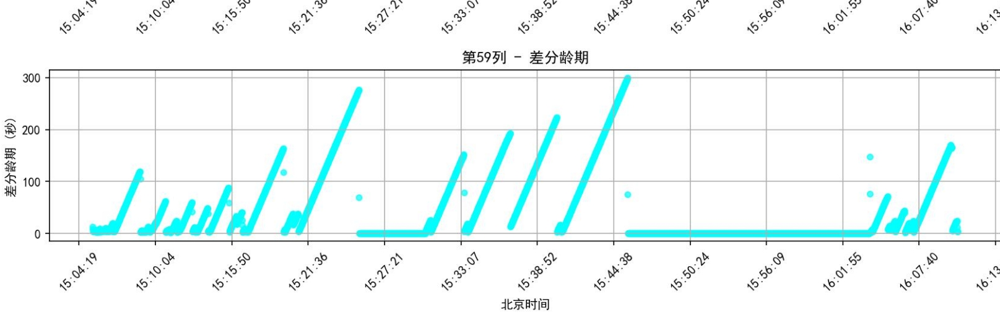

现状2 eg bug 400018&#x20;

&#x20;       &#x20;

&#x20;  ，

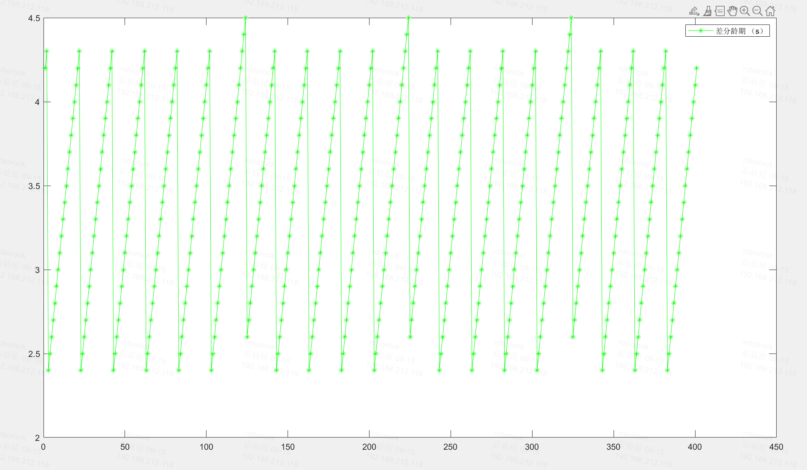

期望达到模组水平，模组数据 [ 无北斗2和qzss系统的和芯和司南rtk静态对比测试](https://roborock.feishu.cn/wiki/H7AawMPVcij2F2kxJjucEO8RnIh?from=from_copylink) &#x20;

&#x20;     上面 图横坐标是时间，纵坐标是差分龄期

&#x20;    下面 图  横坐标是点位（当时测试的十个rtk不同环境的点位），纵坐标是差分龄期，表示不同环境lora的差分龄期的平均值可以稳定在2秒。

&#x20;  &#x20;

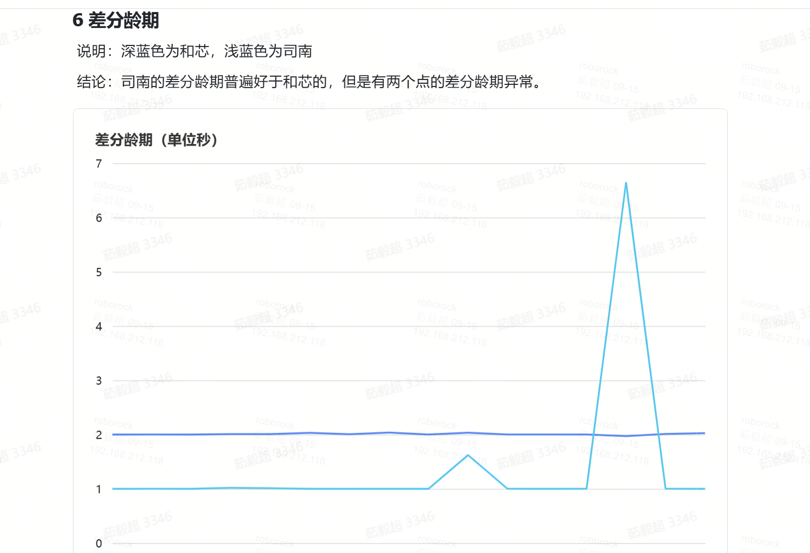

电台 &#x20;

09.18: 模组和机器的差异是因为模组测试是定频，现在机器是跳频。

只需跟踪放羊数据差分龄期大的问题，可能是因为测试场地基站太多干扰&#x20;

09.26: 测试场RTK基站数量已减少，看放羊数据差分龄期是否正常&#x20;

## 1.2 双目模组问题

### 1.2.1 时间戳 IMU = camera + 13 ms （camera - IMU 外参标定计算得到）

http://pms.rockrobo.internal/index.php?m=bug\&f=view\&bugID=362706

5.28 未确定方案

#### 1.2.1.1 分析

## 1.3 MCU上传感器问题

### 1.3.3 时间戳 IMU = wheel + 20 ms (20 \~ 30 ms) （低优先级）

http://pms.rockrobo.internal/index.php?m=bug\&f=view\&bugID=362674

### 1.3.6 odo上报数据时间戳多次重复

http://pms.rockrobo.internal/index.php?m=bug\&f=view\&t=html\&id=380432

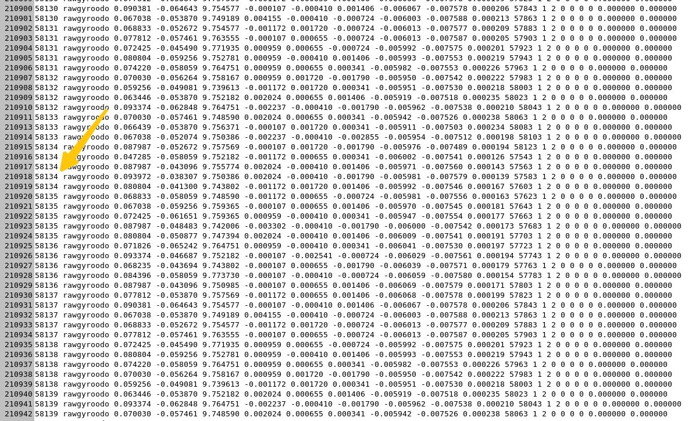

07.17：检测到gyroodo有10次重复时间戳，报错F232

08.26：同样是广播阻塞

09.15：ifa见面会

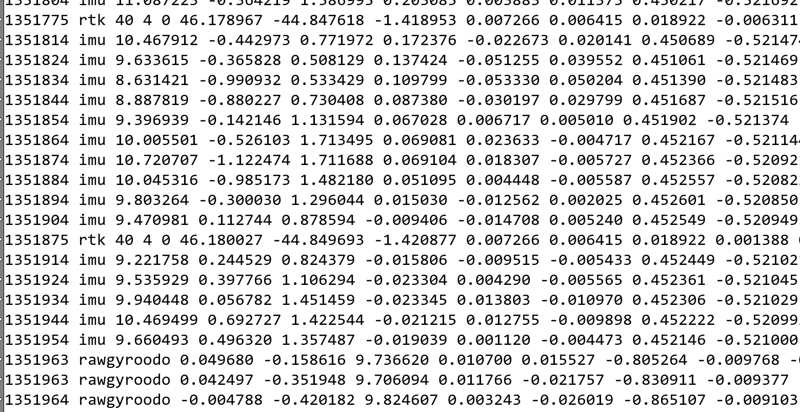

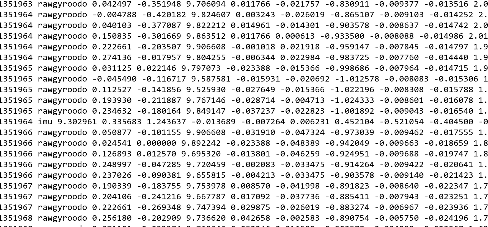

9.15：mcu时间戳正常，AP广播节点阻塞&#x20;

自旋锁改互斥锁，没有根本解决

### 1.3.8 odo的MCU时间戳波动大

Bug#385391 -  Butchart 【MCU驱动】odo的MCU时间戳波动大
<http://192.168.111.52/index.php?m=bug&f=view&t=html&=&bugID=385391>

08.25更新：

[ 轮速计mcu时间戳情况](https://roborock.feishu.cn/wiki/Z8IewcTSAiVFd0k5MtacvKxnnHd?open_in_browser=true)

0915更新

https://auto.roborock.com/#/mower\_sheep/report?id=199

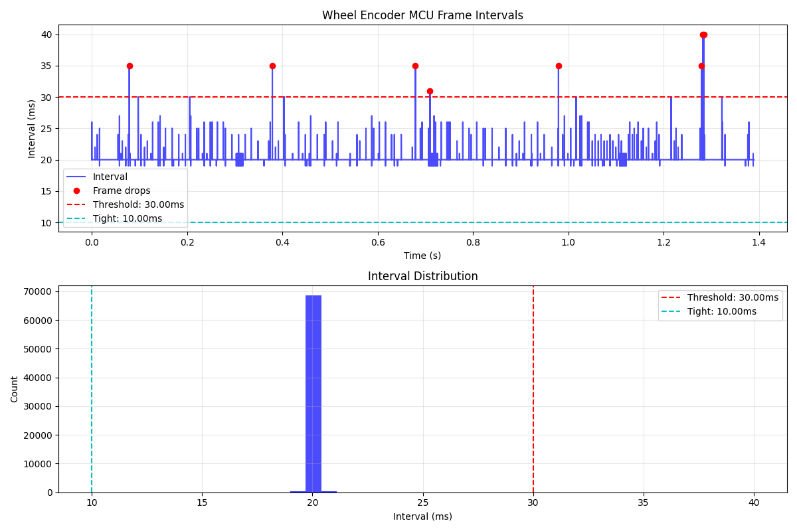

9.15：mcu任务阻塞 &#x20;

时间戳和odo数据不一致，有25ms和35ms&#x20;

### 1.3.9 odo丢帧

Bug#402975 - \[v0873]\[B1-24]\[外场60栋]机器在进行全局弓字割草时避障失败卡在树上（2/2）

http://pms.rockrobo.internal/index.php?m=bug\&f=view\&t=html&=\&bugID=402975

Bug#402820 - \[V3281]\[B2-106]\[外场-78栋]  沿边第二圈误识别障碍物太多，导致机器卡死不动，人为脱困后直接回充 -From 402790

http://pms.rockrobo.internal/index.php?m=bug\&f=view\&t=html&=\&bugID=402820

Bug#394883 - 【定位横向漂移，卡边界】\[0279]\[B1-pro-008]\[外场-78号]建完图后开始任务，出桩后，定位失败卡死不动。

http://pms.rockrobo.internal/index.php?m=bug\&f=view\&t=html&=\&bugID=394883

Bug#399269 - \[V0895冒烟问题]       \[V0789]\[78号]\[B1-06]机器弓子割草过程中大幅度摆动（4/4）

http://pms.rockrobo.internal/index.php?m=bug\&f=view\&t=html&=\&bugID=399269

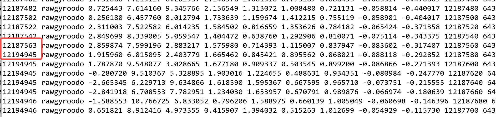

09.15 mcu任务阻塞，09.15合入

09.30 仍有odo丢帧bug出现

Bug#410370 -  \[V1061]\[78号]\[B1-12]机器在桩内，app点击开始任务，机器后退一点点距离后，停在原地不动（3/3）

http://pms.rockrobo.internal/index.php?m=bug\&f=view\&t=html&=\&bugID=410370

### 1.3.10 odo 数据堆积

0925-0930的日志发现，odo数据出现几百ms无数据（图像与imu正常），而后快速塞入大量数据的问题

| SN             | UID              | 日期       | 包号     | 时间戳   |
| -------------- | ---------------- | -------- | ------ | ----- |
| R0051X53420004 | rr65a94abfd11830 | 20250926 | 000526 | 44342 |
| RCSEEX53500058 | rr664f030fe05840 | 20250925 | 042170 | 8699  |
| RCSEEX53500058 | rr664f030fe05840 | 20250928 | 042205 | 5123  |
| RCSEEX53500058 | rr664f030fe05840 | 20250928 | 042210 | 很多次   |

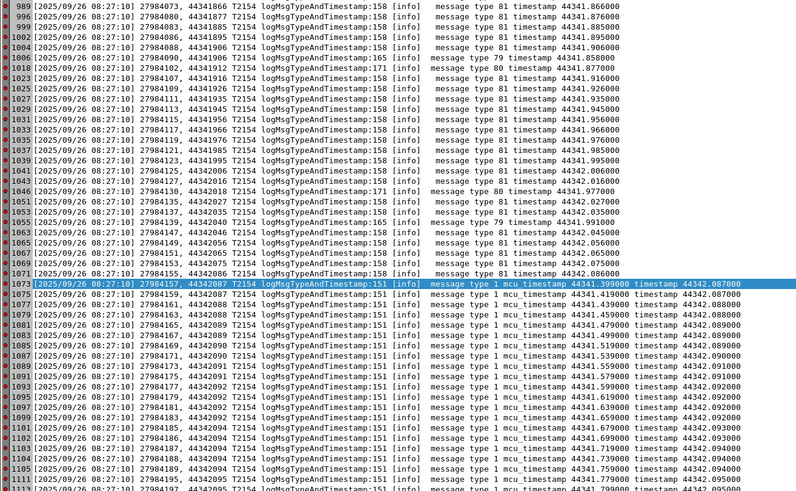

# 二、需求项：

1. 需要上传差分龄期和经纬度。

&#x20;   差分龄期可以观察lora是否正常工作。差分龄期如果稳定5秒内，固定解可信。

* 基站位置移动报警。

* 配置差分龄期超过10秒就退出固定解。

* 需要供应商提供一个指标，表示移动站卫星环境的好坏，既可以方便我们判断固定解的可信度，也为日后做信号强度地图做准备。

# 三、已解决

## 1.1 RTK问题

### 1.1.1  (Done)<**TPM>** RTK在整机上和单板相比，固定解比例和固定解精度均下降

[ RTK模块测试](https://roborock.feishu.cn/wiki/P9JEwCDwYiVU63kmt4IciS5Tnzg)

[ RTK状态统计](https://roborock.feishu.cn/wiki/Nst1wlHQQiEo6Rk6BS3c0FOunng)

5.22：TPM反馈：测试的三台机器，其中两台是RTK天线装反了，改过后回归测试正常；另一台机器是测试环境不同，改成相同的测试环境正常。

MK2-22, MK2-23固定解比例低就是因为RTK天线装反了，测试其他机器正常

### 1.1.2 (Done) RTK相对于IMU有时间延迟，IMU = RTK -200 ms  (200 \~ 300 ms)

http://pms.rockrobo.internal/index.php?m=bug\&f=view\&bugID=362746

5.28 和供应商拉会，已经确定报文时间戳没问题

[ MK2多传感器同步分析](https://roborock.feishu.cn/wiki/JsXXwlrpminBOfkHTRAcIf0Knj5)

### 1.1.3 (Done) RTK消息越收越慢

http://pms.rockrobo.internal/index.php?m=bug\&f=view\&bugID=362748

5.28 PPS错误信号导致

### 1.1.4  (Done) <**TPM>**  RTK固定解跳变

http://pms.rockrobo.internal/index.php?m=bug\&f=view\&bugID=362752

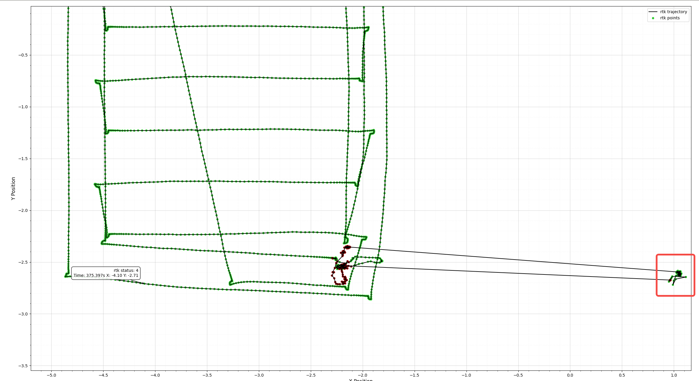

### 1.1.5 (Done) RTK偶发秒级丢帧

http://pms.rockrobo.internal/index.php?m=bug\&f=view\&bugID=362755

5.28 RTK频段改为调频

### 1.1.6（Done) RTK时间同步错误

Bug#395618 - \[v2919]\[B1-110]\[外场-105号] 点击建图，机器可以通过APP遥控，但APP没有轨迹显示

http://pms.rockrobo.internal/index.php?m=bug\&f=view\&t=html&=\&bugID=395618

Bug#394724 - \[海外立陶宛] 机器受到APP内错误定位影响，无法操控

http://pms.rockrobo.internal/index.php?m=bug\&f=view\&t=html&=\&bugID=394724

Bug#394675 - \[海外立陶宛] 机器点击回桩按钮可以回桩，无法自动回桩

http://pms.rockrobo.internal/index.php?m=bug\&f=view\&t=html&=\&bugID=394675

Bug#396829 - \[海外匈牙利]四驱MK2定位漂移

http://pms.rockrobo.internal/index.php?m=bug\&f=view\&t=html&=\&bugID=396829

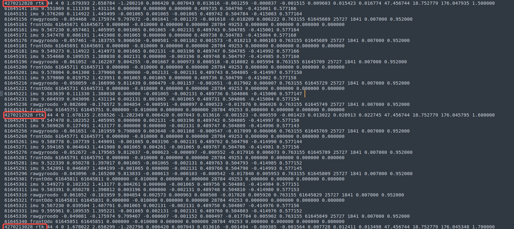

08.25解决

### 1.1.7 (Done) RTK有秒级延迟

Bug#396037 -  \[V0703]\[78号]\[MK2-17]机器行走左右摇晃

http://pms.rockrobo.internal/index.php?m=bug\&f=view\&t=html&=\&bugID=396037

Bug#394712 - \[沿边定位跳，脱困失败]\[V2891]\[105号]\[B1-137]机器未沿边就前往下一个区域弓字

http://pms.rockrobo.internal/index.php?m=bug\&f=view\&t=html&=\&bugID=394712

Bug#396965 - \[V3021]\[78号]\[B1-003] 寻找边界途中机器乱跑

http://pms.rockrobo.internal/index.php?m=bug\&f=view\&t=html&=\&bugID=396965

Bug#394227 -  \[定位跳动，脱困失败]\[V2891]\[105号]\[B1-137]机器弓字时遇到障碍物卡死

http://pms.rockrobo.internal/index.php?m=bug\&f=view\&t=html&=\&bugID=394227

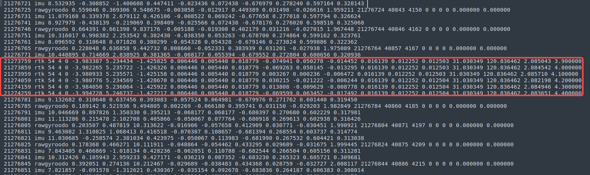

RTK debug信息导致

### 1.1.8 （Done）RTK时间同步错误

RTK和imu的时间同步差1s，导致机器轨迹歪歪扭扭

Bug#396965 - \[V3021]\[78号]\[B1-003] 寻找边界途中机器乱跑

http://pms.rockrobo.internal/index.php?m=bug\&f=view\&t=html&=\&bugID=396965

Bug#403833 - 【Monet】【B1-32】机器开始割草后，行走异常，一直出现左右摆头和重新定位的状态（3/3）

http://chandao.roborock.com/index.php?m=bug\&f=view\&t=html&=\&bugID=403833

9.16：已经解决，测试没有带上这个commit，9.9合入

GPRMC每10s同步一次，如果一次错误不会导致一直有错误offset

## 1.2 双目模组

### 1.2.2  (Done) 个别机器厂商传感器参数导致行差大

http://pms.rockrobo.internal/index.php?m=bug\&f=view\&bugID=362778

等待测试我们自己标定的机器是否有这个问题

目前正在排查是标定问题，还是模组本身问题（5.23中间层旋转bug和驱动层校正矩阵写到了双目之间的外参旋转矩阵上。2台待测）

2025.5.23 更新

### 1.2.3 (Done) 图像数据丢帧问题&#x20;

http://pms.rockrobo.internal/index.php?m=bug\&f=view\&bugID=362690

5.27 优化后，不再出现，已经解决

### 1.2.4 (Done) Bug#385252 - 【Butchart】【中间层】B1机器左右目曝光不一致

<http://192.168.111.52/index.php?m=bug&f=view&t=html&=&bugID=385252>

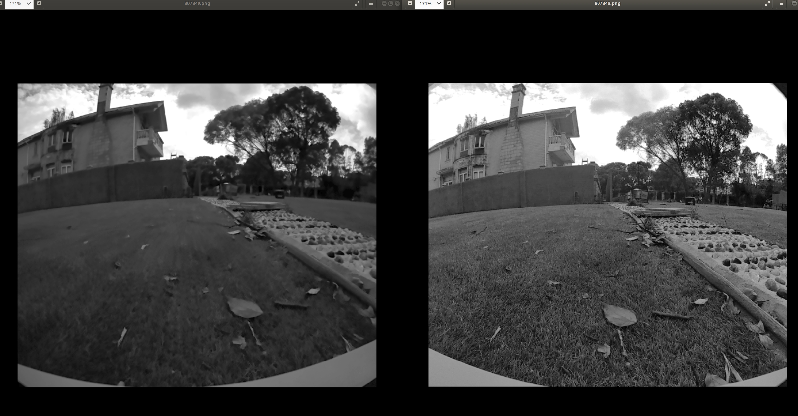

不知道跟之前进的曝光最大值是否有关系？

### 1.2.5  (Done) 数据堆积（短时间塞入大量odo、imu、图像数据）

Bug#398306 -  \[v3057]\[B1-112]\[外场-105号]主机沿边割草时在边界卡住原地不动（1/2）

<http://pms.rockrobo.internal/index.php?m=bug&f=view&t=html&=&bugID=398306>

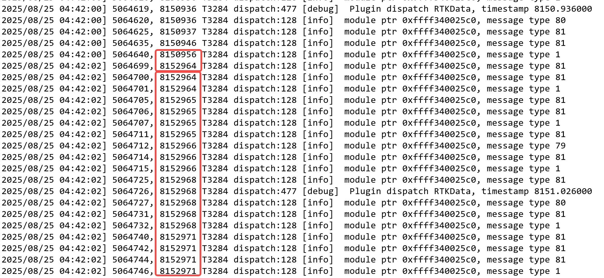

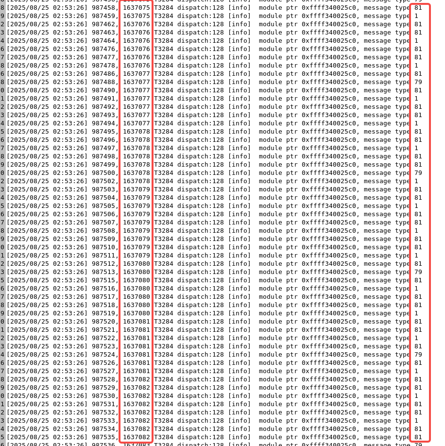

广播msg会阻塞，包括odo, imu和图像，怀疑是io问题

## 1.3 MCU上传感器问题

### 1.3.1 ODO数据时间戳不稳定，20±5ms大量波动（被1.3.8覆盖）

http://pms.rockrobo.internal/index.php?m=bug\&f=view\&bugID=362561

5.28 需要确认5ms的波动时间过长

### 1.3.4  (Done) AP和MCU时间同步，时间戳差距较大

http://chandao.roborock.com/index.php?m=bug\&f=view\&t=html\&id=382572

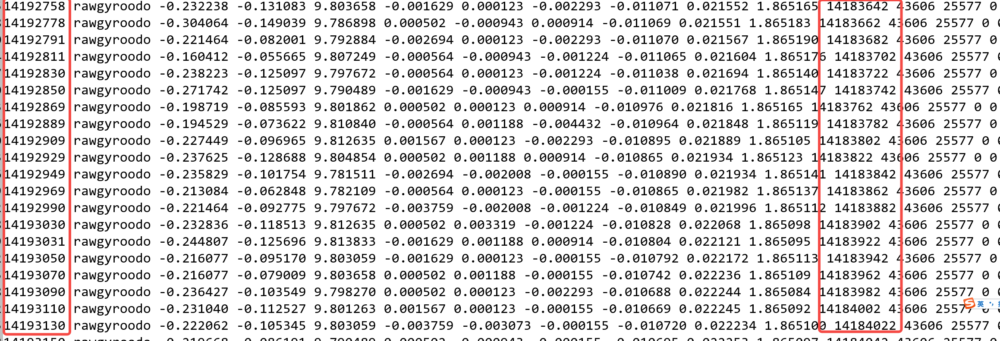

### 1.3.5  (Done) 电机到主控，后轮Odo丢包严重

http://pms.rockrobo.internal/index.php?m=bug\&f=view\&bugID=384394

### 1.3.7  (Done) 长时间（10s）收不到odo数据

http://pms.rockrobo.internal/index.php?m=bug\&f=view\&bugID=383451

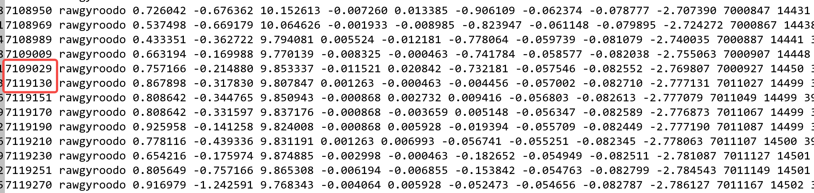

