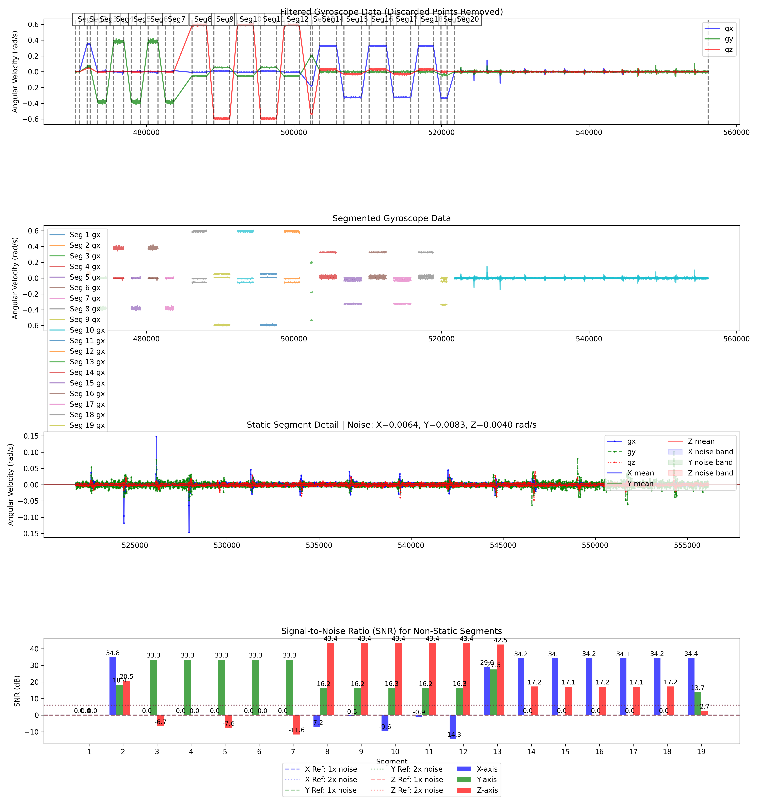
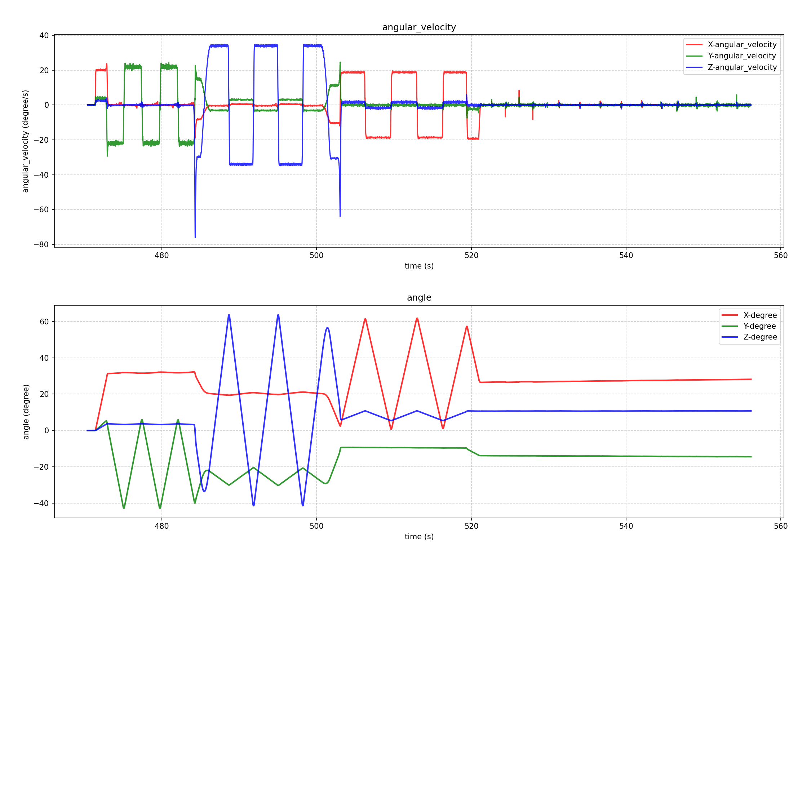
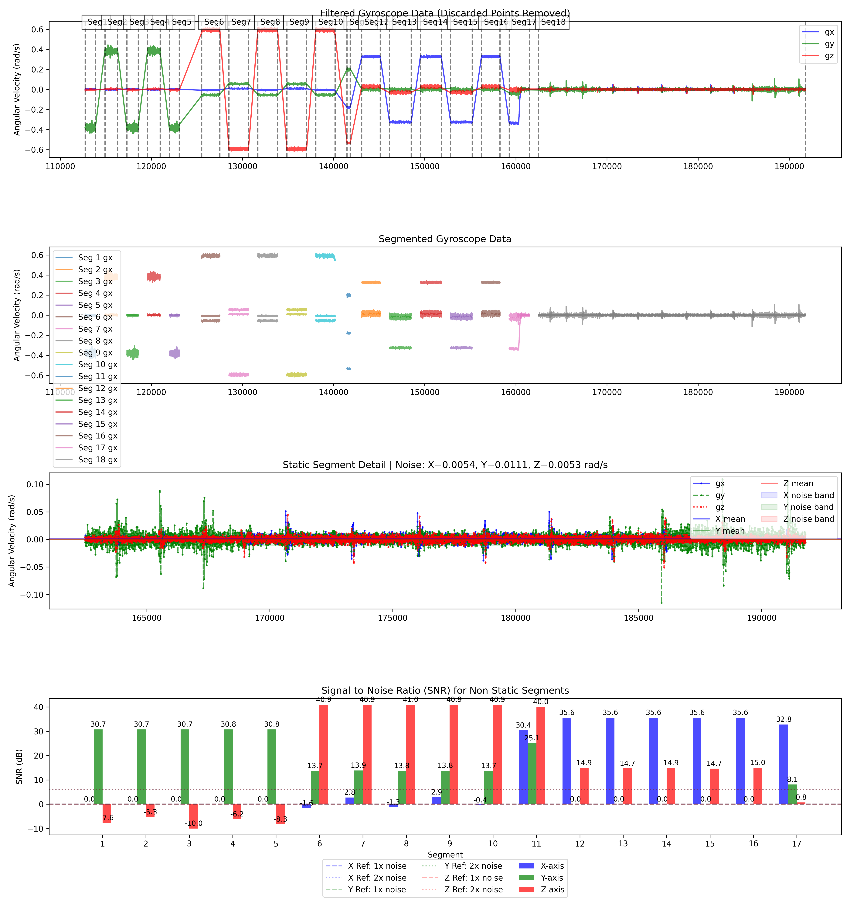
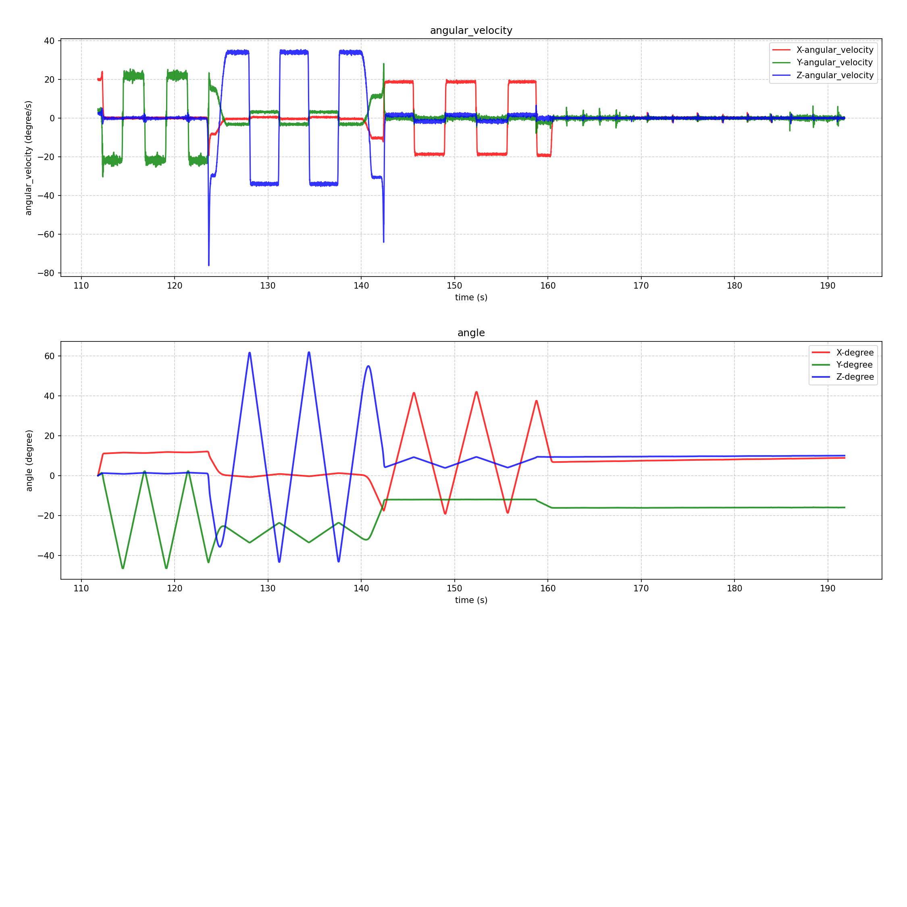
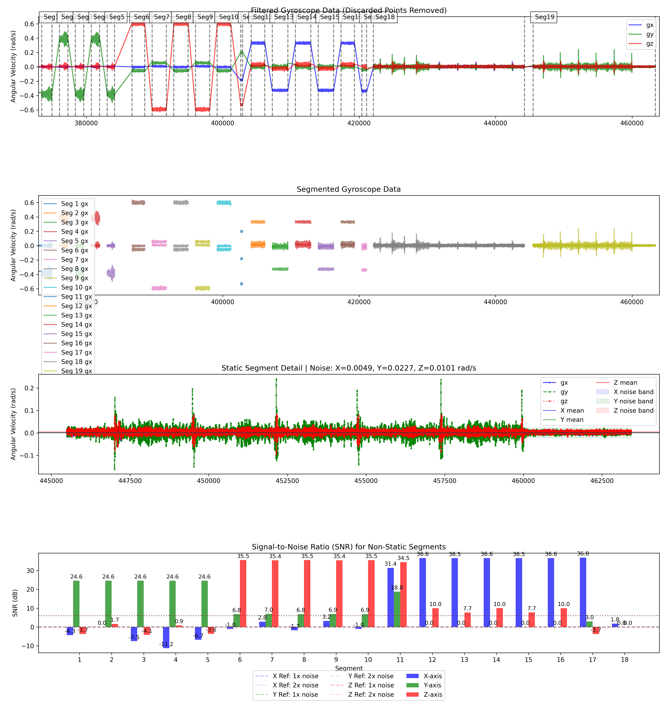
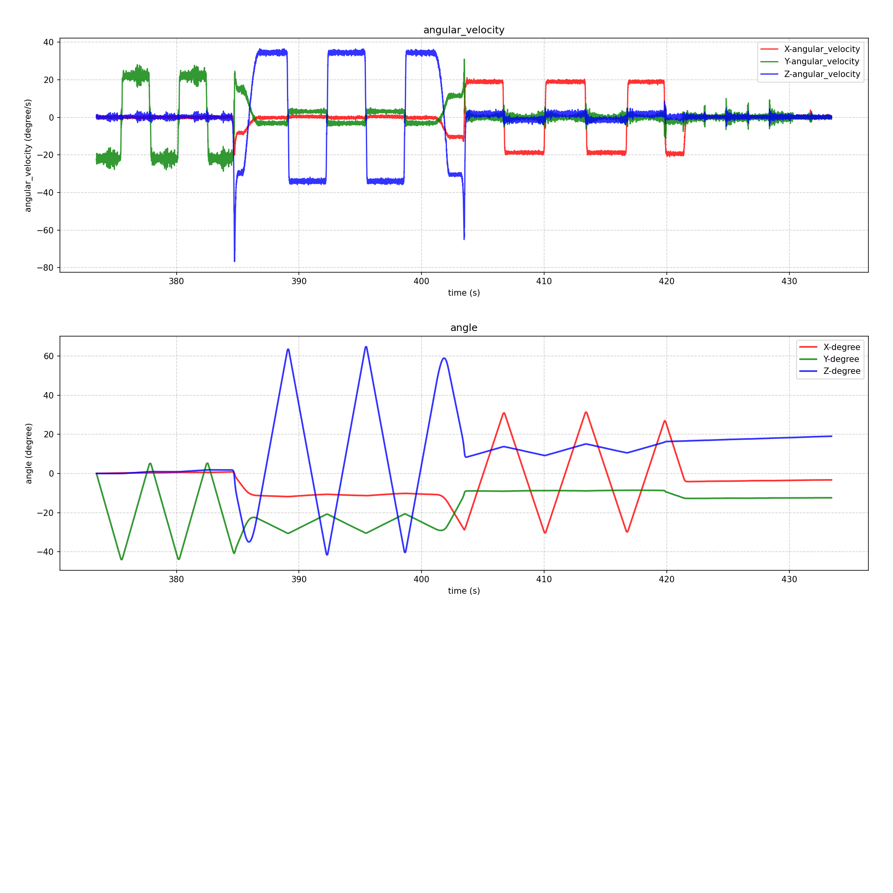
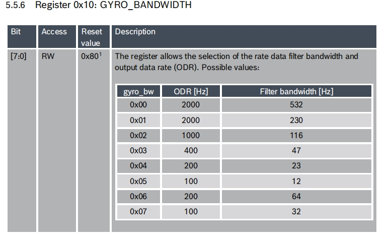

# IMU采样频率和噪声分析

# 1. 结论

1. “100Hz采样，滤波带宽32Hz”（以下简称100\_32）与“200Hz采样，滤波带宽64Hz”（以下简称200\_64）相比，**y轴、z轴噪声明显更小，信噪比提升约3dB，x轴无明显变化**。

2. 200\_64与“1000Hz采样，滤波带宽116Hz”（以下简称1000\_116）相比，**y轴、z轴噪声明显更小，信噪比提升约5dB，x轴无明显变化.**

3. 但这个信噪比提升对比采样频率提升对vslam的收益，待动态数据验证。

4. X 轴的结果与其他两轴不一致的原因，从100\_32静态段局部图可以看出，在静止后，x轴有几次噪声尖峰出现，因此计算的噪声更大。

5. 从角度积分的结果看，运动段无法看出明显区别。

   1. 静止零漂从100\_32到1000\_116明显增大

## 1.1 后续action

用100\_32,200\_64,1000\_116三种参数，采集同一个vslam动态场景，看定位效果。

实验条件：

1. 时间同步更正

2. Camera 时间戳改为曝光时间

# 2. 结果

## 2.1 几个典型区域信噪比对比

|           | y轴角速度约0.4rad/s(dB) | z轴角速度约0.6rad/s(dB) | x轴角速度约0.4rad/s(dB) |
| --------- | ------------------ | ------------------ | ------------------ |
| 100\_32   | 33.3               | 43.4               | 34.1               |
| 200\_64   | 30.7               | 40.9               | 35.6               |
| 1000\_116 | 24.6               | 35.4               | 36.5               |

## 2.2 静止后gyro的漂移（角度）

### 2.2.1 100\_32

|                | t/s                | x/degree             | y/degree             | z/degree              |
| -------------- | ------------------ | -------------------- | -------------------- | --------------------- |
|                | 525.005            | 26.5464442007477     | -13.957291337531     | 10.6966457066294      |
|                | 555.008            | 28.1010551412909     | -14.4275925136914    | 10.7183393497954      |
| delta          | 30.003000000000043 | 1.5546109405431991   | -0.47030117616039924 | 0.021693643165999532  |
| 漂移速度（degree/s） |                    | 0.051815183166456585 | -0.01567513835817747 | 0.0007230491339532548 |

### 2.2.2 200\_64

|                | t/s               | x/degree            | y/degree             | z/degree             |
| -------------- | ----------------- | ------------------- | -------------------- | -------------------- |
|                | 163               | 6.95640016697512    | -16.1625797927621    | 9.35519254108793     |
|                | 191.105           | 8.81214002024301    | -15.9999181633443    | 9.98081019961993     |
| delta          | 28.10499999999999 | 1.85573985326789    | 0.16266162941779783  | 0.6256176585319988   |
| 漂移速度（degree/s） |                   | 0.06602881527371965 | 0.005787640256815438 | 0.022260012756875967 |

### 2.2.3 1000\_116

|                | t/s               | x/degree            | y/degree            | z/degree            |
| -------------- | ----------------- | ------------------- | ------------------- | ------------------- |
|                | 445.696           | 5.75129540087056    | -0.883911415703839  | -163.864127082727   |
|                | 463.42            | 7.08391943002826    | -0.310666081703528  | -160.300431554852   |
| delta          | 17.72399999999999 | 1.3326240291577003  | 0.573245334000311   | 3.563695527875012   |
| 漂移速度（degree/s） |                   | 0.07518754396060151 | 0.03234288727151384 | 0.20106609839060113 |

## 2.3 结果图说明

### 2.3.1 图一

第一张图为原始数据的分段结果。因为原始数据角速度出现明显跳变，利用跳变信息，将连续数据分为多段，方便对于不同的激励计算信噪比。

由于数据起点有细微差异，分段算法不够完善，两种采样方法的分段结果有一些区别。

最后一段始终为静止，因此可以作为静止段评估静态噪声。

### 2.3.2 图二

因为角速度跳变的位置其实也有采样，为方便计算信噪比，将跳变位置的数据排除。设定参数跳变点左右各去除50个点（100\_32）,各去除100个点(200\_64)。

图二横坐标为时间（ms），纵坐标为去除分段过渡数据之后保留的数据。

### 2.3.3 图三

静态段放大图，标题分别计算了x、y、z轴角速度噪声。

这里的噪声排除了零漂。因为实际上的零漂是可以被估计和静态校正的。

$$\omega_{noise}=\sqrt{\frac{1}{N}\sum_{i=1}^{N}(\omega_{static,i}-\mu_{static})^2}$$

### 2.3.4 图四

各段、各轴信噪比。横坐标为分段，不包含静态段，段编号与图一对应。

信号采用实测分离计算：

$$\omega_{signal}=\sqrt{\frac{1}{N}\sum_{i=1}^{N}\omega^2_{dynamic,i}-\omega_{noise}^2}$$

信噪比：

$$SNR_{dB}=20\cdot log_{10}\left(\frac{\omega_{signal}}{\omega_{noise}}\right)$$

### 2.3.5 图五

分段之前的原始数据

### 2.3.6 图六

各轴角度积分结果

## 2.4 100\_32

## 2.5 200\_64

## 2.6 1000\_116

# 3. 关键信息

## 3.1 gyro设定

## 3.2 acc设定

## 3.3 采样方式

gyro中断触发数据读取，中断里面不能拿gyro数据，是创建高优先级队列去读，gyro采样频率设定为100Hz或200Hz，acc频率设定为1600Hz

# 4. 计算脚本

# 5. 原始数据

<https://roborock.feishu.cn/drive/folder/GBs8f6UUQlmkEQd9dRFcJZlYnOh>

