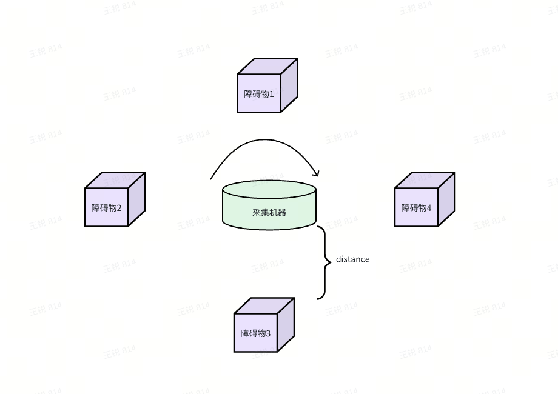
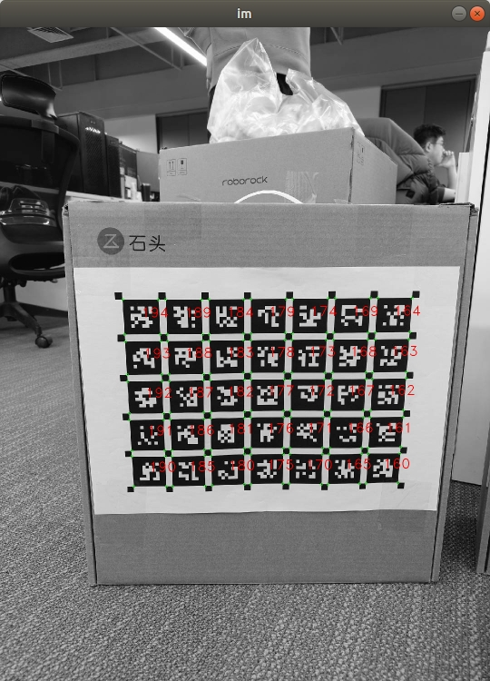
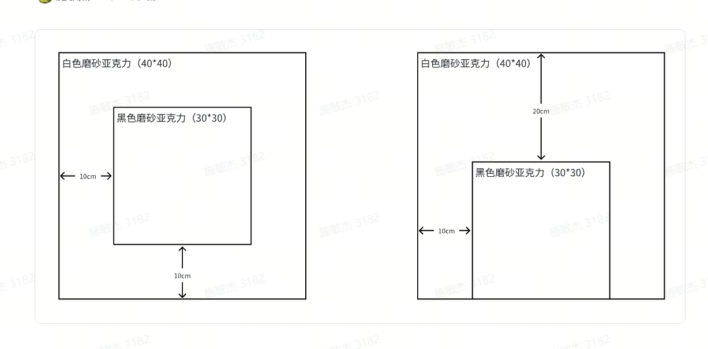

# 双目二供 - X5 tuning验收需求

# 1. 客观部分的调试目标

1. 色彩准确性：目标 D50, D65, D75, TL84/CWF, U30 几种光源下，24 色色卡各 block 平均 delta e <= 12

2. Shading 补偿：边缘亮度值大于中心区域(以图像大小的 1/10 x 1/10 区域计)的 80%

3. Color shading：D50, D65, D75, TL84/CWF, U30 光源下, B/G, R/G ratio 范围 0.97\~1.03

4. 色差校准(CA): 提供初版测试值

5. AE: 对任意固定场景，ae 启动至收敛耗时不超过 20 帧，测试场景分为 2 类

   1. 一种是光源切换（比如亮度变化，或者光源开关状态切换）时的收敛速度测试，可测试光源开/关或切换光源时测试收敛速度

   2. 另一种是针对随机的 ae 初始状态，在 5000K (+/- 200K) 均匀白光光源（频谱任意，可选 D50 或其他同色温光源）下，模组正对光源不超过 1cm 时，1800 \~ 2500 lux 亮度下自 sensor 出图 (如果 3a 模块启动与 sensor 出图之间的间隔超过 5 帧请及时提出) 收敛速度测试

6. AWB: 光源切换时，AWB 收敛耗时不超过 24 帧，测试方案类似 AE 测试，分为 2 类

   1. 一种是光源色温变换时的收敛速度，可测试光源切换时的收敛速度

   2. 另一种是针对随机的 AWB 初始状态，在 5000K (+/- 200K) 均匀白光光源（频谱任意，可选 D50 或其他同色温光源）下，模组正对光源不超过 1cm时，1800 \~ 2500 lux (如果 3a 模块启动与 sensor 出图之间的间隔超过 5 帧请及时提出) 收敛速度测试

7. 噪声：gain <= 8 时 SNR >= 36; gain >=32 时 SNR >= 28，标定至 64x gain

   1. 如果高倍 gain 下 SNR 无法达到需求，以主观部分功能模块清晰度和细节保留需求为优先，SNR 数值标准可根据实际情况调整

8. 动态范围：明亮环境下，中性灰目标亮度 108 - 140 之间，灰阶卡 block 0 灰度值 >= 210 时 block 19 灰度值 <= 16

9. 清晰度：待定，根据功能模块实际制定，初版暂时可以观察是否在 2 倍调焦距离依然可见枯叶图细节

# 2. 主观部分的需求

## 2.1 感知需求

### 2.1.1 色差

采集示意图见上，其中4个障碍物分别放置足球，鞋，动物，树，distance设定为2m

|     | 阳光下        | 夜间开补光灯            |
| --- | ---------- | ----------------- |
| 草地  | 静态拍正对着物体的图 | 静态拍正对着物体的图        |
| 石板路 | 静态拍正对着物体的图 | 静态拍正对着物libaoyu体的图 |

### 2.1.2 白平衡

* 白天

|                     | 动作             | 数据               |
| ------------------- | -------------- | ---------------- |
| 户外，阳光下，遮阳棚外放置一个足球   | 机器从遮阳棚外运动到遮阳棚内 | 拍摄运动过程中正对着物体的所有图 |
|                     | 机器从遮阳棚内运动到遮阳棚外 |                  |
| 户外，阳光下，遮阳棚阴影下放置一个足球 | 机器从遮阳棚外运动到遮阳棚内 |                  |
|                     | 机器从遮阳棚内运动到遮阳棚外 |                  |

* 傍晚+夜间

|                               | 动作                                        | 数据               |
| ----------------------------- | ----------------------------------------- | ---------------- |
| 有夕阳的场景下，在室内、室外交界处外2.5m处放置一个足球 | 机器从室内，看不到夕阳的状态，挪到室外，看得到夕阳的状态，最终挪到足球正前方    | 拍摄运动过程中正对着物体的所有图 |
| 黑天场景下，在室内、室外交界处外2.5m处放置一个足球   | 机器从室内，不开补光灯的状态，挪到室外，开补光灯的状态，最终挪到足球正前方     |                  |
|                               | 机器从室外，开补光灯的状态，挪到室内，不开补光灯的状态，最终挪到距离交界处2m位置 |                  |

## 2.2 定位需求

### 2.2.1 清晰度(已经测过，需要确定是否模组有大变动 ->赵佳，变动不大，优先级不高)

* 场地布置

  * Apirlgrid 30cm x 30cm，靠墙垂直放置（不用特别垂直）

    

  * 纯黑板30x30cm，并且带10x10cm的白边，靠墙垂直放置（不用特别垂直）

    

  * 图像区域划分

#### 2.2.1.1 1m 30cm\*30cm Aprilgrid标定板

| Aprilgrid识别率\目标位置 | 上    | 下    | 左    | 右    | 中    |
| ----------------- | ---- | ---- | ---- | ---- | ---- |
| 白天                | 100% | 100% | 100% | 100% | 100% |
| 最暗                | 100% | 100% | 100% | 100% | 100% |
| 补光灯恰好开启时          | 100% | 100% | 100% | 100% | 100% |

#### 2.2.1.2 3m黑色正方形

| 角点识别率\目标位置 | 上    | 下    | 左    | 右    | 中    |
| ---------- | ---- | ---- | ---- | ---- | ---- |
| 白天         | 100% | 100% | 100% | 100% | 100% |
| 夜间         | 100% | 100% | 100% | 100% | 100% |
| 补光灯恰好开启时   | 100% | 100% | 100% | 100% | 100% |

### 2.2.2 动态范围(同上）

#### 2.2.2.1 1m 30cm\*30cm Aprilgrid标定板

|                                               | 上    | 下    | 左    | 右    | 中    |
| --------------------------------------------- | ---- | ---- | ---- | ---- | ---- |
| 晴天，逆光，遮阳棚下放置Aprilgrid标定板,角点识别率                | 100% | 100% | 100% | 100% | 100% |
| 晴天，逆光，遮阳棚下放置半个Aprilgrid标定板（另外半个在遮阳棚外）,角点识别率   | 100% | 100% | 100% | 100% | 100% |
| 晴天，顺光，遮阳棚阴影下放置半个Aprilgrid标定板（另外半个在遮阳棚外）,角点识别率 | 100% | 100% | 100% | 100% | 100% |

#### 2.2.2.2 3m黑色正方形

|                                        | 上    | 下    | 左    | 右    | 中    |
| -------------------------------------- | ---- | ---- | ---- | ---- | ---- |
| 晴天，逆光，遮阳棚下放置黑色正方形，角点识别率                | 100% | 100% | 100% | 100% | 100% |
| 晴天，逆光，遮阳棚下放置半个黑色正方形（另外半个在遮阳棚外），角点识别率   | 100% | 100% | 100% | 100% | 100% |
| 晴天，顺光，遮阳棚阴影下放置半个黑色正方形（另外半个在遮阳棚外），角点识别率 | 100% | 100% | 100% | 100% | 100% |

### 2.2.3 运动模糊(同上）

机器以最大角速度旋转，当标定板（或黑色正方形）处于视野范围内上中下三个区域的清晰度

#### 2.2.3.1 1m 30cm\*30cm Aprilgrid标定板

|                        | 上    | 下    | 中    |
| ---------------------- | ---- | ---- | ---- |
| 白天顺光Aprilgrid识别率       | 100% | 100% | 100% |
| 白天逆光Aprilgrid识别率       | 100% | 100% | 100% |
| 白天顺光Aprilgrid一半在阴影下识别率 | 100% | 100% | 100% |
| 夜间补光Aprilgrid识别率       | 100% | 100% | 100% |

#### 2.2.3.2 3m黑色正方形

|                    | 上    | 下    | 中    |
| ------------------ | ---- | ---- | ---- |
| 白天顺光角点识别率          | 100% | 100% | 100% |
| 白天逆光角点识别率          | 100% | 100% | 100% |
| 白天黑色正方形一半在阴影下角点识别率 | 100% | 100% | 100% |
| 夜间补光角点识别率          | 100% | 100% | 100% |

#### 2.2.3.3 被识别物体(同上）

用于判断运动情况下，障碍物是否能满足识别、双目立体匹配的需求

需要用最大转速、0.5rad/s，0.4rad/s，0.3rad/s，0.2rad/s，0.1rad/s进行拍摄，拍摄如下场景

|     | 阳光下    | 夜间开补光灯 |
| --- | ------ | ------ |
| 草地  | 旋转一周存图 | 旋转一周存图 |
| 石板路 | 旋转一周存图 | 旋转一周存图 |

