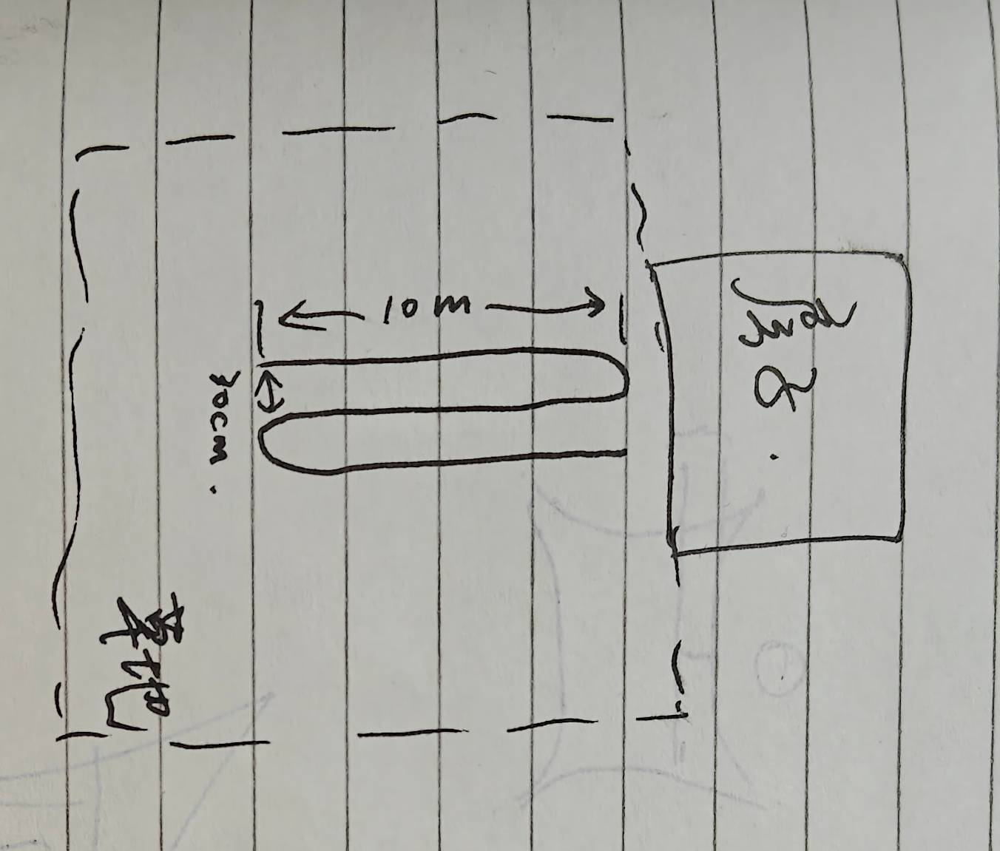
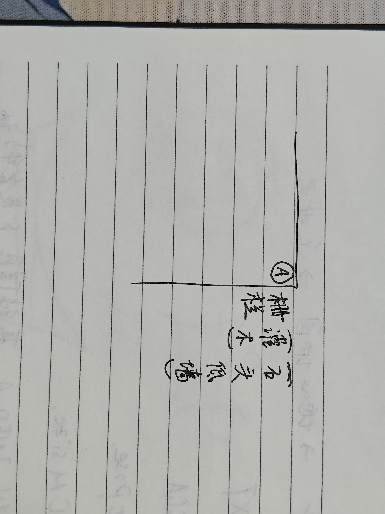
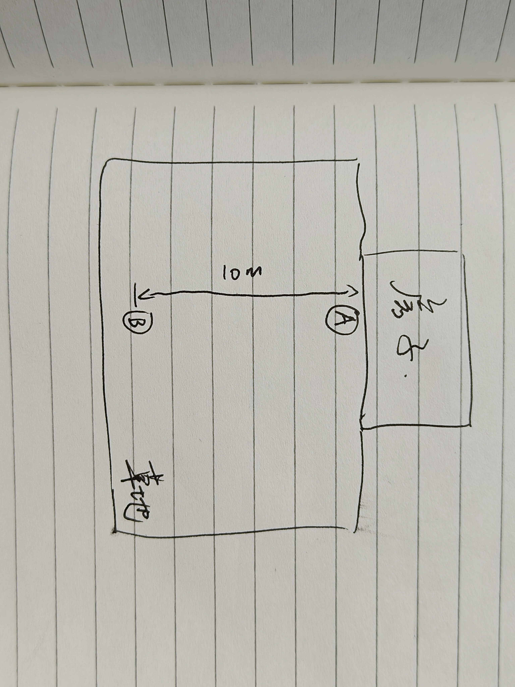
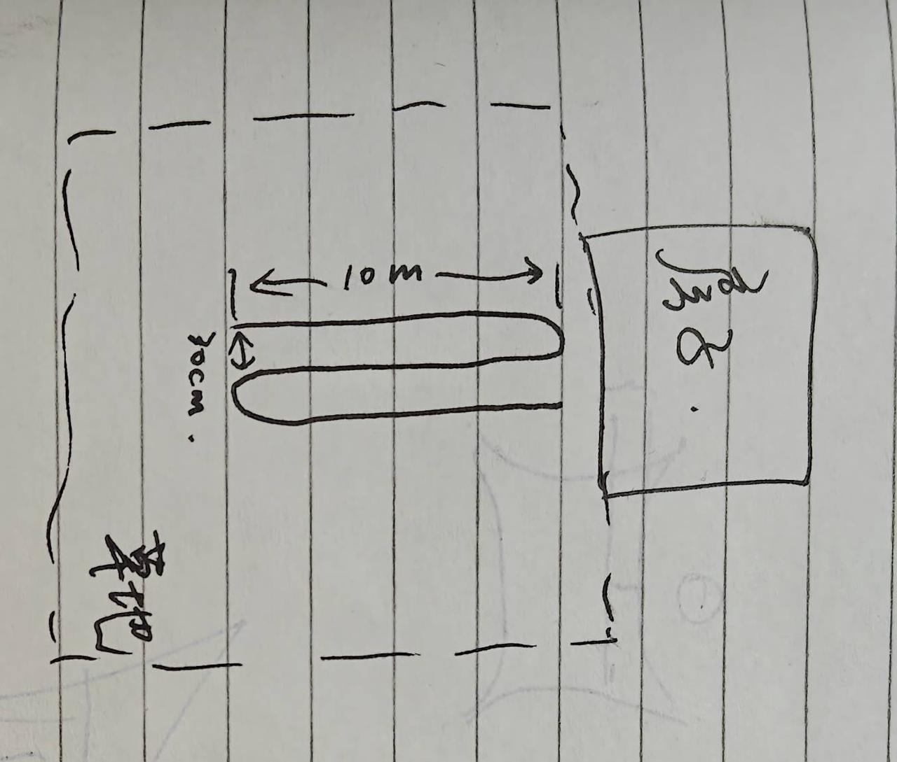
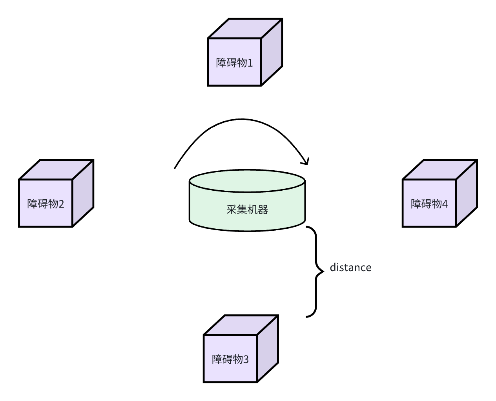

# 割草机TR3动态拍图需求#

# 1. 定位需求

## 1.1 普通之字 P0

同步采集双目、IMU、odom、RTK数据，机器可以工作在遥控模式，要求线速度、角速度为产品定义的最大线速度和角速度。

* 路径任意位置覆盖2x2米的坑洼区域。内含多个深度10cm，宽度5cm，长度超过机身的坑，坑之间间距超过机身。

* 单边至少达到10m，短边最少最少5m，尽量10mx10m

* 动作：

  * 绕场地边缘先走一圈

  * 场地内部走弓字

具体位置见[ 测试场地选定与改造](https://roborock.feishu.cn/docx/TvbJduBWwoYIX7xapKrcuf2vn1g?open_in_browser=true)

|                                       | 白天强光 | 夜晚阴天（开补光灯） | 白天阴天 |
| ------------------------------------- | ---- | ---------- | ---- |
| 78，普通之字                               | P0   | P2         | P4   |
| 105，树林1                               | P0   | P2         | P4   |
| 105，树林2                               | P0   | P2         | P4   |
| 105，坑洼1                               | P0   | P2         | P4   |
| 105，坑洼2                               | P0   | P2         | P4   |
| 105，水边1                               | P1   | P3         | P5   |
| 78，水边2                                | P1   | P3         | P5   |
| 105，斜坡1                               | P1   | P3         | P5   |
| 78，斜坡2                                | P1   | P3         | P5   |
| 修改机器使得更容易打滑（暂时不做，如果发现机器实际数据打滑过少则进行改装） |      |            |      |

## 1.2 角落高速旋转 P1 （改）

同步采集双目、IMU、odom、RTK数据，机器可以工作在遥控模式，割草机放在A点，用最大角速度旋转5圈。

* 动作

  * 先离拐角3米处启动

  * 走到拐角

  * 原地转圈5圈

|       | 场地          | 白天强光 | 夜晚阴天（开补光灯） | 白天阴天 |
| ----- | ----------- | ---- | ---------- | ---- |
| 栅栏    | 1.2.1 栅栏    | P0   | P1         | P2   |
| 灌木    | 1.2.2 灌木    | P0   | P1         | P2   |
| 石头低墙  | 1.2.3 石头低墙  | P0   | P1         | P2   |
| 灰水泥墙面 | 1.2.4 灰水泥墙面 | P0   | P1         | P2   |

## 1.3 障碍物近、远处高速旋转 P2

同步采集双目、IMU、odom、RTK数据，机器可以工作在遥控模式，割草机分别放在A点和B点，用最大角速度旋转5圈。

B点周围9.5m没有障碍物

* 动作

  * AB中心启动

  * 走到A

  * 原地转圈5圈

  * 走到B

  * 原地旋转5圈

|    | 场地      | 白天强光 | 夜晚阴天（开补光灯） | 白天阴天 |
| -- | ------- | ---- | ---------- | ---- |
| A点 | 78，普通之字 | P0   | P1         | P2   |
| B点 | 78，普通之字 | P0   | P1         | P2   |

## 1.4 纯草地环境普通之字（环境困难，不在TR3测试） P3 （改）&#x20;

同步采集双目、IMU、odom、RTK数据，机器可以工作在遥控模式，要求线速度、角速度为产品定义的最大线速度和角速度。场地与普通之字相比，在虚线上布置白板，挡住扫地机视野。

场地：3.1 纯草地环境普通之字 78栋 改装4

* 动作：

  * 绕场地边缘先走一圈

  * 场地内部走弓字

|        | 场地                    | 白天强光 | 夜晚阴天（开补光灯） | 白天阴天 |
| ------ | --------------------- | ---- | ---------- | ---- |
| 机器正常拍摄 | 3.1 纯草地环境普通之字 78栋 改装4 | P0   | P1         | P2   |

# 2. 感知需求

## 2.1 障碍物种类 - 具体优先级待确认

1. 树木：松树、苹果树、核桃树、杉树、枫树、树根

2. 动物：狗、猫、刺猬、松鼠

3. 人：大人、小孩

4. 游乐设施：蹦床、秋千、滑梯、足球门

5. 玩具：球类（网球、足球、篮球）、挖沙玩具（铲子、桶）

6. 户外用品：晾衣杆、烧烤架、桌子、椅子、防晒棚、垃圾桶

7. 花园工具：铲子、桶、割草机、打草机、手推车

8. 花园设备：地埋喷头、草坪灯、路灯、井盖

9. 花园杂物：松果、树枝、草堆、落叶堆、堆肥

10. 栅栏：铁丝网、木制栅栏、铁栅栏

11. 线/管：电源线、水管

12. 景观：花圃、花盆、灌木、菜圃

13. 路/通道: 石板路、泥土路、鹅卵石路、石子路、木板路

14. 上、下台阶：石阶、马路牙子

15. 坑：沙坑、水坑、泥坑

16. 泳池

## 2.2 采集环境

阳光环境（包含强逆光、眩光、阴影（不限于树荫、建筑物的阴影）），及光线明暗变化场景

## 2.3 采集方式

* 以机器为圆心，在机器四周布置障碍物，控制机器，原地旋转拍摄。

* 每次采集完成后调整障碍物与机器的距离

示例图示例如下：&#x20;

