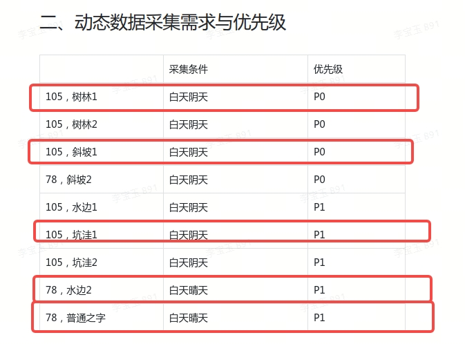
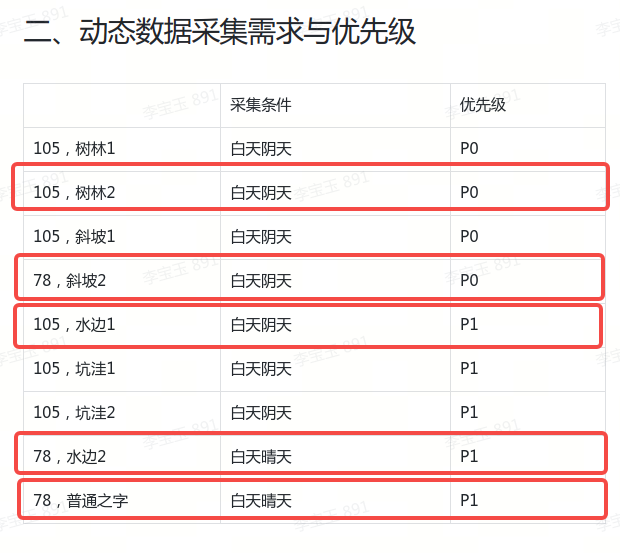
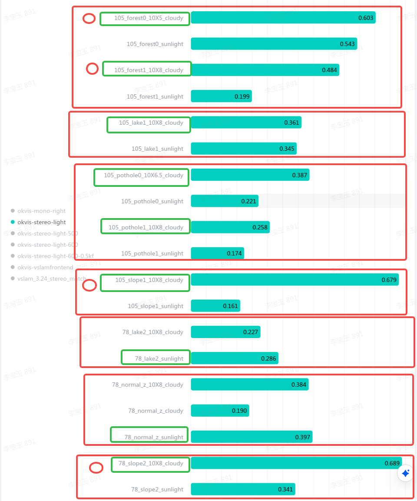

# TR4定位数据采集需求整理

# 一、总测试需求与优先级

## 1.1 正常测试项&#x20;

优先级按照以下顺序

1. 前置测试（Done）

   1. 拍显示器+秒表 （Done）

   2. 2x2木板围成的二维码场地，进行时间戳同步测试[ 时间戳同步检测方案](https://roborock.feishu.cn/docx/EzJPdh14soMynXxH70uc3TSunwb) （Done）

      1. 场地布置与之前相同，重复次数由10次加多到30次

2. 1.2 行差问题测试&动态数据测试

   1. 主要用舜宇测试

   2. 联合在78普通之字晴天采集一次即可

3. 静态数据：清晰度（Done，需要补测）&#x20;

4. 风险项场景复测

   1. 舜宇、联合机器各一台

5. 静态数据：动态范围、运动模糊

## 1.2 行差问题测试

&#x20;

1. mk1-4需要采集5组动态场景数据   （MK1-4可以开始采集动态场地数据了，算入TR4的测试项数据）

   

   

2. mk1-3需要采集5组动态场景数据  &#x20;

3. 需要找到行差比较低的机器/模组，方法是在多台机器/模组，采集动态场地数据（现有的都要采集），一台3分钟左右。 &#x20;

4. 筛选行差低的机器/模组，每台采集5组动态数据   &#x20;

# 二、动态数据采集需求与优先级

|         | 采集条件 | 优先级 |
| ------- | ---- | --- |
| 105，树林1 | 白天阴天 | P0  |
| 105，树林2 | 白天阴天 | P0  |
| 105，斜坡1 | 白天阴天 | P0  |
| 78，斜坡2  | 白天阴天 | P0  |
| 105，水边1 | 白天阴天 | P1  |
| 105，坑洼1 | 白天阴天 | P1  |
| 105，坑洼2 | 白天阴天 | P1  |
| 78，水边2  | 白天晴天 | P1  |
| 78，普通之字 | 白天晴天 | P1  |

***

# 三、当前数据集与场景对应关系

| forest0 1代表树林1 2                      |
| ------------------------------------- |
| pothol&#x65;**&#x20;**&#x30; 1代表坑洼1 2 |
| slope1 2 代表斜坡1 2                      |
| lake1 2 代表水边1 2                       |
| normalz代表普通之字                         |

# 四、当前指标

一个红色方框为一类数据，绿色框为具体场景中指标较差的数据，红色圆圈为指标差的数据中前几名。

