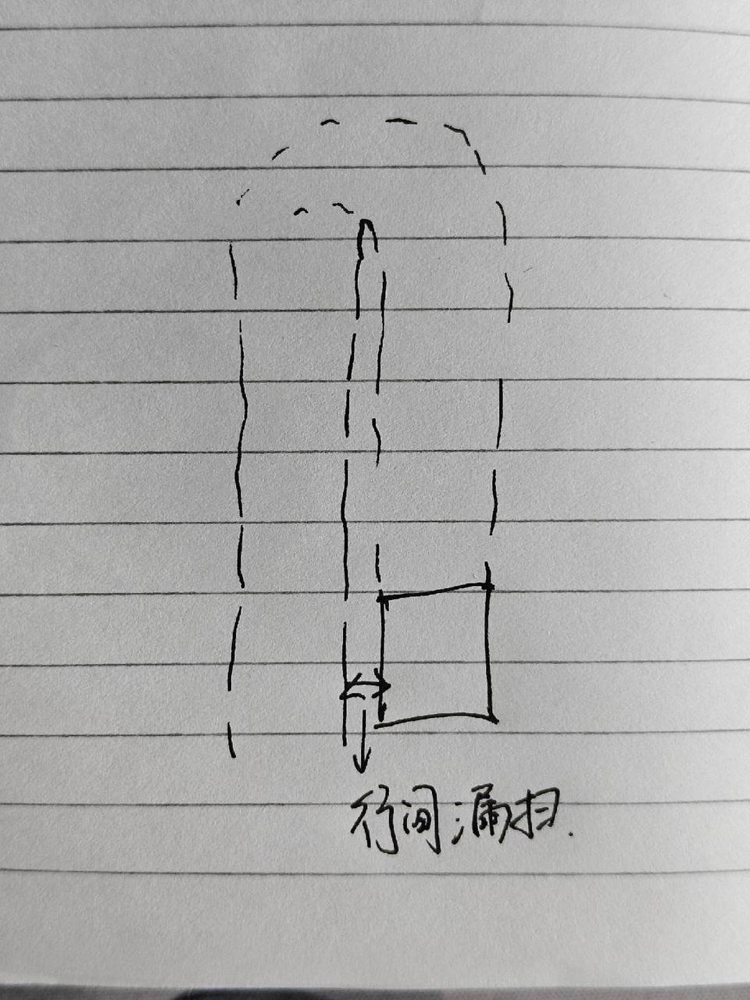
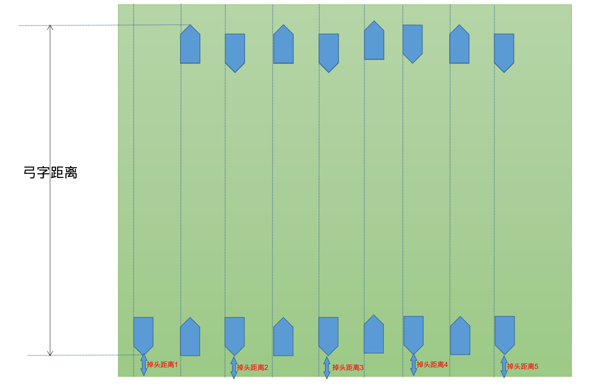
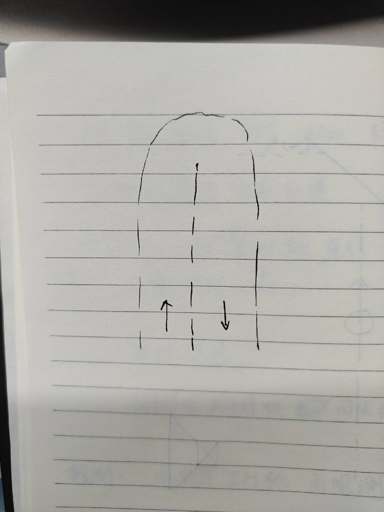
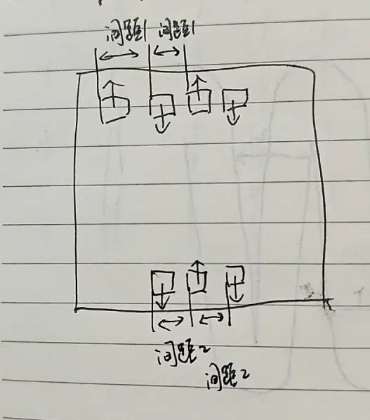
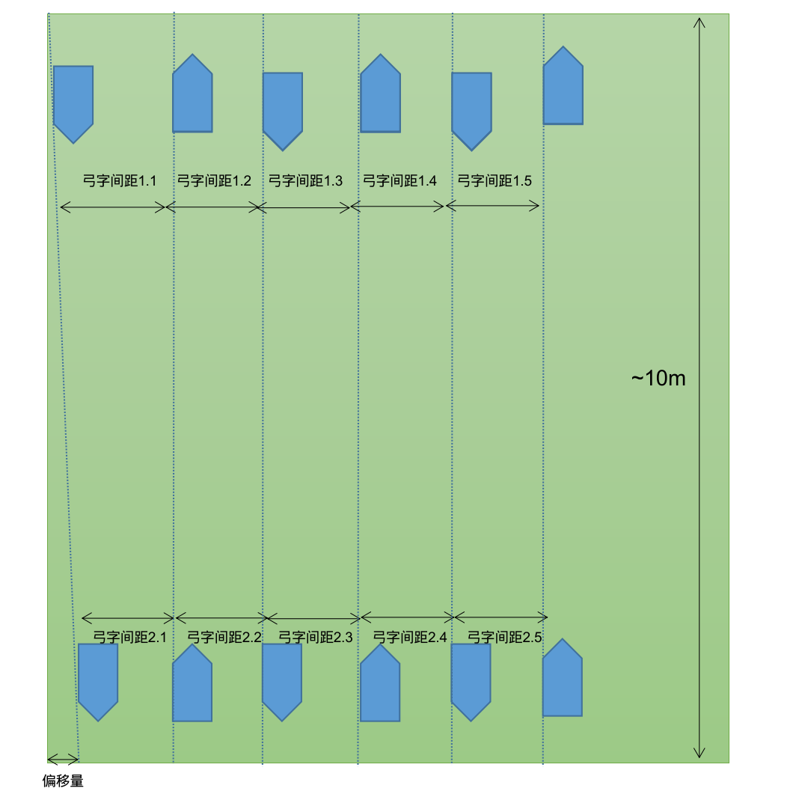

# 竞品视觉slam评估结果

# 1. 基础信息

## 1.1 最为关注的性能

RTK阴影区域的漏割

### 1.1.1 漏割产生形式

行间漏割

调头漏割，对应调头距离、弓字距离这两个指标

调头距离是指：开始掉头转向的时候，前撞bumper到边界的距离，这里的边界，为遥控时机器人的外侧边界。因为调头的时候机器人走出一个曲线，因此这个位置转向造成的漏割不好评估，就只考虑调头距离造成的漏割。

## 1.2 竞品割草路径规划方式

怀疑竞品为保证割草效率，两个弓字之间没有覆盖，如图：

所以定位只要横向偏1cm，漏割就是1cm。以这样的规划方式要求定位精度是不现实的。（下文也会看到，按照这个要求，RTK阴影区域，竞品也得漏割）

## 1.3 竞品纯视觉定位方式

看结果的条件2和条件4。

条件2：锡箔纸屏蔽UWB，黑胶带将TOF部分遮蔽，剩余114度FOV。环视和单目可用（构成360°环视+114°FOV TOF+前视单目）

条件4：锡箔纸屏蔽UWB，黑胶带将TOF完全遮蔽，环视剩余114度FOV，单目可用（构成双目，模仿butchart的布局）

## 1.4 其他与视觉定位相关的测试结果

见参考文献

# 2. 测试环境：

在枯草场地遥控建一个外框10m\*10m的图，使弓字的长度为10m。

弓字间距1表示靠场地下方一侧的测量，弓字间距2表示靠场地上方一侧的测量。

弓字间距1为当前道右轮和上一道左轮的间距，弓字间距2为当前道左轮和上一道右轮的间距。（具体的左右可能有偏差，这里只用来理解）

# 3. 测试结果

## 3.1 条件2

### 3.1.1 调头漏割和弓字距离差

| 测试项 | 弓字调头距离边界距离(cm) | 相邻距离差 | 最长与最短弓字距离差(cm) | 测试项 | 弓字调头距离边界距离(cm) | 相邻距离差 | 最长与最短弓字距离差(cm) | 平均距离差（cm） |
| --- | -------------- | ----- | -------------- | --- | -------------- | ----- | -------------- | --------- |
| 测试1 | 41.5           |       | 10.5           | 测试3 | 42             |       | 10.5           | 9.375     |
|     | 51.5           | 10    |                |     | 39             | -3    |                |           |
|     | 52             | 0.5   |                |     | 41.5           | 2.5   |                |           |
|     | 47.5           | -4.5  |                |     | 43.5           | 2     |                |           |
|     | 50             | 2.5   |                |     | 33             | -10.5 |                |           |
| 测试2 | 43.5           |       | 7.5            | 测试4 | 33             |       | 9              |           |
|     | 41.5           | -2    |                |     | 36             | 3     |                |           |
|     | 47             | 5.5   |                |     | 33.5           | -2.5  |                |           |
|     | 48.5           | 1.5   |                |     | 42             | 8.5   |                |           |
|     | 49             | 0.5   |                |     | 35             | -7    |                |           |

相邻两行路径为20m，最大相邻距离差/路径长度，可以用来评估机器人前进方向的定位精度

0.105/20=0.5%

### 3.1.2 行间漏割

漏割距离为0，不代表轨迹工整，只是轨迹没有“分叉”，实际轨迹有“重叠”

每次测试走了5行弓字（对应每次测试里面的5个弓字间距1和5个弓字间距2），测试重复了4次（对应测试1、测试2、测试3、测试4）

| 测试项 | 刀盘宽度(cm) | 弓子间距1(cm) | 漏割距离1（cm） | 弓子间距2(cm) | 漏割距离2(cm) | 最大漏割距离(cm) | 平均漏割距离（cm）        |
| --- | -------- | --------- | --------- | --------- | --------- | ---------- | ----------------- |
| 测试1 | 22       | 20.5      | 0         | 19        | 0         | 9          | 6.833333333333333 |
|     |          | 22        | 0         | 17        | 0         |            |                   |
|     |          | 21        | 0         | 31        | 9         |            |                   |
|     |          | 18        | 0         | 16        | 0         |            |                   |
|     |          | 18        | 0         | 16        | 0         |            |                   |
| 测试2 | 22       | 22        | 0         | 22        | 0         | 15         |                   |
|     |          | 14        | 0         | 19        | 0         |            |                   |
|     |          | 25        | 3         | 19        | 0         |            |                   |
|     |          | 21        | 0         | 23        | 1         |            |                   |
|     |          | 23        | 1         | 37        | 15        |            |                   |
| 测试3 | 22       | 23.5      | 1.5       | 20        | 0         | 1.5        |                   |
|     |          | 23        | 1         | 19        | 0         |            |                   |
|     |          | 19        | 0         | 19        | 0         |            |                   |
|     |          | 17.5      | 0         | 22        | 0         |            |                   |
|     |          | 21        | 0         | 18.5      | 0         |            |                   |
| 测试4 | 22       | 20        | 0         | 20        | 0         | 4          |                   |
|     |          | 18.5      | 0         | 18        | 0         |            |                   |
|     |          | 23        | 1         | 26        | 4         |            |                   |
|     |          | 19        | 0         | 18.5      | 0         |            |                   |
|     |          | 22.5      | 0.5       | 18.5      | 0         |            |                   |

## 3.2 条件4

### 3.2.1 调头漏割和弓字距离差

| 测试项 | 弓字调头距离边界距离(cm) | 相邻距离差 | 最长与最短弓字距离差(cm) | 测试项 | 弓字调头距离边界距离(cm) | 相邻距离差 | 最长与最短弓字距离差(cm) | 平均距离差（cm） |
| --- | -------------- | ----- | -------------- | --- | -------------- | ----- | -------------- | --------- |
| 测试1 | 49             |       | 22             | 测试3 | 47             |       | 85.5           | 35.375    |
|     | 37             | -12   |                |     | -20            | -67   |                |           |
|     | 31             | -6    |                |     | 51             | 71    |                |           |
|     | 36.5           | 5.5   |                |     | 51             | 0     |                |           |
|     | 27             | -9.5  |                |     | 65.5           | 14.5  |                |           |
| 测试2 | 48             |       | 22.5           | 测试4 | 40             |       | 11.5           |           |
|     | 35.5           | -12.5 |                |     | 44             | 4     |                |           |
|     | 42             | 6.5   |                |     | 48             | 4     |                |           |
|     | 28             | -14   |                |     | 50             | 2     |                |           |
|     | 50.5           | 22.5  |                |     | 51.5           | 1.5   |                |           |

弓字调头距离边界距离的负值代表出界。

相邻两行路径为20m，最大相邻距离差/路径长度，可以用来评估机器人前进方向的定位精度

0.67/20=3.3%

### 3.2.2 行间 漏割

这里每次测试不能有5个间隔，是因为路径再长，就报错停机了。（因为咱们遮蔽了摄像头）

能得到1个间距1和两个间距2，最少走20m，最恶劣的漏割19.5cm，偏差也就0.9%

| 测试项 | 刀盘宽度(cm) | 弓子间距1(cm) | 漏割距离1（cm） | 弓子间距2(cm) | 漏割距离2(cm) | 最大漏割距离(cm) | 平均最大漏割距离（cm）      |
| --- | -------- | --------- | --------- | --------- | --------- | ---------- | ----------------- |
| 测试1 | 22       | 21        | 0         | 30        | 8         | 8          | 7.833333333333333 |
| 测试2 | 22       | 16        | 0         | 33        | 11        | 19.5       |                   |
|     |          | /         | /         | 41.5      | 19.5      |            |                   |
| 测试3 | 22       | 18        | 0         | 12        | 0         | 0          |                   |
|     |          | /         | /         | 19        | 0         |            |                   |
| 测试4 | 22       | 26        | 4         | 19        | 0         | 4          |                   |

# 4. 参考文献

## 4.1 评估方案原始文件

[ 竞品视觉slam性能评估](https://roborock.feishu.cn/wiki/JLnWwAg6bicDOEkFehacoD7en0f)

## 4.2 评估结果原始文件

[ KWS G1 VSlam性能评估测试结果(20250308)](https://roborock.feishu.cn/wiki/OcE0wyLjDixfGHkw3Tbcj6ifneb)

