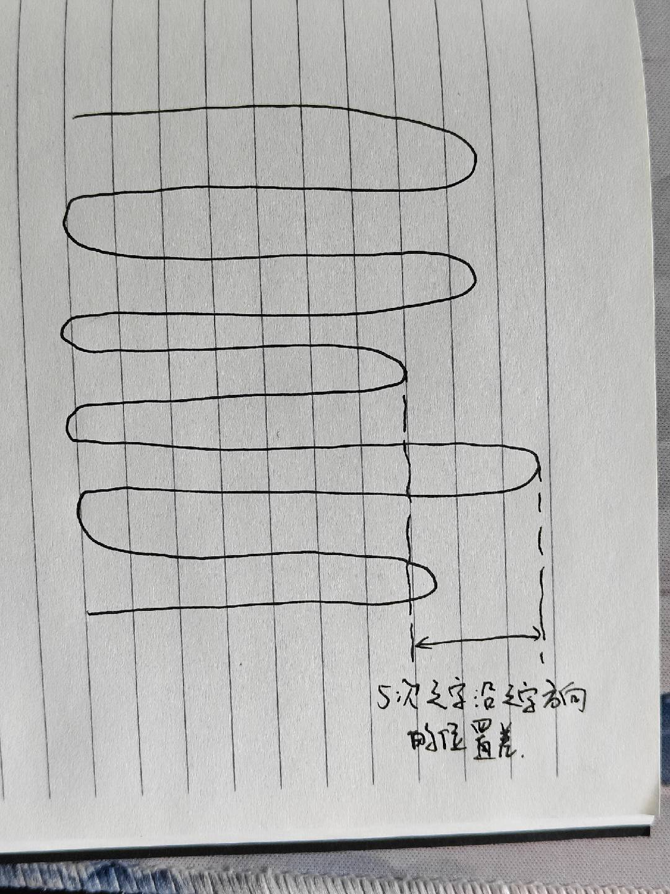
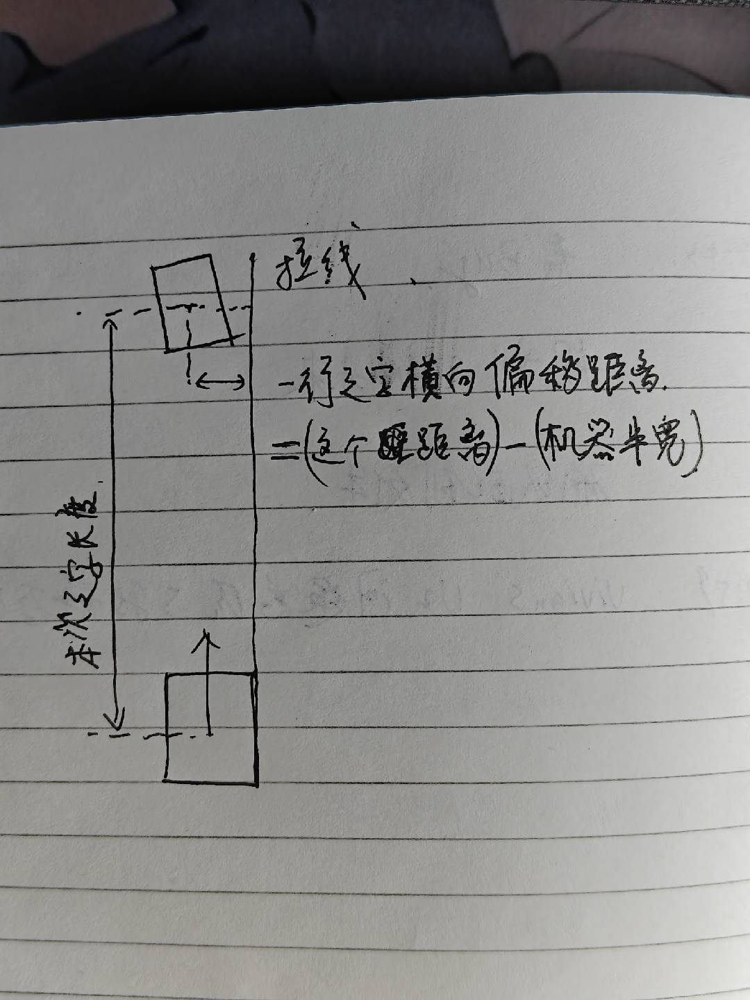
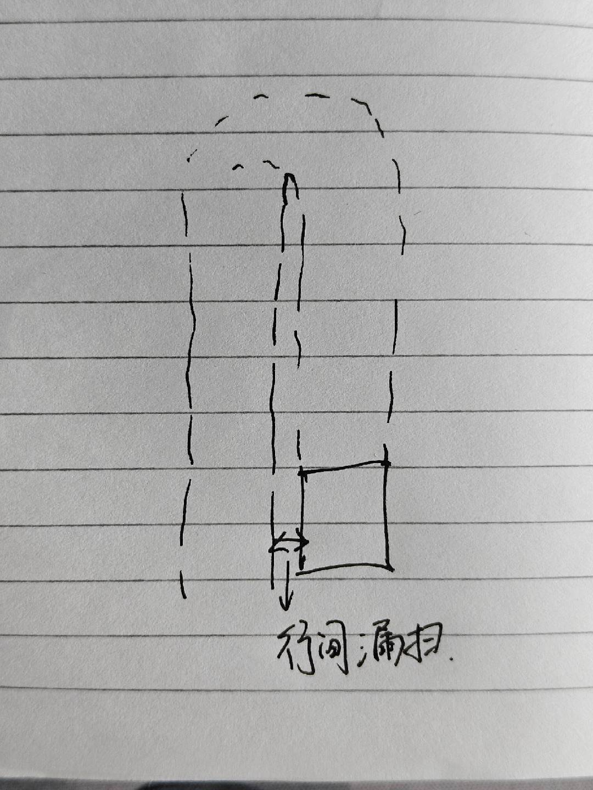

# 竞品视觉slam性能评估

核心问题是评估竞品的视觉SLAM性能。

步骤：

1. 使用竞品在公司的任一场景（场景草地中尽可能没有障碍物）内建图

2. 开始割草（可以假割，但需要之字形路线）

3. 确认RTK、视觉条件良好情况下性能：

   * 测量之字形路线最长多少米会转向

   * 确认之字是否沿正东西/南北方向

   * 测量5次之字转弯位置沿之字方向的位置差（最长与最短的差）

     1. 示意图：

     

4. 重新开始割草，正常初始化完成之后，将RTK用锡箔纸遮蔽，

   * 测量一行之字中，横向偏移距离/本次之字长度

     * 用一根线拉出来作为参考直线。

       1. 如果之字是沿正东西/南北方向，这根线就用正东西/南北方向作为方向

       2. 如果之字不是沿正东西/南北方向，这根线就用遮蔽RTK时候的机器朝向作为方向

     * 示意图：

     

   * 测量几行之字之后出现行间漏扫

     1. 示意图

     

   * 测量5次之字转弯位置沿之字方向的位置差（最长与最短的差）

5. 重新开始割草，正常初始化完成后，将RTK用锡箔纸遮蔽，将双目用黑色不透光纸遮蔽，

   * 测量一行之字中，横向偏移距离/本次之字长度（拉线方案同上）

   * 测量几行之字之后出现行间漏扫

   * 测量5次之字转弯位置沿之字方向的位置差（最长与最短的差）
