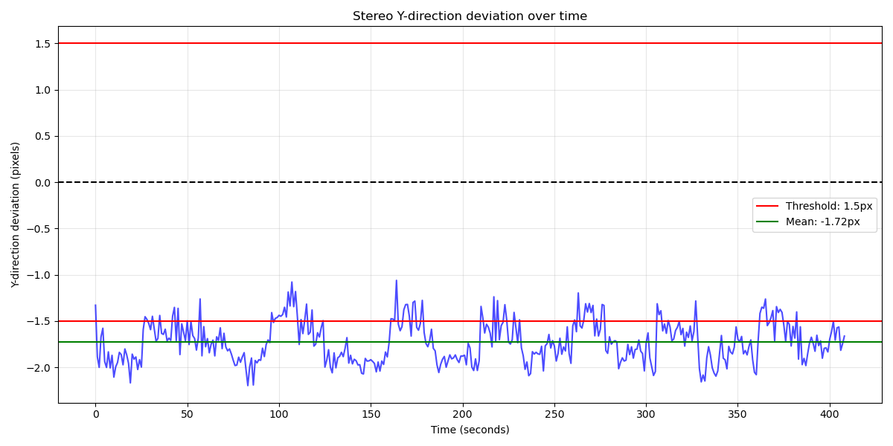
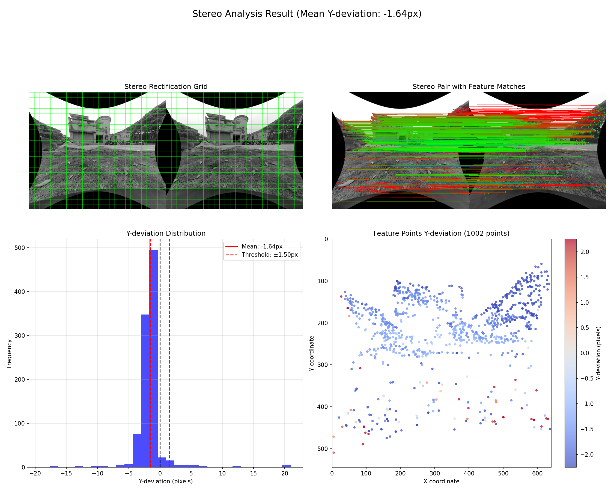
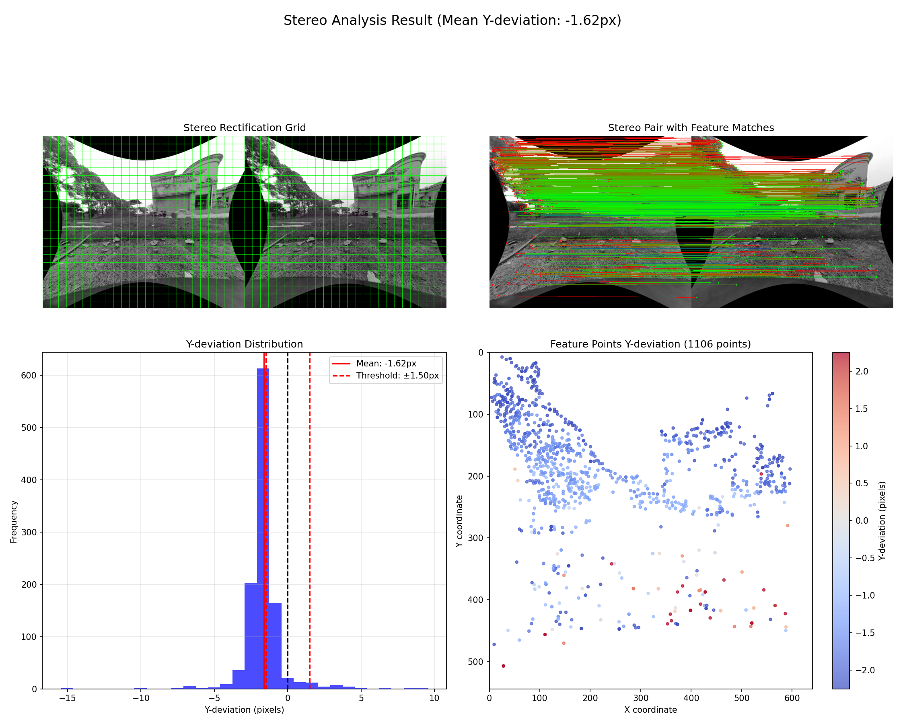

# MK1 - 4  厂商参数验证记录

## A 分析方案

* 采集双目图像序列；

* 对相同时刻的双目图像对，做极线校正；

* 在极线校正后的 camera0 图像上提取 sift 特征，并用光流算法在 camera1 上搜索匹配，并用 2d - 2d ransac 过滤错误匹配；

* 比较匹配特征对的 y 值，对单个双目图像对统计 y-diff（y 偏差）；

* 统计所有双目图像对的 y 偏差均值；

**评估标准为：**

* Y方向平均偏差<0.5像素：非常好

* Y方向平均偏差<1.5像素：可接受

* Y方向平均偏差>1.5像素：需要重新标定

## B 数据记录

### MK1-4 record

**结论**

* Y方向平均偏差>1.5像素，验证不通过；

**问题帧示例**

## C 可视化理解
