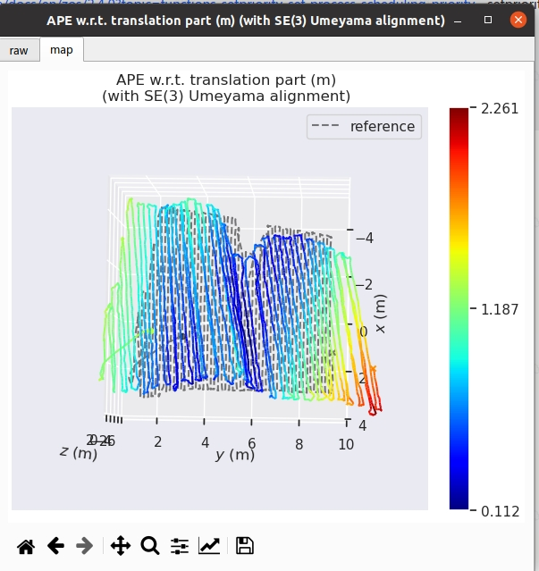
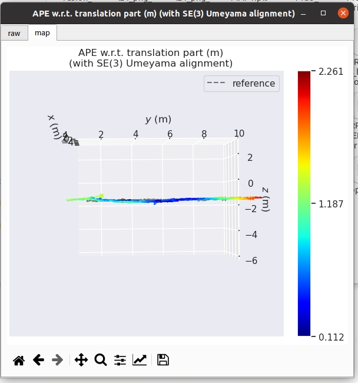
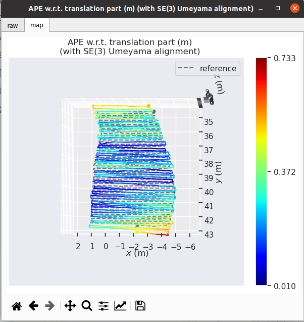
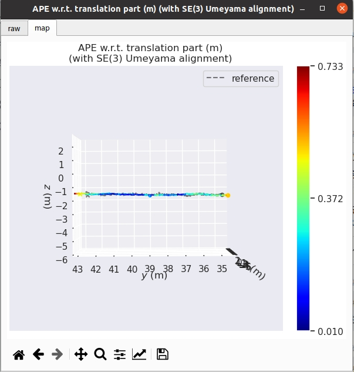
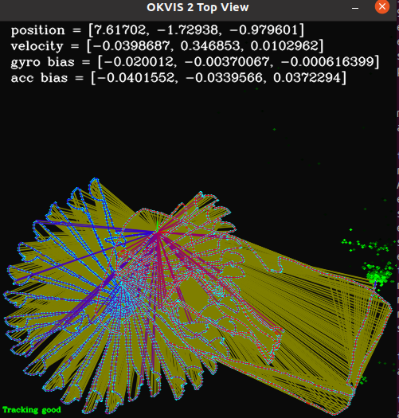
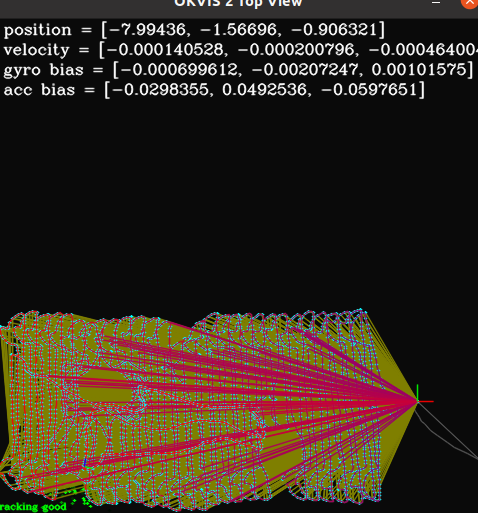

# VSLAM数据传输

| 数据集问题                           |   |                                                                                                                                                                                                                                                                                                                                                                                                                                                                                  |
| ------------------------------- | - | -------------------------------------------------------------------------------------------------------------------------------------------------------------------------------------------------------------------------------------------------------------------------------------------------------------------------------------------------------------------------------------------------------------------------------------------------------------------------------- |
| 弓字z轴漂移（correct前漂移，correct后不再漂移） |   | 关于 “Z 轴上漂移异常大”的问题，在 no-wheel + online calibr 的分支上，B1-037 上机测试，明显缓解；结合 MK2 数据 PC 端批测结果，初步可得，目前 no-wheel + online calibr 参数配置效果更好； |
| 弓字跑成花                           |   | definition\_limit\_corrected\_B1-092\_corrected这个数据目前是在benchmark里面并且vl\_slam/develop仿真开启前后端异步运行会偶发轨迹错乱，并且能够复现这个数据需要好好分析一下，加入到你的后续问题优化列表里面                                                                                                                                                                  |
|                                 |   |                                                                                                                                                                                                                                                                                                                                                                                                                                                                                  |
|                                 |   |                                                                                                                                                                                                                                                                                                                                                                                                                                                                                  |

