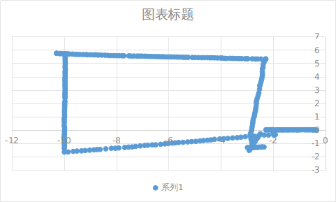
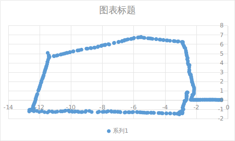
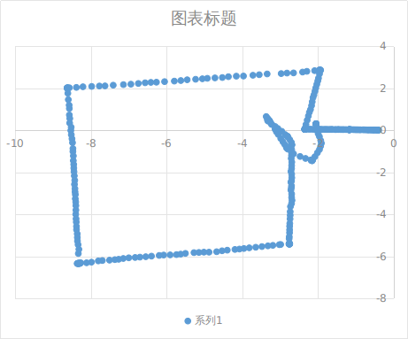
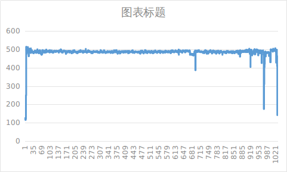
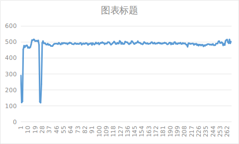
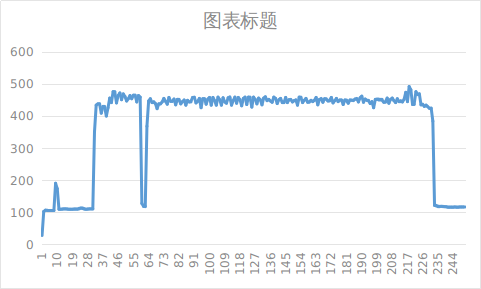
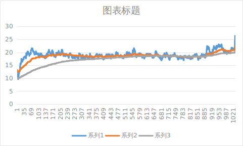
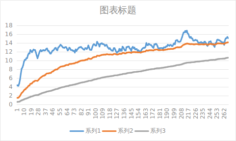
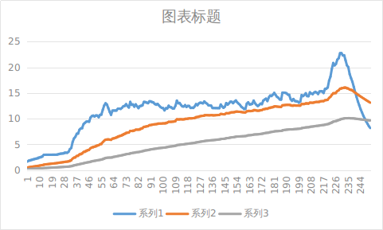

# 2993、daily、3029版本丢帧情况对比

1）相机丢帧，在建图到存图的切换时会出现1次，2993版本有1次额外的133ms的丢帧。

2）imu丢帧和粘连次数，3份日志中，均为个位数，占比0.00%

3）wheel\_mcu相比wheel，丢帧和粘连次数更少，丢帧占比不超过0.10%。2993版本，轮速计丢帧和粘连次数较多

4）rtk丢帧率0.16%-0.25%，除见图的状态转换，还存在数次1-3s的丢帧。

| 传感器丢帧情况    | 2993                                                                                                                                                                                                                                                                                                                                                                                                                                                              | dailybuild                                                                                                                                                                                                                                                                                                                                                                                                                                                                                       | 3029北京                                                                                                                                                                                                                                                                                                                                                                                                                                                                                                                        | 3029苏州 000276日志包                                                                                                                                                                                                                                                                                                                     | 3029苏州 000277日志包                                                                                                                                                                                                                                                                                                                                                 | 3029北京Detector 1 on CPU4Detector 0 no bindvslam 7Hz                                                                                                                                                                                                                                                                                                   |
| ---------- | ----------------------------------------------------------------------------------------------------------------------------------------------------------------------------------------------------------------------------------------------------------------------------------------------------------------------------------------------------------------------------------------------------------------------------------------------------------------- | ------------------------------------------------------------------------------------------------------------------------------------------------------------------------------------------------------------------------------------------------------------------------------------------------------------------------------------------------------------------------------------------------------------------------------------------------------------------------------------------------ | ----------------------------------------------------------------------------------------------------------------------------------------------------------------------------------------------------------------------------------------------------------------------------------------------------------------------------------------------------------------------------------------------------------------------------------------------------------------------------------------------------------------------------- | ------------------------------------------------------------------------------------------------------------------------------------------------------------------------------------------------------------------------------------------------------------------------------------------------------------------------------------ | ---------------------------------------------------------------------------------------------------------------------------------------------------------------------------------------------------------------------------------------------------------------------------------------------------------------------------------------------------------------- | ----------------------------------------------------------------------------------------------------------------------------------------------------------------------------------------------------------------------------------------------------------------------------------------------------------------------------------------------------- |
| 相机         | 619249 -> 679903丢帧一次。因为建图状态变化，1667949 -> 1668082，133ms 丢帧。Total frames: 18998Frame rate: 14.32 fpsAverage interval: 69.84 msInterval standard deviation: 439.57 msMinimum interval: 59.00 msMaximum interval: 60654.00 ms**Detected frame drops: 2 (0.01%)**&#x45;stimated total lost frames: 905Abnormally small intervals: 0 (0.00%)Continuous abnormal interval segments: 0 | 259094 -> 271606丢帧一次，因为建图到存图的状态切换查看EventTask.log有Switch Nav变化。Slam\_normal.log中丢帧前轨迹可视化如下：Total frames: 16691Frame rate: 14.84 fpsAverage interval: 67.39 msInterval standard deviation: 96.33 msMinimum interval: 65.00 msMaximum interval: 12512.00 ms**Detected frame drops: 1 (0.01%)**&#x45;stimated total lost frames: 186Abnormally small intervals: 0 (0.00%)Continuous abnormal interval segments: 0 | 313821 -> 349577丢帧一次，查看EventTask.log中SwitchNav关键字，该时间段附近有BUILDING\_BOUDARY到SAVE、SAVE到MOW\_GLOBAL的变化。查看丢帧前轨迹（如下）确认为巡边建图Total frames: 20876Frame rate: 14.63 fpsAverage interval: 68.35 msInterval standard deviation: 247.01 msMinimum interval: 65.00 msMaximum interval: 35756.00 ms**Detected frame drops: 1 (0.00%)**&#x45;stimated total lost frames: 533Abnormally small intervals: 0 (0.00%)Continuous abnormal interval segments: 0 | 144123 -> 147603丢帧一次Total frames: 175Frame rate: 11.59 fpsAverage interval: 86.28 msInterval standard deviation: 258.02 msMinimum interval: 66.00 msMaximum interval: 3480.00 ms**Detected frame drops: 1 (0.57%)**&#x45;stimated total lost frames: 51Abnormally small intervals: 0 (0.00%)Continuous abnormal interval segments: 0 | 274827 -> 288684（建图到割草间关闭相机）156868 -> 170131Total frames: 19703Frame rate: 14.70 fpsAverage interval: 68.01 msInterval standard deviation: 135.98 msMinimum interval: 65.00 msMaximum interval: 13857.00 ms**Detected frame drops: 2 (0.01%)**&#x45;stimated total lost frames: 403Abnormally small intervals: 0 (0.00%)Continuous abnormal interval segments: 0 | 362267 -> 378536（建图关闭传感器）Total frames: 7444Frame rate: 7.38 fpsAverage interval: 135.45 msInterval standard deviation: 187.02 msMinimum interval: 132.00 msMaximum interval: 16269.00 ms**Detected frame drops: 1 (0.01%)**&#x45;stimated total lost frames: 121Abnormally small intervals: 0 (0.00%)Continuous abnormal interval segments: 0         |
| IMU        | 2次丢帧（占比0.00%），1次粘连：长时间丢帧仅1次，在建图到存图的时间段内Total frames: 126434Frame rate: 95.24 fpsAverage interval: 10.50 msInterval standard deviation: 168.69 msMinimum interval: 3.00 msMaximum interval: 59993.00 ms**Detected frame drops: 6 (0.00%)**&#x45;stimated total lost frames: 6007Abnormally small intervals: 2 (0.00%)Continuous abnormal interval segments: 2                                                                                                      | 2次丢帧（占比0.00%），1次粘连：长时间丢帧仅1次，在建图到存图的时间段内Total frames: 111076Frame rate: 98.69 fpsAverage interval: 10.13 msInterval standard deviation: 35.50 msMinimum interval: 2.00 msMaximum interval: 11841.00 ms**Detected frame drops: 2 (0.00%)**&#x45;stimated total lost frames: 1184Abnormally small intervals: 1 (0.00%)Continuous abnormal interval segments: 1                                                                                                                                      | 4次丢帧（占比0.00%），1次粘连：长时间丢帧仅1次，在建图到存图的时间段内Total frames: 133870Frame rate: 97.20 fpsAverage interval: 10.29 msInterval standard deviation: 95.93 msMinimum interval: 3.00 msMaximum interval: 35109.00 ms**Detected frame drops: 4 (0.00%)**&#x45;stimated total lost frames: 3513Abnormally small intervals: 1 (0.00%)Continuous abnormal interval segments: 1                                                                                                                                                                   | Total frames: 1304Frame rate: 82.17 fpsAverage interval: 12.17 msInterval standard deviation: 78.37 msMinimum interval: 9.00 msMaximum interval: 2840.00 ms**Detected frame drops: 1 (0.08%)**&#x45;stimated total lost frames: 283Abnormally small intervals: 0 (0.00%)Continuous abnormal interval segments: 0                     | Total frames: 132698Frame rate: 99.03 fpsAverage interval: 10.10 msInterval standard deviation: 36.18 msMinimum interval: 6.00 msMaximum interval: 13188.00 ms**Detected frame drops: 2 (0.00%)**&#x45;stimated total lost frames: 1323Abnormally small intervals: 0 (0.00%)Continuous abnormal interval segments: 0                                             | -- imu Statistics --Total frames: 95214Frame rate: 98.17 fpsAverage interval: 10.19 msInterval standard deviation: 50.22 msMinimum interval: 1.00 msMaximum interval: 15506.00 ms**Detected frame drops: 3 (0.00%)**&#x45;stimated total lost frames: 1556Abnormally small intervals: 1 (0.00%)Continuous abnormal interval segments: 1               |
| wheel      | 56次丢帧（占比0.09%），28次粘连：长时间丢帧仅1次，在建图到存图的时间段内Total frames: 63305Frame rate: 47.69 fpsAverage interval: 20.97 msInterval standard deviation: 238.46 msMinimum interval: 1.00 msMaximum interval: 60016.00 ms**Detected frame drops: 56 (0.09%)**&#x45;stimated total lost frames: 3086Abnormally small intervals: 28 (0.04%)Continuous abnormal interval segments: 27                                                                                                  | 20次丢帧（占比0.04%），9次粘连：长时间丢帧仅1次，在建图到存图的时间段内Total frames: 55663Frame rate: 49.46 fpsAverage interval: 20.22 msInterval standard deviation: 50.19 msMinimum interval: 1.00 msMaximum interval: 11861.00 ms**Detected frame drops: 20 (0.04%)**&#x45;stimated total lost frames: 614Abnormally small intervals: 9 (0.02%)Continuous abnormal interval segments: 8                                                                                                                                      | 15次丢帧（占比0.02%），2次粘连：长时间丢帧仅1次，在建图到存图的时间段内Total frames: 67083Frame rate: 48.71 fpsAverage interval: 20.53 msInterval standard deviation: 135.52 msMinimum interval: 3.00 msMaximum interval: 35120.00 ms**Detected frame drops: 15 (0.02%)**&#x45;stimated total lost frames: 1769Abnormally small intervals: 2 (0.00%)Continuous abnormal interval segments: 2                                                                                                                                                                 | Total frames: 651Frame rate: 41.02 fpsAverage interval: 24.38 msInterval standard deviation: 110.53 msMinimum interval: 19.00 msMaximum interval: 2840.00 ms**Detected frame drops: 2 (0.31%)**&#x45;stimated total lost frames: 142Abnormally small intervals: 0 (0.00%)Continuous abnormal interval segments: 0                    | Total frames: 66320Frame rate: 49.49 fpsAverage interval: 20.20 msInterval standard deviation: 51.19 msMinimum interval: 10.00 msMaximum interval: 13201.00 ms**Detected frame drops: 10 (0.02%)**&#x45;stimated total lost frames: 669Abnormally small intervals: 0 (0.00%)Continuous abnormal interval segments: 0                                             | 暂停引发的长时间丢帧-- wheel Statistics --Total frames: 47690Frame rate: 49.17 fpsAverage interval: 20.34 msInterval standard deviation: 71.01 msMinimum interval: 1.00 msMaximum interval: 15525.00 ms**Detected frame drops: 27 (0.06%)**&#x45;stimated total lost frames: 809Abnormally small intervals: 15 (0.03%)Continuous abnormal interval segments: 13 |
| wheel\_mcu | 41次丢帧，0次粘连：长时间丢帧仅1次，因为建图到存图的状态切换。Total frames: 63305Frame rate: 47.69 fpsAverage interval: 20.97 msInterval standard deviation: 238.46 msMinimum interval: 19.00 msMaximum interval: 60017.00 ms**Detected frame drops: 41 (0.06%)**&#x45;stimated total lost frames: 3057Abnormally small intervals: 0 (0.00%)Continuous abnormal interval segments: 0                                                                                                           | 13次丢帧，0次粘连：长时间丢帧仅1次，因为建图到存图的状态切换。Total frames: 55663Frame rate: 49.46 fpsAverage interval: 20.22 msInterval standard deviation: 50.19 msMinimum interval: 19.00 msMaximum interval: 11860.00 ms**Detected frame drops: 13 (0.02%)**&#x45;stimated total lost frames: 604Abnormally small intervals: 0 (0.00%)Continuous abnormal interval segments: 0                                                                                                                                            | 15次丢帧，0次粘连：长时间丢帧仅1次，因为建图到存图的状态切换。Total frames: 67083Frame rate: 48.71 fpsAverage interval: 20.53 msInterval standard deviation: 135.52 msMinimum interval: 19.00 msMaximum interval: 35120.00 ms**Detected frame drops: 15 (0.02%)**&#x45;stimated total lost frames: 1769Abnormally small intervals: 0 (0.00%)Continuous abnormal interval segments: 0                                                                                                                                                                       | Total frames: 651Frame rate: 41.02 fpsAverage interval: 24.38 msInterval standard deviation: 110.53 msMinimum interval: 20.00 msMaximum interval: 2840.00 ms**Detected frame drops: 2 (0.31%)**&#x45;stimated total lost frames: 142Abnormally small intervals: 0 (0.00%)Continuous abnormal interval segments: 0                    | Total frames: 66320Frame rate: 49.49 fpsAverage interval: 20.20 msInterval standard deviation: 51.18 msMinimum interval: 19.00 msMaximum interval: 13200.00 ms**Detected frame drops: 9 (0.01%)**&#x45;stimated total lost frames: 668Abnormally small intervals: 0 (0.00%)Continuous abnormal interval segments: 0                                              | -- wheel\_mcu Statistics --Total frames: 47690Frame rate: 49.17 fpsAverage interval: 20.34 msInterval standard deviation: 71.00 msMinimum interval: 19.00 msMaximum interval: 15525.00 ms**Detected frame drops: 18 (0.04%)**&#x45;stimated total lost frames: 796Abnormally small intervals: 0 (0.00%)Continuous abnormal interval segments: 0       |
| rtk        | 31次丢帧，20次粘连除见图状态切换外，还存在16次间隔1-3s的丢帧Total frames: 12426Frame rate: 9.36 fpsAverage interval: 106.84 msInterval standard deviation: 541.05 msMinimum interval: 0.00 msMaximum interval: 60100.00 ms**Detected frame drops: 31 (0.25%)**&#x45;stimated total lost frames: 870Abnormally small intervals: 20 (0.16%)Continuous abnormal interval segments: 20                                                                                                         | 19次丢帧，10次粘连除见图状态切换外，还存在5次间隔1-3s的丢帧Total frames: 11014Frame rate: 9.79 fpsAverage interval: 102.19 msInterval standard deviation: 121.11 msMinimum interval: 0.00 msMaximum interval: 11900.00 ms**Detected frame drops: 19 (0.17%)**&#x45;stimated total lost frames: 251Abnormally small intervals: 10 (0.09%)Continuous abnormal interval segments: 10                                                                                                                                         | 18次丢帧，40次粘连除建图状态切换外，还存在7次间隔1-2s的丢帧Total frames: 11587Frame rate: 9.66 fpsAverage interval: 103.52 msInterval standard deviation: 327.20 msMinimum interval: 0.00 msMaximum interval: 35200.00 ms**Detected frame drops: 18 (0.16%)**&#x45;stimated total lost frames: 448Abnormally small intervals: 40 (0.35%)Continuous abnormal interval segments: 40                                                                                                                                                                      | Total frames: 131Frame rate: 8.23 fpsAverage interval: 121.54 msInterval standard deviation: 244.63 msMinimum interval: 100.00 msMaximum interval: 2900.00 ms**Detected frame drops: 1 (0.77%)**&#x45;stimated total lost frames: 28Abnormally small intervals: 0 (0.00%)Continuous abnormal interval segments: 0                    | Total frames: 13267Frame rate: 9.90 fpsAverage interval: 101.00 msInterval standard deviation: 114.97 msMinimum interval: 0.00 msMaximum interval: 13300.00 ms**Detected frame drops: 3 (0.02%)**&#x45;stimated total lost frames: 143Abnormally small intervals: 10 (0.08%)Continuous abnormal interval segments: 10                                            | -- rtk Statistics --Total frames: 5219Frame rate: 5.41 fpsAverage interval: 185.01 msInterval standard deviation: 5788.82 msMinimum interval: 99.00 msMaximum interval: 417997.00 ms**Detected frame drops: 11 (0.21%)**&#x45;stimated total lost frames: 4436Abnormally small intervals: 0 (0.00%)Continuous abnormal interval segments: 0           |

|                   | B1-137-105-3+4\_放羊，8月22日，537日志包                                                     | 3029苏州 277日志包                                                                       | 3029北京Detector 1 on CPU4Detector 0 no bindvslam 7Hz                                 |
| ----------------- | ----------------------------------------------------------------------------------- | ----------------------------------------------------------------------------------- | ----------------------------------------------------------------------------------- |
| rr\_loader CPU占用率 |  |  |  |
| Load average      |  |  |  |
|                   |                                                                                     |                                                                                     |                                                                                     |

|            | **存图**                                                                                                                                                                                                                                                                                                                                                                                                                                                                                                                      | **不存图**                                                                                                                                                                                                                                                                                                        |                                                                                                                                                                                                                                                                                                                                                                                                                                                                                                                                                                                                                                                                                                                                                                                              |                                                                                                                                                                                                                                                                                                                                                                                                                                                                                                                                                                                                                               |
| ---------- | --------------------------------------------------------------------------------------------------------------------------------------------------------------------------------------------------------------------------------------------------------------------------------------------------------------------------------------------------------------------------------------------------------------------------------------------------------------------------------------------------------------------------- | -------------------------------------------------------------------------------------------------------------------------------------------------------------------------------------------------------------------------------------------------------------------------------------------------------------- | -------------------------------------------------------------------------------------------------------------------------------------------------------------------------------------------------------------------------------------------------------------------------------------------------------------------------------------------------------------------------------------------------------------------------------------------------------------------------------------------------------------------------------------------------------------------------------------------------------------------------------------------------------------------------------------------------------------------------------------------------------------------------------------------- | ----------------------------------------------------------------------------------------------------------------------------------------------------------------------------------------------------------------------------------------------------------------------------------------------------------------------------------------------------------------------------------------------------------------------------------------------------------------------------------------------------------------------------------------------------------------------------------------------------------------------------- |
|            | 000033日志包                                                                                                                                                                                                                                                                                                                                                                                                                                                                                                                   | 000032日志包                                                                                                                                                                                                                                                                                                      | 000033日志包                                                                                                                                                                                                                                                                                                                                                                                                                                                                                                                                                                                                                                                                                                                                                                                    | 000034日志包                                                                                                                                                                                                                                                                                                                                                                                                                                                                                                                                                                                                                     |
| camera     | Total frames: 53433Frame rate: 7.49 fpsAverage interval: 133.48 msInterval standard deviation: 38.51 msMinimum interval: 126.00 msMaximum interval: 8880.00 ms**Detected frame drops: 2 (0.00%)**&#x45;stimated total lost frames: 78Abnormally small intervals: 0 (0.00%)Continuous abnormal interval segments: 0-- camera0 Worst Frame Drops --Drop 1: Timestamp 6325981 -> 6334861, Interval: 8880.00 ms, Estimated lost frames: 66Drop 2: Timestamp 9278874 -> 9280658, Interval: 1784.00 ms, Estimated lost frames: 12 | Total frames: 251Frame rate: 7.50 fpsAverage interval: 133.28 msInterval standard deviation: 0.52 msMinimum interval: 132.00 msMaximum interval: 135.00 ms**Detected frame drops: 0 (0.00%)**&#x45;stimated total lost frames: 0Abnormally small intervals: 0 (0.00%)Continuous abnormal interval segments: 0  | Total frames: 3025Frame rate: 5.49 fpsAverage interval: 182.20 msInterval standard deviation: 1414.20 msMinimum interval: 132.00 msMaximum interval: 57610.00 ms**Detected frame drops: 5 (0.17%)**&#x45;stimated total lost frames: 1112Abnormally small intervals: 0 (0.00%)Continuous abnormal interval segments: 0-- camera0 Worst Frame Drops --Drop 1: Timestamp 611490 -> 669100, Interval: 57610.00 ms, Estimated lost frames: 432Drop 2: Timestamp 303796 -> 341073, Interval: 37277.00 ms, Estimated lost frames: 279Drop 3: Timestamp 392400 -> 425767, Interval: 33367.00 ms, Estimated lost frames: 250Drop 4: Timestamp 574914 -> 590831, Interval: 15917.00 ms, Estimated lost frames: 119Drop 5: Timestamp 357467 -> 361878, Interval: 4411.00 ms, Estimated lost frames: 32 | Total frames: 41616Frame rate: 5.99 fpsAverage interval: 167.08 msInterval standard deviation: 6493.62 msMinimum interval: 132.00 msMaximum interval: 1322194.00 ms**Detected frame drops: 3 (0.01%)**&#x45;stimated total lost frames: 10573Abnormally small intervals: 0 (0.00%)Continuous abnormal interval segments: 0-- camera0 Worst Frame Drops --Drop 1: Timestamp 5643664 -> 6965858, Interval: 1322194.00 ms, Estimated lost frames: 9940Drop 2: Timestamp 4744786 -> 4828490, Interval: 83704.00 ms, Estimated lost frames: 628Drop 3: Timestamp 5072268 -> 5073068, Interval: 800.00 ms, Estimated lost frames: 5 |
| imu        | Total frames: 712370Frame rate: 99.87 fpsAverage interval: 10.01 msInterval standard deviation: 0.14 msMinimum interval: 2.00 msMaximum interval: 60.00 ms**Detected frame drops: 4 (0.00%)**&#x45;stimated total lost frames: 8Abnormally small intervals: 1 (0.00%)Continuous abnormal interval segments: 1                                                                                                                                                                                                               | Total frames: 3426Frame rate: 100.12 fpsAverage interval: 9.99 msInterval standard deviation: 0.18 msMinimum interval: 9.00 msMaximum interval: 11.00 ms**Detected frame drops: 0 (0.00%)**&#x45;stimated total lost frames: 0Abnormally small intervals: 0 (0.00%)Continuous abnormal interval segments: 0    | Total frames: 45296Frame rate: 82.10 fpsAverage interval: 12.18 msInterval standard deviation: 245.61 msMinimum interval: 5.00 msMaximum interval: 36525.00 ms**Detected frame drops: 6 (0.01%)**&#x45;stimated total lost frames: 9932Abnormally small intervals: 0 (0.00%)Continuous abnormal interval segments: 0                                                                                                                                                                                                                                                                                                                                                                                                                                                                         | Total frames: 591765Frame rate: 85.10 fpsAverage interval: 11.75 msInterval standard deviation: 1224.32 msMinimum interval: 3.00 msMaximum interval: 935658.00 ms**Detected frame drops: 6 (0.00%)**&#x45;stimated total lost frames: 104342Abnormally small intervals: 2 (0.00%)Continuous abnormal interval segments: 2                                                                                                                                                                                                                                                                                                     |
| wheel      | Total frames: 356547Frame rate: 49.99 fpsAverage interval: 20.01 msInterval standard deviation: 0.65 msMinimum interval: 3.00 msMaximum interval: 80.00 ms**Detected frame drops: 55 (0.02%)**&#x45;stimated total lost frames: 57Abnormally small intervals: 6 (0.00%)Continuous abnormal interval segments: 6                                                                                                                                                                                                             | Total frames: 1711Frame rate: 50.00 fpsAverage interval: 20.00 msInterval standard deviation: 0.51 msMinimum interval: 15.00 msMaximum interval: 25.00 ms**Detected frame drops: 0 (0.00%)**&#x45;stimated total lost frames: 0Abnormally small intervals: 0 (0.00%)Continuous abnormal interval segments: 0   | Total frames: 22605Frame rate: 40.97 fpsAverage interval: 24.41 msInterval standard deviation: 347.74 msMinimum interval: 10.00 msMaximum interval: 36546.00 ms**Detected frame drops: 14 (0.06%)**&#x45;stimated total lost frames: 4973Abnormally small intervals: 0 (0.00%)Continuous abnormal interval segments: 0                                                                                                                                                                                                                                                                                                                                                                                                                                                                       | Total frames: 295440Frame rate: 42.49 fpsAverage interval: 23.54 msInterval standard deviation: 1732.72 msMinimum interval: 10.00 msMaximum interval: 935657.00 ms**Detected frame drops: 37 (0.01%)**&#x45;stimated total lost frames: 52204Abnormally small intervals: 0 (0.00%)Continuous abnormal interval segments: 0                                                                                                                                                                                                                                                                                                    |
| wheel\_mcu | Total frames: 356547Frame rate: 49.99 fpsAverage interval: 20.01 msInterval standard deviation: 0.27 msMinimum interval: 18.00 msMaximum interval: 80.00 ms**Detected frame drops: 37 (0.01%)**&#x45;stimated total lost frames: 39Abnormally small intervals: 0 (0.00%)Continuous abnormal interval segments: 0                                                                                                                                                                                                            | Total frames: 1711Frame rate: 50.00 fpsAverage interval: 20.00 msInterval standard deviation: 0.00 msMinimum interval: 20.00 msMaximum interval: 20.00 ms**Detected frame drops: 0 (0.00%)**&#x45;stimated total lost frames: 0Abnormally small intervals: 0 (0.00%)Continuous abnormal interval segments: 0   | Total frames: 22605Frame rate: 40.97 fpsAverage interval: 24.41 msInterval standard deviation: 347.74 msMinimum interval: 19.00 msMaximum interval: 36546.00 ms**Detected frame drops: 11 (0.05%)**&#x45;stimated total lost frames: 4971Abnormally small intervals: 0 (0.00%)Continuous abnormal interval segments: 0                                                                                                                                                                                                                                                                                                                                                                                                                                                                       | Total frames: 295440Frame rate: 42.49 fpsAverage interval: 23.54 msInterval standard deviation: 1732.72 msMinimum interval: 10.00 msMaximum interval: 935656.00 ms**Detected frame drops: 33 (0.01%)**&#x45;stimated total lost frames: 52200Abnormally small intervals: 0 (0.00%)Continuous abnormal interval segments: 0                                                                                                                                                                                                                                                                                                    |
| rtk        | Total frames: 71329Frame rate: 10.00 fpsAverage interval: 100.00 msInterval standard deviation: 0.38 msMinimum interval: 98.00 msMaximum interval: 200.00 ms**Detected frame drops: 1 (0.00%)**&#x45;stimated total lost frames: 1Abnormally small intervals: 0 (0.00%)Continuous abnormal interval segments: 0                                                                                                                                                                                                             | Total frames: 343Frame rate: 10.00 fpsAverage interval: 100.00 msInterval standard deviation: 0.00 msMinimum interval: 100.00 msMaximum interval: 100.00 ms**Detected frame drops: 0 (0.00%)**&#x45;stimated total lost frames: 0Abnormally small intervals: 0 (0.00%)Continuous abnormal interval segments: 0 | Total frames: 4029Frame rate: 7.30 fpsAverage interval: 136.94 msInterval standard deviation: 1130.73 msMinimum interval: 99.00 msMaximum interval: 48200.00 ms**Detected frame drops: 7 (0.17%)**&#x45;stimated total lost frames: 1488Abnormally small intervals: 0 (0.00%)Continuous abnormal interval segments: 0                                                                                                                                                                                                                                                                                                                                                                                                                                                                        | Total frames: 49469Frame rate: 7.11 fpsAverage interval: 140.57 msInterval standard deviation: 5579.66 msMinimum interval: 98.00 msMaximum interval: 935694.00 ms**Detected frame drops: 13 (0.03%)**&#x45;stimated total lost frames: 20069Abnormally small intervals: 0 (0.00%)Continuous abnormal interval segments: 0                                                                                                                                                                                                                                                                                                     |
| slam运行帧率   | 1/0.131461=7.607Hz                                                                                                                                                                                                                                                                                                                                                                                                                                                                                                          | 1/0.044291=22.578Hz                                                                                                                                                                                                                                                                                            | 1/0.054901=18.215Hz                                                                                                                                                                                                                                                                                                                                                                                                                                                                                                                                                                                                                                                                                                                                                                          | 1/0.120192=8.320Hz                                                                                                                                                                                                                                                                                                                                                                                                                                                                                                                                                                                                            |
