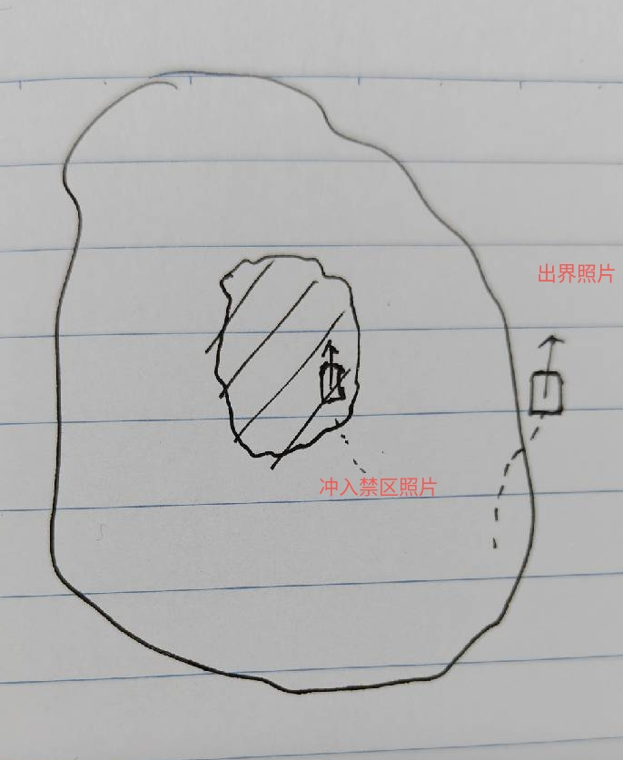
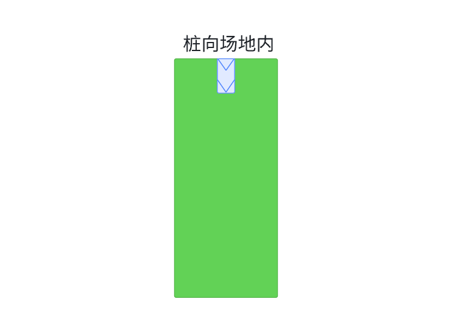
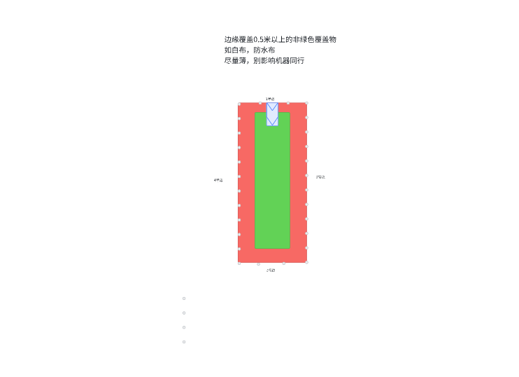
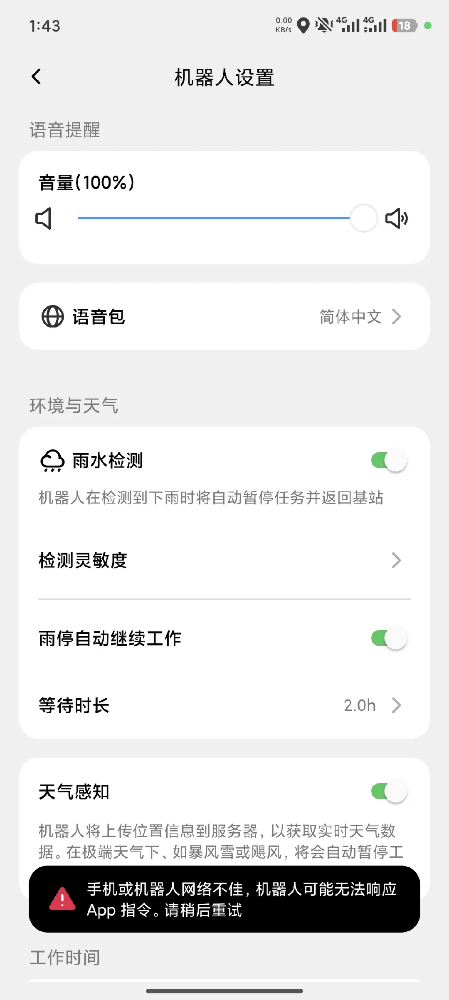

# Terramow测试Case

# 一、slam定位精度衡量办法

## 1. **定性评估方案**

（注意：需要观察机器实际的位置是否出界或者踩到禁区，而不是从app上看）

### 1.1 场地要求：

1. 建图的时候不要完全严格贴着实际边界，例如栅栏、大门、建筑物等

2. 可以建立一个小的地图，地图边缘做上标记（画线或拉线，不可高于草坪）。

3. 建图成功后，地图中间绘制一个禁区，地面上做好标记（画线或拉线，不可高于草坪）。

### 1.2 测试项

#### 1.2.1 出界检查

1. 观察机器后续割草过程中是否会出界。

2. 在出界位置拍照，记录最大出界位置的出界情况照片

#### 1.2.2 禁区检查

1. 观察割草过程中，机器是否冲入禁区里。

2. 在冲入禁区位置拍照，记录最大冲入禁区位置的情况照片

## 2. **定量评估方案**

### 2.1 场地需求：

在草地遥控建一个外框10m\*10m的图，使弓字的长度为10m。

### 2.2 测试项

#### 2.2.1 调头漏割

##### 2.2.1.1 示意图

##### 2.2.1.2 示例表

电子表格（无法获取数据：9hYVjc）

#### 2.2.2 行间漏割

##### 2.2.2.1 示意图

##### 2.2.2.2 示例表

电子表格（无法获取数据：RuHYHL）

## 3. 边界定位性能

1. 使用线材/障碍物，圈出一片10m x 3m的草地，桩在短边中心，朝向与长边方向平行面向场内

   

2. 使用割草机自主建图（非割草建图），并且保存完成

3. 场地内的一条长边区域内部一圈，铺非绿色的遮盖物。每隔1m统计机器与边界的距离。

   1. +为边界内距离边界的距离

   2. \- 为出边界，与边界的距离

4. 桩转动10°左右，重复bc

   

# 二、建图测试

1、正常建图的流程先走一遍。 看看正常建图流程 （看了youtube的视频，好像是正常弓字割草，然后最后自主沿了一圈边界）

* 关注点：

  * 建图行为是啥样的？

    1. 直接建图：一个机身宽度的稀疏弓字。稍微遇到点障碍物就避障。

    2. 割草建图：密集弓字割草，稍微遇到点障碍物就避障。

    3. 自主沿边两圈

  * 回桩后地图是否会再次优化（app上地图回桩前截一张图，回桩后等一段时间再截一张对比看看）？如果优化了地图，大概花费的时间是多少？

    3. 秒级的地图保存、数据处理时间，不像是专门为了地图优化做的。

    4. 回桩后有两个步骤，地图保存（约10s），数据处理（约3s）

2、建图中的异常情况测试

* 建图中是否允许搬起机器？&#x20;

  * 建图期间可以搬动，搬动后 APP会在现成的地图上进行“定位”，定位完成后姿态恢复正确。

* 从当前位置A，搬动机器后，放置到距离A点1m左右的位置B处，观察机器行为。&#x20;

  * 机器在B处是否会有先转圈重定位的动作？

    * 是，会前进1m左右，之后转一圈（不一定满一圈）。有时候会持续这个动作。

  * 重定位成功后，是否会回到原先A点？

    * 否

  * 搬起后，后续的建图定位精度如何？（机器的app上定位和机器的实际位置是否一致）

    * 搬起后会重定位，重定位成功后，机器位置就正确了

    * 基本准确

    * 重定位成功率较高，多次测试，假成功率很低

* 建图过程中，拖住机器，使得轮子打滑，观察机器行为。

  * 打滑后是否有重定位（定位找回）动作？

    * 定位几乎不受打滑影响

  * 打滑后，建图定位的精度如何？（机器的app上定位和机器的实际位置是否一致）

    * 定位几乎不受打滑影响，APP看没有明显轨迹错乱

  * 遮挡加打滑后精度怎么样

    * 遮挡后触发重定位

    * 重定位后精度正常

  * **需要补测长时间遮挡，出桩前遮挡的机器行为。**

    * 如果始终保持遮挡，会报错停机吗？报出的错误是什么？会引导用户清理摄像头吗？

3、摸排一下多区域建图情况

* 是否支持多区域建图

  * 建图的时候只能单个区域。想增加区域要结束建图，然后再添加。

* 建完图后，是否支持增/删区域

  * 支持

# 三、定位精度测试

1. 大概啥样的照度下，机器就不工作了？（重点关注低照度，使用照度计测量）

   1. 软件会有工作硬的工作时间限制。日出前，日落后，强制无法开始任务。

   2. 并且可以设置，日出后、日落前一小时内，不工作。

   3. 默认是日落前半小时，日出后半小时内不工作。

   4. 手机系统日期改了，这个日出日落时间不受影响。不过进入机器人设置界面会提示手机或机器人网络不佳。

   

2. **在太阳落山前开始割草，看看太阳落山时刻是否能够自动停止工作。**

3. 中午建图，傍晚割草，观察定位精度。

   1. 目前测试看，地图只在重定位的时候，会用到建出来的图（搬动桩后在搬桩后的方向上割草，实际出界。只要运行正常，就没有定位恢复能力）。

4. **割草过程中，动态障碍物（人类）频繁在相机前方走来走去，观察机器定位精度。**

5. 相机脏污或者遮挡的情况下，机器是否会检测报错？

   1. 测试过程中可能时间比较短，没有触发报错。

   2. 工作中遮挡会报重定位。

6. **创建通道（上桩通道或者区域通道）后，观察机器是否每次割草都一样的轨迹？（是否考虑了磨草等问题）**

# 四、重定位测试

1. 抱起机器后，重新放置在草坪上，观察机器的重定位动作。 只需要转圈，还是会走一些特定轨迹？

   1. 转圈+直行：没有明显先后顺序

2. 在区域1建立了地图后，将机器放置在区域1之外的地方，机器是否能重定位成功？如果成功了，定位是否准确？ 后续割草行为是否异常？如果失败了，机器之后的行为是啥？ 直接原地报错停机吗？

   1. 建图已完成的状态下

      1. 搬离建图区域，无共视的情况下，会不断尝试。有共视的情况下，会很快重定位结束，并且报错机器在界外。

      2. 无共视区域不会重定位成功，长达5min不断行走尝试也没有结束；

      3. 重定位完成前不断尝试，完成后根据是否在界外报错。

   2. 建图未完成的状态下

      1. 搬离建图区域，无共视会报错重定位失败

   3. 重定位成功的情况下，位置准确，行为正常

3. 直接更换桩的位置（app上不进行操作更换桩位置的处理），在桩附近进行重定位，观察是否成功，定位的位置是否准确？

   1. 会重定位成功到老地图上，充电桩的搬动（充电桩的图案）不会影响重定位的结果。因为测试过程中，机器会转动，桩搬动没有影响到重定位结果。

4. **更换桩位置后，在app上操作一下更换桩位置，使得app上显示的桩位置更新过来。 然后再在桩的附近进行重定位测试，观察是否成功，定位的位置是否准确？**

# 五、摸底竞品后新增测试

1. 遮挡相机，触发打滑，看看轮子对于定位有没有影响。

   1. 遮挡相机立马重定位

2. 机器的轮子有没有减震

   1. 无

3. 搬动充电桩，加大力度制造VIO CornerCase，测试看它是有个局部图，还是VIO做的好

   1. 重定位一定是到老图上，局部图有没有不确定，猜测是有；

   2. 不遮挡不跟丢不会主动重定位，可能一直在局部图上优化或回环

4. 搬动充电桩后，加长时间割草，看看是不是能够姿态恢复回来

   1. 偶发性出现一次重定位到老图上（上一次老地图已经被搬桩割草保存更新过一次）。

5. **建图完成后，后续的割草时刻，在草坪中间放置一些非草的很矮的东西，看看会不会压过去**

6. 建立多个区域，例如A区 B区域，两个区域距离远一点。  之后删除A区域，删除后，把机器搬动到A区域的位置，坐重定位，看看是否定位成功？ 或者报错出界？（目的是看一下，删除区域后，建立的地图会不会跟着删除，从而判断分区的地图是一个大地图还是多个子图）

   1. 建立a区域后扩建b,删除b后放在b区域重定位，重定位会成功，并且继续在删除后不存在的b区域割草。

   2. b区域割草完成后会把被删除的b区域的地图重新建出，并跨区域到a区继续全局割草。

7. **A区域建图成功，搬桩到没有共视关系的B区域割草，割草一段时间后触发重定位，看是否会成功或是一直尝试重定位？观察是否会重定位到新B图上？（测试是否会在新图上进行重定位）**

附录：

[ Terramow测试分析](https://roborock.feishu.cn/wiki/G945wXkCriO7vwkIqzdcVw9DnJe)
