# vioodo+gyro 递推精度分析

### 1. odo+gyro 递推和融合轨迹 rte

用融合轨迹作为真值，分别使用 odo+gyro 递推轨迹、vio 轨迹进行 rte 对比分析。

结论：总共十组数据，去掉 short\_pause\_20251231 这组 vio 轨迹明显异常的。有五组数据，vio 轨迹的 rte 更加好；有四组数据，odo+gyro 递推轨迹的 rte 更加好。

short\_pause\_20251231 vio 轨迹异常：

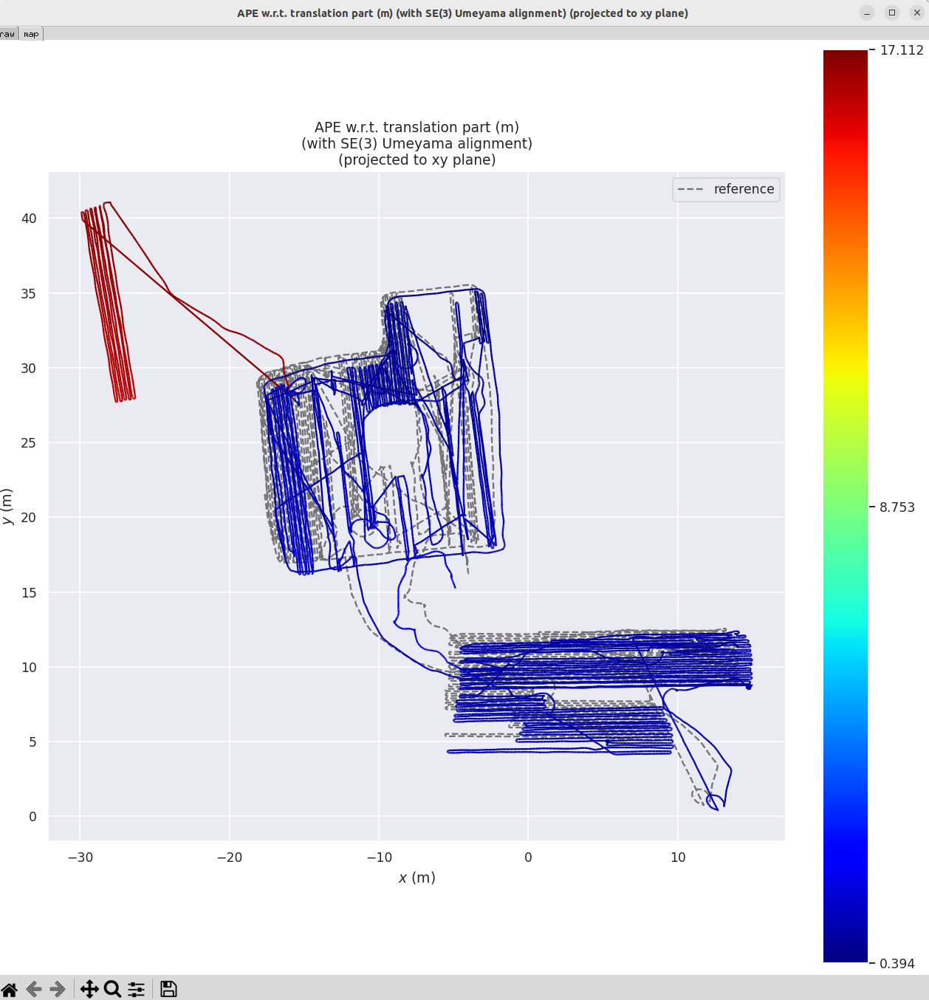

| 数据集                                                                                                                      | odo+gyro 递推轨迹5.0 米对齐5.0 米评估                                                                                                                                                                                                                                             | vio 轨迹5.0 米对齐5.0 米评估                                                                                                                                                                                                                                                       | odo+gyro 递推轨迹5.0 米对齐10.0 米评估                                                                                                                                                                                                                                             | vio 轨迹5.0 米对齐10.0 米评估                                                                                                                                                                                                                                                      | odo+gyro 递推轨迹5.0 米对齐15.0 米评估                                                                                                                                                                                                                                             | vio 轨迹5.0 米对齐15.0 米评估                                                                                                                                                                                                                                                      | odo+gyro 递推轨迹5.0 米对齐20.0 米评估                                                                                                                                                                                                                                             | vio 轨迹5.0 米对齐20.0 米评估                                                                                                                                                                                                                                                       |
| ------------------------------------------------------------------------------------------------------------------------ | ----------------------------------------------------------------------------------------------------------------------------------------------------------------------------------------------------------------------------------------------------------------------- | -------------------------------------------------------------------------------------------------------------------------------------------------------------------------------------------------------------------------------------------------------------------------- | ------------------------------------------------------------------------------------------------------------------------------------------------------------------------------------------------------------------------------------------------------------------------ | -------------------------------------------------------------------------------------------------------------------------------------------------------------------------------------------------------------------------------------------------------------------------- | ------------------------------------------------------------------------------------------------------------------------------------------------------------------------------------------------------------------------------------------------------------------------ | -------------------------------------------------------------------------------------------------------------------------------------------------------------------------------------------------------------------------------------------------------------------------- | ------------------------------------------------------------------------------------------------------------------------------------------------------------------------------------------------------------------------------------------------------------------------ | --------------------------------------------------------------------------------------------------------------------------------------------------------------------------------------------------------------------------------------------------------------------------- |
| 60-1\_NW\_2m-Arc\_251024\_14-15\_B2-1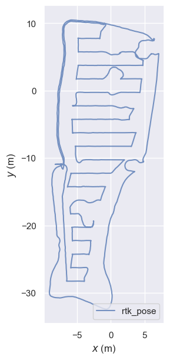 | max:                 0.299037mean:                0.110709median:              0.110182min:                 0.025972rmse:                0.121725rmse(error\_max):     0.161163rmse(yaw\_deg):       1.306677sse:                 0.948279std:                 0.050601 | max:                 0.581090mean:                0.296703median:              0.302121min:                 0.083596rmse:                0.315831rmse(error\_max):     0.439063rmse(yaw\_deg):       1.702878sse:                 6.284184std:                 0.108242    | max:                 0.454437mean:                0.173125median:              0.161817min:                 0.021187rmse:                0.196438rmse(error\_max):     0.234988rmse(yaw\_deg):       1.542298sse:                 2.431038std:                 0.092820  | max:                 0.941322mean:                0.485519median:              0.437263min:                 0.029727rmse:                0.545019rmse(error\_max):     0.659897rmse(yaw\_deg):       2.050622sse:                 18.416822std:                 0.247622   | max:                 0.681188mean:                0.220929median:              0.183613min:                 0.027700rmse:                0.259755rmse(error\_max):     0.300013rmse(yaw\_deg):       1.683220sse:                 4.183315std:                 0.136613  | max:                 1.358245mean:                0.627429median:              0.538389min:                 0.140584rmse:                0.723775rmse(error\_max):     0.839537rmse(yaw\_deg):       2.459223sse:                 31.954880std:                 0.360810   | max:                 1.018709mean:                0.263381median:              0.211173min:                 0.005311rmse:                0.326894rmse(error\_max):     0.370254rmse(yaw\_deg):       1.846522sse:                 6.518455std:                 0.193624  | max:                 1.758988mean:                0.750878median:              0.585549min:                 0.052245rmse:                0.883418rmse(error\_max):     1.005946rmse(yaw\_deg):       2.769494sse:                 46.825591std:                 0.465412    |
| 60-1\_NW\_Arc\_251027\_15-17\_B2-1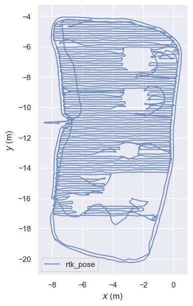    | max:                 1.415638mean:                0.097467median:              0.082272min:                 0.004415rmse:                0.163409rmse(error\_max):     0.198781rmse(yaw\_deg):       2.894610sse:                 3.631549std:                 0.131159 | max:                 0.380784mean:                0.174651median:              0.177895min:                 0.009914rmse:                0.200106rmse(error\_max):     0.279361rmse(yaw\_deg):       4.275378sse:                 5.325665std:                 0.097670    | max:                 1.420866mean:                0.123337median:              0.089193min:                 0.004182rmse:                0.213790rmse(error\_max):     0.257986rmse(yaw\_deg):       3.236246sse:                 6.170345std:                 0.174626  | max:                 0.731959mean:                0.222536median:              0.200814min:                 0.024004rmse:                0.263731rmse(error\_max):     0.353193rmse(yaw\_deg):       4.714683sse:                 9.181158std:                 0.141534    | max:                 1.549233mean:                0.138319median:              0.072987min:                 0.001718rmse:                0.255670rmse(error\_max):     0.303426rmse(yaw\_deg):       3.008029sse:                 8.759196std:                 0.215023  | max:                 1.031548mean:                0.218717median:              0.150378min:                 0.007414rmse:                0.289521rmse(error\_max):     0.399121rmse(yaw\_deg):       5.240235sse:                 10.980749std:                 0.189699   | max:                 1.575749mean:                0.175886median:              0.111939min:                 0.013098rmse:                0.303178rmse(error\_max):     0.353981rmse(yaw\_deg):       3.002489sse:                 12.224912std:                 0.246942 | max:                 1.186260mean:                0.281894median:              0.242079min:                 0.005961rmse:                0.349240rmse(error\_max):     0.439595rmse(yaw\_deg):       5.662724sse:                 15.855889std:                 0.206166    |
| 60-2\_E\_Arc\_251028\_10-12\_B2-1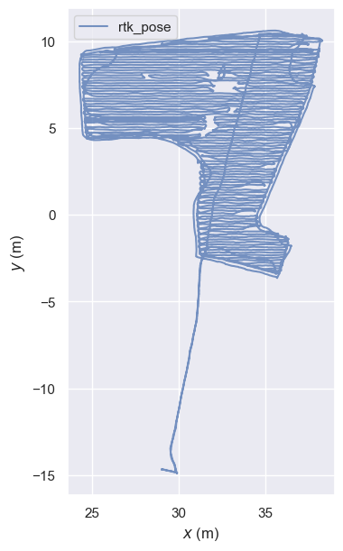     | max:                 0.656495mean:                0.137381median:              0.119610min:                 0.008999rmse:                0.167995rmse(error\_max):     0.212275rmse(yaw\_deg):       2.025521sse:                 5.305799std:                 0.096689 | max:                 0.441870mean:                0.205472median:              0.204418min:                 0.011119rmse:                0.232102rmse(error\_max):     0.338360rmse(yaw\_deg):       1.803780sse:                 9.912339std:                 0.107947    | max:                 0.798433mean:                0.219631median:              0.185544min:                 0.008701rmse:                0.271161rmse(error\_max):     0.319675rmse(yaw\_deg):       2.062165sse:                 13.749757std:                 0.159029 | max:                 0.770494mean:                0.283441median:              0.213620min:                 0.013237rmse:                0.350185rmse(error\_max):     0.458811rmse(yaw\_deg):       1.880414sse:                 22.441149std:                 0.205646   | max:                 0.831170mean:                0.277397median:              0.221948min:                 0.017463rmse:                0.333040rmse(error\_max):     0.392941rmse(yaw\_deg):       2.118754sse:                 20.630370std:                 0.184302 | max:                 1.097473mean:                0.329050median:              0.240434min:                 0.003943rmse:                0.411456rmse(error\_max):     0.533990rmse(yaw\_deg):       1.846420sse:                 30.811897std:                 0.247026   | max:                 1.315439mean:                0.346408median:              0.262173min:                 0.018874rmse:                0.426491rmse(error\_max):     0.486792rmse(yaw\_deg):       2.622968sse:                 33.650529std:                 0.248790 | max:                 1.041008mean:                0.366199median:              0.297597min:                 0.015999rmse:                0.440864rmse(error\_max):     0.585362rmse(yaw\_deg):       1.977610sse:                 35.179389std:                 0.245479    |
| 60-2\_E\_Arc\_251029\_9-11\_B2-1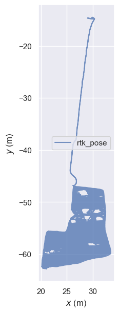      | max:                 0.491635mean:                0.110697median:              0.112489min:                 0.011018rmse:                0.125978rmse(error\_max):     0.185390rmse(yaw\_deg):       1.471406sse:                 3.237560std:                 0.060137 | max:                 0.387662mean:                0.220455median:              0.243145min:                 0.013673rmse:                0.242722rmse(error\_max):     0.347947rmse(yaw\_deg):       2.651216sse:                 11.664945std:                 0.101554   | max:                 0.813544mean:                0.158639median:              0.138680min:                 0.002459rmse:                0.195256rmse(error\_max):     0.257279rmse(yaw\_deg):       1.526812sse:                 7.739359std:                 0.113836  | max:                 0.695219mean:                0.313831median:              0.258882min:                 0.022133rmse:                0.370799rmse(error\_max):     0.478666rmse(yaw\_deg):       2.775898sse:                 27.085918std:                 0.197489   | max:                 1.205086mean:                0.182136median:              0.139448min:                 0.009988rmse:                0.233815rmse(error\_max):     0.307208rmse(yaw\_deg):       1.704976sse:                 11.043216std:                 0.146614 | max:                 1.035367mean:                0.350840median:              0.268804min:                 0.006877rmse:                0.431410rmse(error\_max):     0.560863rmse(yaw\_deg):       1.959475sse:                 36.478534std:                 0.251051   | max:                 1.613360mean:                0.196969median:              0.140927min:                 0.004504rmse:                0.263614rmse(error\_max):     0.348468rmse(yaw\_deg):       1.824230sse:                 13.968012std:                 0.175202 | max:                 1.373007mean:                0.361216median:              0.264527min:                 0.011431rmse:                0.467688rmse(error\_max):     0.622784rmse(yaw\_deg):       2.093941sse:                 42.652671std:                 0.297076    |
| 78-1\_NE\_2m-Arc\_1400-1600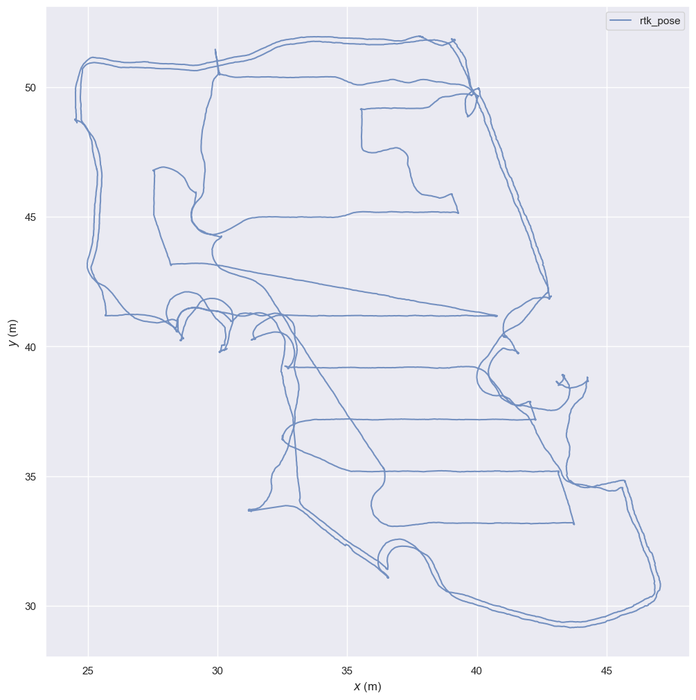           | max:                 0.610791mean:                0.129277median:              0.103966min:                 0.011369rmse:                0.160003rmse(error\_max):     0.204925rmse(yaw\_deg):       2.330292sse:                 1.664053std:                 0.094278 | max:                 0.160353mean:                0.068884median:              0.066994min:                 0.016636rmse:                0.075956rmse(error\_max):     0.111503rmse(yaw\_deg):       1.739841sse:                 0.363470std:                 0.032005    | max:                 1.378794mean:                0.224044median:              0.203386min:                 0.010852rmse:                0.291049rmse(error\_max):     0.329655rmse(yaw\_deg):       2.537196sse:                 5.421424std:                 0.185779  | max:                 0.258982mean:                0.112883median:              0.103719min:                 0.007627rmse:                0.124154rmse(error\_max):     0.163756rmse(yaw\_deg):       1.545757sse:                 0.955675std:                 0.051686    | max:                 1.679844mean:                0.319462median:              0.269185min:                 0.043118rmse:                0.408621rmse(error\_max):     0.448895rmse(yaw\_deg):       3.176134sse:                 10.519205std:                 0.254785 | max:                 0.452998mean:                0.154437median:              0.139084min:                 0.013865rmse:                0.176614rmse(error\_max):     0.214529rmse(yaw\_deg):       1.620387sse:                 1.902746std:                 0.085685    | max:                 2.209492mean:                0.414972median:              0.307971min:                 0.074162rmse:                0.550788rmse(error\_max):     0.594749rmse(yaw\_deg):       3.560141sse:                 18.808755std:                 0.362168 | max:                 0.566288mean:                0.191136median:              0.169865min:                 0.029673rmse:                0.226672rmse(error\_max):     0.268000rmse(yaw\_deg):       1.724797sse:                 3.082816std:                 0.121849     |
| 78-1\_NE\_Arc\_1440-1600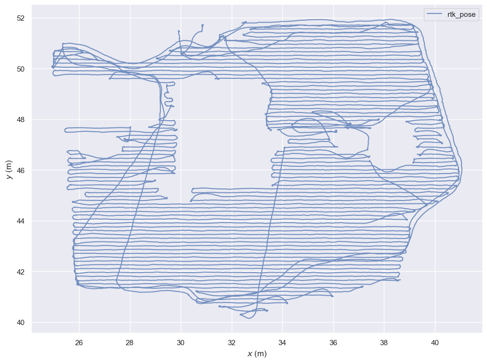              | max:                 0.227779mean:                0.093639median:              0.094401min:                 0.000698rmse:                0.103157rmse(error\_max):     0.134727rmse(yaw\_deg):       1.560518sse:                 2.011201std:                 0.043277 | max:                 0.198221mean:                0.066500median:              0.060360min:                 0.003771rmse:                0.075923rmse(error\_max):     0.101739rmse(yaw\_deg):       1.323793sse:                 1.060633std:                 0.036635    | max:                 0.411079mean:                0.143851median:              0.133891min:                 0.006927rmse:                0.166943rmse(error\_max):     0.201352rmse(yaw\_deg):       2.079062sse:                 5.239578std:                 0.084717  | max:                 0.367160mean:                0.103002median:              0.087909min:                 0.011512rmse:                0.119400rmse(error\_max):     0.149139rmse(yaw\_deg):       1.414718sse:                 2.608893std:                 0.060389    | max:                 0.606977mean:                0.190495median:              0.163575min:                 0.014766rmse:                0.223657rmse(error\_max):     0.265694rmse(yaw\_deg):       2.554991sse:                 9.354179std:                 0.117193  | max:                 0.401776mean:                0.136087median:              0.125465min:                 0.003560rmse:                0.157034rmse(error\_max):     0.190108rmse(yaw\_deg):       1.596080sse:                 4.488076std:                 0.078360    | max:                 0.610359mean:                0.227601median:              0.212815min:                 0.019693rmse:                0.261233rmse(error\_max):     0.330297rmse(yaw\_deg):       3.168633sse:                 12.693104std:                 0.128220 | max:                 0.570408mean:                0.172865median:              0.163327min:                 0.003508rmse:                0.197265rmse(error\_max):     0.232786rmse(yaw\_deg):       1.549053sse:                 7.043360std:                 0.095033     |
| 78\_corner1\_mowing\_20251218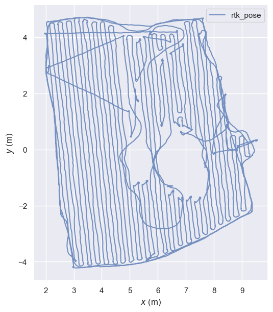         | max:                 0.343534mean:                0.096648median:              0.089862min:                 0.002739rmse:                0.110309rmse(error\_max):     0.149455rmse(yaw\_deg):       1.907281sse:                 0.973438std:                 0.053172 | max:                 0.165247mean:                0.049739median:              0.044750min:                 0.005627rmse:                0.057746rmse(error\_max):     0.082678rmse(yaw\_deg):       1.600140sse:                 0.253427std:                 0.029335    | max:                 0.414433mean:                0.127735median:              0.116357min:                 0.007495rmse:                0.146156rmse(error\_max):     0.191251rmse(yaw\_deg):       2.229499sse:                 1.687562std:                 0.071031  | max:                 0.184315mean:                0.057665median:              0.054510min:                 0.005287rmse:                0.068488rmse(error\_max):     0.097794rmse(yaw\_deg):       1.454943sse:                 0.351796std:                 0.036951    | max:                 0.373935mean:                0.118703median:              0.099144min:                 0.003222rmse:                0.137955rmse(error\_max):     0.201758rmse(yaw\_deg):       2.269730sse:                 1.484459std:                 0.070293  | max:                 0.362902mean:                0.053733median:              0.041817min:                 0.008446rmse:                0.072466rmse(error\_max):     0.107888rmse(yaw\_deg):       1.693702sse:                 0.388593std:                 0.048621    | max:                 0.431416mean:                0.139360median:              0.122910min:                 0.008030rmse:                0.163714rmse(error\_max):     0.225792rmse(yaw\_deg):       2.486551sse:                 2.063787std:                 0.085913  | max:                 0.291189mean:                0.058587median:              0.052117min:                 0.004005rmse:                0.072951rmse(error\_max):     0.112625rmse(yaw\_deg):       1.372670sse:                 0.388494std:                 0.043467     |
| 78\_corner3\_mowing\_20251219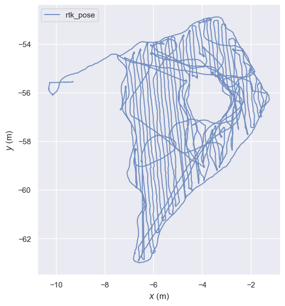         | max:                 0.377843mean:                0.158377median:              0.155428min:                 0.009989rmse:                0.178509rmse(error\_max):     0.261727rmse(yaw\_deg):       5.582262sse:                 2.071249std:                 0.082353 | max:                 0.254549mean:                0.078172median:              0.068015min:                 0.011747rmse:                0.093390rmse(error\_max):     0.120379rmse(yaw\_deg):       4.299161sse:                 0.523297std:                 0.051095    | max:                 0.495021mean:                0.210428median:              0.201286min:                 0.041409rmse:                0.233699rmse(error\_max):     0.334670rmse(yaw\_deg):       3.394891sse:                 3.495380std:                 0.101663  | max:                 0.284608mean:                0.087215median:              0.072877min:                 0.003115rmse:                0.105906rmse(error\_max):     0.146162rmse(yaw\_deg):       4.274139sse:                 0.661745std:                 0.060079    | max:                 0.693947mean:                0.218513median:              0.204725min:                 0.005917rmse:                0.268972rmse(error\_max):     0.385998rmse(yaw\_deg):       3.604868sse:                 4.557806std:                 0.156838  | max:                 0.342135mean:                0.085835median:              0.067807min:                 0.002388rmse:                0.110673rmse(error\_max):     0.163999rmse(yaw\_deg):       4.450873sse:                 0.710410std:                 0.069863    | max:                 0.854880mean:                0.268951median:              0.245062min:                 0.036740rmse:                0.322099rmse(error\_max):     0.426617rmse(yaw\_deg):       3.640798sse:                 6.432351std:                 0.177237  | max:                 0.328291mean:                0.088018median:              0.076154min:                 0.008795rmse:                0.105064rmse(error\_max):     0.180754rmse(yaw\_deg):       3.358017sse:                 0.629193std:                 0.057370     |
| 105-1\_NE-Arc\_1150-1315\_B2-14\_2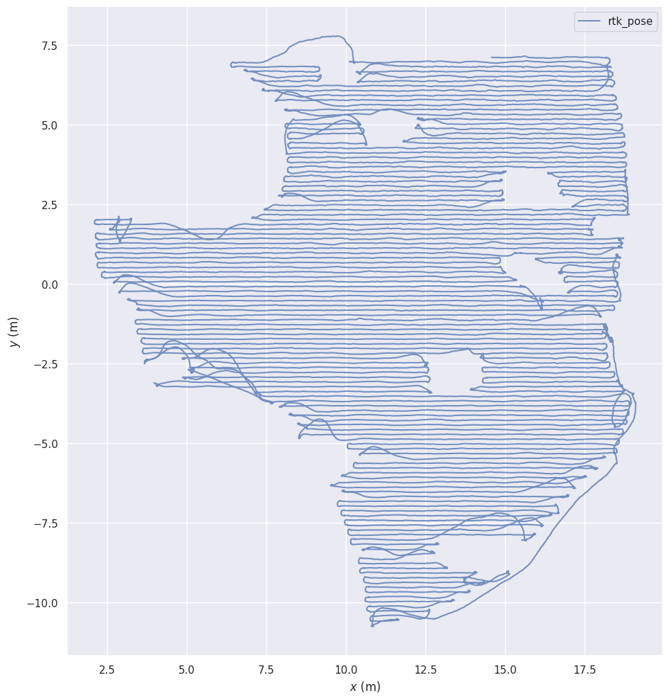    | max:                 0.378746mean:                0.154489median:              0.167286min:                 0.013760rmse:                0.171588rmse(error\_max):     0.242339rmse(yaw\_deg):       1.788084sse:                 7.419481std:                 0.074670 | max:                 0.478895mean:                0.100572median:              0.100352min:                 0.001578rmse:                0.112134rmse(error\_max):     0.158097rmse(yaw\_deg):       1.209252sse:                 3.093221std:                 0.049592    | max:                 0.654702mean:                0.247728median:              0.230849min:                 0.017457rmse:                0.281745rmse(error\_max):     0.347560rmse(yaw\_deg):       2.210250sse:                 19.924509std:                 0.134206 | max:                 0.586349mean:                0.145747median:              0.134713min:                 0.006358rmse:                0.170232rmse(error\_max):     0.219212rmse(yaw\_deg):       1.304827sse:                 7.099857std:                 0.087959    | max:                 0.841185mean:                0.292104median:              0.238791min:                 0.021060rmse:                0.343350rmse(error\_max):     0.424523rmse(yaw\_deg):       2.607444sse:                 29.472302std:                 0.180456 | max:                 0.648539mean:                0.163967median:              0.141818min:                 0.013118rmse:                0.194087rmse(error\_max):     0.254729rmse(yaw\_deg):       1.304891sse:                 9.191404std:                 0.103849    | max:                 1.021104mean:                0.333215median:              0.304300min:                 0.012005rmse:                0.384418rmse(error\_max):     0.482508rmse(yaw\_deg):       3.062935sse:                 36.796473std:                 0.191690 | max:                 0.614006mean:                0.186273median:              0.165408min:                 0.008395rmse:                0.213348rmse(error\_max):     0.283370rmse(yaw\_deg):       1.324011sse:                 11.060684std:                 0.104017    |
| short\_pause\_20251231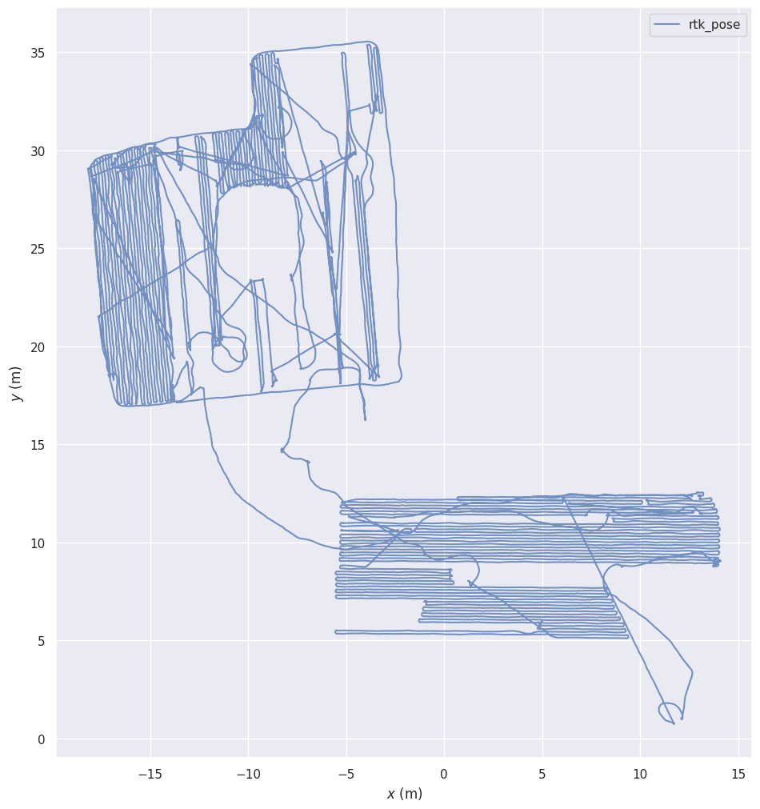                | max:                 0.420780mean:                0.102265median:              0.107779min:                 0.005647rmse:                0.111283rmse(error\_max):     0.160230rmse(yaw\_deg):       1.361795sse:                 4.247675std:                 0.043884 | max:                 17.963034mean:                0.130271median:              0.069816min:                 0.002973rmse:                0.991435rmse(error\_max):     1.130471rmse(yaw\_deg):       1.827429sse:                 325.354157std:                 0.982839 | max:                 0.605295mean:                0.160825median:              0.168672min:                 0.009819rmse:                0.182763rmse(error\_max):     0.231572rmse(yaw\_deg):       1.404523sse:                 11.423629std:                 0.086820 | max:                 17.966874mean:                0.216791median:              0.094637min:                 0.001201rmse:                1.402803rmse(error\_max):     1.507039rmse(yaw\_deg):       1.796122sse:                 649.392590std:                 1.385950 | max:                 0.701117mean:                0.196120median:              0.182876min:                 0.006694rmse:                0.225684rmse(error\_max):     0.280674rmse(yaw\_deg):       1.504377sse:                 17.368175std:                 0.111669 | max:                 17.908087mean:                0.289455median:              0.104916min:                 0.006257rmse:                1.720459rmse(error\_max):     1.808249rmse(yaw\_deg):       1.904283sse:                 973.832951std:                 1.695935 | max:                 0.987719mean:                0.214301median:              0.200506min:                 0.007605rmse:                0.247489rmse(error\_max):     0.317467rmse(yaw\_deg):       1.615281sse:                 20.825334std:                 0.123798 | max:                 17.993176mean:                0.350575median:              0.106214min:                 0.010470rmse:                1.985107rmse(error\_max):     2.069553rmse(yaw\_deg):       1.877445sse:                 1292.533527std:                 1.953906 |

### 2. odo+gyro 递推和 RTK 样条曲线 rte 对比

RTK 样条曲线，过滤掉静止和原地旋转的点后使用前后五个点作为样条曲线进行拟合

| 数据名                                   | odo5m                                                                                                                                                                                                                                                                                                           | vio5m                                                                                                                                                                                                                                                                                                            | odo10m                                                                                                                                                                                                                                                                                                           | vio10m                                                                                                                                                                                                                                                                                                             | odo15m                                                                                                                                                                                                                                                                                                           | vio15m                                                                                                                                                                                                                                                                                                             | odo20m                                                                                                                                                                                                                                                                                                           | vio20m                                                                                                                                                                                                                                                                                                             |
| ------------------------------------- | --------------------------------------------------------------------------------------------------------------------------------------------------------------------------------------------------------------------------------------------------------------------------------------------------------------- | ---------------------------------------------------------------------------------------------------------------------------------------------------------------------------------------------------------------------------------------------------------------------------------------------------------------- | ---------------------------------------------------------------------------------------------------------------------------------------------------------------------------------------------------------------------------------------------------------------------------------------------------------------- | ------------------------------------------------------------------------------------------------------------------------------------------------------------------------------------------------------------------------------------------------------------------------------------------------------------------ | ---------------------------------------------------------------------------------------------------------------------------------------------------------------------------------------------------------------------------------------------------------------------------------------------------------------- | ------------------------------------------------------------------------------------------------------------------------------------------------------------------------------------------------------------------------------------------------------------------------------------------------------------------ | ---------------------------------------------------------------------------------------------------------------------------------------------------------------------------------------------------------------------------------------------------------------------------------------------------------------- | ------------------------------------------------------------------------------------------------------------------------------------------------------------------------------------------------------------------------------------------------------------------------------------------------------------------ |
| 60-1\_NW\_2m-Arc\_251024\_14-15\_B2-1 | max:                 0.234720&#xA;mean:                0.078472&#xA;median:              0.082412&#xA;min:                 0.001980&#xA;rmse:                0.092476&#xA;rmse(error\_max):     0.151991&#xA;rmse(yaw\_deg):       3.615176&#xA;sse:                 0.436140&#xA;std:                 0.048927 | max:                 0.439866&#xA;mean:                0.200534&#xA;median:              0.206197&#xA;min:                 0.011375&#xA;rmse:                0.219539&#xA;rmse(error\_max):     0.397119&#xA;rmse(yaw\_deg):       6.800640&#xA;sse:                 2.891846&#xA;std:                 0.089351  | max:                 0.523238&#xA;mean:                0.153990&#xA;median:              0.153106&#xA;min:                 0.018244&#xA;rmse:                0.176795&#xA;rmse(error\_max):     0.235302&#xA;rmse(yaw\_deg):       4.331588&#xA;sse:                 1.844131&#xA;std:                 0.086853  | max:                 0.850494&#xA;mean:                0.429691&#xA;median:              0.393243&#xA;min:                 0.088766&#xA;rmse:                0.475874&#xA;rmse(error\_max):     0.623254&#xA;rmse(yaw\_deg):       10.306451&#xA;sse:                 13.813838&#xA;std:                 0.204504  | max:                 0.557578&#xA;mean:                0.202749&#xA;median:              0.188592&#xA;min:                 0.010919&#xA;rmse:                0.239252&#xA;rmse(error\_max):     0.304613&#xA;rmse(yaw\_deg):       4.390141&#xA;sse:                 3.548962&#xA;std:                 0.127020  | max:                 1.304436&#xA;mean:                0.585169&#xA;median:              0.509205&#xA;min:                 0.087077&#xA;rmse:                0.667708&#xA;rmse(error\_max):     0.807254&#xA;rmse(yaw\_deg):       6.735956&#xA;sse:                 26.750016&#xA;std:                 0.321575   | max:                 0.864505&#xA;mean:                0.259959&#xA;median:              0.218140&#xA;min:                 0.003164&#xA;rmse:                0.314225&#xA;rmse(error\_max):     0.376233&#xA;rmse(yaw\_deg):       4.408544&#xA;sse:                 6.022986&#xA;std:                 0.176518  | max:                 1.607482&#xA;mean:                0.705355&#xA;median:              0.591357&#xA;min:                 0.080552&#xA;rmse:                0.823538&#xA;rmse(error\_max):     0.972986&#xA;rmse(yaw\_deg):       6.788762&#xA;sse:                 40.014660&#xA;std:                 0.425076   |
| 60-1\_NW\_Arc\_251027\_15-17\_B2-1    | max:                 0.190841&#xA;mean:                0.068721&#xA;median:              0.063765&#xA;min:                 0.003103&#xA;rmse:                0.081090&#xA;rmse(error\_max):     0.142648&#xA;rmse(yaw\_deg):       3.747635&#xA;sse:                 0.789076&#xA;std:                 0.043047 | max:                 0.349729&#xA;mean:                0.142250&#xA;median:              0.142053&#xA;min:                 0.007597&#xA;rmse:                0.160289&#xA;rmse(error\_max):     0.247931&#xA;rmse(yaw\_deg):       6.770883&#xA;sse:                 3.134497&#xA;std:                 0.073876  | max:                 0.408822&#xA;mean:                0.103138&#xA;median:              0.091468&#xA;min:                 0.002011&#xA;rmse:                0.124592&#xA;rmse(error\_max):     0.219737&#xA;rmse(yaw\_deg):       4.110322&#xA;sse:                 2.002490&#xA;std:                 0.069899  | max:                 0.640432&#xA;mean:                0.195809&#xA;median:              0.152856&#xA;min:                 0.011836&#xA;rmse:                0.242209&#xA;rmse(error\_max):     0.328832&#xA;rmse(yaw\_deg):       7.358033&#xA;sse:                 7.391837&#xA;std:                 0.142563    | max:                 1.372633&#xA;mean:                0.117897&#xA;median:              0.094621&#xA;min:                 0.006461&#xA;rmse:                0.177434&#xA;rmse(error\_max):     0.265117&#xA;rmse(yaw\_deg):       4.342921&#xA;sse:                 4.092783&#xA;std:                 0.132602  | max:                 0.924713&#xA;mean:                0.208627&#xA;median:              0.166108&#xA;min:                 0.001694&#xA;rmse:                0.269076&#xA;rmse(error\_max):     0.377331&#xA;rmse(yaw\_deg):       7.590892&#xA;sse:                 9.122605&#xA;std:                 0.169931    | max:                 1.532752&#xA;mean:                0.148181&#xA;median:              0.104963&#xA;min:                 0.012907&#xA;rmse:                0.236040&#xA;rmse(error\_max):     0.311153&#xA;rmse(yaw\_deg):       4.425104&#xA;sse:                 7.298679&#xA;std:                 0.183732  | max:                 1.061736&#xA;mean:                0.270337&#xA;median:              0.229509&#xA;min:                 0.013911&#xA;rmse:                0.330361&#xA;rmse(error\_max):     0.418121&#xA;rmse(yaw\_deg):       8.703865&#xA;sse:                 13.751459&#xA;std:                 0.189885   |
| 60-2\_E\_Arc\_251028\_10-12\_B2-1     | max:                 0.547197&#xA;mean:                0.100980&#xA;median:              0.089287&#xA;min:                 0.000500&#xA;rmse:                0.130467&#xA;rmse(error\_max):     0.191818&#xA;rmse(yaw\_deg):       4.747716&#xA;sse:                 2.825585&#xA;std:                 0.082611 | max:                 0.346573&#xA;mean:                0.155071&#xA;median:              0.156836&#xA;min:                 0.016372&#xA;rmse:                0.169931&#xA;rmse(error\_max):     0.297687&#xA;rmse(yaw\_deg):       6.078232&#xA;sse:                 5.111142&#xA;std:                 0.069494  | max:                 0.809557&#xA;mean:                0.196384&#xA;median:              0.157238&#xA;min:                 0.005470&#xA;rmse:                0.245636&#xA;rmse(error\_max):     0.295054&#xA;rmse(yaw\_deg):       4.536997&#xA;sse:                 10.860683&#xA;std:                 0.147548 | max:                 0.696486&#xA;mean:                0.258683&#xA;median:              0.221778&#xA;min:                 0.007583&#xA;rmse:                0.310372&#xA;rmse(error\_max):     0.426786&#xA;rmse(yaw\_deg):       6.214912&#xA;sse:                 17.146846&#xA;std:                 0.171505   | max:                 0.879577&#xA;mean:                0.249716&#xA;median:              0.201006&#xA;min:                 0.003528&#xA;rmse:                0.308902&#xA;rmse(error\_max):     0.371208&#xA;rmse(yaw\_deg):       4.738431&#xA;sse:                 17.271142&#xA;std:                 0.181831 | max:                 0.931015&#xA;mean:                0.315389&#xA;median:              0.224584&#xA;min:                 0.007601&#xA;rmse:                0.389239&#xA;rmse(error\_max):     0.509582&#xA;rmse(yaw\_deg):       6.172131&#xA;sse:                 26.816757&#xA;std:                 0.228116   | max:                 1.288021&#xA;mean:                0.317960&#xA;median:              0.253402&#xA;min:                 0.010723&#xA;rmse:                0.395587&#xA;rmse(error\_max):     0.468120&#xA;rmse(yaw\_deg):       4.900635&#xA;sse:                 28.480984&#xA;std:                 0.235352 | max:                 1.083124&#xA;mean:                0.356074&#xA;median:              0.296063&#xA;min:                 0.016569&#xA;rmse:                0.429611&#xA;rmse(error\_max):     0.567257&#xA;rmse(yaw\_deg):       5.961491&#xA;sse:                 32.483523&#xA;std:                 0.240369   |
| 60-2\_E\_Arc\_251029\_9-11\_B2-1      | max:                 0.249137&#xA;mean:                0.075147&#xA;median:              0.074286&#xA;min:                 0.000637&#xA;rmse:                0.087904&#xA;rmse(error\_max):     0.151039&#xA;rmse(yaw\_deg):       5.335479&#xA;sse:                 1.267243&#xA;std:                 0.045607 | max:                 0.303089&#xA;mean:                0.160492&#xA;median:              0.171695&#xA;min:                 0.008366&#xA;rmse:                0.173915&#xA;rmse(error\_max):     0.310428&#xA;rmse(yaw\_deg):       7.820673&#xA;sse:                 5.656071&#xA;std:                 0.066997  | max:                 0.578289&#xA;mean:                0.139529&#xA;median:              0.128133&#xA;min:                 0.001226&#xA;rmse:                0.163474&#xA;rmse(error\_max):     0.216573&#xA;rmse(yaw\_deg):       5.036074&#xA;sse:                 4.863738&#xA;std:                 0.085179  | max:                 0.646100&#xA;mean:                0.288521&#xA;median:              0.253139&#xA;min:                 0.003792&#xA;rmse:                0.332409&#xA;rmse(error\_max):     0.447330&#xA;rmse(yaw\_deg):       7.705077&#xA;sse:                 21.104645&#xA;std:                 0.165079   | max:                 0.737253&#xA;mean:                0.163118&#xA;median:              0.144671&#xA;min:                 0.011303&#xA;rmse:                0.197663&#xA;rmse(error\_max):     0.258361&#xA;rmse(yaw\_deg):       4.837647&#xA;sse:                 7.228089&#xA;std:                 0.111638  | max:                 0.988005&#xA;mean:                0.337239&#xA;median:              0.235880&#xA;min:                 0.013257&#xA;rmse:                0.414311&#xA;rmse(error\_max):     0.540638&#xA;rmse(yaw\_deg):       6.217478&#xA;sse:                 32.614110&#xA;std:                 0.240672   | max:                 1.137002&#xA;mean:                0.178119&#xA;median:              0.149574&#xA;min:                 0.008109&#xA;rmse:                0.224855&#xA;rmse(error\_max):     0.296877&#xA;rmse(yaw\_deg):       4.801089&#xA;sse:                 9.404139&#xA;std:                 0.137235  | max:                 1.339548&#xA;mean:                0.362232&#xA;median:              0.275539&#xA;min:                 0.008397&#xA;rmse:                0.459237&#xA;rmse(error\_max):     0.607277&#xA;rmse(yaw\_deg):       9.027370&#xA;sse:                 39.859918&#xA;std:                 0.282289   |
| 78-1\_NE\_2m-Arc\_1400-1600           | max:                 0.114757&#xA;mean:                0.056649&#xA;median:              0.055733&#xA;min:                 0.005787&#xA;rmse:                0.067847&#xA;rmse(error\_max):     0.145713&#xA;rmse(yaw\_deg):       4.616575&#xA;sse:                 0.133493&#xA;std:                 0.037338 | max:                 0.149855&#xA;mean:                0.055722&#xA;median:              0.058455&#xA;min:                 0.001526&#xA;rmse:                0.063665&#xA;rmse(error\_max):     0.109488&#xA;rmse(yaw\_deg):       5.228080&#xA;sse:                 0.235087&#xA;std:                 0.030795  | max:                 0.317401&#xA;mean:                0.122251&#xA;median:              0.111896&#xA;min:                 0.010280&#xA;rmse:                0.146282&#xA;rmse(error\_max):     0.207875&#xA;rmse(yaw\_deg):       4.670030&#xA;sse:                 0.855933&#xA;std:                 0.080331  | max:                 0.272226&#xA;mean:                0.112968&#xA;median:              0.095420&#xA;min:                 0.017875&#xA;rmse:                0.130758&#xA;rmse(error\_max):     0.172133&#xA;rmse(yaw\_deg):       5.449442&#xA;sse:                 1.025864&#xA;std:                 0.065848    | max:                 0.386791&#xA;mean:                0.178539&#xA;median:              0.171149&#xA;min:                 0.008230&#xA;rmse:                0.202903&#xA;rmse(error\_max):     0.277176&#xA;rmse(yaw\_deg):       5.662269&#xA;sse:                 1.811472&#xA;std:                 0.096404  | max:                 0.416013&#xA;mean:                0.161341&#xA;median:              0.148582&#xA;min:                 0.009439&#xA;rmse:                0.188998&#xA;rmse(error\_max):     0.232732&#xA;rmse(yaw\_deg):       4.850836&#xA;sse:                 2.107487&#xA;std:                 0.098433    | max:                 0.644305&#xA;mean:                0.226948&#xA;median:              0.191730&#xA;min:                 0.008323&#xA;rmse:                0.269558&#xA;rmse(error\_max):     0.448891&#xA;rmse(yaw\_deg):       5.864390&#xA;sse:                 3.415094&#xA;std:                 0.145452  | max:                 0.675940&#xA;mean:                0.205901&#xA;median:              0.171429&#xA;min:                 0.005876&#xA;rmse:                0.248605&#xA;rmse(error\_max):     0.292936&#xA;rmse(yaw\_deg):       11.020288&#xA;sse:                 3.584670&#xA;std:                 0.139318   |
| 78-1\_NE\_Arc\_1440-1600              | max:                 0.184204&#xA;mean:                0.062242&#xA;median:              0.058687&#xA;min:                 0.001473&#xA;rmse:                0.072954&#xA;rmse(error\_max):     0.120633&#xA;rmse(yaw\_deg):       3.918310&#xA;sse:                 0.846248&#xA;std:                 0.038057 | max:                 0.151546&#xA;mean:                0.061952&#xA;median:              0.058548&#xA;min:                 0.000692&#xA;rmse:                0.068836&#xA;rmse(error\_max):     0.104190&#xA;rmse(yaw\_deg):       5.406220&#xA;sse:                 0.824474&#xA;std:                 0.030005  | max:                 0.410359&#xA;mean:                0.125809&#xA;median:              0.117991&#xA;min:                 0.002279&#xA;rmse:                0.149645&#xA;rmse(error\_max):     0.184972&#xA;rmse(yaw\_deg):       4.081669&#xA;sse:                 3.896511&#xA;std:                 0.081029  | max:                 0.306393&#xA;mean:                0.105292&#xA;median:              0.096062&#xA;min:                 0.016115&#xA;rmse:                0.118907&#xA;rmse(error\_max):     0.155973&#xA;rmse(yaw\_deg):       5.118605&#xA;sse:                 2.516714&#xA;std:                 0.055249    | max:                 0.702422&#xA;mean:                0.170051&#xA;median:              0.133593&#xA;min:                 0.004184&#xA;rmse:                0.213977&#xA;rmse(error\_max):     0.249710&#xA;rmse(yaw\_deg):       4.544994&#xA;sse:                 8.241489&#xA;std:                 0.129880  | max:                 0.528098&#xA;mean:                0.142783&#xA;median:              0.126870&#xA;min:                 0.007006&#xA;rmse:                0.164063&#xA;rmse(error\_max):     0.199932&#xA;rmse(yaw\_deg):       7.312874&#xA;sse:                 4.764249&#xA;std:                 0.080807    | max:                 0.669819&#xA;mean:                0.212452&#xA;median:              0.173298&#xA;min:                 0.010455&#xA;rmse:                0.254340&#xA;rmse(error\_max):     0.304677&#xA;rmse(yaw\_deg):       4.816217&#xA;sse:                 11.708656&#xA;std:                 0.139832 | max:                 0.631897&#xA;mean:                0.178020&#xA;median:              0.166757&#xA;min:                 0.010380&#xA;rmse:                0.204314&#xA;rmse(error\_max):     0.242815&#xA;rmse(yaw\_deg):       7.373126&#xA;sse:                 7.347000&#xA;std:                 0.100265    |
| 78\_corner1\_mowing\_20251218         | max:                 0.162621&#xA;mean:                0.048070&#xA;median:              0.035942&#xA;min:                 0.002993&#xA;rmse:                0.063046&#xA;rmse(error\_max):     0.144821&#xA;rmse(yaw\_deg):       4.115648&#xA;sse:                 0.198741&#xA;std:                 0.040794 | max:                 0.125912&#xA;mean:                0.040010&#xA;median:              0.033630&#xA;min:                 0.005508&#xA;rmse:                0.047717&#xA;rmse(error\_max):     0.079372&#xA;rmse(yaw\_deg):       9.222895&#xA;sse:                 0.145723&#xA;std:                 0.026002  | max:                 0.294103&#xA;mean:                0.113403&#xA;median:              0.112034&#xA;min:                 0.004109&#xA;rmse:                0.132973&#xA;rmse(error\_max):     0.181629&#xA;rmse(yaw\_deg):       4.777542&#xA;sse:                 1.237723&#xA;std:                 0.069437  | max:                 0.198277&#xA;mean:                0.064521&#xA;median:              0.055115&#xA;min:                 0.006416&#xA;rmse:                0.076542&#xA;rmse(error\_max):     0.103225&#xA;rmse(yaw\_deg):       6.506975&#xA;sse:                 0.415971&#xA;std:                 0.041180    | max:                 0.340766&#xA;mean:                0.136919&#xA;median:              0.132052&#xA;min:                 0.005781&#xA;rmse:                0.155956&#xA;rmse(error\_max):     0.193058&#xA;rmse(yaw\_deg):       4.614531&#xA;sse:                 1.824177&#xA;std:                 0.074670  | max:                 0.174994&#xA;mean:                0.062685&#xA;median:              0.059263&#xA;min:                 0.010400&#xA;rmse:                0.071230&#xA;rmse(error\_max):     0.111392&#xA;rmse(yaw\_deg):       5.930764&#xA;sse:                 0.365303&#xA;std:                 0.033827    | max:                 0.344383&#xA;mean:                0.141983&#xA;median:              0.130465&#xA;min:                 0.007916&#xA;rmse:                0.158778&#xA;rmse(error\_max):     0.212962&#xA;rmse(yaw\_deg):       4.790410&#xA;sse:                 1.915994&#xA;std:                 0.071072  | max:                 0.149618&#xA;mean:                0.057507&#xA;median:              0.052974&#xA;min:                 0.003138&#xA;rmse:                0.066725&#xA;rmse(error\_max):     0.118018&#xA;rmse(yaw\_deg):       5.547366&#xA;sse:                 0.316104&#xA;std:                 0.033840    |
| 78\_corner3\_mowing\_20251219         | max:                 0.316158&#xA;mean:                0.070522&#xA;median:              0.054852&#xA;min:                 0.015446&#xA;rmse:                0.096331&#xA;rmse(error\_max):     0.197703&#xA;rmse(yaw\_deg):       6.492703&#xA;sse:                 0.213431&#xA;std:                 0.065622 | max:                 0.191820&#xA;mean:                0.065784&#xA;median:              0.061379&#xA;min:                 0.002650&#xA;rmse:                0.079338&#xA;rmse(error\_max):     0.106901&#xA;rmse(yaw\_deg):       14.718574&#xA;sse:                 0.258076&#xA;std:                 0.044352 | max:                 0.422946&#xA;mean:                0.144218&#xA;median:              0.124166&#xA;min:                 0.007724&#xA;rmse:                0.175731&#xA;rmse(error\_max):     0.240575&#xA;rmse(yaw\_deg):       6.930182&#xA;sse:                 1.142618&#xA;std:                 0.100413  | max:                 0.318116&#xA;mean:                0.087312&#xA;median:              0.083322&#xA;min:                 0.006916&#xA;rmse:                0.104731&#xA;rmse(error\_max):     0.135571&#xA;rmse(yaw\_deg):       13.870308&#xA;sse:                 0.603275&#xA;std:                 0.057838   | max:                 0.559086&#xA;mean:                0.150360&#xA;median:              0.108659&#xA;min:                 0.006943&#xA;rmse:                0.193989&#xA;rmse(error\_max):     0.292808&#xA;rmse(yaw\_deg):       6.531277&#xA;sse:                 1.693423&#xA;std:                 0.122570  | max:                 0.169907&#xA;mean:                0.078920&#xA;median:              0.068837&#xA;min:                 0.008824&#xA;rmse:                0.088183&#xA;rmse(error\_max):     0.144553&#xA;rmse(yaw\_deg):       13.164696&#xA;sse:                 0.419920&#xA;std:                 0.039344   | max:                 0.577857&#xA;mean:                0.150938&#xA;median:              0.098764&#xA;min:                 0.005180&#xA;rmse:                0.200456&#xA;rmse(error\_max):     0.316349&#xA;rmse(yaw\_deg):       6.382143&#xA;sse:                 1.928759&#xA;std:                 0.131909  | max:                 0.193438&#xA;mean:                0.082838&#xA;median:              0.083516&#xA;min:                 0.010013&#xA;rmse:                0.094855&#xA;rmse(error\_max):     0.163342&#xA;rmse(yaw\_deg):       23.183662&#xA;sse:                 0.476871&#xA;std:                 0.046210   |
| 105-1\_NE-Arc\_1150-1315\_B2-14\_2    | max:                 0.274539&#xA;mean:                0.141086&#xA;median:              0.143974&#xA;min:                 0.007035&#xA;rmse:                0.153757&#xA;rmse(error\_max):     0.235093&#xA;rmse(yaw\_deg):       4.588213&#xA;sse:                 5.815773&#xA;std:                 0.061123 | max:                 0.400998&#xA;mean:                0.090247&#xA;median:              0.088290&#xA;min:                 0.004265&#xA;rmse:                0.100217&#xA;rmse(error\_max):     0.159012&#xA;rmse(yaw\_deg):       5.126080&#xA;sse:                 2.380314&#xA;std:                 0.043577  | max:                 0.594654&#xA;mean:                0.244261&#xA;median:              0.241264&#xA;min:                 0.016191&#xA;rmse:                0.276489&#xA;rmse(error\_max):     0.339742&#xA;rmse(yaw\_deg):       4.853186&#xA;sse:                 18.882196&#xA;std:                 0.129549 | max:                 0.581846&#xA;mean:                0.156560&#xA;median:              0.154471&#xA;min:                 0.008354&#xA;rmse:                0.177392&#xA;rmse(error\_max):     0.226676&#xA;rmse(yaw\_deg):       5.099333&#xA;sse:                 7.520872&#xA;std:                 0.083409    | max:                 0.806554&#xA;mean:                0.292075&#xA;median:              0.236901&#xA;min:                 0.025167&#xA;rmse:                0.344738&#xA;rmse(error\_max):     0.418656&#xA;rmse(yaw\_deg):       5.007416&#xA;sse:                 29.235703&#xA;std:                 0.183129 | max:                 0.651741&#xA;mean:                0.176892&#xA;median:              0.153558&#xA;min:                 0.014352&#xA;rmse:                0.204533&#xA;rmse(error\_max):     0.265973&#xA;rmse(yaw\_deg):       5.664086&#xA;sse:                 9.956458&#xA;std:                 0.102679    | max:                 1.034023&#xA;mean:                0.334738&#xA;median:              0.304314&#xA;min:                 0.029398&#xA;rmse:                0.386894&#xA;rmse(error\_max):     0.477485&#xA;rmse(yaw\_deg):       5.264416&#xA;sse:                 36.673388&#xA;std:                 0.194005 | max:                 0.685683&#xA;mean:                0.188618&#xA;median:              0.169719&#xA;min:                 0.027196&#xA;rmse:                0.216186&#xA;rmse(error\_max):     0.294225&#xA;rmse(yaw\_deg):       5.302748&#xA;sse:                 11.076509&#xA;std:                 0.105639   |
| short\_pause\_20251231                | max:                 0.212707&#xA;mean:                0.078728&#xA;median:              0.078986&#xA;min:                 0.002241&#xA;rmse:                0.087872&#xA;rmse(error\_max):     0.152326&#xA;rmse(yaw\_deg):       3.728456&#xA;sse:                 2.370477&#xA;std:                 0.039030 | max:                 0.344078&#xA;mean:                0.059277&#xA;median:              0.051617&#xA;min:                 0.002089&#xA;rmse:                0.071443&#xA;rmse(error\_max):     0.325689&#xA;rmse(yaw\_deg):       9.055740&#xA;sse:                 1.536317&#xA;std:                 0.039879  | max:                 0.396623&#xA;mean:                0.144885&#xA;median:              0.146919&#xA;min:                 0.008021&#xA;rmse:                0.163691&#xA;rmse(error\_max):     0.223993&#xA;rmse(yaw\_deg):       3.578034&#xA;sse:                 8.922668&#xA;std:                 0.076179  | max:                 17.986828&#xA;mean:                0.162123&#xA;median:              0.089601&#xA;min:                 0.001945&#xA;rmse:                1.013175&#xA;rmse(error\_max):     1.059749&#xA;rmse(yaw\_deg):       7.026450&#xA;sse:                 330.540312&#xA;std:                 1.000119 | max:                 0.462464&#xA;mean:                0.184618&#xA;median:              0.163212&#xA;min:                 0.006090&#xA;rmse:                0.214698&#xA;rmse(error\_max):     0.280599&#xA;rmse(yaw\_deg):       3.696793&#xA;sse:                 15.534112&#xA;std:                 0.109596 | max:                 18.048203&#xA;mean:                0.242587&#xA;median:              0.103503&#xA;min:                 0.003524&#xA;rmse:                1.435362&#xA;rmse(error\_max):     1.465141&#xA;rmse(yaw\_deg):       7.016028&#xA;sse:                 663.405474&#xA;std:                 1.414714 | max:                 0.572767&#xA;mean:                0.208308&#xA;median:              0.193644&#xA;min:                 0.006626&#xA;rmse:                0.238864&#xA;rmse(error\_max):     0.316702&#xA;rmse(yaw\_deg):       3.728644&#xA;sse:                 19.284907&#xA;std:                 0.116891 | max:                 18.013168&#xA;mean:                0.309314&#xA;median:              0.114324&#xA;min:                 0.008178&#xA;rmse:                1.748681&#xA;rmse(error\_max):     1.779182&#xA;rmse(yaw\_deg):       7.384757&#xA;sse:                 981.580849&#xA;std:                 1.721107 |

