# 轮速计mcu时间戳情况

1. mcu时间戳的轮速计数据，丢帧和时间戳粘连次数，均少于 wheel数据。

2. 时间戳差异offset，均值不超过2ms，多数日志包的均值为1.41ms；出现超过50ms的比例 最高为0.02%。

3. 0825新发现：当wheel offset超过50ms时，wheel原时间戳和上一时间戳超过50ms、和下一时间戳粘连；wheel mcu时间戳，和上一时间戳为20ms，下一时间戳间隔 除137机器的352日志、347日志中的1次 记录为80ms，其余均为60ms。

各日志包的 轮速计帧率情况见下表。

# R0005X52700137

| 日志包    | wheel                                                                                                                                                                                                                                                                                                                                                                                               | wheel\_mcu                                                                                                                                                                                                                                                                                                                                                                                         | Whee offset = abs(wheel\_timestamp - mcu\_timestamp）                                                                                                                                                                                                                                       |
| ------ | --------------------------------------------------------------------------------------------------------------------------------------------------------------------------------------------------------------------------------------------------------------------------------------------------------------------------------------------------------------------------------------------------- | -------------------------------------------------------------------------------------------------------------------------------------------------------------------------------------------------------------------------------------------------------------------------------------------------------------------------------------------------------------------------------------------------- | ------------------------------------------------------------------------------------------------------------------------------------------------------------------------------------------------------------------------------------------------------------------------------------------ |
| 000341 | 没有传感器数据                                                                                                                                                                                                                                                                                                                                                                                             |                                                                                                                                                                                                                                                                                                                                                                                                    |                                                                                                                                                                                                                                                                                            |
| 000342 | 没有传感器数据                                                                                                                                                                                                                                                                                                                                                                                             |                                                                                                                                                                                                                                                                                                                                                                                                    |                                                                                                                                                                                                                                                                                            |
| 000343 | 没有传感器数据                                                                                                                                                                                                                                                                                                                                                                                             |                                                                                                                                                                                                                                                                                                                                                                                                    |                                                                                                                                                                                                                                                                                            |
| 000344 | 没有传感器数据                                                                                                                                                                                                                                                                                                                                                                                             |                                                                                                                                                                                                                                                                                                                                                                                                    |                                                                                                                                                                                                                                                                                            |
| 000345 | 没有传感器数据                                                                                                                                                                                                                                                                                                                                                                                             |                                                                                                                                                                                                                                                                                                                                                                                                    |                                                                                                                                                                                                                                                                                            |
| 000346 | Total frames: 24092Frame rate: 41.69 fpsAverage interval: 23.99 msInterval standard deviation: 473.13 msMinimum interval: 1.00 msMaximum interval: 71797.00 msDetected frame drops: 14 (0.06%)Estimated total lost frames: 4804Abnormally small intervals: 3 (0.01%)Continuous abnormal interval segments: 3     | Total frames: 24092Frame rate: 41.69 fpsAverage interval: 23.99 msInterval standard deviation: 473.16 msMinimum interval: 16.00 msMaximum interval: 71801.00 msDetected frame drops: 11 (0.05%)Estimated total lost frames: 4801Abnormally small intervals: 0 (0.00%)Continuous abnormal interval segments: 0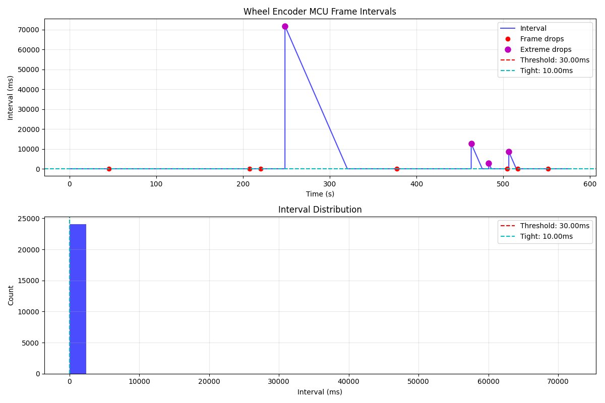   | Total frames: 24092Min offset: 0.00 msMax offset: 47.00 msMean offset: 1.90 msDetected frame drops (offset > 50.0 ms): 0Drop ratio: 0.00%Extreme drops (offset > 200.0 ms): 0Extreme drop ratio: 0.00%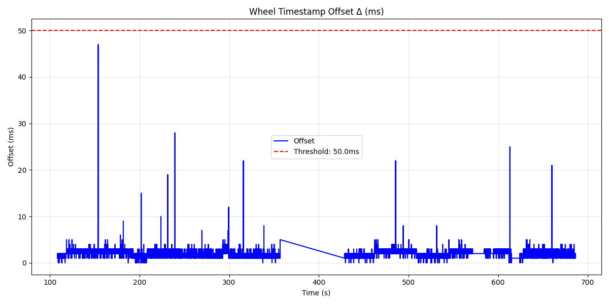  |
| 000347 | Total frames: 21048Frame rate: 36.65 fpsAverage interval: 27.29 msInterval standard deviation: 673.75 msMinimum interval: 1.00 msMaximum interval: 79241.00 msDetected frame drops: 25 (0.12%)Estimated total lost frames: 7685Abnormally small intervals: 16 (0.08%)Continuous abnormal interval segments: 14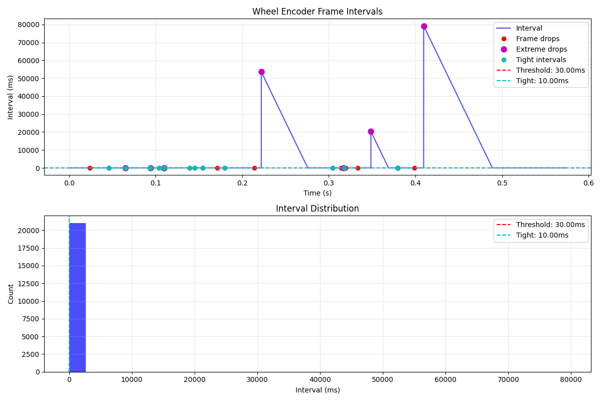   | Total frames: 21048Frame rate: 36.65 fpsAverage interval: 27.29 msInterval standard deviation: 673.75 msMinimum interval: 20.00 msMaximum interval: 79241.00 msDetected frame drops: 16 (0.08%)Estimated total lost frames: 7669Abnormally small intervals: 0 (0.00%)Continuous abnormal interval segments: 0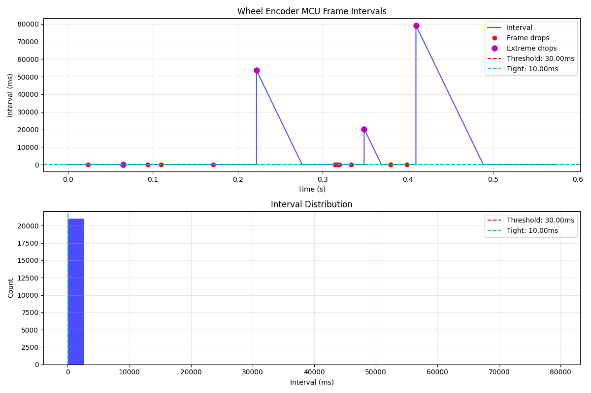   | Total frames: 21048Min offset: 0.00 msMax offset: 77.00 msMean offset: 1.89 msDetected frame drops (offset > 50.0 ms): 3Drop ratio: 0.01%Extreme drops (offset > 200.0 ms): 0Extreme drop ratio: 0.00%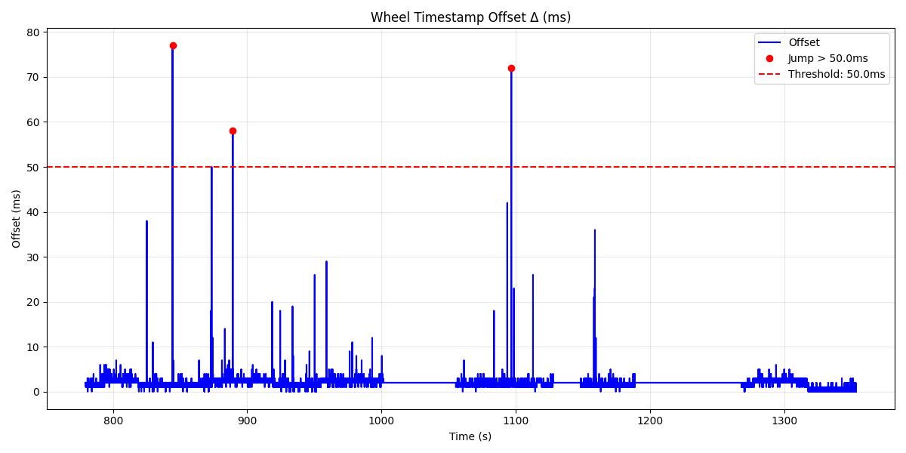  |
| 000348 | Total frames: 62189Frame rate: 34.21 fpsAverage interval: 29.23 msInterval standard deviation: 976.45 msMinimum interval: 1.00 msMaximum interval: 179822.00 msDetected frame drops: 38 (0.06%)Estimated total lost frames: 28722Abnormally small intervals: 11 (0.02%)Continuous abnormal interval segments: 11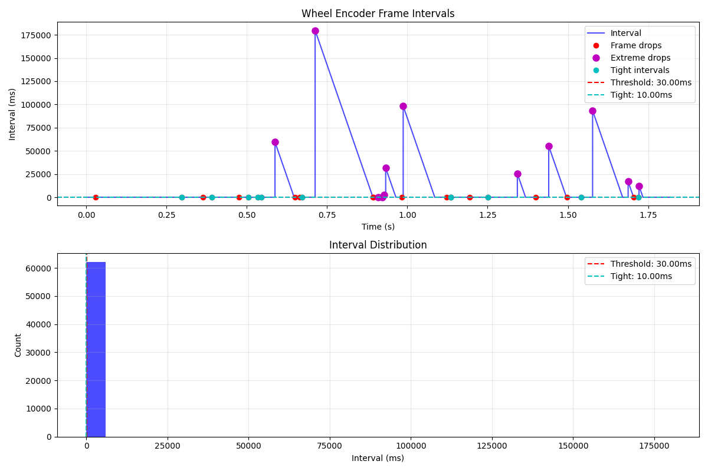 | Total frames: 62189Frame rate: 34.21 fpsAverage interval: 29.23 msInterval standard deviation: 976.45 msMinimum interval: 20.00 msMaximum interval: 179822.00 msDetected frame drops: 30 (0.05%)Estimated total lost frames: 28711Abnormally small intervals: 0 (0.00%)Continuous abnormal interval segments: 0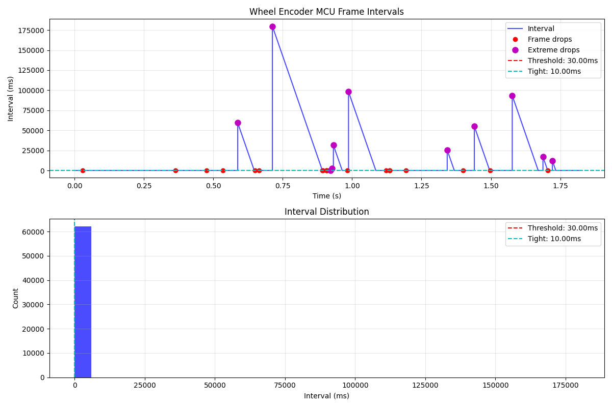 | Total frames: 62189Min offset: 0.00 msMax offset: 43.00 msMean offset: 1.72 msDetected frame drops (offset > 50.0 ms): 0Drop ratio: 0.00%Extreme drops (offset > 200.0 ms): 0Extreme drop ratio: 0.00%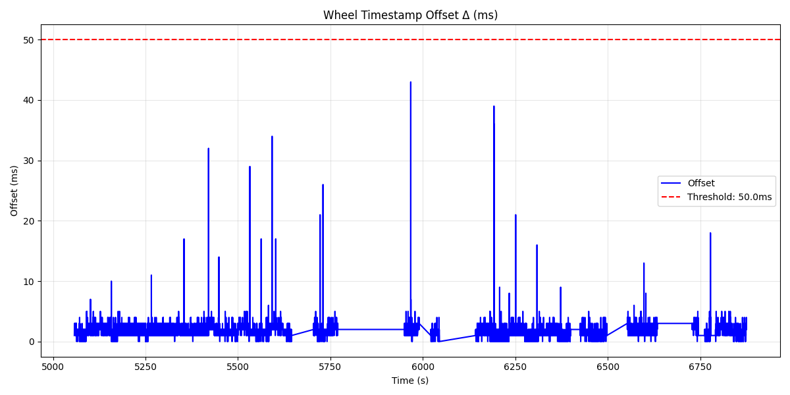  |
| 000349 | Total frames: 20353Frame rate: 40.27 fpsAverage interval: 24.83 msInterval standard deviation: 311.53 msMinimum interval: 1.00 msMaximum interval: 27601.00 msDetected frame drops: 23 (0.11%)Estimated total lost frames: 4926Abnormally small intervals: 9 (0.04%)Continuous abnormal interval segments: 9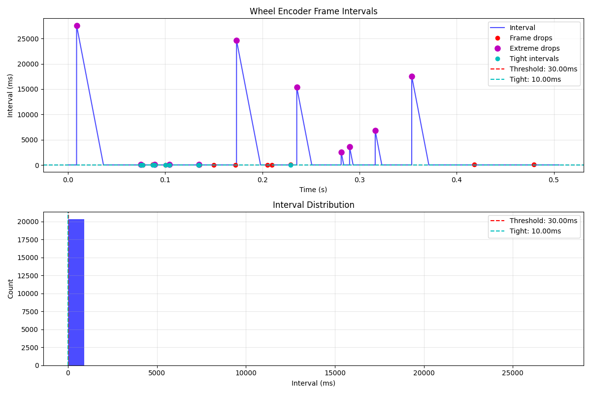     | Total frames: 20353Frame rate: 40.27 fpsAverage interval: 24.83 msInterval standard deviation: 311.52 msMinimum interval: 20.00 msMaximum interval: 27600.00 msDetected frame drops: 20 (0.10%)Estimated total lost frames: 4917Abnormally small intervals: 0 (0.00%)Continuous abnormal interval segments: 0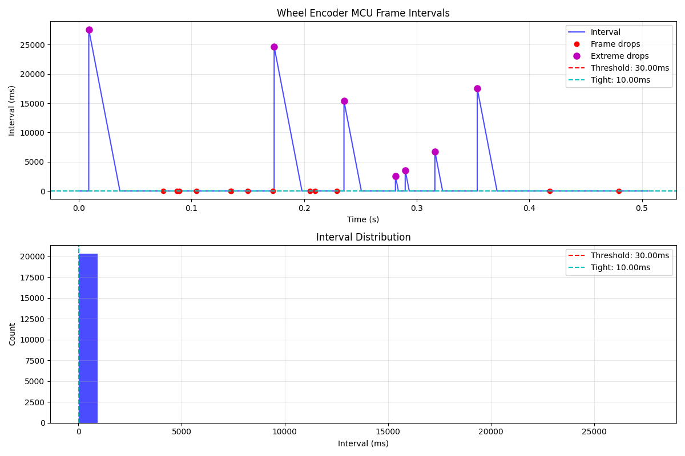   | Total frames: 20353Min offset: 0.00 msMax offset: 58.00 msMean offset: 1.42 msDetected frame drops (offset > 50.0 ms): 4Drop ratio: 0.02%Extreme drops (offset > 200.0 ms): 0Extreme drop ratio: 0.00%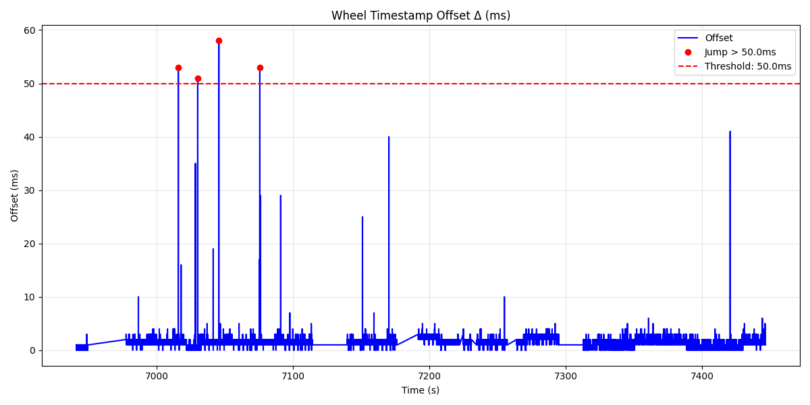  |
| 000350 | Total frames: 18138Frame rate: 50.00 fpsAverage interval: 20.00 msInterval standard deviation: 0.61 msMinimum interval: 6.00 msMaximum interval: 39.00 msDetected frame drops: 2 (0.01%)Estimated total lost frames: 2Abnormally small intervals: 1 (0.01%)Continuous abnormal interval segments: 1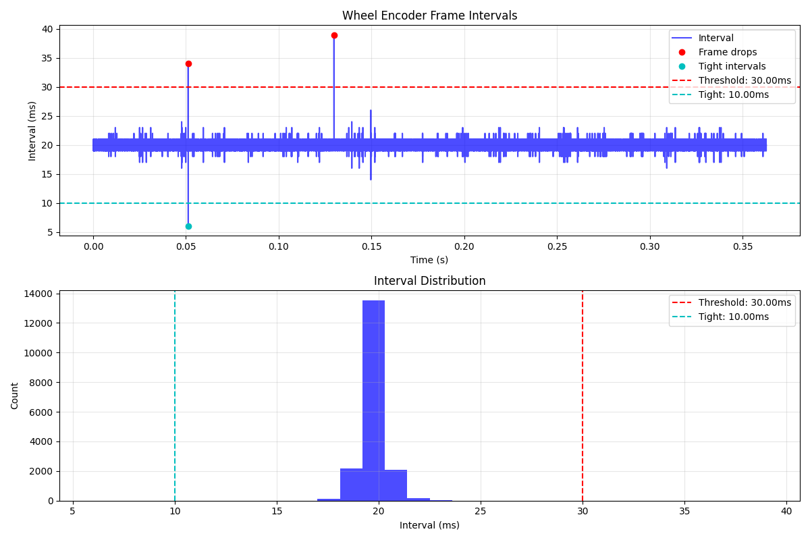              | Total frames: 18138Frame rate: 50.00 fpsAverage interval: 20.00 msInterval standard deviation: 0.15 msMinimum interval: 17.00 msMaximum interval: 40.00 msDetected frame drops: 1 (0.01%)Estimated total lost frames: 1Abnormally small intervals: 0 (0.00%)Continuous abnormal interval segments: 0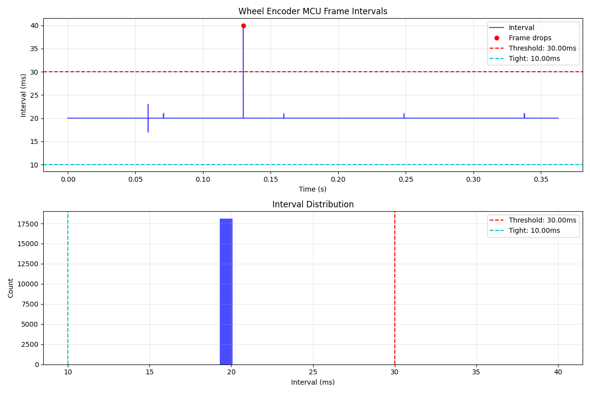            | Total frames: 18138Min offset: 0.00 msMax offset: 16.00 msMean offset: 1.41 msDetected frame drops (offset > 50.0 ms): 0Drop ratio: 0.00%Extreme drops (offset > 200.0 ms): 0Extreme drop ratio: 0.00%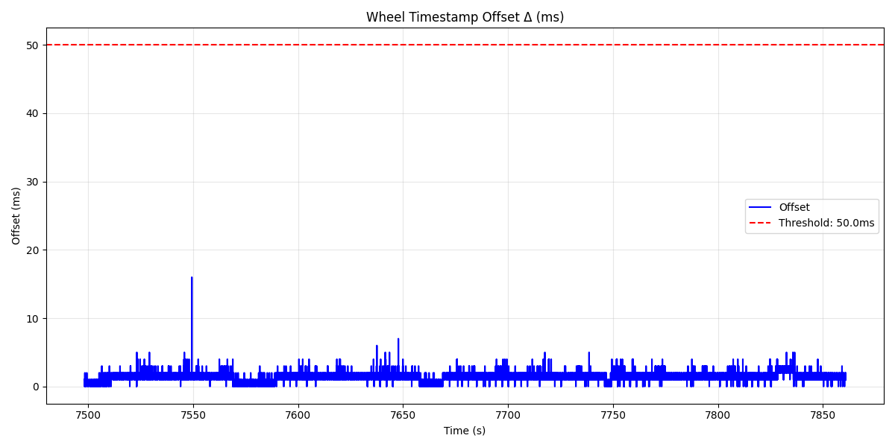  |
| 000351 | Total frames: 94545Frame rate: 50.00 fpsAverage interval: 20.00 msInterval standard deviation: 0.63 msMinimum interval: 1.00 msMaximum interval: 47.00 msDetected frame drops: 13 (0.01%)Estimated total lost frames: 13Abnormally small intervals: 8 (0.01%)Continuous abnormal interval segments: 8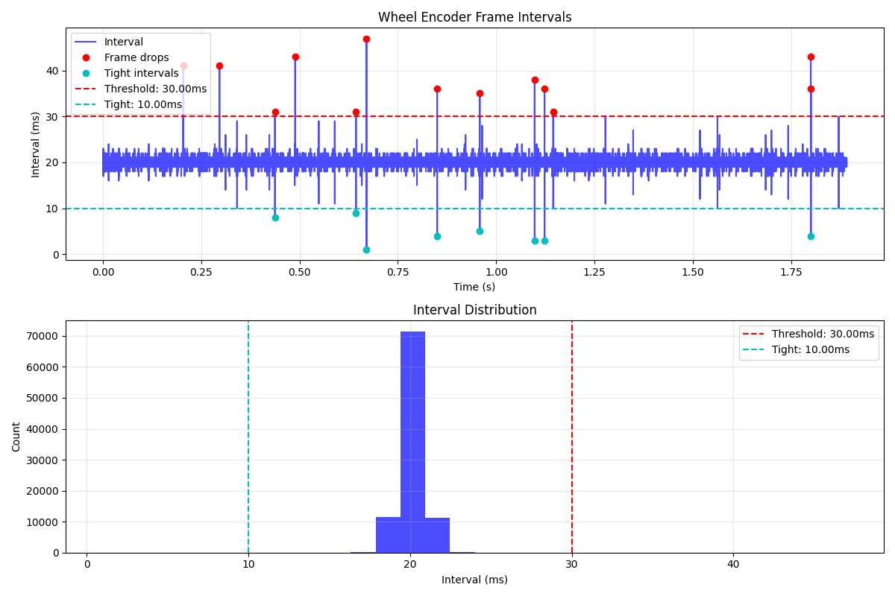            | Total frames: 94545Frame rate: 50.00 fpsAverage interval: 20.00 msInterval standard deviation: 0.13 msMinimum interval: 18.00 msMaximum interval: 40.00 msDetected frame drops: 4 (0.00%)Estimated total lost frames: 4Abnormally small intervals: 0 (0.00%)Continuous abnormal interval segments: 0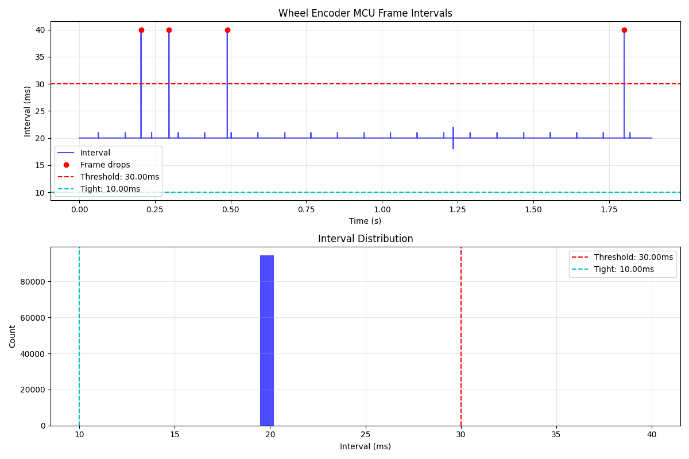            | Total frames: 94545Min offset: 0.00 msMax offset: 28.00 msMean offset: 1.41 msDetected frame drops (offset > 50.0 ms): 0Drop ratio: 0.00%Extreme drops (offset > 200.0 ms): 0Extreme drop ratio: 0.00%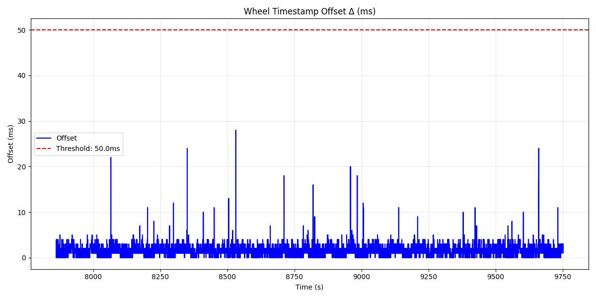  |
| 000352 | Total frames: 150256Frame rate: 49.99 fpsAverage interval: 20.00 msInterval standard deviation: 0.71 msMinimum interval: 1.00 msMaximum interval: 90.00 msDetected frame drops: 30 (0.02%)Estimated total lost frames: 38Abnormally small intervals: 14 (0.01%)Continuous abnormal interval segments: 14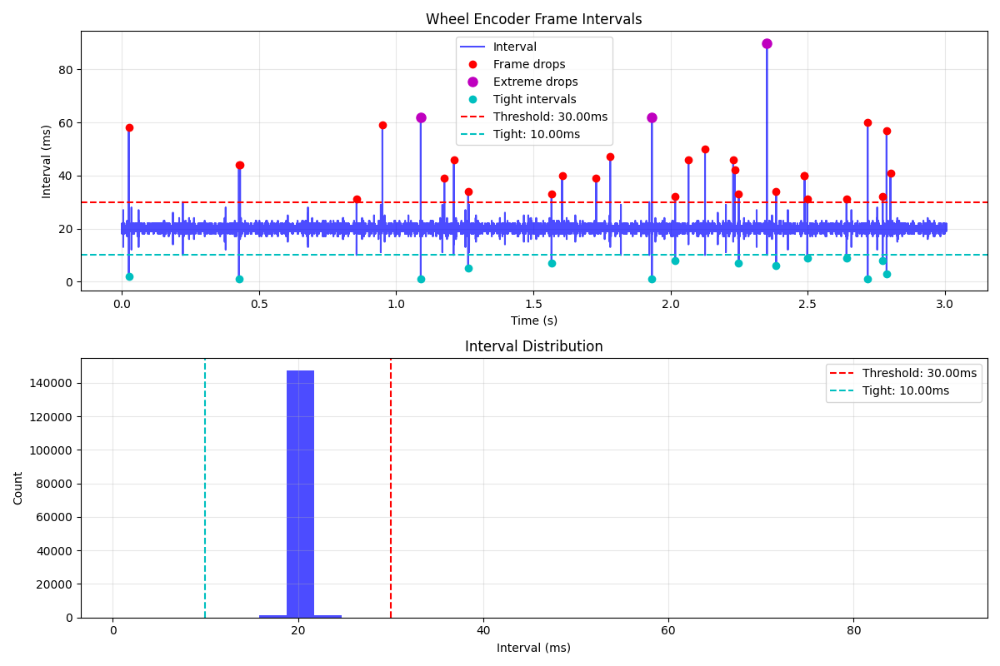         | Total frames: 150256Frame rate: 49.99 fpsAverage interval: 20.00 msInterval standard deviation: 0.29 msMinimum interval: 16.00 msMaximum interval: 80.00 msDetected frame drops: 20 (0.01%)Estimated total lost frames: 23Abnormally small intervals: 0 (0.00%)Continuous abnormal interval segments: 0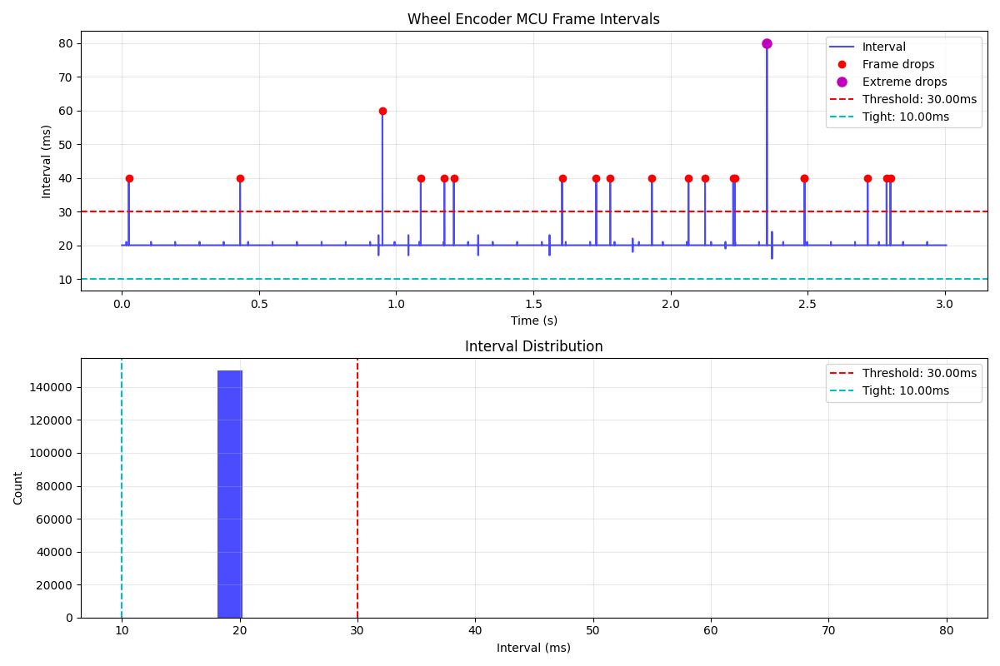         | Total frames: 150256Min offset: 0.00 msMax offset: 71.00 msMean offset: 1.41 msDetected frame drops (offset > 50.0 ms): 1Drop ratio: 0.00%Extreme drops (offset > 200.0 ms): 0Extreme drop ratio: 0.00%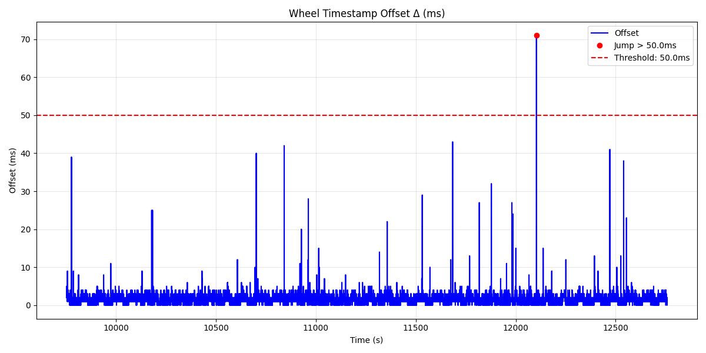 |
| 000353 | Total frames: 86016Frame rate: 49.98 fpsAverage interval: 20.01 msInterval standard deviation: 1.91 msMinimum interval: 1.00 msMaximum interval: 541.00 msDetected frame drops: 20 (0.02%)Estimated total lost frames: 49Abnormally small intervals: 17 (0.02%)Continuous abnormal interval segments: 16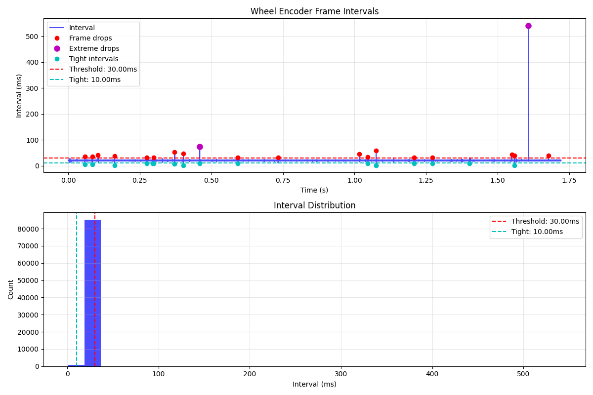         | Total frames: 86016Frame rate: 49.98 fpsAverage interval: 20.01 msInterval standard deviation: 1.79 msMinimum interval: 16.00 msMaximum interval: 540.00 msDetected frame drops: 7 (0.01%)Estimated total lost frames: 33Abnormally small intervals: 0 (0.00%)Continuous abnormal interval segments: 0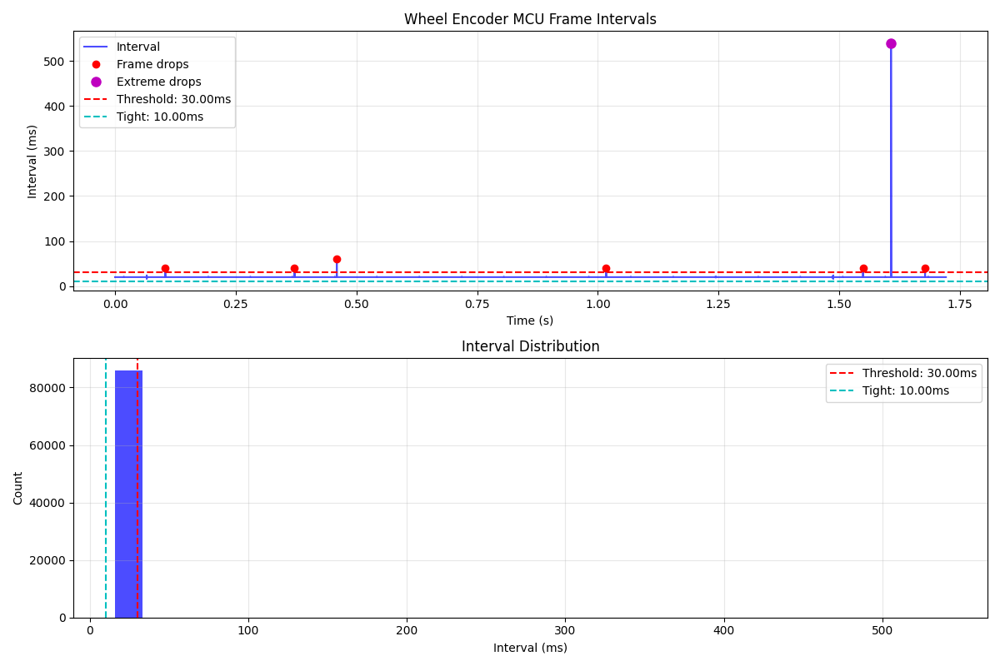          | Total frames: 86016Min offset: 0.00 msMax offset: 54.00 msMean offset: 1.41 msDetected frame drops (offset > 50.0 ms): 1Drop ratio: 0.00%Extreme drops (offset > 200.0 ms): 0Extreme drop ratio: 0.00%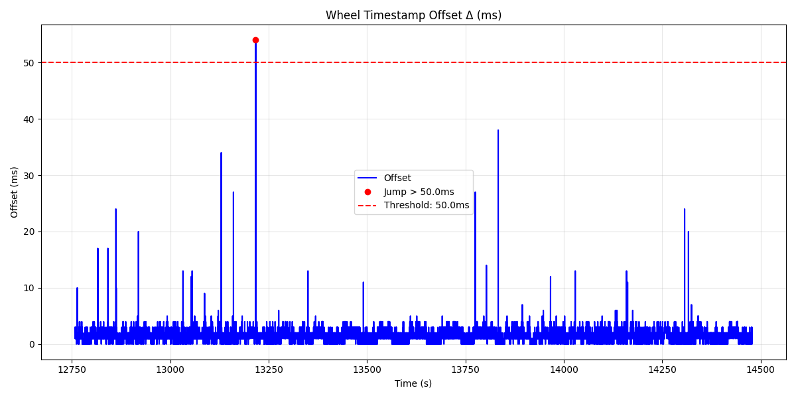  |
| 000354 | Total frames: 26534Frame rate: 38.25 fpsAverage interval: 26.15 msInterval standard deviation: 532.87 msMinimum interval: 6.00 msMaximum interval: 72921.00 msDetected frame drops: 16 (0.06%)Estimated total lost frames: 8155Abnormally small intervals: 2 (0.01%)Continuous abnormal interval segments: 2     | Total frames: 26534Frame rate: 38.25 fpsAverage interval: 26.15 msInterval standard deviation: 532.88 msMinimum interval: 16.00 msMaximum interval: 72921.00 msDetected frame drops: 15 (0.06%)Estimated total lost frames: 8153Abnormally small intervals: 0 (0.00%)Continuous abnormal interval segments: 0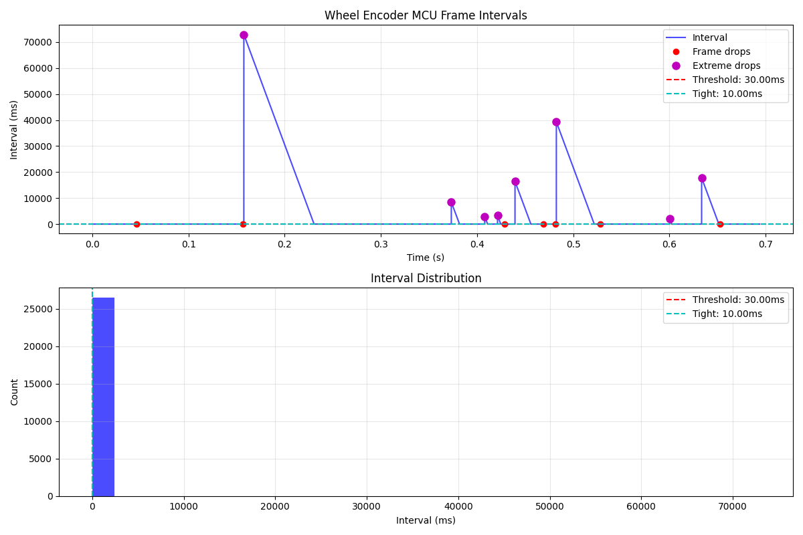   | Total frames: 26534Min offset: 0.00 msMax offset: 35.00 msMean offset: 1.42 msDetected frame drops (offset > 50.0 ms): 0Drop ratio: 0.00%Extreme drops (offset > 200.0 ms): 0Extreme drop ratio: 0.00%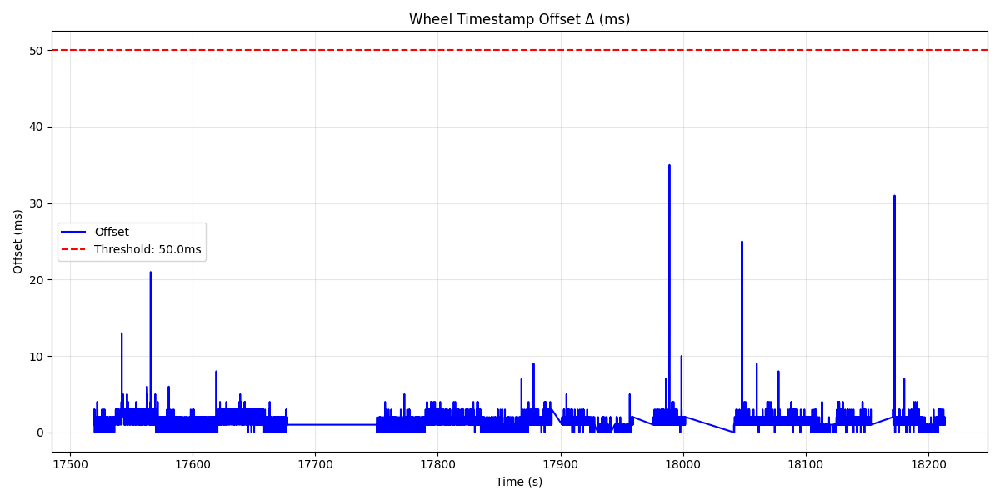  |
| 000355 | Total frames: 157013Frame rate: 50.00 fpsAverage interval: 20.00 msInterval standard deviation: 0.67 msMinimum interval: 1.00 msMaximum interval: 71.00 msDetected frame drops: 29 (0.02%)Estimated total lost frames: 34Abnormally small intervals: 22 (0.01%)Continuous abnormal interval segments: 22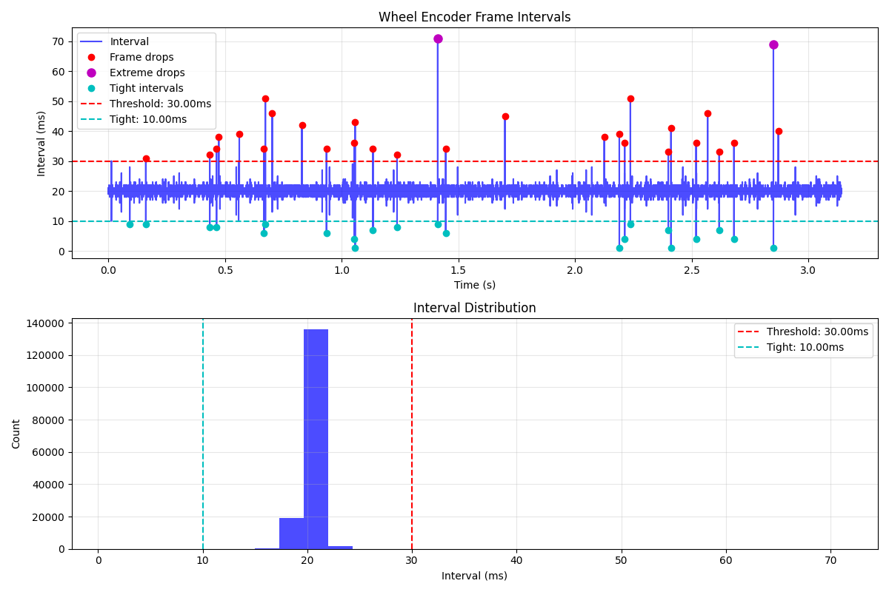         | Total frames: 157013Frame rate: 50.00 fpsAverage interval: 20.00 msInterval standard deviation: 0.20 msMinimum interval: 14.00 msMaximum interval: 60.00 msDetected frame drops: 12 (0.01%)Estimated total lost frames: 13Abnormally small intervals: 0 (0.00%)Continuous abnormal interval segments: 0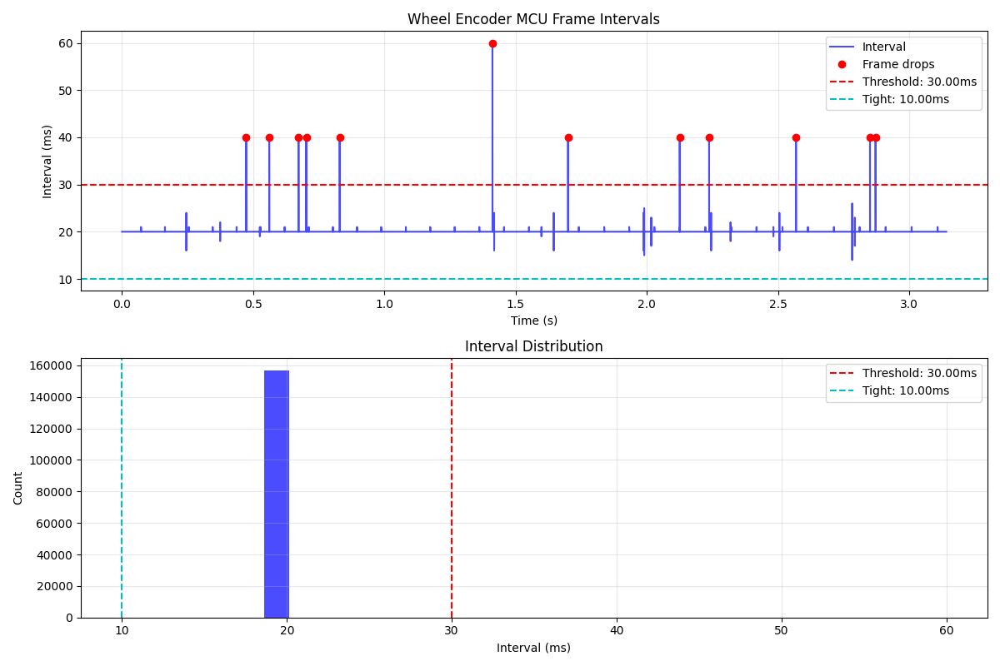         | Total frames: 157013Min offset: 0.00 msMax offset: 53.00 msMean offset: 1.42 msDetected frame drops (offset > 50.0 ms): 1Drop ratio: 0.00%Extreme drops (offset > 200.0 ms): 0Extreme drop ratio: 0.00%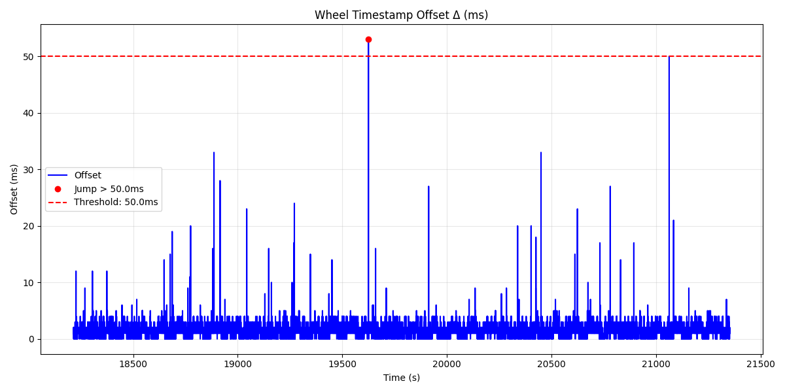 |
| 000356 | Total frames: 12647Frame rate: 50.00 fpsAverage interval: 20.00 msInterval standard deviation: 0.71 msMinimum interval: 1.00 msMaximum interval: 48.00 msDetected frame drops: 2 (0.02%)Estimated total lost frames: 2Abnormally small intervals: 2 (0.02%)Continuous abnormal interval segments: 2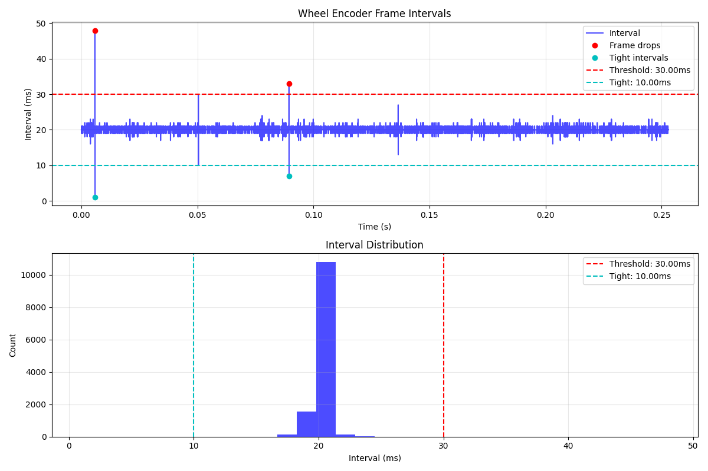              | Total frames: 12647Frame rate: 50.00 fpsAverage interval: 20.00 msInterval standard deviation: 0.01 msMinimum interval: 20.00 msMaximum interval: 21.00 msDetected frame drops: 0 (0.00%)Estimated total lost frames: 0Abnormally small intervals: 0 (0.00%)Continuous abnormal interval segments: 0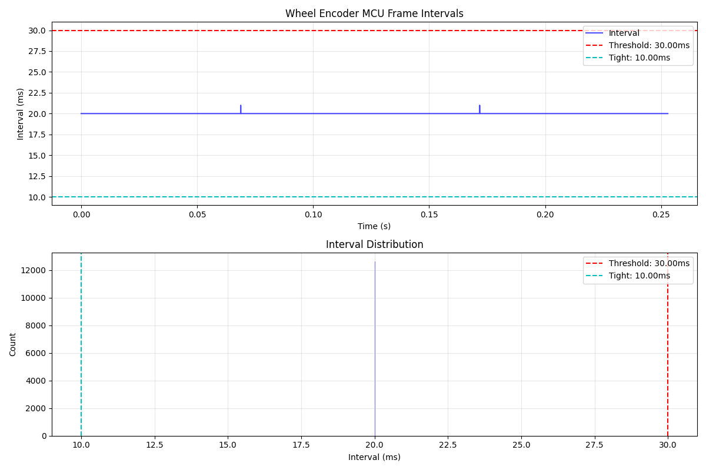            | Total frames: 12647Min offset: 0.00 msMax offset: 29.00 msMean offset: 1.42 msDetected frame drops (offset > 50.0 ms): 0Drop ratio: 0.00%Extreme drops (offset > 200.0 ms): 0Extreme drop ratio: 0.00%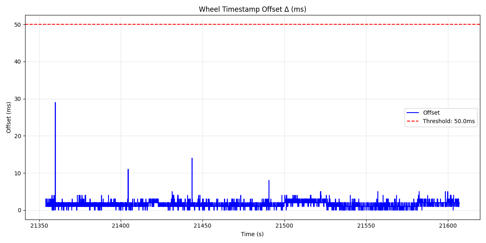  |
| 000357 | Total frames: 5392Frame rate: 23.65 fpsAverage interval: 42.28 msInterval standard deviation: 1577.58 msMinimum interval: 6.00 msMaximum interval: 115823.00 msDetected frame drops: 8 (0.15%)Estimated total lost frames: 6007Abnormally small intervals: 2 (0.04%)Continuous abnormal interval segments: 2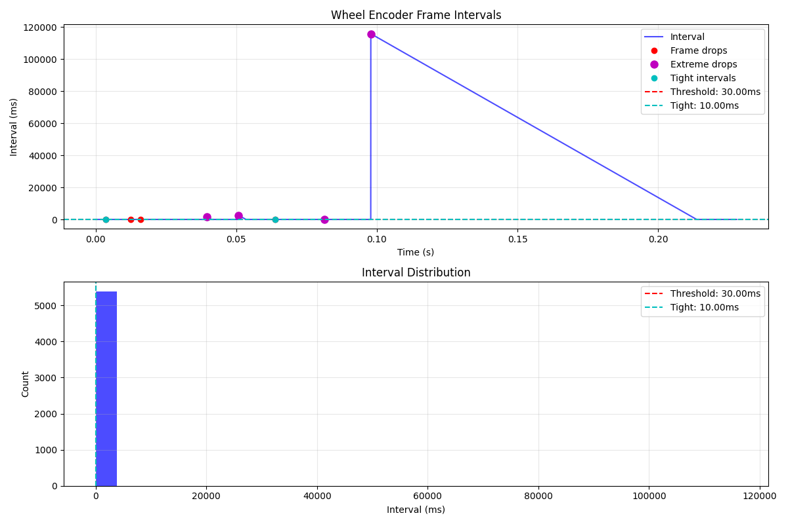     | Total frames: 5392Frame rate: 23.65 fpsAverage interval: 42.28 msInterval standard deviation: 1577.59 msMinimum interval: 20.00 msMaximum interval: 115823.00 msDetected frame drops: 6 (0.11%)Estimated total lost frames: 6005Abnormally small intervals: 0 (0.00%)Continuous abnormal interval segments: 0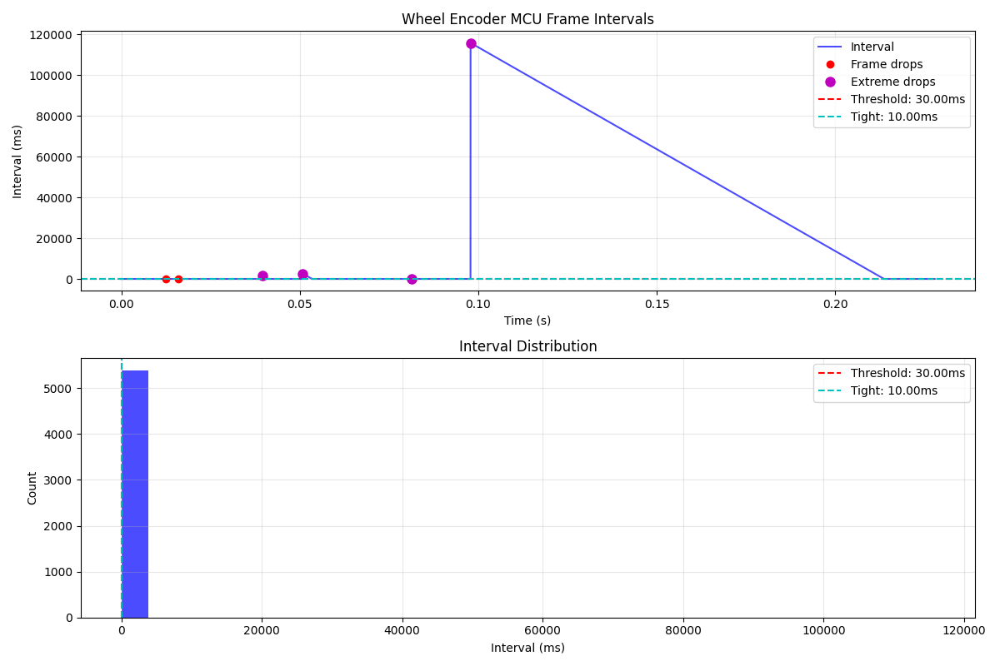   | Total frames: 5392Min offset: 0.00 msMax offset: 22.00 msMean offset: 1.52 msDetected frame drops (offset > 50.0 ms): 0Drop ratio: 0.00%Extreme drops (offset > 200.0 ms): 0Extreme drop ratio: 0.00%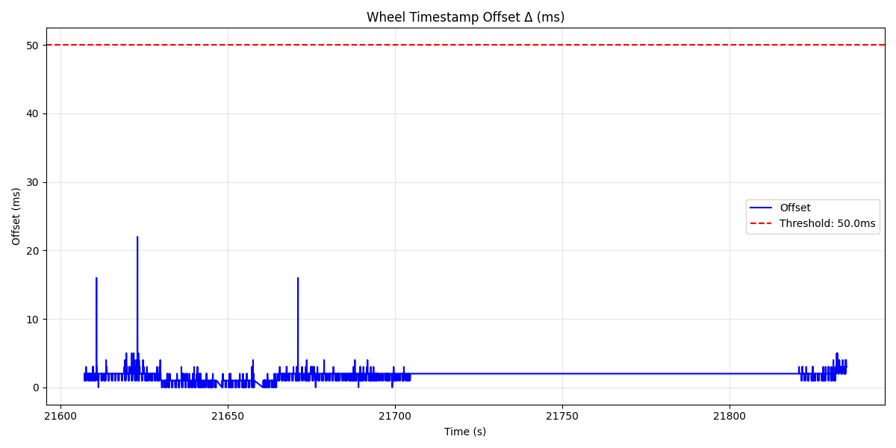   |
| 000358 | 没有传感器数据                                                                                                                                                                                                                                                                                                                                                                                             |                                                                                                                                                                                                                                                                                                                                                                                                    |                                                                                                                                                                                                                                                                                            |

# R0005X52700110

| 日志包    | wheel                                                                                                                                                                                                                                                                                                                                                                                            | wheel\_mcu                                                                                                                                                                                                                                                                                                                                                                                       | Whee offset = abs(wheel\_timestamp - mcu\_timestamp）                                                                                                                                                                                                                                       |
| ------ | ------------------------------------------------------------------------------------------------------------------------------------------------------------------------------------------------------------------------------------------------------------------------------------------------------------------------------------------------------------------------------------------------ | ------------------------------------------------------------------------------------------------------------------------------------------------------------------------------------------------------------------------------------------------------------------------------------------------------------------------------------------------------------------------------------------------ | ------------------------------------------------------------------------------------------------------------------------------------------------------------------------------------------------------------------------------------------------------------------------------------------ |
| 000603 | 没有传感器数据                                                                                                                                                                                                                                                                                                                                                                                          |                                                                                                                                                                                                                                                                                                                                                                                                  |                                                                                                                                                                                                                                                                                            |
| 000604 | 没有传感器数据                                                                                                                                                                                                                                                                                                                                                                                          |                                                                                                                                                                                                                                                                                                                                                                                                  |                                                                                                                                                                                                                                                                                            |
| 000605 | 没有传感器数据                                                                                                                                                                                                                                                                                                                                                                                          |                                                                                                                                                                                                                                                                                                                                                                                                  |                                                                                                                                                                                                                                                                                            |
| 000606 | 没有传感器数据                                                                                                                                                                                                                                                                                                                                                                                          |                                                                                                                                                                                                                                                                                                                                                                                                  |                                                                                                                                                                                                                                                                                            |
| 000607 | 没有传感器数据                                                                                                                                                                                                                                                                                                                                                                                          |                                                                                                                                                                                                                                                                                                                                                                                                  |                                                                                                                                                                                                                                                                                            |
| 000608 | Total frames: 25910Frame rate: 40.51 fpsAverage interval: 24.69 msInterval standard deviation: 515.06 msMinimum interval: 8.00 msMaximum interval: 78160.00 msDetected frame drops: 14 (0.05%)Estimated total lost frames: 6074Abnormally small intervals: 2 (0.01%)Continuous abnormal interval segments: 2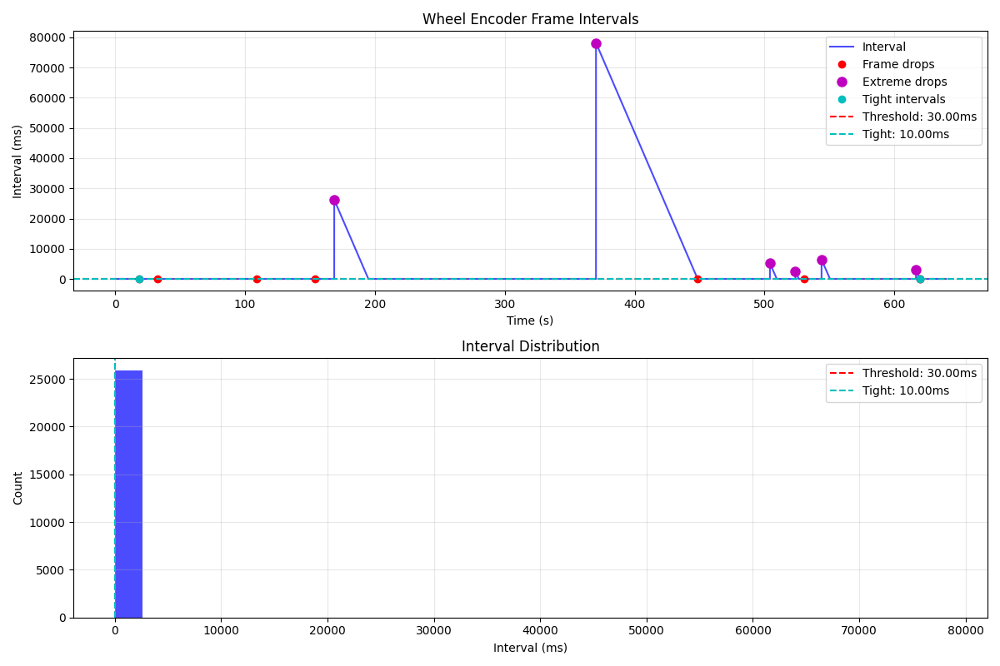  | Total frames: 25910Frame rate: 40.51 fpsAverage interval: 24.69 msInterval standard deviation: 515.06 msMinimum interval: 19.00 msMaximum interval: 78161.00 msDetected frame drops: 12 (0.05%)Estimated total lost frames: 6072Abnormally small intervals: 0 (0.00%)Continuous abnormal interval segments: 0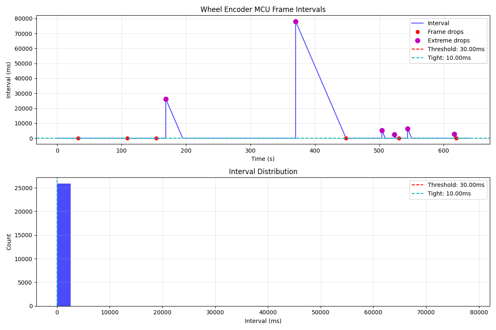 | Total frames: 25910Min offset: 0.00 msMax offset: 25.00 msMean offset: 1.45 msDetected frame drops (offset > 50.0 ms): 0Drop ratio: 0.00%Extreme drops (offset > 200.0 ms): 0Extreme drop ratio: 0.00%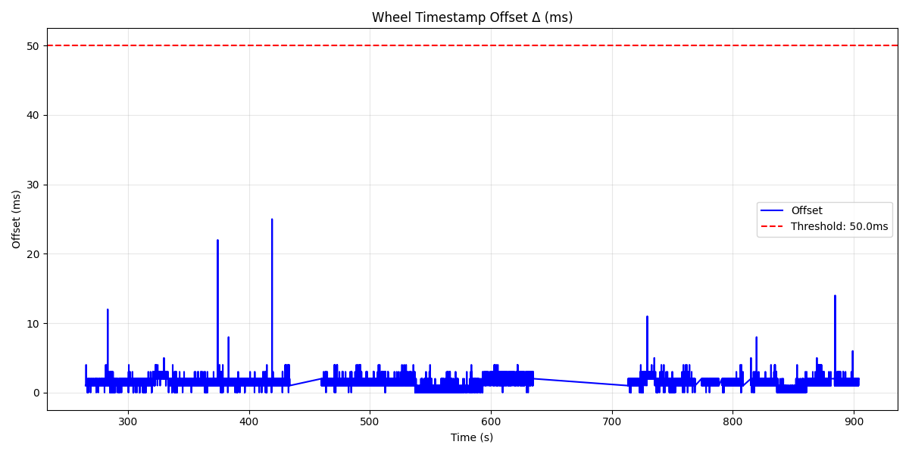  |
| 000609 | Total frames: 2261Frame rate: 49.96 fpsAverage interval: 20.02 msInterval standard deviation: 1.05 msMinimum interval: 8.00 msMaximum interval: 60.00 msDetected frame drops: 2 (0.09%)Estimated total lost frames: 3Abnormally small intervals: 1 (0.04%)Continuous abnormal interval segments: 1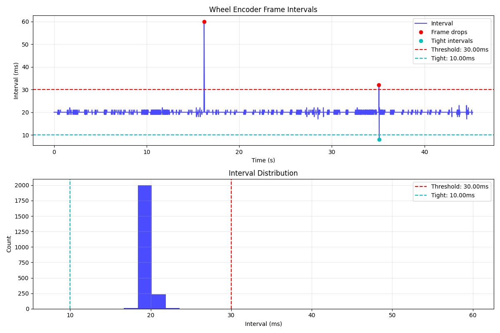            | Total frames: 2261Frame rate: 49.95 fpsAverage interval: 20.02 msInterval standard deviation: 0.84 msMinimum interval: 20.00 msMaximum interval: 60.00 msDetected frame drops: 1 (0.04%)Estimated total lost frames: 2Abnormally small intervals: 0 (0.00%)Continuous abnormal interval segments: 0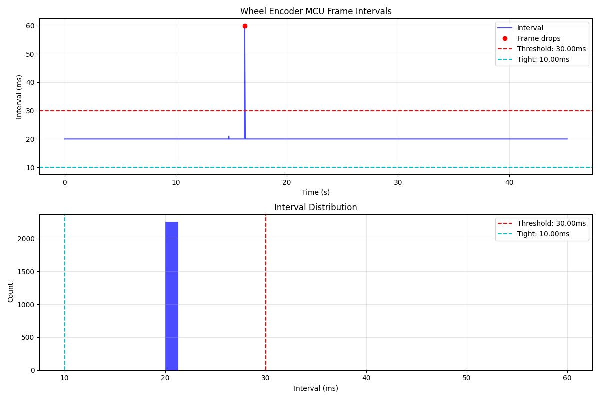           | Total frames: 2261Min offset: 0.00 msMax offset: 13.00 msMean offset: 1.13 msDetected frame drops (offset > 50.0 ms): 0Drop ratio: 0.00%Extreme drops (offset > 200.0 ms): 0Extreme drop ratio: 0.00%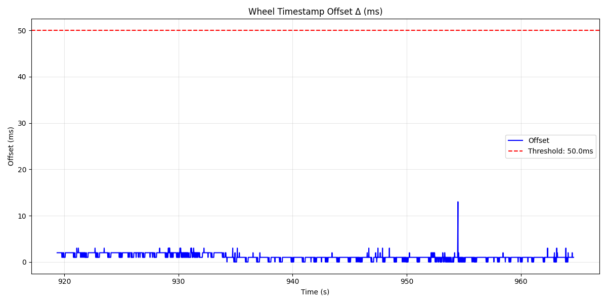   |
| 000610 | Total frames: 632985Frame rate: 49.99 fpsAverage interval: 20.00 msInterval standard deviation: 0.67 msMinimum interval: 1.00 msMaximum interval: 72.00 msDetected frame drops: 119 (0.02%)Estimated total lost frames: 140Abnormally small intervals: 67 (0.01%)Continuous abnormal interval segments: 64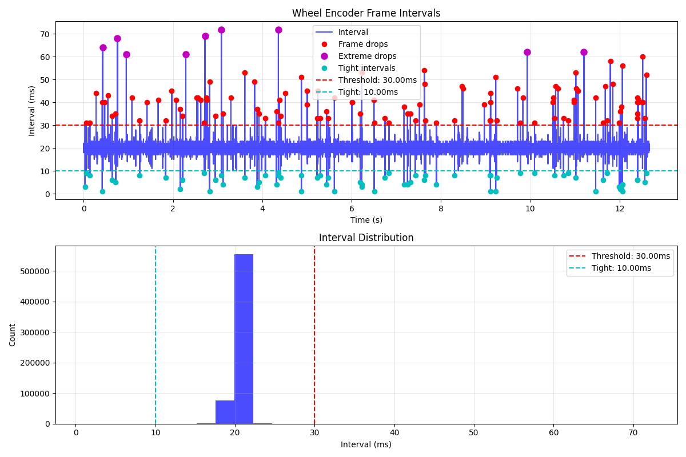    | Total frames: 632985Frame rate: 49.99 fpsAverage interval: 20.00 msInterval standard deviation: 0.25 msMinimum interval: 13.00 msMaximum interval: 60.00 msDetected frame drops: 63 (0.01%)Estimated total lost frames: 74Abnormally small intervals: 0 (0.00%)Continuous abnormal interval segments: 0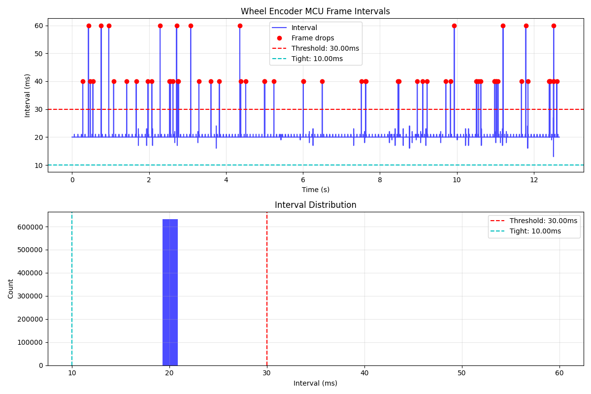       | Total frames: 632985Min offset: 0.00 msMax offset: 54.00 msMean offset: 1.42 msDetected frame drops (offset > 50.0 ms): 3Drop ratio: 0.00%Extreme drops (offset > 200.0 ms): 0Extreme drop ratio: 0.00%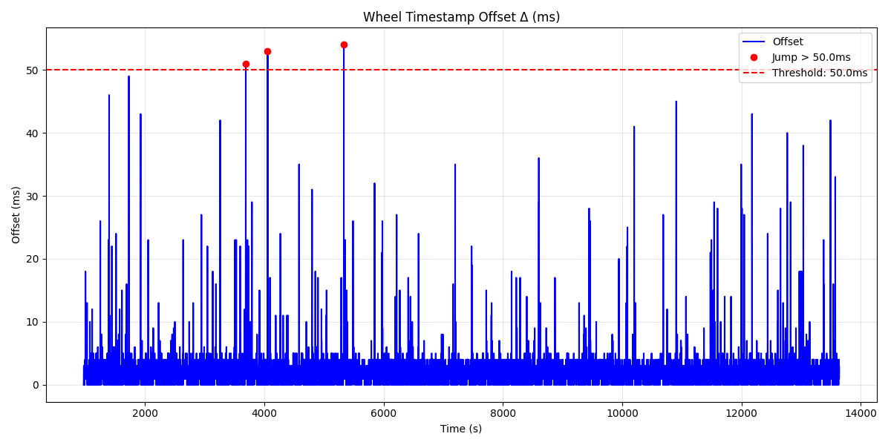 |
| 000611 | Total frames: 13383Frame rate: 49.98 fpsAverage interval: 20.01 msInterval standard deviation: 0.76 msMinimum interval: 7.00 msMaximum interval: 48.00 msDetected frame drops: 7 (0.05%)Estimated total lost frames: 7Abnormally small intervals: 2 (0.01%)Continuous abnormal interval segments: 2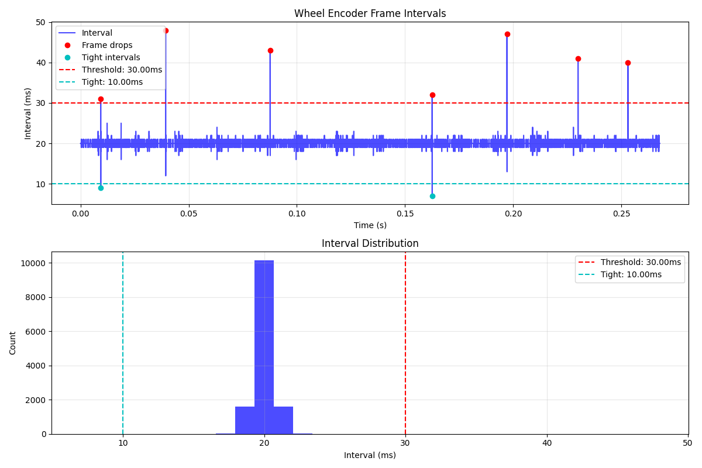           | Total frames: 13383Frame rate: 49.98 fpsAverage interval: 20.01 msInterval standard deviation: 0.39 msMinimum interval: 20.00 msMaximum interval: 40.00 msDetected frame drops: 5 (0.04%)Estimated total lost frames: 5Abnormally small intervals: 0 (0.00%)Continuous abnormal interval segments: 0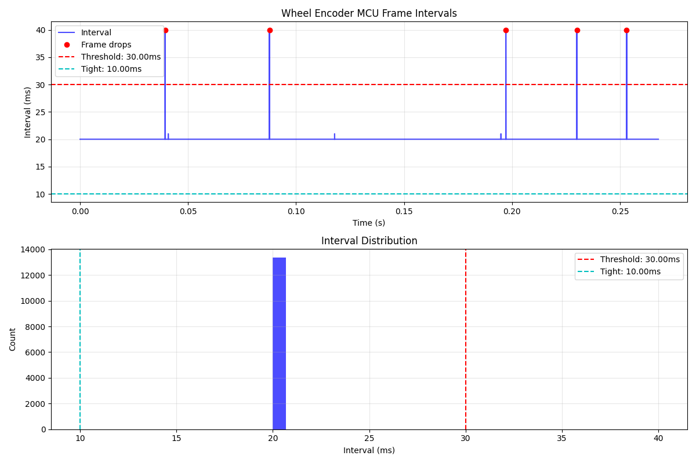          | Total frames: 13383Min offset: 0.00 msMax offset: 30.00 msMean offset: 1.46 msDetected frame drops (offset > 50.0 ms): 0Drop ratio: 0.00%Extreme drops (offset > 200.0 ms): 0Extreme drop ratio: 0.00%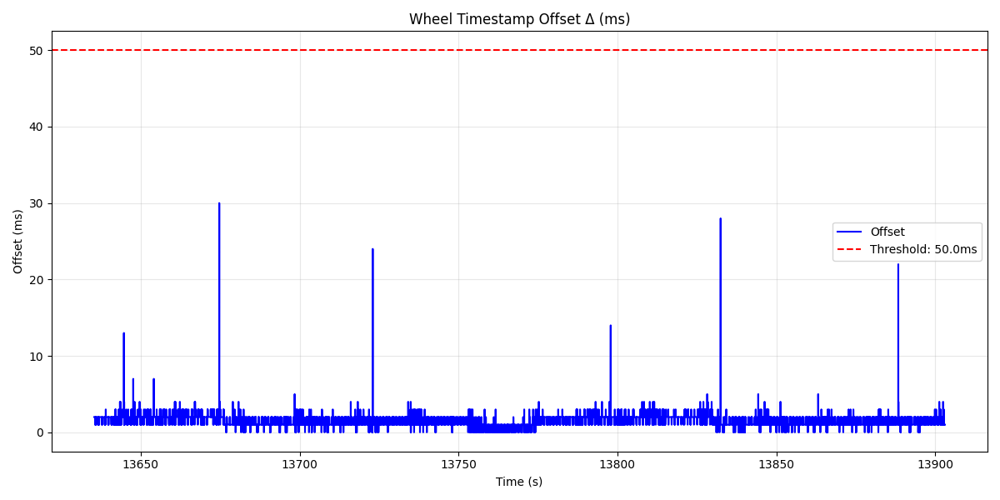  |
| 000612 | Total frames: 14585Frame rate: 49.99 fpsAverage interval: 20.01 msInterval standard deviation: 0.74 msMinimum interval: 8.00 msMaximum interval: 60.00 msDetected frame drops: 5 (0.03%)Estimated total lost frames: 6Abnormally small intervals: 1 (0.01%)Continuous abnormal interval segments: 1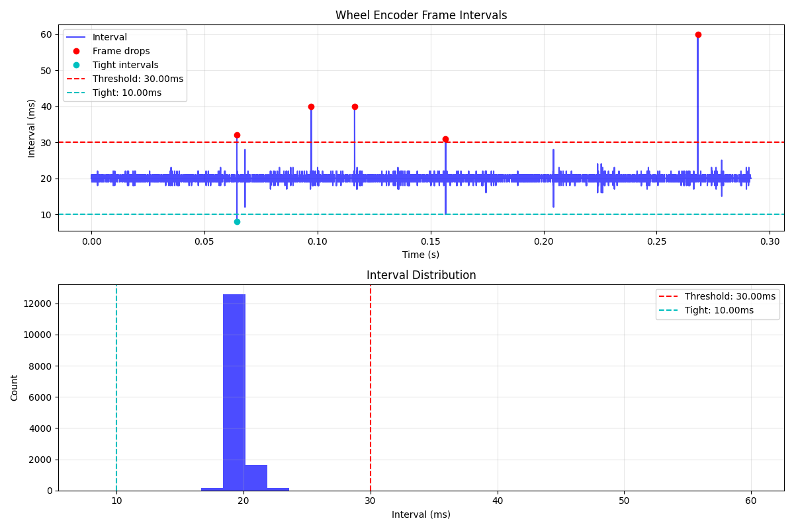           | Total frames: 14585Frame rate: 49.99 fpsAverage interval: 20.01 msInterval standard deviation: 0.41 msMinimum interval: 20.00 msMaximum interval: 60.00 msDetected frame drops: 3 (0.02%)Estimated total lost frames: 4Abnormally small intervals: 0 (0.00%)Continuous abnormal interval segments: 0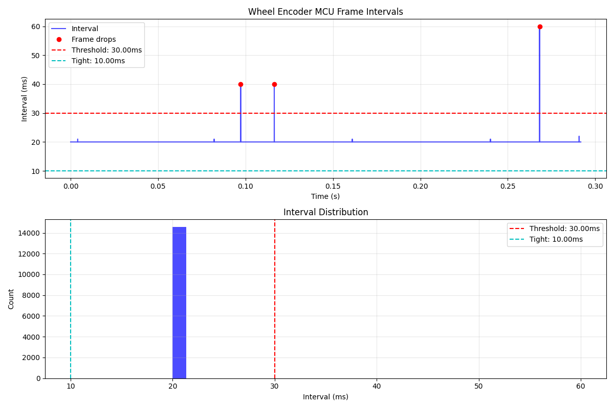          | Total frames: 14585Min offset: 0.00 msMax offset: 21.00 msMean offset: 1.38 msDetected frame drops (offset > 50.0 ms): 0Drop ratio: 0.00%Extreme drops (offset > 200.0 ms): 0Extreme drop ratio: 0.00%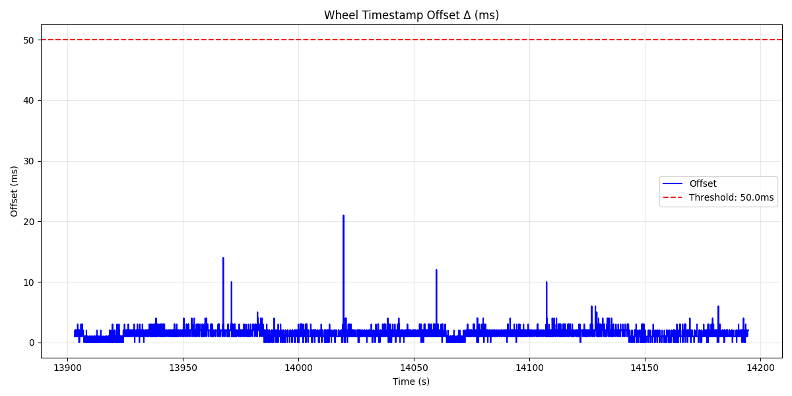  |
| 000613 | Total frames: 24188Frame rate: 41.04 fpsAverage interval: 24.37 msInterval standard deviation: 441.28 msMinimum interval: 3.00 msMaximum interval: 60964.00 msDetected frame drops: 11 (0.05%)Estimated total lost frames: 5283Abnormally small intervals: 1 (0.00%)Continuous abnormal interval segments: 1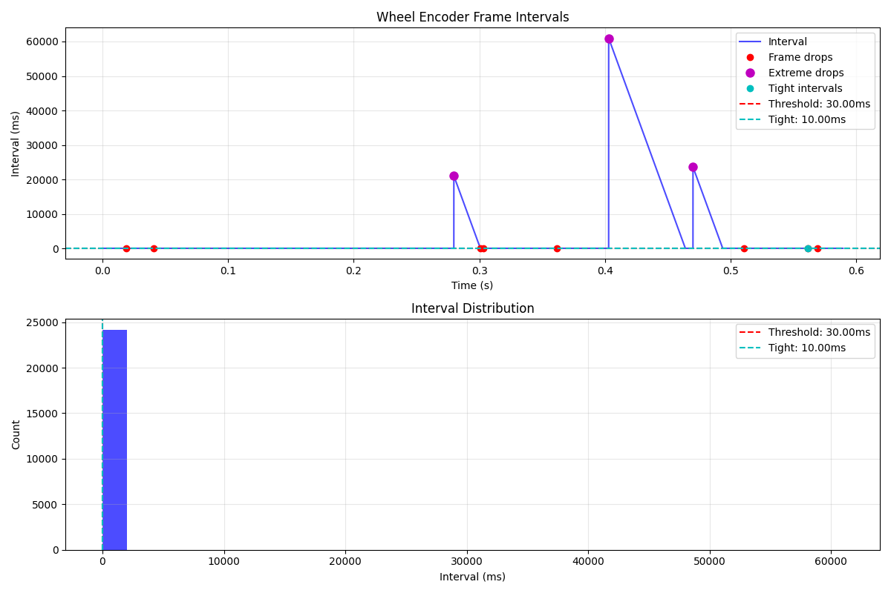  | Total frames: 24188Frame rate: 41.04 fpsAverage interval: 24.37 msInterval standard deviation: 441.27 msMinimum interval: 20.00 msMaximum interval: 60963.00 msDetected frame drops: 10 (0.04%)Estimated total lost frames: 5282Abnormally small intervals: 0 (0.00%)Continuous abnormal interval segments: 0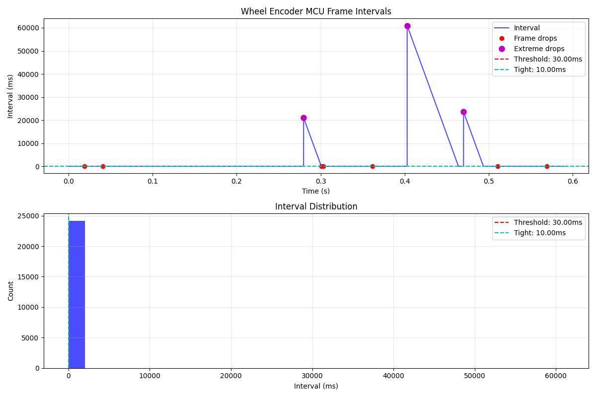 | Total frames: 24188Min offset: 0.00 msMax offset: 26.00 msMean offset: 1.51 msDetected frame drops (offset > 50.0 ms): 0Drop ratio: 0.00%Extreme drops (offset > 200.0 ms): 0Extreme drop ratio: 0.00%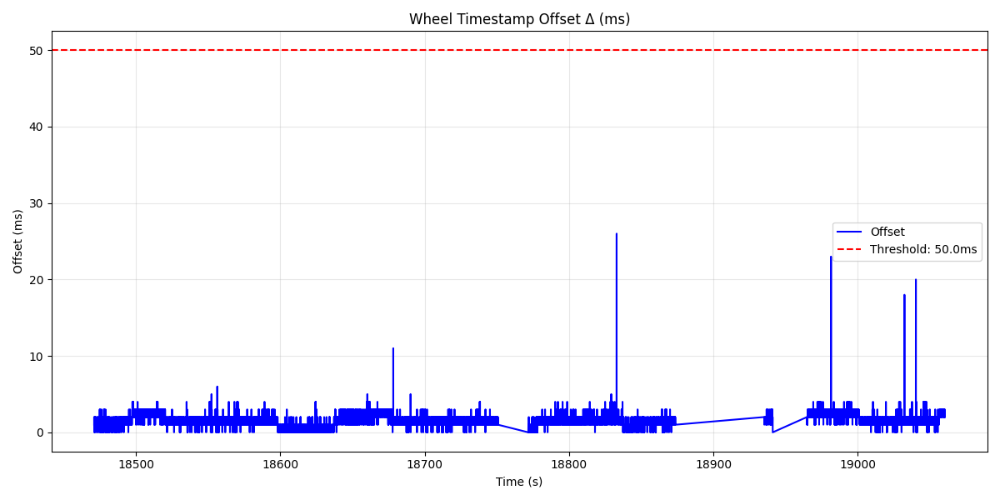  |
| 000614 | Total frames: 15940Frame rate: 36.36 fpsAverage interval: 27.50 msInterval standard deviation: 637.65 msMinimum interval: 1.00 msMaximum interval: 77261.00 msDetected frame drops: 18 (0.11%)Estimated total lost frames: 5989Abnormally small intervals: 11 (0.07%)Continuous abnormal interval segments: 9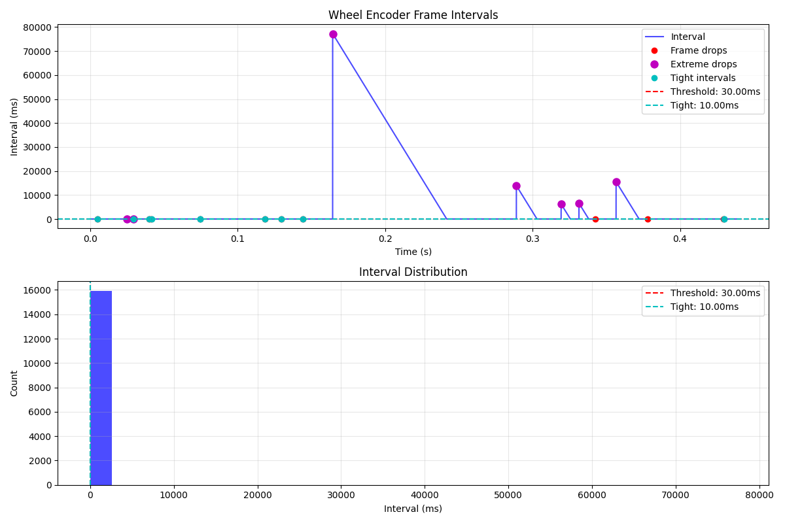 | Total frames: 15940Frame rate: 36.36 fpsAverage interval: 27.50 msInterval standard deviation: 637.65 msMinimum interval: 18.00 msMaximum interval: 77261.00 msDetected frame drops: 11 (0.07%)Estimated total lost frames: 5978Abnormally small intervals: 0 (0.00%)Continuous abnormal interval segments: 0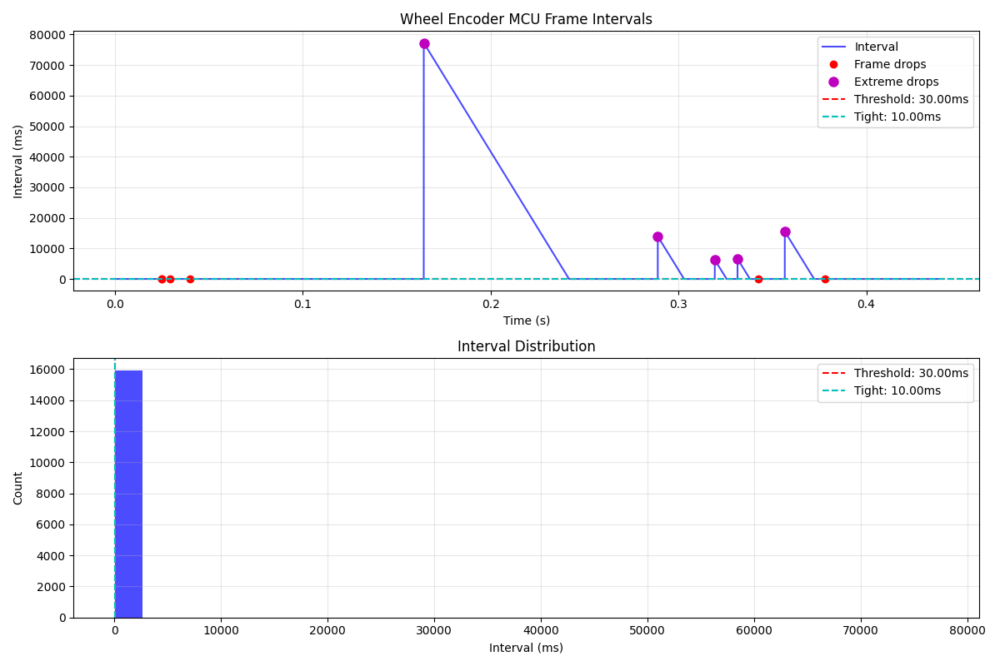 | Total frames: 15940Min offset: 0.00 msMax offset: 47.00 msMean offset: 1.41 msDetected frame drops (offset > 50.0 ms): 0Drop ratio: 0.00%Extreme drops (offset > 200.0 ms): 0Extreme drop ratio: 0.00%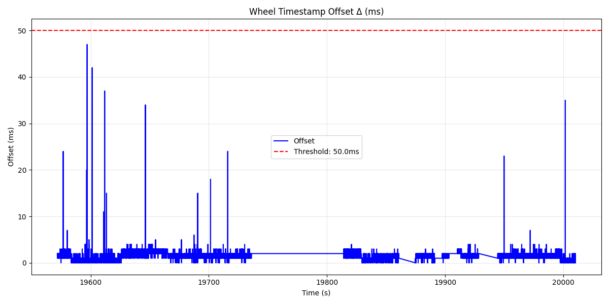  |
| 000615 | Total frames: 390694Frame rate: 49.99 fpsAverage interval: 20.00 msInterval standard deviation: 0.64 msMinimum interval: 1.00 msMaximum interval: 76.00 msDetected frame drops: 67 (0.02%)Estimated total lost frames: 72Abnormally small intervals: 37 (0.01%)Continuous abnormal interval segments: 34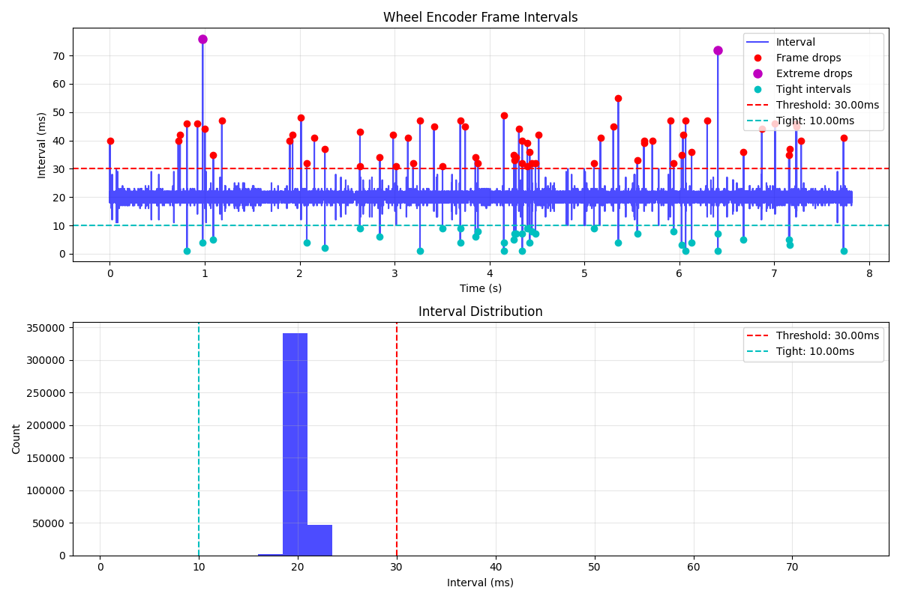      | Total frames: 390694Frame rate: 49.99 fpsAverage interval: 20.00 msInterval standard deviation: 0.20 msMinimum interval: 12.00 msMaximum interval: 60.00 msDetected frame drops: 35 (0.01%)Estimated total lost frames: 36Abnormally small intervals: 0 (0.00%)Continuous abnormal interval segments: 0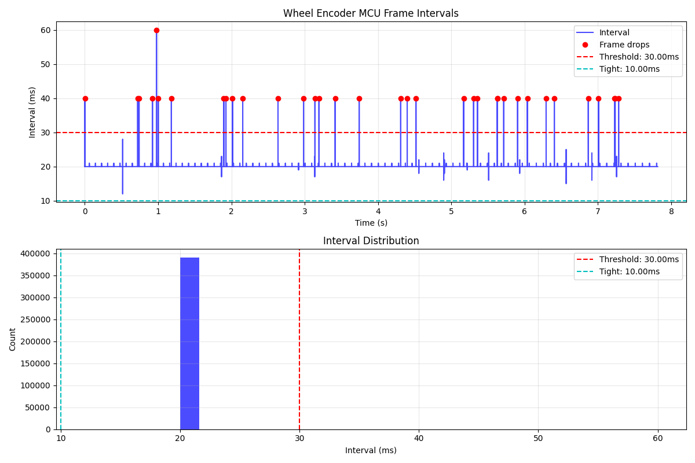       | Total frames: 390694Min offset: 0.00 msMax offset: 58.00 msMean offset: 1.41 msDetected frame drops (offset > 50.0 ms): 2Drop ratio: 0.00%Extreme drops (offset > 200.0 ms): 0Extreme drop ratio: 0.00%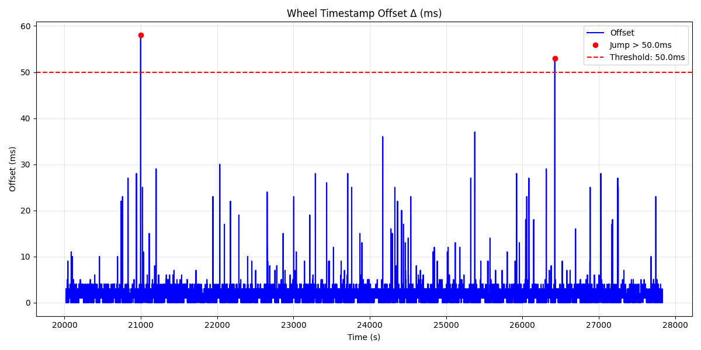 |

# &#x20;R0005X52700082

| 日志包    | wheel   | wheel\_mcu | Whee offset = abs(wheel\_timestamp - mcu\_timestamp） |
| ------ | ------- | ---------- | ---------------------------------------------------- |
| 000901 | 没有传感器数据 |            |                                                      |
| 000905 | 没有传感器数据 |            |                                                      |
| 000906 | 没有传感器数据 |            |                                                      |
| 000907 | 没有传感器数据 |            |                                                      |
| 000908 | 没有传感器数据 |            |                                                      |
| 000909 | 没有传感器数据 |            |                                                      |
| 000910 | 没有传感器数据 |            |                                                      |
| 000911 | 没有传感器数据 |            |                                                      |
| 000912 | 没有传感器数据 |            |                                                      |
| 000913 | 没有传感器数据 |            |                                                      |
| 000914 | 没有传感器数据 |            |                                                      |
| 000915 | 没有传感器数据 |            |                                                      |
| 000916 | 没有传感器数据 |            |                                                      |
| 000917 | 没有传感器数据 |            |                                                      |
| 000918 | 没有传感器数据 |            |                                                      |
| 000919 | 没有传感器数据 |            |                                                      |
| 000920 | 没有传感器数据 |            |                                                      |
| 000921 | 没有传感器数据 |            |                                                      |
| 000922 | 没有传感器数据 |            |                                                      |
| 000923 | 没有传感器数据 |            |                                                      |
| 000924 | 没有传感器数据 |            |                                                      |
| 000925 | 没有传感器数据 |            |                                                      |
| 000926 | 没有传感器数据 |            |                                                      |

