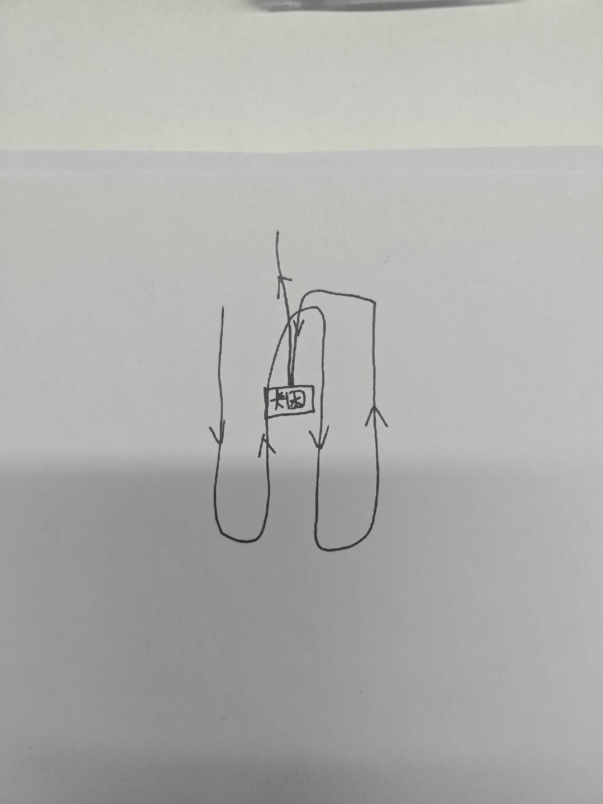
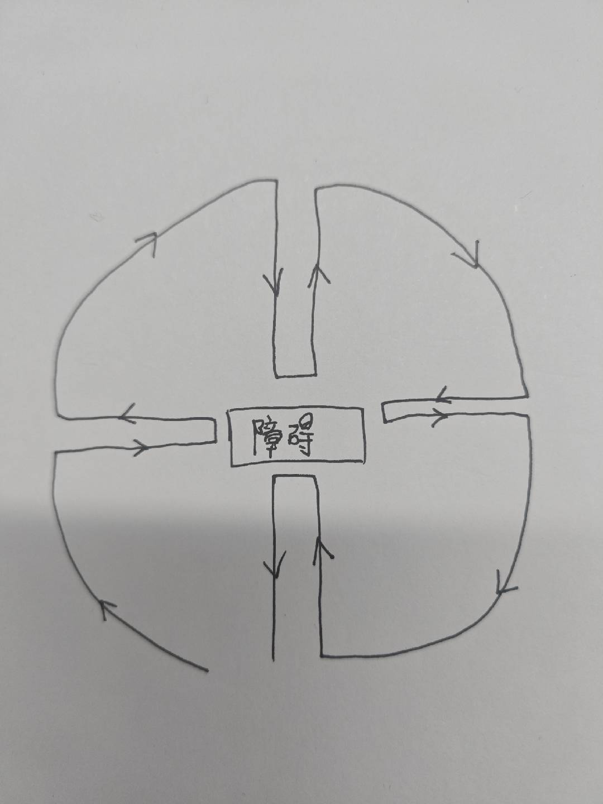
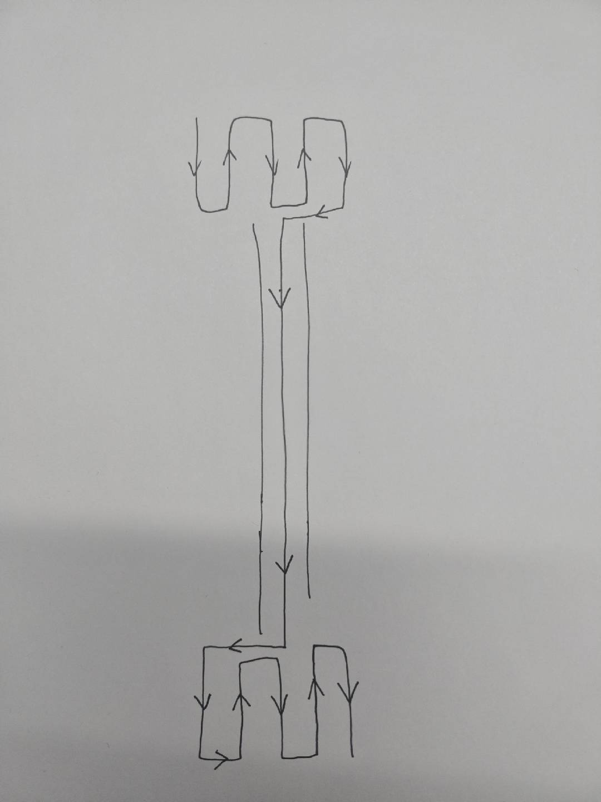

# 视觉定位困难场景数据采集

1. 版本

   1. 联系&#x20;

   2. 日志和图像设置不上传，单次采集完成后用硬盘拉取日志+图像并打包为一个文件。

2. 卡困（轮子严重打滑）

   1. 场地内分别摆放：木棍、蹦床/桌子（低矮空间下卡困）、单边沙坑、怼栅栏、怼墙、怼障碍物

   2. 采集方式

      1. 每种卡困物体采集一组数据

      2. 遥控割草，在卡困区域周围6\*6米的区域走2米弓字，然后行走到卡困区域，遥控卡困轮子打滑30秒（前、左转、右转各10秒）,后退出卡困区域后遥控到桩附近收**日志+图片**。

      

3. 遮挡

   1. 出桩后在选定障碍物周围6\*6米的区域走2米弓字行走（如图1），然后行走到障碍物附近，绕障碍物反复割草，前后左右4个方向前进5米（顶住2秒）+后退5米（如图2），遥控回桩。

   2. 5种障碍物各采集一组（狗、椅子等）

   

   

4. 树根下机器倾斜

   1. 树根下遥控割草，隆起的土地让设备倾斜，来回走5次，单程10米，中点处为树根区域

   2. 找3颗隆起较大的树各采集一组

5. 非草区域（鹅卵石、青石板）

   1. 建图100平，其中包含非草区域，弓字割草，2个场地各采一组

6. 窄通道（栅栏窄通道、两面墙过道，可以是非草地区域，可拍图片确认场景）

   1. 遥控割草，在窄通道一侧6\*6的区域2米弓字割草然后穿过窄通道在另外一侧6\*6的区域2米弓字割草（如图），然后**沿窄通道走3个来回后回桩**

      

   2. 能找到的窄通道各采集一组，至多5个即可。

