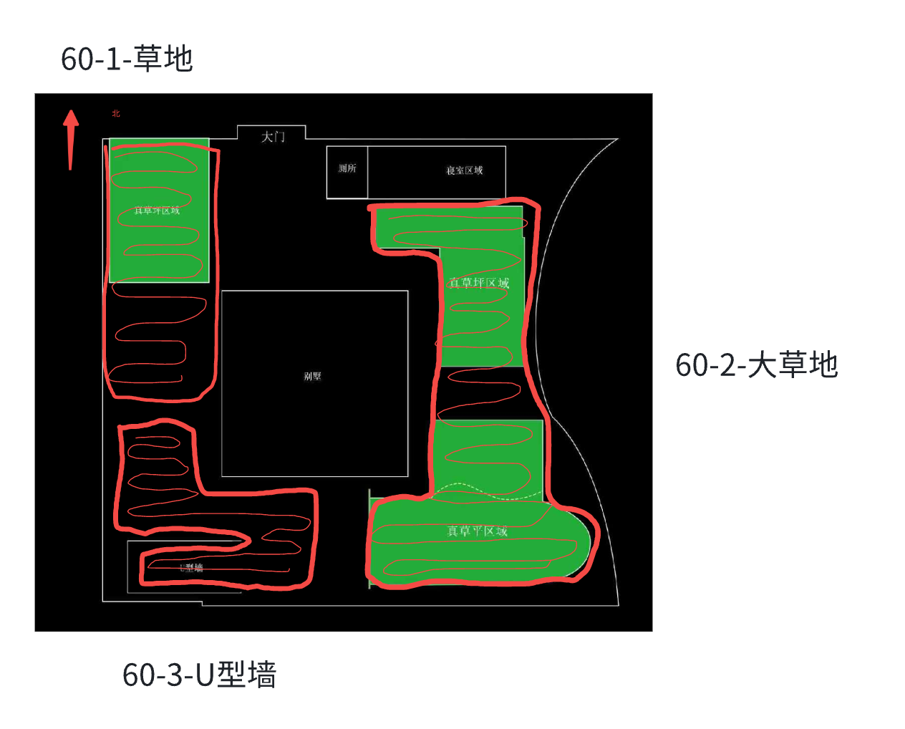
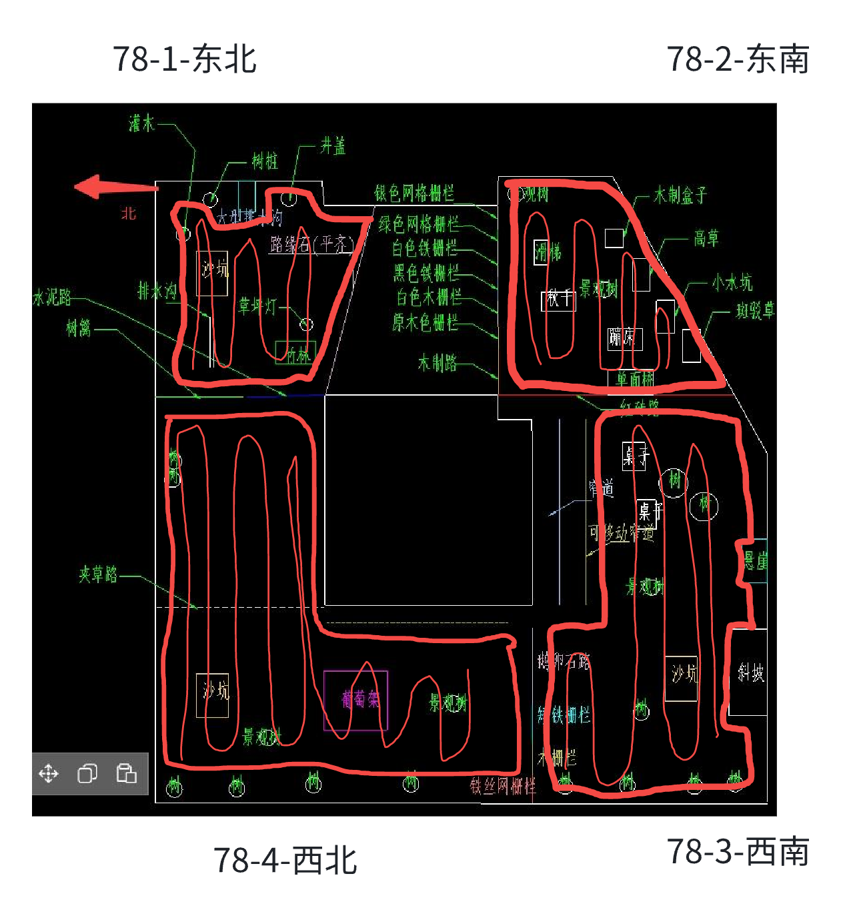
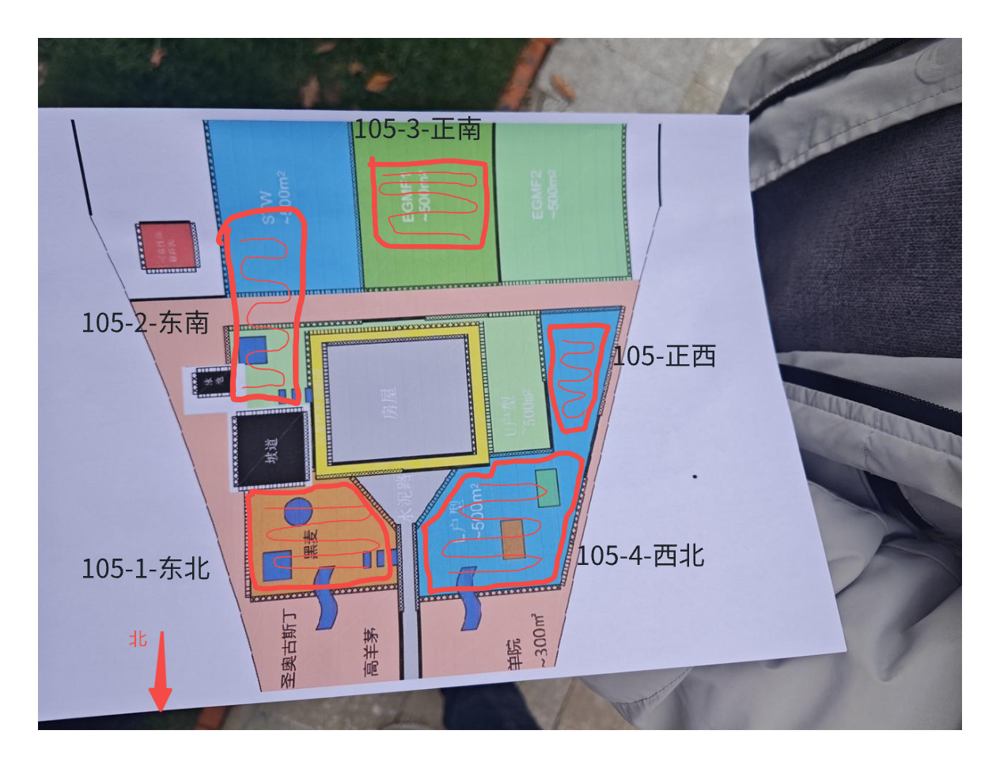
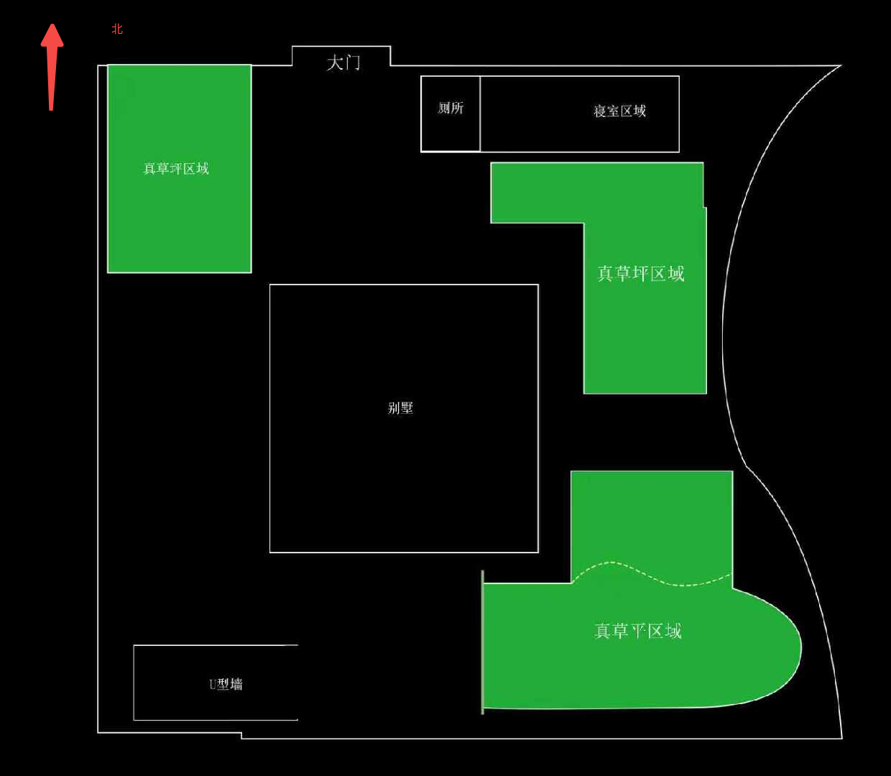
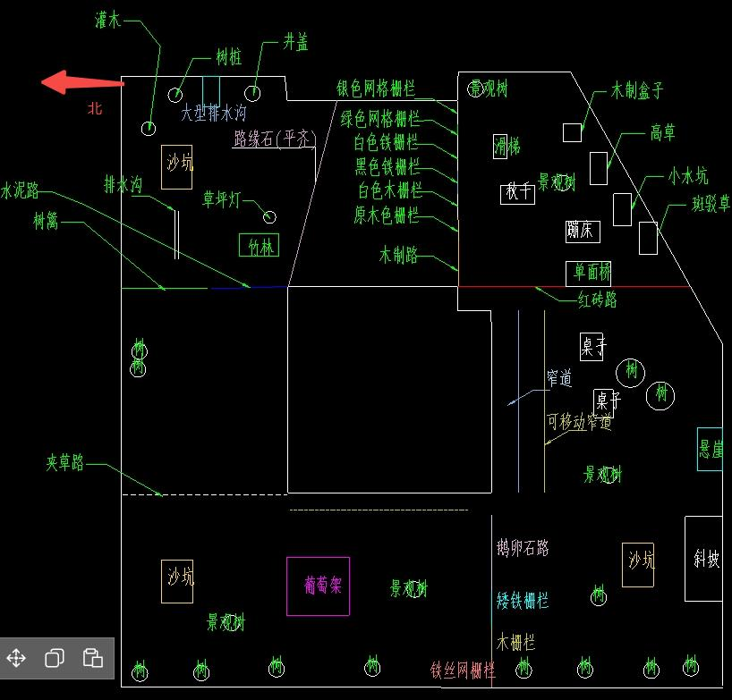
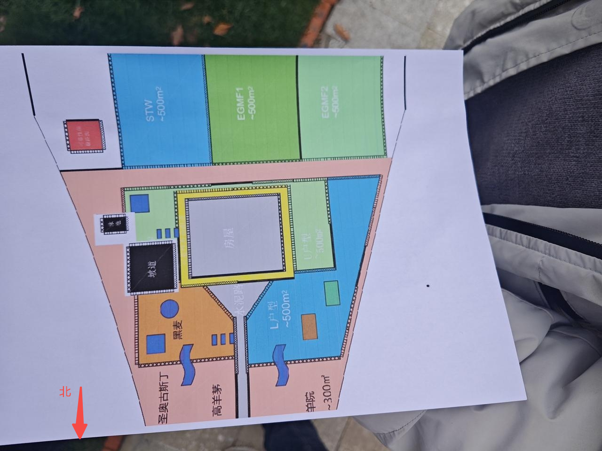

# VSLAM定位数据采集需求-1014

# 1. 建图+割草数据

## 1.1 场地

* 60栋

* 78栋

* 105栋

## 1.2 采集要求

* 动作

  * 沿边建图

    * 顺时针一次

  * 2m弓字版本割草

    * 注意，沿东西方向走弓字

  * 正常弓字割草

* 其他要求

  * 多次出桩采集需求

    * 固定基站位置，改变桩位置，采集机器出桩数据每个场地选择2\~3个位置

  * 日志、图像均本地存储后导出压缩上传到飞书云盘

  * 每个场地的多次建图、割草要限制机器固定使用同一台机器

  * 78-4-西北要求多次建图：

    * 晴天14点

    * 晴天18点

    * 阴天14点

    * 阴天18点

# 2. 场地信息

