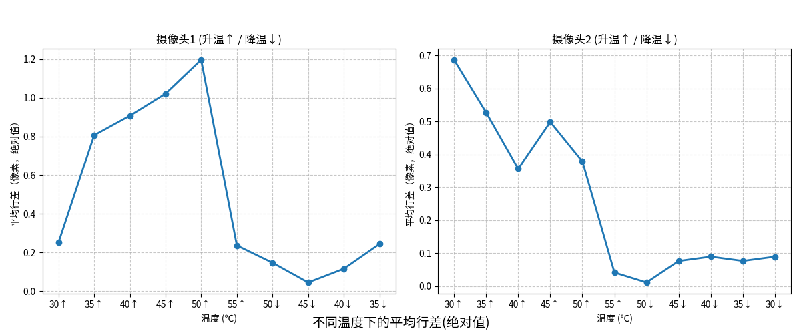
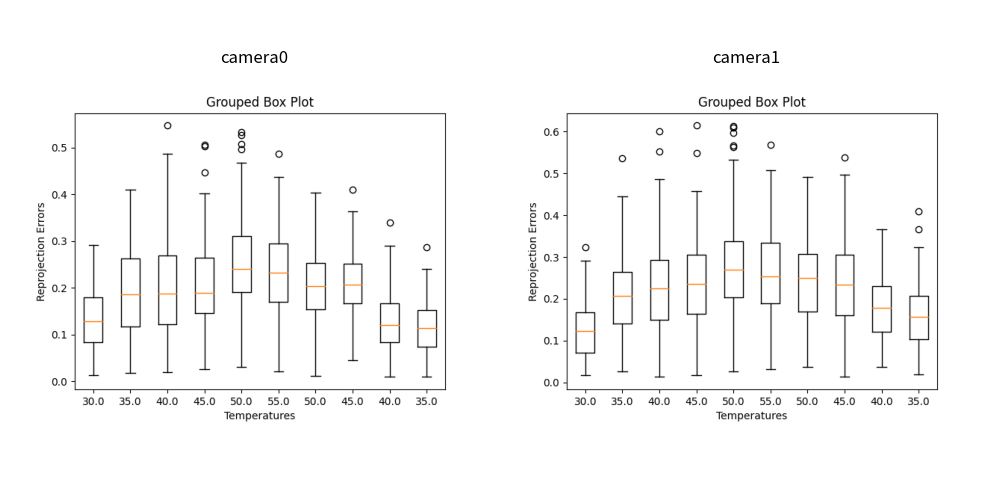
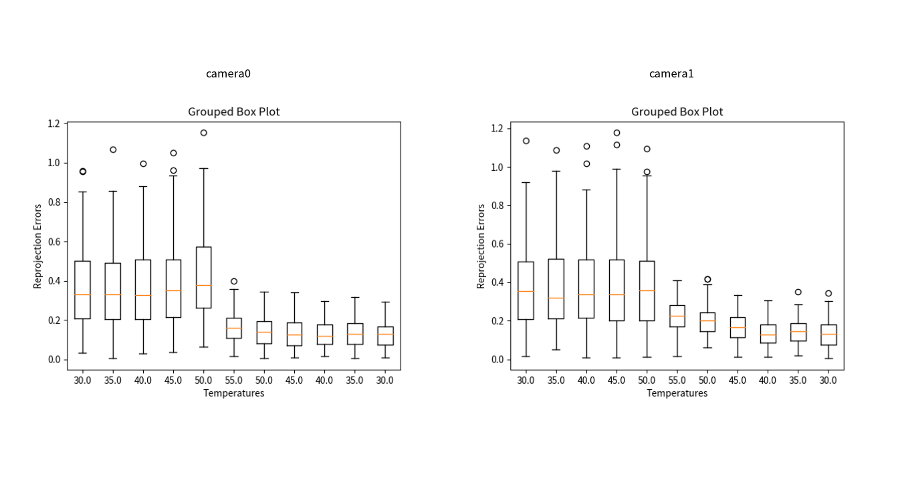

# 温补测试情况更新

# 一、20250617 新采数据需求

## 1.1 不同温度下地标定

### 1.1.1、温度设定

### 1.12、手动单模组标定

1. 双目内参&基线（相机不动，标定板动）

   1. 相机置于1米高桌子边缘，视野水平朝前，相机与桌面边缘对齐（避免遮挡下侧视野）

   2. 相机前方以0.3x0.3m标定板为中心，画3x3宫格。

   3. 九宫格如图所示，包含标定板在内共有三类点位，红、绿、白。

   4. 确定三个距离：0.15 m，0.5m， 1.0m

   5. 0.15m米在红+绿点位执行动作

   6. 0.5m， 1.0m在，绿+白点位执行动作

   7. 点位间的切换，中速，不要过快。

   8. 动作如下：

      1. 标定板航向角方向（左右摆头）摆动60°，再反方向摆动120°，大约1.5s

      2. 标定板俯仰角方向（上下点头）摆动60°，再反方向摆动120°，大约1.5s

2. 双目-IMU外参标定（标定板不动，相机动）

   1. 标定板平放于地面（九宫格的中心块），相机位置置于红色点位位置大约0.5m高度

      1. 在0.5m高度（相机位置移动，但始终对准标定板中心，类似大摆锤）

         1. 相机向下对准标定板中心开始，航向角方向摆动60°，再反方向摆动120°，左右分别移动0.75米，进行3个来回，大约6s

         2. 相机向下对准标定板中心，俯仰角方向摆动60°，再反方向摆动120°，上下分别移动0.75米，进行3个来回，大约6s

         3. 相机向下对准标定板中心，滚转角方向摆动60°，再反方向摆动120°，原地旋转，进行3个来回，大约6s

      2. 在0.5m高度（相机位置移动，但始终朝向前方，类似平移）

         1. 中速上下分别移动0.75米，进行3个来回，大约6s

         2. 中速左右分别移动0.75米，进行3个来回，大约6s

         3. 中速前后分别移动0.75米，进行3个来回，大约6s

   2. 参考

## 1.2、静止采集图像、温度

1. 多个模组，静止摆放于低温变材质上

# 二、20250610 标定板拍图测试

## 1.1 实验现象

1. 行差情况

   1. 不同次集中采集，行差分布区间不一致，有的很大有的很小

   2. 同次集中采集，没有随温度变化的明显规律

2. PNP重投影误差情况

   1. 不同次集中采集，行差分布区间不一致，有的很大有的很小

   2. 同次集中采集，没有随温度变化的明显规律

3. 部分结论

   1. 怀疑是第二天直接进入高温，模组没有达到热平衡导致。

   2. 目前实验只能定性说明模组重投影误差、行差随温度有比较大的变化。

      1. 需要考虑进一步的复采，不过优先级没有重新标定高。

## 1.2 结果记录

* 摄像头1：舜宇

  * 舜宇的测温顺序：

  * 第一天 30(温室未开) 35 40 45 50&#x20;

  * 第二天 直接升温至55 降温：50 45 40 35(温室关，开始降温）

* 摄像头2：联合

  * 联合的测温顺序：

  * 第一天 升温： 35 40 45 50

  * &#x20;第二天 补测：30° 直接升温至55 降温：50 45 40 35 30

# 三、20250611 标定测试

## 2.1 实验现象

1. 受限于温室运用时间以及主板内存限制（无法长时间采图），只采集了同一个模组31.5°、44°下的标定数据。每个温度下标定了两次。

2. cx、cy比较稳定，大约都在0.5个像素内波动。和温度关系不大。

3. fx fy波动范围大概在3以内。同温度多次标定的波动，和不同温度下的波动差不多大。

4. 畸变参数非常不稳定，系数从0.x到290+变动不等

## 2.2 结果记录

摄像头1（舜宇） 31.5°

摄像头1（舜宇）44°

# 四、其他信息

1. 去畸变后看点的波动。&#x20;

   1. 可以看出标定是否可信、稳定。如果稳定，说明温度对于畸变的影响不显著（畸变参数随温度的波动，没有同温度下的波动来的大）。

   2. 选取了升温30采集的舜宇左右目图像，使用4组内参数 分别去畸变后检测角点：36\*4=144个角点均可检测，角点坐标的变化范围：x方向最大0.78像素、y方向最大1.20像素。

2. 确定对于算法的影响情况

   * 稳妥方案：不同温度下，对于模组进行标定，得到标定结果，拿到同一温度下跑vslam算法

     1. 苏州整温室，在温室进行标定（人手标），不同温度标定，需要确保模组热稳定

     2. 有没有办法机器带着加温设备跑？或者在温室内跑？

   * 临时方案：舜宇模组换到机器上

     1. 在视觉实验室采集数据，看不同温度的标定参数情况下的波动

3. 确定到底要补什么（基于第2点）

   * 需要找模组参数随温度变化的规律

     1. 各个模组如果变化不同，则需要采用类似于温度标定的方案

     2. 不控制标定方法，畸变参数变化幅度太大，没法找规律

# 五、整机 / 双目温升测试 — 感知与定位输出结论

> 本节补充「白盒采数 / 双目温升」场景下，**感知链路输出**与**定位链路输出**的可验收结论；模组侧高温标定与行差规律仍以第二～四节为准。  
> **来源**：飞书群「双目温升测试」讨论纪要（含原型机如 83-258、V1225 等，工况约 **70°C / 75°C**，实测板温约 71.7°C / 75.7°C）；定位精度量化见同目录 `001_IMU 高温下定位精度分析报告`。

## 5.1 感知（Perception）输出结论

- **白天泛物体避障**：在约 70°C、75°C 高温工况下，**泛物体避障均成功触发并完成避让**（障碍物均被避开）。
- **图像可用性**：采集图像观感正常，**未因高温出现明显不可用画质**，可作为该工况下感知输入仍有效的旁证。

*说明：上述为功能与主观观感结论；若需写入正式报告，建议补充用例编号、场景（光照：顺光/逆光/强光等）与统计口径。*

## 5.2 定位 / 标定相关输出结论

- **标定板角点检测**：在约 70°C、75°C 下，标定板在各摆放位置的 **角点检测率均高于 90%**，按当时评审口径 **判定为通过**。
- **VIO / 融合定位精度（IMU 侧温升）**：IMU 逐渐升至并维持 **70°C～75°C** 时，VIO bias 估计可收敛；**稳定高温下对定位精度无显著负面影响**。升温段（约 7°C→70°C）xy 轴 bias 估计随温度呈近似线性变化，**温度稳定后收敛**。量化指标见 `001_IMU 高温下定位精度分析报告/IMU 高温下定位精度分析报告.md`（例如稳定 70°C 附近 VIO RMSE 约 **0.068 m**、融合 RMSE 约 **0.036 m** 量级，以原文表格为准）。

## 5.3 与第二节「温室标定板」结论的关系（避免混读）

- **第二节**：多温度点（30～55°C）下 **模组光学/标定参数**（行差、重投影、内参稳定性）的实验室结论，强调热平衡与畸变参数不稳定等问题。
- **本节**：**整机白盒 + 双目模组约 70°C/75°C** 时，**端到端感知避障是否可用**、**标定板角点是否仍达标**、以及 **IMU 温升对 VIO/融合 RMSE** 的结论；二者场景与指标不同，**不宜互相替代**。
